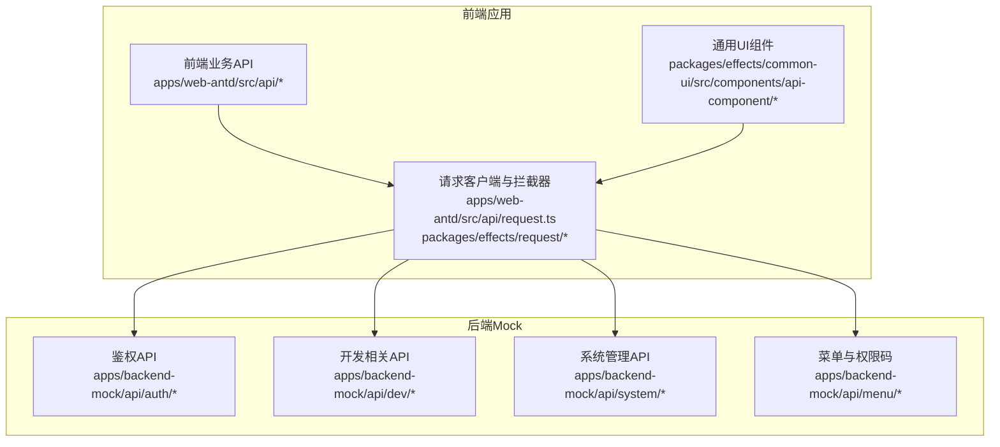
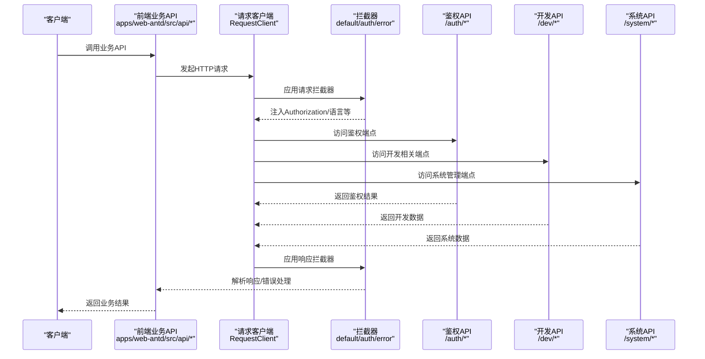
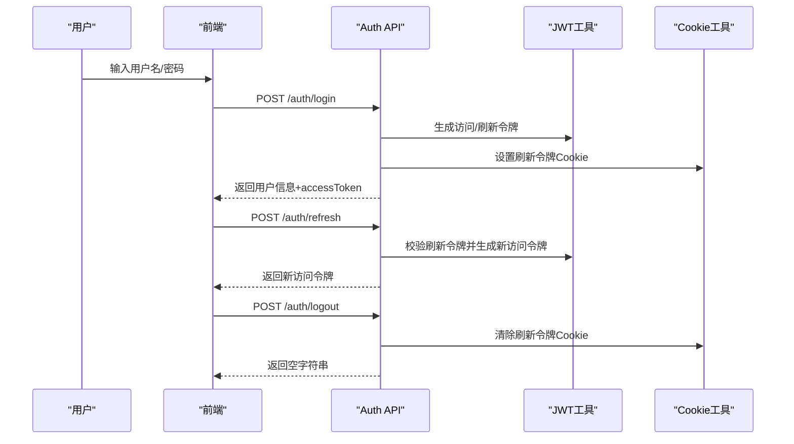
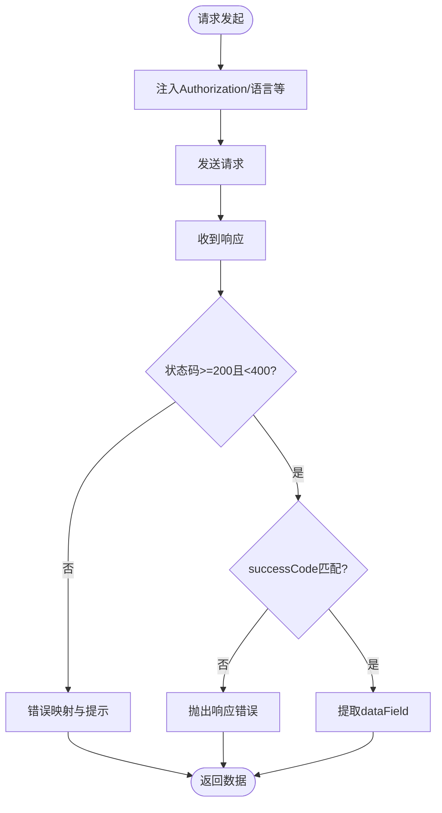
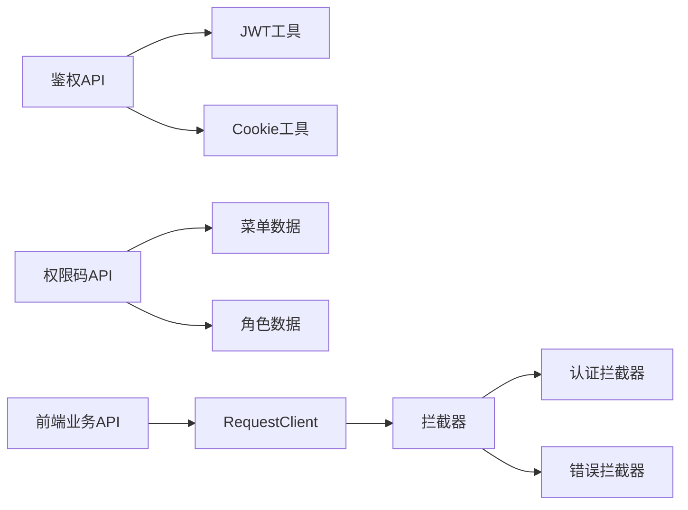

# API参考

<cite>
**本文引用的文件**
- [apps/backend-mock/api/auth/login.post.ts](file://apps/backend-mock/api/auth/login.post.ts)
- [apps/backend-mock/api/auth/logout.post.ts](file://apps/backend-mock/api/auth/logout.post.ts)
- [apps/backend-mock/api/auth/refresh.post.ts](file://apps/backend-mock/api/auth/refresh.post.ts)
- [apps/backend-mock/api/auth/codes.ts](file://apps/backend-mock/api/auth/codes.ts)
- [apps/web-antd/src/api/request.ts](file://apps/web-antd/src/api/request.ts)
- [packages/effects/request/src/request-client/request-client.ts](file://packages/effects/request/src/request-client/request-client.ts)
- [packages/effects/request/src/request-client/preset-interceptors.ts](file://packages/effects/request/src/request-client/preset-interceptors.ts)
- [apps/web-antd/src/api/core/auth.ts](file://apps/web-antd/src/api/core/auth.ts)
- [apps/web-antd/src/api/core/user.ts](file://apps/web-antd/src/api/core/user.ts)
- [apps/web-antd/src/api/core/menu.ts](file://apps/web-antd/src/api/core/menu.ts)
- [packages/effects/common-ui/src/components/api-component/api-component.vue](file://packages/effects/common-ui/src/components/api-component/api-component.vue)
- [docs/src/components/common-ui/vben-api-component.md](file://docs/src/components/common-ui/vben-api-component.md)
- [apps/backend-mock/api/dev/story/.post.ts](file://apps/backend-mock/api/dev/story/.post.ts)
- [apps/backend-mock/api/dev/bug/.post.ts](file://apps/backend-mock/api/dev/bug/.post.ts)
- [apps/backend-mock/api/dev/module/.post.ts](file://apps/backend-mock/api/dev/module/.post.ts)
- [apps/backend-mock/api/dev/project/.post.ts](file://apps/backend-mock/api/dev/project/.post.ts)
- [apps/backend-mock/api/dev/task/.post.ts](file://apps/backend-mock/api/dev/task/.post.ts)
- [apps/backend-mock/api/dev/versions/.post.ts](file://apps/backend-mock/api/dev/versions/.post.ts)
- [apps/backend-mock/api/system/dept/.post.ts](file://apps/backend-mock/api/system/dept/.post.ts)
- [apps/backend-mock/api/system/dept/[id].delete.ts](file://apps/backend-mock/api/system/dept/[id].delete.ts)
- [apps/backend-mock/api/system/dict/.post.ts](file://apps/backend-mock/api/system/dict/.post.ts)
- [apps/backend-mock/api/system/user/list.ts](file://apps/backend-mock/api/system/user/list.ts)
- [apps/backend-mock/api/system/role/list.ts](file://apps/backend-mock/api/system/role/list.ts)
- [apps/backend-mock/api/menu/menuJSON.ts](file://apps/backend-mock/api/menu/menuJSON.ts)
- [apps/backend-mock/utils/jwt-utils.ts](file://apps/backend-mock/utils/jwt-utils.ts)
- [apps/backend-mock/utils/cookie-utils.ts](file://apps/backend-mock/utils/cookie-utils.ts)
- [apps/backend-mock/utils/response.ts](file://apps/backend-mock/utils/response.ts)
- [apps/backend-mock/utils/arrayExtendApi.ts](file://apps/backend-mock/utils/arrayExtendApi.ts)
</cite>

## 目录

1. [简介](#简介)
2. [项目结构](#项目结构)
3. [核心组件](#核心组件)
4. [架构总览](#架构总览)
5. [详细组件分析](#详细组件分析)
6. [依赖关系分析](#依赖关系分析)
7. [性能考量](#性能考量)
8. [故障排查指南](#故障排查指南)
9. [结论](#结论)
10. [附录](#附录)

## 简介

本文件为 Vben Admin 的 API 参考文档，覆盖后端 Mock API、前端请求客户端与拦截器、以及通用 UI 组件 API。内容包括：

- HTTP API：鉴权、菜单、用户、系统与开发相关接口
- 组件 API：ApiComponent（远程选项加载与表单联动）
- 工具函数 API：请求客户端、拦截器、JWT/Cookie 工具与响应封装
- 类型定义与接口说明
- 版本历史与变更记录
- 使用限制、最佳实践、错误码与异常处理
- 测试与验证方法、性能特征与使用建议
- 实际使用示例与集成指南

## 项目结构

Vben Admin 的 API 分布在多个应用与包中：

- 后端 Mock API：位于 apps/backend-mock/api 下，按功能域划分（auth、dev、system、menu 等），采用 Nitro H3 路由风格
- 前端请求层：apps/web-antd/src/api 下定义业务 API；packages/effects/request 提供统一请求客户端与拦截器
- 通用 UI 组件：packages/effects/common-ui 提供 ApiComponent，支持将任意组件与远程数据源对接

图表来源

- [apps/web-antd/src/api/request.ts:1-124](file://apps/web-antd/src/api/request.ts#L1-L124)
- [packages/effects/request/src/request-client/request-client.ts:1-165](file://packages/effects/request/src/request-client/request-client.ts#L1-L165)
- [packages/effects/common-ui/src/components/api-component/api-component.vue:1-300](file://packages/effects/common-ui/src/components/api-component/api-component.vue#L1-L300)
- [apps/backend-mock/api/auth/login.post.ts:1-43](file://apps/backend-mock/api/auth/login.post.ts#L1-L43)
- [apps/backend-mock/api/dev/story/.post.ts:1-16](file://apps/backend-mock/api/dev/story/.post.ts#L1-L16)
- [apps/backend-mock/api/system/dept/.post.ts:1-16](file://apps/backend-mock/api/system/dept/.post.ts#L1-L16)
- [apps/backend-mock/api/menu/menuJSON.ts](file://apps/backend-mock/api/menu/menuJSON.ts)

章节来源

- [apps/web-antd/src/api/request.ts:1-124](file://apps/web-antd/src/api/request.ts#L1-L124)
- [packages/effects/request/src/request-client/request-client.ts:1-165](file://packages/effects/request/src/request-client/request-client.ts#L1-L165)
- [packages/effects/common-ui/src/components/api-component/api-component.vue:1-300](file://packages/effects/common-ui/src/components/api-component/api-component.vue#L1-L300)
- [apps/backend-mock/api/auth/login.post.ts:1-43](file://apps/backend-mock/api/auth/login.post.ts#L1-L43)

## 核心组件

本节概述前端请求客户端与拦截器、通用 UI 组件，以及它们如何协同工作。

- 请求客户端 RequestClient
  - 支持 GET/POST/PUT/DELETE 通用请求方法
  - 支持请求/响应拦截器注册
  - 支持文件上传/下载与 SSE
  - 默认 JSON Content-Type、10 秒超时
- 预置拦截器
  - defaultResponseInterceptor：按 code/data 字段解析响应，支持 successCode 与 dataField 回调
  - authenticateResponseInterceptor：401 时自动刷新令牌或重新认证
  - errorMessageResponseInterceptor：网络错误、超时、HTTP 状态码映射提示
- 通用 UI 组件 ApiComponent
  - 将任意组件与远程 API 对接，自动拉取选项、处理 loading、支持 v-model 绑定
  - 支持 beforeFetch/afterFetch 钩子、visibleEvent 懒加载、autoSelect 自动选择策略

章节来源

- [packages/effects/request/src/request-client/request-client.ts:1-165](file://packages/effects/request/src/request-client/request-client.ts#L1-L165)
- [packages/effects/request/src/request-client/preset-interceptors.ts:1-166](file://packages/effects/request/src/request-client/preset-interceptors.ts#L1-L166)
- [packages/effects/common-ui/src/components/api-component/api-component.vue:1-300](file://packages/effects/common-ui/src/components/api-component/api-component.vue#L1-L300)

## 架构总览

下图展示从前端业务 API 到后端 Mock API 的调用链路，以及拦截器对认证与错误的处理。

图表来源

- [apps/web-antd/src/api/request.ts:1-124](file://apps/web-antd/src/api/request.ts#L1-L124)
- [packages/effects/request/src/request-client/preset-interceptors.ts:1-166](file://packages/effects/request/src/request-client/preset-interceptors.ts#L1-L166)
- [apps/backend-mock/api/auth/login.post.ts:1-43](file://apps/backend-mock/api/auth/login.post.ts#L1-L43)
- [apps/backend-mock/api/dev/story/.post.ts:1-16](file://apps/backend-mock/api/dev/story/.post.ts#L1-L16)
- [apps/backend-mock/api/system/dept/.post.ts:1-16](file://apps/backend-mock/api/system/dept/.post.ts#L1-L16)

## 详细组件分析

### HTTP API 参考

- 鉴权相关
  - POST /auth/login
    - 参数：用户名、密码
    - 成功返回：用户信息与 accessToken
    - 失败返回：400/403
    - 依赖：JWT 生成、Cookie 设置
  - POST /auth/logout
    - 参数：无
    - 成功返回：空字符串
    - 依赖：清除刷新令牌 Cookie
  - POST /auth/refresh
    - 参数：Cookie 中的刷新令牌
    - 成功返回：新的访问令牌
    - 失败返回：403
    - 依赖：刷新令牌校验、用户查找
  - GET /auth/codes
    - 参数：无
    - 成功返回：当前用户的权限码数组
    - 依赖：角色-菜单-权限码映射、去重

- 开发相关（Mock 示例）
  - POST /dev/bug
  - POST /dev/story
  - POST /dev/module
  - POST /dev/project
  - POST /dev/task
  - POST /dev/versions
  - 以上端点均进行访问令牌校验并返回成功响应

- 系统管理（Mock 示例）
  - POST /system/dept
  - DELETE /system/dept/[id]
  - POST /system/dict
  - 以上端点均进行访问令牌校验并返回成功响应

- 其他
  - GET /user/info
    - 返回当前用户信息
  - GET /menu/all
    - 返回用户所有菜单路由

章节来源

- [apps/backend-mock/api/auth/login.post.ts:1-43](file://apps/backend-mock/api/auth/login.post.ts#L1-L43)
- [apps/backend-mock/api/auth/logout.post.ts:1-18](file://apps/backend-mock/api/auth/logout.post.ts#L1-L18)
- [apps/backend-mock/api/auth/refresh.post.ts:1-36](file://apps/backend-mock/api/auth/refresh.post.ts#L1-L36)
- [apps/backend-mock/api/auth/codes.ts:1-29](file://apps/backend-mock/api/auth/codes.ts#L1-L29)
- [apps/backend-mock/api/dev/bug/.post.ts:1-16](file://apps/backend-mock/api/dev/bug/.post.ts#L1-L16)
- [apps/backend-mock/api/dev/story/.post.ts:1-16](file://apps/backend-mock/api/dev/story/.post.ts#L1-L16)
- [apps/backend-mock/api/dev/module/.post.ts:1-16](file://apps/backend-mock/api/dev/module/.post.ts#L1-L16)
- [apps/backend-mock/api/dev/project/.post.ts:1-16](file://apps/backend-mock/api/dev/project/.post.ts#L1-L16)
- [apps/backend-mock/api/dev/task/.post.ts:1-16](file://apps/backend-mock/api/dev/task/.post.ts#L1-L16)
- [apps/backend-mock/api/dev/versions/.post.ts:1-16](file://apps/backend-mock/api/dev/versions/.post.ts#L1-L16)
- [apps/backend-mock/api/system/dept/.post.ts:1-16](file://apps/backend-mock/api/system/dept/.post.ts#L1-L16)
- [apps/backend-mock/api/system/dept/[id].delete.ts](file://apps/backend-mock/api/system/dept/[id].delete.ts#L1-L16)
- [apps/backend-mock/api/system/dict/.post.ts:1-16](file://apps/backend-mock/api/system/dict/.post.ts#L1-L16)
- [apps/web-antd/src/api/core/user.ts:1-11](file://apps/web-antd/src/api/core/user.ts#L1-L11)
- [apps/web-antd/src/api/core/menu.ts:1-11](file://apps/web-antd/src/api/core/menu.ts#L1-L11)

### 组件 API 参考：ApiComponent

- 作用
  - 将任意组件与远程 API 对接，自动拉取选项、处理 loading、支持 v-model 绑定
- 主要属性（Props）
  - component：目标组件
  - api：获取数据的函数
  - params：传递给 api 的参数
  - resultField：从返回体中提取选项数组的字段路径
  - labelField/valueField/disabledField/childrenField：字段映射
  - optionsPropName/modelPropName：目标组件接收 options 与 v-model 的属性名
  - immediate：是否立即调用 api
  - alwaysLoad：每次 visibleEvent 触发时重新请求
  - beforeFetch/afterFetch：请求前后钩子
  - options：直接传入选项数据，作为回退
  - visibleEvent：触发懒加载的事件名
  - loadingSlot：显示“加载中”的插槽名
  - autoSelect：自动选择策略（first/last/one/函数/false）
  - numberToString：是否将数值转换为字符串
- 主要事件
  - optionsChange：选项变化时触发
- 主要暴露方法
  - getComponentRef()：获取被包装组件实例
  - updateParam(newParams)：合并并更新请求参数
  - getOptions()：返回已加载的选项
  - getValue()：返回当前绑定值

章节来源

- [packages/effects/common-ui/src/components/api-component/api-component.vue:1-300](file://packages/effects/common-ui/src/components/api-component/api-component.vue#L1-L300)
- [docs/src/components/common-ui/vben-api-component.md:130-154](file://docs/src/components/common-ui/vben-api-component.md#L130-L154)

### 工具函数 API 参考

- 请求客户端 RequestClient
  - 方法：get/post/put/delete/request
  - 属性：addRequestInterceptor/addResponseInterceptor、upload/download、postSSE/requestSSE
  - 配置：headers、responseReturn、timeout、paramsSerializer
- 预置拦截器
  - defaultResponseInterceptor(codeField, dataField, successCode)
  - authenticateResponseInterceptor(client, doReAuthenticate, doRefreshToken, enableRefreshToken, formatToken)
  - errorMessageResponseInterceptor(makeErrorMessage?)

章节来源

- [packages/effects/request/src/request-client/request-client.ts:1-165](file://packages/effects/request/src/request-client/request-client.ts#L1-L165)
- [packages/effects/request/src/request-client/preset-interceptors.ts:1-166](file://packages/effects/request/src/request-client/preset-interceptors.ts#L1-L166)

### 类型定义与接口说明

- 鉴权 API 类型
  - LoginParams：username/password
  - LoginResult：accessToken
  - RefreshTokenResult：data(status)
- 用户与菜单 API
  - getUserInfoApi：返回 UserInfo
  - getAllMenusApi：返回路由记录数组
- ApiComponent 类型
  - OptionsItem：包含 label/value/disabled/children 等字段的对象
  - Props 接口：上述所有属性的类型定义
  - exposed 方法类型：getComponentRef/getOptions/getValue/updateParam

章节来源

- [apps/web-antd/src/api/core/auth.ts:1-52](file://apps/web-antd/src/api/core/auth.ts#L1-L52)
- [apps/web-antd/src/api/core/user.ts:1-11](file://apps/web-antd/src/api/core/user.ts#L1-L11)
- [apps/web-antd/src/api/core/menu.ts:1-11](file://apps/web-antd/src/api/core/menu.ts#L1-L11)
- [packages/effects/common-ui/src/components/api-component/api-component.vue:14-73](file://packages/effects/common-ui/src/components/api-component/api-component.vue#L14-L73)

### 版本历史与变更记录

- ApiComponent 新增 autoSelect 策略（first/last/one/函数/false），用于自动选择首个/末个/唯一选项或自定义选择逻辑
- 文档补充了 props 与 exposed 方法的详细说明与版本要求

章节来源

- [docs/src/components/common-ui/vben-api-component.md:130-154](file://docs/src/components/common-ui/vben-api-component.md#L130-L154)

### 使用限制与最佳实践

- 鉴权
  - 所有受保护端点需携带有效的访问令牌
  - 刷新令牌机制仅在启用时生效，避免重复刷新导致的风暴
- 请求拦截器
  - 建议统一通过 defaultResponseInterceptor 定义 code/data 字段与 successCode
  - authenticateResponseInterceptor 会自动排队并发请求并重试
- ApiComponent
  - 合理使用 immediate/alwaysLoad/visibleEvent 控制加载时机
  - 使用 beforeFetch/afterFetch 做参数预处理与结果后处理
  - autoSelect 仅在首次加载且 modelValue 未设置时生效

章节来源

- [apps/web-antd/src/api/request.ts:1-124](file://apps/web-antd/src/api/request.ts#L1-L124)
- [packages/effects/request/src/request-client/preset-interceptors.ts:1-166](file://packages/effects/request/src/request-client/preset-interceptors.ts#L1-L166)
- [packages/effects/common-ui/src/components/api-component/api-component.vue:1-300](file://packages/effects/common-ui/src/components/api-component/api-component.vue#L1-L300)

### 错误码与异常处理

- HTTP 状态码映射
  - 400：请求参数错误
  - 401：未授权/令牌无效
  - 403：禁止访问
  - 404：资源不存在
  - 408：请求超时
  - 其他：服务器内部错误
- 响应拦截器行为
  - defaultResponseInterceptor：根据 successCode 与 dataField 解析响应体
  - authenticateResponseInterceptor：401 时尝试刷新令牌或触发重新认证
  - errorMessageResponseInterceptor：根据状态码与网络错误生成本地化提示

章节来源

- [packages/effects/request/src/request-client/preset-interceptors.ts:112-166](file://packages/effects/request/src/request-client/preset-interceptors.ts#L112-L166)

### API 调用流程与序列图

#### 鉴权流程（登录/刷新/登出）

图表来源

- [apps/backend-mock/api/auth/login.post.ts:1-43](file://apps/backend-mock/api/auth/login.post.ts#L1-L43)
- [apps/backend-mock/api/auth/logout.post.ts:1-18](file://apps/backend-mock/api/auth/logout.post.ts#L1-L18)
- [apps/backend-mock/api/auth/refresh.post.ts:1-36](file://apps/backend-mock/api/auth/refresh.post.ts#L1-L36)
- [apps/backend-mock/utils/jwt-utils.ts](file://apps/backend-mock/utils/jwt-utils.ts)
- [apps/backend-mock/utils/cookie-utils.ts](file://apps/backend-mock/utils/cookie-utils.ts)

#### 请求拦截器流程（认证与错误）

图表来源

- [packages/effects/request/src/request-client/preset-interceptors.ts:9-45](file://packages/effects/request/src/request-client/preset-interceptors.ts#L9-L45)

### 性能特征与使用建议

- 请求客户端
  - 默认超时 10 秒，可根据环境调整
  - 支持多种 paramsSerializer（brackets/comma/indices/repeat），按需选择以适配后端
- 拦截器
  - authenticateResponseInterceptor 会排队并发刷新请求，减少重复刷新
  - 建议在高并发场景下合理设置 enableRefreshToken 与重试策略
- ApiComponent
  - 支持懒加载与可见性事件，降低初始渲染压力
  - 使用 numberToString 可避免数值/字符串混用问题

章节来源

- [packages/effects/request/src/request-client/request-client.ts:15-37](file://packages/effects/request/src/request-client/request-client.ts#L15-L37)
- [packages/effects/request/src/request-client/preset-interceptors.ts:47-110](file://packages/effects/request/src/request-client/preset-interceptors.ts#L47-L110)
- [packages/effects/common-ui/src/components/api-component/api-component.vue:1-300](file://packages/effects/common-ui/src/components/api-component/api-component.vue#L1-L300)

### 测试与验证方法

- 单元测试
  - 使用 Vitest 编写请求拦截器与工具函数的单元测试
  - 对鉴权 API 的 401/403 场景进行断言
- E2E 测试
  - 使用 Playwright 验证登录/刷新/登出流程
  - 验证 ApiComponent 在不同 autoSelect 策略下的行为
- Mock 数据
  - 使用 apps/backend-mock/utils/mock-data.ts 与各模块列表数据进行集成测试

章节来源

- [playground/**tests**/e2e/auth-login.spec.ts](file://playground/__tests__/e2e/auth-login.spec.ts)
- [apps/backend-mock/utils/response.ts](file://apps/backend-mock/utils/response.ts)

### 实际使用示例与集成指南

- 集成请求客户端
  - 在前端应用中创建 RequestClient 实例，注册拦截器，注入 Authorization 头
  - 通过 baseRequestClient 与 requestClient 区分是否需要自动解析响应体
- 使用鉴权 API
  - 登录成功后保存 accessToken，并在拦截器中自动附加到后续请求
  - 刷新令牌失败时触发重新认证流程
- 使用 ApiComponent
  - 传入目标组件与 api 函数，设置 labelField/valueField 等映射
  - 使用 immediate/visibleEvent 控制加载时机，使用 autoSelect 自动选择
  - 通过 beforeFetch/afterFetch 做参数与结果处理

章节来源

- [apps/web-antd/src/api/request.ts:1-124](file://apps/web-antd/src/api/request.ts#L1-L124)
- [apps/web-antd/src/api/core/auth.ts:1-52](file://apps/web-antd/src/api/core/auth.ts#L1-L52)
- [packages/effects/common-ui/src/components/api-component/api-component.vue:1-300](file://packages/effects/common-ui/src/components/api-component/api-component.vue#L1-L300)

## 依赖关系分析

- 前端业务 API 依赖请求客户端与拦截器
- 请求客户端依赖拦截器管理器、上传/下载与 SSE 模块
- 鉴权 API 依赖 JWT 与 Cookie 工具
- 权限码 API 依赖菜单与角色数据

图表来源

- [apps/backend-mock/api/auth/login.post.ts:1-43](file://apps/backend-mock/api/auth/login.post.ts#L1-L43)
- [apps/backend-mock/api/auth/codes.ts:1-29](file://apps/backend-mock/api/auth/codes.ts#L1-L29)
- [apps/backend-mock/utils/jwt-utils.ts](file://apps/backend-mock/utils/jwt-utils.ts)
- [apps/backend-mock/utils/cookie-utils.ts](file://apps/backend-mock/utils/cookie-utils.ts)
- [apps/web-antd/src/api/request.ts:1-124](file://apps/web-antd/src/api/request.ts#L1-L124)
- [packages/effects/request/src/request-client/preset-interceptors.ts:1-166](file://packages/effects/request/src/request-client/preset-interceptors.ts#L1-L166)

## 性能考量

- 合理设置超时与重试策略，避免长时间阻塞
- 使用 paramsSerializer 优化数组参数编码
- 在高并发场景下启用 authenticateResponseInterceptor 的队列机制
- 对长列表使用懒加载与分页，减少一次性渲染压力

## 故障排查指南

- 401 未授权
  - 检查访问令牌是否过期或格式是否正确
  - 若启用刷新令牌，确认刷新流程是否成功
- 网络错误/超时
  - 检查服务端可达性与防火墙设置
  - 调整超时时间与重试策略
- 响应解析失败
  - 确认 defaultResponseInterceptor 的 codeField/dataField 配置与后端一致
- ApiComponent 选项不更新
  - 检查 params 是否深度监听，immediate/alwaysLoad/visibleEvent 配置是否正确

章节来源

- [packages/effects/request/src/request-client/preset-interceptors.ts:112-166](file://packages/effects/request/src/request-client/preset-interceptors.ts#L112-L166)
- [packages/effects/common-ui/src/components/api-component/api-component.vue:228-237](file://packages/effects/common-ui/src/components/api-component/api-component.vue#L228-L237)

## 结论

本文档提供了 Vben Admin 的 API 参考，涵盖后端 Mock API、前端请求客户端与拦截器、以及通用 UI 组件的使用说明。通过统一的请求客户端与拦截器，结合鉴权与错误处理机制，能够快速构建稳定可靠的前端应用。建议在生产环境中替换为真实后端服务，并完善鉴权与安全策略。

## 附录

- 常用工具函数
  - JWT 工具：生成/校验访问令牌与刷新令牌
  - Cookie 工具：读取/设置/清除刷新令牌
  - 响应工具：统一的成功/错误响应封装
  - 数组扩展：去重等工具函数

章节来源

- [apps/backend-mock/utils/jwt-utils.ts](file://apps/backend-mock/utils/jwt-utils.ts)
- [apps/backend-mock/utils/cookie-utils.ts](file://apps/backend-mock/utils/cookie-utils.ts)
- [apps/backend-mock/utils/response.ts](file://apps/backend-mock/utils/response.ts)
- [apps/backend-mock/utils/arrayExtendApi.ts](file://apps/backend-mock/utils/arrayExtendApi.ts)
