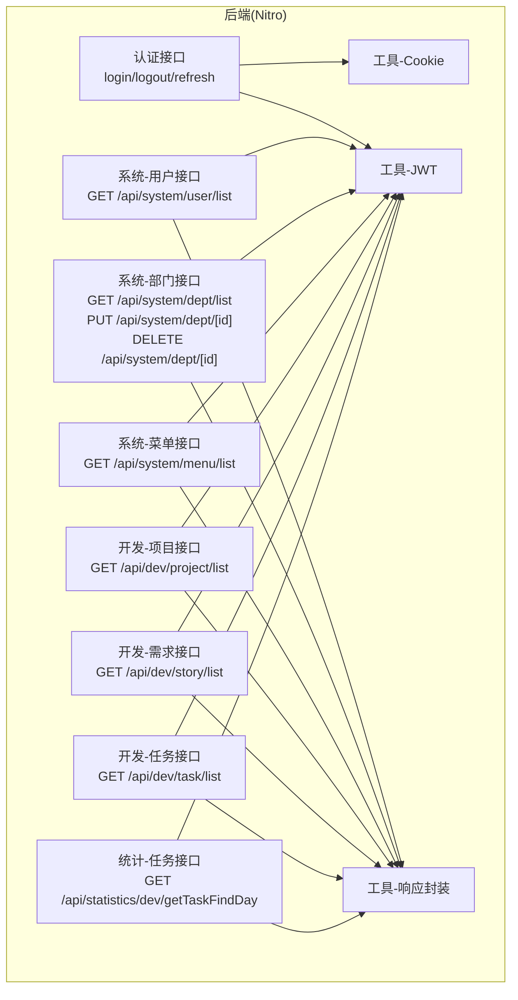
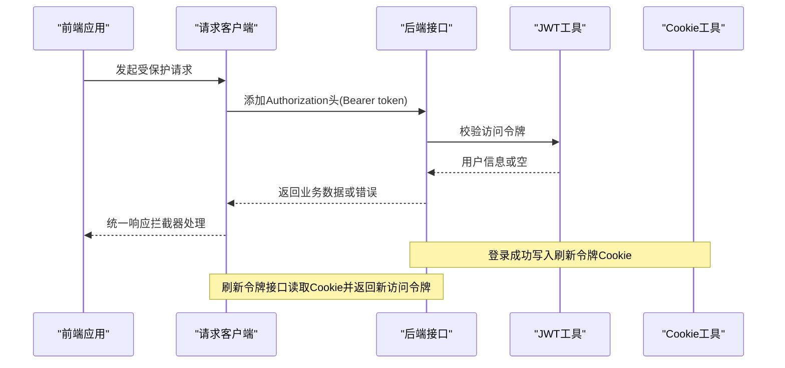
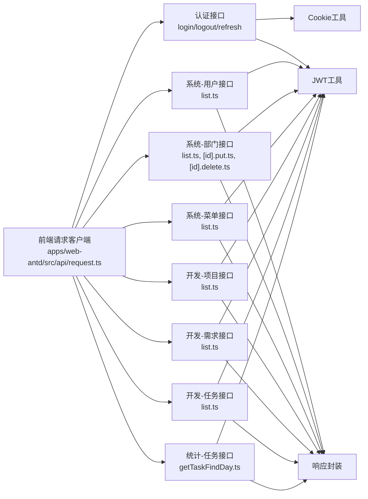
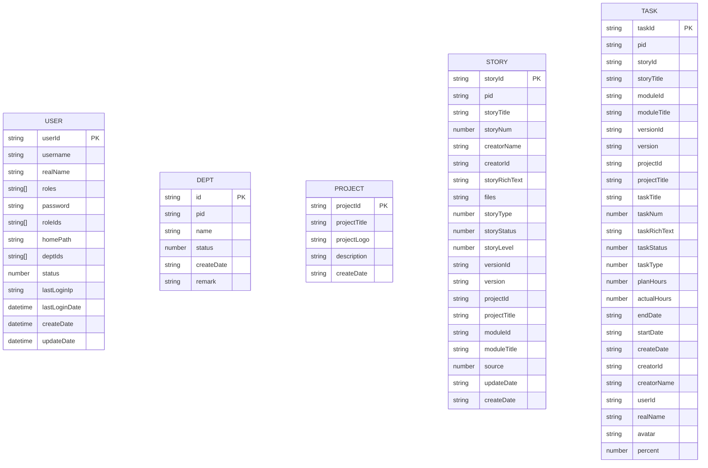

# HTTP API

<cite>
**本文引用的文件**
- [apps/backend-mock/api/auth/login.post.ts](file://apps/backend-mock/api/auth/login.post.ts)
- [apps/backend-mock/api/auth/logout.post.ts](file://apps/backend-mock/api/auth/logout.post.ts)
- [apps/backend-mock/api/auth/refresh.post.ts](file://apps/backend-mock/api/auth/refresh.post.ts)
- [apps/backend-mock/api/system/user/list.ts](file://apps/backend-mock/api/system/user/list.ts)
- [apps/backend-mock/api/system/dept/list.ts](file://apps/backend-mock/api/system/dept/list.ts)
- [apps/backend-mock/api/system/dept/[id].delete.ts](file://apps/backend-mock/api/system/dept/[id].delete.ts)
- [apps/backend-mock/api/system/dept/[id].put.ts](file://apps/backend-mock/api/system/dept/[id].put.ts)
- [apps/backend-mock/api/system/menu/list.ts](file://apps/backend-mock/api/system/menu/list.ts)
- [apps/backend-mock/api/dev/project/list.ts](file://apps/backend-mock/api/dev/project/list.ts)
- [apps/backend-mock/api/dev/story/list.ts](file://apps/backend-mock/api/dev/story/list.ts)
- [apps/backend-mock/api/dev/task/list.ts](file://apps/backend-mock/api/dev/task/list.ts)
- [apps/backend-mock/api/statistics/dev/getTaskFindDay.ts](file://apps/backend-mock/api/statistics/dev/getTaskFindDay.ts)
- [apps/backend-mock/utils/response.ts](file://apps/backend-mock/utils/response.ts)
- [apps/backend-mock/utils/jwt-utils.ts](file://apps/backend-mock/utils/jwt-utils.ts)
- [apps/backend-mock/utils/cookie-utils.ts](file://apps/backend-mock/utils/cookie-utils.ts)
- [apps/web-antd/src/api/request.ts](file://apps/web-antd/src/api/request.ts)
</cite>

## 目录

1. [简介](#简介)
2. [项目结构](#项目结构)
3. [核心组件](#核心组件)
4. [架构总览](#架构总览)
5. [详细组件分析](#详细组件分析)
6. [依赖关系分析](#依赖关系分析)
7. [性能考量](#性能考量)
8. [故障排查指南](#故障排查指南)
9. [结论](#结论)
10. [附录](#附录)

## 简介

本文件为 Vben Admin 的 HTTP API 文档，覆盖认证、开发管理、系统管理与统计相关接口。文档基于仓库中的 Nitro 后端 Mock 实现与前端请求封装，提供端点清单、请求/响应规范、错误处理、认证与权限、版本控制与兼容性、最佳实践与性能优化建议。

## 项目结构

后端采用 Nitro 路由风格，按功能域划分目录：

- 认证：apps/backend-mock/api/auth
- 系统管理：apps/backend-mock/api/system/{user,dept,menu}
- 开发管理：apps/backend-mock/api/dev/{project,story,task}
- 统计：apps/backend-mock/api/statistics/dev
- 工具：apps/backend-mock/utils/{response,jwt-utils,cookie-utils}

图表来源

- [apps/backend-mock/api/auth/login.post.ts:1-43](file://apps/backend-mock/api/auth/login.post.ts#L1-L43)
- [apps/backend-mock/api/auth/logout.post.ts:1-18](file://apps/backend-mock/api/auth/logout.post.ts#L1-L18)
- [apps/backend-mock/api/auth/refresh.post.ts:1-36](file://apps/backend-mock/api/auth/refresh.post.ts#L1-L36)
- [apps/backend-mock/api/system/user/list.ts:1-120](file://apps/backend-mock/api/system/user/list.ts#L1-L120)
- [apps/backend-mock/api/system/dept/list.ts:1-62](file://apps/backend-mock/api/system/dept/list.ts#L1-L62)
- [apps/backend-mock/api/system/dept/[id].delete.ts](file://apps/backend-mock/api/system/dept/[id].delete.ts#L1-L17)
- [apps/backend-mock/api/system/dept/[id].put.ts](file://apps/backend-mock/api/system/dept/[id].put.ts#L1-L17)
- [apps/backend-mock/api/system/menu/list.ts:1-13](file://apps/backend-mock/api/system/menu/list.ts#L1-L13)
- [apps/backend-mock/api/dev/project/list.ts:1-51](file://apps/backend-mock/api/dev/project/list.ts#L1-L51)
- [apps/backend-mock/api/dev/story/list.ts:1-149](file://apps/backend-mock/api/dev/story/list.ts#L1-L149)
- [apps/backend-mock/api/dev/task/list.ts:1-156](file://apps/backend-mock/api/dev/task/list.ts#L1-L156)
- [apps/backend-mock/api/statistics/dev/getTaskFindDay.ts:1-75](file://apps/backend-mock/api/statistics/dev/getTaskFindDay.ts#L1-L75)
- [apps/backend-mock/utils/response.ts:1-71](file://apps/backend-mock/utils/response.ts#L1-L71)
- [apps/backend-mock/utils/jwt-utils.ts:1-115](file://apps/backend-mock/utils/jwt-utils.ts#L1-L115)
- [apps/backend-mock/utils/cookie-utils.ts:1-29](file://apps/backend-mock/utils/cookie-utils.ts#L1-L29)

章节来源

- [apps/backend-mock/api/auth/login.post.ts:1-43](file://apps/backend-mock/api/auth/login.post.ts#L1-L43)
- [apps/backend-mock/api/auth/logout.post.ts:1-18](file://apps/backend-mock/api/auth/logout.post.ts#L1-L18)
- [apps/backend-mock/api/auth/refresh.post.ts:1-36](file://apps/backend-mock/api/auth/refresh.post.ts#L1-L36)
- [apps/backend-mock/api/system/user/list.ts:1-120](file://apps/backend-mock/api/system/user/list.ts#L1-L120)
- [apps/backend-mock/api/system/dept/list.ts:1-62](file://apps/backend-mock/api/system/dept/list.ts#L1-L62)
- [apps/backend-mock/api/system/dept/[id].delete.ts](file://apps/backend-mock/api/system/dept/[id].delete.ts#L1-L17)
- [apps/backend-mock/api/system/dept/[id].put.ts](file://apps/backend-mock/api/system/dept/[id].put.ts#L1-L17)
- [apps/backend-mock/api/system/menu/list.ts:1-13](file://apps/backend-mock/api/system/menu/list.ts#L1-L13)
- [apps/backend-mock/api/dev/project/list.ts:1-51](file://apps/backend-mock/api/dev/project/list.ts#L1-L51)
- [apps/backend-mock/api/dev/story/list.ts:1-149](file://apps/backend-mock/api/dev/story/list.ts#L1-L149)
- [apps/backend-mock/api/dev/task/list.ts:1-156](file://apps/backend-mock/api/dev/task/list.ts#L1-L156)
- [apps/backend-mock/api/statistics/dev/getTaskFindDay.ts:1-75](file://apps/backend-mock/api/statistics/dev/getTaskFindDay.ts#L1-L75)
- [apps/backend-mock/utils/response.ts:1-71](file://apps/backend-mock/utils/response.ts#L1-L71)
- [apps/backend-mock/utils/jwt-utils.ts:1-115](file://apps/backend-mock/utils/jwt-utils.ts#L1-L115)
- [apps/backend-mock/utils/cookie-utils.ts:1-29](file://apps/backend-mock/utils/cookie-utils.ts#L1-L29)

## 核心组件

- 认证与令牌
  - JWT 访问令牌与刷新令牌生成与校验
  - Cookie 存储刷新令牌
- 响应封装
  - 成功/分页/错误/未授权/禁止访问统一格式
- 数据模型
  - 用户、部门、项目、需求、任务、菜单等实体模型

章节来源

- [apps/backend-mock/utils/jwt-utils.ts:1-115](file://apps/backend-mock/utils/jwt-utils.ts#L1-L115)
- [apps/backend-mock/utils/cookie-utils.ts:1-29](file://apps/backend-mock/utils/cookie-utils.ts#L1-L29)
- [apps/backend-mock/utils/response.ts:1-71](file://apps/backend-mock/utils/response.ts#L1-L71)

## 架构总览

后端以 Nitro 事件处理器实现 REST 接口；前端通过统一请求客户端发送请求，自动注入 Authorization 头与语言头，并在鉴权失败时触发刷新或重新登录流程。

图表来源

- [apps/web-antd/src/api/request.ts:1-124](file://apps/web-antd/src/api/request.ts#L1-L124)
- [apps/backend-mock/utils/jwt-utils.ts:1-115](file://apps/backend-mock/utils/jwt-utils.ts#L1-L115)
- [apps/backend-mock/utils/cookie-utils.ts:1-29](file://apps/backend-mock/utils/cookie-utils.ts#L1-L29)
- [apps/backend-mock/api/auth/login.post.ts:1-43](file://apps/backend-mock/api/auth/login.post.ts#L1-L43)
- [apps/backend-mock/api/auth/refresh.post.ts:1-36](file://apps/backend-mock/api/auth/refresh.post.ts#L1-L36)

## 详细组件分析

### 认证 API

- 登录
  - 方法与路径: POST /api/auth/login
  - 请求体(JSON)
    - username: string, 必填
    - password: string, 必填
  - 成功响应: 包含 accessToken 与用户基本信息
  - 错误响应: 参数缺失返回 400；凭据无效返回 403
  - 行为: 成功后设置刷新令牌 Cookie
- 刷新
  - 方法与路径: POST /api/auth/refresh
  - 请求: 从 Cookie 读取刷新令牌并校验
  - 成功响应: 新的访问令牌字符串
  - 错误响应: 403（未授权/无效）
  - 行为: 读取并清除旧 Cookie，写回相同刷新令牌
- 登出
  - 方法与路径: POST /api/auth/logout
  - 请求: 读取刷新令牌 Cookie
  - 成功响应: 空字符串
  - 行为: 清除刷新令牌 Cookie

章节来源

- [apps/backend-mock/api/auth/login.post.ts:1-43](file://apps/backend-mock/api/auth/login.post.ts#L1-L43)
- [apps/backend-mock/api/auth/logout.post.ts:1-18](file://apps/backend-mock/api/auth/logout.post.ts#L1-L18)
- [apps/backend-mock/api/auth/refresh.post.ts:1-36](file://apps/backend-mock/api/auth/refresh.post.ts#L1-L36)
- [apps/backend-mock/utils/cookie-utils.ts:1-29](file://apps/backend-mock/utils/cookie-utils.ts#L1-L29)
- [apps/backend-mock/utils/jwt-utils.ts:1-115](file://apps/backend-mock/utils/jwt-utils.ts#L1-L115)

### 系统管理 API

#### 用户管理

- 获取用户列表
  - 方法与路径: GET /api/system/user/list
  - 查询参数
    - page: number, 默认 1
    - pageSize: number, 默认 20
    - username: string, 可选
    - realName: string, 可选
    - status: '0'|'1', 可选
  - 成功响应: 分页对象(items,total)
  - 权限: 需要有效访问令牌
  - 数据模型: 见“附录-数据模型”

章节来源

- [apps/backend-mock/api/system/user/list.ts:1-120](file://apps/backend-mock/api/system/user/list.ts#L1-L120)
- [apps/backend-mock/utils/jwt-utils.ts:1-115](file://apps/backend-mock/utils/jwt-utils.ts#L1-L115)
- [apps/backend-mock/utils/response.ts:1-71](file://apps/backend-mock/utils/response.ts#L1-L71)

#### 部门管理

- 获取部门树
  - 方法与路径: GET /api/system/dept/list
  - 成功响应: 树形结构数组
  - 权限: 需要有效访问令牌
- 更新部门
  - 方法与路径: PUT /api/system/dept/[id]
  - 成功响应: null
  - 权限: 需要有效访问令牌
- 删除部门
  - 方法与路径: DELETE /api/system/dept/[id]
  - 成功响应: null
  - 权限: 需要有效访问令牌

章节来源

- [apps/backend-mock/api/system/dept/list.ts:1-62](file://apps/backend-mock/api/system/dept/list.ts#L1-L62)
- [apps/backend-mock/api/system/dept/[id].put.ts](file://apps/backend-mock/api/system/dept/[id].put.ts#L1-L17)
- [apps/backend-mock/api/system/dept/[id].delete.ts](file://apps/backend-mock/api/system/dept/[id].delete.ts#L1-L17)
- [apps/backend-mock/utils/jwt-utils.ts:1-115](file://apps/backend-mock/utils/jwt-utils.ts#L1-L115)
- [apps/backend-mock/utils/response.ts:1-71](file://apps/backend-mock/utils/response.ts#L1-L71)

#### 菜单管理

- 获取菜单树
  - 方法与路径: GET /api/system/menu/list
  - 成功响应: 树形菜单结构
  - 权限: 需要有效访问令牌

章节来源

- [apps/backend-mock/api/system/menu/list.ts:1-13](file://apps/backend-mock/api/system/menu/list.ts#L1-L13)
- [apps/backend-mock/utils/jwt-utils.ts:1-115](file://apps/backend-mock/utils/jwt-utils.ts#L1-L115)
- [apps/backend-mock/utils/response.ts:1-71](file://apps/backend-mock/utils/response.ts#L1-L71)

### 开发管理 API

#### 项目管理

- 获取项目列表
  - 方法与路径: GET /api/dev/project/list
  - 成功响应: 数组
  - 权限: 需要有效访问令牌

章节来源

- [apps/backend-mock/api/dev/project/list.ts:1-51](file://apps/backend-mock/api/dev/project/list.ts#L1-L51)
- [apps/backend-mock/utils/jwt-utils.ts:1-115](file://apps/backend-mock/utils/jwt-utils.ts#L1-L115)
- [apps/backend-mock/utils/response.ts:1-71](file://apps/backend-mock/utils/response.ts#L1-L71)

#### 需求管理

- 获取需求列表
  - 方法与路径: GET /api/dev/story/list
  - 查询参数
    - page, pageSize: 分页
    - projectId: string, 可选
    - versionId: string, 可选
    - storyStatus: string, 可选
    - keyword: string, 可选
    - includeId: string, 可选
  - 成功响应: 分页对象(items,total)，去重后结果
  - 权限: 需要有效访问令牌

章节来源

- [apps/backend-mock/api/dev/story/list.ts:1-149](file://apps/backend-mock/api/dev/story/list.ts#L1-L149)
- [apps/backend-mock/utils/jwt-utils.ts:1-115](file://apps/backend-mock/utils/jwt-utils.ts#L1-L115)
- [apps/backend-mock/utils/response.ts:1-71](file://apps/backend-mock/utils/response.ts#L1-L71)

#### 任务管理

- 获取任务列表
  - 方法与路径: GET /api/dev/task/list
  - 查询参数
    - page, pageSize: 分页
    - projectId: string, 可选
    - versionId: string, 可选
    - taskTitle: string, 可选
    - taskStatus: string, 可选
  - 成功响应: 分页对象(items,total)
  - 权限: 需要有效访问令牌

章节来源

- [apps/backend-mock/api/dev/task/list.ts:1-156](file://apps/backend-mock/api/dev/task/list.ts#L1-L156)
- [apps/backend-mock/utils/jwt-utils.ts:1-115](file://apps/backend-mock/utils/jwt-utils.ts#L1-L115)
- [apps/backend-mock/utils/response.ts:1-71](file://apps/backend-mock/utils/response.ts#L1-L71)

### 统计 API

#### 任务按日统计

- 按小时统计任务数量
  - 方法与路径: GET /api/statistics/dev/getTaskFindDay
  - 查询参数
    - date1: string, 'YYYY/MM/DD'
    - date2: string, 'YYYY/MM/DD'
  - 成功响应: { date1: number[24], date2: number[24], max: number }
  - 权限: 需要有效访问令牌

章节来源

- [apps/backend-mock/api/statistics/dev/getTaskFindDay.ts:1-75](file://apps/backend-mock/api/statistics/dev/getTaskFindDay.ts#L1-L75)
- [apps/backend-mock/utils/jwt-utils.ts:1-115](file://apps/backend-mock/utils/jwt-utils.ts#L1-L115)
- [apps/backend-mock/utils/response.ts:1-71](file://apps/backend-mock/utils/response.ts#L1-L71)

### 响应格式与状态码

- 统一响应结构
  - 成功: { code: 0, data: any, message: string, error: null }
  - 错误: { code: -1, data: null, message: string, error: any }
  - 分页: { code, data: { items, total }, message }
- 状态码
  - 200: 成功
  - 400: 参数缺失/非法
  - 401: 未授权
  - 403: 禁止访问/令牌无效

章节来源

- [apps/backend-mock/utils/response.ts:1-71](file://apps/backend-mock/utils/response.ts#L1-L71)

### 认证机制与权限

- 认证方式
  - 访问令牌: Bearer Token，随 Authorization 头发送
  - 刷新令牌: 通过 HttpOnly Cookie 存储，有效期 24 小时
- 令牌生命周期
  - 访问令牌: 7 天
  - 刷新令牌: 30 天
- 权限要求
  - 所有受保护接口均需携带有效访问令牌
  - 登录成功后写入刷新令牌 Cookie，用于刷新访问令牌

章节来源

- [apps/backend-mock/utils/jwt-utils.ts:1-115](file://apps/backend-mock/utils/jwt-utils.ts#L1-L115)
- [apps/backend-mock/utils/cookie-utils.ts:1-29](file://apps/backend-mock/utils/cookie-utils.ts#L1-L29)
- [apps/web-antd/src/api/request.ts:1-124](file://apps/web-antd/src/api/request.ts#L1-L124)

### 版本控制与兼容性

- 版本号比较
  - 工具函数支持语义化版本比较，便于接口演进与兼容判断
- 兼容性建议
  - 保持响应结构稳定，新增字段向后兼容
  - 对于破坏性变更，提供迁移指引与过渡期

章节来源

- [apps/backend-mock/utils/jwt-utils.ts:77-114](file://apps/backend-mock/utils/jwt-utils.ts#L77-L114)

### 最佳实践与性能优化

- 请求侧
  - 自动注入 Authorization 与语言头
  - 统一错误提示与重认证策略
  - 大整数序列化为字符串，避免精度丢失
- 接口侧
  - 使用分页查询，避免一次性返回大量数据
  - 对复杂过滤与排序场景，建议服务端索引与缓存
  - 控制并发与批量操作频率

章节来源

- [apps/web-antd/src/api/request.ts:1-124](file://apps/web-antd/src/api/request.ts#L1-L124)
- [apps/backend-mock/api/system/user/list.ts:114-116](file://apps/backend-mock/api/system/user/list.ts#L114-L116)
- [apps/backend-mock/api/dev/story/list.ts:139-144](file://apps/backend-mock/api/dev/story/list.ts#L139-L144)

## 依赖关系分析

图表来源

- [apps/web-antd/src/api/request.ts:1-124](file://apps/web-antd/src/api/request.ts#L1-L124)
- [apps/backend-mock/api/auth/login.post.ts:1-43](file://apps/backend-mock/api/auth/login.post.ts#L1-L43)
- [apps/backend-mock/api/auth/logout.post.ts:1-18](file://apps/backend-mock/api/auth/logout.post.ts#L1-L18)
- [apps/backend-mock/api/auth/refresh.post.ts:1-36](file://apps/backend-mock/api/auth/refresh.post.ts#L1-L36)
- [apps/backend-mock/api/system/user/list.ts:1-120](file://apps/backend-mock/api/system/user/list.ts#L1-L120)
- [apps/backend-mock/api/system/dept/list.ts:1-62](file://apps/backend-mock/api/system/dept/list.ts#L1-L62)
- [apps/backend-mock/api/system/dept/[id].put.ts](file://apps/backend-mock/api/system/dept/[id].put.ts#L1-L17)
- [apps/backend-mock/api/system/dept/[id].delete.ts](file://apps/backend-mock/api/system/dept/[id].delete.ts#L1-L17)
- [apps/backend-mock/api/system/menu/list.ts:1-13](file://apps/backend-mock/api/system/menu/list.ts#L1-L13)
- [apps/backend-mock/api/dev/project/list.ts:1-51](file://apps/backend-mock/api/dev/project/list.ts#L1-L51)
- [apps/backend-mock/api/dev/story/list.ts:1-149](file://apps/backend-mock/api/dev/story/list.ts#L1-L149)
- [apps/backend-mock/api/dev/task/list.ts:1-156](file://apps/backend-mock/api/dev/task/list.ts#L1-L156)
- [apps/backend-mock/api/statistics/dev/getTaskFindDay.ts:1-75](file://apps/backend-mock/api/statistics/dev/getTaskFindDay.ts#L1-L75)
- [apps/backend-mock/utils/response.ts:1-71](file://apps/backend-mock/utils/response.ts#L1-L71)
- [apps/backend-mock/utils/jwt-utils.ts:1-115](file://apps/backend-mock/utils/jwt-utils.ts#L1-L115)
- [apps/backend-mock/utils/cookie-utils.ts:1-29](file://apps/backend-mock/utils/cookie-utils.ts#L1-L29)

## 性能考量

- 分页与过滤
  - 建议服务端对高频查询建立索引，避免全表扫描
- 缓存策略
  - 对静态菜单、字典类数据可引入缓存层
- 并发控制
  - 对高并发写操作增加幂等与限流
- 前端优化
  - 合理使用本地状态与懒加载，减少重复请求

## 故障排查指南

- 401 未授权
  - 检查 Authorization 头是否正确携带 Bearer 令牌
  - 核对令牌是否过期或被撤销
- 403 禁止访问
  - 刷新令牌无效或用户不存在
  - 登录后未正确设置 Cookie
- 统一错误格式
  - 使用 { code, message, error } 字段定位问题
  - 结合后端日志与前端拦截器输出

章节来源

- [apps/backend-mock/utils/response.ts:1-71](file://apps/backend-mock/utils/response.ts#L1-L71)
- [apps/backend-mock/utils/jwt-utils.ts:1-115](file://apps/backend-mock/utils/jwt-utils.ts#L1-L115)
- [apps/backend-mock/utils/cookie-utils.ts:1-29](file://apps/backend-mock/utils/cookie-utils.ts#L1-L29)
- [apps/web-antd/src/api/request.ts:1-124](file://apps/web-antd/src/api/request.ts#L1-L124)

## 结论

本文档梳理了 Vben Admin 的认证、系统管理、开发管理与统计相关 API，明确了请求/响应规范、认证与权限、版本控制与兼容性、以及最佳实践与性能优化建议。建议在生产环境中替换为安全的密钥与持久化存储，并完善鉴权与审计日志。

## 附录

### 数据模型

图表来源

- [apps/backend-mock/api/system/user/list.ts:7-15](file://apps/backend-mock/api/system/user/list.ts#L7-L15)
- [apps/backend-mock/api/system/dept/list.ts:16-49](file://apps/backend-mock/api/system/dept/list.ts#L16-L49)
- [apps/backend-mock/api/dev/project/list.ts:20-33](file://apps/backend-mock/api/dev/project/list.ts#L20-L33)
- [apps/backend-mock/api/dev/story/list.ts:46-85](file://apps/backend-mock/api/dev/story/list.ts#L46-L85)
- [apps/backend-mock/api/dev/task/list.ts:64-112](file://apps/backend-mock/api/dev/task/list.ts#L64-L112)

### TypeScript 接口定义

- 用户信息
  - 定义位置: [apps/backend-mock/api/system/user/list.ts:7-15](file://apps/backend-mock/api/system/user/list.ts#L7-L15)
- JWT 载荷
  - 定义位置: [apps/backend-mock/utils/jwt-utils.ts:12-15](file://apps/backend-mock/utils/jwt-utils.ts#L12-L15)
- 统一响应
  - 定义位置: [apps/backend-mock/utils/response.ts:5-12](file://apps/backend-mock/utils/response.ts#L5-L12)

### 请求/响应示例

- 登录
  - 请求
    - POST /api/auth/login
    - Content-Type: application/json
    - Body: { "username": "...", "password": "..." }
  - 成功响应
    - 200 OK
    - Body: { "code": 0, "data": { "userId": "...", "username": "...", "accessToken": "..." }, "message": "ok", "error": null }
  - 失败响应
    - 400 Bad Request 或 403 Forbidden
    - Body: { "code": -1, "data": null, "message": "...", "error": "..." }

- 获取用户列表
  - 请求
    - GET /api/system/user/list?page=1&pageSize=20&status=1
  - 成功响应
    - 200 OK
    - Body: { "code": 0, "data": { "items": [...], "total": 120 }, "message": "ok", "error": null }

- 获取任务列表
  - 请求
    - GET /api/dev/task/list?projectId=...&versionId=...&taskTitle=...&taskStatus=...
  - 成功响应
    - 200 OK
    - Body: { "code": 0, "data": { "items": [...], "total": N }, "message": "ok", "error": null }

- 统计任务按日分布
  - 请求
    - GET /api/statistics/dev/getTaskFindDay?date1=YYYY/MM/DD&date2=YYYY/MM/DD
  - 成功响应
    - 200 OK
    - Body: { "code": 0, "data": { "date1": [0..23], "date2": [0..23], "max": N }, "message": "ok", "error": null }

章节来源

- [apps/backend-mock/api/auth/login.post.ts:14-42](file://apps/backend-mock/api/auth/login.post.ts#L14-L42)
- [apps/backend-mock/api/system/user/list.ts:85-116](file://apps/backend-mock/api/system/user/list.ts#L85-L116)
- [apps/backend-mock/api/dev/task/list.ts:120-152](file://apps/backend-mock/api/dev/task/list.ts#L120-L152)
- [apps/backend-mock/api/statistics/dev/getTaskFindDay.ts:47-74](file://apps/backend-mock/api/statistics/dev/getTaskFindDay.ts#L47-L74)
- [apps/backend-mock/utils/response.ts:5-33](file://apps/backend-mock/utils/response.ts#L5-L33)
