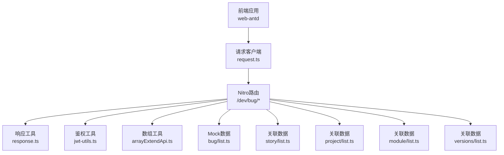
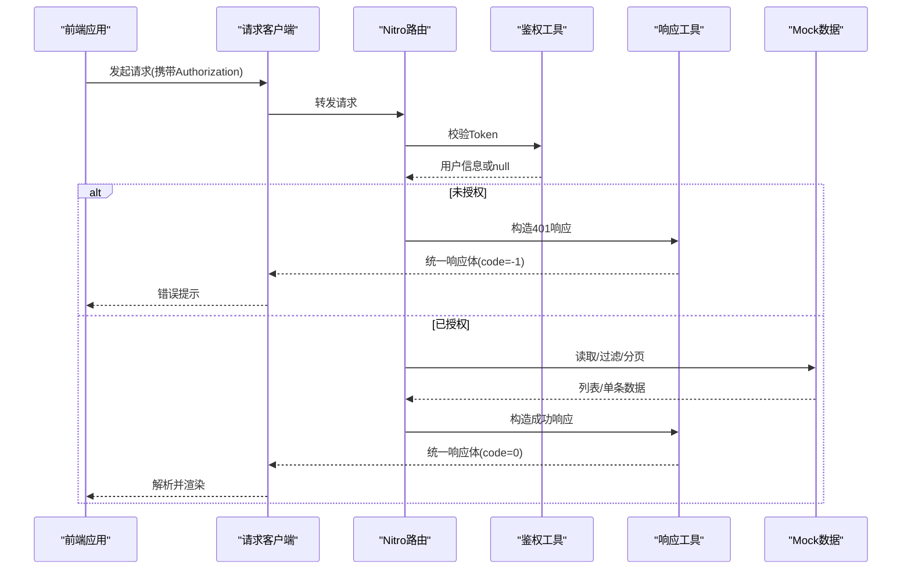
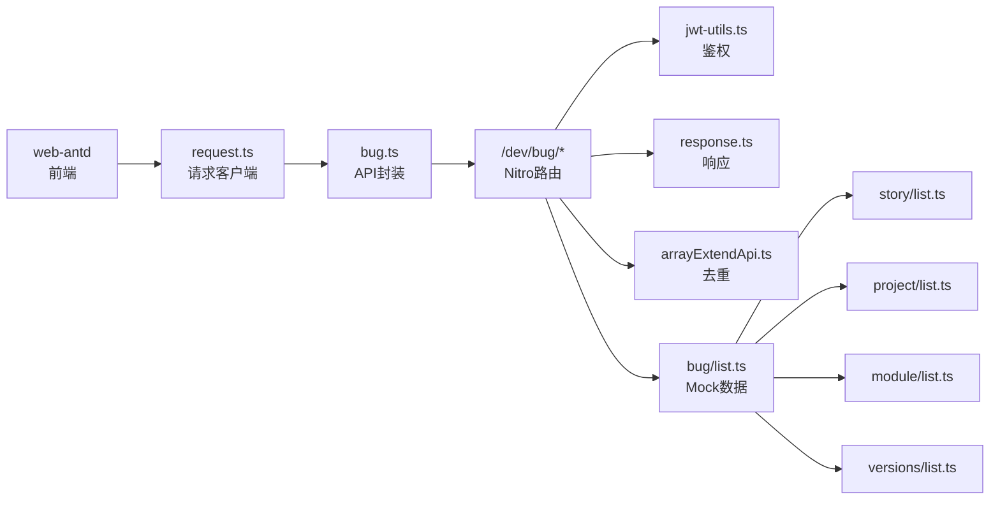

# Bug管理API

<cite>
**本文引用的文件**
- [apps/backend-mock/api/dev/bug/list.ts](file://apps/backend-mock/api/dev/bug/list.ts)
- [apps/backend-mock/api/dev/bug/get.ts](file://apps/backend-mock/api/dev/bug/get.ts)
- [apps/backend-mock/api/dev/bug/.post.ts](file://apps/backend-mock/api/dev/bug/.post.ts)
- [apps/backend-mock/api/dev/bug/bugListByStoryId.ts](file://apps/backend-mock/api/dev/bug/bugListByStoryId.ts)
- [apps/web-antd/src/api/dev/bug.ts](file://apps/web-antd/src/api/dev/bug.ts)
- [apps/backend-mock/utils/response.ts](file://apps/backend-mock/utils/response.ts)
- [apps/backend-mock/utils/jwt-utils.ts](file://apps/backend-mock/utils/jwt-utils.ts)
- [apps/backend-mock/utils/arrayExtendApi.ts](file://apps/backend-mock/utils/arrayExtendApi.ts)
- [apps/web-antd/src/api/request.ts](file://apps/web-antd/src/api/request.ts)
- [apps/backend-mock/api/dev/story/list.ts](file://apps/backend-mock/api/dev/story/list.ts)
- [apps/backend-mock/api/dev/project/list.ts](file://apps/backend-mock/api/dev/project/list.ts)
- [apps/backend-mock/api/dev/module/list.ts](file://apps/backend-mock/api/dev/module/list.ts)
- [apps/backend-mock/api/dev/versions/list.ts](file://apps/backend-mock/api/dev/versions/list.ts)
</cite>

## 目录
1. [简介](#简介)
2. [项目结构](#项目结构)
3. [核心组件](#核心组件)
4. [架构总览](#架构总览)
5. [详细组件分析](#详细组件分析)
6. [依赖分析](#依赖分析)
7. [性能考虑](#性能考虑)
8. [故障排查指南](#故障排查指南)
9. [结论](#结论)
10. [附录](#附录)

## 简介
本文件为Bug管理API的完整技术文档，覆盖以下内容：
- 所有Bug相关端点：列表查询、详情获取、新增、编辑、删除
- 每个端点的HTTP方法、URL路径、请求参数、响应格式与状态码
- Bug数据模型定义（字段说明、取值范围与含义）
- 条件筛选（按状态、优先级、负责人等）、分页与排序
- Bug与Story的关联关系及按storyId查询
- 实际请求与响应示例
- 常见错误处理方式

注意：当前仓库采用后端Mock方案，API行为由Nitro路由与工具函数实现，前端通过统一请求客户端封装调用。

## 项目结构
围绕Bug管理API的关键文件组织如下：
- 后端Mock路由：apps/backend-mock/api/dev/bug/*
- 前端API封装：apps/web-antd/src/api/dev/bug.ts
- 工具与拦截：apps/backend-mock/utils/*
- 统一请求客户端：apps/web-antd/src/api/request.ts
- 关联实体Mock数据：apps/backend-mock/api/dev/{story,project,module,versions}/list.ts

图表来源
- [apps/web-antd/src/api/request.ts:1-124](file://apps/web-antd/src/api/request.ts#L1-L124)
- [apps/backend-mock/api/dev/bug/list.ts:1-166](file://apps/backend-mock/api/dev/bug/list.ts#L1-L166)
- [apps/backend-mock/utils/response.ts:1-71](file://apps/backend-mock/utils/response.ts#L1-L71)
- [apps/backend-mock/utils/jwt-utils.ts:1-115](file://apps/backend-mock/utils/jwt-utils.ts#L1-L115)
- [apps/backend-mock/utils/arrayExtendApi.ts:1-154](file://apps/backend-mock/utils/arrayExtendApi.ts#L1-L154)
- [apps/backend-mock/api/dev/story/list.ts:1-149](file://apps/backend-mock/api/dev/story/list.ts#L1-L149)
- [apps/backend-mock/api/dev/project/list.ts:1-51](file://apps/backend-mock/api/dev/project/list.ts#L1-L51)
- [apps/backend-mock/api/dev/module/list.ts:1-74](file://apps/backend-mock/api/dev/module/list.ts#L1-L74)
- [apps/backend-mock/api/dev/versions/list.ts:1-109](file://apps/backend-mock/api/dev/versions/list.ts#L1-L109)

章节来源
- [apps/backend-mock/api/dev/bug/list.ts:1-166](file://apps/backend-mock/api/dev/bug/list.ts#L1-L166)
- [apps/web-antd/src/api/dev/bug.ts:1-104](file://apps/web-antd/src/api/dev/bug.ts#L1-L104)
- [apps/web-antd/src/api/request.ts:1-124](file://apps/web-antd/src/api/request.ts#L1-L124)

## 核心组件
- Bug列表查询：支持关键词、项目、版本、状态等过滤，分页返回
- Bug详情获取：按bugNum精确查询
- 新增Bug：POST /dev/bug
- 编辑Bug：PUT /dev/bug/{id}
- 删除Bug：DELETE /dev/bug/{id}
- 按Story查询Bug：GET /dev/bug/bugListByStoryId

响应统一结构与鉴权机制：
- 统一响应体：包含code、data、message、error
- 成功code=0，失败code=-1
- 鉴权：Authorization: Bearer <token>，校验失败返回401

章节来源
- [apps/backend-mock/api/dev/bug/list.ts:111-166](file://apps/backend-mock/api/dev/bug/list.ts#L111-L166)
- [apps/backend-mock/api/dev/bug/get.ts:1-17](file://apps/backend-mock/api/dev/bug/get.ts#L1-L17)
- [apps/backend-mock/api/dev/bug/.post.ts:1-17](file://apps/backend-mock/api/dev/bug/.post.ts#L1-L17)
- [apps/backend-mock/api/dev/bug/bugListByStoryId.ts:1-24](file://apps/backend-mock/api/dev/bug/bugListByStoryId.ts#L1-L24)
- [apps/backend-mock/utils/response.ts:1-71](file://apps/backend-mock/utils/response.ts#L1-L71)
- [apps/backend-mock/utils/jwt-utils.ts:1-115](file://apps/backend-mock/utils/jwt-utils.ts#L1-L115)

## 架构总览
前后端交互流程概览：

图表来源
- [apps/web-antd/src/api/request.ts:1-124](file://apps/web-antd/src/api/request.ts#L1-L124)
- [apps/backend-mock/utils/jwt-utils.ts:1-115](file://apps/backend-mock/utils/jwt-utils.ts#L1-L115)
- [apps/backend-mock/utils/response.ts:1-71](file://apps/backend-mock/utils/response.ts#L1-L71)
- [apps/backend-mock/api/dev/bug/list.ts:111-166](file://apps/backend-mock/api/dev/bug/list.ts#L111-L166)

## 详细组件分析

### Bug列表查询
- 方法与路径
  - GET /dev/bug/list
- 请求参数（查询字符串）
  - page: 页码，默认1
  - pageSize: 每页条数，默认20
  - projectId: 项目ID（可选）
  - versionId: 版本ID（可选）
  - bugStatus: Bug状态（可选）
  - keyword: 关键词（标题或编号模糊匹配）
  - includeId: 包含某ID的记录（若存在则强制置于首位）
- 响应
  - data.items: 当页数据
  - data.total: 总数
  - code=0表示成功
- 过滤与排序
  - 支持按项目、版本、状态过滤
  - keyword同时匹配标题与编号
  - includeId存在时将对应记录置顶
  - 去重策略：按bugId去重
- 示例
  - 请求：GET /dev/bug/list?page=1&pageSize=20&projectId=xxx&keyword=登录
  - 响应：{
      code: 0,
      data: { items: [...], total: 120 },
      message: "ok",
      error: null
    }

章节来源
- [apps/backend-mock/api/dev/bug/list.ts:111-166](file://apps/backend-mock/api/dev/bug/list.ts#L111-L166)
- [apps/backend-mock/utils/response.ts:14-33](file://apps/backend-mock/utils/response.ts#L14-L33)
- [apps/backend-mock/utils/arrayExtendApi.ts:124-135](file://apps/backend-mock/utils/arrayExtendApi.ts#L124-L135)

### Bug详情获取
- 方法与路径
  - GET /dev/bug/get
- 请求参数（查询字符串）
  - bugNum: Bug编号（必填）
- 响应
  - data: 单条Bug记录或null
  - code=0表示成功
- 示例
  - 请求：GET /dev/bug/get?bugNum=1001
  - 响应：{
      code: 0,
      data: { bugId, bugTitle, bugNum, bugStatus, ... },
      message: "ok",
      error: null
    }

章节来源
- [apps/backend-mock/api/dev/bug/get.ts:1-17](file://apps/backend-mock/api/dev/bug/get.ts#L1-L17)

### 新增Bug
- 方法与路径
  - POST /dev/bug
- 请求体
  - 除bugId外的全部字段均可提交
- 响应
  - data: null
  - code=0表示成功
- 示例
  - 请求：POST /dev/bug { bugTitle, bugNum, bugStatus, ... }
  - 响应：{ code: 0, data: null, message: "ok", error: null }

章节来源
- [apps/backend-mock/api/dev/bug/.post.ts:1-17](file://apps/backend-mock/api/dev/bug/.post.ts#L1-L17)

### 编辑Bug
- 方法与路径
  - PUT /dev/bug/{id}
- 路径参数
  - id: Bug唯一标识（UUID）
- 请求体
  - 除bugId外的全部字段均可提交
- 响应
  - data: null
  - code=0表示成功
- 示例
  - 请求：PUT /dev/bug/{id} { bugTitle, bugStatus, ... }
  - 响应：{ code: 0, data: null, message: "ok", error: null }

章节来源
- [apps/web-antd/src/api/dev/bug.ts:71-83](file://apps/web-antd/src/api/dev/bug.ts#L71-L83)

### 删除Bug
- 方法与路径
  - DELETE /dev/bug/{id}
- 路径参数
  - id: Bug唯一标识（UUID）
- 响应
  - data: null
  - code=0表示成功
- 示例
  - 请求：DELETE /dev/bug/{id}
  - 响应：{ code: 0, data: null, message: "ok", error: null }

章节来源
- [apps/web-antd/src/api/dev/bug.ts:71-83](file://apps/web-antd/src/api/dev/bug.ts#L71-L83)

### 按Story查询Bug
- 方法与路径
  - GET /dev/bug/bugListByStoryId
- 请求参数（查询字符串）
  - storyId: 需求ID（必填）
- 响应
  - data: 符合条件的Bug列表
  - code=0表示成功
- 示例
  - 请求：GET /dev/bug/bugListByStoryId?storyId={storyId}
  - 响应：{ code: 0, data: [...], message: "ok", error: null }

章节来源
- [apps/backend-mock/api/dev/bug/bugListByStoryId.ts:1-24](file://apps/backend-mock/api/dev/bug/bugListByStoryId.ts#L1-L24)

### Bug数据模型定义
字段清单（部分关键字段，其余字段请参考前端类型定义文件）

- 标识与基础信息
  - bugId: UUID，唯一标识
  - bugNum: 整数，Bug编号
  - bugTitle: 字符串，标题
  - bugRichText: 富文本描述
  - bugUa: 浏览器信息
- 状态与等级
  - bugStatus: 状态枚举（示例：0, 10, 99）
  - bugLevel: 等级枚举（示例：0, 10, 20, 30）
  - bugConfirmStatus: 确认状态枚举（示例：0, 10, 20）
  - bugSource: 来源枚举（示例：0–120）
  - bugType: 类型枚举（示例：0–110）
  - bugEnv: 环境枚举（示例：0, 10, 20）
- 关联信息
  - storyId/storyTitle: 关联需求
  - versionId/version: 关联版本
  - moduleId/moduleTitle: 关联模块
  - projectId/projectTitle: 关联项目
  - userId/realName/avatar: 修复人
  - creatorId/creatorName: 创建人
- 时间戳
  - createDate/updateDate: 字符串或日期

章节来源
- [apps/web-antd/src/api/dev/bug.ts:5-57](file://apps/web-antd/src/api/dev/bug.ts#L5-L57)

### 条件筛选、分页与排序
- 筛选
  - 支持按projectId、versionId、bugStatus过滤
  - keyword同时匹配标题与编号
  - includeId存在时将对应记录置顶
- 分页
  - 默认page=1，pageSize=20
  - 响应包含items与total
- 去重
  - 按bugId去重
- 排序
  - 版本排序使用compareVersion（版本号比较函数）

章节来源
- [apps/backend-mock/api/dev/bug/list.ts:117-161](file://apps/backend-mock/api/dev/bug/list.ts#L117-L161)
- [apps/backend-mock/utils/arrayExtendApi.ts:124-135](file://apps/backend-mock/utils/arrayExtendApi.ts#L124-L135)
- [apps/backend-mock/utils/jwt-utils.ts:77-114](file://apps/backend-mock/utils/jwt-utils.ts#L77-L114)

### Bug与Story的关联关系
- 关联字段
  - storyId/storyTitle：Bug关联到Story
- 查询方式
  - 通过GET /dev/bug/bugListByStoryId?storyId={storyId}获取该Story下的所有Bug
- 关联数据来源
  - Story、项目、模块、版本等Mock数据用于生成Bug关联信息

章节来源
- [apps/backend-mock/api/dev/bug/list.ts:50-60](file://apps/backend-mock/api/dev/bug/list.ts#L50-L60)
- [apps/backend-mock/api/dev/bug/bugListByStoryId.ts:15-19](file://apps/backend-mock/api/dev/bug/bugListByStoryId.ts#L15-L19)
- [apps/backend-mock/api/dev/story/list.ts:1-149](file://apps/backend-mock/api/dev/story/list.ts#L1-L149)

## 依赖分析
- 前端依赖
  - 请求客户端：统一设置Authorization头、解析响应、错误拦截
  - API封装：对各端点进行类型约束与参数整理
- 后端依赖
  - 鉴权：verifyAccessToken校验Token
  - 响应：统一响应体与分页封装
  - 数组工具：uniqueByKey去重
  - Mock数据：Story、项目、模块、版本用于生成Bug关联信息

图表来源
- [apps/web-antd/src/api/request.ts:1-124](file://apps/web-antd/src/api/request.ts#L1-L124)
- [apps/web-antd/src/api/dev/bug.ts:1-104](file://apps/web-antd/src/api/dev/bug.ts#L1-L104)
- [apps/backend-mock/api/dev/bug/list.ts:1-166](file://apps/backend-mock/api/dev/bug/list.ts#L1-L166)
- [apps/backend-mock/utils/jwt-utils.ts:1-115](file://apps/backend-mock/utils/jwt-utils.ts#L1-L115)
- [apps/backend-mock/utils/response.ts:1-71](file://apps/backend-mock/utils/response.ts#L1-L71)
- [apps/backend-mock/utils/arrayExtendApi.ts:1-154](file://apps/backend-mock/utils/arrayExtendApi.ts#L1-L154)
- [apps/backend-mock/api/dev/story/list.ts:1-149](file://apps/backend-mock/api/dev/story/list.ts#L1-L149)
- [apps/backend-mock/api/dev/project/list.ts:1-51](file://apps/backend-mock/api/dev/project/list.ts#L1-L51)
- [apps/backend-mock/api/dev/module/list.ts:1-74](file://apps/backend-mock/api/dev/module/list.ts#L1-L74)
- [apps/backend-mock/api/dev/versions/list.ts:1-109](file://apps/backend-mock/api/dev/versions/list.ts#L1-L109)

## 性能考虑
- 列表查询默认分页，建议前端合理设置pageSize并配合关键词与过滤条件减少传输量
- 去重uniqueByKey按bugId执行，避免重复数据影响分页与显示
- includeId置顶策略仅在存在时生效，避免不必要的数据移动
- 前端请求客户端启用统一响应拦截与错误提示，便于快速定位问题

## 故障排查指南
- 401 未授权
  - 现象：返回code=-1，message为“Unauthorized Exception”
  - 原因：缺少或无效的Authorization头
  - 处理：确认Token有效且已设置到请求头
- 403 禁止访问
  - 现象：返回code=-1，message为“Forbidden Exception”
  - 原因：权限不足或黑名单拦截
  - 处理：检查用户权限与白名单配置
- 业务错误
  - 现象：code非0但非-1
  - 处理：根据后端返回的message与error字段定位问题
- 响应格式
  - 统一字段：code、data、message、error
  - 前端默认successCode=0，自动解包data字段

章节来源
- [apps/backend-mock/utils/response.ts:35-55](file://apps/backend-mock/utils/response.ts#L35-L55)
- [apps/web-antd/src/api/request.ts:84-114](file://apps/web-antd/src/api/request.ts#L84-L114)

## 结论
本Bug管理API以Nitro路由为核心，结合统一响应与鉴权工具，提供完整的列表、详情、新增、编辑、删除与按Story查询能力。前端通过类型化的API封装与请求客户端，确保调用一致性与错误处理的标准化。建议在生产环境中替换Mock数据与鉴权实现，并完善权限控制与日志审计。

## 附录

### 端点一览与示例
- 列表查询
  - GET /dev/bug/list
  - 参数：page, pageSize, projectId, versionId, bugStatus, keyword, includeId
  - 响应：{ code, data: { items, total }, message, error }
- 详情获取
  - GET /dev/bug/get?bugNum=1001
  - 响应：{ code, data: Bug对象或null, message, error }
- 新增
  - POST /dev/bug
  - 请求体：除bugId外的字段
  - 响应：{ code, data: null, message, error }
- 编辑
  - PUT /dev/bug/{id}
  - 请求体：除bugId外的字段
  - 响应：{ code, data: null, message, error }
- 删除
  - DELETE /dev/bug/{id}
  - 响应：{ code, data: null, message, error }
- 按Story查询
  - GET /dev/bug/bugListByStoryId?storyId={storyId}
  - 响应：{ code, data: Bug列表, message, error }

章节来源
- [apps/backend-mock/api/dev/bug/list.ts:111-166](file://apps/backend-mock/api/dev/bug/list.ts#L111-L166)
- [apps/backend-mock/api/dev/bug/get.ts:1-17](file://apps/backend-mock/api/dev/bug/get.ts#L1-L17)
- [apps/backend-mock/api/dev/bug/.post.ts:1-17](file://apps/backend-mock/api/dev/bug/.post.ts#L1-L17)
- [apps/web-antd/src/api/dev/bug.ts:60-104](file://apps/web-antd/src/api/dev/bug.ts#L60-L104)
- [apps/backend-mock/api/dev/bug/bugListByStoryId.ts:1-24](file://apps/backend-mock/api/dev/bug/bugListByStoryId.ts#L1-L24)