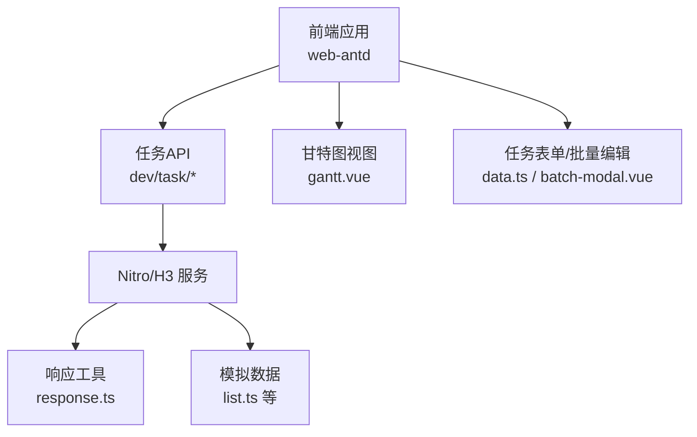
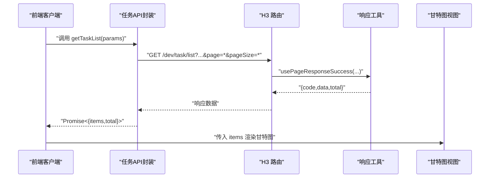
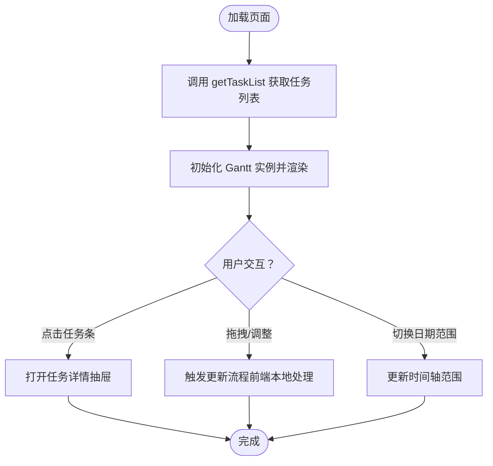
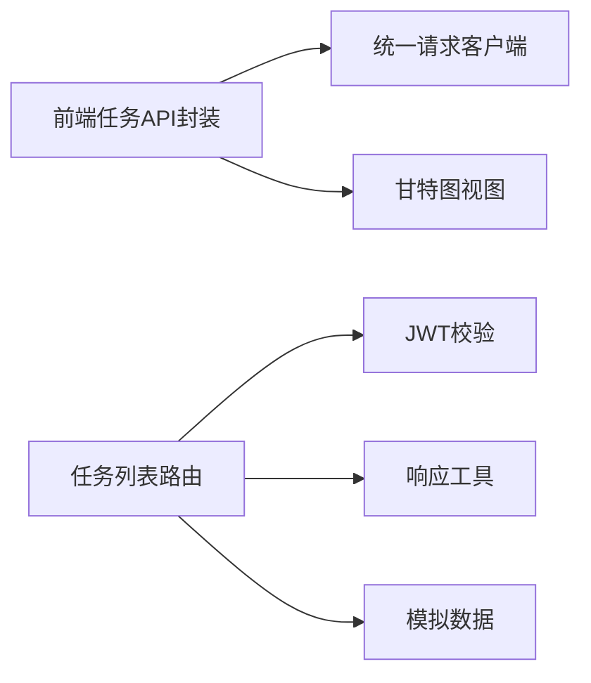

# 任务管理API

<cite>
**本文引用的文件**
- [apps/web-antd/src/api/dev/task.ts](file://apps/web-antd/src/api/dev/task.ts)
- [apps/backend-mock/api/dev/task/.post.ts](file://apps/backend-mock/api/dev/task/.post.ts)
- [apps/backend-mock/api/dev/task/get.ts](file://apps/backend-mock/api/dev/task/get.ts)
- [apps/backend-mock/api/dev/task/list.ts](file://apps/backend-mock/api/dev/task/list.ts)
- [apps/backend-mock/api/dev/task/taskListByStoryId.ts](file://apps/backend-mock/api/dev/task/taskListByStoryId.ts)
- [apps/backend-mock/utils/response.ts](file://apps/backend-mock/utils/response.ts)
- [apps/web-antd/src/views/dev/task/gantt.vue](file://apps/web-antd/src/views/dev/task/gantt.vue)
- [apps/web-antd/src/views/dev/task/data.ts](file://apps/web-antd/src/views/dev/task/data.ts)
- [apps/web-antd/src/views/dev/task/batch-modal.vue](file://apps/web-antd/src/views/dev/task/batch-modal.vue)
- [apps/backend-mock/api/system/dict/list.ts](file://apps/backend-mock/api/system/dict/list.ts)
</cite>

## 目录
1. [简介](#简介)
2. [项目结构](#项目结构)
3. [核心组件](#核心组件)
4. [架构总览](#架构总览)
5. [详细组件分析](#详细组件分析)
6. [依赖分析](#依赖分析)
7. [性能考虑](#性能考虑)
8. [故障排查指南](#故障排查指南)
9. [结论](#结论)
10. [附录](#附录)

## 简介
本文件为“任务管理API”的权威文档，覆盖任务相关的全部REST端点与数据模型，包括：
- 任务列表查询、任务详情获取、任务新增、任务编辑、任务删除
- 请求参数、响应格式、状态码
- 任务数据模型字段定义
- 排序、筛选、过滤、分页等查询能力
- 任务与故事、Bug的关联关系说明
- 甘特图数据生成与前端集成方式
- 实际请求与响应示例路径
- 敏捷开发实践与工作量跟踪方法

## 项目结构
后端采用 Nitro/H3 模式提供 mock API；前端通过统一请求客户端封装调用，并在视图层集成甘特图与表单。

图表来源
- [apps/web-antd/src/api/dev/task.ts:1-103](file://apps/web-antd/src/api/dev/task.ts#L1-L103)
- [apps/backend-mock/api/dev/task/list.ts:1-156](file://apps/backend-mock/api/dev/task/list.ts#L1-L156)
- [apps/backend-mock/utils/response.ts:1-71](file://apps/backend-mock/utils/response.ts#L1-L71)
- [apps/web-antd/src/views/dev/task/gantt.vue:1-261](file://apps/web-antd/src/views/dev/task/gantt.vue#L1-L261)

章节来源
- [apps/web-antd/src/api/dev/task.ts:1-103](file://apps/web-antd/src/api/dev/task.ts#L1-L103)
- [apps/backend-mock/api/dev/task/list.ts:120-156](file://apps/backend-mock/api/dev/task/list.ts#L120-L156)
- [apps/backend-mock/utils/response.ts:14-33](file://apps/backend-mock/utils/response.ts#L14-L33)

## 核心组件
- 前端请求封装：提供任务列表、详情、创建、更新、按故事查询等方法
- 后端路由：提供任务列表、详情、创建、按故事查询等接口
- 响应工具：统一分页与成功/错误响应格式
- 视图集成：甘特图渲染、表单schema、批量编辑列定义

章节来源
- [apps/web-antd/src/api/dev/task.ts:42-102](file://apps/web-antd/src/api/dev/task.ts#L42-L102)
- [apps/backend-mock/api/dev/task/list.ts:120-156](file://apps/backend-mock/api/dev/task/list.ts#L120-L156)
- [apps/backend-mock/utils/response.ts:5-42](file://apps/backend-mock/utils/response.ts#L5-L42)

## 架构总览
以下序列图展示从前端到后端再到视图层的数据流。

图表来源
- [apps/web-antd/src/api/dev/task.ts:42-49](file://apps/web-antd/src/api/dev/task.ts#L42-L49)
- [apps/backend-mock/api/dev/task/list.ts:120-156](file://apps/backend-mock/api/dev/task/list.ts#L120-L156)
- [apps/backend-mock/utils/response.ts:14-33](file://apps/backend-mock/utils/response.ts#L14-L33)
- [apps/web-antd/src/views/dev/task/gantt.vue:75-82](file://apps/web-antd/src/views/dev/task/gantt.vue#L75-L82)

## 详细组件分析

### 任务数据模型
任务对象包含以下关键字段（以接口定义为准）：

- 任务标识
  - taskId: 字符串，唯一标识
  - taskNum: 数字，业务编号
- 关联信息
  - storyId: 字符串，所属故事ID
  - storyTitle: 字符串，故事标题
  - projectId/moduleId/versionId: 字符串，项目/模块/版本ID
  - projectTitle/moduleTitle/version: 字符串，对应标题或版本号
- 描述与内容
  - taskTitle: 字符串，任务标题
  - taskRichText: 字符串，富文本描述
- 状态与类型
  - taskStatus: 数字，任务状态值
  - taskType: 数字，任务类型值
- 工时与进度
  - planHours: 数字，计划工时
  - actualHours: 数字，实际工时
  - percent: 数字，进度百分比（0~100）
- 时间维度
  - startDate/endDate/createDate: 字符串，起止时间与创建时间
- 责任人
  - userId/creatorId: 字符串，执行人/创建人ID
  - userName/creatorName/realName/avatar: 字符串，执行人/创建人姓名与头像

章节来源
- [apps/web-antd/src/api/dev/task.ts:5-34](file://apps/web-antd/src/api/dev/task.ts#L5-L34)
- [apps/backend-mock/api/dev/task/list.ts:64-111](file://apps/backend-mock/api/dev/task/list.ts#L64-L111)

### 任务端点定义

- 列表查询
  - 方法与路径: GET /dev/task/list
  - 查询参数
    - page: 数字，页码，默认1
    - pageSize: 数字，每页条数，默认20
    - projectId: 字符串，可选，按项目过滤
    - versionId: 字符串，可选，按版本过滤
    - taskTitle: 字符串，可选，按标题模糊匹配
    - taskStatus: 数字，可选，按状态过滤
  - 响应
    - items: 数组，任务列表
    - total: 数字，总条数
  - 状态码
    - 200 成功
    - 401 未授权
    - 403 禁止访问
  - 示例请求
    - GET /dev/task/list?page=1&pageSize=20&projectId=xxx&taskStatus=0
  - 示例响应
    - 参考 [apps/backend-mock/utils/response.ts:14-33](file://apps/backend-mock/utils/response.ts#L14-L33)

- 详情获取
  - 方法与路径: GET /dev/task/get
  - 查询参数
    - taskNum: 数字，任务业务编号
  - 响应
    - data: 任务对象或null
  - 状态码
    - 200 成功
    - 401 未授权
    - 403 禁止访问
  - 示例请求
    - GET /dev/task/get?taskNum=1001
  - 示例响应
    - 参考 [apps/backend-mock/api/dev/task/get.ts:12-15](file://apps/backend-mock/api/dev/task/get.ts#L12-L15)

- 新增任务
  - 方法与路径: POST /dev/task
  - 请求体
    - 除 taskId 外的任务字段（见数据模型）
  - 响应
    - data: null
  - 状态码
    - 200 成功
    - 401 未授权
    - 403 禁止访问
  - 示例请求
    - POST /dev/task
    - Body: 任务字段（不含taskId）
  - 示例响应
    - 参考 [apps/backend-mock/api/dev/task/.post.ts:9-16](file://apps/backend-mock/api/dev/task/.post.ts#L9-L16)

- 编辑任务
  - 方法与路径: PUT /dev/task/{id}
  - 路径参数
    - id: 字符串，任务ID
  - 请求体
    - 任务字段（不含taskId）
  - 响应
    - data: null
  - 状态码
    - 200 成功
    - 401 未授权
    - 403 禁止访问
  - 示例请求
    - PUT /dev/task/{taskId}
    - Body: 任务字段（不含taskId）

- 删除任务
  - 方法与路径: DELETE /dev/task/{id}
  - 路径参数
    - id: 字符串，任务ID
  - 响应
    - data: null
  - 状态码
    - 200 成功
    - 401 未授权
    - 403 禁止访问
  - 示例请求
    - DELETE /dev/task/{taskId}

- 按故事查询任务
  - 方法与路径: GET /dev/task/taskListByStoryId
  - 查询参数
    - storyId: 字符串，故事ID
  - 响应
    - data: 任务数组
  - 状态码
    - 200 成功
    - 401 未授权
    - 403 禁止访问
  - 示例请求
    - GET /dev/task/taskListByStoryId?storyId=xxx

章节来源
- [apps/web-antd/src/api/dev/task.ts:42-102](file://apps/web-antd/src/api/dev/task.ts#L42-L102)
- [apps/backend-mock/api/dev/task/list.ts:120-156](file://apps/backend-mock/api/dev/task/list.ts#L120-L156)
- [apps/backend-mock/api/dev/task/get.ts:6-16](file://apps/backend-mock/api/dev/task/get.ts#L6-L16)
- [apps/backend-mock/api/dev/task/.post.ts:9-16](file://apps/backend-mock/api/dev/task/.post.ts#L9-L16)
- [apps/backend-mock/api/dev/task/taskListByStoryId.ts:7-23](file://apps/backend-mock/api/dev/task/taskListByStoryId.ts#L7-L23)

### 查询能力与参数详解
- 排序
  - 当前后端未提供显式排序参数；如需排序，请在前端对 items 进行二次排序处理
- 状态筛选
  - taskStatus: 数字，按状态精确过滤
- 负责人过滤
  - 建议通过扩展查询参数（如 userId）在后端实现（当前未实现，可在前端过滤）
- 日期范围查询
  - 建议扩展查询参数（如 startDateFrom/startDateTo）并在后端实现（当前未实现）
- 分页
  - page/pageSize 默认值与计算逻辑参考后端分页工具

章节来源
- [apps/backend-mock/api/dev/task/list.ts:128-148](file://apps/backend-mock/api/dev/task/list.ts#L128-L148)
- [apps/backend-mock/utils/response.ts:61-70](file://apps/backend-mock/utils/response.ts#L61-L70)

### 任务与故事、Bug的关联关系
- 任务与故事
  - 任务包含 storyId/storyTitle 字段，表示任务归属的故事
  - 支持按 storyId 查询任务列表
- 任务与Bug
  - 仓库中存在独立的 Bug 模块API，任务与Bug在概念上可并行管理
  - 若需要任务与Bug的联动统计，建议在后端聚合接口中扩展

章节来源
- [apps/backend-mock/api/dev/task/list.ts:67-68](file://apps/backend-mock/api/dev/task/list.ts#L67-L68)
- [apps/backend-mock/api/dev/task/taskListByStoryId.ts:15-19](file://apps/backend-mock/api/dev/task/taskListByStoryId.ts#L15-L19)

### 甘特图数据生成
- 前端使用 vtable-gantt 组件渲染
- 数据来源：调用 getTaskList 返回的 items
- 关键字段映射
  - 任务标识: taskId
  - 任务标题: taskTitle
  - 执行人: userName/realName
  - 开始/结束时间: startDate/endDate
  - 进度: percent 或 progress（若后端补充 progress 字段）
- 交互事件
  - 支持滚动、点击任务条、拖拽调整、日期范围变更等事件回调

图表来源
- [apps/web-antd/src/views/dev/task/gantt.vue:75-246](file://apps/web-antd/src/views/dev/task/gantt.vue#L75-L246)

章节来源
- [apps/web-antd/src/views/dev/task/gantt.vue:34-73](file://apps/web-antd/src/views/dev/task/gantt.vue#L34-L73)
- [apps/web-antd/src/views/dev/task/gantt.vue:75-82](file://apps/web-antd/src/views/dev/task/gantt.vue#L75-L82)

### 表单与批量编辑
- 表单字段
  - 包含任务标题、时间范围、计划工时、项目、版本、执行人、任务状态、任务类型等
- 批量编辑列
  - 支持对关联需求、任务标题、执行人、计划工时、开始/结束时间、任务类型、任务状态进行编辑

章节来源
- [apps/web-antd/src/views/dev/task/data.ts:22-293](file://apps/web-antd/src/views/dev/task/data.ts#L22-L293)
- [apps/web-antd/src/views/dev/task/batch-modal.vue:43-108](file://apps/web-antd/src/views/dev/task/batch-modal.vue#L43-L108)

### 敏捷实践与工作量跟踪
- 工作量维度
  - 计划工时与实际工时对比，用于容量与效率评估
- 状态流转
  - 任务状态字典来源于系统字典表，支持多状态枚举
- 甘特图可视化
  - 通过时间轴直观展示任务排期与进度

章节来源
- [apps/backend-mock/api/system/dict/list.ts:440-599](file://apps/backend-mock/api/system/dict/list.ts#L440-L599)
- [apps/web-antd/src/views/dev/task/gantt.vue:139-169](file://apps/web-antd/src/views/dev/task/gantt.vue#L139-L169)

## 依赖分析
- 前端
  - 任务API封装依赖统一请求客户端
  - 甘特图视图依赖 vtable/vtable-gantt
- 后端
  - 任务路由依赖 JWT 校验与响应工具
  - 列表接口依赖 mock 数据与分页工具

图表来源
- [apps/web-antd/src/api/dev/task.ts:1-3](file://apps/web-antd/src/api/dev/task.ts#L1-L3)
- [apps/backend-mock/api/dev/task/list.ts:3-4](file://apps/backend-mock/api/dev/task/list.ts#L3-L4)
- [apps/backend-mock/utils/response.ts:1-2](file://apps/backend-mock/utils/response.ts#L1-L2)

章节来源
- [apps/web-antd/src/api/dev/task.ts:1-3](file://apps/web-antd/src/api/dev/task.ts#L1-L3)
- [apps/backend-mock/api/dev/task/list.ts:3-4](file://apps/backend-mock/api/dev/task/list.ts#L3-L4)
- [apps/backend-mock/utils/response.ts:1-2](file://apps/backend-mock/utils/response.ts#L1-L2)

## 性能考虑
- 列表分页
  - 使用 page/pageSize 控制返回规模，避免全量拉取
- 前端过滤
  - 在后端未实现复杂筛选时，可在前端对 items 进行二次过滤
- 甘特图渲染
  - 对大量数据建议虚拟化或分页渲染，减少DOM压力

## 故障排查指南
- 401 未授权
  - 检查请求是否携带有效令牌；确认鉴权中间件生效
- 403 禁止访问
  - 检查权限策略与资源访问控制
- 列表为空
  - 检查查询参数（如 projectId/versionId/taskStatus/taskTitle）是否正确
- 甘特图空白
  - 确认 items 中包含必需字段（taskId、taskTitle、startDate、endDate、percent/progress）

章节来源
- [apps/backend-mock/utils/response.ts:52-55](file://apps/backend-mock/utils/response.ts#L52-L55)
- [apps/backend-mock/api/dev/task/list.ts:128-148](file://apps/backend-mock/api/dev/task/list.ts#L128-L148)
- [apps/web-antd/src/views/dev/task/gantt.vue:75-82](file://apps/web-antd/src/views/dev/task/gantt.vue#L75-L82)

## 结论
本文档提供了任务管理API的完整端点清单、数据模型、查询能力与前端集成方式。建议在后续迭代中：
- 在后端增加更丰富的筛选与排序参数
- 提供任务删除端点的实现
- 在后端补充 progress 字段以完善甘特图数据
- 扩展任务与Bug的聚合统计接口

## 附录
- 响应通用结构
  - code: 数字，0表示成功
  - data: 对象或数组，具体业务数据
  - total: 数字，分页总条数（仅分页场景）
  - message: 字符串，提示信息

章节来源
- [apps/backend-mock/utils/response.ts:5-42](file://apps/backend-mock/utils/response.ts#L5-L42)