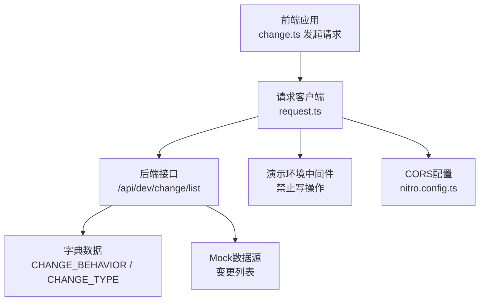
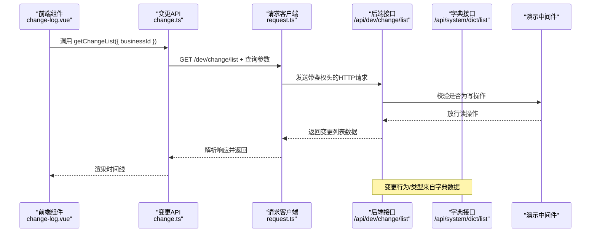
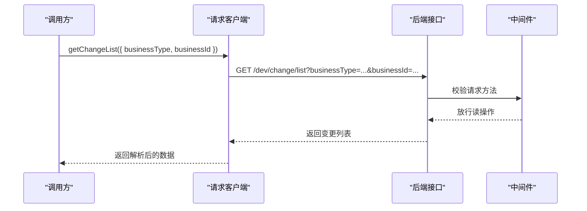
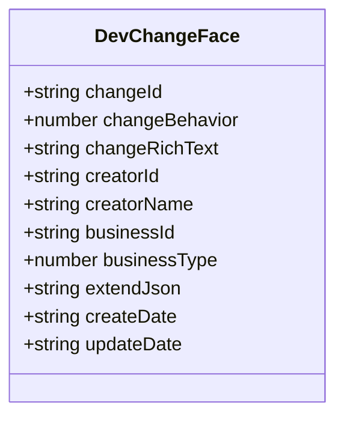
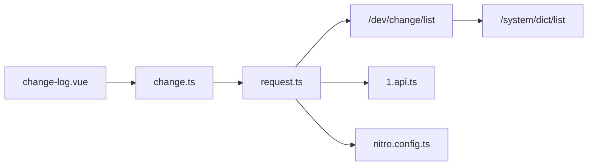

# 变更管理API

<cite>
**本文引用的文件**
- [apps/backend-mock/api/dev/change/list.ts](file://apps/backend-mock/api/dev/change/list.ts)
- [apps/web-antd/src/api/dev/change.ts](file://apps/web-antd/src/api/dev/change.ts)
- [apps/web-antd/src/views/dev/story/components/change-log.vue](file://apps/web-antd/src/views/dev/story/components/change-log.vue)
- [apps/backend-mock/api/system/dict/list.ts](file://apps/backend-mock/api/system/dict/list.ts)
- [apps/backend-mock/middleware/1.api.ts](file://apps/backend-mock/middleware/1.api.ts)
- [apps/backend-mock/nitro.config.ts](file://apps/backend-mock/nitro.config.ts)
- [apps/web-antd/src/api/request.ts](file://apps/web-antd/src/api/request.ts)
</cite>

## 目录
1. [简介](#简介)
2. [项目结构](#项目结构)
3. [核心组件](#核心组件)
4. [架构总览](#架构总览)
5. [详细组件分析](#详细组件分析)
6. [依赖分析](#依赖分析)
7. [性能考虑](#性能考虑)
8. [故障排查指南](#故障排查指南)
9. [结论](#结论)
10. [附录](#附录)

## 简介
本文件为“变更管理API”的权威技术文档，聚焦于变更相关的后端接口与前端调用方式，覆盖以下能力：
- 变更列表查询（支持按业务类型与业务ID过滤）
- 变更详情获取（当前仓库未提供单条变更详情接口，仅提供列表接口）
- 变更新增、变更编辑、变更删除（当前仓库未提供这些接口；演示环境中间件对写操作进行拦截）

同时，文档给出变更数据模型定义、字段说明、过滤条件（业务类型、业务ID）、前端集成示例与最佳实践。

## 项目结构
变更管理API由“前端请求封装”“后端Mock接口”“演示环境中间件与CORS配置”三部分组成：
- 前端通过统一请求客户端发起HTTP请求
- 后端提供Mock接口，返回模拟的变更列表数据，并支持按业务类型与业务ID过滤
- 演示环境中间件对写操作进行拦截，仅允许读操作
- CORS与跨域头在Nitro配置中集中设置

图表来源
- [apps/web-antd/src/api/dev/change.ts:24-31](file://apps/web-antd/src/api/dev/change.ts#L24-L31)
- [apps/web-antd/src/api/request.ts:119-124](file://apps/web-antd/src/api/request.ts#L119-L124)
- [apps/backend-mock/api/dev/change/list.ts:66-86](file://apps/backend-mock/api/dev/change/list.ts#L66-L86)
- [apps/backend-mock/api/system/dict/list.ts:6-126](file://apps/backend-mock/api/system/dict/list.ts#L6-L126)
- [apps/backend-mock/middleware/1.api.ts:14-30](file://apps/backend-mock/middleware/1.api.ts#L14-L30)
- [apps/backend-mock/nitro.config.ts:7-20](file://apps/backend-mock/nitro.config.ts#L7-L20)

章节来源
- [apps/web-antd/src/api/dev/change.ts:1-32](file://apps/web-antd/src/api/dev/change.ts#L1-L32)
- [apps/web-antd/src/api/request.ts:1-124](file://apps/web-antd/src/api/request.ts#L1-L124)
- [apps/backend-mock/api/dev/change/list.ts:1-87](file://apps/backend-mock/api/dev/change/list.ts#L1-L87)
- [apps/backend-mock/api/system/dict/list.ts:1-311](file://apps/backend-mock/api/system/dict/list.ts#L1-L311)
- [apps/backend-mock/middleware/1.api.ts:1-30](file://apps/backend-mock/middleware/1.api.ts#L1-L30)
- [apps/backend-mock/nitro.config.ts:1-21](file://apps/backend-mock/nitro.config.ts#L1-L21)

## 核心组件
- 前端请求封装
  - 统一请求客户端：负责添加鉴权头、语言头、响应拦截与错误处理
  - 变更API模块：导出变更列表查询方法
- 后端接口
  - 变更列表接口：支持按业务类型与业务ID过滤
  - 字典接口：提供变更行为与变更类型的枚举值
- 演示环境控制
  - 中间件：拦截DELETE/PATCH/POST/PUT请求，返回禁止修改提示
  - CORS：开放跨域访问

章节来源
- [apps/web-antd/src/api/request.ts:26-117](file://apps/web-antd/src/api/request.ts#L26-L117)
- [apps/web-antd/src/api/dev/change.ts:24-31](file://apps/web-antd/src/api/dev/change.ts#L24-L31)
- [apps/backend-mock/api/dev/change/list.ts:66-86](file://apps/backend-mock/api/dev/change/list.ts#L66-L86)
- [apps/backend-mock/api/system/dict/list.ts:6-126](file://apps/backend-mock/api/system/dict/list.ts#L6-L126)
- [apps/backend-mock/middleware/1.api.ts:14-30](file://apps/backend-mock/middleware/1.api.ts#L14-L30)
- [apps/backend-mock/nitro.config.ts:7-20](file://apps/backend-mock/nitro.config.ts#L7-L20)

## 架构总览
下图展示了从前端到后端的调用链路与关键节点：

图表来源
- [apps/web-antd/src/views/dev/story/components/change-log.vue:18-29](file://apps/web-antd/src/views/dev/story/components/change-log.vue#L18-L29)
- [apps/web-antd/src/api/dev/change.ts:24-31](file://apps/web-antd/src/api/dev/change.ts#L24-L31)
- [apps/web-antd/src/api/request.ts:74-102](file://apps/web-antd/src/api/request.ts#L74-L102)
- [apps/backend-mock/api/dev/change/list.ts:66-86](file://apps/backend-mock/api/dev/change/list.ts#L66-L86)
- [apps/backend-mock/middleware/1.api.ts:23-29](file://apps/backend-mock/middleware/1.api.ts#L23-L29)

## 详细组件分析

### 接口定义与调用流程
- 接口名称：变更列表查询
- HTTP方法：GET
- URL路径：/dev/change/list
- 请求参数
  - businessType：业务类型（数字枚举，来自字典CHANGE_TYPE）
  - businessId：业务对象ID（如需求ID、任务ID、缺陷ID、版本ID）
- 响应格式：标准响应体（包含code、data、message等字段），其中data为变更记录数组
- 状态码：成功时返回200，鉴权失败返回401，演示环境写操作返回403

图表来源
- [apps/web-antd/src/api/dev/change.ts:24-31](file://apps/web-antd/src/api/dev/change.ts#L24-L31)
- [apps/backend-mock/api/dev/change/list.ts:74-85](file://apps/backend-mock/api/dev/change/list.ts#L74-L85)
- [apps/backend-mock/middleware/1.api.ts:23-29](file://apps/backend-mock/middleware/1.api.ts#L23-L29)

章节来源
- [apps/web-antd/src/api/dev/change.ts:24-31](file://apps/web-antd/src/api/dev/change.ts#L24-L31)
- [apps/backend-mock/api/dev/change/list.ts:66-86](file://apps/backend-mock/api/dev/change/list.ts#L66-L86)
- [apps/backend-mock/middleware/1.api.ts:14-30](file://apps/backend-mock/middleware/1.api.ts#L14-L30)

### 数据模型定义
变更记录的数据模型字段如下（均为字符串或数字，时间字段以字符串表示）：
- changeId：变更唯一标识
- changeBehavior：变更行为（枚举，来自字典CHANGE_BEHAVIOR）
- changeRichText：变更原因（富文本）
- creatorId：创建人ID
- creatorName：创建人姓名
- businessId：业务对象ID（如需求、任务、缺陷、版本）
- businessType：业务类型（枚举，来自字典CHANGE_TYPE）
- extendJson：扩展JSON
- createDate：创建时间（字符串）
- updateDate：更新时间（字符串）

图表来源
- [apps/web-antd/src/api/dev/change.ts:4-21](file://apps/web-antd/src/api/dev/change.ts#L4-L21)

章节来源
- [apps/web-antd/src/api/dev/change.ts:4-21](file://apps/web-antd/src/api/dev/change.ts#L4-L21)

### 字典与枚举
- 变更行为（CHANGE_BEHAVIOR）
  - 创建：0
  - 修改：10
  - 评论：20
  - 流转：30
- 变更类型（CHANGE_TYPE）
  - 需求：0
  - 任务：10
  - 缺陷：20
  - 版本：30

章节来源
- [apps/backend-mock/api/system/dict/list.ts:6-126](file://apps/backend-mock/api/system/dict/list.ts#L6-L126)

### 过滤与分页
- 过滤条件
  - businessType：按变更类型过滤
  - businessId：按业务对象ID过滤
- 分页
  - 当前接口未提供分页参数（page、pageSize），返回全量数据

章节来源
- [apps/backend-mock/api/dev/change/list.ts:74-82](file://apps/backend-mock/api/dev/change/list.ts#L74-L82)

### 前端集成示例
- 在组件中监听业务ID变化，自动拉取变更列表并渲染时间线
- 使用字典组件显示变更行为与变更类型标签

章节来源
- [apps/web-antd/src/views/dev/story/components/change-log.vue:18-29](file://apps/web-antd/src/views/dev/story/components/change-log.vue#L18-L29)
- [apps/web-antd/src/views/dev/story/components/change-log.vue:36-46](file://apps/web-antd/src/views/dev/story/components/change-log.vue#L36-L46)

### 变更与业务对象的关系
- businessType与businessId共同标识变更所关联的业务对象
- 支持的需求、任务、缺陷、版本四类业务对象

章节来源
- [apps/backend-mock/api/dev/change/list.ts:28-40](file://apps/backend-mock/api/dev/change/list.ts#L28-L40)

### 安全与跨域
- 鉴权：请求头携带Authorization（Bearer Token）
- 跨域：CORS头在Nitro配置中统一设置
- 演示环境：中间件拦截写操作，仅放行读操作

章节来源
- [apps/web-antd/src/api/request.ts:74-82](file://apps/web-antd/src/api/request.ts#L74-L82)
- [apps/backend-mock/nitro.config.ts:7-20](file://apps/backend-mock/nitro.config.ts#L7-L20)
- [apps/backend-mock/middleware/1.api.ts:23-29](file://apps/backend-mock/middleware/1.api.ts#L23-L29)

## 依赖分析
- 前端依赖
  - 请求客户端：统一处理鉴权头、响应拦截、错误提示
  - 变更API模块：封装GET /dev/change/list
  - 视图组件：订阅业务ID变化，触发列表查询
- 后端依赖
  - 接口：/dev/change/list
  - 字典：CHANGE_BEHAVIOR、CHANGE_TYPE
  - 中间件：演示环境写操作拦截
  - CORS：Nitro全局配置

图表来源
- [apps/web-antd/src/views/dev/story/components/change-log.vue:2-2](file://apps/web-antd/src/views/dev/story/components/change-log.vue#L2-L2)
- [apps/web-antd/src/api/dev/change.ts:24-31](file://apps/web-antd/src/api/dev/change.ts#L24-L31)
- [apps/web-antd/src/api/request.ts:119-124](file://apps/web-antd/src/api/request.ts#L119-L124)
- [apps/backend-mock/api/dev/change/list.ts:66-86](file://apps/backend-mock/api/dev/change/list.ts#L66-L86)
- [apps/backend-mock/api/system/dict/list.ts:6-126](file://apps/backend-mock/api/system/dict/list.ts#L6-L126)
- [apps/backend-mock/middleware/1.api.ts:14-30](file://apps/backend-mock/middleware/1.api.ts#L14-L30)
- [apps/backend-mock/nitro.config.ts:7-20](file://apps/backend-mock/nitro.config.ts#L7-L20)

章节来源
- [apps/web-antd/src/views/dev/story/components/change-log.vue:1-49](file://apps/web-antd/src/views/dev/story/components/change-log.vue#L1-L49)
- [apps/web-antd/src/api/dev/change.ts:1-32](file://apps/web-antd/src/api/dev/change.ts#L1-L32)
- [apps/web-antd/src/api/request.ts:1-124](file://apps/web-antd/src/api/request.ts#L1-L124)
- [apps/backend-mock/api/dev/change/list.ts:1-87](file://apps/backend-mock/api/dev/change/list.ts#L1-L87)
- [apps/backend-mock/api/system/dict/list.ts:1-311](file://apps/backend-mock/api/system/dict/list.ts#L1-L311)
- [apps/backend-mock/middleware/1.api.ts:1-30](file://apps/backend-mock/middleware/1.api.ts#L1-L30)
- [apps/backend-mock/nitro.config.ts:1-21](file://apps/backend-mock/nitro.config.ts#L1-L21)

## 性能考虑
- 列表接口返回全量数据，建议在生产环境中增加分页参数（page、pageSize）与服务端分页
- 前端组件在业务ID变化时才发起请求，避免重复调用
- 字典数据可缓存，减少重复请求

## 故障排查指南
- 401 未授权
  - 检查请求头Authorization是否正确设置
  - 确认鉴权令牌有效
- 403 禁止修改
  - 演示环境中间件拦截了写操作（DELETE/PATCH/POST/PUT）
  - 仅读操作（GET）可正常返回
- CORS 跨域问题
  - 确认Nitro配置中的CORS头已生效
- 响应数据异常
  - 检查后端接口是否返回标准响应体（code/data/message）
  - 前端请求客户端已对响应进行统一拦截与转换

章节来源
- [apps/web-antd/src/api/request.ts:94-114](file://apps/web-antd/src/api/request.ts#L94-L114)
- [apps/backend-mock/middleware/1.api.ts:23-29](file://apps/backend-mock/middleware/1.api.ts#L23-L29)
- [apps/backend-mock/nitro.config.ts:7-20](file://apps/backend-mock/nitro.config.ts#L7-L20)

## 结论
- 当前仓库提供了变更列表查询接口与前端集成示例，支持按业务类型与业务ID过滤
- 变更详情、变更新增、变更编辑、变更删除接口尚未实现
- 演示环境中间件限制了写操作，需在真实环境中移除或调整策略
- 建议后续补充分页、详情接口与权限校验，完善变更管理闭环

## 附录

### API清单与规范
- GET /dev/change/list
  - 功能：查询变更列表
  - 请求参数
    - businessType：业务类型（数字枚举）
    - businessId：业务对象ID
  - 响应：标准响应体，data为变更记录数组
  - 状态码：200 成功；401 未授权；403 禁止修改

章节来源
- [apps/web-antd/src/api/dev/change.ts:24-31](file://apps/web-antd/src/api/dev/change.ts#L24-L31)
- [apps/backend-mock/api/dev/change/list.ts:74-85](file://apps/backend-mock/api/dev/change/list.ts#L74-L85)
- [apps/backend-mock/middleware/1.api.ts:23-29](file://apps/backend-mock/middleware/1.api.ts#L23-L29)

### 最佳实践与注意事项
- 前端
  - 在业务对象页面中，通过props传入businessId，监听其变化并触发列表查询
  - 使用字典组件渲染变更行为与类型，提升可读性
- 后端
  - 生产环境应实现分页与权限校验
  - 对写操作接口进行严格的权限与审计控制
- 安全
  - 严格校验Authorization头
  - 演示环境仅用于演示，不应在生产中启用写操作拦截策略

章节来源
- [apps/web-antd/src/views/dev/story/components/change-log.vue:18-29](file://apps/web-antd/src/views/dev/story/components/change-log.vue#L18-L29)
- [apps/web-antd/src/api/request.ts:74-102](file://apps/web-antd/src/api/request.ts#L74-L102)
- [apps/backend-mock/middleware/1.api.ts:23-29](file://apps/backend-mock/middleware/1.api.ts#L23-L29)