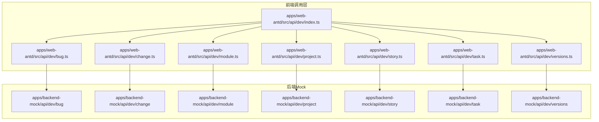
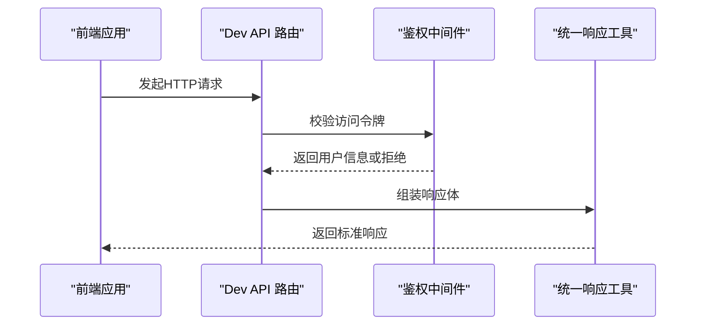
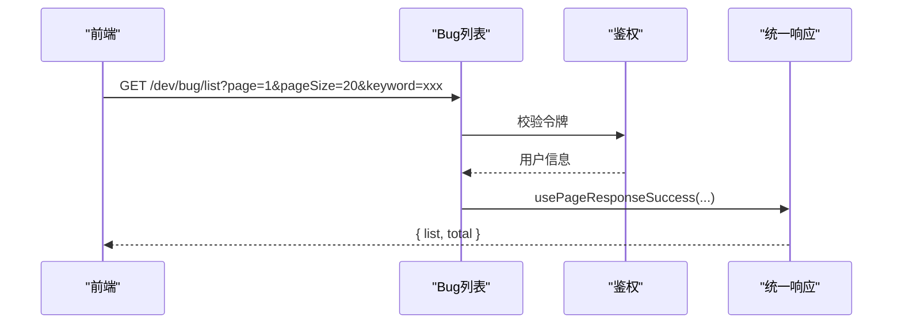
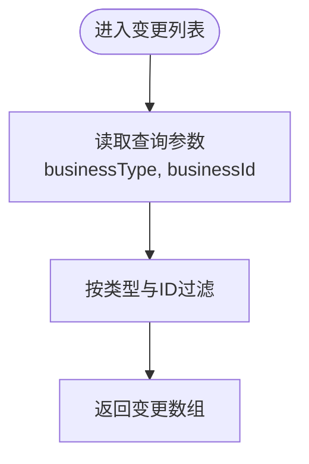
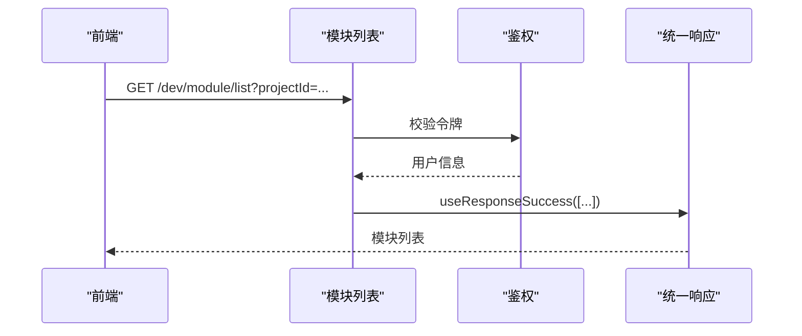
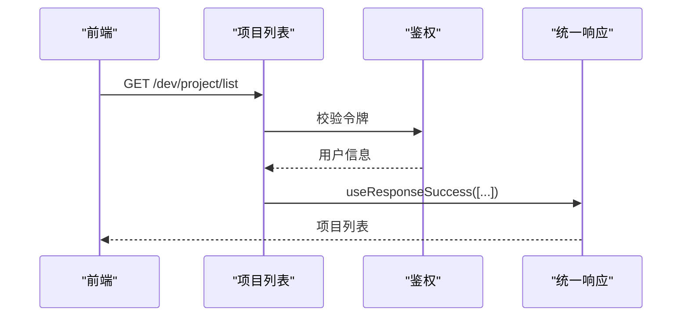
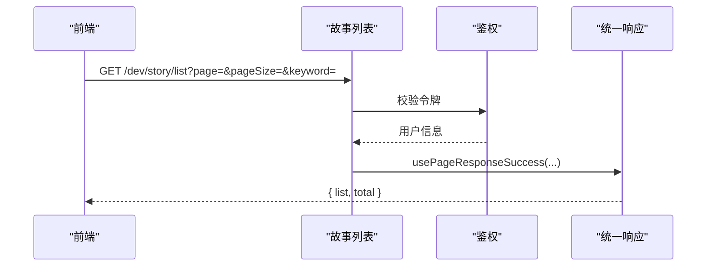
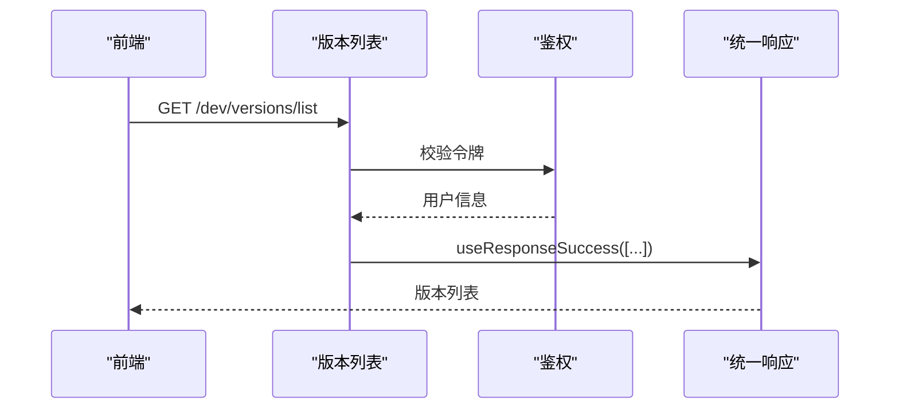
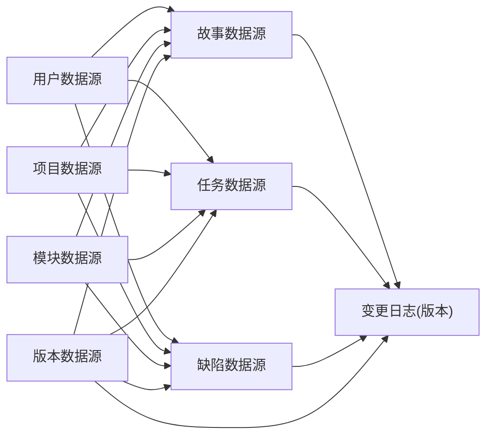

# 开发管理API

<cite>
**本文档引用的文件**
- [apps/backend-mock/api/dev/bug/.post.ts](file://apps/backend-mock/api/dev/bug/.post.ts)
- [apps/backend-mock/api/dev/bug/get.ts](file://apps/backend-mock/api/dev/bug/get.ts)
- [apps/backend-mock/api/dev/bug/list.ts](file://apps/backend-mock/api/dev/bug/list.ts)
- [apps/backend-mock/api/dev/bug/bugListByStoryId.ts](file://apps/backend-mock/api/dev/bug/bugListByStoryId.ts)
- [apps/backend-mock/api/dev/change/list.ts](file://apps/backend-mock/api/dev/change/list.ts)
- [apps/backend-mock/api/dev/module/.post.ts](file://apps/backend-mock/api/dev/module/.post.ts)
- [apps/backend-mock/api/dev/module/list.ts](file://apps/backend-mock/api/dev/module/list.ts)
- [apps/backend-mock/api/dev/project/.post.ts](file://apps/backend-mock/api/dev/project/.post.ts)
- [apps/backend-mock/api/dev/project/list.ts](file://apps/backend-mock/api/dev/project/list.ts)
- [apps/backend-mock/api/dev/story/.post.ts](file://apps/backend-mock/api/dev/story/.post.ts)
- [apps/backend-mock/api/dev/story/get.ts](file://apps/backend-mock/api/dev/story/get.ts)
- [apps/backend-mock/api/dev/story/list.ts](file://apps/backend-mock/api/dev/story/list.ts)
- [apps/backend-mock/api/dev/task/.post.ts](file://apps/backend-mock/api/dev/task/.post.ts)
- [apps/backend-mock/api/dev/task/get.ts](file://apps/backend-mock/api/dev/task/get.ts)
- [apps/backend-mock/api/dev/task/list.ts](file://apps/backend-mock/api/dev/task/list.ts)
- [apps/backend-mock/api/dev/task/taskListByStoryId.ts](file://apps/backend-mock/api/dev/task/taskListByStoryId.ts)
- [apps/backend-mock/api/dev/versions/.post.ts](file://apps/backend-mock/api/dev/versions/.post.ts)
- [apps/backend-mock/api/dev/versions/get.ts](file://apps/backend-mock/api/dev/versions/get.ts)
- [apps/backend-mock/api/dev/versions/getLastVersion.ts](file://apps/backend-mock/api/dev/versions/getLastVersion.ts)
- [apps/backend-mock/api/dev/versions/list.ts](file://apps/backend-mock/api/dev/versions/list.ts)
- [apps/backend-mock/api/dev/versions/statistics.ts](file://apps/backend-mock/api/dev/versions/statistics.ts)
- [apps/web-antd/src/api/dev/index.ts](file://apps/web-antd/src/api/dev/index.ts)
- [apps/web-antd/src/api/dev/bug.ts](file://apps/web-antd/src/api/dev/bug.ts)
- [apps/web-antd/src/api/dev/change.ts](file://apps/web-antd/src/api/dev/change.ts)
- [apps/web-antd/src/api/dev/module.ts](file://apps/web-antd/src/api/dev/module.ts)
- [apps/web-antd/src/api/dev/project.ts](file://apps/web-antd/src/api/dev/project.ts)
- [apps/web-antd/src/api/dev/story.ts](file://apps/web-antd/src/api/dev/story.ts)
- [apps/web-antd/src/api/dev/task.ts](file://apps/web-antd/src/api/dev/task.ts)
- [apps/web-antd/src/api/dev/versions.ts](file://apps/web-antd/src/api/dev/versions.ts)
</cite>

## 目录
1. [简介](#简介)
2. [项目结构](#项目结构)
3. [核心组件](#核心组件)
4. [架构总览](#架构总览)
5. [详细组件分析](#详细组件分析)
6. [依赖分析](#依赖分析)
7. [性能考虑](#性能考虑)
8. [故障排除指南](#故障排除指南)
9. [结论](#结论)
10. [附录](#附录)

## 简介
本文件面向Vben Admin的“开发管理”子系统，系统性梳理与整理后端Mock API中的开发相关端点，覆盖Bug管理、变更管理、模块管理、项目管理、故事管理、任务管理和版本管理等模块。文档逐项说明各模块的CRUD能力（列表查询、详情获取、新增、编辑、删除），给出请求参数、响应格式、状态码约定，并结合数据模型与接口定义，解释分页查询、条件筛选、排序以及模块间的业务关联关系。

## 项目结构
开发管理API位于后端Mock工程中，采用按功能域划分的目录组织方式：每个功能模块在apps/backend-mock/api/dev下拥有独立的子目录，包含该模块的HTTP端点实现与通用工具函数。前端调用层位于apps/web-antd/src/api/dev，统一导出各模块的API方法。

图示来源
- [apps/backend-mock/api/dev/bug/list.ts](file://apps/backend-mock/api/dev/bug/list.ts)
- [apps/backend-mock/api/dev/story/list.ts](file://apps/backend-mock/api/dev/story/list.ts)
- [apps/backend-mock/api/dev/task/list.ts](file://apps/backend-mock/api/dev/task/list.ts)
- [apps/backend-mock/api/dev/versions/list.ts](file://apps/backend-mock/api/dev/versions/list.ts)
- [apps/web-antd/src/api/dev/index.ts](file://apps/web-antd/src/api/dev/index.ts)

章节来源
- [apps/backend-mock/api/dev/bug/list.ts](file://apps/backend-mock/api/dev/bug/list.ts)
- [apps/backend-mock/api/dev/story/list.ts](file://apps/backend-mock/api/dev/story/list.ts)
- [apps/backend-mock/api/dev/task/list.ts](file://apps/backend-mock/api/dev/task/list.ts)
- [apps/backend-mock/api/dev/versions/list.ts](file://apps/backend-mock/api/dev/versions/list.ts)
- [apps/web-antd/src/api/dev/index.ts](file://apps/web-antd/src/api/dev/index.ts)

## 核心组件
- Bug管理：支持列表查询、详情查询、按故事ID过滤、新增提交。
- 变更管理：支持按业务类型与业务ID过滤的变更日志查询。
- 模块管理：支持按项目过滤的模块列表查询、新增提交。
- 项目管理：支持项目列表查询、新增提交。
- 故事管理：支持列表查询、详情查询、按项目与版本筛选、关键字搜索。
- 任务管理：支持列表查询、详情查询、按项目与版本筛选、关键字搜索。
- 版本管理：支持版本列表查询、最新版本查询、统计查询、新增提交。

章节来源
- [apps/backend-mock/api/dev/bug/list.ts](file://apps/backend-mock/api/dev/bug/list.ts)
- [apps/backend-mock/api/dev/bug/get.ts](file://apps/backend-mock/api/dev/bug/get.ts)
- [apps/backend-mock/api/dev/bug/bugListByStoryId.ts](file://apps/backend-mock/api/dev/bug/bugListByStoryId.ts)
- [apps/backend-mock/api/dev/change/list.ts](file://apps/backend-mock/api/dev/change/list.ts)
- [apps/backend-mock/api/dev/module/list.ts](file://apps/backend-mock/api/dev/module/list.ts)
- [apps/backend-mock/api/dev/project/list.ts](file://apps/backend-mock/api/dev/project/list.ts)
- [apps/backend-mock/api/dev/story/list.ts](file://apps/backend-mock/api/dev/story/list.ts)
- [apps/backend-mock/api/dev/story/get.ts](file://apps/backend-mock/api/dev/story/get.ts)
- [apps/backend-mock/api/dev/task/list.ts](file://apps/backend-mock/api/dev/task/list.ts)
- [apps/backend-mock/api/dev/task/get.ts](file://apps/backend-mock/api/dev/task/get.ts)
- [apps/backend-mock/api/dev/task/taskListByStoryId.ts](file://apps/backend-mock/api/dev/task/taskListByStoryId.ts)
- [apps/backend-mock/api/dev/versions/list.ts](file://apps/backend-mock/api/dev/versions/list.ts)
- [apps/backend-mock/api/dev/versions/get.ts](file://apps/backend-mock/api/dev/versions/get.ts)
- [apps/backend-mock/api/dev/versions/getLastVersion.ts](file://apps/backend-mock/api/dev/versions/getLastVersion.ts)
- [apps/backend-mock/api/dev/versions/statistics.ts](file://apps/backend-mock/api/dev/versions/statistics.ts)

## 架构总览
后端采用Nitro框架风格的事件处理器（eventHandler）组织路由；前端通过统一入口导出各模块API方法，便于在视图层按需调用。鉴权通过令牌校验中间件完成，所有端点均返回统一响应结构。

图示来源
- [apps/backend-mock/api/dev/bug/list.ts](file://apps/backend-mock/api/dev/bug/list.ts)
- [apps/backend-mock/api/dev/story/list.ts](file://apps/backend-mock/api/dev/story/list.ts)
- [apps/backend-mock/api/dev/task/list.ts](file://apps/backend-mock/api/dev/task/list.ts)
- [apps/web-antd/src/api/dev/index.ts](file://apps/web-antd/src/api/dev/index.ts)

## 详细组件分析

### Bug管理
- 列表查询
  - 方法与路径：GET /dev/bug/list
  - 查询参数
    - page: 页码，默认1
    - pageSize: 每页条数，默认20
    - projectId: 项目ID（可选）
    - versionId: 版本ID（可选）
    - bugStatus: 状态（可选）
    - keyword: 关键字（标题或编号模糊匹配）
    - includeId: 包含某条记录ID（可选）
  - 响应：分页响应，包含列表与总数
  - 业务规则：支持关键字在标题与编号上模糊匹配；可固定包含某条记录以优先显示；按bugId去重
- 详情获取
  - 方法与路径：GET /dev/bug/get
  - 查询参数
    - bugNum: 编号
  - 响应：单条Bug记录或空
- 新增提交
  - 方法与路径：POST /dev/bug
  - 请求体：无（示例端点不解析请求体）
  - 响应：成功标志
- 按故事ID查询
  - 方法与路径：GET /dev/bug/bugListByStoryId
  - 查询参数
    - storyId: 故事ID
  - 响应：该故事下的Bug列表

图示来源
- [apps/backend-mock/api/dev/bug/list.ts](file://apps/backend-mock/api/dev/bug/list.ts)
- [apps/backend-mock/api/dev/bug/get.ts](file://apps/backend-mock/api/dev/bug/get.ts)
- [apps/backend-mock/api/dev/bug/.post.ts](file://apps/backend-mock/api/dev/bug/.post.ts)
- [apps/backend-mock/api/dev/bug/bugListByStoryId.ts](file://apps/backend-mock/api/dev/bug/bugListByStoryId.ts)

章节来源
- [apps/backend-mock/api/dev/bug/list.ts](file://apps/backend-mock/api/dev/bug/list.ts)
- [apps/backend-mock/api/dev/bug/get.ts](file://apps/backend-mock/api/dev/bug/get.ts)
- [apps/backend-mock/api/dev/bug/.post.ts](file://apps/backend-mock/api/dev/bug/.post.ts)
- [apps/backend-mock/api/dev/bug/bugListByStoryId.ts](file://apps/backend-mock/api/dev/bug/bugListByStoryId.ts)

### 变更管理
- 列表查询
  - 方法与路径：GET /dev/change/list
  - 查询参数
    - businessType: 业务类型（可选）
    - businessId: 业务ID（可选）
  - 响应：变更日志数组
  - 业务规则：根据业务类型与业务ID过滤变更记录

图示来源
- [apps/backend-mock/api/dev/change/list.ts](file://apps/backend-mock/api/dev/change/list.ts)

章节来源
- [apps/backend-mock/api/dev/change/list.ts](file://apps/backend-mock/api/dev/change/list.ts)

### 模块管理
- 列表查询
  - 方法与路径：GET /dev/module/list
  - 查询参数
    - projectId: 项目ID（可选）
  - 响应：模块列表
- 新增提交
  - 方法与路径：POST /dev/module
  - 请求体：无（示例端点不解析请求体）
  - 响应：成功标志

图示来源
- [apps/backend-mock/api/dev/module/list.ts](file://apps/backend-mock/api/dev/module/list.ts)
- [apps/backend-mock/api/dev/module/.post.ts](file://apps/backend-mock/api/dev/module/.post.ts)

章节来源
- [apps/backend-mock/api/dev/module/list.ts](file://apps/backend-mock/api/dev/module/list.ts)
- [apps/backend-mock/api/dev/module/.post.ts](file://apps/backend-mock/api/dev/module/.post.ts)

### 项目管理
- 列表查询
  - 方法与路径：GET /dev/project/list
  - 查询参数：无
  - 响应：项目列表
- 新增提交
  - 方法与路径：POST /dev/project
  - 请求体：无（示例端点不解析请求体）
  - 响应：成功标志

图示来源
- [apps/backend-mock/api/dev/project/list.ts](file://apps/backend-mock/api/dev/project/list.ts)
- [apps/backend-mock/api/dev/project/.post.ts](file://apps/backend-mock/api/dev/project/.post.ts)

章节来源
- [apps/backend-mock/api/dev/project/list.ts](file://apps/backend-mock/api/dev/project/list.ts)
- [apps/backend-mock/api/dev/project/.post.ts](file://apps/backend-mock/api/dev/project/.post.ts)

### 故事管理
- 列表查询
  - 方法与路径：GET /dev/story/list
  - 查询参数
    - page: 页码，默认1
    - pageSize: 每页条数，默认20
    - projectId: 项目ID（可选）
    - versionId: 版本ID（可选）
    - storyStatus: 状态（可选）
    - keyword: 关键字（标题或编号模糊匹配）
    - includeId: 包含某条记录ID（可选）
  - 响应：分页响应，包含列表与总数
  - 业务规则：支持关键字在标题与编号上模糊匹配；可固定包含某条记录以优先显示；按storyId去重
- 详情获取
  - 方法与路径：GET /dev/story/get
  - 查询参数
    - storyNum: 编号
  - 响应：单条故事记录或空
- 新增提交
  - 方法与路径：POST /dev/story
  - 请求体：无（示例端点不解析请求体）
  - 响应：成功标志

图示来源
- [apps/backend-mock/api/dev/story/list.ts](file://apps/backend-mock/api/dev/story/list.ts)
- [apps/backend-mock/api/dev/story/get.ts](file://apps/backend-mock/api/dev/story/get.ts)
- [apps/backend-mock/api/dev/story/.post.ts](file://apps/backend-mock/api/dev/story/.post.ts)

章节来源
- [apps/backend-mock/api/dev/story/list.ts](file://apps/backend-mock/api/dev/story/list.ts)
- [apps/backend-mock/api/dev/story/get.ts](file://apps/backend-mock/api/dev/story/get.ts)
- [apps/backend-mock/api/dev/story/.post.ts](file://apps/backend-mock/api/dev/story/.post.ts)

### 任务管理
- 列表查询
  - 方法与路径：GET /dev/task/list
  - 查询参数
    - page: 页码，默认1
    - pageSize: 每页条数，默认20
    - projectId: 项目ID（可选）
    - versionId: 版本ID（可选）
    - taskTitle: 任务标题（可选，模糊匹配）
    - taskStatus: 状态（可选）
  - 响应：分页响应，包含列表与总数
- 详情获取
  - 方法与路径：GET /dev/task/get
  - 查询参数
    - taskNum: 编号
  - 响应：单条任务记录或空
- 新增提交
  - 方法与路径：POST /dev/task
  - 请求体：无（示例端点不解析请求体）
  - 响应：成功标志
- 按故事ID查询
  - 方法与路径：GET /dev/task/taskListByStoryId
  - 查询参数
    - storyId: 故事ID
  - 响应：该故事下的任务列表

图示来源
- [apps/backend-mock/api/dev/task/list.ts](file://apps/backend-mock/api/dev/task/list.ts)
- [apps/backend-mock/api/dev/task/get.ts](file://apps/backend-mock/api/dev/task/get.ts)
- [apps/backend-mock/api/dev/task/.post.ts](file://apps/backend-mock/api/dev/task/.post.ts)
- [apps/backend-mock/api/dev/task/taskListByStoryId.ts](file://apps/backend-mock/api/dev/task/taskListByStoryId.ts)

章节来源
- [apps/backend-mock/api/dev/task/list.ts](file://apps/backend-mock/api/dev/task/list.ts)
- [apps/backend-mock/api/dev/task/get.ts](file://apps/backend-mock/api/dev/task/get.ts)
- [apps/backend-mock/api/dev/task/.post.ts](file://apps/backend-mock/api/dev/task/.post.ts)
- [apps/backend-mock/api/dev/task/taskListByStoryId.ts](file://apps/backend-mock/api/dev/task/taskListByStoryId.ts)

### 版本管理
- 列表查询
  - 方法与路径：GET /dev/versions/list
  - 查询参数：无
  - 响应：版本列表
- 详情获取
  - 方法与路径：GET /dev/versions/get
  - 查询参数
    - versionId: 版本ID
  - 响应：单条版本记录或空
- 最新版本
  - 方法与路径：GET /dev/versions/getLastVersion
  - 查询参数：无
  - 响应：最新版本记录
- 统计
  - 方法与路径：GET /dev/versions/statistics
  - 查询参数：无
  - 响应：版本统计结果
- 新增提交
  - 方法与路径：POST /dev/versions
  - 请求体：无（示例端点不解析请求体）
  - 响应：成功标志

图示来源
- [apps/backend-mock/api/dev/versions/list.ts](file://apps/backend-mock/api/dev/versions/list.ts)
- [apps/backend-mock/api/dev/versions/get.ts](file://apps/backend-mock/api/dev/versions/get.ts)
- [apps/backend-mock/api/dev/versions/getLastVersion.ts](file://apps/backend-mock/api/dev/versions/getLastVersion.ts)
- [apps/backend-mock/api/dev/versions/statistics.ts](file://apps/backend-mock/api/dev/versions/statistics.ts)
- [apps/backend-mock/api/dev/versions/.post.ts](file://apps/backend-mock/api/dev/versions/.post.ts)

章节来源
- [apps/backend-mock/api/dev/versions/list.ts](file://apps/backend-mock/api/dev/versions/list.ts)
- [apps/backend-mock/api/dev/versions/get.ts](file://apps/backend-mock/api/dev/versions/get.ts)
- [apps/backend-mock/api/dev/versions/getLastVersion.ts](file://apps/backend-mock/api/dev/versions/getLastVersion.ts)
- [apps/backend-mock/api/dev/versions/statistics.ts](file://apps/backend-mock/api/dev/versions/statistics.ts)
- [apps/backend-mock/api/dev/versions/.post.ts](file://apps/backend-mock/api/dev/versions/.post.ts)

## 依赖分析
- 数据依赖
  - Bug/Story/Task均依赖项目、模块、版本与用户数据源生成器，确保跨模块数据一致性与关联关系真实。
  - 变更管理通过业务类型与业务ID关联到不同实体（故事、任务、缺陷、版本）。
- 前端依赖
  - 所有模块API通过统一入口导出，便于在页面中按需引入与组合使用。
- 安全与响应
  - 所有端点均经过鉴权校验；响应统一使用工具函数封装，保证一致的错误与成功结构。

图示来源
- [apps/backend-mock/api/dev/story/list.ts](file://apps/backend-mock/api/dev/story/list.ts)
- [apps/backend-mock/api/dev/task/list.ts](file://apps/backend-mock/api/dev/task/list.ts)
- [apps/backend-mock/api/dev/bug/list.ts](file://apps/backend-mock/api/dev/bug/list.ts)
- [apps/backend-mock/api/dev/change/list.ts](file://apps/backend-mock/api/dev/change/list.ts)

章节来源
- [apps/backend-mock/api/dev/story/list.ts](file://apps/backend-mock/api/dev/story/list.ts)
- [apps/backend-mock/api/dev/task/list.ts](file://apps/backend-mock/api/dev/task/list.ts)
- [apps/backend-mock/api/dev/bug/list.ts](file://apps/backend-mock/api/dev/bug/list.ts)
- [apps/backend-mock/api/dev/change/list.ts](file://apps/backend-mock/api/dev/change/list.ts)

## 性能考虑
- 列表查询默认启用分页，建议前端在大数据量场景下始终传入page与pageSize，避免一次性拉取全量数据。
- 过滤条件建议尽量使用精确字段（如ID类），减少字符串模糊匹配带来的扫描成本。
- 对于需要固定包含某条记录的场景，合理使用includeId可提升用户体验但会增加一次查找与数组前置操作，建议仅在必要时使用。
- 建议对频繁查询的字段建立索引（在真实数据库场景下），或在前端缓存热点数据。

## 故障排除指南
- 未授权访问
  - 现象：返回未授权响应
  - 处理：检查令牌有效性与过期时间，重新登录获取新令牌
- 参数缺失或类型错误
  - 现象：过滤条件无效或返回异常
  - 处理：确认查询参数类型与命名正确（如ID为字符串，数值型参数需转换）
- 响应格式不一致
  - 现象：部分端点返回分页对象，部分返回数组
  - 处理：统一使用usePageResponseSuccess处理分页场景；非分页场景使用useResponseSuccess

章节来源
- [apps/backend-mock/api/dev/bug/list.ts](file://apps/backend-mock/api/dev/bug/list.ts)
- [apps/backend-mock/api/dev/story/list.ts](file://apps/backend-mock/api/dev/story/list.ts)
- [apps/backend-mock/api/dev/task/list.ts](file://apps/backend-mock/api/dev/task/list.ts)

## 结论
本文档系统化梳理了Vben Admin开发管理API的端点与数据模型，明确了各模块的CRUD能力、查询参数、响应格式与业务关联。建议在真实生产环境中替换Mock数据源为真实数据库访问，并完善鉴权与权限控制策略，同时遵循本文档的参数与响应规范，确保前后端协作顺畅。

## 附录
- 前端API导出入口
  - 统一导出各模块API方法，便于在页面中按需引入与组合使用
- 端点一览（按模块）
  - Bug：/dev/bug/list, /dev/bug/get, /dev/bug, /dev/bug/bugListByStoryId
  - 变更：/dev/change/list
  - 模块：/dev/module/list, /dev/module
  - 项目：/dev/project/list, /dev/project
  - 故事：/dev/story/list, /dev/story/get, /dev/story
  - 任务：/dev/task/list, /dev/task/get, /dev/task, /dev/task/taskListByStoryId
  - 版本：/dev/versions/list, /dev/versions/get, /dev/versions/getLastVersion, /dev/versions/statistics, /dev/versions

章节来源
- [apps/web-antd/src/api/dev/index.ts](file://apps/web-antd/src/api/dev/index.ts)
- [apps/web-antd/src/api/dev/bug.ts](file://apps/web-antd/src/api/dev/bug.ts)
- [apps/web-antd/src/api/dev/change.ts](file://apps/web-antd/src/api/dev/change.ts)
- [apps/web-antd/src/api/dev/module.ts](file://apps/web-antd/src/api/dev/module.ts)
- [apps/web-antd/src/api/dev/project.ts](file://apps/web-antd/src/api/dev/project.ts)
- [apps/web-antd/src/api/dev/story.ts](file://apps/web-antd/src/api/dev/story.ts)
- [apps/web-antd/src/api/dev/task.ts](file://apps/web-antd/src/api/dev/task.ts)
- [apps/web-antd/src/api/dev/versions.ts](file://apps/web-antd/src/api/dev/versions.ts)