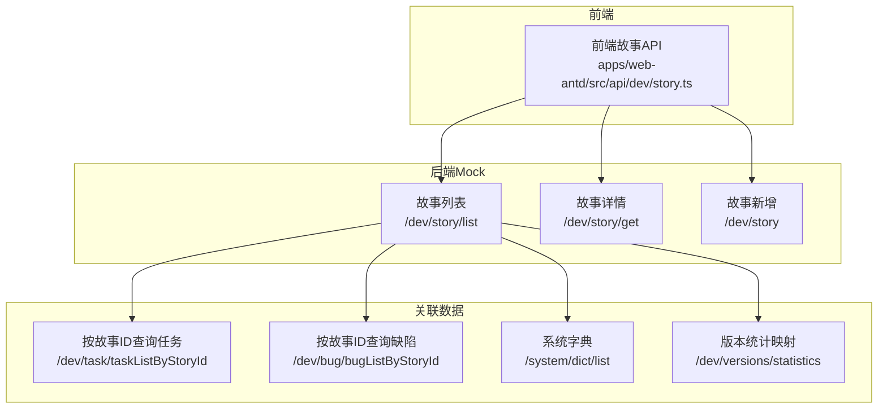
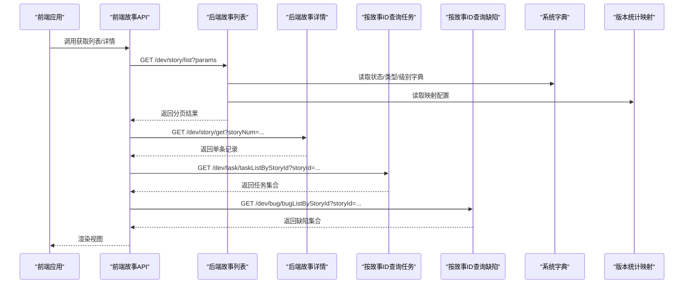
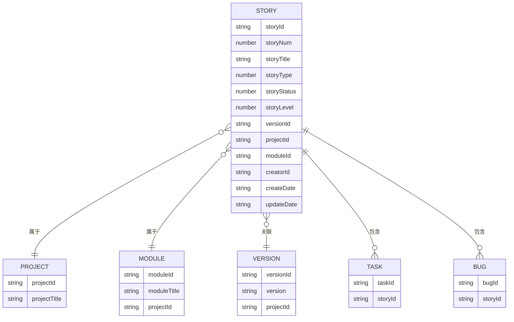
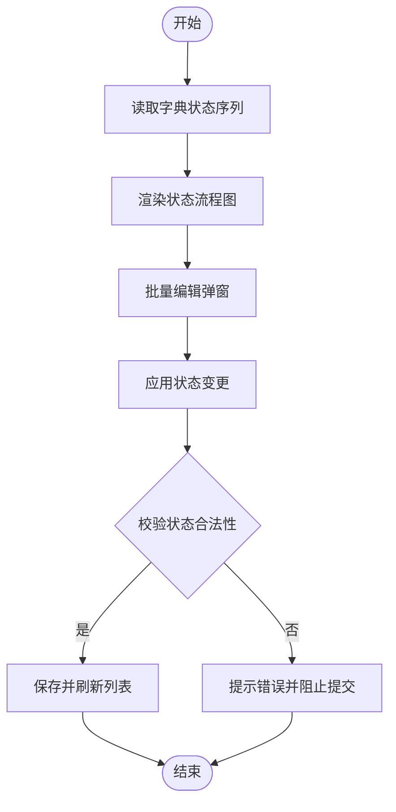
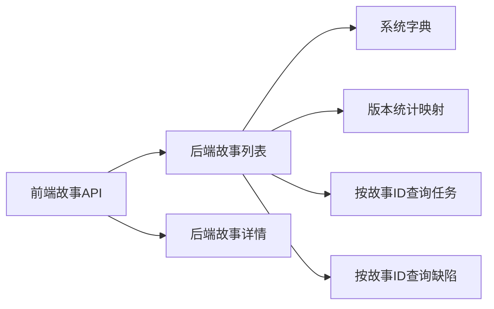

# 故事管理API

<cite>
**本文引用的文件**
- [apps/backend-mock/api/dev/story/list.ts](file://apps/backend-mock/api/dev/story/list.ts)
- [apps/backend-mock/api/dev/story/get.ts](file://apps/backend-mock/api/dev/story/get.ts)
- [apps/backend-mock/api/dev/story/.post.ts](file://apps/backend-mock/api/dev/story/.post.ts)
- [apps/web-antd/src/api/dev/story.ts](file://apps/web-antd/src/api/dev/story.ts)
- [apps/backend-mock/api/dev/task/taskListByStoryId.ts](file://apps/backend-mock/api/dev/task/taskListByStoryId.ts)
- [apps/backend-mock/api/dev/bug/bugListByStoryId.ts](file://apps/backend-mock/api/dev/bug/bugListByStoryId.ts)
- [apps/backend-mock/api/system/dict/list.ts](file://apps/backend-mock/api/system/dict/list.ts)
- [apps/backend-mock/api/dev/versions/statistics.ts](file://apps/backend-mock/api/dev/versions/statistics.ts)
- [apps/web-antd/src/views/flow/demo/index.vue](file://apps/web-antd/src/views/flow/demo/index.vue)
</cite>

## 目录
1. [简介](#简介)
2. [项目结构](#项目结构)
3. [核心组件](#核心组件)
4. [架构总览](#架构总览)
5. [详细组件分析](#详细组件分析)
6. [依赖分析](#依赖分析)
7. [性能考虑](#性能考虑)
8. [故障排查指南](#故障排查指南)
9. [结论](#结论)
10. [附录](#附录)

## 简介
本文件为“故事管理API”的权威文档，覆盖故事列表查询、故事详情获取、故事新增、故事编辑、故事删除（如后端实现）等端点；并给出完整的故事模型定义、排序与筛选能力、分页机制、与项目/模块/任务/Bug的关联关系、批量操作与状态流转建议，以及最佳实践与Scrum流程集成要点。本文所有接口定义均以仓库现有实现为准。

## 项目结构
- 后端Mock层位于 apps/backend-mock/api/dev/story，提供故事的列表、详情、新增等端点。
- 前端调用层位于 apps/web-antd/src/api/dev/story.ts，封装了故事的增删改查调用。
- 关联关系通过版本、项目、模块、任务、缺陷等维度在Mock数据中体现。
- 字典与状态映射位于系统字典与版本统计模块，用于状态、类型、级别的本地化展示。

图表来源
- [apps/web-antd/src/api/dev/story.ts:1-91](file://apps/web-antd/src/api/dev/story.ts#L1-L91)
- [apps/backend-mock/api/dev/story/list.ts:1-149](file://apps/backend-mock/api/dev/story/list.ts#L1-L149)
- [apps/backend-mock/api/dev/story/get.ts:1-17](file://apps/backend-mock/api/dev/story/get.ts#L1-L17)
- [apps/backend-mock/api/dev/task/taskListByStoryId.ts:1-24](file://apps/backend-mock/api/dev/task/taskListByStoryId.ts#L1-L24)
- [apps/backend-mock/api/dev/bug/bugListByStoryId.ts:1-24](file://apps/backend-mock/api/dev/bug/bugListByStoryId.ts#L1-L24)
- [apps/backend-mock/api/system/dict/list.ts:158-308](file://apps/backend-mock/api/system/dict/list.ts#L158-L308)
- [apps/backend-mock/api/dev/versions/statistics.ts:47-93](file://apps/backend-mock/api/dev/versions/statistics.ts#L47-L93)

章节来源
- [apps/web-antd/src/api/dev/story.ts:1-91](file://apps/web-antd/src/api/dev/story.ts#L1-L91)
- [apps/backend-mock/api/dev/story/list.ts:1-149](file://apps/backend-mock/api/dev/story/list.ts#L1-L149)
- [apps/backend-mock/api/dev/story/get.ts:1-17](file://apps/backend-mock/api/dev/story/get.ts#L1-L17)
- [apps/backend-mock/api/dev/task/taskListByStoryId.ts:1-24](file://apps/backend-mock/api/dev/task/taskListByStoryId.ts#L1-L24)
- [apps/backend-mock/api/dev/bug/bugListByStoryId.ts:1-24](file://apps/backend-mock/api/dev/bug/bugListByStoryId.ts#L1-L24)
- [apps/backend-mock/api/system/dict/list.ts:158-308](file://apps/backend-mock/api/system/dict/list.ts#L158-L308)
- [apps/backend-mock/api/dev/versions/statistics.ts:47-93](file://apps/backend-mock/api/dev/versions/statistics.ts#L47-L93)

## 核心组件
- 故事模型：包含故事ID、编号、标题、富文本描述、类型、状态、优先级、来源、关联项目/模块/版本、创建/更新时间、负责人列表等字段。
- 列表查询：支持关键词、项目ID、版本ID、状态过滤，以及分页与“包含某ID”前置返回。
- 详情查询：通过故事编号查询单条记录。
- 新增/编辑/删除：前端提供新增与编辑调用，删除端点存在但未在前端暴露；后端鉴权中间件统一校验。

章节来源
- [apps/web-antd/src/api/dev/story.ts:11-42](file://apps/web-antd/src/api/dev/story.ts#L11-L42)
- [apps/backend-mock/api/dev/story/list.ts:94-148](file://apps/backend-mock/api/dev/story/list.ts#L94-L148)
- [apps/backend-mock/api/dev/story/get.ts:6-16](file://apps/backend-mock/api/dev/story/get.ts#L6-L16)
- [apps/backend-mock/api/dev/story/.post.ts:1-17](file://apps/backend-mock/api/dev/story/.post.ts#L1-L17)

## 架构总览
下图展示了从前端到后端Mock的典型调用链路，以及与任务、缺陷、字典、版本统计的关联。

图表来源
- [apps/web-antd/src/api/dev/story.ts:49-90](file://apps/web-antd/src/api/dev/story.ts#L49-L90)
- [apps/backend-mock/api/dev/story/list.ts:94-148](file://apps/backend-mock/api/dev/story/list.ts#L94-L148)
- [apps/backend-mock/api/dev/story/get.ts:6-16](file://apps/backend-mock/api/dev/story/get.ts#L6-L16)
- [apps/backend-mock/api/dev/task/taskListByStoryId.ts:7-23](file://apps/backend-mock/api/dev/task/taskListByStoryId.ts#L7-L23)
- [apps/backend-mock/api/dev/bug/bugListByStoryId.ts:7-23](file://apps/backend-mock/api/dev/bug/bugListByStoryId.ts#L7-L23)
- [apps/backend-mock/api/system/dict/list.ts:158-308](file://apps/backend-mock/api/system/dict/list.ts#L158-L308)
- [apps/backend-mock/api/dev/versions/statistics.ts:47-93](file://apps/backend-mock/api/dev/versions/statistics.ts#L47-L93)

## 详细组件分析

### 故事列表查询
- 方法与路径
  - 方法：GET
  - 路径：/dev/story/list
- 请求参数
  - page：页码，默认1
  - pageSize：每页条数，默认20
  - projectId：项目ID（可选）
  - versionId：版本ID（可选）
  - storyStatus：故事状态（可选）
  - keyword：关键词（标题或编号模糊匹配）
  - includeId：若指定，将该ID对应记录前置返回
- 过滤逻辑
  - 支持按项目ID、版本ID、状态精确过滤
  - 支持按标题或编号关键字模糊匹配
  - includeId会将目标记录插入列表开头
- 排序与去重
  - 列表按故事ID去重，保证唯一性
- 响应格式
  - 分页响应：包含总条目、当前页、每页大小与数据列表
- 状态码
  - 200 成功
  - 401 未授权
- 示例
  - 请求：GET /dev/story/list?page=1&pageSize=20&projectId=xxx&keyword=xxx
  - 响应：分页对象，包含列表项

章节来源
- [apps/backend-mock/api/dev/story/list.ts:94-148](file://apps/backend-mock/api/dev/story/list.ts#L94-L148)
- [apps/web-antd/src/api/dev/story.ts:49-53](file://apps/web-antd/src/api/dev/story.ts#L49-L53)

### 故事详情获取
- 方法与路径
  - 方法：GET
  - 路径：/dev/story/get
- 请求参数
  - storyNum：故事编号（数字）
- 响应格式
  - 单条故事记录或null
- 状态码
  - 200 成功
  - 401 未授权

章节来源
- [apps/backend-mock/api/dev/story/get.ts:6-16](file://apps/backend-mock/api/dev/story/get.ts#L6-L16)
- [apps/web-antd/src/api/dev/story.ts:86-90](file://apps/web-antd/src/api/dev/story.ts#L86-L90)

### 故事新增
- 方法与路径
  - 方法：POST
  - 路径：/dev/story
- 请求体
  - 除故事ID外的全部字段（见“故事模型”）
- 响应格式
  - 成功返回空对象或约定的成功载荷
- 状态码
  - 200 成功
  - 401 未授权

章节来源
- [apps/backend-mock/api/dev/story/.post.ts:1-17](file://apps/backend-mock/api/dev/story/.post.ts#L1-L17)
- [apps/web-antd/src/api/dev/story.ts:60-65](file://apps/web-antd/src/api/dev/story.ts#L60-L65)

### 故事编辑
- 方法与路径
  - 方法：PUT
  - 路径：/dev/story/{id}
- 请求体
  - 除故事ID外的全部字段
- 响应格式
  - 成功返回空对象或约定的成功载荷
- 状态码
  - 200 成功
  - 401 未授权

章节来源
- [apps/web-antd/src/api/dev/story.ts:73-79](file://apps/web-antd/src/api/dev/story.ts#L73-L79)

### 故事删除（后端实现）
- 方法与路径
  - 方法：DELETE
  - 路径：/dev/story/{id}
- 备注
  - 后端存在删除端点实现，但前端未暴露删除调用；如需启用，请在前端story API中补充删除方法并在界面添加入口。

章节来源
- [apps/backend-mock/api/dev/story/.post.ts:1-17](file://apps/backend-mock/api/dev/story/.post.ts#L1-L17)
- [apps/web-antd/src/api/dev/story.ts:60-65](file://apps/web-antd/src/api/dev/story.ts#L60-L65)

### 故事模型定义
- 字段清单
  - storyId：故事ID（字符串UUID）
  - pid：父级ID（字符串或null）
  - storyTitle：标题（字符串或任意类型）
  - storyNum：故事编号（数字）
  - creatorName：创建人姓名（字符串）
  - creatorId：创建人ID（字符串）
  - storyRichText：富文本描述（字符串）
  - files：附件URL（字符串）
  - storyType：需求类型（数字枚举）
  - storyStatus：需求状态（数字枚举）
  - storyLevel：优先级（数字枚举）
  - versionId：关联版本ID（字符串或null）
  - version：关联版本名称（字符串或null）
  - projectId：关联项目ID（字符串或null）
  - projectTitle：关联项目名称（字符串或null）
  - moduleId：关联模块ID（字符串或null）
  - moduleTitle：关联模块名称（字符串或null）
  - source：来源（数字枚举）
  - createDate：创建时间（字符串）
  - updateDate：更新时间（字符串）
  - userList：负责人列表（数组，含userId、realName、avatar）

章节来源
- [apps/web-antd/src/api/dev/story.ts:11-42](file://apps/web-antd/src/api/dev/story.ts#L11-L42)

### 关联关系与数据流
- 与项目/模块/版本
  - 列表接口在Mock阶段随机选择项目、模块、版本作为示例数据，便于演示全链路关联。
- 与任务
  - 可通过按故事ID查询任务接口获取该故事下的任务集合。
- 与缺陷
  - 可通过按故事ID查询缺陷接口获取该故事下的缺陷集合。
- 字典与映射
  - 系统字典提供状态、类型、级别的本地化标签与取值映射。
  - 版本统计模块提供需求类型/来源/状态的映射表，便于前端渲染与校验。

图表来源
- [apps/backend-mock/api/dev/story/list.ts:46-84](file://apps/backend-mock/api/dev/story/list.ts#L46-L84)
- [apps/backend-mock/api/dev/task/taskListByStoryId.ts:15-19](file://apps/backend-mock/api/dev/task/taskListByStoryId.ts#L15-L19)
- [apps/backend-mock/api/dev/bug/bugListByStoryId.ts:15-19](file://apps/backend-mock/api/dev/bug/bugListByStoryId.ts#L15-L19)
- [apps/backend-mock/api/system/dict/list.ts:158-308](file://apps/backend-mock/api/system/dict/list.ts#L158-L308)

### 批量操作与状态流转
- 批量操作
  - 前端存在批量编辑弹窗，支持对状态、类型、优先级、描述、附件等字段进行批量修改。
- 状态流转
  - 字典中定义了需求状态序列（如待评审→开发中→测试中→产品验收中→业务验收中→已关闭），前端演示了基于字典的状态流程图，便于理解Scrum中的状态推进。

图表来源
- [apps/web-antd/src/views/flow/demo/index.vue:10-28](file://apps/web-antd/src/views/flow/demo/index.vue#L10-L28)
- [apps/backend-mock/api/system/dict/list.ts:158-308](file://apps/backend-mock/api/system/dict/list.ts#L158-L308)

章节来源
- [apps/web-antd/src/views/flow/demo/index.vue:1-35](file://apps/web-antd/src/views/flow/demo/index.vue#L1-L35)
- [apps/backend-mock/api/system/dict/list.ts:158-308](file://apps/backend-mock/api/system/dict/list.ts#L158-L308)

## 依赖分析
- 前端故事API依赖后端故事端点；列表与详情分别对应不同后端路由。
- 列表查询依赖系统字典与版本统计映射，用于状态/类型/级别的本地化展示。
- 关联查询依赖任务与缺陷按故事ID查询接口。
- 删除端点存在但未在前端暴露，耦合度较低，便于按需启用。

图表来源
- [apps/web-antd/src/api/dev/story.ts:49-90](file://apps/web-antd/src/api/dev/story.ts#L49-L90)
- [apps/backend-mock/api/dev/story/list.ts:94-148](file://apps/backend-mock/api/dev/story/list.ts#L94-L148)
- [apps/backend-mock/api/system/dict/list.ts:158-308](file://apps/backend-mock/api/system/dict/list.ts#L158-L308)
- [apps/backend-mock/api/dev/versions/statistics.ts:47-93](file://apps/backend-mock/api/dev/versions/statistics.ts#L47-L93)
- [apps/backend-mock/api/dev/task/taskListByStoryId.ts:7-23](file://apps/backend-mock/api/dev/task/taskListByStoryId.ts#L7-L23)
- [apps/backend-mock/api/dev/bug/bugListByStoryId.ts:7-23](file://apps/backend-mock/api/dev/bug/bugListByStoryId.ts#L7-L23)

章节来源
- [apps/web-antd/src/api/dev/story.ts:1-91](file://apps/web-antd/src/api/dev/story.ts#L1-L91)
- [apps/backend-mock/api/dev/story/list.ts:94-148](file://apps/backend-mock/api/dev/story/list.ts#L94-L148)

## 性能考虑
- 列表过滤与分页
  - 使用关键词、项目ID、版本ID、状态等条件进行服务端侧过滤，避免一次性返回全量数据。
  - 分页参数默认值合理，建议前端根据表格宽度与用户习惯调整pageSize。
- 去重策略
  - 按故事ID去重，确保列表唯一性，减少重复渲染与内存占用。
- Mock数据规模
  - 当前Mock生成100条故事数据，实际生产环境建议结合数据库索引与分页策略优化查询性能。

## 故障排查指南
- 未授权访问
  - 若返回未授权，请检查请求头中的访问令牌是否有效，并确认后端鉴权中间件已正确加载。
- 参数缺失或类型不匹配
  - 确认请求参数类型与后端期望一致（如page/pageSize为字符串，keyword为字符串）。
- 关键词无结果
  - 关键词同时匹配标题与编号，若仍无结果，检查输入是否包含特殊字符或大小写差异。
- includeId无效
  - 确认includeId对应的故事ID存在于列表中，否则不会被前置。

章节来源
- [apps/backend-mock/api/dev/story/list.ts:94-148](file://apps/backend-mock/api/dev/story/list.ts#L94-L148)
- [apps/backend-mock/api/dev/story/get.ts:6-16](file://apps/backend-mock/api/dev/story/get.ts#L6-L16)
- [apps/backend-mock/api/dev/story/.post.ts:1-17](file://apps/backend-mock/api/dev/story/.post.ts#L1-L17)

## 结论
本API文档基于仓库现有实现，明确了故事管理的核心端点、请求参数、响应格式与状态码，并给出了故事模型、关联关系、批量操作与状态流转的实践建议。建议在生产环境中引入数据库与真实鉴权体系，完善删除端点与更严格的参数校验，以满足Scrum流程与团队协作的实际需要。

## 附录
- Scrum集成要点
  - 使用状态字典驱动的流程图指导团队进行状态推进（待评审→开发中→测试中→验收中→已关闭）。
  - 在故事列表中展示优先级与类型，便于迭代计划与排期。
  - 将任务与缺陷与故事绑定，形成“用户故事—任务—缺陷”的完整追踪闭环。