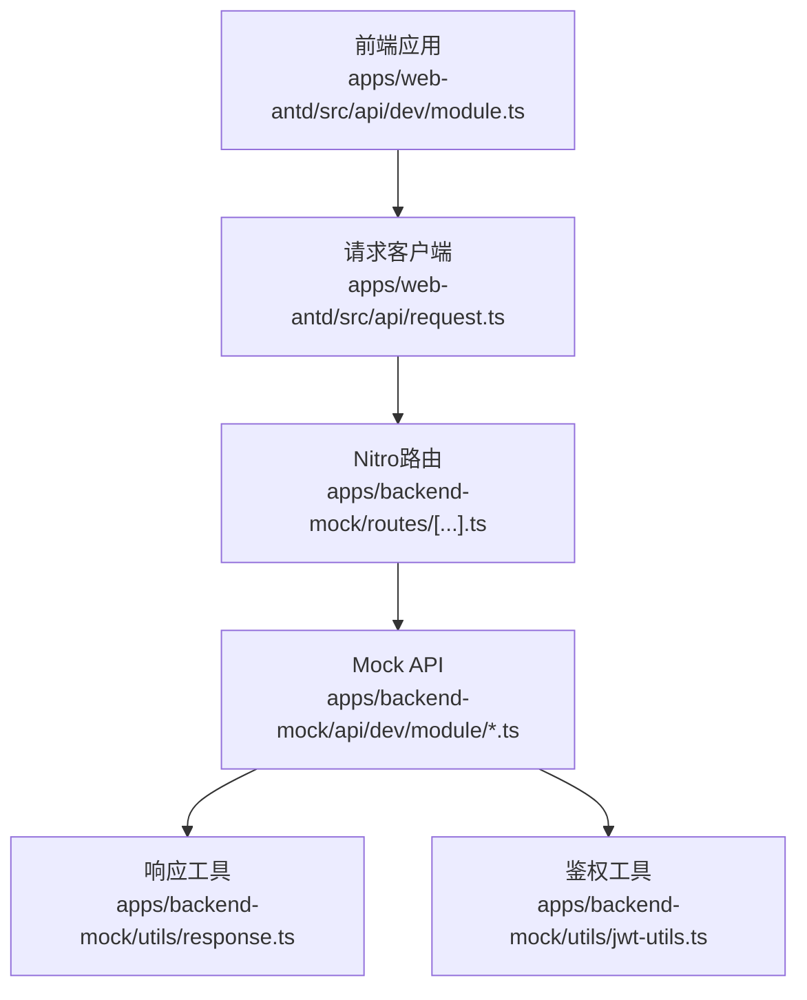
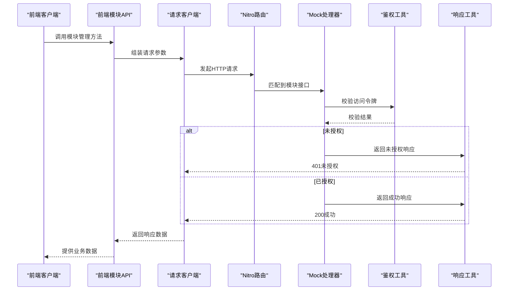
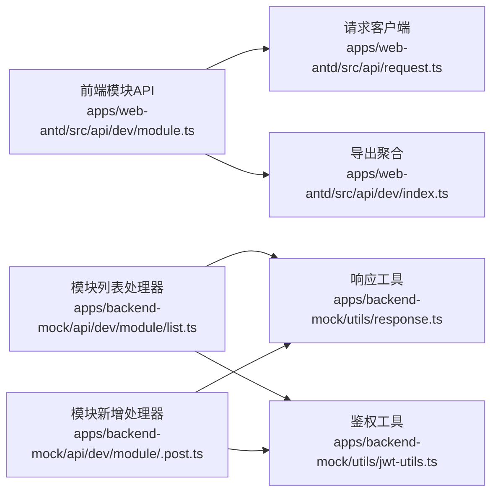

# 模块管理API

<cite>
**本文引用的文件**
- [apps/backend-mock/api/dev/module/.post.ts](file://apps/backend-mock/api/dev/module/.post.ts)
- [apps/backend-mock/api/dev/module/list.ts](file://apps/backend-mock/api/dev/module/list.ts)
- [apps/web-antd/src/api/dev/module.ts](file://apps/web-antd/src/api/dev/module.ts)
- [apps/web-antd/src/api/dev/index.ts](file://apps/web-antd/src/api/dev/index.ts)
- [apps/backend-mock/utils/response.ts](file://apps/backend-mock/utils/response.ts)
- [apps/backend-mock/utils/jwt-utils.ts](file://apps/backend-mock/utils/jwt-utils.ts)
- [apps/backend-mock/nitro.config.ts](file://apps/backend-mock/nitro.config.ts)
- [apps/backend-mock/routes/[...].ts](file://apps/backend-mock/routes/[...].ts)
- [apps/web-antd/src/api/request.ts](file://apps/web-antd/src/api/request.ts)
</cite>

## 目录
1. [简介](#简介)
2. [项目结构](#项目结构)
3. [核心组件](#核心组件)
4. [架构总览](#架构总览)
5. [详细组件分析](#详细组件分析)
6. [依赖分析](#依赖分析)
7. [性能考虑](#性能考虑)
8. [故障排查指南](#故障排查指南)
9. [结论](#结论)
10. [附录](#附录)

## 简介
本文件为“模块管理API”的权威技术文档，覆盖模块相关的所有REST端点：模块列表查询、模块详情获取、模块新增、模块编辑与模块删除。文档同时给出：
- 每个端点的HTTP方法、URL路径、请求参数、响应格式与状态码
- 完整的模块数据模型定义（字段、类型、约束）
- 层级查询、项目关联筛选与状态过滤的使用方式
- 模块与项目、任务之间的关联关系及模块树形结构管理
- 实际请求与响应示例（以路径形式呈现）
- 权限控制与数据验证规则

## 项目结构
模块管理API由前端Web应用与后端Mock服务共同构成：
- 前端通过统一请求客户端发起HTTP请求
- 后端Mock服务提供REST接口，内置鉴权校验与响应封装
- 路由与Nitro配置确保接口可被正确访问

图表来源
- [apps/web-antd/src/api/dev/module.ts:1-58](file://apps/web-antd/src/api/dev/module.ts#L1-L58)
- [apps/web-antd/src/api/request.ts](file://apps/web-antd/src/api/request.ts)
- [apps/backend-mock/routes/[...].ts](file://apps/backend-mock/routes/[...].ts)
- [apps/backend-mock/api/dev/module/list.ts:1-74](file://apps/backend-mock/api/dev/module/list.ts#L1-L74)
- [apps/backend-mock/utils/response.ts](file://apps/backend-mock/utils/response.ts)
- [apps/backend-mock/utils/jwt-utils.ts](file://apps/backend-mock/utils/jwt-utils.ts)

章节来源
- [apps/web-antd/src/api/dev/module.ts:1-58](file://apps/web-antd/src/api/dev/module.ts#L1-L58)
- [apps/backend-mock/api/dev/module/list.ts:1-74](file://apps/backend-mock/api/dev/module/list.ts#L1-L74)
- [apps/backend-mock/utils/response.ts](file://apps/backend-mock/utils/response.ts)
- [apps/backend-mock/utils/jwt-utils.ts](file://apps/backend-mock/utils/jwt-utils.ts)
- [apps/backend-mock/routes/[...].ts](file://apps/backend-mock/routes/[...].ts)

## 核心组件
- 前端模块API封装：提供模块列表查询、创建、更新等方法
- 后端Mock模块接口：实现模块列表查询、新增等端点
- 鉴权与响应工具：统一鉴权校验与响应格式
- 请求客户端：统一的HTTP请求封装

章节来源
- [apps/web-antd/src/api/dev/module.ts:1-58](file://apps/web-antd/src/api/dev/module.ts#L1-L58)
- [apps/backend-mock/api/dev/module/list.ts:1-74](file://apps/backend-mock/api/dev/module/list.ts#L1-L74)
- [apps/backend-mock/utils/response.ts](file://apps/backend-mock/utils/response.ts)
- [apps/backend-mock/utils/jwt-utils.ts](file://apps/backend-mock/utils/jwt-utils.ts)

## 架构总览
模块管理API采用“前端请求 -> Nitro路由 -> Mock处理器 -> 工具函数”的链路。鉴权通过JWT工具完成，响应通过统一工具封装。

图表来源
- [apps/web-antd/src/api/dev/module.ts:1-58](file://apps/web-antd/src/api/dev/module.ts#L1-L58)
- [apps/web-antd/src/api/request.ts](file://apps/web-antd/src/api/request.ts)
- [apps/backend-mock/routes/[...].ts](file://apps/backend-mock/routes/[...].ts)
- [apps/backend-mock/api/dev/module/.post.ts:1-17](file://apps/backend-mock/api/dev/module/.post.ts#L1-L17)
- [apps/backend-mock/utils/jwt-utils.ts](file://apps/backend-mock/utils/jwt-utils.ts)
- [apps/backend-mock/utils/response.ts](file://apps/backend-mock/utils/response.ts)

## 详细组件分析

### 模块数据模型
模块对象包含以下字段（均为字符串或数值类型，必要字段标注为必填）：
- moduleId: 模块唯一标识（必填）
- moduleTitle: 模块标题（必填）
- pid: 父级模块标识（可选，支持树形结构）
- projectId: 所属项目标识（可选，用于项目关联筛选）
- sort: 排序值（可选）
- creatorId: 创建人标识（必填）
- creatorName: 创建人姓名（必填）
- updateDate: 更新时间（必填）
- createDate: 创建时间（必填）

章节来源
- [apps/web-antd/src/api/dev/module.ts:5-16](file://apps/web-antd/src/api/dev/module.ts#L5-L16)
- [apps/backend-mock/api/dev/module/list.ts:24-45](file://apps/backend-mock/api/dev/module/list.ts#L24-L45)

### 端点定义与规范

#### 1) 模块列表查询
- 方法与路径
  - GET /dev/module/list
- 请求参数
  - projectId: 所属项目标识（可选，用于按项目筛选）
- 响应数据
  - 数组，元素为模块对象
- 状态码
  - 200 成功
  - 401 未授权
- 示例
  - 请求示例：GET /dev/module/list?projectId=xxx
  - 响应示例：见“模块列表查询”返回数据结构

章节来源
- [apps/web-antd/src/api/dev/module.ts:24-31](file://apps/web-antd/src/api/dev/module.ts#L24-L31)
- [apps/backend-mock/api/dev/module/list.ts:54-74](file://apps/backend-mock/api/dev/module/list.ts#L54-L74)

#### 2) 模块新增
- 方法与路径
  - POST /dev/module
- 请求体
  - 除moduleId外的模块对象字段（如moduleTitle、pid、projectId、sort、creatorId、creatorName、updateDate、createDate）
- 响应数据
  - 成功时返回空数据体
- 状态码
  - 200 成功
  - 401 未授权
- 示例
  - 请求示例：POST /dev/module（请求体字段见“模块数据模型”）
  - 响应示例：200 成功，无内容

章节来源
- [apps/web-antd/src/api/dev/module.ts:38-43](file://apps/web-antd/src/api/dev/module.ts#L38-L43)
- [apps/backend-mock/api/dev/module/.post.ts:9-17](file://apps/backend-mock/api/dev/module/.post.ts#L9-L17)

#### 3) 模块编辑
- 方法与路径
  - PUT /dev/module/{id}
- 路径参数
  - id: 模块唯一标识（必填）
- 请求体
  - 除moduleId外的模块对象字段
- 响应数据
  - 成功时返回空数据体
- 状态码
  - 200 成功
  - 401 未授权
- 示例
  - 请求示例：PUT /dev/module/{id}（请求体字段见“模块数据模型”）
  - 响应示例：200 成功，无内容

章节来源
- [apps/web-antd/src/api/dev/module.ts:51-57](file://apps/web-antd/src/api/dev/module.ts#L51-L57)

#### 4) 模块删除
- 方法与路径
  - DELETE /dev/module/{id}
- 路径参数
  - id: 模块唯一标识（必填）
- 响应数据
  - 成功时返回空数据体
- 状态码
  - 200 成功
  - 401 未授权
- 示例
  - 请求示例：DELETE /dev/module/{id}
  - 响应示例：200 成功，无内容

说明：当前仓库中未发现模块删除的具体实现文件，请在后端Mock层补充对应处理逻辑。

章节来源
- [apps/web-antd/src/api/dev/module.ts:51-57](file://apps/web-antd/src/api/dev/module.ts#L51-L57)

### 关联关系与树形结构
- 模块与项目
  - 通过projectId字段建立关联；列表查询支持按项目筛选
- 模块与任务
  - 任务实体通常包含moduleId字段，用于表示任务归属的模块
- 模块树形结构
  - 通过pid字段实现父子层级关系；支持树形渲染与层级查询

章节来源
- [apps/backend-mock/api/dev/module/list.ts:34](file://apps/backend-mock/api/dev/module/list.ts#L34)
- [apps/backend-mock/api/dev/module/list.ts:64-66](file://apps/backend-mock/api/dev/module/list.ts#L64-L66)

### 权限控制与数据验证
- 权限控制
  - 所有模块端点均需通过JWT访问令牌校验；未授权时返回401
- 数据验证
  - 前端在提交时移除moduleId字段，避免重复或冲突
  - 后端Mock层对必需字段进行校验（如moduleTitle、creatorId、creatorName、updateDate、createDate）

章节来源
- [apps/backend-mock/api/dev/module/.post.ts:10-13](file://apps/backend-mock/api/dev/module/.post.ts#L10-L13)
- [apps/web-antd/src/api/dev/module.ts:41-42](file://apps/web-antd/src/api/dev/module.ts#L41-L42)

## 依赖分析
模块管理API的依赖关系如下：

图表来源
- [apps/web-antd/src/api/dev/module.ts:1-58](file://apps/web-antd/src/api/dev/module.ts#L1-L58)
- [apps/web-antd/src/api/dev/index.ts:1-8](file://apps/web-antd/src/api/dev/index.ts#L1-L8)
- [apps/web-antd/src/api/request.ts](file://apps/web-antd/src/api/request.ts)
- [apps/backend-mock/api/dev/module/list.ts:1-74](file://apps/backend-mock/api/dev/module/list.ts#L1-L74)
- [apps/backend-mock/api/dev/module/.post.ts:1-17](file://apps/backend-mock/api/dev/module/.post.ts#L1-L17)
- [apps/backend-mock/utils/response.ts](file://apps/backend-mock/utils/response.ts)
- [apps/backend-mock/utils/jwt-utils.ts](file://apps/backend-mock/utils/jwt-utils.ts)

章节来源
- [apps/web-antd/src/api/dev/module.ts:1-58](file://apps/web-antd/src/api/dev/module.ts#L1-L58)
- [apps/backend-mock/api/dev/module/list.ts:1-74](file://apps/backend-mock/api/dev/module/list.ts#L1-L74)
- [apps/backend-mock/api/dev/module/.post.ts:1-17](file://apps/backend-mock/api/dev/module/.post.ts#L1-L17)
- [apps/backend-mock/utils/response.ts](file://apps/backend-mock/utils/response.ts)
- [apps/backend-mock/utils/jwt-utils.ts](file://apps/backend-mock/utils/jwt-utils.ts)

## 性能考虑
- 列表查询建议在后端实现分页与索引优化，避免一次性返回大量数据
- 树形结构查询建议限制层级深度，防止递归过深导致性能问题
- 鉴权校验应在网关或中间件层缓存用户角色信息，减少重复计算

## 故障排查指南
- 401 未授权
  - 检查请求头是否携带有效的访问令牌
  - 确认令牌未过期且签名有效
- 404 路径不存在
  - 确认请求路径与后端路由一致
- 500 服务器内部错误
  - 检查后端Mock处理器日志，定位异常抛出位置
- 响应为空
  - 确认新增/编辑/删除接口已实现并返回成功状态

章节来源
- [apps/backend-mock/api/dev/module/.post.ts:10-13](file://apps/backend-mock/api/dev/module/.post.ts#L10-L13)
- [apps/backend-mock/utils/response.ts](file://apps/backend-mock/utils/response.ts)

## 结论
模块管理API提供了完整的模块生命周期管理能力，结合项目筛选与树形结构，满足多项目场景下的模块化组织需求。建议后续完善模块删除端点与分页查询，并在生产环境中替换为真实数据库与权限系统。

## 附录

### 请求与响应示例（路径参考）
- 列表查询
  - 请求：GET /dev/module/list?projectId=xxx
  - 响应：数组，元素为模块对象
- 新增模块
  - 请求：POST /dev/module（请求体字段见“模块数据模型”）
  - 响应：200 成功，无内容
- 编辑模块
  - 请求：PUT /dev/module/{id}（请求体字段见“模块数据模型”）
  - 响应：200 成功，无内容
- 删除模块
  - 请求：DELETE /dev/module/{id}
  - 响应：200 成功，无内容

章节来源
- [apps/web-antd/src/api/dev/module.ts:24-57](file://apps/web-antd/src/api/dev/module.ts#L24-L57)
- [apps/backend-mock/api/dev/module/list.ts:54-74](file://apps/backend-mock/api/dev/module/list.ts#L54-L74)
- [apps/backend-mock/api/dev/module/.post.ts:9-17](file://apps/backend-mock/api/dev/module/.post.ts#L9-L17)