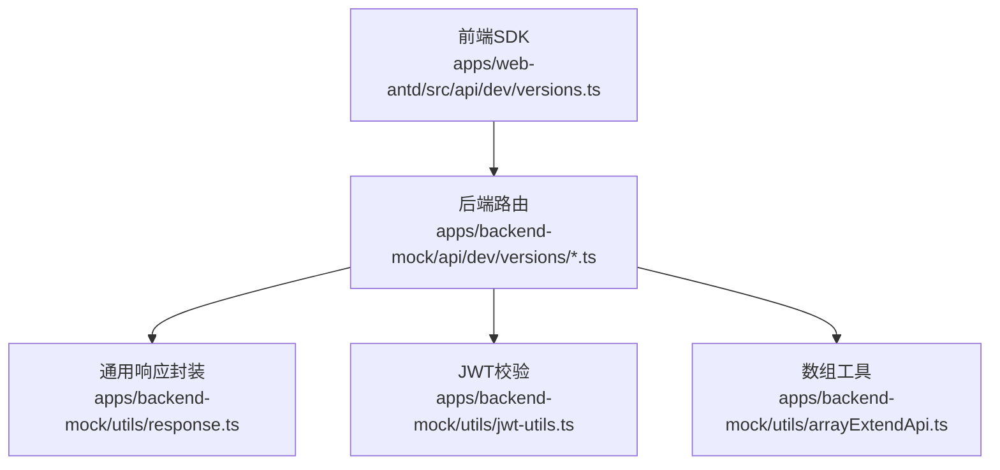
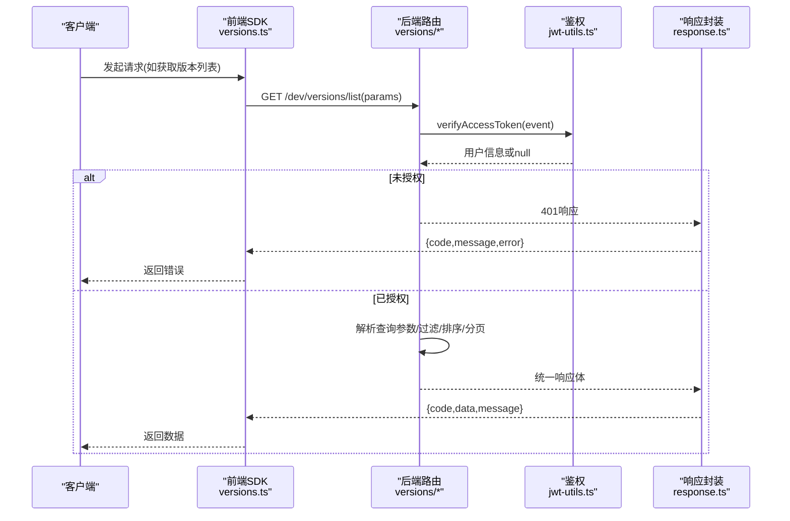
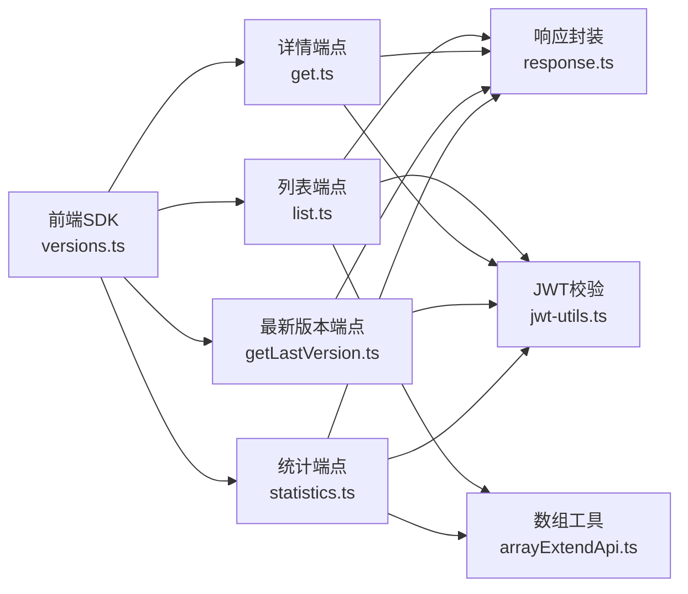

# 版本管理API

<cite>
**本文引用的文件**
- [apps/web-antd/src/api/dev/versions.ts](file://apps/web-antd/src/api/dev/versions.ts)
- [apps/backend-mock/api/dev/versions/list.ts](file://apps/backend-mock/api/dev/versions/list.ts)
- [apps/backend-mock/api/dev/versions/get.ts](file://apps/backend-mock/api/dev/versions/get.ts)
- [apps/backend-mock/api/dev/versions/getLastVersion.ts](file://apps/backend-mock/api/dev/versions/getLastVersion.ts)
- [apps/backend-mock/api/dev/versions/statistics.ts](file://apps/backend-mock/api/dev/versions/statistics.ts)
- [apps/backend-mock/utils/response.ts](file://apps/backend-mock/utils/response.ts)
- [apps/backend-mock/utils/jwt-utils.ts](file://apps/backend-mock/utils/jwt-utils.ts)
- [apps/backend-mock/utils/arrayExtendApi.ts](file://apps/backend-mock/utils/arrayExtendApi.ts)
</cite>

## 更新摘要
**变更内容**
- 新增版本统计API的全面增强功能，提供开发统计分析的完整解决方案
- 扩展统计维度包括任务完成率、缺陷跟踪、团队生产力指标等
- 新增人员维度分析、需求面板、任务面板和缺陷面板的详细统计
- 完善统计接口的数据结构和响应格式

## 目录
1. [简介](#简介)
2. [项目结构](#项目结构)
3. [核心组件](#核心组件)
4. [架构总览](#架构总览)
5. [详细组件分析](#详细组件分析)
6. [依赖分析](#依赖分析)
7. [性能考虑](#性能考虑)
8. [故障排查指南](#故障排查指南)
9. [结论](#结论)
10. [附录](#附录)

## 简介
本文件为"版本管理API"的权威文档，覆盖版本相关的全部REST端点，包括版本列表查询、版本详情获取、最新版本查询、版本统计数据、以及版本数据模型定义。文档同时说明了版本状态筛选、发布时间范围查询、项目关联查询、分页操作、版本与项目/任务/Bug的关联关系、发布前准备检查建议、统计分析接口（进度、缺陷、质量评估）及发布流程与回滚策略建议。

**更新** 本次更新重点增强了版本统计API的功能，新增了全面的开发统计分析能力，包括任务完成率、缺陷跟踪、团队生产力指标等多维度分析。

## 项目结构
版本管理API位于后端Mock服务与前端SDK之间，前端通过统一请求客户端发起HTTP请求，后端通过Nitro路由处理请求并返回标准响应格式。

**图表来源**
- [apps/web-antd/src/api/dev/versions.ts:1-145](file://apps/web-antd/src/api/dev/versions.ts#L1-L145)
- [apps/backend-mock/api/dev/versions/list.ts:1-109](file://apps/backend-mock/api/dev/versions/list.ts#L1-L109)
- [apps/backend-mock/api/dev/versions/get.ts:1-17](file://apps/backend-mock/api/dev/versions/get.ts#L1-L17)
- [apps/backend-mock/api/dev/versions/getLastVersion.ts:1-26](file://apps/backend-mock/api/dev/versions/getLastVersion.ts#L1-L26)
- [apps/backend-mock/api/dev/versions/statistics.ts:1-358](file://apps/backend-mock/api/dev/versions/statistics.ts#L1-L358)
- [apps/backend-mock/utils/response.ts:1-71](file://apps/backend-mock/utils/response.ts#L1-L71)
- [apps/backend-mock/utils/jwt-utils.ts:1-115](file://apps/backend-mock/utils/jwt-utils.ts#L1-L115)
- [apps/backend-mock/utils/arrayExtendApi.ts:1-154](file://apps/backend-mock/utils/arrayExtendApi.ts#L1-L154)

**章节来源**
- [apps/web-antd/src/api/dev/versions.ts:1-145](file://apps/web-antd/src/api/dev/versions.ts#L1-L145)
- [apps/backend-mock/api/dev/versions/list.ts:1-109](file://apps/backend-mock/api/dev/versions/list.ts#L1-L109)
- [apps/backend-mock/api/dev/versions/get.ts:1-17](file://apps/backend-mock/api/dev/versions/get.ts#L1-L17)
- [apps/backend-mock/api/dev/versions/getLastVersion.ts:1-26](file://apps/backend-mock/api/dev/versions/getLastVersion.ts#L1-L26)
- [apps/backend-mock/api/dev/versions/statistics.ts:1-358](file://apps/backend-mock/api/dev/versions/statistics.ts#L1-L358)
- [apps/backend-mock/utils/response.ts:1-71](file://apps/backend-mock/utils/response.ts#L1-L71)
- [apps/backend-mock/utils/jwt-utils.ts:1-115](file://apps/backend-mock/utils/jwt-utils.ts#L1-L115)
- [apps/backend-mock/utils/arrayExtendApi.ts:1-154](file://apps/backend-mock/utils/arrayExtendApi.ts#L1-L154)

## 核心组件
- 前端版本API SDK：封装版本列表、详情、最新版本、统计数据等请求方法，并定义返回数据模型。
- 后端版本路由：实现版本列表、详情、最新版本、统计数据等端点，负责鉴权、查询过滤、排序与分页。
- 工具库：统一响应格式、JWT鉴权、版本号比较、数组去重与分页。

**章节来源**
- [apps/web-antd/src/api/dev/versions.ts:1-145](file://apps/web-antd/src/api/dev/versions.ts#L1-L145)
- [apps/backend-mock/api/dev/versions/list.ts:1-109](file://apps/backend-mock/api/dev/versions/list.ts#L1-L109)
- [apps/backend-mock/api/dev/versions/get.ts:1-17](file://apps/backend-mock/api/dev/versions/get.ts#L1-L17)
- [apps/backend-mock/api/dev/versions/getLastVersion.ts:1-26](file://apps/backend-mock/api/dev/versions/getLastVersion.ts#L1-L26)
- [apps/backend-mock/api/dev/versions/statistics.ts:1-358](file://apps/backend-mock/api/dev/versions/statistics.ts#L1-L358)
- [apps/backend-mock/utils/response.ts:1-71](file://apps/backend-mock/utils/response.ts#L1-L71)
- [apps/backend-mock/utils/jwt-utils.ts:1-115](file://apps/backend-mock/utils/jwt-utils.ts#L1-L115)
- [apps/backend-mock/utils/arrayExtendApi.ts:1-154](file://apps/backend-mock/utils/arrayExtendApi.ts#L1-L154)

## 架构总览
版本管理API采用前后端分离架构，前端通过SDK调用后端路由，后端路由在进入业务逻辑前进行JWT鉴权，随后根据查询参数执行过滤、排序、分页与聚合统计。

**图表来源**
- [apps/web-antd/src/api/dev/versions.ts:73-144](file://apps/web-antd/src/api/dev/versions.ts#L73-L144)
- [apps/backend-mock/api/dev/versions/list.ts:57-108](file://apps/backend-mock/api/dev/versions/list.ts#L57-L108)
- [apps/backend-mock/utils/jwt-utils.ts:27-56](file://apps/backend-mock/utils/jwt-utils.ts#L27-L56)
- [apps/backend-mock/utils/response.ts:5-42](file://apps/backend-mock/utils/response.ts#L5-L42)

## 详细组件分析

### 版本数据模型
以下为版本实体的核心字段定义（字段名、类型、含义、是否必填、默认值/枚举说明）：

- 版本ID：字符串，唯一标识
- 版本号：字符串，如"x.y.z"，用于排序与比较
- 版本类型：整数枚举，表示版本类型（具体枚举值由后端mock映射决定）
- 描述：字符串，版本备注
- 创建者ID：字符串
- 创建者姓名：字符串
- 创建时间：字符串（日期时间格式）
- 更新时间：字符串（日期时间格式）
- 开始时间：字符串（日期时间格式）
- 结束时间：字符串（日期时间格式）
- 所属项目ID：字符串
- 发布状态：整数枚举，表示版本状态（草稿/进行中/已发布/已归档等）
- 发布时间：字符串（日期时间格式）
- 变更日志富文本：字符串
- 变更日志：字符串

**章节来源**
- [apps/web-antd/src/api/dev/versions.ts:53-71](file://apps/web-antd/src/api/dev/versions.ts#L53-L71)

### 版本列表查询
- 方法与路径：GET /dev/versions/list
- 请求参数（查询参数）：
  - page：页码，默认1
  - pageSize：每页条数，默认20
  - version：版本号（精确匹配）
  - releaseStatus：发布状态（精确匹配）
  - projectId：所属项目ID（精确匹配）
  - includeId：若提供，将该版本强制置顶返回
- 过滤与排序：
  - 支持按版本号、发布状态、项目ID过滤
  - 默认按版本号降序排序（使用版本号比较算法）
  - 去重：按版本ID去重
- 分页：
  - 当提供page与pageSize时，返回分页结构（items、total）
  - 否则返回全量列表
- 响应格式：
  - 成功：{ code: 0, data: { items, total }, message: "ok" }
  - 未授权：{ code: -1, data: null, message: "Unauthorized Exception", error: "Unauthorized Exception" }
- 状态码：
  - 200：成功
  - 401：未授权
- 示例请求：
  - GET /dev/versions/list?page=1&pageSize=20&projectId=xxx&version=1.2.3&releaseStatus=10
- 示例响应：
  - { "code": 0, "data": { "items": [...], "total": 120 }, "message": "ok" }

**章节来源**
- [apps/backend-mock/api/dev/versions/list.ts:57-108](file://apps/backend-mock/api/dev/versions/list.ts#L57-L108)
- [apps/backend-mock/utils/response.ts:5-33](file://apps/backend-mock/utils/response.ts#L5-L33)
- [apps/backend-mock/utils/jwt-utils.ts:27-56](file://apps/backend-mock/utils/jwt-utils.ts#L27-L56)
- [apps/backend-mock/utils/arrayExtendApi.ts:124-135](file://apps/backend-mock/utils/arrayExtendApi.ts#L124-L135)

### 版本详情获取
- 方法与路径：GET /dev/versions/get
- 请求参数（查询参数）：
  - versionId：版本ID（必填）
- 响应格式：
  - 成功：{ code: 0, data: 版本对象或null, message: "ok" }
  - 未授权：{ code: -1, data: null, message: "Unauthorized Exception", error: "Unauthorized Exception" }
- 状态码：
  - 200：成功
  - 401：未授权
- 示例请求：
  - GET /dev/versions/get?versionId=xxx
- 示例响应：
  - { "code": 0, "data": { "versionId": "...", "version": "1.2.3", ... }, "message": "ok" }

**章节来源**
- [apps/backend-mock/api/dev/versions/get.ts:6-16](file://apps/backend-mock/api/dev/versions/get.ts#L6-L16)
- [apps/backend-mock/utils/response.ts:5-12](file://apps/backend-mock/utils/response.ts#L5-L12)
- [apps/backend-mock/utils/jwt-utils.ts:27-56](file://apps/backend-mock/utils/jwt-utils.ts#L27-L56)

### 最新版本查询
- 方法与路径：GET /dev/versions/getLastVersion
- 请求参数（查询参数）：
  - page：页码，默认1
  - pageSize：每页条数，默认20
  - projectId：所属项目ID（可选，用于限定项目内最新版本）
- 行为说明：
  - 在满足条件的版本集合中按版本号降序排序，取第一条作为最新版本
  - 支持分页参数但通常仅取第一条
- 响应格式：
  - 成功：{ code: 0, data: 版本对象, message: "ok" }
  - 未授权：{ code: -1, data: null, message: "Unauthorized Exception", error: "Unauthorized Exception" }
- 状态码：
  - 200：成功
  - 401：未授权
- 示例请求：
  - GET /dev/versions/getLastVersion?projectId=xxx
- 示例响应：
  - { "code": 0, "data": { "versionId": "...", "version": "1.2.3", ... }, "message": "ok" }

**章节来源**
- [apps/backend-mock/api/dev/versions/getLastVersion.ts:7-25](file://apps/backend-mock/api/dev/versions/getLastVersion.ts#L7-L25)
- [apps/backend-mock/utils/response.ts:5-12](file://apps/backend-mock/utils/response.ts#L5-L12)
- [apps/backend-mock/utils/jwt-utils.ts:27-56](file://apps/backend-mock/utils/jwt-utils.ts#L27-L56)

### 版本统计数据
**更新** 新增全面的版本统计分析功能，提供多维度的开发统计指标。

- 方法与路径：GET /dev/versions/statistics
- 请求参数（查询参数）：
  - versionId：版本ID（必填）
- 返回内容（完整统计面板）：
  - **摘要统计**：需求总数/完成数、任务总数/完成数、缺陷总数/已修复数
  - **进度趋势**：近30天任务完成数与缺陷修复数按日期分布
  - **人员维度**：人员任务数量占比、人员参与需求数量占比、人员工时占比、模块任务分布
  - **需求面板**：需求类型分布、需求来源分布、需求状态漏斗
  - **任务面板**：任务类型分布、计划/实际工时分布
  - **缺陷面板**：缺陷类型Top8、缺陷等级分布、缺陷来源Top8、修复人TopN
- 响应格式：
  - 成功：{ code: 0, data: {...}, message: "ok" }
  - 未授权：{ code: -1, data: null, message: "Unauthorized Exception", error: "Unauthorized Exception" }
- 状态码：
  - 200：成功
  - 401：未授权
- 示例请求：
  - GET /dev/versions/statistics?versionId=xxx
- 示例响应：
  - { "code": 0, "data": { "summary": {...}, "progressTrend": {...}, ... }, "message": "ok" }

**章节来源**
- [apps/backend-mock/api/dev/versions/statistics.ts:110-357](file://apps/backend-mock/api/dev/versions/statistics.ts#L110-L357)
- [apps/backend-mock/utils/response.ts:5-12](file://apps/backend-mock/utils/response.ts#L5-L12)
- [apps/backend-mock/utils/jwt-utils.ts:27-56](file://apps/backend-mock/utils/jwt-utils.ts#L27-L56)

### 版本新增（建议）
- 方法与路径：POST /dev/versions
- 请求体：除版本ID外的完整版本对象
- 响应格式：统一成功响应
- 状态码：200
- 注意：当前仓库未提供该端点实现，建议参考现有SDK方法签名进行对接

**章节来源**
- [apps/web-antd/src/api/dev/versions.ts:101-106](file://apps/web-antd/src/api/dev/versions.ts#L101-L106)

### 版本编辑（建议）
- 方法与路径：PUT /dev/versions/{id}
- 请求体：除版本ID外的版本对象
- 响应格式：统一成功响应
- 状态码：200
- 注意：当前仓库未提供该端点实现，建议参考现有SDK方法签名进行对接

**章节来源**
- [apps/web-antd/src/api/dev/versions.ts:114-120](file://apps/web-antd/src/api/dev/versions.ts#L114-L120)

### 版本删除（建议）
- 方法与路径：DELETE /dev/versions/{id}
- 响应格式：统一成功响应
- 状态码：200
- 注意：当前仓库未提供该端点实现，建议按需扩展

**章节来源**
- [apps/web-antd/src/api/dev/versions.ts:114-120](file://apps/web-antd/src/api/dev/versions.ts#L114-L120)

### 版本状态筛选、发布时间范围查询、项目关联查询与分页
- 状态筛选：通过releaseStatus参数过滤
- 时间范围查询：当前版本列表端点未提供专门的时间范围参数，可在前端二次过滤或后端扩展
- 项目关联：通过projectId参数过滤
- 分页：通过page与pageSize参数控制
- 版本号排序：默认按版本号降序排序

**章节来源**
- [apps/backend-mock/api/dev/versions/list.ts:63-86](file://apps/backend-mock/api/dev/versions/list.ts#L63-L86)
- [apps/backend-mock/utils/jwt-utils.ts:88-114](file://apps/backend-mock/utils/jwt-utils.ts#L88-L114)

### 版本与项目、任务、缺陷的关联关系
- 关联关系：
  - 版本与项目：版本对象包含projectId字段
  - 版本与任务：统计数据接口会按versionId过滤任务集合
  - 版本与缺陷：统计数据接口会按versionId过滤缺陷集合，并进一步过滤"已确认缺陷"
- 关联查询建议：
  - 列表查询时传入projectId
  - 统计查询时传入versionId

**章节来源**
- [apps/backend-mock/api/dev/versions/statistics.ts:122-127](file://apps/backend-mock/api/dev/versions/statistics.ts#L122-L127)
- [apps/backend-mock/api/dev/versions/list.ts:74-76](file://apps/backend-mock/api/dev/versions/list.ts#L74-L76)

### 版本发布前准备检查（建议）
- 建议检查项（流程建议）：
  - 需求完成率：统计需求状态为"已关闭"的比例
  - 任务完成率：统计任务状态为"已完成"的比例
  - 缺陷修复率：统计缺陷状态为"已修复"的比例
  - 工时偏差：对比计划工时与实际工时
  - 回归缺陷：统计回归类缺陷数量
- 实现方式：结合统计数据接口中的摘要与面板数据进行综合评估

**章节来源**
- [apps/backend-mock/api/dev/versions/statistics.ts:129-137](file://apps/backend-mock/api/dev/versions/statistics.ts#L129-L137)

### 版本统计分析接口
**更新** 新增全面的统计分析接口，提供多维度的开发洞察。

- 接口：GET /dev/versions/statistics
- 返回维度：
  - **摘要**：storyTotal/storyDone/taskTotal/taskDone/bugTotal/bugFixed
  - **进度趋势**：progressTrend(dates, taskDone, bugFixed)
  - **人员维度**：personTaskDist/personStoryDist/personHoursDist/moduleDist
  - **需求面板**：storyTypeDist/storySourceDist/storyStatusFunnel
  - **任务面板**：taskTypeDist/taskWorkload(planHours/actualHours)
  - **缺陷面板**：bugTypeDist/bugLevelDist/bugSourceDist/bugFixerDist
- **增强功能**：
  - 任务完成率分析：统计任务完成进度和趋势
  - 缺陷跟踪：缺陷类型、等级、来源的全面分析
  - 团队生产力：人员任务分布、工时贡献、模块贡献
  - 质量评估：需求状态漏斗、缺陷修复效率

**章节来源**
- [apps/backend-mock/api/dev/versions/statistics.ts:139-356](file://apps/backend-mock/api/dev/versions/statistics.ts#L139-L356)

### 发布流程与回滚策略（建议）
- 发布流程（建议步骤）：
  1) 准备阶段：检查需求/任务/缺陷完成情况，确认工时与风险
  2) 验收阶段：组织评审，确认版本质量与交付物
  3) 发布阶段：更新发布状态与发布时间，生成变更日志
  4) 监控阶段：上线后观察关键指标与缺陷回归
- 回滚策略（建议方案）：
  - 快照回滚：保留上一个稳定版本的快照，出现问题时快速切换
  - 渐进式回滚：先回滚关键模块，验证稳定后再逐步恢复其他模块
  - 版本标记：在版本对象中标记回滚来源与原因，便于审计

## 依赖分析
版本管理API的依赖关系如下：

**图表来源**
- [apps/web-antd/src/api/dev/versions.ts:73-144](file://apps/web-antd/src/api/dev/versions.ts#L73-L144)
- [apps/backend-mock/api/dev/versions/list.ts:57-108](file://apps/backend-mock/api/dev/versions/list.ts#L57-L108)
- [apps/backend-mock/api/dev/versions/get.ts:6-16](file://apps/backend-mock/api/dev/versions/get.ts#L6-L16)
- [apps/backend-mock/api/dev/versions/getLastVersion.ts:7-25](file://apps/backend-mock/api/dev/versions/getLastVersion.ts#L7-L25)
- [apps/backend-mock/api/dev/versions/statistics.ts:110-357](file://apps/backend-mock/api/dev/versions/statistics.ts#L110-L357)
- [apps/backend-mock/utils/response.ts:5-71](file://apps/backend-mock/utils/response.ts#L5-L71)
- [apps/backend-mock/utils/jwt-utils.ts:27-56](file://apps/backend-mock/utils/jwt-utils.ts#L27-L56)
- [apps/backend-mock/utils/arrayExtendApi.ts:124-135](file://apps/backend-mock/utils/arrayExtendApi.ts#L124-L135)

**章节来源**
- [apps/web-antd/src/api/dev/versions.ts:73-144](file://apps/web-antd/src/api/dev/versions.ts#L73-L144)
- [apps/backend-mock/api/dev/versions/list.ts:57-108](file://apps/backend-mock/api/dev/versions/list.ts#L57-L108)
- [apps/backend-mock/api/dev/versions/get.ts:6-16](file://apps/backend-mock/api/dev/versions/get.ts#L6-L16)
- [apps/backend-mock/api/dev/versions/getLastVersion.ts:7-25](file://apps/backend-mock/api/dev/versions/getLastVersion.ts#L7-L25)
- [apps/backend-mock/api/dev/versions/statistics.ts:110-357](file://apps/backend-mock/api/dev/versions/statistics.ts#L110-L357)
- [apps/backend-mock/utils/response.ts:5-71](file://apps/backend-mock/utils/response.ts#L5-L71)
- [apps/backend-mock/utils/jwt-utils.ts:27-56](file://apps/backend-mock/utils/jwt-utils.ts#L27-L56)
- [apps/backend-mock/utils/arrayExtendApi.ts:124-135](file://apps/backend-mock/utils/arrayExtendApi.ts#L124-L135)

## 性能考虑
- 排序与比较：版本号排序使用自定义比较函数，注意版本号格式一致性
- 去重与分页：列表端点使用按版本ID去重与分页，避免重复数据与超大数据集传输
- 统计计算：统计接口涉及多表过滤与聚合，建议在生产环境引入缓存与索引优化
- 安全：鉴权采用JWT，建议使用HTTPS与安全密钥管理

## 故障排查指南
- 401 未授权：
  - 检查请求头Authorization是否为Bearer Token
  - 检查Token是否过期或被篡改
- 403 禁止访问：
  - 检查用户权限与资源访问范围
- 列表为空：
  - 检查过滤参数（version、releaseStatus、projectId、includeId）
  - 检查分页参数（page、pageSize）
- 统计为空：
  - 检查versionId是否正确
  - 检查mock数据中是否存在对应版本的任务/缺陷/需求

**章节来源**
- [apps/backend-mock/utils/response.ts:44-55](file://apps/backend-mock/utils/response.ts#L44-L55)
- [apps/backend-mock/utils/jwt-utils.ts:27-56](file://apps/backend-mock/utils/jwt-utils.ts#L27-L56)

## 结论
版本管理API提供了版本列表、详情、最新版本与统计分析等核心能力，具备良好的可扩展性。当前仓库未提供版本新增/编辑/删除端点，建议按现有SDK方法签名进行对接。通过合理的参数过滤、排序与分页，以及完善的统计面板，可支撑版本发布的全流程管理与质量评估。

**更新** 新增的版本统计API提供了全面的开发统计分析功能，包括任务完成率、缺陷跟踪、团队生产力指标等多个维度的深入分析，为版本管理和质量评估提供了强有力的数据支持。

## 附录

### API一览表
- GET /dev/versions/list
  - 参数：page、pageSize、version、releaseStatus、projectId、includeId
  - 响应：分页或全量版本列表
- GET /dev/versions/get
  - 参数：versionId
  - 响应：单个版本详情
- GET /dev/versions/getLastVersion
  - 参数：page、pageSize、projectId
  - 响应：最新版本
- GET /dev/versions/statistics
  - 参数：versionId
  - 响应：版本统计摘要与多维面板（**新增**）

**更新** 新增版本统计API端点，提供全面的开发统计分析功能。

**章节来源**
- [apps/web-antd/src/api/dev/versions.ts:78-144](file://apps/web-antd/src/api/dev/versions.ts#L78-L144)
- [apps/backend-mock/api/dev/versions/list.ts:57-108](file://apps/backend-mock/api/dev/versions/list.ts#L57-L108)
- [apps/backend-mock/api/dev/versions/get.ts:6-16](file://apps/backend-mock/api/dev/versions/get.ts#L6-L16)
- [apps/backend-mock/api/dev/versions/getLastVersion.ts:7-25](file://apps/backend-mock/api/dev/versions/getLastVersion.ts#L7-L25)
- [apps/backend-mock/api/dev/versions/statistics.ts:110-357](file://apps/backend-mock/api/dev/versions/statistics.ts#L110-L357)