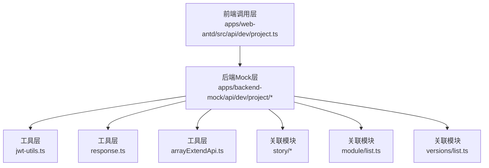
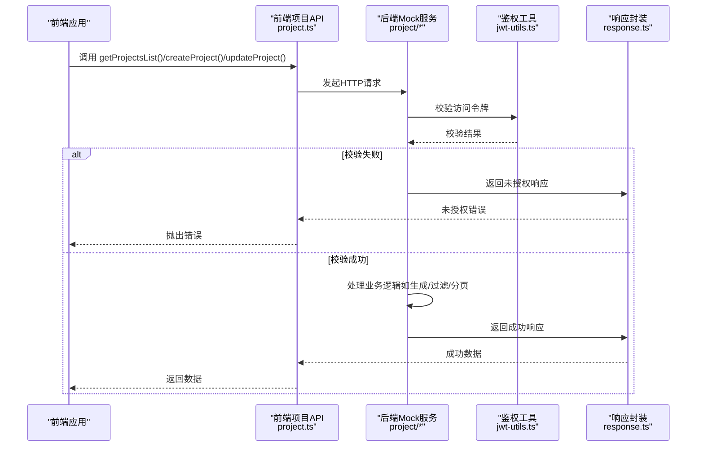
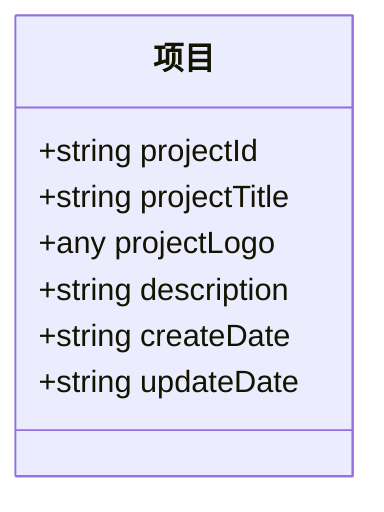
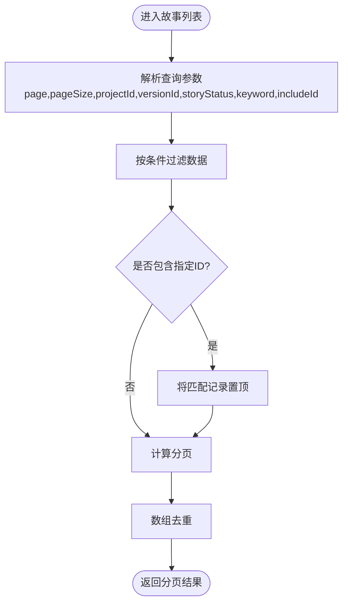
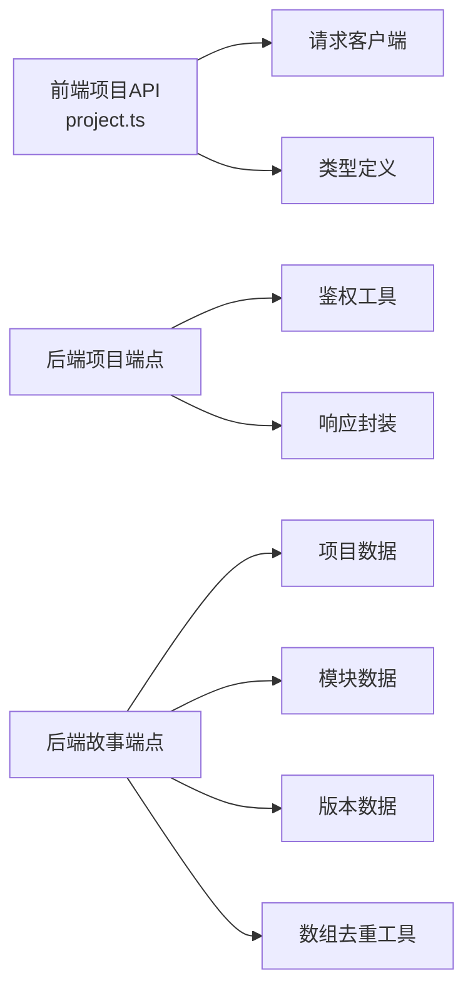

# 项目管理API

<cite>
**本文引用的文件**
- [apps/backend-mock/api/dev/project/list.ts](file://apps/backend-mock/api/dev/project/list.ts)
- [apps/backend-mock/api/dev/project/.post.ts](file://apps/backend-mock/api/dev/project/.post.ts)
- [apps/web-antd/src/api/dev/project.ts](file://apps/web-antd/src/api/dev/project.ts)
- [apps/web-antd/src/api/dev/index.ts](file://apps/web-antd/src/api/dev/index.ts)
- [apps/backend-mock/api/dev/story/get.ts](file://apps/backend-mock/api/dev/story/get.ts)
- [apps/backend-mock/api/dev/story/list.ts](file://apps/backend-mock/api/dev/story/list.ts)
- [apps/backend-mock/api/dev/module/list.ts](file://apps/backend-mock/api/dev/module/list.ts)
- [apps/backend-mock/api/dev/versions/list.ts](file://apps/backend-mock/api/dev/versions/list.ts)
- [apps/backend-mock/utils/response.ts](file://apps/backend-mock/utils/response.ts)
- [apps/backend-mock/utils/jwt-utils.ts](file://apps/backend-mock/utils/jwt-utils.ts)
- [apps/backend-mock/utils/arrayExtendApi.ts](file://apps/backend-mock/utils/arrayExtendApi.ts)
</cite>

## 目录

1. [简介](#简介)
2. [项目结构](#项目结构)
3. [核心组件](#核心组件)
4. [架构总览](#架构总览)
5. [详细组件分析](#详细组件分析)
6. [依赖关系分析](#依赖关系分析)
7. [性能考虑](#性能考虑)
8. [故障排查指南](#故障排查指南)
9. [结论](#结论)
10. [附录](#附录)

## 简介

本文件为“项目管理API”的权威技术文档，覆盖后端Mock服务与前端调用层的项目相关接口，包括项目列表查询、项目新增、项目编辑等能力。文档同时给出项目数据模型、筛选与分页机制、权限控制、生命周期与最佳实践，并提供可复用的项目模板使用方法。

## 项目结构

项目管理API由以下关键部分组成：

- 前端调用层：统一通过请求客户端封装HTTP调用，导出项目相关方法（列表、创建、更新）。
- 后端Mock层：基于事件处理器实现REST风格端点，提供鉴权校验、数据生成与响应封装。
- 工具层：统一响应格式、JWT鉴权工具、数组去重工具等。

图表来源

- [apps/web-antd/src/api/dev/project.ts:1-49](file://apps/web-antd/src/api/dev/project.ts#L1-L49)
- [apps/backend-mock/api/dev/project/list.ts:1-51](file://apps/backend-mock/api/dev/project/list.ts#L1-L51)
- [apps/backend-mock/api/dev/project/.post.ts:1-17](file://apps/backend-mock/api/dev/project/.post.ts#L1-L17)
- [apps/backend-mock/utils/response.ts](file://apps/backend-mock/utils/response.ts)
- [apps/backend-mock/utils/jwt-utils.ts](file://apps/backend-mock/utils/jwt-utils.ts)
- [apps/backend-mock/utils/arrayExtendApi.ts](file://apps/backend-mock/utils/arrayExtendApi.ts)
- [apps/backend-mock/api/dev/story/list.ts:1-149](file://apps/backend-mock/api/dev/story/list.ts#L1-L149)
- [apps/backend-mock/api/dev/module/list.ts:1-73](file://apps/backend-mock/api/dev/module/list.ts#L1-L73)
- [apps/backend-mock/api/dev/versions/list.ts:1-23](file://apps/backend-mock/api/dev/versions/list.ts#L1-L23)

章节来源

- [apps/web-antd/src/api/dev/project.ts:1-49](file://apps/web-antd/src/api/dev/project.ts#L1-L49)
- [apps/backend-mock/api/dev/project/list.ts:1-51](file://apps/backend-mock/api/dev/project/list.ts#L1-L51)
- [apps/backend-mock/api/dev/project/.post.ts:1-17](file://apps/backend-mock/api/dev/project/.post.ts#L1-L17)

## 核心组件

- 前端项目API封装
  - 列表查询：getProjectsList
  - 新增项目：createProject
  - 更新项目：updateProject
- 后端项目端点
  - GET /dev/project/list：返回项目列表
  - POST /dev/project：创建项目
  - PUT /dev/project/{id}：更新项目（当前仓库未提供该文件，但接口已声明）
- 权限与响应
  - 所有端点均需通过访问令牌校验
  - 统一响应封装与错误处理

章节来源

- [apps/web-antd/src/api/dev/project.ts:15-48](file://apps/web-antd/src/api/dev/project.ts#L15-L48)
- [apps/backend-mock/api/dev/project/list.ts:37-50](file://apps/backend-mock/api/dev/project/list.ts#L37-L50)
- [apps/backend-mock/api/dev/project/.post.ts:9-16](file://apps/backend-mock/api/dev/project/.post.ts#L9-L16)
- [apps/backend-mock/utils/response.ts](file://apps/backend-mock/utils/response.ts)
- [apps/backend-mock/utils/jwt-utils.ts](file://apps/backend-mock/utils/jwt-utils.ts)

## 架构总览

下图展示了从前端到后端Mock服务的调用链路与鉴权流程。

图表来源

- [apps/web-antd/src/api/dev/project.ts:18-48](file://apps/web-antd/src/api/dev/project.ts#L18-L48)
- [apps/backend-mock/api/dev/project/list.ts:37-50](file://apps/backend-mock/api/dev/project/list.ts#L37-L50)
- [apps/backend-mock/api/dev/project/.post.ts:9-16](file://apps/backend-mock/api/dev/project/.post.ts#L9-L16)
- [apps/backend-mock/utils/jwt-utils.ts](file://apps/backend-mock/utils/jwt-utils.ts)
- [apps/backend-mock/utils/response.ts](file://apps/backend-mock/utils/response.ts)

## 详细组件分析

### 项目列表查询

- 接口定义
  - 方法：GET
  - 路径：/dev/project/list
  - 认证：需要访问令牌
  - 响应：项目列表（全量或分页）
- 请求参数
  - 无查询参数（当前实现未启用分页）
- 响应格式
  - 成功：包含项目数组的对象
  - 失败：未授权或系统错误对象
- 状态码
  - 200：成功
  - 401：未授权
  - 500：服务器内部错误
- 示例
  - 请求：GET /dev/project/list
  - 响应：包含项目数组的JSON对象
- 实现要点
  - 使用统一鉴权工具校验令牌
  - 使用统一响应封装返回数据
  - 当前未启用分页，返回全量数据

章节来源

- [apps/web-antd/src/api/dev/project.ts:18-22](file://apps/web-antd/src/api/dev/project.ts#L18-L22)
- [apps/backend-mock/api/dev/project/list.ts:37-50](file://apps/backend-mock/api/dev/project/list.ts#L37-L50)
- [apps/backend-mock/utils/response.ts](file://apps/backend-mock/utils/response.ts)
- [apps/backend-mock/utils/jwt-utils.ts](file://apps/backend-mock/utils/jwt-utils.ts)

### 项目新增

- 接口定义
  - 方法：POST
  - 路径：/dev/project
  - 认证：需要访问令牌
  - 请求体：不包含项目ID的项目对象
  - 响应：空对象或成功标记
- 请求参数
  - 无查询参数
- 响应格式
  - 成功：空对象或成功标记
  - 失败：未授权或系统错误对象
- 状态码
  - 200：成功
  - 401：未授权
  - 500：服务器内部错误
- 示例
  - 请求：POST /dev/project（请求体为项目对象，不含项目ID）
  - 响应：空对象或成功标记
- 实现要点
  - 使用统一鉴权工具校验令牌
  - 使用统一响应封装返回结果
  - 前端在提交时会移除项目ID字段

章节来源

- [apps/web-antd/src/api/dev/project.ts:29-34](file://apps/web-antd/src/api/dev/project.ts#L29-L34)
- [apps/backend-mock/api/dev/project/.post.ts:9-16](file://apps/backend-mock/api/dev/project/.post.ts#L9-L16)
- [apps/backend-mock/utils/response.ts](file://apps/backend-mock/utils/response.ts)
- [apps/backend-mock/utils/jwt-utils.ts](file://apps/backend-mock/utils/jwt-utils.ts)

### 项目编辑

- 接口定义
  - 方法：PUT
  - 路径：/dev/project/{id}
  - 认证：需要访问令牌
  - 请求体：不包含项目ID的项目对象
  - 响应：空对象或成功标记
- 请求参数
  - 无查询参数
- 响应格式
  - 成功：空对象或成功标记
  - 失败：未授权或系统错误对象
- 状态码
  - 200：成功
  - 401：未授权
  - 500：服务器内部错误
- 示例
  - 请求：PUT /dev/project/{id}（请求体为项目对象，不含项目ID）
  - 响应：空对象或成功标记
- 实现要点
  - 使用统一鉴权工具校验令牌
  - 使用统一响应封装返回结果
  - 前端在提交时会移除项目ID字段

章节来源

- [apps/web-antd/src/api/dev/project.ts:42-48](file://apps/web-antd/src/api/dev/project.ts#L42-L48)
- [apps/backend-mock/utils/response.ts](file://apps/backend-mock/utils/response.ts)
- [apps/backend-mock/utils/jwt-utils.ts](file://apps/backend-mock/utils/jwt-utils.ts)

### 项目数据模型

- 字段定义
  - projectId：字符串，唯一标识
  - projectTitle：字符串，项目标题
  - projectLogo：任意类型，项目图标（当前为图片链接）
  - description：字符串，项目描述
  - createDate：字符串，创建时间（格式参考后端时间格式化）
  - updateDate：字符串，更新时间（格式参考后端时间格式化）
- 关系与约束
  - 以上字段来自后端Mock数据生成逻辑
  - 前端调用时，新增/更新请求体不包含项目ID字段
- 模型类图

图表来源

- [apps/web-antd/src/api/dev/project.ts:4-12](file://apps/web-antd/src/api/dev/project.ts#L4-L12)
- [apps/backend-mock/api/dev/project/list.ts:20-28](file://apps/backend-mock/api/dev/project/list.ts#L20-L28)

章节来源

- [apps/web-antd/src/api/dev/project.ts:4-12](file://apps/web-antd/src/api/dev/project.ts#L4-L12)
- [apps/backend-mock/api/dev/project/list.ts:20-28](file://apps/backend-mock/api/dev/project/list.ts#L20-L28)

### 过滤、分页与关联数据

- 过滤与分页（以故事模块为例，项目模块遵循相同模式）
  - 支持按项目ID、版本ID、状态等条件过滤
  - 支持关键词搜索（标题或编号）
  - 支持包含指定ID的记录置顶
  - 支持分页（page/pageSize）
  - 使用数组去重工具确保唯一性
- 关联数据
  - 故事模块与项目、模块、版本存在多对一关系
  - Mock数据生成时随机选择关联项
- 流程图（故事列表过滤与分页）

图表来源

- [apps/backend-mock/api/dev/story/list.ts:100-144](file://apps/backend-mock/api/dev/story/list.ts#L100-L144)
- [apps/backend-mock/utils/arrayExtendApi.ts](file://apps/backend-mock/utils/arrayExtendApi.ts)

章节来源

- [apps/backend-mock/api/dev/story/list.ts:100-144](file://apps/backend-mock/api/dev/story/list.ts#L100-L144)
- [apps/backend-mock/utils/arrayExtendApi.ts](file://apps/backend-mock/utils/arrayExtendApi.ts)

### 权限控制与生命周期

- 权限控制
  - 所有端点均通过访问令牌校验
  - 校验失败返回未授权响应
- 生命周期
  - 新增：创建项目
  - 查询：获取项目列表
  - 编辑：更新项目信息
  - 删除：当前仓库未提供删除端点（接口已声明，但文件不存在）
- 最佳实践
  - 前端在提交新增/更新请求时移除项目ID字段
  - 后端统一使用响应封装返回结果
  - 使用数组去重工具避免重复数据

章节来源

- [apps/backend-mock/api/dev/project/list.ts:37-41](file://apps/backend-mock/api/dev/project/list.ts#L37-L41)
- [apps/backend-mock/api/dev/project/.post.ts:9-13](file://apps/backend-mock/api/dev/project/.post.ts#L9-L13)
- [apps/web-antd/src/api/dev/project.ts:29-48](file://apps/web-antd/src/api/dev/project.ts#L29-L48)
- [apps/backend-mock/utils/response.ts](file://apps/backend-mock/utils/response.ts)
- [apps/backend-mock/utils/jwt-utils.ts](file://apps/backend-mock/utils/jwt-utils.ts)

## 依赖关系分析

- 前端项目API依赖请求客户端与类型定义
- 后端项目端点依赖鉴权工具与响应封装
- 故事模块依赖项目、模块、版本模块的数据
- 数组去重工具被多个模块复用

图表来源

- [apps/web-antd/src/api/dev/project.ts:1-49](file://apps/web-antd/src/api/dev/project.ts#L1-L49)
- [apps/backend-mock/api/dev/project/list.ts:1-51](file://apps/backend-mock/api/dev/project/list.ts#L1-L51)
- [apps/backend-mock/api/dev/story/list.ts:1-149](file://apps/backend-mock/api/dev/story/list.ts#L1-L149)
- [apps/backend-mock/utils/response.ts](file://apps/backend-mock/utils/response.ts)
- [apps/backend-mock/utils/jwt-utils.ts](file://apps/backend-mock/utils/jwt-utils.ts)
- [apps/backend-mock/utils/arrayExtendApi.ts](file://apps/backend-mock/utils/arrayExtendApi.ts)

章节来源

- [apps/web-antd/src/api/dev/project.ts:1-49](file://apps/web-antd/src/api/dev/project.ts#L1-L49)
- [apps/backend-mock/api/dev/project/list.ts:1-51](file://apps/backend-mock/api/dev/project/list.ts#L1-L51)
- [apps/backend-mock/api/dev/story/list.ts:1-149](file://apps/backend-mock/api/dev/story/list.ts#L1-L149)

## 性能考虑

- Mock数据生成：使用本地生成策略，适合开发与演示场景
- 分页：当前项目列表未启用分页，建议在生产环境开启分页以提升性能
- 去重：使用数组去重工具避免重复数据影响渲染性能
- 响应延迟：新增/编辑端点包含固定延迟，模拟网络开销，便于前端优化加载体验

## 故障排查指南

- 401 未授权
  - 检查访问令牌是否正确传递
  - 确认令牌未过期
- 500 服务器错误
  - 查看后端日志与响应封装返回的错误信息
- 数据异常
  - 确认前端提交时已移除项目ID字段
  - 检查过滤参数是否正确传入

章节来源

- [apps/backend-mock/api/dev/project/list.ts:37-41](file://apps/backend-mock/api/dev/project/list.ts#L37-L41)
- [apps/backend-mock/api/dev/project/.post.ts:9-13](file://apps/backend-mock/api/dev/project/.post.ts#L9-L13)
- [apps/backend-mock/utils/response.ts](file://apps/backend-mock/utils/response.ts)

## 结论

本项目管理API围绕前端调用与后端Mock服务构建，提供了项目列表、新增与编辑的基础能力。通过统一的鉴权与响应封装，保证了接口的一致性与可维护性。建议在生产环境中补充删除端点、完善分页与过滤功能，并结合真实数据库实现数据持久化。

## 附录

- 项目模板使用方法
  - 在前端调用时，直接传入不包含项目ID的项目对象
  - 后端将自动移除ID字段并返回成功响应
- 关联模块参考
  - 故事模块支持按项目ID、版本ID、状态等条件过滤与分页
  - 模块与版本数据用于生成关联关系

章节来源

- [apps/web-antd/src/api/dev/project.ts:29-48](file://apps/web-antd/src/api/dev/project.ts#L29-L48)
- [apps/backend-mock/api/dev/story/list.ts:100-144](file://apps/backend-mock/api/dev/story/list.ts#L100-L144)
- [apps/backend-mock/api/dev/module/list.ts:18-52](file://apps/backend-mock/api/dev/module/list.ts#L18-L52)
- [apps/backend-mock/api/dev/versions/list.ts:20-23](file://apps/backend-mock/api/dev/versions/list.ts#L20-L23)
