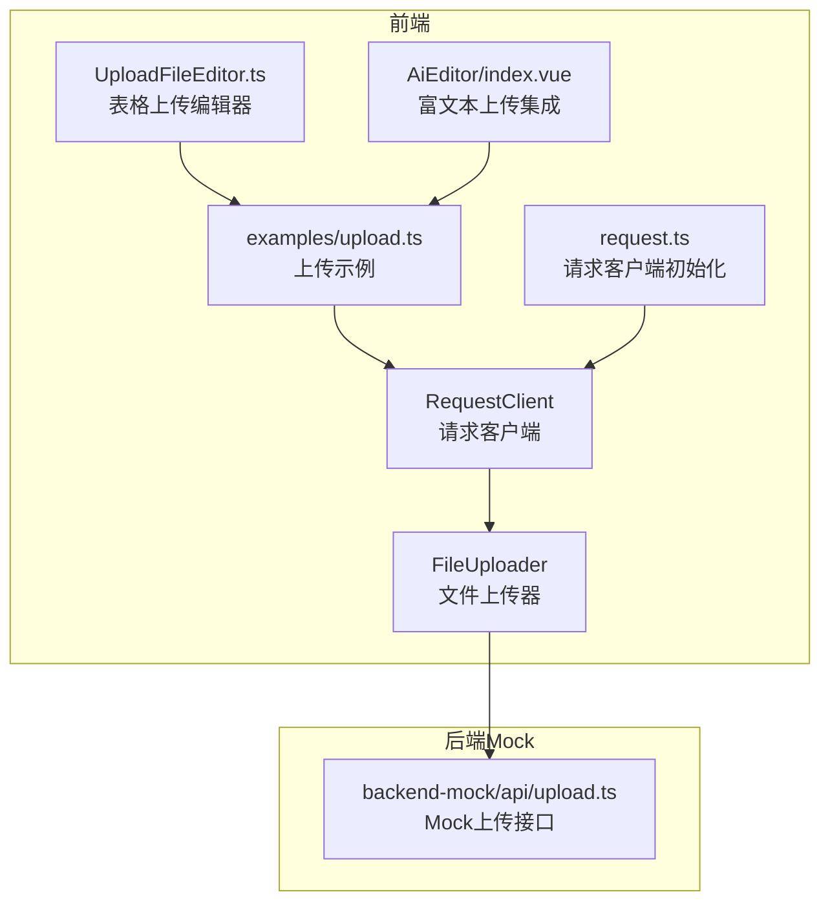
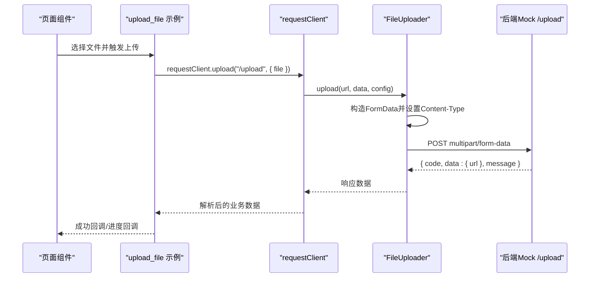
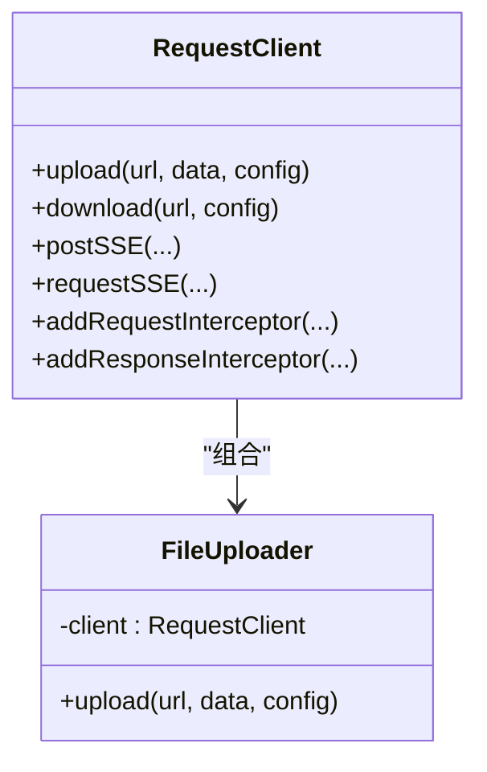
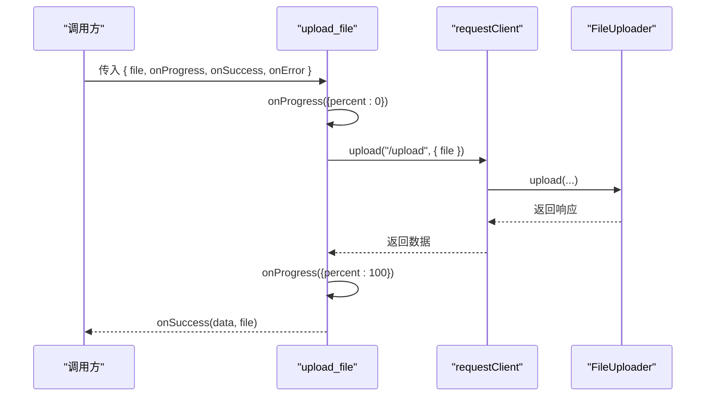
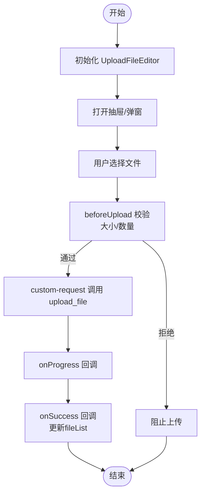
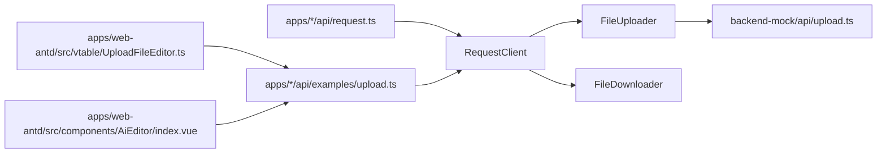

# 文件上传API

<cite>
**本文引用的文件**
- [apps/backend-mock/api/upload.ts](file://apps/backend-mock/api/upload.ts)
- [apps/web-antd/src/api/examples/upload.ts](file://apps/web-antd/src/api/examples/upload.ts)
- [apps/web-antd/src/api/request.ts](file://apps/web-antd/src/api/request.ts)
- [apps/web-antd/src/vtable/UploadFileEditor.ts](file://apps/web-antd/src/vtable/UploadFileEditor.ts)
- [apps/web-antd/src/components/AiEditor/index.vue](file://apps/web-antd/src/components/AiEditor/index.vue)
- [packages/effects/request/src/request-client/request-client.ts](file://packages/effects/request/src/request-client/request-client.ts)
- [packages/effects/request/src/request-client/types.ts](file://packages/effects/request/src/request-client/types.ts)
- [packages/effects/request/src/request-client/modules/uploader.ts](file://packages/effects/request/src/request-client/modules/uploader.ts)
- [packages/effects/request/src/request-client/modules/downloader.ts](file://packages/effects/request/src/request-client/modules/downloader.ts)
- [packages/effects/request/src/request-client/modules/uploader.test.ts](file://packages/effects/request/src/request-client/modules/uploader.test.ts)
- [packages/effects/request/src/request-client/request-client.test.ts](file://packages/effects/request/src/request-client/request-client.test.ts)
- [playground/src/api/examples/upload.ts](file://playground/src/api/examples/upload.ts)
- [playground/src/api/request.ts](file://playground/src/api/request.ts)
</cite>

## 目录
1. [简介](#简介)
2. [项目结构](#项目结构)
3. [核心组件](#核心组件)
4. [架构总览](#架构总览)
5. [详细组件分析](#详细组件分析)
6. [依赖关系分析](#依赖关系分析)
7. [性能考量](#性能考量)
8. [故障排查指南](#故障排查指南)
9. [结论](#结论)
10. [附录](#附录)

## 简介
本文件上传API文档面向Vben Admin前端与后端Mock环境，系统性梳理了单文件上传、多文件上传、断点续传能力现状与扩展建议，覆盖上传协议、文件大小限制、文件类型校验、安全检查、请求/响应格式、错误码说明、进度监控、大文件与并发上传策略、存储策略、安全与性能优化以及组件集成最佳实践。

## 项目结构
围绕文件上传的关键代码分布在以下模块：
- 前端请求封装与上传实现：packages/effects/request
- 前端示例与组件集成：apps/web-antd/playground
- 后端Mock上传接口：apps/backend-mock

**图表来源**
- [packages/effects/request/src/request-client/request-client.ts:39-94](file://packages/effects/request/src/request-client/request-client.ts#L39-L94)
- [packages/effects/request/src/request-client/modules/uploader.ts:6-40](file://packages/effects/request/src/request-client/modules/uploader.ts#L6-L40)
- [apps/web-antd/src/api/examples/upload.ts:1-26](file://apps/web-antd/src/api/examples/upload.ts#L1-L26)
- [apps/web-antd/src/vtable/UploadFileEditor.ts:1-338](file://apps/web-antd/src/vtable/UploadFileEditor.ts#L1-L338)
- [apps/web-antd/src/components/AiEditor/index.vue:54-76](file://apps/web-antd/src/components/AiEditor/index.vue#L54-L76)
- [apps/backend-mock/api/upload.ts:1-15](file://apps/backend-mock/api/upload.ts#L1-L15)

**章节来源**
- [packages/effects/request/src/request-client/request-client.ts:39-94](file://packages/effects/request/src/request-client/request-client.ts#L39-L94)
- [packages/effects/request/src/request-client/modules/uploader.ts:6-40](file://packages/effects/request/src/request-client/modules/uploader.ts#L6-L40)
- [apps/web-antd/src/api/examples/upload.ts:1-26](file://apps/web-antd/src/api/examples/upload.ts#L1-L26)
- [apps/web-antd/src/vtable/UploadFileEditor.ts:1-338](file://apps/web-antd/src/vtable/UploadFileEditor.ts#L1-L338)
- [apps/web-antd/src/components/AiEditor/index.vue:54-76](file://apps/web-antd/src/components/AiEditor/index.vue#L54-L76)
- [apps/backend-mock/api/upload.ts:1-15](file://apps/backend-mock/api/upload.ts#L1-L15)

## 核心组件
- RequestClient：统一的HTTP客户端，负责请求/响应拦截、SSE、上传、下载等能力的聚合。
- FileUploader：专门处理multipart/form-data上传，自动构造FormData并设置Content-Type。
- requestClient：在各应用中初始化的全局请求客户端，已注入默认拦截器与认证头。
- 上传示例与组件：提供单文件上传、进度回调、错误处理的完整调用链路。

**章节来源**
- [packages/effects/request/src/request-client/request-client.ts:39-94](file://packages/effects/request/src/request-client/request-client.ts#L39-L94)
- [packages/effects/request/src/request-client/modules/uploader.ts:6-40](file://packages/effects/request/src/request-client/modules/uploader.ts#L6-L40)
- [apps/web-antd/src/api/request.ts:26-121](file://apps/web-antd/src/api/request.ts#L26-L121)
- [apps/web-antd/src/api/examples/upload.ts:1-26](file://apps/web-antd/src/api/examples/upload.ts#L1-L26)

## 架构总览
文件上传从页面组件触发，经由示例函数封装，调用requestClient.upload，内部委托给FileUploader构造FormData并POST至服务端；服务端Mock返回标准化响应，前端通过拦截器统一解析。

**图表来源**
- [apps/web-antd/src/api/examples/upload.ts:9-25](file://apps/web-antd/src/api/examples/upload.ts#L9-L25)
- [packages/effects/request/src/request-client/request-client.ts:84-89](file://packages/effects/request/src/request-client/request-client.ts#L84-L89)
- [packages/effects/request/src/request-client/modules/uploader.ts:13-39](file://packages/effects/request/src/request-client/modules/uploader.ts#L13-L39)
- [apps/backend-mock/api/upload.ts:5-14](file://apps/backend-mock/api/upload.ts#L5-L14)

## 详细组件分析

### RequestClient 与 FileUploader
- RequestClient负责创建Axios实例、注册拦截器，并将upload/download等能力暴露给上层使用。
- FileUploader接收{ file }等键值，自动将每个键值append到FormData，设置Content-Type为multipart/form-data，支持自定义headers合并。

**图表来源**
- [packages/effects/request/src/request-client/request-client.ts:39-94](file://packages/effects/request/src/request-client/request-client.ts#L39-L94)
- [packages/effects/request/src/request-client/modules/uploader.ts:6-40](file://packages/effects/request/src/request-client/modules/uploader.ts#L6-L40)

**章节来源**
- [packages/effects/request/src/request-client/request-client.ts:39-94](file://packages/effects/request/src/request-client/request-client.ts#L39-L94)
- [packages/effects/request/src/request-client/modules/uploader.ts:6-40](file://packages/effects/request/src/request-client/modules/uploader.ts#L6-L40)

### 上传示例与进度监控
- upload_file示例函数提供onProgress/onSuccess/onError回调，演示0%到100%的进度推进。
- requestClient.upload内部委托FileUploader，最终通过Axios发送multipart/form-data。

**图表来源**
- [apps/web-antd/src/api/examples/upload.ts:9-25](file://apps/web-antd/src/api/examples/upload.ts#L9-L25)
- [packages/effects/request/src/request-client/modules/uploader.ts:13-39](file://packages/effects/request/src/request-client/modules/uploader.ts#L13-L39)

**章节来源**
- [apps/web-antd/src/api/examples/upload.ts:1-26](file://apps/web-antd/src/api/examples/upload.ts#L1-L26)
- [playground/src/api/examples/upload.ts:1-25](file://playground/src/api/examples/upload.ts#L1-L25)

### 组件集成：表格与富文本
- UploadFileEditor：实现VTable IEditor接口，使用Ant Design Vue UploadDragger，通过custom-request绑定upload_file，支持多文件、最大数量限制、beforeUpload校验。
- AiEditor：富文本图片上传，通过uploader回调调用upload_file，成功后返回包含url的对象。

**图表来源**
- [apps/web-antd/src/vtable/UploadFileEditor.ts:252-266](file://apps/web-antd/src/vtable/UploadFileEditor.ts#L252-L266)
- [apps/web-antd/src/api/examples/upload.ts:9-25](file://apps/web-antd/src/api/examples/upload.ts#L9-L25)

**章节来源**
- [apps/web-antd/src/vtable/UploadFileEditor.ts:1-338](file://apps/web-antd/src/vtable/UploadFileEditor.ts#L1-L338)
- [apps/web-antd/src/components/AiEditor/index.vue:54-76](file://apps/web-antd/src/components/AiEditor/index.vue#L54-L76)

### 后端Mock上传接口
- /upload接口在Mock环境中返回标准化响应结构，包含url字段，便于前端直接消费。

**章节来源**
- [apps/backend-mock/api/upload.ts:5-14](file://apps/backend-mock/api/upload.ts#L5-L14)

## 依赖关系分析
- RequestClient依赖FileUploader与FileDownloader，分别提供上传与下载能力。
- 上传示例与组件均依赖requestClient.upload。
- requestClient在应用层初始化时注入拦截器，统一处理认证头、响应格式与错误提示。

**图表来源**
- [apps/web-antd/src/api/request.ts:26-121](file://apps/web-antd/src/api/request.ts#L26-L121)
- [packages/effects/request/src/request-client/request-client.ts:84-89](file://packages/effects/request/src/request-client/request-client.ts#L84-L89)
- [packages/effects/request/src/request-client/modules/uploader.ts:13-39](file://packages/effects/request/src/request-client/modules/uploader.ts#L13-L39)
- [apps/web-antd/src/api/examples/upload.ts:1-26](file://apps/web-antd/src/api/examples/upload.ts#L1-L26)
- [apps/web-antd/src/vtable/UploadFileEditor.ts:22-280](file://apps/web-antd/src/vtable/UploadFileEditor.ts#L22-L280)
- [apps/web-antd/src/components/AiEditor/index.vue:54-76](file://apps/web-antd/src/components/AiEditor/index.vue#L54-L76)
- [apps/backend-mock/api/upload.ts:1-15](file://apps/backend-mock/api/upload.ts#L1-L15)

**章节来源**
- [apps/web-antd/src/api/request.ts:26-121](file://apps/web-antd/src/api/request.ts#L26-L121)
- [packages/effects/request/src/request-client/request-client.ts:39-94](file://packages/effects/request/src/request-client/request-client.ts#L39-L94)

## 性能考量
- 传输协议：采用multipart/form-data，适合表单上传场景。
- 并发控制：建议在组件侧限制同时上传任务数，避免过多并发导致带宽争用与服务器压力。
- 分片与断点续传：当前仓库未提供分片/断点续传实现，如需支持，可在FileUploader之上增加分片上传与断点续传逻辑，并结合服务端校验与合并策略。
- 进度上报：示例已提供onProgress回调，建议在组件中结合节流/防抖减少UI渲染压力。
- 超时与重试：可通过RequestClient配置timeout与重试策略，配合后端幂等设计提升稳定性。

[本节为通用指导，不直接分析具体文件]

## 故障排查指南
- 上传失败：检查请求头Authorization是否正确注入，确认拦截器链路与响应解析是否符合预期。
- Content-Type异常：确保使用FileUploader自动设置multipart/form-data，避免手动覆盖导致表单数据丢失。
- 错误提示：默认响应拦截器按code字段判断成功与否，若后端返回非标准结构，需在应用层调整defaultResponseInterceptor配置。
- Mock接口：后端Mock仅作演示，生产需替换为真实上传服务，确保鉴权、限流与安全策略生效。

**章节来源**
- [apps/web-antd/src/api/request.ts:74-118](file://apps/web-antd/src/api/request.ts#L74-L118)
- [packages/effects/request/src/request-client/modules/uploader.ts:30-36](file://packages/effects/request/src/request-client/modules/uploader.ts#L30-L36)

## 结论
Vben Admin的文件上传能力以RequestClient为核心，FileUploader负责multipart/form-data上传，示例与组件提供了完整的调用链路与进度监控。当前仓库未包含断点续传与分片上传实现，建议在现有架构基础上扩展分片逻辑与服务端合并策略，以满足大文件与复杂场景需求。

[本节为总结性内容，不直接分析具体文件]

## 附录

### API定义与规范

- 端点
  - POST /upload
    - 功能：单文件上传（示例）
    - 认证：通过请求拦截器自动附加Authorization头
    - 请求体：multipart/form-data，字段名为file
    - 响应：标准化结构，包含code、data、message

- 请求参数
  - file: File/Blob（必填）

- 响应结构
  - code: number（约定0表示成功）
  - data: object（示例包含url字段）
  - message: string

- 错误码约定
  - 0：成功
  - 非0：业务错误（由后端定义），前端默认响应拦截器会根据code与状态码进行提示

- 进度监控
  - onProgress回调提供百分比进度，示例中从0到100推进
  - 组件侧可结合beforeUpload进行文件大小与数量校验

- 大文件与并发
  - 建议：限制并发数、启用分片与断点续传（当前仓库未实现，需扩展）
  - 组件侧：UploadFileEditor示例展示了beforeUpload与maxCount限制

- 存储策略与安全
  - 建议：服务端对文件类型、大小、病毒扫描、访问鉴权、CDN缓存策略进行统一治理
  - 前端：避免上传敏感文件，组件侧提供提示与拦截

- 集成最佳实践
  - 使用requestClient.upload统一发起上传
  - 在组件中通过custom-request绑定upload_file，确保进度与错误处理一致
  - 对于表格场景，使用UploadFileEditor作为单元格上传编辑器

**章节来源**
- [apps/backend-mock/api/upload.ts:5-14](file://apps/backend-mock/api/upload.ts#L5-L14)
- [apps/web-antd/src/api/examples/upload.ts:3-8](file://apps/web-antd/src/api/examples/upload.ts#L3-L8)
- [apps/web-antd/src/vtable/UploadFileEditor.ts:252-266](file://apps/web-antd/src/vtable/UploadFileEditor.ts#L252-L266)
- [packages/effects/request/src/request-client/types.ts:36-40](file://packages/effects/request/src/request-client/types.ts#L36-L40)