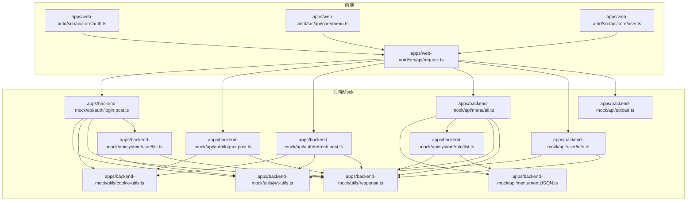
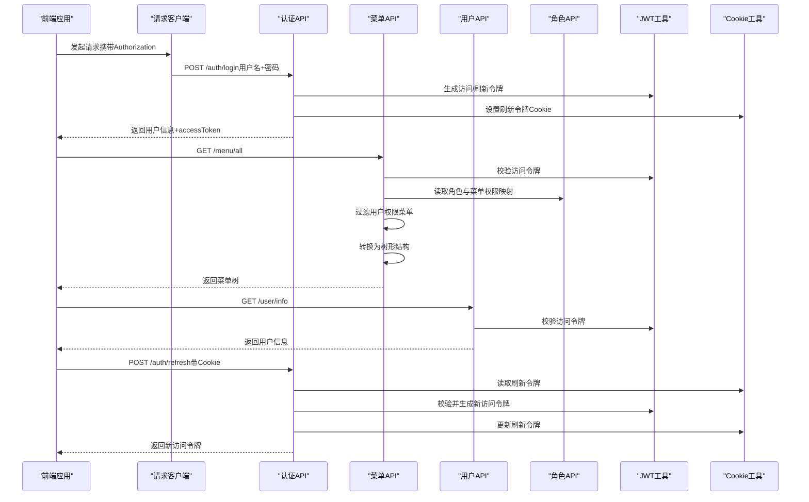
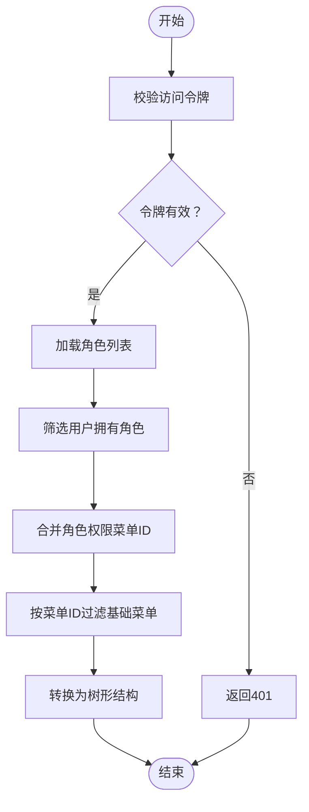
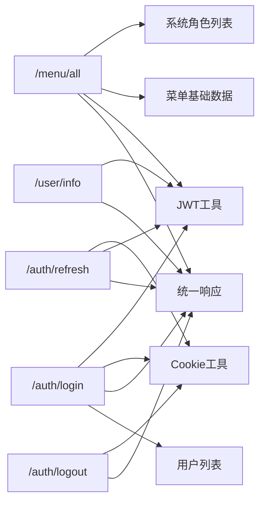

# 核心API

<cite>
**本文引用的文件**
- [apps/backend-mock/api/menu/all.ts](file://apps/backend-mock/api/menu/all.ts)
- [apps/backend-mock/api/menu/menuJSON.ts](file://apps/backend-mock/api/menu/menuJSON.ts)
- [apps/backend-mock/api/user/info.ts](file://apps/backend-mock/api/user/info.ts)
- [apps/backend-mock/api/auth/login.post.ts](file://apps/backend-mock/api/auth/login.post.ts)
- [apps/backend-mock/api/auth/logout.post.ts](file://apps/backend-mock/api/auth/logout.post.ts)
- [apps/backend-mock/api/auth/refresh.post.ts](file://apps/backend-mock/api/auth/refresh.post.ts)
- [apps/backend-mock/api/system/user/list.ts](file://apps/backend-mock/api/system/user/list.ts)
- [apps/backend-mock/api/system/role/list.ts](file://apps/backend-mock/api/system/role/list.ts)
- [apps/backend-mock/api/upload.ts](file://apps/backend-mock/api/upload.ts)
- [apps/backend-mock/utils/response.ts](file://apps/backend-mock/utils/response.ts)
- [apps/backend-mock/utils/jwt-utils.ts](file://apps/backend-mock/utils/jwt-utils.ts)
- [apps/backend-mock/utils/cookie-utils.ts](file://apps/backend-mock/utils/cookie-utils.ts)
- [apps/web-antd/src/api/core/auth.ts](file://apps/web-antd/src/api/core/auth.ts)
- [apps/web-antd/src/api/core/menu.ts](file://apps/web-antd/src/api/core/menu.ts)
- [apps/web-antd/src/api/core/user.ts](file://apps/web-antd/src/api/core/user.ts)
- [apps/web-antd/src/api/request.ts](file://apps/web-antd/src/api/request.ts)
</cite>

## 目录

1. [简介](#简介)
2. [项目结构](#项目结构)
3. [核心组件](#核心组件)
4. [架构总览](#架构总览)
5. [详细组件分析](#详细组件分析)
6. [依赖关系分析](#依赖关系分析)
7. [性能考量](#性能考量)
8. [故障排查指南](#故障排查指南)
9. [结论](#结论)
10. [附录](#附录)

## 简介

本文件面向 Vben Admin 的后端 Mock API，聚焦核心功能的 API 文档与实现原理，覆盖菜单管理、用户信息、认证鉴权与权限过滤等能力。重点说明：

- 菜单 API 的树形结构获取、动态菜单生成与权限过滤机制
- 用户 API 的个人信息获取、头像上传等
- 完整的请求参数、响应格式与状态码说明
- 实际菜单数据结构与用户信息模型
- 动态路由与权限控制的实现思路与扩展方式

## 项目结构

后端 Mock API 位于 apps/backend-mock，采用按功能域分层组织：

- 认证模块：登录、登出、刷新令牌
- 菜单模块：全量菜单、菜单树转换
- 用户模块：用户信息、用户列表
- 权限模块：角色列表（含菜单权限映射）
- 工具模块：统一响应、JWT、Cookie 工具

前端调用通过 apps/web-antd 的 API 层发起请求，统一经 apps/web-antd/src/api/request.ts 的请求客户端封装。

图表来源

- [apps/web-antd/src/api/core/auth.ts:1-52](file://apps/web-antd/src/api/core/auth.ts#L1-L52)
- [apps/web-antd/src/api/core/menu.ts:1-11](file://apps/web-antd/src/api/core/menu.ts#L1-L11)
- [apps/web-antd/src/api/core/user.ts:1-11](file://apps/web-antd/src/api/core/user.ts#L1-L11)
- [apps/web-antd/src/api/request.ts:1-124](file://apps/web-antd/src/api/request.ts#L1-L124)
- [apps/backend-mock/api/auth/login.post.ts:1-43](file://apps/backend-mock/api/auth/login.post.ts#L1-L43)
- [apps/backend-mock/api/auth/logout.post.ts:1-18](file://apps/backend-mock/api/auth/logout.post.ts#L1-L18)
- [apps/backend-mock/api/auth/refresh.post.ts:1-36](file://apps/backend-mock/api/auth/refresh.post.ts#L1-L36)
- [apps/backend-mock/api/menu/all.ts:1-31](file://apps/backend-mock/api/menu/all.ts#L1-L31)
- [apps/backend-mock/api/menu/menuJSON.ts:1-426](file://apps/backend-mock/api/menu/menuJSON.ts#L1-L426)
- [apps/backend-mock/api/user/info.ts:1-12](file://apps/backend-mock/api/user/info.ts#L1-L12)
- [apps/backend-mock/api/system/user/list.ts:1-120](file://apps/backend-mock/api/system/user/list.ts#L1-L120)
- [apps/backend-mock/api/system/role/list.ts:1-118](file://apps/backend-mock/api/system/role/list.ts#L1-L118)
- [apps/backend-mock/api/upload.ts:1-15](file://apps/backend-mock/api/upload.ts#L1-L15)
- [apps/backend-mock/utils/response.ts:1-71](file://apps/backend-mock/utils/response.ts#L1-L71)
- [apps/backend-mock/utils/jwt-utils.ts:1-115](file://apps/backend-mock/utils/jwt-utils.ts#L1-L115)
- [apps/backend-mock/utils/cookie-utils.ts:1-29](file://apps/backend-mock/utils/cookie-utils.ts#L1-L29)

章节来源

- [apps/web-antd/src/api/request.ts:1-124](file://apps/web-antd/src/api/request.ts#L1-L124)
- [apps/backend-mock/api/menu/all.ts:1-31](file://apps/backend-mock/api/menu/all.ts#L1-L31)
- [apps/backend-mock/api/menu/menuJSON.ts:1-426](file://apps/backend-mock/api/menu/menuJSON.ts#L1-L426)

## 核心组件

- 统一响应工具：提供成功/分页/错误/未授权/禁止访问等响应格式与状态码设置
- JWT 工具：生成/校验访问令牌与刷新令牌，并从请求头解析用户信息
- Cookie 工具：设置/读取/清理刷新令牌 Cookie
- 认证 API：登录、登出、刷新令牌
- 菜单 API：获取用户所有菜单（含权限过滤与树形转换）
- 用户 API：获取用户信息、用户列表；上传头像（Mock）

章节来源

- [apps/backend-mock/utils/response.ts:1-71](file://apps/backend-mock/utils/response.ts#L1-L71)
- [apps/backend-mock/utils/jwt-utils.ts:1-115](file://apps/backend-mock/utils/jwt-utils.ts#L1-L115)
- [apps/backend-mock/utils/cookie-utils.ts:1-29](file://apps/backend-mock/utils/cookie-utils.ts#L1-L29)

## 架构总览

下图展示了前端调用后端 API 的整体流程，以及权限与动态菜单的关键交互。

图表来源

- [apps/web-antd/src/api/request.ts:1-124](file://apps/web-antd/src/api/request.ts#L1-L124)
- [apps/web-antd/src/api/core/auth.ts:1-52](file://apps/web-antd/src/api/core/auth.ts#L1-L52)
- [apps/web-antd/src/api/core/menu.ts:1-11](file://apps/web-antd/src/api/core/menu.ts#L1-L11)
- [apps/web-antd/src/api/core/user.ts:1-11](file://apps/web-antd/src/api/core/user.ts#L1-L11)
- [apps/backend-mock/api/auth/login.post.ts:1-43](file://apps/backend-mock/api/auth/login.post.ts#L1-L43)
- [apps/backend-mock/api/auth/logout.post.ts:1-18](file://apps/backend-mock/api/auth/logout.post.ts#L1-L18)
- [apps/backend-mock/api/auth/refresh.post.ts:1-36](file://apps/backend-mock/api/auth/refresh.post.ts#L1-L36)
- [apps/backend-mock/api/menu/all.ts:1-31](file://apps/backend-mock/api/menu/all.ts#L1-L31)
- [apps/backend-mock/api/menu/menuJSON.ts:1-426](file://apps/backend-mock/api/menu/menuJSON.ts#L1-L426)
- [apps/backend-mock/api/system/role/list.ts:1-118](file://apps/backend-mock/api/system/role/list.ts#L1-L118)
- [apps/backend-mock/utils/jwt-utils.ts:1-115](file://apps/backend-mock/utils/jwt-utils.ts#L1-L115)
- [apps/backend-mock/utils/cookie-utils.ts:1-29](file://apps/backend-mock/utils/cookie-utils.ts#L1-L29)

## 详细组件分析

### 认证与会话管理

- 登录
  - 方法与路径：POST /auth/login
  - 请求体参数：username, password
  - 成功响应：包含 accessToken 与用户基本信息
  - 失败响应：400（缺少参数）、403（用户名或密码错误）
  - 会话：设置刷新令牌 Cookie
- 刷新令牌
  - 方法与路径：POST /auth/refresh
  - 请求：从 Cookie 读取刷新令牌并校验
  - 成功响应：新的访问令牌
  - 失败响应：403（无效或过期）
- 登出
  - 方法与路径：POST /auth/logout
  - 行为：清除刷新令牌 Cookie
  - 成功响应：空字符串

章节来源

- [apps/backend-mock/api/auth/login.post.ts:1-43](file://apps/backend-mock/api/auth/login.post.ts#L1-L43)
- [apps/backend-mock/api/auth/logout.post.ts:1-18](file://apps/backend-mock/api/auth/logout.post.ts#L1-L18)
- [apps/backend-mock/api/auth/refresh.post.ts:1-36](file://apps/backend-mock/api/auth/refresh.post.ts#L1-L36)
- [apps/backend-mock/utils/cookie-utils.ts:1-29](file://apps/backend-mock/utils/cookie-utils.ts#L1-L29)
- [apps/backend-mock/utils/jwt-utils.ts:1-115](file://apps/backend-mock/utils/jwt-utils.ts#L1-L115)
- [apps/web-antd/src/api/core/auth.ts:1-52](file://apps/web-antd/src/api/core/auth.ts#L1-L52)

### 菜单管理

- 获取用户所有菜单
  - 方法与路径：GET /menu/all
  - 请求：Authorization Bearer 令牌
  - 权限过滤流程：
    1. 校验令牌并解析用户信息
    2. 读取角色列表，筛选用户拥有的角色
    3. 合并角色的菜单权限 ID
    4. 过滤基础菜单数据，保留用户权限内的菜单与“可见但禁用”标记的菜单
  - 结果：树形菜单结构（children 递归）
- 菜单数据结构
  - 字段概览：id, pid, name, path, type, component, authCode, meta（图标、标签、缓存、隐藏策略等），status 等
  - 树形转换：convertMenuToTree 将线性数组转为树，支持过滤按钮级节点
- 动态菜单生成与权限控制
  - 基于角色的菜单权限映射（角色表中 permissions 为菜单 ID 列表）
  - 运行时根据用户角色集合与菜单 ID 集合做交集过滤
  - 支持“可见但禁用”场景（如被禁用但仍需显示占位）

图表来源

- [apps/backend-mock/api/menu/all.ts:1-31](file://apps/backend-mock/api/menu/all.ts#L1-L31)
- [apps/backend-mock/api/menu/menuJSON.ts:1-426](file://apps/backend-mock/api/menu/menuJSON.ts#L1-L426)
- [apps/backend-mock/api/system/role/list.ts:1-118](file://apps/backend-mock/api/system/role/list.ts#L1-L118)
- [apps/backend-mock/utils/jwt-utils.ts:1-115](file://apps/backend-mock/utils/jwt-utils.ts#L1-L115)

章节来源

- [apps/backend-mock/api/menu/all.ts:1-31](file://apps/backend-mock/api/menu/all.ts#L1-L31)
- [apps/backend-mock/api/menu/menuJSON.ts:1-426](file://apps/backend-mock/api/menu/menuJSON.ts#L1-L426)
- [apps/backend-mock/api/system/role/list.ts:1-118](file://apps/backend-mock/api/system/role/list.ts#L1-L118)

### 用户信息与头像上传

- 获取用户信息
  - 方法与路径：GET /user/info
  - 请求：Authorization Bearer 令牌
  - 响应：用户信息对象（不包含密码）
- 用户列表（系统管理）
  - 方法与路径：GET /system/user/list
  - 查询参数：page, pageSize, username, realName, status
  - 响应：分页结果（code=0, data.items, data.total）
- 头像上传（Mock）
  - 方法与路径：POST /upload
  - 请求：Authorization Bearer 令牌
  - 响应：Mock 图片 URL

章节来源

- [apps/backend-mock/api/user/info.ts:1-12](file://apps/backend-mock/api/user/info.ts#L1-L12)
- [apps/backend-mock/api/system/user/list.ts:1-120](file://apps/backend-mock/api/system/user/list.ts#L1-L120)
- [apps/backend-mock/api/upload.ts:1-15](file://apps/backend-mock/api/upload.ts#L1-L15)

### 前端集成与拦截器

- 请求客户端
  - 自动注入 Authorization 头（Bearer + accessToken）
  - 统一响应格式（code/data/message/error）
  - Token 过期自动刷新与重新认证
- 认证 API
  - 登录：保存 accessToken，设置刷新令牌 Cookie
  - 刷新：在启用刷新模式下自动调用刷新接口
  - 登出：清空会话并清理 Cookie

章节来源

- [apps/web-antd/src/api/request.ts:1-124](file://apps/web-antd/src/api/request.ts#L1-L124)
- [apps/web-antd/src/api/core/auth.ts:1-52](file://apps/web-antd/src/api/core/auth.ts#L1-L52)
- [apps/web-antd/src/api/core/menu.ts:1-11](file://apps/web-antd/src/api/core/menu.ts#L1-L11)
- [apps/web-antd/src/api/core/user.ts:1-11](file://apps/web-antd/src/api/core/user.ts#L1-L11)

## 依赖关系分析

- 菜单 API 依赖
  - 角色权限映射：角色表中的 permissions 字段
  - 菜单基础数据：MOCK_MENU_LIST_V2
  - JWT 工具：校验访问令牌
  - 统一响应：success/tree 化输出
- 认证 API 依赖
  - JWT 工具：生成/校验访问/刷新令牌
  - Cookie 工具：设置/读取/清理刷新令牌
  - 用户数据：mockUserData
- 前端依赖
  - 请求客户端：统一拦截器、自动刷新、错误提示
  - API 封装：按模块导出方法

图表来源

- [apps/backend-mock/api/menu/all.ts:1-31](file://apps/backend-mock/api/menu/all.ts#L1-L31)
- [apps/backend-mock/api/system/role/list.ts:1-118](file://apps/backend-mock/api/system/role/list.ts#L1-L118)
- [apps/backend-mock/api/menu/menuJSON.ts:1-426](file://apps/backend-mock/api/menu/menuJSON.ts#L1-L426)
- [apps/backend-mock/utils/jwt-utils.ts:1-115](file://apps/backend-mock/utils/jwt-utils.ts#L1-L115)
- [apps/backend-mock/utils/cookie-utils.ts:1-29](file://apps/backend-mock/utils/cookie-utils.ts#L1-L29)
- [apps/backend-mock/utils/response.ts:1-71](file://apps/backend-mock/utils/response.ts#L1-L71)

章节来源

- [apps/backend-mock/api/menu/all.ts:1-31](file://apps/backend-mock/api/menu/all.ts#L1-L31)
- [apps/backend-mock/api/system/role/list.ts:1-118](file://apps/backend-mock/api/system/role/list.ts#L1-L118)
- [apps/backend-mock/api/menu/menuJSON.ts:1-426](file://apps/backend-mock/api/menu/menuJSON.ts#L1-L426)
- [apps/backend-mock/utils/jwt-utils.ts:1-115](file://apps/backend-mock/utils/jwt-utils.ts#L1-L115)
- [apps/backend-mock/utils/cookie-utils.ts:1-29](file://apps/backend-mock/utils/cookie-utils.ts#L1-L29)
- [apps/backend-mock/utils/response.ts:1-71](file://apps/backend-mock/utils/response.ts#L1-L71)

## 性能考量

- 菜单过滤与树构建
  - 线性菜单过滤与树构建的时间复杂度近似 O(n)，n 为菜单条目数
  - 建议：在数据量较大时，考虑服务端分页与懒加载树节点
- 角色权限映射
  - 合并与交集操作为 O(r\*m)，r 为角色数，m 为菜单数
  - 建议：对权限 ID 做索引优化，避免重复遍历
- 令牌校验
  - JWT 解析与校验为常数时间，注意密钥安全与过期时间配置
- 前端拦截器
  - 统一错误处理与重试策略可减少重复代码，提升稳定性

## 故障排查指南

- 401 未授权
  - 检查 Authorization 头是否为 Bearer 令牌
  - 校验令牌是否过期或被篡改
- 403 禁止访问
  - 登录失败：用户名或密码错误
  - 刷新失败：Cookie 中无有效刷新令牌或令牌已失效
- 响应格式异常
  - 确认后端统一响应结构（code/data/message/error）
  - 前端拦截器是否正确解析 codeField/dataField
- 菜单为空或不完整
  - 核对角色 permissions 与菜单 ID 映射
  - 检查菜单 status 与“可见但禁用”标记

章节来源

- [apps/backend-mock/utils/response.ts:1-71](file://apps/backend-mock/utils/response.ts#L1-L71)
- [apps/backend-mock/utils/jwt-utils.ts:1-115](file://apps/backend-mock/utils/jwt-utils.ts#L1-L115)
- [apps/web-antd/src/api/request.ts:1-124](file://apps/web-antd/src/api/request.ts#L1-L124)

## 结论

本核心 API 通过统一响应、JWT 与 Cookie 工具，实现了认证、权限过滤与动态菜单生成的闭环。前端通过请求客户端统一处理令牌注入、刷新与错误提示，形成清晰的调用链路。建议在生产环境中替换为真实数据库与鉴权服务，并对权限映射与菜单树构建进行性能优化。

## 附录

### API 定义与规范

- 统一响应结构
  - 成功：code=0, data=业务数据, message="ok", error=null
  - 错误：code≠0, data=null, message=错误描述, error=错误详情
  - 分页：data={ items, total }
- 状态码
  - 200：成功
  - 400：请求参数缺失
  - 401：未授权
  - 403：禁止访问
- 请求头
  - Authorization: Bearer <accessToken>
  - Accept-Language: 语言偏好（由前端注入）

章节来源

- [apps/backend-mock/utils/response.ts:1-71](file://apps/backend-mock/utils/response.ts#L1-L71)
- [apps/web-antd/src/api/request.ts:1-124](file://apps/web-antd/src/api/request.ts#L1-L124)

### 数据模型

#### 用户信息模型（UserInfo）

- 关键字段：userId, username, realName, roles, roleIds, email, avatar, homePath, deptIds, status, lastLoginIp, lastLoginDate, createDate, updateDate
- 示例字段路径：[apps/backend-mock/api/system/user/list.ts:7-83](file://apps/backend-mock/api/system/user/list.ts#L7-L83)

#### 菜单数据模型（菜单项）

- 关键字段：id, pid, name, path, type, component, authCode, status, meta（图标、标签、缓存、隐藏策略等）
- 示例字段路径：[apps/backend-mock/api/menu/menuJSON.ts:334-426](file://apps/backend-mock/api/menu/menuJSON.ts#L334-L426)

#### 角色数据模型（角色）

- 关键字段：id, name, status, permissions（菜单ID数组）, remark, createDate
- 示例字段路径：[apps/backend-mock/api/system/role/list.ts:7-73](file://apps/backend-mock/api/system/role/list.ts#L7-L73)

### 动态路由与权限控制设计要点

- 动态路由
  - 前端根据后端返回的菜单树动态生成路由
  - 路由元信息（meta）来自菜单 meta 字段
- 权限控制
  - 菜单级：基于 authCode 控制菜单显示
  - 操作级：按钮级菜单（type=button）用于细粒度权限
  - 页面级：结合路由守卫与访问码（codes）进行页面访问控制

章节来源

- [apps/backend-mock/api/menu/menuJSON.ts:347-426](file://apps/backend-mock/api/menu/menuJSON.ts#L347-L426)
- [apps/web-antd/src/api/core/auth.ts:47-52](file://apps/web-antd/src/api/core/auth.ts#L47-L52)
