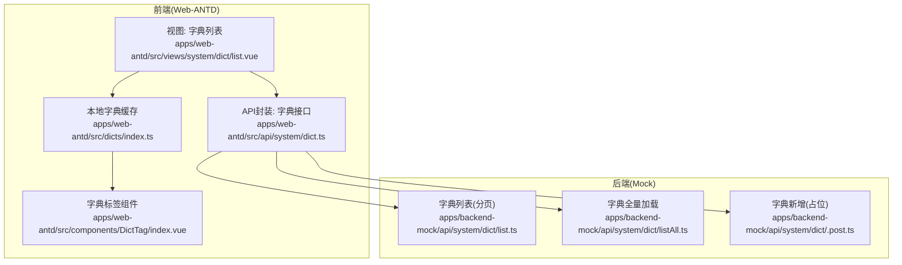
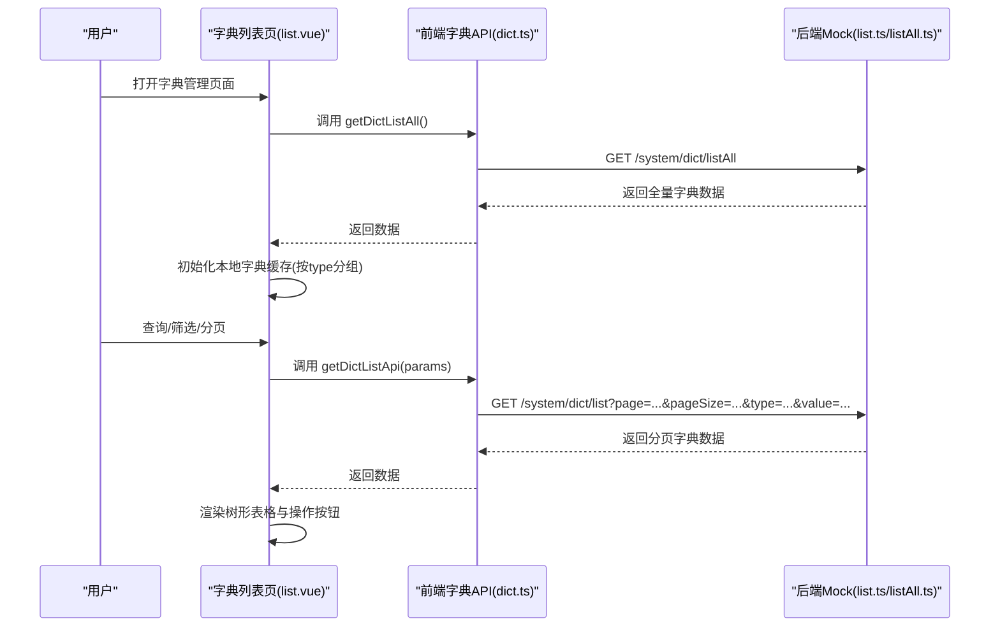
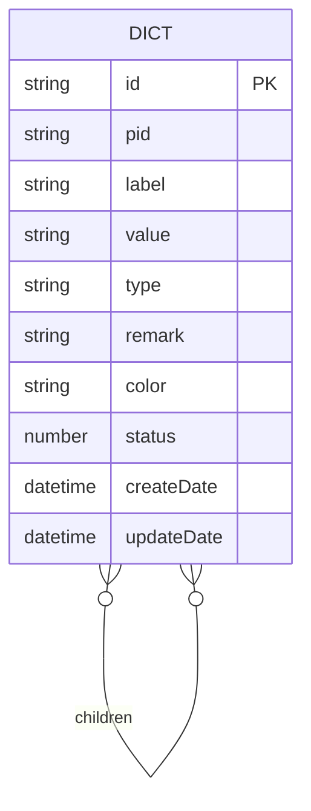
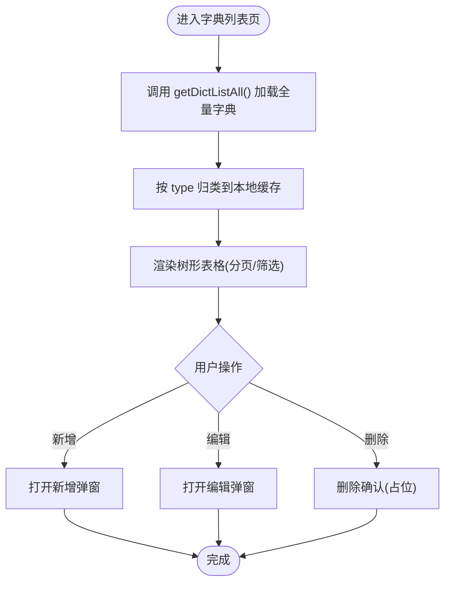
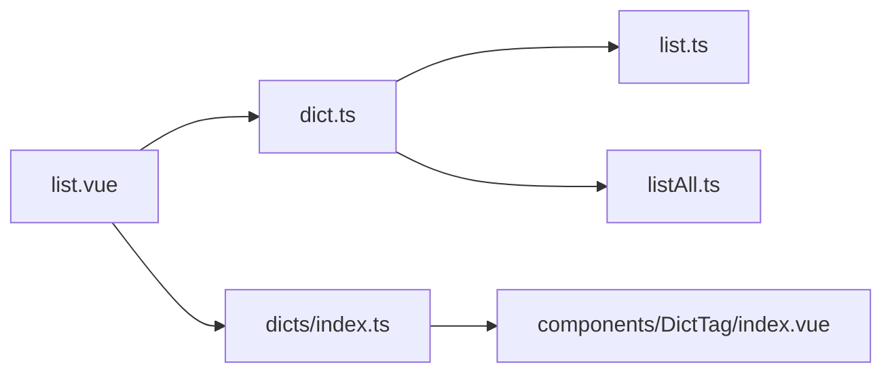

# 字典管理API

<cite>
**本文档引用的文件**
- [apps/backend-mock/api/system/dict/.post.ts](file://apps/backend-mock/api/system/dict/.post.ts)
- [apps/backend-mock/api/system/dict/list.ts](file://apps/backend-mock/api/system/dict/list.ts)
- [apps/backend-mock/api/system/dict/listAll.ts](file://apps/backend-mock/api/system/dict/listAll.ts)
- [apps/web-antd/src/api/system/dict.ts](file://apps/web-antd/src/api/system/dict.ts)
- [apps/web-antd/src/views/system/dict/list.vue](file://apps/web-antd/src/views/system/dict/list.vue)
- [apps/web-antd/src/dicts/index.ts](file://apps/web-antd/src/dicts/index.ts)
- [apps/web-antd/src/components/DictTag/index.vue](file://apps/web-antd/src/components/DictTag/index.vue)
- [apps/backend-mock/api/menu/menuJSON.ts](file://apps/backend-mock/api/menu/menuJSON.ts)
</cite>

## 目录
1. [简介](#简介)
2. [项目结构](#项目结构)
3. [核心组件](#核心组件)
4. [架构总览](#架构总览)
5. [详细组件分析](#详细组件分析)
6. [依赖分析](#依赖分析)
7. [性能考虑](#性能考虑)
8. [故障排除指南](#故障排除指南)
9. [结论](#结论)

## 简介
本文件为 Vben Admin 的字典管理 API 提供完整的技术文档，覆盖后端 Mock API、前端接口封装、前端页面与组件使用、以及字典数据模型与分类体系。内容包括：
- 字典类型管理与字典数据管理的端点定义
- 字典分类体系（父子层级）与字典项的增删改查流程
- 动态加载与全量加载策略
- 响应格式、请求参数与状态码说明
- 实际数据模型与分类结构示例
- 缓存策略与性能优化建议

## 项目结构
字典管理涉及前后端协作：前端通过统一请求客户端调用后端 API；后端提供 Mock 数据服务；前端在页面与组件中消费字典数据。

图表来源
- [apps/web-antd/src/views/system/dict/list.vue:1-142](file://apps/web-antd/src/views/system/dict/list.vue#L1-L142)
- [apps/web-antd/src/api/system/dict.ts:1-73](file://apps/web-antd/src/api/system/dict.ts#L1-L73)
- [apps/web-antd/src/dicts/index.ts:1-76](file://apps/web-antd/src/dicts/index.ts#L1-L76)
- [apps/web-antd/src/components/DictTag/index.vue:1-20](file://apps/web-antd/src/components/DictTag/index.vue#L1-L20)
- [apps/backend-mock/api/system/dict/list.ts:1-1373](file://apps/backend-mock/api/system/dict/list.ts#L1-L1373)
- [apps/backend-mock/api/system/dict/listAll.ts:1-18](file://apps/backend-mock/api/system/dict/listAll.ts#L1-L18)
- [apps/backend-mock/api/system/dict/.post.ts:1-17](file://apps/backend-mock/api/system/dict/.post.ts#L1-L17)

章节来源
- [apps/web-antd/src/views/system/dict/list.vue:1-142](file://apps/web-antd/src/views/system/dict/list.vue#L1-L142)
- [apps/web-antd/src/api/system/dict.ts:1-73](file://apps/web-antd/src/api/system/dict.ts#L1-L73)
- [apps/web-antd/src/dicts/index.ts:1-76](file://apps/web-antd/src/dicts/index.ts#L1-L76)
- [apps/web-antd/src/components/DictTag/index.vue:1-20](file://apps/web-antd/src/components/DictTag/index.vue#L1-L20)
- [apps/backend-mock/api/system/dict/list.ts:1-1373](file://apps/backend-mock/api/system/dict/list.ts#L1-L1373)
- [apps/backend-mock/api/system/dict/listAll.ts:1-18](file://apps/backend-mock/api/system/dict/listAll.ts#L1-L18)
- [apps/backend-mock/api/system/dict/.post.ts:1-17](file://apps/backend-mock/api/system/dict/.post.ts#L1-L17)

## 核心组件
- 后端 Mock API
  - 字典列表（分页）：支持按类型与值过滤，返回分页数据
  - 字典全量加载：一次性返回所有字典数据，用于前端本地缓存
  - 字典新增（占位）：预留新增端点，当前返回成功占位
- 前端接口封装
  - 获取字典列表（分页）
  - 获取字典全量
  - 创建字典（占位）
  - 更新字典（占位）
- 前端页面与组件
  - 字典列表页：基于表格组件实现树形展示与分页查询
  - 本地字典缓存：首次加载全量字典并按类型归类
  - 字典标签组件：根据类型与值渲染带颜色的标签

章节来源
- [apps/backend-mock/api/system/dict/list.ts:1341-1372](file://apps/backend-mock/api/system/dict/list.ts#L1341-L1372)
- [apps/backend-mock/api/system/dict/listAll.ts:1-18](file://apps/backend-mock/api/system/dict/listAll.ts#L1-L18)
- [apps/backend-mock/api/system/dict/.post.ts:1-17](file://apps/backend-mock/api/system/dict/.post.ts#L1-L17)
- [apps/web-antd/src/api/system/dict.ts:1-73](file://apps/web-antd/src/api/system/dict.ts#L1-L73)
- [apps/web-antd/src/views/system/dict/list.vue:1-142](file://apps/web-antd/src/views/system/dict/list.vue#L1-L142)
- [apps/web-antd/src/dicts/index.ts:1-76](file://apps/web-antd/src/dicts/index.ts#L1-L76)
- [apps/web-antd/src/components/DictTag/index.vue:1-20](file://apps/web-antd/src/components/DictTag/index.vue#L1-L20)

## 架构总览
字典管理的端到端交互流程如下：

图表来源
- [apps/web-antd/src/views/system/dict/list.vue:1-142](file://apps/web-antd/src/views/system/dict/list.vue#L1-L142)
- [apps/web-antd/src/api/system/dict.ts:1-73](file://apps/web-antd/src/api/system/dict.ts#L1-L73)
- [apps/backend-mock/api/system/dict/list.ts:1341-1372](file://apps/backend-mock/api/system/dict/list.ts#L1341-L1372)
- [apps/backend-mock/api/system/dict/listAll.ts:1-18](file://apps/backend-mock/api/system/dict/listAll.ts#L1-L18)

## 详细组件分析

### 数据模型与分类结构
- 字典项字段
  - id：字典唯一标识
  - pid：父级字典标识（null 表示顶级分类）
  - label：显示文本
  - value：字典值（可选）
  - type：字典类型（如 STORY_STATUS、TASK_TYPE 等）
  - remark：备注
  - color：标签颜色
  - status：状态
  - createDate/updateDate：创建与更新时间
  - children：子字典集合（树形结构）
- 分类体系
  - 顶级分类：pid 为 null
  - 子级字典：pid 指向其父级 id
  - 示例类型：变更行为、变更类型、需求状态、任务状态、BUG 级别等

图表来源
- [apps/web-antd/src/api/system/dict.ts:5-29](file://apps/web-antd/src/api/system/dict.ts#L5-L29)
- [apps/backend-mock/api/system/dict/list.ts:6-1373](file://apps/backend-mock/api/system/dict/list.ts#L6-L1373)

章节来源
- [apps/web-antd/src/api/system/dict.ts:5-29](file://apps/web-antd/src/api/system/dict.ts#L5-L29)
- [apps/backend-mock/api/system/dict/list.ts:6-1373](file://apps/backend-mock/api/system/dict/list.ts#L6-L1373)

### 后端 API 定义
- 字典列表（分页）
  - 方法与路径：GET /system/dict/list
  - 认证：需要访问令牌
  - 查询参数
    - page：页码（默认 1）
    - pageSize：每页条数（默认 20）
    - type：按类型过滤
    - value：按值过滤
  - 响应：分页包装后的字典列表
- 字典全量加载
  - 方法与路径：GET /system/dict/listAll
  - 认证：需要访问令牌
  - 响应：全量字典列表（按顶级分类组织，children 为子集）
- 字典新增（占位）
  - 方法与路径：POST /system/dict
  - 认证：需要访问令牌
  - 响应：成功占位（模拟延迟）

章节来源
- [apps/backend-mock/api/system/dict/list.ts:1341-1372](file://apps/backend-mock/api/system/dict/list.ts#L1341-L1372)
- [apps/backend-mock/api/system/dict/listAll.ts:1-18](file://apps/backend-mock/api/system/dict/listAll.ts#L1-L18)
- [apps/backend-mock/api/system/dict/.post.ts:1-17](file://apps/backend-mock/api/system/dict/.post.ts#L1-L17)

### 前端 API 封装
- 接口方法
  - getDictListApi(params)：获取分页字典列表
  - getDictListAll()：获取全量字典列表
  - createDict(data)：创建字典（占位）
  - updateDict(id, data)：更新字典（占位）
- 请求客户端
  - 使用统一请求客户端进行网络请求

章节来源
- [apps/web-antd/src/api/system/dict.ts:1-73](file://apps/web-antd/src/api/system/dict.ts#L1-L73)

### 前端页面与组件
- 字典列表页
  - 功能：分页查询、表单筛选、树形表格展示、新增/编辑/删除入口
  - 树形配置：pid、id、children 字段映射
  - 代理配置：通过 getDictListApi 实现远程分页
- 本地字典缓存
  - 首次加载全量字典，按 type 维度归类到内存对象
  - 提供按类型获取列表、按值获取标签文本与颜色、按值获取整行数据的方法
- 字典标签组件
  - 根据类型与值渲染带颜色的标签

图表来源
- [apps/web-antd/src/views/system/dict/list.vue:1-142](file://apps/web-antd/src/views/system/dict/list.vue#L1-L142)
- [apps/web-antd/src/dicts/index.ts:1-76](file://apps/web-antd/src/dicts/index.ts#L1-L76)

章节来源
- [apps/web-antd/src/views/system/dict/list.vue:1-142](file://apps/web-antd/src/views/system/dict/list.vue#L1-L142)
- [apps/web-antd/src/dicts/index.ts:1-76](file://apps/web-antd/src/dicts/index.ts#L1-L76)
- [apps/web-antd/src/components/DictTag/index.vue:1-20](file://apps/web-antd/src/components/DictTag/index.vue#L1-L20)

### 菜单集成
- 菜单配置中包含“系统/字典”菜单项，路径为 /system/dict，对应字典管理页面

章节来源
- [apps/backend-mock/api/menu/menuJSON.ts:320-332](file://apps/backend-mock/api/menu/menuJSON.ts#L320-L332)

## 依赖分析
- 前端页面依赖
  - 字典 API 封装：提供分页与全量加载能力
  - 本地字典缓存：提供按类型与值的快速查询
  - 字典标签组件：复用本地字典缓存
- 后端 API 依赖
  - 访问令牌校验：统一鉴权
  - Mock 数据：内置字典数据与分页逻辑

图表来源
- [apps/web-antd/src/views/system/dict/list.vue:1-142](file://apps/web-antd/src/views/system/dict/list.vue#L1-L142)
- [apps/web-antd/src/api/system/dict.ts:1-73](file://apps/web-antd/src/api/system/dict.ts#L1-L73)
- [apps/web-antd/src/dicts/index.ts:1-76](file://apps/web-antd/src/dicts/index.ts#L1-L76)
- [apps/web-antd/src/components/DictTag/index.vue:1-20](file://apps/web-antd/src/components/DictTag/index.vue#L1-L20)
- [apps/backend-mock/api/system/dict/list.ts:1-1373](file://apps/backend-mock/api/system/dict/list.ts#L1-L1373)
- [apps/backend-mock/api/system/dict/listAll.ts:1-18](file://apps/backend-mock/api/system/dict/listAll.ts#L1-L18)

章节来源
- [apps/web-antd/src/views/system/dict/list.vue:1-142](file://apps/web-antd/src/views/system/dict/list.vue#L1-L142)
- [apps/web-antd/src/api/system/dict.ts:1-73](file://apps/web-antd/src/api/system/dict.ts#L1-L73)
- [apps/web-antd/src/dicts/index.ts:1-76](file://apps/web-antd/src/dicts/index.ts#L1-L76)
- [apps/web-antd/src/components/DictTag/index.vue:1-20](file://apps/web-antd/src/components/DictTag/index.vue#L1-L20)
- [apps/backend-mock/api/system/dict/list.ts:1-1373](file://apps/backend-mock/api/system/dict/list.ts#L1-L1373)
- [apps/backend-mock/api/system/dict/listAll.ts:1-18](file://apps/backend-mock/api/system/dict/listAll.ts#L1-L18)

## 性能考虑
- 本地缓存策略
  - 首次加载全量字典，按 type 维度归类，避免重复请求
  - 在组件中直接从本地缓存读取，降低网络与计算开销
- 分页与筛选
  - 列表页采用分页查询，减少单次传输数据量
  - 支持按 type 与 value 进行前端过滤，提升交互响应速度
- 树形渲染优化
  - 使用树形表格配置，避免深层递归渲染带来的性能问题
- 新增/更新端点占位
  - 当前新增/更新为占位实现，建议后续接入真实后端以减少本地状态复杂度

## 故障排除指南
- 无权限或令牌无效
  - 现象：返回未授权响应
  - 处理：确保携带有效访问令牌
- 端点不存在
  - 现象：删除与更新端点文件缺失
  - 处理：当前仅提供新增占位端点，后续需补充删除与更新实现
- 数据为空或不完整
  - 现象：字典列表为空或标签不显示
  - 处理：检查全量加载是否成功，确认 type 与 value 匹配

章节来源
- [apps/backend-mock/api/system/dict/.post.ts:1-17](file://apps/backend-mock/api/system/dict/.post.ts#L1-L17)
- [apps/backend-mock/api/system/dict/list.ts:1341-1372](file://apps/backend-mock/api/system/dict/list.ts#L1341-L1372)
- [apps/web-antd/src/dicts/index.ts:1-76](file://apps/web-antd/src/dicts/index.ts#L1-L76)

## 结论
本字典管理 API 已具备基础的分类体系与数据模型，并通过 Mock 后端提供分页与全量加载能力。前端通过统一 API 封装与本地缓存实现高效的数据消费与展示。建议后续完善删除与更新端点，以形成完整的字典管理闭环；同时可引入更细粒度的缓存失效策略与错误重试机制，进一步提升用户体验与系统稳定性。