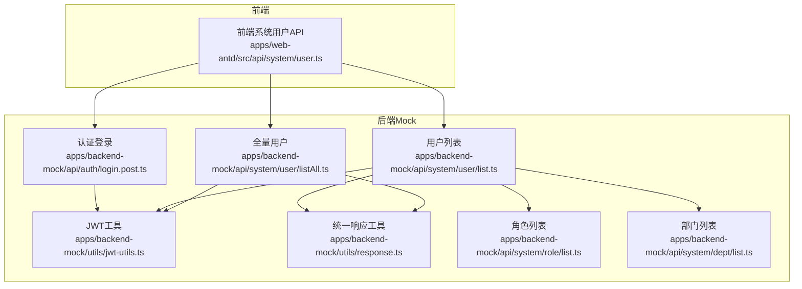
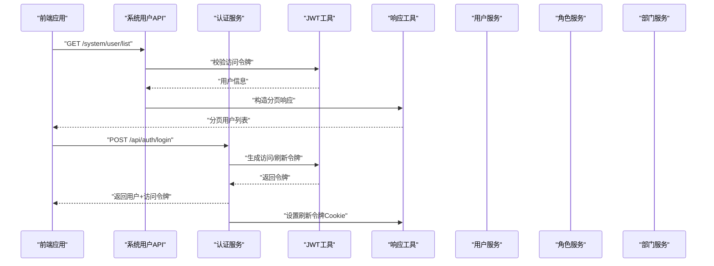
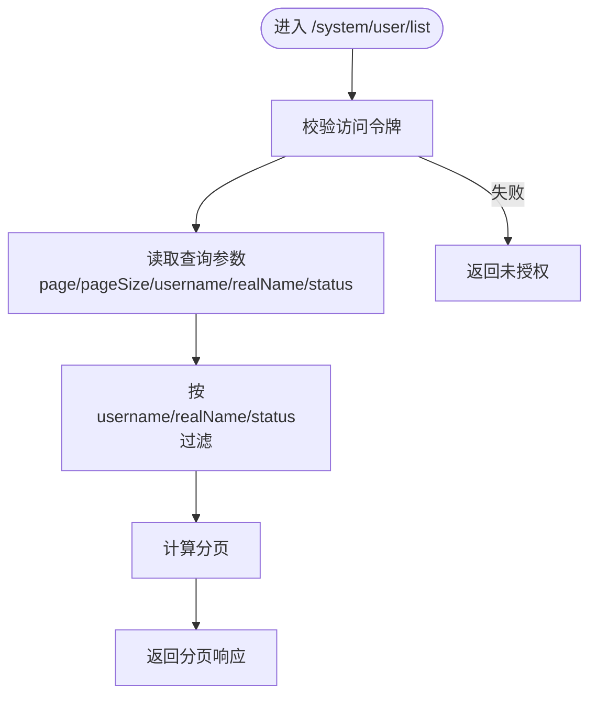
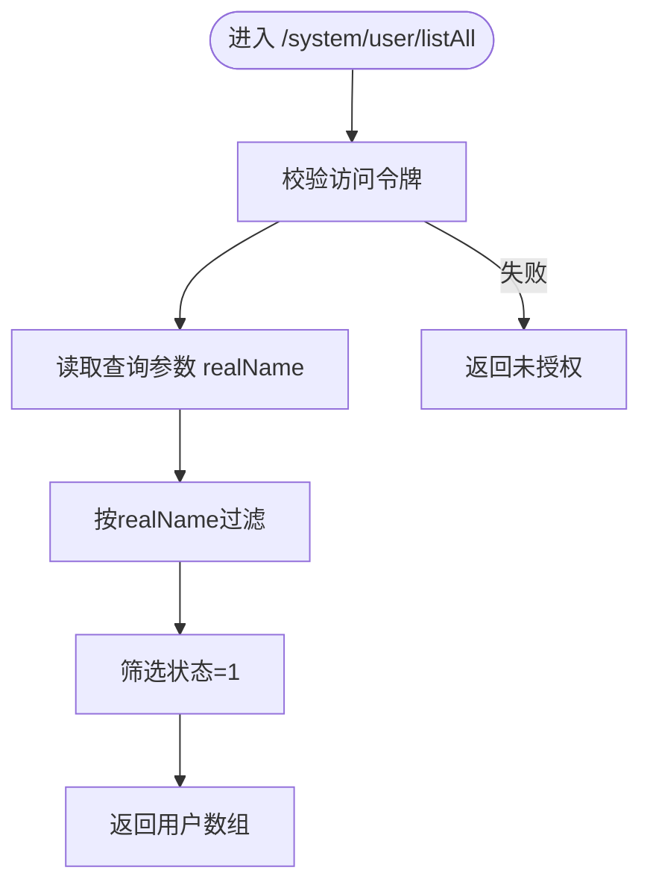
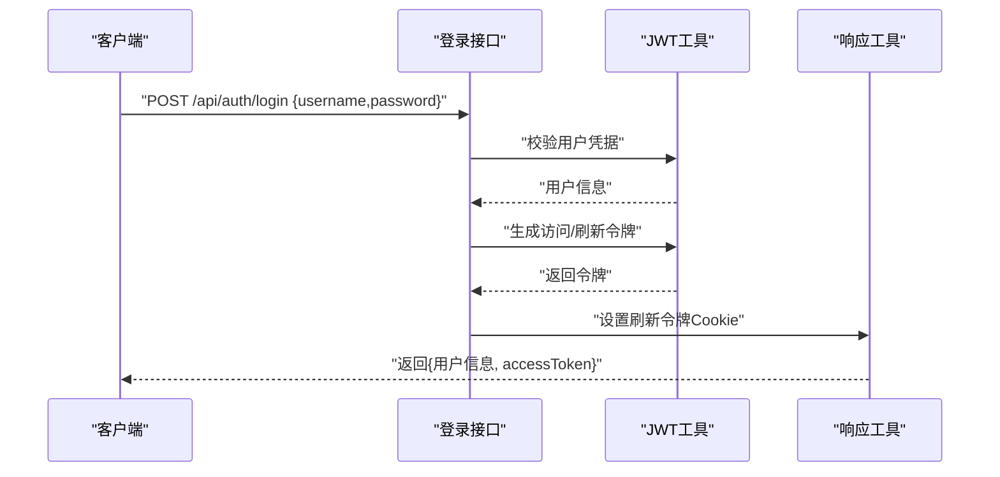
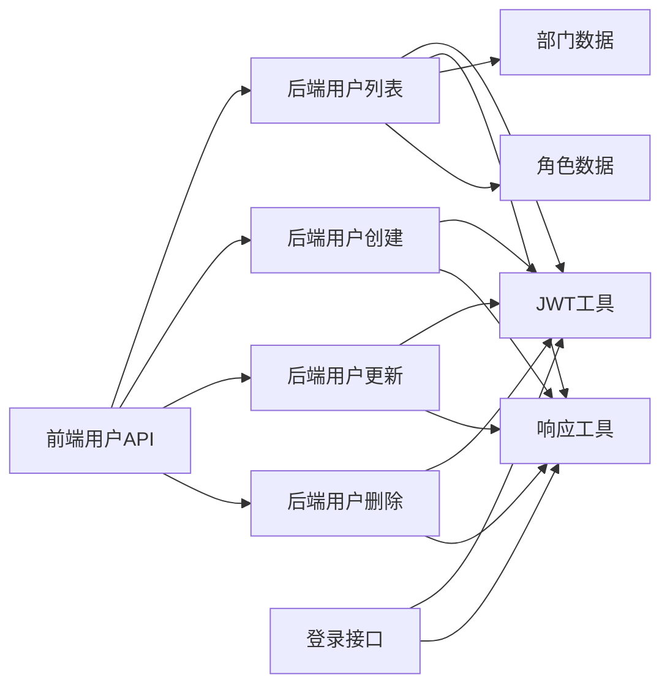

# 用户管理API

<cite>
**本文引用的文件**
- [apps/backend-mock/api/system/user/list.ts](file://apps/backend-mock/api/system/user/list.ts)
- [apps/backend-mock/api/system/user/listAll.ts](file://apps/backend-mock/api/system/user/listAll.ts)
- [apps/web-antd/src/api/system/user.ts](file://apps/web-antd/src/api/system/user.ts)
- [apps/backend-mock/api/auth/login.post.ts](file://apps/backend-mock/api/auth/login.post.ts)
- [apps/backend-mock/utils/jwt-utils.ts](file://apps/backend-mock/utils/jwt-utils.ts)
- [apps/backend-mock/utils/response.ts](file://apps/backend-mock/utils/response.ts)
- [apps/backend-mock/api/system/dept/list.ts](file://apps/backend-mock/api/system/dept/list.ts)
- [apps/backend-mock/api/system/role/list.ts](file://apps/backend-mock/api/system/role/list.ts)
- [apps/backend-mock/routes/[...].ts](file://apps/backend-mock/routes/[...].ts)
</cite>

## 目录
1. [简介](#简介)
2. [项目结构](#项目结构)
3. [核心组件](#核心组件)
4. [架构总览](#架构总览)
5. [详细组件分析](#详细组件分析)
6. [依赖关系分析](#依赖关系分析)
7. [性能考虑](#性能考虑)
8. [故障排查指南](#故障排查指南)
9. [结论](#结论)
10. [附录](#附录)

## 简介
本文件面向 Vben Admin 的后端 Mock 服务，系统性梳理“用户管理”相关 API 的端点定义、请求参数、响应格式与状态码，并结合仓库中的认证、角色与部门模块，给出用户信息模型、权限配置示例以及安全与会话管理机制说明。由于当前仓库未提供真实后端实现，本文所有接口定义均基于 Mock 层的现有文件进行归纳总结。

## 项目结构
用户管理 API 主要分布在以下位置：
- 后端 Mock API：apps/backend-mock/api/system/user
- 前端调用封装：apps/web-antd/src/api/system/user.ts
- 认证与会话：apps/backend-mock/api/auth/* 与 apps/backend-mock/utils/jwt-utils.ts
- 权限与菜单：apps/backend-mock/api/system/role/*
- 部门数据：apps/backend-mock/api/system/dept/*

图表来源
- [apps/web-antd/src/api/system/user.ts:1-54](file://apps/web-antd/src/api/system/user.ts#L1-L54)
- [apps/backend-mock/api/auth/login.post.ts:1-42](file://apps/backend-mock/api/auth/login.post.ts#L1-L42)
- [apps/backend-mock/utils/jwt-utils.ts:1-200](file://apps/backend-mock/utils/jwt-utils.ts#L1-L200)
- [apps/backend-mock/utils/response.ts:1-200](file://apps/backend-mock/utils/response.ts#L1-L200)
- [apps/backend-mock/api/system/user/list.ts:1-120](file://apps/backend-mock/api/system/user/list.ts#L1-L120)
- [apps/backend-mock/api/system/user/listAll.ts:1-28](file://apps/backend-mock/api/system/user/listAll.ts#L1-L28)
- [apps/backend-mock/api/system/role/list.ts:1-120](file://apps/backend-mock/api/system/role/list.ts#L1-L120)
- [apps/backend-mock/api/system/dept/list.ts:1-62](file://apps/backend-mock/api/system/dept/list.ts#L1-L62)

章节来源
- [apps/web-antd/src/api/system/user.ts:1-54](file://apps/web-antd/src/api/system/user.ts#L1-L54)
- [apps/backend-mock/api/system/user/list.ts:1-120](file://apps/backend-mock/api/system/user/list.ts#L1-L120)
- [apps/backend-mock/api/system/user/listAll.ts:1-28](file://apps/backend-mock/api/system/user/listAll.ts#L1-L28)

## 核心组件
- 用户列表查询（分页）
  - 方法与路径：GET /system/user/list
  - 查询参数：
    - page：页码，默认 1
    - pageSize：每页条数，默认 20
    - username：用户名过滤
    - realName：姓名过滤
    - status：状态过滤（0/1）
  - 响应：分页包装后的用户数组
  - 安全：需携带有效访问令牌
- 全量用户查询
  - 方法与路径：GET /system/user/listAll
  - 查询参数：
    - realName：姓名过滤（可选）
  - 响应：过滤后的用户数组（仅状态为启用）
  - 安全：需携带有效访问令牌
- 用户创建
  - 方法与路径：POST /system/user
  - 请求体：除 userId 外的用户字段
  - 响应：新建用户对象
  - 安全：需携带有效访问令牌
- 用户更新
  - 方法与路径：PUT /system/user/{userId}
  - 路径参数：userId
  - 请求体：除 userId 外的用户字段
  - 响应：更新后的用户对象
  - 安全：需携带有效访问令牌
- 用户删除
  - 方法与路径：DELETE /system/user/{userId}
  - 路径参数：userId
  - 响应：空对象或成功标记
  - 安全：需携带有效访问令牌
- 登录认证
  - 方法与路径：POST /api/auth/login
  - 请求体：username、password
  - 响应：用户信息 + 访问令牌 + 刷新令牌（通过 Cookie）
  - 安全：成功后设置刷新令牌 Cookie

章节来源
- [apps/web-antd/src/api/system/user.ts:24-54](file://apps/web-antd/src/api/system/user.ts#L24-L54)
- [apps/backend-mock/api/system/user/list.ts:85-120](file://apps/backend-mock/api/system/user/list.ts#L85-L120)
- [apps/backend-mock/api/system/user/listAll.ts:7-28](file://apps/backend-mock/api/system/user/listAll.ts#L7-L28)
- [apps/backend-mock/api/auth/login.post.ts:14-42](file://apps/backend-mock/api/auth/login.post.ts#L14-L42)

## 架构总览
下图展示了从前端到后端 Mock 的典型调用链路，以及与认证、角色、部门模块的交互。

图表来源
- [apps/web-antd/src/api/system/user.ts:24-54](file://apps/web-antd/src/api/system/user.ts#L24-L54)
- [apps/backend-mock/api/auth/login.post.ts:14-42](file://apps/backend-mock/api/auth/login.post.ts#L14-L42)
- [apps/backend-mock/utils/jwt-utils.ts:1-200](file://apps/backend-mock/utils/jwt-utils.ts#L1-L200)
- [apps/backend-mock/utils/response.ts:1-200](file://apps/backend-mock/utils/response.ts#L1-L200)
- [apps/backend-mock/api/system/user/list.ts:85-120](file://apps/backend-mock/api/system/user/list.ts#L85-L120)

## 详细组件分析

### 用户数据模型
- 字段概览（部分关键字段）：
  - userId：用户唯一标识
  - username：用户名
  - realName：真实姓名
  - password：密码（明文示例）
  - avatar：头像地址
  - roles：角色名称数组
  - roleIds：角色ID数组
  - deptIds：部门ID数组
  - status：状态（0/1）
  - lastLoginIp/lastLoginDate/createDate/updateDate：时间与登录信息
- 示例来源：mock 用户数据与接口返回结构

章节来源
- [apps/backend-mock/api/system/user/list.ts:7-83](file://apps/backend-mock/api/system/user/list.ts#L7-L83)

### 用户列表查询（分页）
- 端点：GET /system/user/list
- 查询参数：
  - page、pageSize：分页
  - username、realName、status：过滤条件
- 过滤逻辑：
  - 支持按用户名/姓名模糊匹配
  - 支持按状态精确过滤（0/1）
- 响应：
  - 分页包装后的用户数组
- 安全：
  - 需通过访问令牌校验

图表来源
- [apps/backend-mock/api/system/user/list.ts:85-120](file://apps/backend-mock/api/system/user/list.ts#L85-L120)
- [apps/backend-mock/utils/jwt-utils.ts:1-200](file://apps/backend-mock/utils/jwt-utils.ts#L1-L200)
- [apps/backend-mock/utils/response.ts:1-200](file://apps/backend-mock/utils/response.ts#L1-L200)

章节来源
- [apps/backend-mock/api/system/user/list.ts:85-120](file://apps/backend-mock/api/system/user/list.ts#L85-L120)

### 全量用户查询
- 端点：GET /system/user/listAll
- 查询参数：
  - realName：可选，按姓名过滤
- 过滤逻辑：
  - 仅返回状态为启用的用户
- 响应：
  - 用户数组

图表来源
- [apps/backend-mock/api/system/user/listAll.ts:7-28](file://apps/backend-mock/api/system/user/listAll.ts#L7-L28)
- [apps/backend-mock/utils/jwt-utils.ts:1-200](file://apps/backend-mock/utils/jwt-utils.ts#L1-L200)

章节来源
- [apps/backend-mock/api/system/user/listAll.ts:7-28](file://apps/backend-mock/api/system/user/listAll.ts#L7-L28)

### 用户创建
- 端点：POST /system/user
- 请求体：
  - 排除 userId 的用户字段集合
- 响应：
  - 新建用户对象
- 安全：
  - 需通过访问令牌校验

章节来源
- [apps/web-antd/src/api/system/user.ts:40-45](file://apps/web-antd/src/api/system/user.ts#L40-L45)

### 用户更新
- 端点：PUT /system/user/{userId}
- 路径参数：
  - userId：目标用户ID
- 请求体：
  - 排除 userId 的用户字段集合
- 响应：
  - 更新后的用户对象
- 安全：
  - 需通过访问令牌校验

章节来源
- [apps/web-antd/src/api/system/user.ts:47-53](file://apps/web-antd/src/api/system/user.ts#L47-L53)

### 用户删除
- 端点：DELETE /system/user/{userId}
- 路径参数：
  - userId：目标用户ID
- 响应：
  - 成功标记或空对象
- 安全：
  - 需通过访问令牌校验

章节来源
- [apps/web-antd/src/api/system/user.ts:54-54](file://apps/web-antd/src/api/system/user.ts#L54-L54)

### 登录认证
- 端点：POST /api/auth/login
- 请求体：
  - username、password
- 响应：
  - 用户信息 + accessToken
  - 设置刷新令牌 Cookie
- 安全：
  - 成功后颁发访问/刷新令牌；失败清除刷新令牌 Cookie

图表来源
- [apps/backend-mock/api/auth/login.post.ts:14-42](file://apps/backend-mock/api/auth/login.post.ts#L14-L42)
- [apps/backend-mock/utils/jwt-utils.ts:1-200](file://apps/backend-mock/utils/jwt-utils.ts#L1-L200)
- [apps/backend-mock/utils/response.ts:1-200](file://apps/backend-mock/utils/response.ts#L1-L200)

章节来源
- [apps/backend-mock/api/auth/login.post.ts:14-42](file://apps/backend-mock/api/auth/login.post.ts#L14-L42)

### 角色与权限配置示例
- 角色数据示例包含管理员与普通用户两类角色，每类角色拥有不同的权限集合。
- 示例来源：角色列表文件中对权限数组的定义。

章节来源
- [apps/backend-mock/api/system/role/list.ts:37-79](file://apps/backend-mock/api/system/role/list.ts#L37-L79)

### 部门关联
- 用户模型包含 deptIds 字段，用于表示用户所属的多个部门。
- 部门数据由部门列表接口提供，用户列表在 Mock 中使用该数据生成随机部门ID集合。

章节来源
- [apps/backend-mock/api/system/user/list.ts:19-83](file://apps/backend-mock/api/system/user/list.ts#L19-L83)
- [apps/backend-mock/api/system/dept/list.ts:16-62](file://apps/backend-mock/api/system/dept/list.ts#L16-L62)

## 依赖关系分析
- 前端系统用户 API 依赖统一请求客户端，向后端发起 GET/POST/PUT/DELETE 请求。
- 后端用户接口依赖访问令牌校验与统一响应工具。
- 登录接口依赖 JWT 工具生成令牌，并通过响应工具设置 Cookie。
- 用户列表依赖部门与角色数据以完善用户信息。

图表来源
- [apps/web-antd/src/api/system/user.ts:24-54](file://apps/web-antd/src/api/system/user.ts#L24-L54)
- [apps/backend-mock/api/system/user/list.ts:85-120](file://apps/backend-mock/api/system/user/list.ts#L85-L120)
- [apps/backend-mock/api/auth/login.post.ts:14-42](file://apps/backend-mock/api/auth/login.post.ts#L14-L42)
- [apps/backend-mock/utils/jwt-utils.ts:1-200](file://apps/backend-mock/utils/jwt-utils.ts#L1-L200)
- [apps/backend-mock/utils/response.ts:1-200](file://apps/backend-mock/utils/response.ts#L1-L200)
- [apps/backend-mock/api/system/dept/list.ts:16-62](file://apps/backend-mock/api/system/dept/list.ts#L16-L62)
- [apps/backend-mock/api/system/role/list.ts:37-79](file://apps/backend-mock/api/system/role/list.ts#L37-L79)

章节来源
- [apps/web-antd/src/api/system/user.ts:24-54](file://apps/web-antd/src/api/system/user.ts#L24-L54)
- [apps/backend-mock/api/system/user/list.ts:85-120](file://apps/backend-mock/api/system/user/list.ts#L85-L120)
- [apps/backend-mock/api/auth/login.post.ts:14-42](file://apps/backend-mock/api/auth/login.post.ts#L14-L42)

## 性能考虑
- 列表查询采用内存过滤与分页，适合小规模 Mock 数据；在真实后端中建议引入数据库索引与分页游标。
- 登录与用户更新等接口包含延迟模拟（如睡眠），在生产环境应移除或替换为真实业务处理。
- 建议对频繁查询的用户列表增加缓存层，减少重复计算。

## 故障排查指南
- 未携带访问令牌或令牌无效
  - 现象：返回未授权
  - 排查：确认请求头携带令牌或 Cookie 是否正确
- 登录失败
  - 现象：用户名或密码错误
  - 排查：核对用户名与密码是否匹配 Mock 数据
- 参数缺失
  - 现象：请求参数不完整导致错误
  - 排查：检查必填字段是否传入

章节来源
- [apps/backend-mock/api/system/user/list.ts:85-120](file://apps/backend-mock/api/system/user/list.ts#L85-L120)
- [apps/backend-mock/api/auth/login.post.ts:16-31](file://apps/backend-mock/api/auth/login.post.ts#L16-L31)

## 结论
本文基于仓库现有的 Mock 实现，系统化梳理了用户管理 API 的端点、参数、响应与安全机制。对于需要对接真实后端的团队，可据此快速对齐接口契约，并在真实实现中补充用户 CRUD 的具体业务逻辑、密码加密、头像上传、权限继承与会话管理细节。

## 附录

### 端点一览与说明
- GET /system/user/list
  - 功能：分页查询用户列表
  - 查询参数：page、pageSize、username、realName、status
  - 响应：分页用户数组
- GET /system/user/listAll
  - 功能：获取全量可用用户
  - 查询参数：realName（可选）
  - 响应：用户数组
- POST /system/user
  - 功能：创建用户
  - 请求体：除 userId 外的用户字段
  - 响应：新建用户对象
- PUT /system/user/{userId}
  - 功能：更新用户
  - 路径参数：userId
  - 请求体：除 userId 外的用户字段
  - 响应：更新后的用户对象
- DELETE /system/user/{userId}
  - 功能：删除用户
  - 路径参数：userId
  - 响应：成功标记或空对象
- POST /api/auth/login
  - 功能：用户登录
  - 请求体：username、password
  - 响应：用户信息 + accessToken；设置刷新令牌 Cookie

章节来源
- [apps/web-antd/src/api/system/user.ts:24-54](file://apps/web-antd/src/api/system/user.ts#L24-L54)
- [apps/backend-mock/api/system/user/list.ts:85-120](file://apps/backend-mock/api/system/user/list.ts#L85-L120)
- [apps/backend-mock/api/system/user/listAll.ts:7-28](file://apps/backend-mock/api/system/user/listAll.ts#L7-L28)
- [apps/backend-mock/api/auth/login.post.ts:14-42](file://apps/backend-mock/api/auth/login.post.ts#L14-L42)

### 用户信息模型字段说明
- userId：用户唯一标识
- username：用户名
- realName：真实姓名
- password：密码（示例为明文）
- avatar：头像地址
- roles：角色名称数组
- roleIds：角色ID数组
- deptIds：部门ID数组
- status：状态（0/1）
- lastLoginIp/lastLoginDate/createDate/updateDate：时间与登录信息

章节来源
- [apps/backend-mock/api/system/user/list.ts:7-83](file://apps/backend-mock/api/system/user/list.ts#L7-L83)

### 权限配置示例
- 管理员角色（示例）：包含系统管理与开发管理等多类权限集合
- 普通用户角色（示例）：包含工作台与开发管理等基础权限集合

章节来源
- [apps/backend-mock/api/system/role/list.ts:37-79](file://apps/backend-mock/api/system/role/list.ts#L37-L79)

### 安全策略与会话管理
- 访问令牌校验：所有受保护接口均需通过访问令牌校验
- 刷新令牌：登录成功后设置刷新令牌 Cookie，用于续期
- 未授权处理：校验失败时返回未授权响应

章节来源
- [apps/backend-mock/utils/jwt-utils.ts:1-200](file://apps/backend-mock/utils/jwt-utils.ts#L1-L200)
- [apps/backend-mock/utils/response.ts:1-200](file://apps/backend-mock/utils/response.ts#L1-L200)
- [apps/backend-mock/api/auth/login.post.ts:14-42](file://apps/backend-mock/api/auth/login.post.ts#L14-L42)