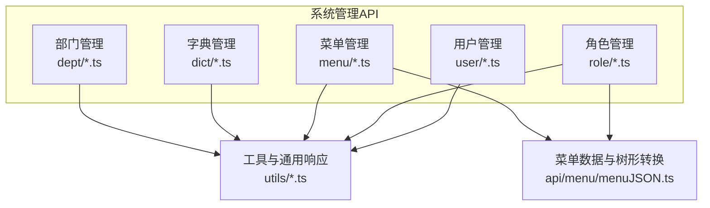
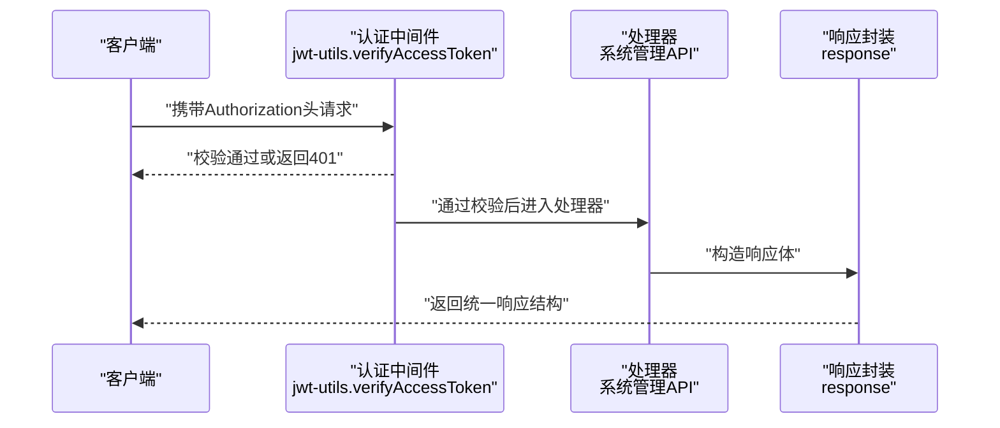
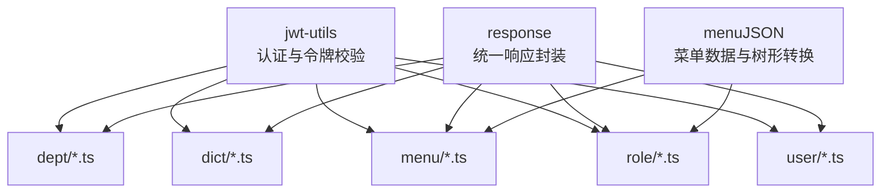

# 系统管理API

<cite>
**本文档引用的文件**
- [apps/backend-mock/api/system/dept/.post.ts](file://apps/backend-mock/api/system/dept/.post.ts)
- [apps/backend-mock/api/system/dept/list.ts](file://apps/backend-mock/api/system/dept/list.ts)
- [apps/backend-mock/api/system/dept/[id].put.ts](file://apps/backend-mock/api/system/dept/[id].put.ts)
- [apps/backend-mock/api/system/dept/[id].delete.ts](file://apps/backend-mock/api/system/dept/[id].delete.ts)
- [apps/backend-mock/api/system/dict/.post.ts](file://apps/backend-mock/api/system/dict/.post.ts)
- [apps/backend-mock/api/system/dict/list.ts](file://apps/backend-mock/api/system/dict/list.ts)
- [apps/backend-mock/api/system/dict/listAll.ts](file://apps/backend-mock/api/system/dict/listAll.ts)
- [apps/backend-mock/api/system/menu/list.ts](file://apps/backend-mock/api/system/menu/list.ts)
- [apps/backend-mock/api/system/menu/name-exists.ts](file://apps/backend-mock/api/system/menu/name-exists.ts)
- [apps/backend-mock/api/system/menu/path-exists.ts](file://apps/backend-mock/api/system/menu/path-exists.ts)
- [apps/backend-mock/api/system/role/list.ts](file://apps/backend-mock/api/system/role/list.ts)
- [apps/backend-mock/api/system/user/list.ts](file://apps/backend-mock/api/system/user/list.ts)
- [apps/backend-mock/api/system/user/listAll.ts](file://apps/backend-mock/api/system/user/listAll.ts)
- [apps/backend-mock/utils/response.ts](file://apps/backend-mock/utils/response.ts)
- [apps/backend-mock/utils/jwt-utils.ts](file://apps/backend-mock/utils/jwt-utils.ts)
- [apps/backend-mock/api/menu/menuJSON.ts](file://apps/backend-mock/api/menu/menuJSON.ts)
</cite>

## 目录
1. [简介](#简介)
2. [项目结构](#项目结构)
3. [核心组件](#核心组件)
4. [架构总览](#架构总览)
5. [详细组件分析](#详细组件分析)
6. [依赖关系分析](#依赖关系分析)
7. [性能考量](#性能考量)
8. [故障排查指南](#故障排查指南)
9. [结论](#结论)
10. [附录](#附录)

## 简介
本文件为 Vben Admin 后端 Mock 服务中的“系统管理”相关 API 文档，覆盖部门管理、字典管理、菜单管理、角色管理与用户管理五大模块。文档详细说明各模块的端点、请求参数、响应格式、状态码以及典型的数据结构（树形结构、权限数据模型），并提供最佳实践与安全建议。

## 项目结构
系统管理 API 位于后端 Mock 应用中，采用按功能域划分的目录组织方式：
- 系统管理模块：apps/backend-mock/api/system/{dept,dict,menu,role,user}
- 工具与通用响应：apps/backend-mock/utils/{response,jwt-utils}
- 菜单数据与树形转换：apps/backend-mock/api/menu/menuJSON.ts

图表来源
- [apps/backend-mock/api/system/dept/.post.ts:1-17](file://apps/backend-mock/api/system/dept/.post.ts#L1-L17)
- [apps/backend-mock/api/system/dict/.post.ts:1-17](file://apps/backend-mock/api/system/dict/.post.ts#L1-L17)
- [apps/backend-mock/api/system/menu/list.ts:1-13](file://apps/backend-mock/api/system/menu/list.ts#L1-L13)
- [apps/backend-mock/api/system/role/list.ts:1-118](file://apps/backend-mock/api/system/role/list.ts#L1-L118)
- [apps/backend-mock/api/system/user/list.ts:1-120](file://apps/backend-mock/api/system/user/list.ts#L1-L120)
- [apps/backend-mock/utils/response.ts:1-71](file://apps/backend-mock/utils/response.ts#L1-L71)
- [apps/backend-mock/utils/jwt-utils.ts:1-115](file://apps/backend-mock/utils/jwt-utils.ts#L1-L115)
- [apps/backend-mock/api/menu/menuJSON.ts:1-426](file://apps/backend-mock/api/menu/menuJSON.ts#L1-L426)

章节来源
- [apps/backend-mock/api/system/dept/.post.ts:1-17](file://apps/backend-mock/api/system/dept/.post.ts#L1-L17)
- [apps/backend-mock/api/system/dict/.post.ts:1-17](file://apps/backend-mock/api/system/dict/.post.ts#L1-L17)
- [apps/backend-mock/api/system/menu/list.ts:1-13](file://apps/backend-mock/api/system/menu/list.ts#L1-L13)
- [apps/backend-mock/api/system/role/list.ts:1-118](file://apps/backend-mock/api/system/role/list.ts#L1-L118)
- [apps/backend-mock/api/system/user/list.ts:1-120](file://apps/backend-mock/api/system/user/list.ts#L1-L120)
- [apps/backend-mock/utils/response.ts:1-71](file://apps/backend-mock/utils/response.ts#L1-L71)
- [apps/backend-mock/utils/jwt-utils.ts:1-115](file://apps/backend-mock/utils/jwt-utils.ts#L1-L115)
- [apps/backend-mock/api/menu/menuJSON.ts:1-426](file://apps/backend-mock/api/menu/menuJSON.ts#L1-L426)

## 核心组件
- 认证与授权中间件：通过 Authorization 头中的 Bearer Token 校验访问令牌，校验失败返回 401。
- 统一响应封装：提供成功、分页、错误、未授权等统一响应结构。
- 菜单数据与树形转换：内置菜单 JSON 数据，并提供将线性菜单转为树形结构的工具方法。
- 权限数据模型：角色与菜单 ID 关联，形成权限矩阵；菜单支持 catalog、menu、button 三类。

章节来源
- [apps/backend-mock/utils/jwt-utils.ts:27-56](file://apps/backend-mock/utils/jwt-utils.ts#L27-L56)
- [apps/backend-mock/utils/response.ts:5-55](file://apps/backend-mock/utils/response.ts#L5-L55)
- [apps/backend-mock/api/menu/menuJSON.ts:347-425](file://apps/backend-mock/api/menu/menuJSON.ts#L347-L425)

## 架构总览
系统管理 API 的典型调用链路如下：

图表来源
- [apps/backend-mock/utils/jwt-utils.ts:27-56](file://apps/backend-mock/utils/jwt-utils.ts#L27-L56)
- [apps/backend-mock/utils/response.ts:5-33](file://apps/backend-mock/utils/response.ts#L5-L33)

## 详细组件分析

### 部门管理 API
- 功能概述：提供部门列表查询、新增、修改、删除等 CRUD 操作。
- 认证要求：所有端点均需通过 Bearer Token 校验。
- 响应格式：统一使用成功响应结构，部分端点包含延时模拟网络延迟。

端点定义
- GET /api/system/dept/list
  - 功能：获取部门列表（树形结构由前端或后端生成，此处返回扁平数据，具体树形转换逻辑见菜单模块）。
  - 认证：是
  - 查询参数：无
  - 响应：成功响应，data 为部门列表数组。
  - 状态码：200 成功；401 未授权。
  - 参考路径：[apps/backend-mock/api/system/dept/list.ts:53-61](file://apps/backend-mock/api/system/dept/list.ts#L53-L61)

- POST /api/system/dept
  - 功能：新增部门。
  - 认证：是
  - 请求体：无（示例端点不解析请求体）
  - 响应：成功响应。
  - 状态码：200 成功；401 未授权。
  - 参考路径：[apps/backend-mock/api/system/dept/.post.ts:9-16](file://apps/backend-mock/api/system/dept/.post.ts#L9-L16)

- PUT /api/system/dept/:id
  - 功能：更新指定部门。
  - 认证：是
  - 路径参数：id（部门ID）
  - 响应：成功响应。
  - 状态码：200 成功；401 未授权。
  - 参考路径：[apps/backend-mock/api/system/dept/[id].put.ts](file://apps/backend-mock/api/system/dept/[id].put.ts#L9-L16)

- DELETE /api/system/dept/:id
  - 功能：删除指定部门。
  - 认证：是
  - 路径参数：id（部门ID）
  - 响应：成功响应。
  - 状态码：200 成功；401 未授权。
  - 参考路径：[apps/backend-mock/api/system/dept/[id].delete.ts](file://apps/backend-mock/api/system/dept/[id].delete.ts#L9-L16)

数据模型（部门）
- 字段概览：id、pid、name、status、createDate、remark、children（可选）
- 示例结构：参见部门列表实现中的数据生成逻辑。
- 参考路径：[apps/backend-mock/api/system/dept/list.ts:16-49](file://apps/backend-mock/api/system/dept/list.ts#L16-L49)

章节来源
- [apps/backend-mock/api/system/dept/list.ts:53-61](file://apps/backend-mock/api/system/dept/list.ts#L53-L61)
- [apps/backend-mock/api/system/dept/.post.ts:9-16](file://apps/backend-mock/api/system/dept/.post.ts#L9-L16)
- [apps/backend-mock/api/system/dept/[id].put.ts](file://apps/backend-mock/api/system/dept/[id].put.ts#L9-L16)
- [apps/backend-mock/api/system/dept/[id].delete.ts](file://apps/backend-mock/api/system/dept/[id].delete.ts#L9-L16)

### 字典管理 API
- 功能概述：提供字典分类与条目查询，支持全量与分页两种返回模式。
- 认证要求：所有端点均需通过 Bearer Token 校验。

端点定义
- POST /api/system/dict
  - 功能：新增字典条目。
  - 认证：是
  - 请求体：无（示例端点不解析请求体）
  - 响应：成功响应。
  - 状态码：200 成功；401 未授权。
  - 参考路径：[apps/backend-mock/api/system/dict/.post.ts:9-16](file://apps/backend-mock/api/system/dict/.post.ts#L9-L16)

- GET /api/system/dict/list
  - 功能：获取字典列表（包含多分类，如变更行为、变更类型、需求状态等）。
  - 认证：是
  - 查询参数：无
  - 响应：成功响应，data 为字典条目数组。
  - 状态码：200 成功；401 未授权。
  - 参考路径：[apps/backend-mock/api/system/dict/list.ts:1-1373](file://apps/backend-mock/api/system/dict/list.ts#L1-L1373)

- GET /api/system/dict/listAll
  - 功能：获取全量字典列表。
  - 认证：是
  - 查询参数：无
  - 响应：成功响应，data 为字典条目数组。
  - 状态码：200 成功；401 未授权。
  - 参考路径：[apps/backend-mock/api/system/dict/listAll.ts:7-17](file://apps/backend-mock/api/system/dict/listAll.ts#L7-L17)

数据模型（字典）
- 字段概览：id、pid（可空）、label、value（可空）、type（分类标识）、remark（可空）、color（可空）、status、createDate、updateDate
- 示例结构：参见字典列表实现中的固定数据片段。
- 参考路径：[apps/backend-mock/api/system/dict/list.ts:6-1373](file://apps/backend-mock/api/system/dict/list.ts#L6-L1373)

章节来源
- [apps/backend-mock/api/system/dict/.post.ts:9-16](file://apps/backend-mock/api/system/dict/.post.ts#L9-L16)
- [apps/backend-mock/api/system/dict/list.ts:1-1373](file://apps/backend-mock/api/system/dict/list.ts#L1-L1373)
- [apps/backend-mock/api/system/dict/listAll.ts:7-17](file://apps/backend-mock/api/system/dict/listAll.ts#L7-L17)

### 菜单管理 API
- 功能概述：提供菜单树形结构、菜单名称唯一性检查、菜单路径唯一性检查。
- 认证要求：所有端点均需通过 Bearer Token 校验。
- 菜单数据来源：内置 MOCK_MENU_LIST_V2，包含工作台、开发管理、流程管理、系统管理等模块。

端点定义
- GET /api/system/menu/list
  - 功能：获取菜单树形结构。
  - 认证：是
  - 查询参数：无
  - 响应：成功响应，data 为树形菜单数组。
  - 状态码：200 成功；401 未授权。
  - 参考路径：[apps/backend-mock/api/system/menu/list.ts:5-12](file://apps/backend-mock/api/system/menu/list.ts#L5-L12)

- GET /api/system/menu/name-exists
  - 功能：检查菜单名称是否已存在（排除自身ID）。
  - 认证：是
  - 查询参数：id（可选）、name（必填）
  - 响应：布尔值（true/false）。
  - 状态码：200 成功；401 未授权。
  - 参考路径：[apps/backend-mock/api/system/menu/name-exists.ts:18-29](file://apps/backend-mock/api/system/menu/name-exists.ts#L18-L29)

- GET /api/system/menu/path-exists
  - 功能：检查菜单路径是否已存在（排除自身ID）。
  - 认证：是
  - 查询参数：id（可选）、path（必填）
  - 响应：布尔值（true/false）。
  - 状态码：200 成功；401 未授权。
  - 参考路径：[apps/backend-mock/api/system/menu/path-exists.ts:18-29](file://apps/backend-mock/api/system/menu/path-exists.ts#L18-L29)

数据模型（菜单）
- 字段概览：id、pid、name、title、path、type（catalog/menu/button）、component、authCode、meta（图标、标签、缓存、隐藏等）、status、children（可选）
- 树形转换：convertMenuToTree 将线性菜单数组转换为树形结构。
- 参考路径：
  - [apps/backend-mock/api/menu/menuJSON.ts:334-425](file://apps/backend-mock/api/menu/menuJSON.ts#L334-L425)

章节来源
- [apps/backend-mock/api/system/menu/list.ts:5-12](file://apps/backend-mock/api/system/menu/list.ts#L5-L12)
- [apps/backend-mock/api/system/menu/name-exists.ts:18-29](file://apps/backend-mock/api/system/menu/name-exists.ts#L18-L29)
- [apps/backend-mock/api/system/menu/path-exists.ts:18-29](file://apps/backend-mock/api/system/menu/path-exists.ts#L18-L29)
- [apps/backend-mock/api/menu/menuJSON.ts:334-425](file://apps/backend-mock/api/menu/menuJSON.ts#L334-L425)

### 角色管理 API
- 功能概述：提供角色列表查询，支持多条件过滤与分页。
- 认证要求：所有端点均需通过 Bearer Token 校验。
- 权限数据模型：角色与菜单 ID 列表关联，形成权限矩阵。

端点定义
- GET /api/system/role/list
  - 功能：获取角色列表（含权限ID集合）。
  - 认证：是
  - 查询参数：page、pageSize、name、id、remark、startDate、endDate、status
  - 响应：分页响应，items 为角色列表，total 为总数。
  - 状态码：200 成功；401 未授权。
  - 参考路径：[apps/backend-mock/api/system/role/list.ts:75-117](file://apps/backend-mock/api/system/role/list.ts#L75-L117)

数据模型（角色）
- 字段概览：id、name、status、createDate、permissions（菜单ID数组）、remark
- 示例结构：包含 SuperAdmin、Admin、user 三种角色及其权限集合。
- 参考路径：[apps/backend-mock/api/system/role/list.ts:7-73](file://apps/backend-mock/api/system/role/list.ts#L7-L73)

章节来源
- [apps/backend-mock/api/system/role/list.ts:75-117](file://apps/backend-mock/api/system/role/list.ts#L75-L117)

### 用户管理 API
- 功能概述：提供用户列表查询与全量查询，支持多条件过滤与分页。
- 认证要求：所有端点均需通过 Bearer Token 校验。
- 用户与角色/部门关联：用户包含角色标识与角色ID数组、部门ID数组等。

端点定义
- GET /api/system/user/list
  - 功能：获取用户列表（分页）。
  - 认证：是
  - 查询参数：page、pageSize、username、realName、status
  - 响应：分页响应，items 为用户列表，total 为总数。
  - 状态码：200 成功；401 未授权。
  - 参考路径：[apps/backend-mock/api/system/user/list.ts:85-119](file://apps/backend-mock/api/system/user/list.ts#L85-L119)

- GET /api/system/user/listAll
  - 功能：获取启用状态的用户全量列表（可按真实姓名过滤）。
  - 认证：是
  - 查询参数：realName（可选）
  - 响应：成功响应，data 为用户数组。
  - 状态码：200 成功；401 未授权。
  - 参考路径：[apps/backend-mock/api/system/user/listAll.ts:7-27](file://apps/backend-mock/api/system/user/listAll.ts#L7-L27)

数据模型（用户）
- 字段概览：userId、username、realName、roles（角色名数组）、roleIds（角色ID数组）、deptIds（部门ID数组）、email、homePath、status、lastLoginIp、lastLoginDate、createDate、updateDate 等
- 示例结构：包含 super、admin、user 三种用户及其角色与部门关联。
- 参考路径：[apps/backend-mock/api/system/user/list.ts:7-83](file://apps/backend-mock/api/system/user/list.ts#L7-L83)

章节来源
- [apps/backend-mock/api/system/user/list.ts:85-119](file://apps/backend-mock/api/system/user/list.ts#L85-L119)
- [apps/backend-mock/api/system/user/listAll.ts:7-27](file://apps/backend-mock/api/system/user/listAll.ts#L7-L27)

## 依赖关系分析
系统管理 API 的关键依赖关系如下：

图表来源
- [apps/backend-mock/utils/jwt-utils.ts:1-115](file://apps/backend-mock/utils/jwt-utils.ts#L1-L115)
- [apps/backend-mock/utils/response.ts:1-71](file://apps/backend-mock/utils/response.ts#L1-L71)
- [apps/backend-mock/api/menu/menuJSON.ts:1-426](file://apps/backend-mock/api/menu/menuJSON.ts#L1-L426)
- [apps/backend-mock/api/system/dept/.post.ts:1-17](file://apps/backend-mock/api/system/dept/.post.ts#L1-L17)
- [apps/backend-mock/api/system/dict/.post.ts:1-17](file://apps/backend-mock/api/system/dict/.post.ts#L1-L17)
- [apps/backend-mock/api/system/menu/list.ts:1-13](file://apps/backend-mock/api/system/menu/list.ts#L1-L13)
- [apps/backend-mock/api/system/role/list.ts:1-118](file://apps/backend-mock/api/system/role/list.ts#L1-L118)
- [apps/backend-mock/api/system/user/list.ts:1-120](file://apps/backend-mock/api/system/user/list.ts#L1-L120)

章节来源
- [apps/backend-mock/utils/jwt-utils.ts:1-115](file://apps/backend-mock/utils/jwt-utils.ts#L1-L115)
- [apps/backend-mock/utils/response.ts:1-71](file://apps/backend-mock/utils/response.ts#L1-L71)
- [apps/backend-mock/api/menu/menuJSON.ts:1-426](file://apps/backend-mock/api/menu/menuJSON.ts#L1-L426)

## 性能考量
- 延时模拟：部门新增/修改/删除端点在处理前设置延时，用于模拟网络延迟，提升前端交互体验。
- 分页策略：用户列表与角色列表采用分页响应，避免一次性传输大量数据。
- 内存占用：菜单与字典数据在内存中维护，查询时直接返回，减少数据库依赖。
- 建议：生产环境应替换为真实数据库访问层，结合索引与缓存优化查询性能。

章节来源
- [apps/backend-mock/api/system/dept/.post.ts:14-14](file://apps/backend-mock/api/system/dept/.post.ts#L14-L14)
- [apps/backend-mock/api/system/dept/[id].put.ts](file://apps/backend-mock/api/system/dept/[id].put.ts#L14-L14)
- [apps/backend-mock/api/system/dept/[id].delete.ts](file://apps/backend-mock/api/system/dept/[id].delete.ts#L14-L14)
- [apps/backend-mock/utils/response.ts:14-33](file://apps/backend-mock/utils/response.ts#L14-L33)

## 故障排查指南
- 401 未授权
  - 现象：返回统一错误响应，message 为“Unauthorized Exception”，HTTP 状态码 401。
  - 排查：确认 Authorization 头格式为 Bearer Token，且令牌有效。
  - 参考路径：[apps/backend-mock/utils/response.ts:52-55](file://apps/backend-mock/utils/response.ts#L52-L55)

- 403 禁止访问
  - 现象：返回统一错误响应，message 为“Forbidden Exception”，HTTP 状态码 403。
  - 排查：确认用户具备相应权限（角色权限矩阵与菜单权限关联）。
  - 参考路径：[apps/backend-mock/utils/response.ts:44-50](file://apps/backend-mock/utils/response.ts#L44-L50)

- 菜单名称/路径冲突
  - 现象：name-exists 或 path-exists 返回 true 表示冲突。
  - 排查：修改名称或路径，确保与现有菜单不重复（排除自身ID）。
  - 参考路径：
    - [apps/backend-mock/api/system/menu/name-exists.ts:23-28](file://apps/backend-mock/api/system/menu/name-exists.ts#L23-L28)
    - [apps/backend-mock/api/system/menu/path-exists.ts:23-28](file://apps/backend-mock/api/system/menu/path-exists.ts#L23-L28)

章节来源
- [apps/backend-mock/utils/response.ts:44-55](file://apps/backend-mock/utils/response.ts#L44-L55)
- [apps/backend-mock/api/system/menu/name-exists.ts:23-28](file://apps/backend-mock/api/system/menu/name-exists.ts#L23-L28)
- [apps/backend-mock/api/system/menu/path-exists.ts:23-28](file://apps/backend-mock/api/system/menu/path-exists.ts#L23-L28)

## 结论
本文档梳理了 Vben Admin 后端 Mock 中“系统管理”相关 API 的端点、参数、响应与数据模型，并提供了认证、权限与树形结构的关键实现线索。在实际生产环境中，建议替换为真实数据库与鉴权体系，完善权限校验与审计日志，确保系统安全与性能。

## 附录

### 统一响应结构
- 成功响应：code=0，message="ok"，data 为具体数据。
- 错误响应：code=-1，message 为错误信息，error 为错误对象。
- 分页响应：在成功响应基础上增加 items 与 total 字段。
- 参考路径：[apps/backend-mock/utils/response.ts:5-33](file://apps/backend-mock/utils/response.ts#L5-L33)

### 认证与令牌
- 支持 Bearer Token 校验，失败返回 401。
- 参考路径：[apps/backend-mock/utils/jwt-utils.ts:27-56](file://apps/backend-mock/utils/jwt-utils.ts#L27-L56)

### 菜单树形转换
- 将线性菜单数组转换为树形结构，支持过滤按钮类型与失效状态。
- 参考路径：[apps/backend-mock/api/menu/menuJSON.ts:347-425](file://apps/backend-mock/api/menu/menuJSON.ts#L347-L425)