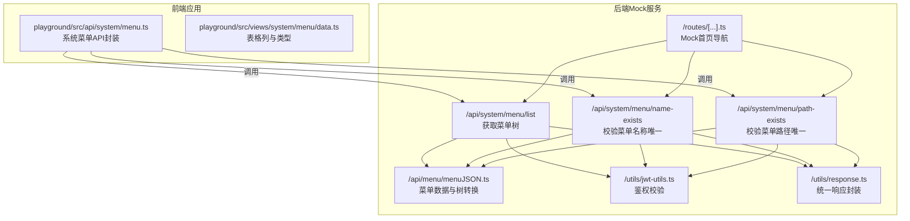
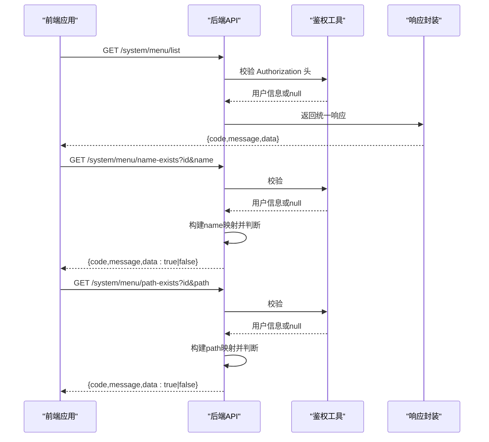
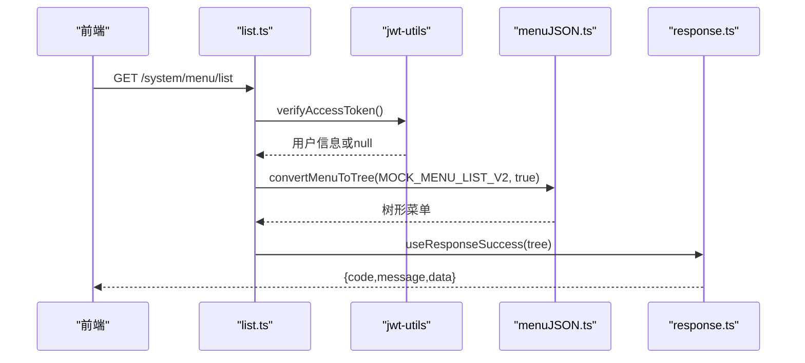
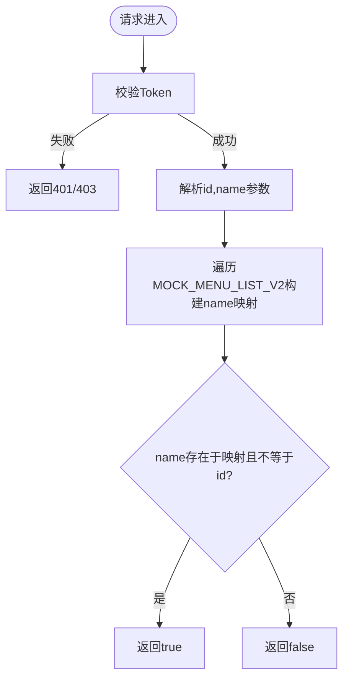
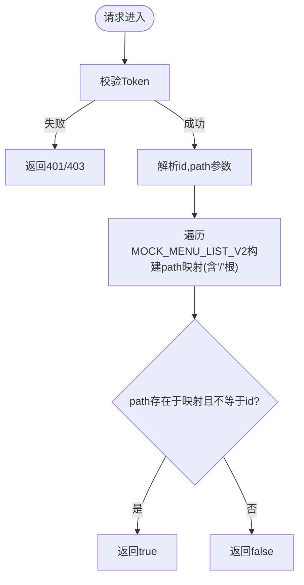
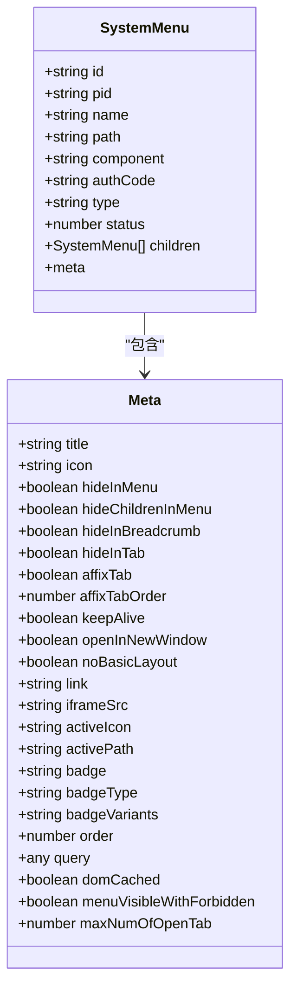
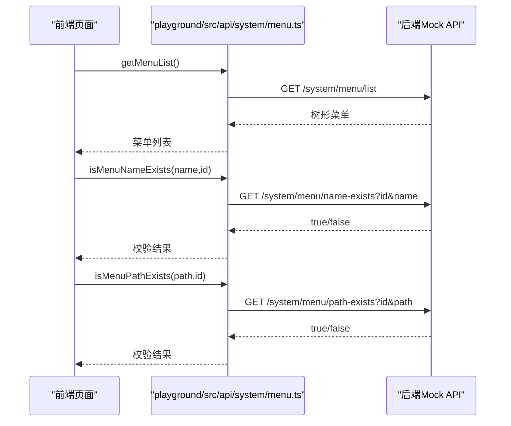
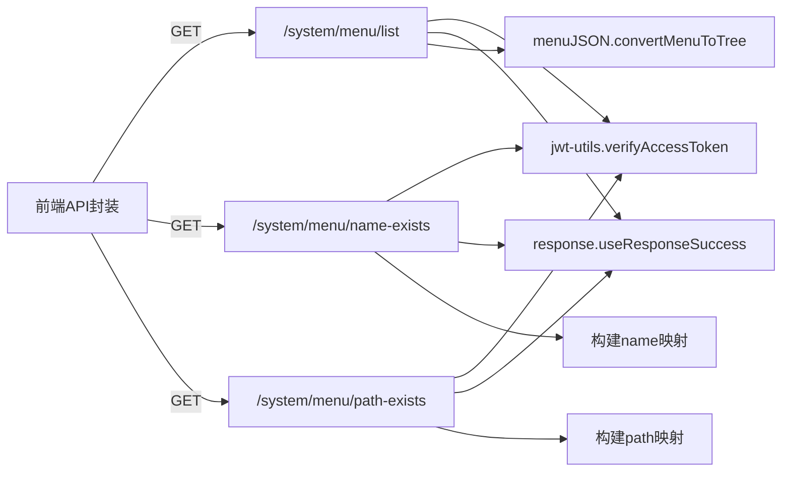

# 菜单管理API

<cite>
**本文引用的文件**
- [apps/backend-mock/api/system/menu/list.ts](file://apps/backend-mock/api/system/menu/list.ts)
- [apps/backend-mock/api/system/menu/name-exists.ts](file://apps/backend-mock/api/system/menu/name-exists.ts)
- [apps/backend-mock/api/system/menu/path-exists.ts](file://apps/backend-mock/api/system/menu/path-exists.ts)
- [apps/backend-mock/api/menu/menuJSON.ts](file://apps/backend-mock/api/menu/menuJSON.ts)
- [apps/backend-mock/utils/response.ts](file://apps/backend-mock/utils/response.ts)
- [apps/backend-mock/utils/jwt-utils.ts](file://apps/backend-mock/utils/jwt-utils.ts)
- [apps/backend-mock/routes/[...].ts](file://apps/backend-mock/routes/[...].ts)
- [playground/src/api/system/menu.ts](file://playground/src/api/system/menu.ts)
- [playground/src/views/system/menu/data.ts](file://playground/src/views/system/menu/data.ts)
</cite>

## 目录

1. [简介](#简介)
2. [项目结构](#项目结构)
3. [核心组件](#核心组件)
4. [架构总览](#架构总览)
5. [详细组件分析](#详细组件分析)
6. [依赖分析](#依赖分析)
7. [性能考虑](#性能考虑)
8. [故障排查指南](#故障排查指南)
9. [结论](#结论)
10. [附录](#附录)

## 简介

本文件为 Vben Admin 的菜单管理 API 提供完整的技术文档，覆盖菜单列表查询、名称与路径唯一性校验、以及菜单树形结构生成等能力。文档同时解释菜单数据模型、权限标识、路由配置、图标与徽标等属性，并给出请求参数、响应格式、状态码说明及常见问题排查建议。

## 项目结构

菜单管理相关代码主要分布在以下位置：

- 后端 Mock API：位于 apps/backend-mock/api/system/menu 与 apps/backend-mock/api/menu
- 前端系统菜单接口封装：位于 playground/src/api/system/menu.ts
- 前端菜单视图表格列定义与类型：位于 playground/src/views/system/menu/data.ts
- 公共工具：鉴权与响应封装位于 apps/backend-mock/utils 下

**图示来源**

- [apps/backend-mock/api/system/menu/list.ts:1-13](file://apps/backend-mock/api/system/menu/list.ts#L1-L13)
- [apps/backend-mock/api/system/menu/name-exists.ts:1-30](file://apps/backend-mock/api/system/menu/name-exists.ts#L1-L30)
- [apps/backend-mock/api/system/menu/path-exists.ts:1-30](file://apps/backend-mock/api/system/menu/path-exists.ts#L1-L30)
- [apps/backend-mock/api/menu/menuJSON.ts:1-426](file://apps/backend-mock/api/menu/menuJSON.ts#L1-L426)
- [apps/backend-mock/utils/jwt-utils.ts:1-115](file://apps/backend-mock/utils/jwt-utils.ts#L1-L115)
- [apps/backend-mock/utils/response.ts:1-71](file://apps/backend-mock/utils/response.ts#L1-L71)
- [apps/backend-mock/routes/[...].ts](file://apps/backend-mock/routes/[...].ts#L1-L16)
- [playground/src/api/system/menu.ts:1-159](file://playground/src/api/system/menu.ts#L1-L159)
- [playground/src/views/system/menu/data.ts:1-109](file://playground/src/views/system/menu/data.ts#L1-L109)

**章节来源**

- [apps/backend-mock/api/system/menu/list.ts:1-13](file://apps/backend-mock/api/system/menu/list.ts#L1-L13)
- [apps/backend-mock/api/system/menu/name-exists.ts:1-30](file://apps/backend-mock/api/system/menu/name-exists.ts#L1-L30)
- [apps/backend-mock/api/system/menu/path-exists.ts:1-30](file://apps/backend-mock/api/system/menu/path-exists.ts#L1-L30)
- [apps/backend-mock/api/menu/menuJSON.ts:1-426](file://apps/backend-mock/api/menu/menuJSON.ts#L1-L426)
- [apps/backend-mock/utils/response.ts:1-71](file://apps/backend-mock/utils/response.ts#L1-L71)
- [apps/backend-mock/utils/jwt-utils.ts:1-115](file://apps/backend-mock/utils/jwt-utils.ts#L1-L115)
- [apps/backend-mock/routes/[...].ts](file://apps/backend-mock/routes/[...].ts#L1-L16)
- [playground/src/api/system/menu.ts:1-159](file://playground/src/api/system/menu.ts#L1-L159)
- [playground/src/views/system/menu/data.ts:1-109](file://playground/src/views/system/menu/data.ts#L1-L109)

## 核心组件

- 菜单列表查询：返回树形结构菜单，支持过滤禁用项与可选是否包含按钮类型。
- 名称唯一性校验：基于内存映射检查菜单 name 是否重复（排除自身）。
- 路径唯一性校验：基于内存映射检查菜单 path 是否重复（排除自身）。
- 菜单数据模型：包含类型、图标、路由元信息、权限标识、可见性控制、缓存与标签页配置等。
- 鉴权与响应：统一使用 Bearer Token 鉴权，失败返回 401/403；成功返回统一结构体。

**章节来源**

- [apps/backend-mock/api/system/menu/list.ts:1-13](file://apps/backend-mock/api/system/menu/list.ts#L1-L13)
- [apps/backend-mock/api/system/menu/name-exists.ts:1-30](file://apps/backend-mock/api/system/menu/name-exists.ts#L1-L30)
- [apps/backend-mock/api/system/menu/path-exists.ts:1-30](file://apps/backend-mock/api/system/menu/path-exists.ts#L1-L30)
- [apps/backend-mock/api/menu/menuJSON.ts:341-426](file://apps/backend-mock/api/menu/menuJSON.ts#L341-L426)
- [apps/backend-mock/utils/response.ts:1-71](file://apps/backend-mock/utils/response.ts#L1-L71)
- [apps/backend-mock/utils/jwt-utils.ts:1-115](file://apps/backend-mock/utils/jwt-utils.ts#L1-L115)

## 架构总览

后端通过 H3 定义事件处理器，前端通过封装好的 API 方法发起请求。鉴权采用 JWT Bearer Token，响应统一为 { code, data, message, error } 结构。

**图示来源**

- [apps/backend-mock/api/system/menu/list.ts:1-13](file://apps/backend-mock/api/system/menu/list.ts#L1-L13)
- [apps/backend-mock/api/system/menu/name-exists.ts:1-30](file://apps/backend-mock/api/system/menu/name-exists.ts#L1-L30)
- [apps/backend-mock/api/system/menu/path-exists.ts:1-30](file://apps/backend-mock/api/system/menu/path-exists.ts#L1-L30)
- [apps/backend-mock/utils/jwt-utils.ts:1-115](file://apps/backend-mock/utils/jwt-utils.ts#L1-L115)
- [apps/backend-mock/utils/response.ts:1-71](file://apps/backend-mock/utils/response.ts#L1-L71)

## 详细组件分析

### 菜单列表查询

- 端点：GET /system/menu/list
- 功能：返回树形结构菜单，支持过滤禁用项与可选是否包含按钮类型。
- 请求参数：无
- 响应数据：树形菜单数组
- 状态码：200 成功；401 未授权；403 禁止访问
- 鉴权：需要 Bearer Token
- 数据来源：MOCK_MENU_LIST_V2 并转换为树结构

**图示来源**

- [apps/backend-mock/api/system/menu/list.ts:1-13](file://apps/backend-mock/api/system/menu/list.ts#L1-L13)
- [apps/backend-mock/api/menu/menuJSON.ts:341-426](file://apps/backend-mock/api/menu/menuJSON.ts#L341-L426)
- [apps/backend-mock/utils/jwt-utils.ts:1-115](file://apps/backend-mock/utils/jwt-utils.ts#L1-L115)
- [apps/backend-mock/utils/response.ts:1-71](file://apps/backend-mock/utils/response.ts#L1-L71)

**章节来源**

- [apps/backend-mock/api/system/menu/list.ts:1-13](file://apps/backend-mock/api/system/menu/list.ts#L1-L13)
- [apps/backend-mock/api/menu/menuJSON.ts:341-426](file://apps/backend-mock/api/menu/menuJSON.ts#L341-L426)
- [apps/backend-mock/utils/response.ts:1-71](file://apps/backend-mock/utils/response.ts#L1-L71)
- [apps/backend-mock/utils/jwt-utils.ts:1-115](file://apps/backend-mock/utils/jwt-utils.ts#L1-L115)

### 名称唯一性校验

- 端点：GET /system/menu/name-exists
- 功能：校验菜单名称是否已存在（排除当前编辑项）
- 请求参数：
  - id: string（可选，当前菜单ID）
  - name: string（必填）
- 响应数据：true/false
- 状态码：200 成功；401 未授权；403 禁止访问
- 鉴权：需要 Bearer Token
- 实现要点：预构建 name -> id 映射，支持排除自身

**图示来源**

- [apps/backend-mock/api/system/menu/name-exists.ts:1-30](file://apps/backend-mock/api/system/menu/name-exists.ts#L1-L30)
- [apps/backend-mock/api/menu/menuJSON.ts:1-426](file://apps/backend-mock/api/menu/menuJSON.ts#L1-L426)
- [apps/backend-mock/utils/jwt-utils.ts:1-115](file://apps/backend-mock/utils/jwt-utils.ts#L1-L115)
- [apps/backend-mock/utils/response.ts:1-71](file://apps/backend-mock/utils/response.ts#L1-L71)

**章节来源**

- [apps/backend-mock/api/system/menu/name-exists.ts:1-30](file://apps/backend-mock/api/system/menu/name-exists.ts#L1-L30)
- [apps/backend-mock/api/menu/menuJSON.ts:1-426](file://apps/backend-mock/api/menu/menuJSON.ts#L1-L426)
- [apps/backend-mock/utils/response.ts:1-71](file://apps/backend-mock/utils/response.ts#L1-L71)
- [apps/backend-mock/utils/jwt-utils.ts:1-115](file://apps/backend-mock/utils/jwt-utils.ts#L1-L115)

### 路径唯一性校验

- 端点：GET /system/menu/path-exists
- 功能：校验菜单路径是否已存在（排除当前编辑项）
- 请求参数：
  - id: string（可选，当前菜单ID）
  - path: string（必填）
- 响应数据：true/false
- 状态码：200 成功；401 未授权；403 禁止访问
- 鉴权：需要 Bearer Token
- 实现要点：预构建 path -> id 映射，内置根路径“/”，支持排除自身

**图示来源**

- [apps/backend-mock/api/system/menu/path-exists.ts:1-30](file://apps/backend-mock/api/system/menu/path-exists.ts#L1-L30)
- [apps/backend-mock/api/menu/menuJSON.ts:1-426](file://apps/backend-mock/api/menu/menuJSON.ts#L1-L426)
- [apps/backend-mock/utils/jwt-utils.ts:1-115](file://apps/backend-mock/utils/jwt-utils.ts#L1-L115)
- [apps/backend-mock/utils/response.ts:1-71](file://apps/backend-mock/utils/response.ts#L1-L71)

**章节来源**

- [apps/backend-mock/api/system/menu/path-exists.ts:1-30](file://apps/backend-mock/api/system/menu/path-exists.ts#L1-L30)
- [apps/backend-mock/api/menu/menuJSON.ts:1-426](file://apps/backend-mock/api/menu/menuJSON.ts#L1-L426)
- [apps/backend-mock/utils/response.ts:1-71](file://apps/backend-mock/utils/response.ts#L1-L71)
- [apps/backend-mock/utils/jwt-utils.ts:1-115](file://apps/backend-mock/utils/jwt-utils.ts#L1-L115)

### 菜单数据模型与树形结构

- 数据模型关键字段（节选）：
  - id: string（主键）
  - pid: string（父级ID）
  - type: 枚举（catalog/menu/embedded/link/button）
  - name: string（菜单名称）
  - path: string（路由路径）
  - component: string（组件路径，部分类型适用）
  - authCode: string（后端权限标识）
  - meta: 对象（图标、标签页、缓存、可见性、徽标等）
  - status: number（状态，0表示禁用）
  - children: SystemMenu[]（子节点）
- 树形转换逻辑：
  - 过滤 status=0 的项
  - 可选过滤 type=button 的项
  - 依据 pid 构建父子关系
  - 返回根节点集合

**图示来源**

- [apps/backend-mock/api/menu/menuJSON.ts:24-91](file://apps/backend-mock/api/menu/menuJSON.ts#L24-L91)
- [apps/backend-mock/api/menu/menuJSON.ts:341-426](file://apps/backend-mock/api/menu/menuJSON.ts#L341-L426)

**章节来源**

- [apps/backend-mock/api/menu/menuJSON.ts:24-91](file://apps/backend-mock/api/menu/menuJSON.ts#L24-L91)
- [apps/backend-mock/api/menu/menuJSON.ts:341-426](file://apps/backend-mock/api/menu/menuJSON.ts#L341-L426)

### 前端API封装与表格列定义

- 前端封装了菜单列表、名称/路径唯一性校验、创建、更新、删除等方法，统一通过 requestClient 发起请求。
- 表格列定义展示了菜单类型、权限标识、路径、组件、状态与操作列等字段。

**图示来源**

- [playground/src/api/system/menu.ts:96-118](file://playground/src/api/system/menu.ts#L96-L118)
- [apps/backend-mock/api/system/menu/list.ts:1-13](file://apps/backend-mock/api/system/menu/list.ts#L1-L13)
- [apps/backend-mock/api/system/menu/name-exists.ts:1-30](file://apps/backend-mock/api/system/menu/name-exists.ts#L1-L30)
- [apps/backend-mock/api/system/menu/path-exists.ts:1-30](file://apps/backend-mock/api/system/menu/path-exists.ts#L1-L30)

**章节来源**

- [playground/src/api/system/menu.ts:1-159](file://playground/src/api/system/menu.ts#L1-L159)
- [playground/src/views/system/menu/data.ts:1-109](file://playground/src/views/system/menu/data.ts#L1-L109)

## 依赖分析

- 后端 API 依赖：
  - 鉴权：verifyAccessToken 从 Authorization 头解析 Bearer Token
  - 响应：统一 useResponseSuccess/useResponseError
  - 数据：MOCK_MENU_LIST_V2 与 convertMenuToTree
- 前端依赖：
  - requestClient：统一请求客户端
  - 类型 SystemMenuApi.SystemMenu：约束菜单数据结构

**图示来源**

- [playground/src/api/system/menu.ts:96-118](file://playground/src/api/system/menu.ts#L96-L118)
- [apps/backend-mock/api/system/menu/list.ts:1-13](file://apps/backend-mock/api/system/menu/list.ts#L1-L13)
- [apps/backend-mock/api/system/menu/name-exists.ts:1-30](file://apps/backend-mock/api/system/menu/name-exists.ts#L1-L30)
- [apps/backend-mock/api/system/menu/path-exists.ts:1-30](file://apps/backend-mock/api/system/menu/path-exists.ts#L1-L30)
- [apps/backend-mock/utils/jwt-utils.ts:1-115](file://apps/backend-mock/utils/jwt-utils.ts#L1-L115)
- [apps/backend-mock/utils/response.ts:1-71](file://apps/backend-mock/utils/response.ts#L1-L71)
- [apps/backend-mock/api/menu/menuJSON.ts:341-426](file://apps/backend-mock/api/menu/menuJSON.ts#L341-L426)

**章节来源**

- [playground/src/api/system/menu.ts:96-118](file://playground/src/api/system/menu.ts#L96-L118)
- [apps/backend-mock/api/system/menu/list.ts:1-13](file://apps/backend-mock/api/system/menu/list.ts#L1-L13)
- [apps/backend-mock/api/system/menu/name-exists.ts:1-30](file://apps/backend-mock/api/system/menu/name-exists.ts#L1-L30)
- [apps/backend-mock/api/system/menu/path-exists.ts:1-30](file://apps/backend-mock/api/system/menu/path-exists.ts#L1-L30)
- [apps/backend-mock/utils/jwt-utils.ts:1-115](file://apps/backend-mock/utils/jwt-utils.ts#L1-L115)
- [apps/backend-mock/utils/response.ts:1-71](file://apps/backend-mock/utils/response.ts#L1-L71)
- [apps/backend-mock/api/menu/menuJSON.ts:341-426](file://apps/backend-mock/api/menu/menuJSON.ts#L341-L426)

## 性能考虑

- 内存映射校验：名称与路径校验通过预构建映射实现 O(1) 查询，整体遍历一次构造映射，时间复杂度 O(n)，空间复杂度 O(n)。
- 树形转换：一次线性扫描构建 id->item 映射，再一次扫描建立父子关系，时间复杂度 O(n)，空间复杂度 O(n)。
- 建议：
  - 在生产环境建议将菜单数据持久化并引入数据库索引（name、path、pid），避免全量遍历。
  - 对于大型菜单树，前端可考虑分页或懒加载策略（当前 Mock 未实现）。

[本节为通用性能讨论，不直接分析具体文件]

## 故障排查指南

- 401 未授权
  - 现象：返回统一错误结构，message 为“Unauthorized Exception”
  - 排查：确认请求头 Authorization 是否为 Bearer Token，Token 是否有效
- 403 禁止访问
  - 现象：返回统一错误结构，message 为“Forbidden Exception”
  - 排查：确认用户是否有访问该资源的权限
- 名称/路径重复
  - 现象：name-exists 或 path-exists 返回 true
  - 排查：修改 name 或 path，或在参数中传入当前项 id 以排除自身

**章节来源**

- [apps/backend-mock/utils/response.ts:44-55](file://apps/backend-mock/utils/response.ts#L44-L55)
- [apps/backend-mock/utils/jwt-utils.ts:27-56](file://apps/backend-mock/utils/jwt-utils.ts#L27-L56)
- [apps/backend-mock/api/system/menu/name-exists.ts:23-29](file://apps/backend-mock/api/system/menu/name-exists.ts#L23-L29)
- [apps/backend-mock/api/system/menu/path-exists.ts:23-29](file://apps/backend-mock/api/system/menu/path-exists.ts#L23-L29)

## 结论

本文档梳理了 Vben Admin 菜单管理 API 的端点、数据模型与实现细节，明确了树形结构生成、唯一性校验、鉴权与响应规范。对于复杂菜单层级与权限标识，建议在生产环境中引入数据库与权限中心，结合前端动态路由与菜单缓存策略，提升性能与安全性。

[本节为总结性内容，不直接分析具体文件]

## 附录

### API 端点一览

- GET /system/menu/list
  - 功能：获取菜单树
  - 认证：Bearer Token
  - 响应：树形菜单数组
- GET /system/menu/name-exists
  - 功能：校验菜单名称唯一
  - 参数：id（可选）、name（必填）
  - 响应：true/false
- GET /system/menu/path-exists
  - 功能：校验菜单路径唯一
  - 参数：id（可选）、path（必填）
  - 响应：true/false

**章节来源**

- [apps/backend-mock/api/system/menu/list.ts:1-13](file://apps/backend-mock/api/system/menu/list.ts#L1-L13)
- [apps/backend-mock/api/system/menu/name-exists.ts:1-30](file://apps/backend-mock/api/system/menu/name-exists.ts#L1-L30)
- [apps/backend-mock/api/system/menu/path-exists.ts:1-30](file://apps/backend-mock/api/system/menu/path-exists.ts#L1-L30)

### 响应结构

- 成功：{ code: 0, message: "ok", data: any }
- 失败：{ code: -1, message: string, error: any, data: null }
- 401：{ code: -1, message: "Unauthorized Exception", error: "Unauthorized Exception", data: null }
- 403：{ code: -1, message: "Forbidden Exception", error: "Forbidden Exception", data: null }

**章节来源**

- [apps/backend-mock/utils/response.ts:5-55](file://apps/backend-mock/utils/response.ts#L5-L55)

### 菜单类型与元信息

- 类型枚举：catalog、menu、embedded、link、button
- 元信息字段（节选）：title、icon、hideInMenu、hideChildrenInMenu、hideInBreadcrumb、hideInTab、affixTab、keepAlive、openInNewWindow、noBasicLayout、link、iframeSrc、activeIcon、activePath、badge、badgeType、badgeVariants、order、query、domCached、menuVisibleWithForbidden、maxNumOfOpenTab

**章节来源**

- [apps/backend-mock/api/menu/menuJSON.ts:16-91](file://apps/backend-mock/api/menu/menuJSON.ts#L16-L91)

### Mock 首页导航

- Mock 服务首页提供常用 API 导航，包括菜单相关端点

**章节来源**

- [apps/backend-mock/routes/[...].ts](file://apps/backend-mock/routes/[...].ts#L1-L16)
