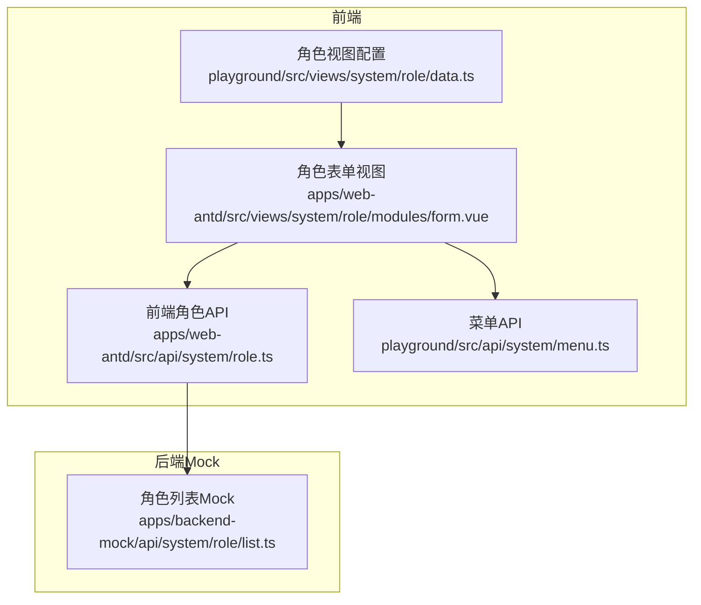
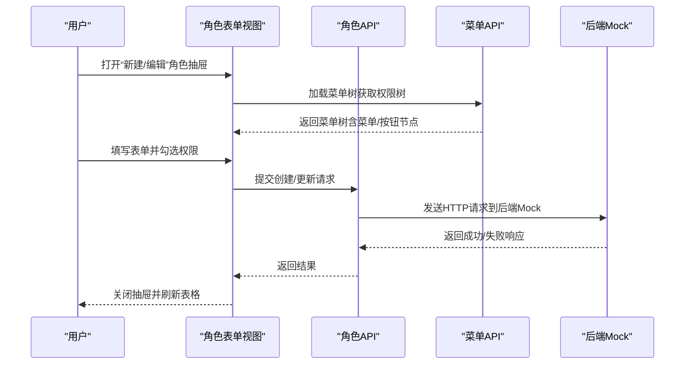
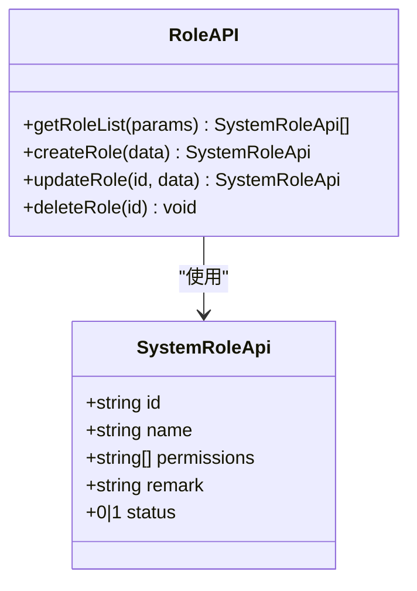
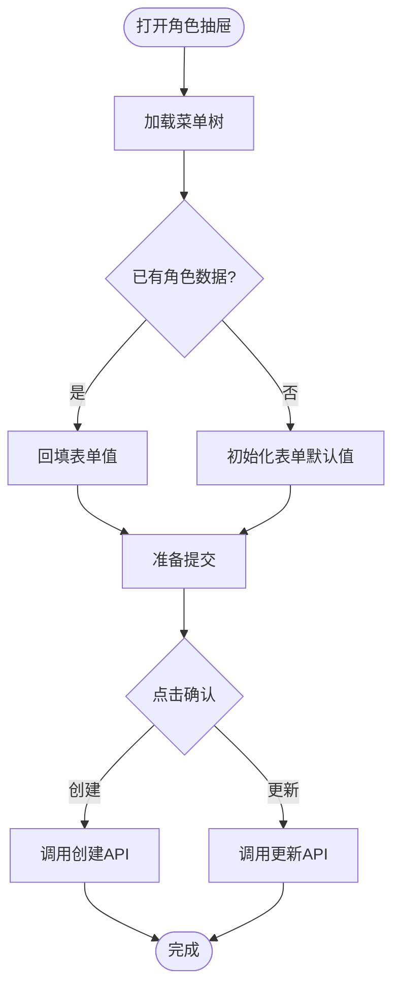
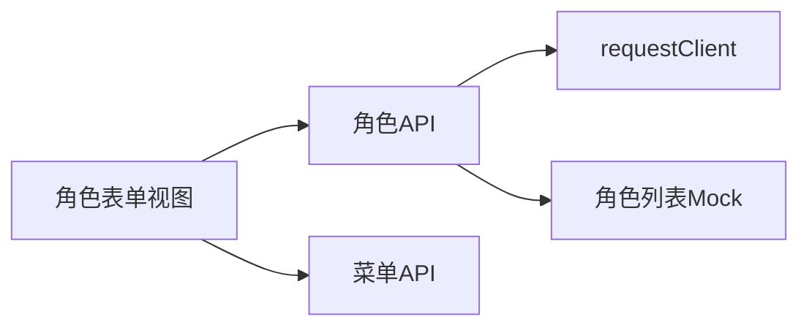

# 角色管理API

<cite>
**本文引用的文件**
- [apps/web-antd/src/api/system/role.ts](file://apps/web-antd/src/api/system/role.ts)
- [playground/src/api/system/role.ts](file://playground/src/api/system/role.ts)
- [apps/web-antd/src/views/system/role/modules/form.vue](file://apps/web-antd/src/views/system/role/modules/form.vue)
- [playground/src/views/system/role/modules/form.vue](file://playground/src/views/system/role/modules/form.vue)
- [playground/src/views/system/role/data.ts](file://playground/src/views/system/role/data.ts)
- [playground/src/api/system/menu.ts](file://playground/src/api/system/menu.ts)
- [apps/backend-mock/api/system/role/list.ts](file://apps/backend-mock/api/system/role/list.ts)
</cite>

## 目录

1. [简介](#简介)
2. [项目结构](#项目结构)
3. [核心组件](#核心组件)
4. [架构总览](#架构总览)
5. [详细组件分析](#详细组件分析)
6. [依赖分析](#依赖分析)
7. [性能考虑](#性能考虑)
8. [故障排查指南](#故障排查指南)
9. [结论](#结论)
10. [附录](#附录)

## 简介

本文件面向Vben Admin的角色管理模块，提供系统化的API文档与实现解析，覆盖角色的增删改查（CRUD）、角色权限分配、角色与菜单/按钮权限的关联关系、角色状态管理、权限缓存与权限验证机制等。文档以代码为依据，结合前端表单、表格与Mock后端，帮助开发者快速理解并正确使用角色管理API。

## 项目结构

角色管理涉及以下关键文件：

- 前端API封装：apps/web-antd/src/api/system/role.ts 与 playground/src/api/system/role.ts
- 角色表单与表格视图：apps/web-antd/src/views/system/role/modules/form.vue、playground/src/views/system/role/modules/form.vue、playground/src/views/system/role/data.ts
- 菜单权限API：playground/src/api/system/menu.ts
- Mock后端角色列表：apps/backend-mock/api/system/role/list.ts

图表来源

- [apps/web-antd/src/api/system/role.ts:1-56](file://apps/web-antd/src/api/system/role.ts#L1-L56)
- [apps/web-antd/src/views/system/role/modules/form.vue:1-137](file://apps/web-antd/src/views/system/role/modules/form.vue#L1-L137)
- [playground/src/views/system/role/data.ts:1-128](file://playground/src/views/system/role/data.ts#L1-L128)
- [playground/src/api/system/menu.ts:1-159](file://playground/src/api/system/menu.ts#L1-L159)
- [apps/backend-mock/api/system/role/list.ts:1-118](file://apps/backend-mock/api/system/role/list.ts#L1-L118)

章节来源

- [apps/web-antd/src/api/system/role.ts:1-56](file://apps/web-antd/src/api/system/role.ts#L1-L56)
- [playground/src/api/system/role.ts:1-56](file://playground/src/api/system/role.ts#L1-L56)
- [apps/web-antd/src/views/system/role/modules/form.vue:1-137](file://apps/web-antd/src/views/system/role/modules/form.vue#L1-L137)
- [playground/src/views/system/role/modules/form.vue:1-138](file://playground/src/views/system/role/modules/form.vue#L1-L138)
- [playground/src/views/system/role/data.ts:1-128](file://playground/src/views/system/role/data.ts#L1-L128)
- [playground/src/api/system/menu.ts:1-159](file://playground/src/api/system/menu.ts#L1-L159)
- [apps/backend-mock/api/system/role/list.ts:1-118](file://apps/backend-mock/api/system/role/list.ts#L1-L118)

## 核心组件

- 角色API封装：提供角色列表查询、创建、更新、删除四个核心方法；返回类型统一为SystemRole接口数组或单个对象。
- 角色表单视图：集成菜单树选择器，支持多选权限节点（菜单/按钮），提交时调用对应API。
- 角色视图配置：定义表单字段、表格列与筛选条件schema。
- 菜单API：提供菜单列表获取能力，用于构建权限树。
- Mock后端：提供角色列表分页与过滤能力，返回包含权限ID数组的结构。

章节来源

- [apps/web-antd/src/api/system/role.ts:5-56](file://apps/web-antd/src/api/system/role.ts#L5-L56)
- [playground/src/api/system/role.ts:5-56](file://playground/src/api/system/role.ts#L5-L56)
- [apps/web-antd/src/views/system/role/modules/form.vue:1-137](file://apps/web-antd/src/views/system/role/modules/form.vue#L1-L137)
- [playground/src/views/system/role/modules/form.vue:1-138](file://playground/src/views/system/role/modules/form.vue#L1-L138)
- [playground/src/views/system/role/data.ts:7-128](file://playground/src/views/system/role/data.ts#L7-L128)
- [playground/src/api/system/menu.ts:96-100](file://playground/src/api/system/menu.ts#L96-L100)
- [apps/backend-mock/api/system/role/list.ts:75-118](file://apps/backend-mock/api/system/role/list.ts#L75-L118)

## 架构总览

角色管理的典型调用流程如下：

图表来源

- [apps/web-antd/src/views/system/role/modules/form.vue:33-47](file://apps/web-antd/src/views/system/role/modules/form.vue#L33-L47)
- [playground/src/api/system/menu.ts:96-100](file://playground/src/api/system/menu.ts#L96-L100)
- [apps/backend-mock/api/system/role/list.ts:75-118](file://apps/backend-mock/api/system/role/list.ts#L75-L118)

## 详细组件分析

### 角色API接口定义与行为

- 接口命名空间：SystemRoleApi
- 数据模型：SystemRole/SystemRoleFace（包含id、name、permissions、remark、status等字段）
- 方法：
  - getRoleList(params)：分页查询角色列表，支持按name/id/remark/status等条件过滤
  - createRole(data)：创建角色，data不包含id
  - updateRole(id, data)：更新角色，data不包含id
  - deleteRole(id)：删除角色

图表来源

- [apps/web-antd/src/api/system/role.ts:5-14](file://apps/web-antd/src/api/system/role.ts#L5-L14)
- [playground/src/api/system/role.ts:5-14](file://playground/src/api/system/role.ts#L5-L14)

章节来源

- [apps/web-antd/src/api/system/role.ts:16-56](file://apps/web-antd/src/api/system/role.ts#L16-L56)
- [playground/src/api/system/role.ts:16-56](file://playground/src/api/system/role.ts#L16-L56)

### 角色表单与权限树

- 表单schema：包含角色名、状态（启用/禁用）、备注、权限树（菜单/按钮）等字段
- 权限树加载：首次打开抽屉时异步拉取菜单树，用于勾选权限
- 提交流程：校验表单后，根据是否存在id决定创建或更新

图表来源

- [apps/web-antd/src/views/system/role/modules/form.vue:33-47](file://apps/web-antd/src/views/system/role/modules/form.vue#L33-L47)
- [playground/src/views/system/role/modules/form.vue:33-49](file://playground/src/views/system/role/modules/form.vue#L33-L49)
- [playground/src/api/system/menu.ts:96-100](file://playground/src/api/system/menu.ts#L96-L100)

章节来源

- [apps/web-antd/src/views/system/role/modules/form.vue:1-137](file://apps/web-antd/src/views/system/role/modules/form.vue#L1-L137)
- [playground/src/views/system/role/modules/form.vue:1-138](file://playground/src/views/system/role/modules/form.vue#L1-L138)
- [playground/src/views/system/role/data.ts:7-42](file://playground/src/views/system/role/data.ts#L7-L42)

### 角色列表与表格

- 列表schema：支持按角色名、ID、状态、备注、创建时间范围进行筛选
- 表格列：角色名、ID、状态、备注、创建时间、操作列（编辑/删除）

章节来源

- [playground/src/views/system/role/data.ts:44-128](file://playground/src/views/system/role/data.ts#L44-L128)

### Mock后端角色列表

- 支持分页与多条件过滤：name、id、remark、startDate、endDate、status
- 返回结构：包含角色数组与分页信息
- 权限字段：permissions为菜单/按钮的ID数组，用于表示角色拥有的权限集合

章节来源

- [apps/backend-mock/api/system/role/list.ts:75-118](file://apps/backend-mock/api/system/role/list.ts#L75-L118)

## 依赖分析

- 角色API依赖requestClient发起HTTP请求
- 角色表单依赖菜单API获取权限树
- 角色列表依赖Mock后端返回数据

图表来源

- [apps/web-antd/src/api/system/role.ts:3-5](file://apps/web-antd/src/api/system/role.ts#L3-L5)
- [playground/src/api/system/role.ts:3-5](file://playground/src/api/system/role.ts#L3-L5)
- [apps/web-antd/src/views/system/role/modules/form.vue:14-18](file://apps/web-antd/src/views/system/role/modules/form.vue#L14-L18)
- [playground/src/api/system/menu.ts:3-5](file://playground/src/api/system/menu.ts#L3-L5)
- [apps/backend-mock/api/system/role/list.ts:1-6](file://apps/backend-mock/api/system/role/list.ts#L1-L6)

章节来源

- [apps/web-antd/src/api/system/role.ts:1-56](file://apps/web-antd/src/api/system/role.ts#L1-L56)
- [playground/src/api/system/role.ts:1-56](file://playground/src/api/system/role.ts#L1-L56)
- [apps/web-antd/src/views/system/role/modules/form.vue:1-137](file://apps/web-antd/src/views/system/role/modules/form.vue#L1-L137)
- [playground/src/api/system/menu.ts:1-159](file://playground/src/api/system/menu.ts#L1-L159)
- [apps/backend-mock/api/system/role/list.ts:1-118](file://apps/backend-mock/api/system/role/list.ts#L1-L118)

## 性能考虑

- 权限树懒加载：仅在打开抽屉时加载菜单树，避免不必要的网络请求
- 表单提交加锁：提交过程中锁定抽屉，防止重复提交
- 分页查询：角色列表支持分页与多条件过滤，减少一次性传输数据量

章节来源

- [apps/web-antd/src/views/system/role/modules/form.vue:33-47](file://apps/web-antd/src/views/system/role/modules/form.vue#L33-L47)
- [playground/src/views/system/role/modules/form.vue:33-49](file://playground/src/views/system/role/modules/form.vue#L33-L49)
- [apps/backend-mock/api/system/role/list.ts:81-116](file://apps/backend-mock/api/system/role/list.ts#L81-L116)

## 故障排查指南

- 未授权访问：Mock后端对请求进行鉴权校验，若无有效令牌将返回未授权响应
- 表单校验失败：提交前需通过表单校验，否则阻止提交
- 提交异常：提交过程捕获异常并解锁抽屉，便于用户重试

章节来源

- [apps/backend-mock/api/system/role/list.ts:75-79](file://apps/backend-mock/api/system/role/list.ts#L75-L79)
- [apps/web-antd/src/views/system/role/modules/form.vue:33-47](file://apps/web-antd/src/views/system/role/modules/form.vue#L33-L47)
- [playground/src/views/system/role/modules/form.vue:33-49](file://playground/src/views/system/role/modules/form.vue#L33-L49)

## 结论

Vben Admin的角色管理API以清晰的接口与视图组件配合Mock后端，实现了角色的完整生命周期管理。通过菜单树选择权限，结合分页与多条件查询，满足后台管理场景下的角色与权限治理需求。建议在生产环境中替换为真实后端服务，并完善权限缓存与鉴权策略。

## 附录

### API定义与参数说明

- 获取角色列表
  - 方法：GET
  - 路径：/system/role/list
  - 查询参数：page、pageSize、name、id、remark、startDate、endDate、status
  - 响应：分页角色数据（包含id、name、permissions、remark、status等字段）
- 创建角色
  - 方法：POST
  - 路径：/system/role
  - 请求体：除id外的角色字段
  - 响应：创建后的角色对象
- 更新角色
  - 方法：PUT
  - 路径：/system/role/{id}
  - 路径参数：id（角色ID）
  - 请求体：除id外的角色字段
  - 响应：更新后的角色对象
- 删除角色
  - 方法：DELETE
  - 路径：/system/role/{id}
  - 路径参数：id（角色ID）
  - 响应：无（或成功状态）

章节来源

- [apps/web-antd/src/api/system/role.ts:16-56](file://apps/web-antd/src/api/system/role.ts#L16-L56)
- [playground/src/api/system/role.ts:16-56](file://playground/src/api/system/role.ts#L16-L56)
- [apps/backend-mock/api/system/role/list.ts:75-118](file://apps/backend-mock/api/system/role/list.ts#L75-L118)

### 角色数据模型与权限矩阵示例

- 角色数据模型字段
  - id：角色唯一标识
  - name：角色名称
  - permissions：权限ID数组（菜单/按钮）
  - remark：备注
  - status：状态（0=禁用，1=启用）
- 权限矩阵示例（来源于Mock数据）
  - SuperAdmin：拥有全部菜单/按钮权限
  - Admin：拥有工作台、开发管理、系统管理等模块权限
  - user：拥有工作台、开发管理、流程管理等模块权限

章节来源

- [apps/backend-mock/api/system/role/list.ts:7-73](file://apps/backend-mock/api/system/role/list.ts#L7-L73)

### 角色权限缓存与权限验证机制

- 权限缓存：前端在首次加载菜单树后缓存权限树，后续打开表单时直接使用
- 权限验证：Mock后端在角色列表接口中对请求进行鉴权校验，确保只有合法请求可访问

章节来源

- [apps/web-antd/src/views/system/role/modules/form.vue:67-75](file://apps/web-antd/src/views/system/role/modules/form.vue#L67-L75)
- [playground/src/views/system/role/modules/form.vue:75-83](file://playground/src/views/system/role/modules/form.vue#L75-L83)
- [apps/backend-mock/api/system/role/list.ts:75-79](file://apps/backend-mock/api/system/role/list.ts#L75-L79)
