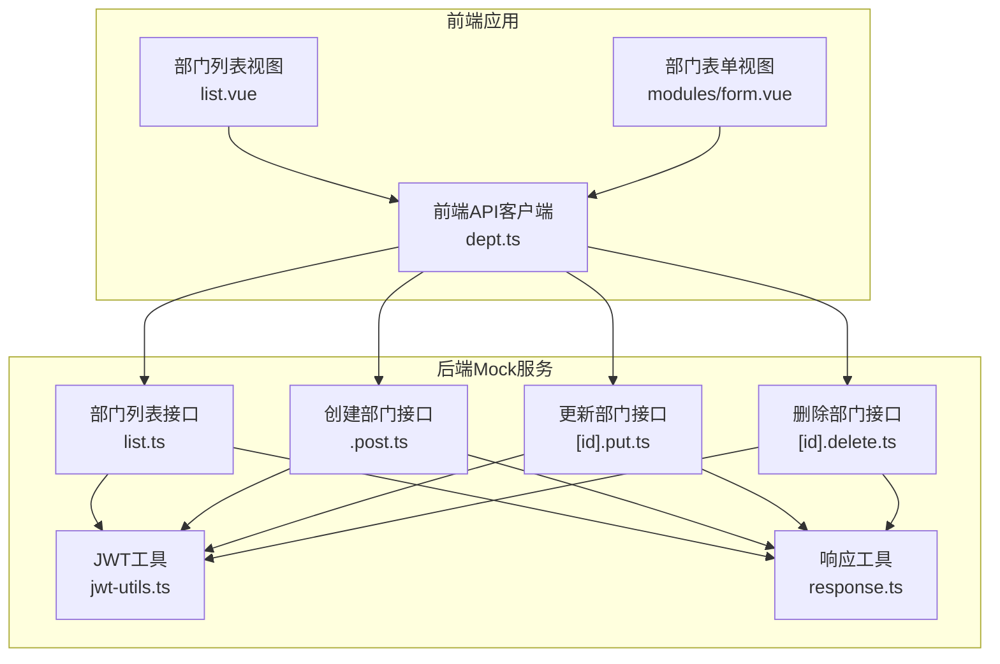
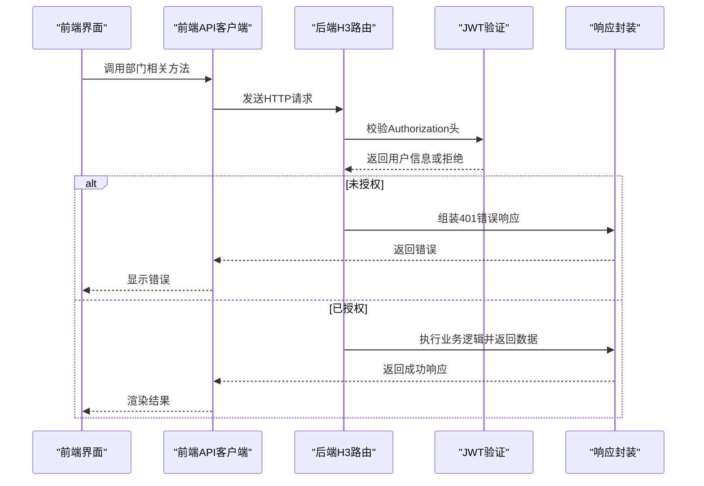
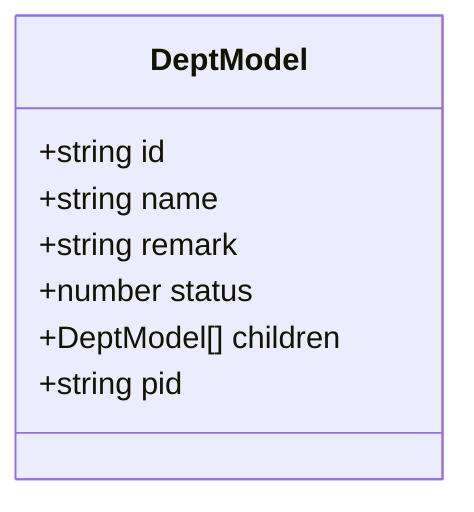
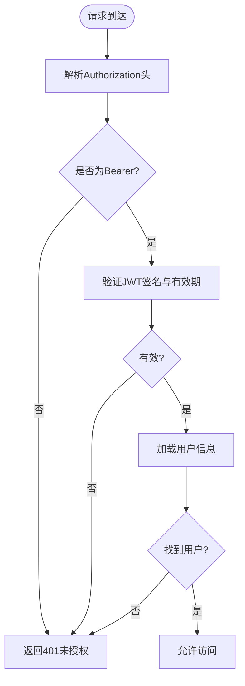
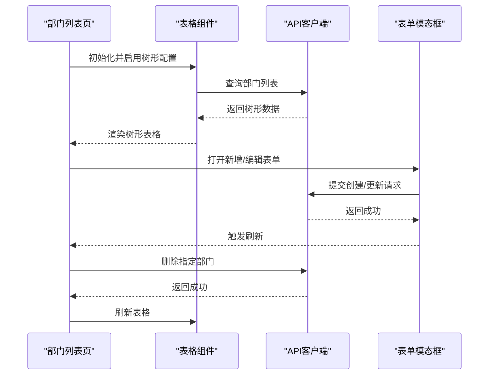
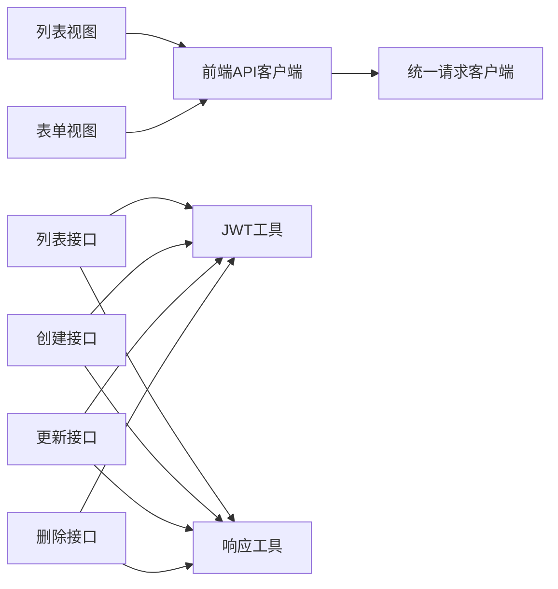

# 部门管理API

<cite>
**本文档引用的文件**
- [apps/backend-mock/api/system/dept/.post.ts](file://apps/backend-mock/api/system/dept/.post.ts)
- [apps/backend-mock/api/system/dept/[id].delete.ts](file://apps/backend-mock/api/system/dept/[id].delete.ts)
- [apps/backend-mock/api/system/dept/[id].put.ts](file://apps/backend-mock/api/system/dept/[id].put.ts)
- [apps/backend-mock/api/system/dept/list.ts](file://apps/backend-mock/api/system/dept/list.ts)
- [apps/backend-mock/utils/response.ts](file://apps/backend-mock/utils/response.ts)
- [apps/backend-mock/utils/jwt-utils.ts](file://apps/backend-mock/utils/jwt-utils.ts)
- [apps/web-antd/src/api/system/dept.ts](file://apps/web-antd/src/api/system/dept.ts)
- [playground/src/api/system/dept.ts](file://playground/src/api/system/dept.ts)
- [apps/web-antd/src/views/system/dept/list.vue](file://apps/web-antd/src/views/system/dept/list.vue)
- [apps/web-antd/src/views/system/dept/modules/form.vue](file://apps/web-antd/src/views/system/dept/modules/form.vue)
- [playground/src/views/system/dept/list.vue](file://playground/src/views/system/dept/list.vue)
- [playground/src/views/system/dept/modules/form.vue](file://playground/src/views/system/dept/modules/form.vue)
</cite>

## 目录

1. [简介](#简介)
2. [项目结构](#项目结构)
3. [核心组件](#核心组件)
4. [架构总览](#架构总览)
5. [详细组件分析](#详细组件分析)
6. [依赖分析](#依赖分析)
7. [性能考虑](#性能考虑)
8. [故障排除指南](#故障排除指南)
9. [结论](#结论)
10. [附录](#附录)

## 简介

本文件为 Vben Admin 的部门管理 API 提供完整的技术文档，覆盖后端 Mock API 的端点定义与前端调用方式，重点说明部门树形结构的数据模型、父子关系、状态管理与权限校验流程，并给出最佳实践与一致性保障建议。

## 项目结构

部门管理相关代码分布在以下位置：

- 后端 Mock API：apps/backend-mock/api/system/dept/
- 前端 API 客户端：apps/web-antd/src/api/system/dept.ts 与 playground/src/api/system/dept.ts
- 前端视图与表单：apps/web-antd/src/views/system/dept/_ 与 playground/src/views/system/dept/_

图表来源

- [apps/web-antd/src/api/system/dept.ts:1-53](file://apps/web-antd/src/api/system/dept.ts#L1-L53)
- [playground/src/api/system/dept.ts:1-55](file://playground/src/api/system/dept.ts#L1-L55)
- [apps/backend-mock/api/system/dept/list.ts:1-62](file://apps/backend-mock/api/system/dept/list.ts#L1-L62)
- [apps/backend-mock/api/system/dept/.post.ts:1-17](file://apps/backend-mock/api/system/dept/.post.ts#L1-L17)
- [apps/backend-mock/api/system/dept/[id].put.ts](file://apps/backend-mock/api/system/dept/[id].put.ts#L1-L17)
- [apps/backend-mock/api/system/dept/[id].delete.ts](file://apps/backend-mock/api/system/dept/[id].delete.ts#L1-L17)
- [apps/backend-mock/utils/jwt-utils.ts:1-115](file://apps/backend-mock/utils/jwt-utils.ts#L1-L115)
- [apps/backend-mock/utils/response.ts:1-71](file://apps/backend-mock/utils/response.ts#L1-L71)

章节来源

- [apps/web-antd/src/api/system/dept.ts:1-53](file://apps/web-antd/src/api/system/dept.ts#L1-L53)
- [playground/src/api/system/dept.ts:1-55](file://playground/src/api/system/dept.ts#L1-L55)
- [apps/backend-mock/api/system/dept/list.ts:1-62](file://apps/backend-mock/api/system/dept/list.ts#L1-L62)
- [apps/backend-mock/api/system/dept/.post.ts:1-17](file://apps/backend-mock/api/system/dept/.post.ts#L1-L17)
- [apps/backend-mock/api/system/dept/[id].put.ts](file://apps/backend-mock/api/system/dept/[id].put.ts#L1-L17)
- [apps/backend-mock/api/system/dept/[id].delete.ts](file://apps/backend-mock/api/system/dept/[id].delete.ts#L1-L17)
- [apps/backend-mock/utils/jwt-utils.ts:1-115](file://apps/backend-mock/utils/jwt-utils.ts#L1-L115)
- [apps/backend-mock/utils/response.ts:1-71](file://apps/backend-mock/utils/response.ts#L1-L71)

## 核心组件

- 前端 API 客户端：提供获取列表、创建、更新、删除部门的函数，类型定义包含树形字段 children。
- 后端 Mock 接口：提供部门列表、创建、更新、删除的路由处理器，内置 JWT 校验与统一响应格式。
- 前端视图：使用表格组件展示树形数据，支持新增、编辑、删除、添加下级等操作。

章节来源

- [apps/web-antd/src/api/system/dept.ts:1-53](file://apps/web-antd/src/api/system/dept.ts#L1-L53)
- [playground/src/api/system/dept.ts:1-55](file://playground/src/api/system/dept.ts#L1-L55)
- [apps/backend-mock/api/system/dept/list.ts:1-62](file://apps/backend-mock/api/system/dept/list.ts#L1-L62)
- [apps/backend-mock/api/system/dept/.post.ts:1-17](file://apps/backend-mock/api/system/dept/.post.ts#L1-L17)
- [apps/backend-mock/api/system/dept/[id].put.ts](file://apps/backend-mock/api/system/dept/[id].put.ts#L1-L17)
- [apps/backend-mock/api/system/dept/[id].delete.ts](file://apps/backend-mock/api/system/dept/[id].delete.ts#L1-L17)

## 架构总览

部门管理采用前后端分离架构，前端通过统一的 API 客户端发起请求，后端使用 H3 路由处理器处理业务逻辑，所有接口均进行 JWT 认证与统一响应封装。

图表来源

- [apps/backend-mock/utils/jwt-utils.ts:27-56](file://apps/backend-mock/utils/jwt-utils.ts#L27-L56)
- [apps/backend-mock/utils/response.ts:52-55](file://apps/backend-mock/utils/response.ts#L52-L55)
- [apps/backend-mock/api/system/dept/list.ts:53-61](file://apps/backend-mock/api/system/dept/list.ts#L53-L61)
- [apps/backend-mock/api/system/dept/.post.ts:9-16](file://apps/backend-mock/api/system/dept/.post.ts#L9-L16)
- [apps/backend-mock/api/system/dept/[id].put.ts](file://apps/backend-mock/api/system/dept/[id].put.ts#L9-L16)
- [apps/backend-mock/api/system/dept/[id].delete.ts](file://apps/backend-mock/api/system/dept/[id].delete.ts#L9-L16)

## 详细组件分析

### 数据模型与树形结构

- 字段定义
  - id: 部门唯一标识（字符串）
  - name: 部门名称（字符串）
  - remark: 备注（可选字符串）
  - status: 状态（0/1）
  - children: 子部门数组（递归结构）
  - pid: 父级部门标识（用于树形映射）
- 关系说明
  - 树根节点 pid 通常为 0 或省略，表示顶级部门
  - 子节点 pid 指向父节点 id
  - 树形渲染通过表格配置 parentField='pid'、rowField='id' 实现

图表来源

- [apps/web-antd/src/api/system/dept.ts:4-11](file://apps/web-antd/src/api/system/dept.ts#L4-L11)
- [playground/src/api/system/dept.ts:4-11](file://playground/src/api/system/dept.ts#L4-L11)

章节来源

- [apps/web-antd/src/api/system/dept.ts:4-11](file://apps/web-antd/src/api/system/dept.ts#L4-L11)
- [playground/src/api/system/dept.ts:4-11](file://playground/src/api/system/dept.ts#L4-L11)

### API 端点定义

- 获取部门列表
  - 方法与路径：GET /system/dept/list
  - 请求参数：无
  - 响应数据：树形结构数组
  - 示例：见“附录/响应示例”
- 创建部门
  - 方法与路径：POST /system/dept
  - 请求体：除 children、id 外的部门字段
  - 响应数据：无具体业务数据
- 更新部门
  - 方法与路径：PUT /system/dept/:id
  - 路径参数：id（部门ID）
  - 请求体：除 children、id 外的部门字段
  - 响应数据：无具体业务数据
- 删除部门
  - 方法与路径：DELETE /system/dept/:id
  - 路径参数：id（部门ID）
  - 响应数据：无具体业务数据

章节来源

- [apps/web-antd/src/api/system/dept.ts:17-52](file://apps/web-antd/src/api/system/dept.ts#L17-L52)
- [playground/src/api/system/dept.ts:17-54](file://playground/src/api/system/dept.ts#L17-L54)
- [apps/backend-mock/api/system/dept/list.ts:53-61](file://apps/backend-mock/api/system/dept/list.ts#L53-L61)
- [apps/backend-mock/api/system/dept/.post.ts:9-16](file://apps/backend-mock/api/system/dept/.post.ts#L9-L16)
- [apps/backend-mock/api/system/dept/[id].put.ts](file://apps/backend-mock/api/system/dept/[id].put.ts#L9-L16)
- [apps/backend-mock/api/system/dept/[id].delete.ts](file://apps/backend-mock/api/system/dept/[id].delete.ts#L9-L16)

### 权限与认证流程

- 认证方式：Authorization 头携带 Bearer Token
- 校验逻辑：后端解析 Authorization 头，验证 JWT 有效性并匹配用户信息
- 未授权响应：返回 401 并使用统一错误格式

图表来源

- [apps/backend-mock/utils/jwt-utils.ts:27-56](file://apps/backend-mock/utils/jwt-utils.ts#L27-L56)
- [apps/backend-mock/utils/response.ts:52-55](file://apps/backend-mock/utils/response.ts#L52-L55)

章节来源

- [apps/backend-mock/utils/jwt-utils.ts:27-56](file://apps/backend-mock/utils/jwt-utils.ts#L27-L56)
- [apps/backend-mock/utils/response.ts:52-55](file://apps/backend-mock/utils/response.ts#L52-L55)

### 前端调用与树形渲染

- 列表加载：通过表格代理配置调用 getDeptList，设置 treeConfig.parentField='pid'、rowField='id'
- 新增/编辑：打开模态表单，提交时根据是否存在 id 决定调用 createDept 或 updateDept
- 删除：调用 deleteDept，删除成功后刷新表格

图表来源

- [apps/web-antd/src/views/system/dept/list.vue:94-121](file://apps/web-antd/src/views/system/dept/list.vue#L94-L121)
- [apps/web-antd/src/views/system/dept/modules/form.vue:35-51](file://apps/web-antd/src/views/system/dept/modules/form.vue#L35-L51)
- [playground/src/views/system/dept/list.vue:94-122](file://playground/src/views/system/dept/list.vue#L94-L122)
- [playground/src/views/system/dept/modules/form.vue:35-51](file://playground/src/views/system/dept/modules/form.vue#L35-L51)

章节来源

- [apps/web-antd/src/views/system/dept/list.vue:94-121](file://apps/web-antd/src/views/system/dept/list.vue#L94-L121)
- [apps/web-antd/src/views/system/dept/modules/form.vue:35-51](file://apps/web-antd/src/views/system/dept/modules/form.vue#L35-L51)
- [playground/src/views/system/dept/list.vue:94-122](file://playground/src/views/system/dept/list.vue#L94-L122)
- [playground/src/views/system/dept/modules/form.vue:35-51](file://playground/src/views/system/dept/modules/form.vue#L35-L51)

## 依赖分析

- 前端 API 客户端依赖统一请求客户端（requestClient），在不同应用中复用
- 后端接口依赖 JWT 工具进行认证，依赖响应工具生成统一格式
- 前端视图依赖表格适配器与表单适配器，实现树形渲染与表单交互

图表来源

- [apps/web-antd/src/api/system/dept.ts](file://apps/web-antd/src/api/system/dept.ts#L1)
- [playground/src/api/system/dept.ts](file://playground/src/api/system/dept.ts#L1)
- [apps/backend-mock/utils/jwt-utils.ts:1-115](file://apps/backend-mock/utils/jwt-utils.ts#L1-L115)
- [apps/backend-mock/utils/response.ts:1-71](file://apps/backend-mock/utils/response.ts#L1-L71)

章节来源

- [apps/web-antd/src/api/system/dept.ts](file://apps/web-antd/src/api/system/dept.ts#L1)
- [playground/src/api/system/dept.ts](file://playground/src/api/system/dept.ts#L1)
- [apps/backend-mock/utils/jwt-utils.ts:1-115](file://apps/backend-mock/utils/jwt-utils.ts#L1-L115)
- [apps/backend-mock/utils/response.ts:1-71](file://apps/backend-mock/utils/response.ts#L1-L71)

## 性能考虑

- 列表查询：后端使用结构化克隆返回数据，避免直接修改原始数据；前端表格开启树形配置，减少 DOM 层级渲染压力
- 请求延迟：后端接口模拟了不同耗时（创建/更新/删除），建议在生产环境合理设置超时与重试策略
- 分页与懒加载：当前示例未启用分页，若数据量大，建议引入分页或按需加载子节点

## 故障排除指南

- 401 未授权
  - 检查请求头 Authorization 是否为 Bearer Token
  - 确认 Token 未过期且密钥正确
- 403 禁止访问
  - 检查用户权限与角色配置
- 网络异常
  - 检查请求客户端配置与跨域设置
  - 查看浏览器网络面板与后端日志

章节来源

- [apps/backend-mock/utils/response.ts:44-55](file://apps/backend-mock/utils/response.ts#L44-L55)
- [apps/backend-mock/utils/jwt-utils.ts:27-56](file://apps/backend-mock/utils/jwt-utils.ts#L27-L56)

## 结论

本文档梳理了 Vben Admin 部门管理的前后端协作方式，明确了树形数据模型、认证流程与关键端点。建议在生产环境中完善权限控制、错误处理与性能优化，并保持前后端数据契约一致。

## 附录

### 响应格式规范

- 成功响应
  - code: 0
  - message: ok
  - data: 具体业务数据（如列表数组或空对象）
- 错误响应
  - code: -1
  - message: 错误描述
  - error: 错误详情（可选）

章节来源

- [apps/backend-mock/utils/response.ts:5-42](file://apps/backend-mock/utils/response.ts#L5-L42)

### 状态码说明

- 200 OK：请求成功
- 401 未授权：缺少或无效的认证信息
- 403 禁止访问：权限不足

章节来源

- [apps/backend-mock/utils/response.ts:44-55](file://apps/backend-mock/utils/response.ts#L44-L55)
- [apps/backend-mock/utils/jwt-utils.ts:27-56](file://apps/backend-mock/utils/jwt-utils.ts#L27-L56)

### 响应示例（部门列表）

- 结构概览
  - 根节点：pid=0 或省略
  - 子节点：pid 指向上级 id
  - 叶子节点：children 可为空或不存在
- 示例字段
  - id: "uuid"
  - name: "部门名称"
  - remark: "备注"
  - status: 0 或 1
  - pid: "父级ID或0"
  - children: [子节点...]

章节来源

- [apps/backend-mock/api/system/dept/list.ts:16-49](file://apps/backend-mock/api/system/dept/list.ts#L16-L49)
