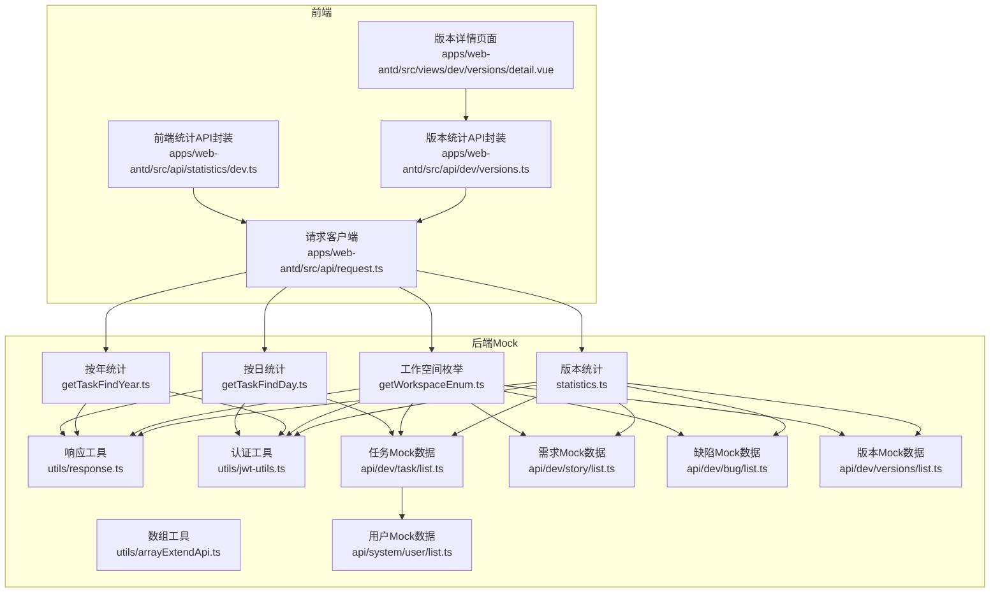
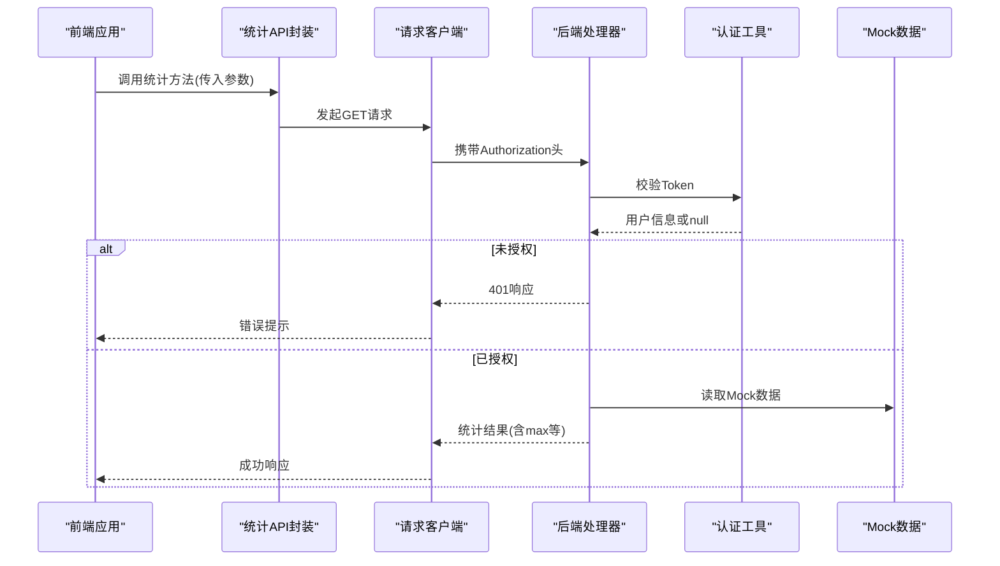
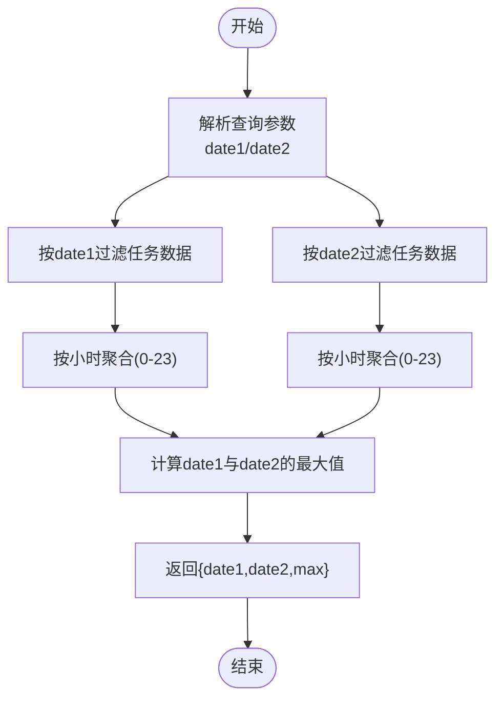
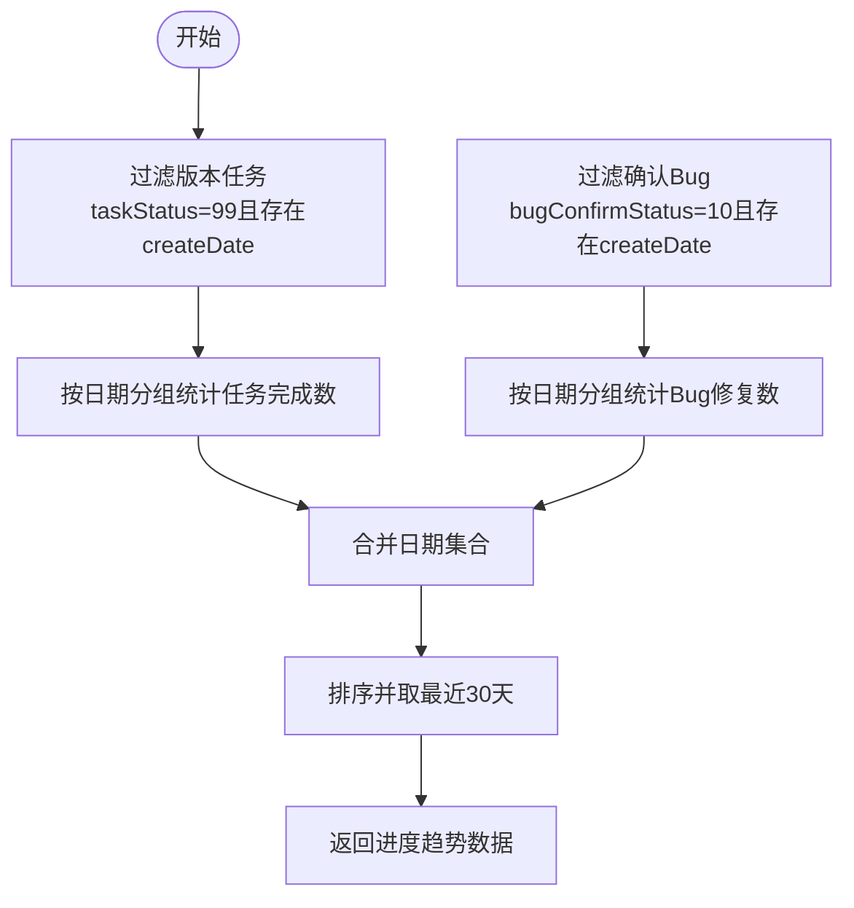
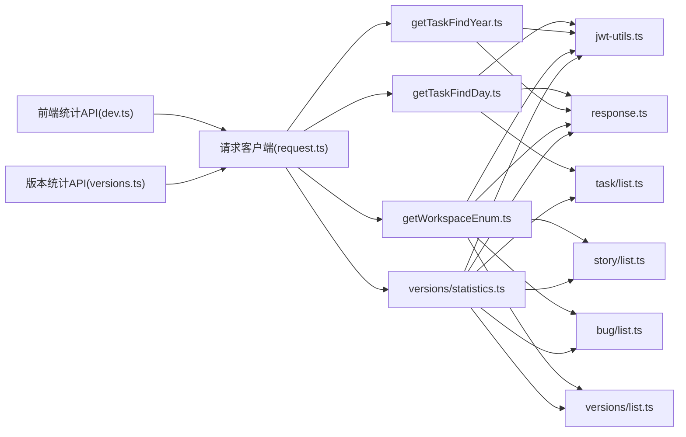

# 统计API

<cite>
**本文引用的文件**
- [apps/backend-mock/api/statistics/dev/getTaskFindDay.ts](file://apps/backend-mock/api/statistics/dev/getTaskFindDay.ts)
- [apps/backend-mock/api/statistics/dev/getTaskFindYear.ts](file://apps/backend-mock/api/statistics/dev/getTaskFindYear.ts)
- [apps/backend-mock/api/statistics/dev/getWorkspaceEnum.ts](file://apps/backend-mock/api/statistics/dev/getWorkspaceEnum.ts)
- [apps/backend-mock/api/dev/versions/statistics.ts](file://apps/backend-mock/api/dev/versions/statistics.ts)
- [apps/web-antd/src/api/statistics/dev.ts](file://apps/web-antd/src/api/statistics/dev.ts)
- [apps/web-antd/src/api/dev/versions.ts](file://apps/web-antd/src/api/dev/versions.ts)
- [apps/web-antd/src/views/dev/versions/detail.vue](file://apps/web-antd/src/views/dev/versions/detail.vue)
- [apps/web-antd/src/api/statistics/index.ts](file://apps/web-antd/src/api/statistics/index.ts)
- [apps/web-antd/src/api/request.ts](file://apps/web-antd/src/api/request.ts)
- [apps/backend-mock/utils/response.ts](file://apps/backend-mock/utils/response.ts)
- [apps/backend-mock/utils/jwt-utils.ts](file://apps/backend-mock/utils/jwt-utils.ts)
- [apps/backend-mock/utils/arrayExtendApi.ts](file://apps/backend-mock/utils/arrayExtendApi.ts)
- [apps/backend-mock/api/dev/task/list.ts](file://apps/backend-mock/api/dev/task/list.ts)
- [apps/backend-mock/api/dev/story/list.ts](file://apps/backend-mock/api/dev/story/list.ts)
- [apps/backend-mock/api/dev/bug/list.ts](file://apps/backend-mock/api/dev/bug/list.ts)
- [apps/backend-mock/api/dev/versions/list.ts](file://apps/backend-mock/api/dev/versions/list.ts)
- [apps/backend-mock/api/system/user/list.ts](file://apps/backend-mock/api/system/user/list.ts)
</cite>

## 更新摘要
**所做更改**
- 新增版本统计功能章节，详细介绍版本级别的开发进度趋势、团队绩效分析等高级统计能力
- 更新统计API架构图，增加版本统计处理器的可视化展示
- 新增版本统计数据模型和响应格式说明
- 添加版本统计在实际项目中的使用示例和图表渲染实现
- 扩展统计能力概述，涵盖从开发统计到版本统计的完整统计体系
- 完善版本统计的多维度分析功能，包括人员分析、需求面板、任务面板、Bug分析等

## 目录
1. [简介](#简介)
2. [项目结构](#项目结构)
3. [核心组件](#核心组件)
4. [架构总览](#架构总览)
5. [详细组件分析](#详细组件分析)
6. [版本统计功能](#版本统计功能)
7. [依赖关系分析](#依赖关系分析)
8. [性能与缓存策略](#性能与缓存策略)
9. [故障排查指南](#故障排查指南)
10. [结论](#结论)
11. [附录](#附录)

## 简介
本文件为 Vben Admin 的统计 API 文档，全面覆盖统计 API 的增强功能，包括原有的开发统计与工作空间枚举，以及新增的版本统计功能。文档详细说明以下统计能力：

### 核心统计能力
- **开发统计**：按日统计任务趋势（24 小时分布对比）、按年统计任务趋势（12 月分布）
- **工作空间枚举**：故事/任务/缺陷/版本的总量概览
- **版本统计**：开发进度趋势、团队绩效分析、需求/任务/Bug 多维度统计

### 统计功能特色
- **多维度分析**：支持按人员、模块、需求类型、任务类型等多个维度进行统计分析
- **实时趋势分析**：提供开发进度趋势图，支持最近30天的数据展示
- **团队绩效评估**：包含任务完成率、工时贡献、需求参与度等关键指标
- **质量分析**：Bug 类型分布、级别分布、来源分析等质量维度统计
- **完整版本分析**：从需求到任务再到Bug的全流程统计分析

文档详细说明：
- 请求参数与响应格式
- 统计计算方式、时间范围选择与聚合维度
- 图表数据与趋势分析示例
- 认证与安全控制
- 性能与缓存策略建议
- 扩展性与自定义统计的实现思路

## 项目结构
统计 API 位于后端 Mock 服务的 statistics/dev 和 dev/versions 目录，前端通过统一请求客户端调用。



**图表来源**
- [apps/web-antd/src/api/statistics/dev.ts:1-24](file://apps/web-antd/src/api/statistics/dev.ts#L1-L24)
- [apps/web-antd/src/api/dev/versions.ts:1-145](file://apps/web-antd/src/api/dev/versions.ts#L1-L145)
- [apps/web-antd/src/api/request.ts:1-124](file://apps/web-antd/src/api/request.ts#L1-L124)
- [apps/web-antd/src/views/dev/versions/detail.vue:289-305](file://apps/web-antd/src/views/dev/versions/detail.vue#L289-L305)
- [apps/backend-mock/api/statistics/dev/getTaskFindDay.ts:1-75](file://apps/backend-mock/api/statistics/dev/getTaskFindDay.ts#L1-L75)
- [apps/backend-mock/api/statistics/dev/getTaskFindYear.ts:1-64](file://apps/backend-mock/api/statistics/dev/getTaskFindYear.ts#L1-L64)
- [apps/backend-mock/api/statistics/dev/getWorkspaceEnum.ts:1-25](file://apps/backend-mock/api/statistics/dev/getWorkspaceEnum.ts#L1-L25)
- [apps/backend-mock/api/dev/versions/statistics.ts:1-358](file://apps/backend-mock/api/dev/versions/statistics.ts#L1-L358)

**章节来源**
- [apps/web-antd/src/api/statistics/dev.ts:1-24](file://apps/web-antd/src/api/statistics/dev.ts#L1-L24)
- [apps/web-antd/src/api/dev/versions.ts:1-145](file://apps/web-antd/src/api/dev/versions.ts#L1-L145)
- [apps/web-antd/src/api/statistics/index.ts:1-2](file://apps/web-antd/src/api/statistics/index.ts#L1-L2)
- [apps/web-antd/src/api/request.ts:1-124](file://apps/web-antd/src/api/request.ts#L1-L124)

## 核心组件
- **统计API封装（前端）**
  - 开发统计：提供按日统计、按年统计、工作空间枚举三个方法
  - 版本统计：提供版本统计数据获取方法
  - 所有方法均通过统一请求客户端发起 GET 请求
- **后端统计处理器**
  - 开发统计：按日统计对指定日期的任务按小时聚合；按年统计对指定年份的任务按月聚合
  - 工作空间枚举：返回故事/任务/缺陷/版本的总量概览
  - 版本统计：提供完整的版本级统计分析，包括进度趋势、团队绩效、质量分析等多维度统计
- **认证与安全**
  - 所有统计端点均要求携带 Bearer Token，后端校验失败返回 401
- **响应格式**
  - 成功响应统一使用 code/data/message/error 字段，成功 code=0

**章节来源**
- [apps/web-antd/src/api/statistics/dev.ts:1-24](file://apps/web-antd/src/api/statistics/dev.ts#L1-L24)
- [apps/web-antd/src/api/dev/versions.ts:139-144](file://apps/web-antd/src/api/dev/versions.ts#L139-L144)
- [apps/backend-mock/api/statistics/dev/getTaskFindDay.ts:1-75](file://apps/backend-mock/api/statistics/dev/getTaskFindDay.ts#L1-L75)
- [apps/backend-mock/api/statistics/dev/getTaskFindYear.ts:1-64](file://apps/backend-mock/api/statistics/dev/getTaskFindYear.ts#L1-L64)
- [apps/backend-mock/api/statistics/dev/getWorkspaceEnum.ts:1-25](file://apps/backend-mock/api/statistics/dev/getWorkspaceEnum.ts#L1-L25)
- [apps/backend-mock/api/dev/versions/statistics.ts:110-357](file://apps/backend-mock/api/dev/versions/statistics.ts#L110-L357)
- [apps/backend-mock/utils/response.ts:1-71](file://apps/backend-mock/utils/response.ts#L1-L71)
- [apps/backend-mock/utils/jwt-utils.ts:1-115](file://apps/backend-mock/utils/jwt-utils.ts#L1-L115)

## 架构总览
统计 API 的调用链路如下：



**图表来源**
- [apps/web-antd/src/api/statistics/dev.ts:1-24](file://apps/web-antd/src/api/statistics/dev.ts#L1-L24)
- [apps/web-antd/src/api/dev/versions.ts:139-144](file://apps/web-antd/src/api/dev/versions.ts#L139-L144)
- [apps/web-antd/src/api/request.ts:1-124](file://apps/web-antd/src/api/request.ts#L1-L124)
- [apps/backend-mock/utils/jwt-utils.ts:1-115](file://apps/backend-mock/utils/jwt-utils.ts#L1-L115)
- [apps/backend-mock/utils/response.ts:1-71](file://apps/backend-mock/utils/response.ts#L1-L71)
- [apps/backend-mock/api/dev/task/list.ts:1-156](file://apps/backend-mock/api/dev/task/list.ts#L1-L156)

## 详细组件分析

### 按日统计任务趋势（getTaskFindDay）
- **功能概述**
  - 对两个指定日期的任务数据进行小时粒度聚合，生成两条 24 小时序列，以及整体最大值
- **请求参数**
  - date1: 日期字符串（格式：YYYY/MM/DD）
  - date2: 日期字符串（格式：YYYY/MM/DD）
- **聚合逻辑**
  - 从任务数据中过滤出对应日期的任务
  - 按创建时间的小时段（0-23）统计数量
  - 计算两条序列的最大值，用于图表缩放
- **响应字段**
  - date1: 24 个整点的计数数组
  - date2: 24 个整点的计数数组
  - max: date1 与 date2 对应位置的最大值
- **适用场景**
  - 对比不同日期的工作负载分布，识别高峰时段



**图表来源**
- [apps/backend-mock/api/statistics/dev/getTaskFindDay.ts:1-75](file://apps/backend-mock/api/statistics/dev/getTaskFindDay.ts#L1-L75)

**章节来源**
- [apps/backend-mock/api/statistics/dev/getTaskFindDay.ts:1-75](file://apps/backend-mock/api/statistics/dev/getTaskFindDay.ts#L1-L75)
- [apps/backend-mock/api/dev/task/list.ts:1-156](file://apps/backend-mock/api/dev/task/list.ts#L1-L156)

### 按年统计任务趋势（getTaskFindYear）
- **功能概述**
  - 对指定年份的任务按月聚合，使用实际工时作为聚合值，生成 12 个月的序列
- **请求参数**
  - year: 年份字符串（格式：YYYY）
- **聚合逻辑**
  - 从任务数据中过滤出对应年份的任务
  - 按创建时间的月份（1-12）聚合 actualHours
  - 计算序列最大值，用于图表缩放
- **响应字段**
  - list: 12 个月的工时聚合数组
  - max: 序列最大值
- **适用场景**
  - 分析年度工作量分布，辅助资源规划


**图表来源**
- [apps/backend-mock/api/statistics/dev/getTaskFindYear.ts:1-64](file://apps/backend-mock/api/statistics/dev/getTaskFindYear.ts#L1-L64)

**章节来源**
- [apps/backend-mock/api/statistics/dev/getTaskFindYear.ts:1-64](file://apps/backend-mock/api/statistics/dev/getTaskFindYear.ts#L1-L64)
- [apps/backend-mock/api/dev/task/list.ts:1-156](file://apps/backend-mock/api/dev/task/list.ts#L1-L156)

### 工作空间枚举（getWorkspaceEnum）
- **功能概述**
  - 返回故事、任务、缺陷、版本的总量概览（当前版本为 Mock 数据长度）
- **请求参数**
  - 无
- **响应字段**
  - storyTotalNum: 故事总数
  - taskTotalNum: 任务总数
  - bugTotalNum: 缺陷总数
  - versionTotalNum: 版本总数
  - 其余字段为占位（当前为 0）
- **适用场景**
  - 仪表盘概览、导航入口统计


**图表来源**
- [apps/backend-mock/api/statistics/dev/getWorkspaceEnum.ts:1-25](file://apps/backend-mock/api/statistics/dev/getWorkspaceEnum.ts#L1-L25)

**章节来源**
- [apps/backend-mock/api/statistics/dev/getWorkspaceEnum.ts:1-25](file://apps/backend-mock/api/statistics/dev/getWorkspaceEnum.ts#L1-L25)
- [apps/backend-mock/api/dev/story/list.ts:1-149](file://apps/backend-mock/api/dev/story/list.ts#L1-L149)
- [apps/backend-mock/api/dev/task/list.ts:1-156](file://apps/backend-mock/api/dev/task/list.ts#L1-L156)
- [apps/backend-mock/api/dev/bug/list.ts:1-166](file://apps/backend-mock/api/dev/bug/list.ts#L1-L166)
- [apps/backend-mock/api/dev/versions/list.ts:1-109](file://apps/backend-mock/api/dev/versions/list.ts#L1-L109)

## 版本统计功能

### 版本统计概述
版本统计功能提供了完整的版本级统计分析能力，支持从开发进度到团队绩效的全方位统计分析。该功能基于版本维度对需求、任务、缺陷等数据进行全面分析，为版本管理提供数据支撑。

### 核心统计维度
- **开发进度趋势**：按日期统计任务完成数和Bug修复数，展示版本开发进展
- **团队绩效分析**：按人员维度统计任务完成量、需求参与度、工时贡献
- **模块分布分析**：统计各模块的任务数量分布，识别热点模块
- **需求分析**：需求类型分布、来源分布、状态漏斗分析
- **任务分析**：任务类型分布、计划/实际工时对比
- **Bug质量分析**：Bug类型分布、级别分布、来源分析、修复人分布

### 数据模型与响应格式

#### 版本统计摘要
| 字段名 | 类型 | 描述 | 示例 |
|--------|------|------|------|
| storyTotal | number | 需求数量总计 | 50 |
| storyDone | number | 已完成需求数 | 45 |
| taskTotal | number | 任务数量总计 | 120 |
| taskDone | number | 已完成任务数 | 110 |
| bugTotal | number | Bug数量总计 | 25 |
| bugFixed | number | 已修复Bug数 | 20 |

#### 开发进度趋势
| 字段名 | 类型 | 描述 | 示例 |
|--------|------|------|------|
| dates | string[] | 日期数组（最近30天） | ["2026-01-01", "2026-01-02", ...] |
| taskDone | number[] | 每日任务完成数 | [5, 3, 8, ...] |
| bugFixed | number[] | 每日Bug修复数 | [2, 1, 3, ...] |

#### 人员维度统计
| 字段名 | 类型 | 描述 | 示例 |
|--------|------|------|------|
| name | string | 人员姓名 | "张三" |
| value | number | 统计数值 | 15 |

#### 任务工作量
| 字段名 | 类型 | 描述 | 示例 |
|--------|------|------|------|
| categories | string[] | 任务类型分类 | ["开发任务", "测试任务", "UI设计"] |
| planHours | number[] | 计划工时数组 | [40, 20, 15] |
| actualHours | number[] | 实际工时数组 | [38, 22, 12] |

### 统计计算逻辑

#### 开发进度趋势计算


#### 团队绩效分析
- **人员任务数量占比**：统计每个成员完成的任务数量
- **人员需求参与占比**：统计每个成员参与的需求数量（展开userList）
- **人员工时占比**：统计每个成员的实际工时贡献
- **模块任务占比**：统计各模块的任务数量分布

#### 需求/任务/Bug分析
- **需求类型分布**：按需求类型统计数量
- **需求来源分布**：按需求来源统计数量
- **需求状态漏斗**：按状态顺序统计需求流转
- **任务类型分布**：按任务类型统计数量
- **Bug类型/级别/来源分布**：按类别统计数量并排序

### 前端集成与使用

#### API封装
版本统计API通过 `getVersionStatistics` 方法提供，支持传入版本ID参数：

```typescript
export const getVersionStatistics = async (versionId: string) => {
  return requestClient.get<DevVersionApi.VersionStatisticsFace>(
    '/dev/versions/statistics',
    { params: { versionId } },
  );
};
```

#### 页面集成示例
在版本详情页面中，同时获取版本详情和统计数据，并渲染多个统计图表：

```typescript
onMounted(async () => {
  loading.value = true;
  try {
    const [detail, stats] = await Promise.all([
      getVersionDetail(versionId.value),
      getVersionStatistics(versionId.value),
    ]);
    versionInfo.value = detail;
    statistics.value = stats;
    setTabTitle(`版本详情 ${versionInfo.value.version}`);
    if (stats) {
      renderAllCharts(stats);
    }
  } finally {
    loading.value = false;
  }
});
```

#### 图表渲染实现
页面支持多种图表类型的渲染，包括：
- 开发进度趋势图（折线图）
- 人员维度占比图表（饼图/环形图）
- 需求分析图表（柱状图/饼图）
- 任务分析图表（柱状图/堆叠图）
- Bug分析图表（柱状图/饼图）

**章节来源**
- [apps/backend-mock/api/dev/versions/statistics.ts:110-357](file://apps/backend-mock/api/dev/versions/statistics.ts#L110-L357)
- [apps/web-antd/src/api/dev/versions.ts:139-144](file://apps/web-antd/src/api/dev/versions.ts#L139-L144)
- [apps/web-antd/src/views/dev/versions/detail.vue:289-305](file://apps/web-antd/src/views/dev/versions/detail.vue#L289-L305)

## 依赖关系分析
- **前端依赖**
  - 统一请求客户端负责：
    - 注入 Authorization 头（Bearer Token）
    - 统一响应拦截与错误处理
    - BigInt 序列化兼容
  - 版本统计页面依赖 ECharts 进行图表渲染
- **后端依赖**
  - 认证：verifyAccessToken 校验 Token，失败返回 401
  - 数据：统计端点依赖各模块的 Mock 数据
  - 响应：统一使用 useResponseSuccess/useResponseError



**图表来源**
- [apps/web-antd/src/api/statistics/dev.ts:1-24](file://apps/web-antd/src/api/statistics/dev.ts#L1-L24)
- [apps/web-antd/src/api/dev/versions.ts:1-145](file://apps/web-antd/src/api/dev/versions.ts#L1-L145)
- [apps/web-antd/src/api/request.ts:1-124](file://apps/web-antd/src/api/request.ts#L1-L124)
- [apps/backend-mock/utils/jwt-utils.ts:1-115](file://apps/backend-mock/utils/jwt-utils.ts#L1-L115)
- [apps/backend-mock/utils/response.ts:1-71](file://apps/backend-mock/utils/response.ts#L1-L71)
- [apps/backend-mock/api/dev/task/list.ts:1-156](file://apps/backend-mock/api/dev/task/list.ts#L1-L156)
- [apps/backend-mock/api/dev/story/list.ts:1-149](file://apps/backend-mock/api/dev/story/list.ts#L1-L149)
- [apps/backend-mock/api/dev/bug/list.ts:1-166](file://apps/backend-mock/api/dev/bug/list.ts#L1-L166)
- [apps/backend-mock/api/dev/versions/list.ts:1-109](file://apps/backend-mock/api/dev/versions/list.ts#L1-L109)

**章节来源**
- [apps/web-antd/src/api/statistics/dev.ts:1-24](file://apps/web-antd/src/api/statistics/dev.ts#L1-L24)
- [apps/web-antd/src/api/dev/versions.ts:1-145](file://apps/web-antd/src/api/dev/versions.ts#L1-L145)
- [apps/web-antd/src/api/request.ts:1-124](file://apps/web-antd/src/api/request.ts#L1-L124)
- [apps/backend-mock/utils/jwt-utils.ts:1-115](file://apps/backend-mock/utils/jwt-utils.ts#L1-L115)
- [apps/backend-mock/utils/response.ts:1-71](file://apps/backend-mock/utils/response.ts#L1-L71)

## 性能与缓存策略
- **当前实现特征**
  - 所有统计端点均为内存计算，直接读取 Mock 数据，未引入数据库或外部缓存
  - 按日/按年统计涉及字符串解析与数组遍历，复杂度近似 O(n)
  - 版本统计包含多维度聚合计算，涉及多次数据过滤和分组操作
- **性能考量**
  - 任务数据规模较大（按任务列表生成了上万条 Mock 数据），建议：
    - 在生产环境接入数据库并建立索引（按创建时间、项目/版本/状态等）
    - 对高频统计增加 Redis 缓存，设置合理 TTL（如 5-15 分钟）
    - 对大时间窗口的统计采用分页/游标式聚合，避免一次性全量扫描
    - 版本统计建议按版本ID建立缓存，版本数据变化时更新缓存
- **建议的优化路径**
  - 引入统计中间层（如定时任务预聚合），减少实时查询压力
  - 对图表渲染侧做懒加载与虚拟化，降低前端渲染开销
  - 对热点参数组合建立物化视图或缓存键空间
  - 版本统计可考虑分页返回大数据集，前端按需加载

## 故障排查指南
- **401 未授权**
  - 现象：返回 Unauthorized Exception
  - 排查：确认请求头 Authorization 是否为 Bearer Token，且 Token 有效
  - 参考：认证工具与响应工具
- **参数格式错误**
  - 按日统计：date1/date2 必须为 YYYY/MM/DD 格式
  - 按年统计：year 必须为 YYYY 格式
  - 版本统计：versionId 必须为有效的版本标识符
  - 排查：核对前端传参与后端解析逻辑
- **数据为空或异常**
  - 按日统计：若指定日期无任务，对应数组元素为 0
  - 按年统计：若指定年份无任务，对应数组元素为 0
  - 版本统计：若指定版本无数据，返回空对象或默认值
  - 排查：确认 Mock 数据范围与过滤条件
- **版本统计异常**
  - 确认版本ID是否正确传递
  - 检查版本数据是否存在关联的需求、任务、缺陷数据
  - 验证用户权限是否能够访问目标版本数据

**章节来源**
- [apps/backend-mock/utils/jwt-utils.ts:1-115](file://apps/backend-mock/utils/jwt-utils.ts#L1-L115)
- [apps/backend-mock/utils/response.ts:1-71](file://apps/backend-mock/utils/response.ts#L1-L71)
- [apps/backend-mock/api/statistics/dev/getTaskFindDay.ts:1-75](file://apps/backend-mock/api/statistics/dev/getTaskFindDay.ts#L1-L75)
- [apps/backend-mock/api/statistics/dev/getTaskFindYear.ts:1-64](file://apps/backend-mock/api/statistics/dev/getTaskFindYear.ts#L1-L64)
- [apps/backend-mock/api/dev/versions/statistics.ts:116-120](file://apps/backend-mock/api/dev/versions/statistics.ts#L116-L120)

## 结论
- **统计能力完整性**：本统计 API 提供了从基础开发统计到高级版本统计的完整统计体系，满足日常看板、概览、深度分析等多层次需求
- **版本统计价值**：新增的版本统计功能提供了全面的版本级分析能力，包括开发进度、团队绩效、质量分析等多个维度，为版本管理提供数据支撑
- **扩展性优势**：当前实现基于 Mock 数据，具备良好的扩展性：可快速替换为真实数据源与缓存层，支持更多统计维度和更复杂的分析场景
- **生产环境建议**：建议在生产环境中完善认证、缓存与数据库索引，并对大时间窗口统计进行分页/物化优化，特别是版本统计这类计算密集型功能

## 附录

### API 定义与调用示例

#### 开发统计API
- **按日统计任务趋势**
  - 方法：GET
  - 路径：/statistics/dev/getTaskFindDay
  - 查询参数：
    - date1: YYYY/MM/DD
    - date2: YYYY/MM/DD
  - 响应字段：date1, date2, max
  - 调用封装：见 [apps/web-antd/src/api/statistics/dev.ts:5-9](file://apps/web-antd/src/api/statistics/dev.ts#L5-L9)

- **按年统计任务趋势**
  - 方法：GET
  - 路径：/statistics/dev/getTaskFindYear
  - 查询参数：
    - year: YYYY
  - 响应字段：list, max
  - 调用封装：见 [apps/web-antd/src/api/statistics/dev.ts:12-16](file://apps/web-antd/src/api/statistics/dev.ts#L12-L16)

- **工作空间枚举**
  - 方法：GET
  - 路径：/statistics/dev/getWorkspaceEnum
  - 查询参数：无
  - 响应字段：storyTotalNum, taskTotalNum, bugTotalNum, versionTotalNum 等
  - 调用封装：见 [apps/web-antd/src/api/statistics/dev.ts:19-23](file://apps/web-antd/src/api/statistics/dev.ts#L19-L23)

#### 版本统计API
- **版本统计数据**
  - 方法：GET
  - 路径：/dev/versions/statistics
  - 查询参数：
    - versionId: 版本标识符
  - 响应字段：summary, progressTrend, 各维度统计数组
  - 调用封装：见 [apps/web-antd/src/api/dev/versions.ts:139-144](file://apps/web-antd/src/api/dev/versions.ts#L139-L144)

**章节来源**
- [apps/web-antd/src/api/statistics/dev.ts:1-24](file://apps/web-antd/src/api/statistics/dev.ts#L1-L24)
- [apps/web-antd/src/api/dev/versions.ts:1-145](file://apps/web-antd/src/api/dev/versions.ts#L1-L145)
- [apps/web-antd/src/api/statistics/index.ts:1-2](file://apps/web-antd/src/api/statistics/index.ts#L1-L2)

### 认证与安全
- **Token 校验**
  - 后端通过 verifyAccessToken 校验 Authorization 头
  - 失败返回 401
- **前端注入**
  - 请求客户端自动在请求头注入 Authorization: Bearer <token>
- **用户信息**
  - 认证通过后可获取用户上下文（用于权限控制）

**章节来源**
- [apps/backend-mock/utils/jwt-utils.ts:1-115](file://apps/backend-mock/utils/jwt-utils.ts#L1-L115)
- [apps/web-antd/src/api/request.ts:1-124](file://apps/web-antd/src/api/request.ts#L1-L124)
- [apps/backend-mock/api/system/user/list.ts:1-120](file://apps/backend-mock/api/system/user/list.ts#L1-L120)

### 数据模型与Mock来源
- **任务（Task）**
  - 字段包含创建时间、计划/实际工时、项目/版本/需求关联等
  - Mock 数据由任务列表生成
- **需求（Story）、缺陷（Bug）、版本（Version）**
  - 分别提供 Mock 数据，用于工作空间枚举统计
- **版本统计数据**
  - 基于版本ID过滤相关数据，支持多维度统计分析

**章节来源**
- [apps/backend-mock/api/dev/task/list.ts:1-156](file://apps/backend-mock/api/dev/task/list.ts#L1-L156)
- [apps/backend-mock/api/dev/story/list.ts:1-149](file://apps/backend-mock/api/dev/story/list.ts#L1-L149)
- [apps/backend-mock/api/dev/bug/list.ts:1-166](file://apps/backend-mock/api/dev/bug/list.ts#L1-L166)
- [apps/backend-mock/api/dev/versions/list.ts:1-109](file://apps/backend-mock/api/dev/versions/list.ts#L1-L109)
- [apps/backend-mock/api/dev/versions/statistics.ts:122-127](file://apps/backend-mock/api/dev/versions/statistics.ts#L122-L127)