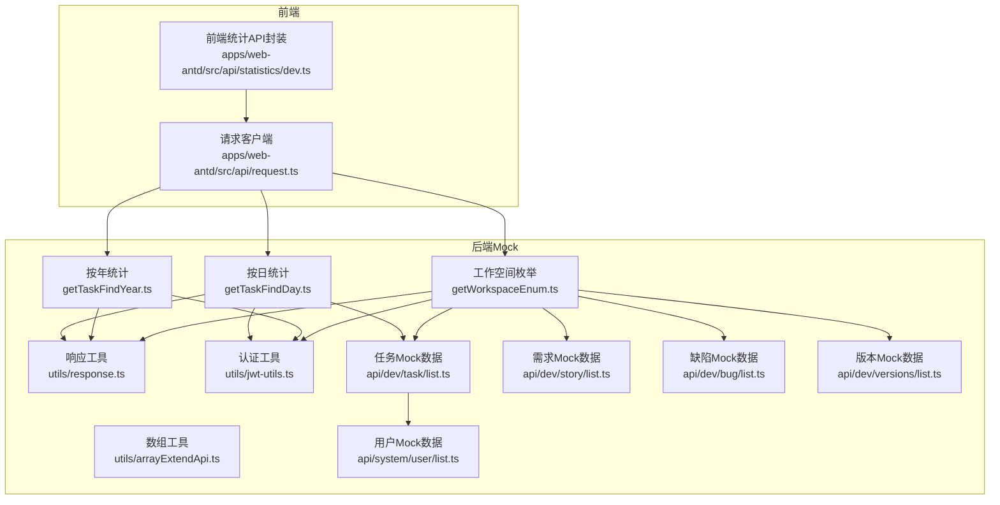
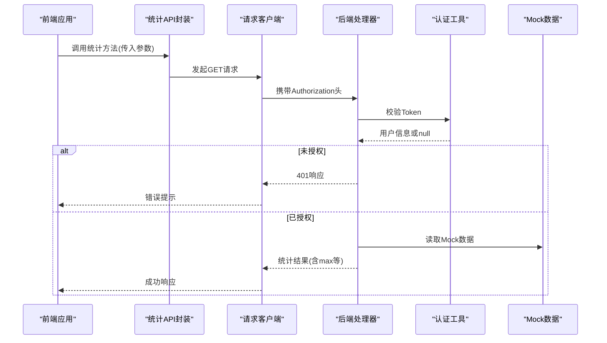
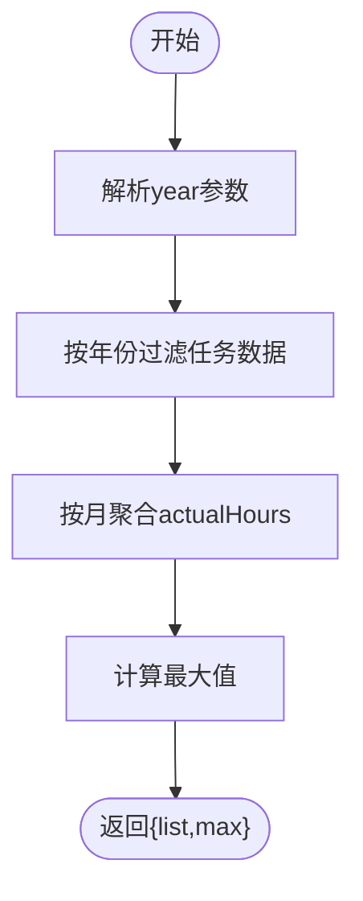
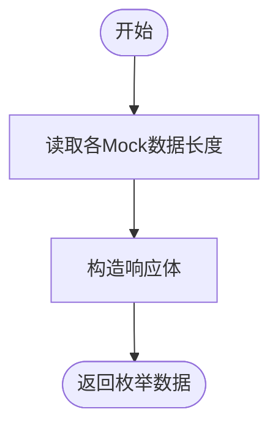
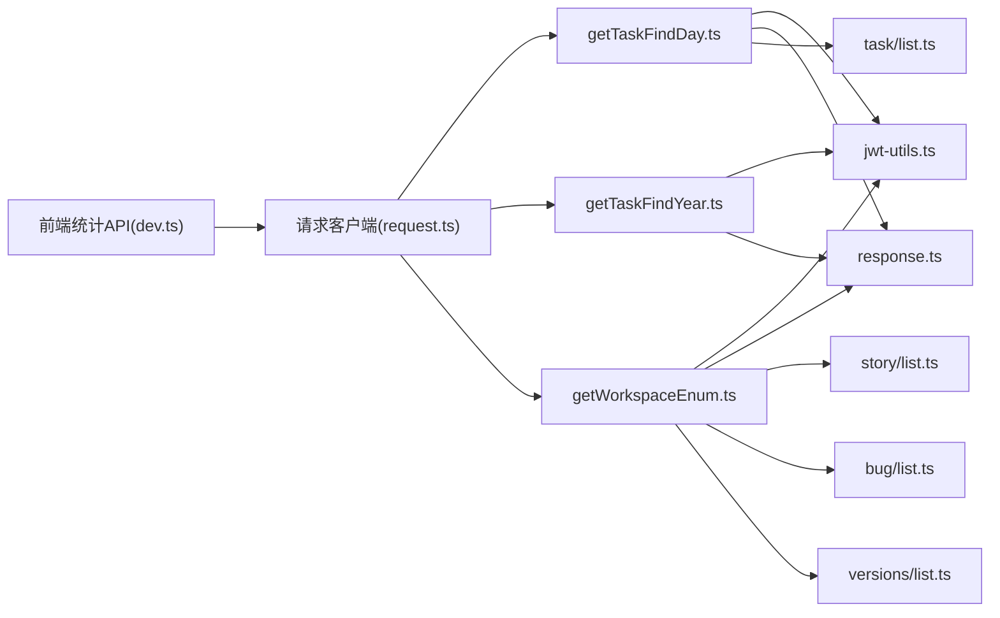

# 统计API

<cite>
**本文引用的文件**
- [apps/backend-mock/api/statistics/dev/getTaskFindDay.ts](file://apps/backend-mock/api/statistics/dev/getTaskFindDay.ts)
- [apps/backend-mock/api/statistics/dev/getTaskFindYear.ts](file://apps/backend-mock/api/statistics/dev/getTaskFindYear.ts)
- [apps/backend-mock/api/statistics/dev/getWorkspaceEnum.ts](file://apps/backend-mock/api/statistics/dev/getWorkspaceEnum.ts)
- [apps/web-antd/src/api/statistics/dev.ts](file://apps/web-antd/src/api/statistics/dev.ts)
- [apps/web-antd/src/api/statistics/index.ts](file://apps/web-antd/src/api/statistics/index.ts)
- [apps/web-antd/src/api/request.ts](file://apps/web-antd/src/api/request.ts)
- [apps/backend-mock/utils/response.ts](file://apps/backend-mock/utils/response.ts)
- [apps/backend-mock/utils/jwt-utils.ts](file://apps/backend-mock/utils/jwt-utils.ts)
- [apps/backend-mock/utils/arrayExtendApi.ts](file://apps/backend-mock/utils/arrayExtendApi.ts)
- [apps/backend-mock/api/dev/task/list.ts](file://apps/backend-mock/api/dev/task/list.ts)
- [apps/backend-mock/api/dev/story/list.ts](file://apps/backend-mock/api/dev/story/list.ts)
- [apps/backend-mock/api/dev/bug/list.ts](file://apps/backend-mock/api/dev/bug/list.ts)
- [apps/backend-mock/api/dev/versions/list.ts](file://apps/backend-mock/api/dev/versions/list.ts)
- [apps/backend-mock/api/system/user/list.ts](file://apps/backend-mock/api/system/user/list.ts)
</cite>

## 目录
1. [简介](#简介)
2. [项目结构](#项目结构)
3. [核心组件](#核心组件)
4. [架构总览](#架构总览)
5. [详细组件分析](#详细组件分析)
6. [依赖关系分析](#依赖关系分析)
7. [性能与缓存策略](#性能与缓存策略)
8. [故障排查指南](#故障排查指南)
9. [结论](#结论)
10. [附录](#附录)

## 简介
本文件为 Vben Admin 的统计 API 文档，聚焦“开发统计”与“工作空间枚举”两类统计能力，覆盖以下端点：
- 按日统计任务趋势（24 小时分布对比）
- 按年统计任务趋势（12 月分布）
- 工作空间枚举（故事/任务/缺陷/版本的总量概览）

文档详细说明：
- 请求参数与响应格式
- 统计计算方式、时间范围选择与聚合维度
- 图表数据与趋势分析示例
- 认证与安全控制
- 性能与缓存策略建议
- 扩展性与自定义统计的实现思路

## 项目结构
统计 API 位于后端 Mock 服务的 statistics/dev 目录，前端通过统一请求客户端调用。

**图表来源**
- [apps/web-antd/src/api/statistics/dev.ts:1-24](file://apps/web-antd/src/api/statistics/dev.ts#L1-L24)
- [apps/web-antd/src/api/request.ts:1-124](file://apps/web-antd/src/api/request.ts#L1-L124)
- [apps/backend-mock/api/statistics/dev/getTaskFindDay.ts:1-75](file://apps/backend-mock/api/statistics/dev/getTaskFindDay.ts#L1-L75)
- [apps/backend-mock/api/statistics/dev/getTaskFindYear.ts:1-64](file://apps/backend-mock/api/statistics/dev/getTaskFindYear.ts#L1-L64)
- [apps/backend-mock/api/statistics/dev/getWorkspaceEnum.ts:1-25](file://apps/backend-mock/api/statistics/dev/getWorkspaceEnum.ts#L1-L25)
- [apps/backend-mock/utils/response.ts:1-71](file://apps/backend-mock/utils/response.ts#L1-L71)
- [apps/backend-mock/utils/jwt-utils.ts:1-115](file://apps/backend-mock/utils/jwt-utils.ts#L1-L115)
- [apps/backend-mock/utils/arrayExtendApi.ts:1-154](file://apps/backend-mock/utils/arrayExtendApi.ts#L1-L154)
- [apps/backend-mock/api/dev/task/list.ts:1-156](file://apps/backend-mock/api/dev/task/list.ts#L1-L156)
- [apps/backend-mock/api/dev/story/list.ts:1-149](file://apps/backend-mock/api/dev/story/list.ts#L1-L149)
- [apps/backend-mock/api/dev/bug/list.ts:1-166](file://apps/backend-mock/api/dev/bug/list.ts#L1-L166)
- [apps/backend-mock/api/dev/versions/list.ts:1-109](file://apps/backend-mock/api/dev/versions/list.ts#L1-L109)
- [apps/backend-mock/api/system/user/list.ts:1-120](file://apps/backend-mock/api/system/user/list.ts#L1-L120)

**章节来源**
- [apps/web-antd/src/api/statistics/dev.ts:1-24](file://apps/web-antd/src/api/statistics/dev.ts#L1-L24)
- [apps/web-antd/src/api/statistics/index.ts:1-2](file://apps/web-antd/src/api/statistics/index.ts#L1-L2)
- [apps/web-antd/src/api/request.ts:1-124](file://apps/web-antd/src/api/request.ts#L1-L124)

## 核心组件
- 统计API封装（前端）
  - 提供三个统计方法：按日统计、按年统计、工作空间枚举
  - 方法均通过统一请求客户端发起 GET 请求
- 后端统计处理器
  - 按日统计：对指定日期的任务按小时聚合，支持两个日期对比
  - 按年统计：对指定年份的任务按月聚合，使用实际工时作为聚合值
  - 工作空间枚举：返回故事/任务/缺陷/版本的总量概览
- 认证与安全
  - 所有统计端点均要求携带 Bearer Token，后端校验失败返回 401
- 响应格式
  - 成功响应统一使用 code/data/message/error 字段，成功 code=0

**章节来源**
- [apps/web-antd/src/api/statistics/dev.ts:1-24](file://apps/web-antd/src/api/statistics/dev.ts#L1-L24)
- [apps/backend-mock/api/statistics/dev/getTaskFindDay.ts:1-75](file://apps/backend-mock/api/statistics/dev/getTaskFindDay.ts#L1-L75)
- [apps/backend-mock/api/statistics/dev/getTaskFindYear.ts:1-64](file://apps/backend-mock/api/statistics/dev/getTaskFindYear.ts#L1-L64)
- [apps/backend-mock/api/statistics/dev/getWorkspaceEnum.ts:1-25](file://apps/backend-mock/api/statistics/dev/getWorkspaceEnum.ts#L1-L25)
- [apps/backend-mock/utils/response.ts:1-71](file://apps/backend-mock/utils/response.ts#L1-L71)
- [apps/backend-mock/utils/jwt-utils.ts:1-115](file://apps/backend-mock/utils/jwt-utils.ts#L1-L115)

## 架构总览
统计 API 的调用链路如下：

**图表来源**
- [apps/web-antd/src/api/statistics/dev.ts:1-24](file://apps/web-antd/src/api/statistics/dev.ts#L1-L24)
- [apps/web-antd/src/api/request.ts:1-124](file://apps/web-antd/src/api/request.ts#L1-L124)
- [apps/backend-mock/utils/jwt-utils.ts:1-115](file://apps/backend-mock/utils/jwt-utils.ts#L1-L115)
- [apps/backend-mock/utils/response.ts:1-71](file://apps/backend-mock/utils/response.ts#L1-L71)
- [apps/backend-mock/api/dev/task/list.ts:1-156](file://apps/backend-mock/api/dev/task/list.ts#L1-L156)

## 详细组件分析

### 按日统计任务趋势（getTaskFindDay）
- 功能概述
  - 对两个指定日期的任务数据进行小时粒度聚合，生成两条 24 小时序列，以及整体最大值
- 请求参数
  - date1: 日期字符串（格式：YYYY/MM/DD）
  - date2: 日期字符串（格式：YYYY/MM/DD）
- 聚合逻辑
  - 从任务数据中过滤出对应日期的任务
  - 按创建时间的小时段（0-23）统计数量
  - 计算两条序列的最大值，用于图表缩放
- 响应字段
  - date1: 24 个整点的计数数组
  - date2: 24 个整点的计数数组
  - max: date1 与 date2 对应位置的最大值
- 示例（概念性）
  - 输入：date1=2026/12/01, date2=2026/12/02
  - 输出：date1=[…], date2=[…], max=某数值
- 适用场景
  - 对比不同日期的工作负载分布，识别高峰时段

**图表来源**
- [apps/backend-mock/api/statistics/dev/getTaskFindDay.ts:1-75](file://apps/backend-mock/api/statistics/dev/getTaskFindDay.ts#L1-L75)

**章节来源**
- [apps/backend-mock/api/statistics/dev/getTaskFindDay.ts:1-75](file://apps/backend-mock/api/statistics/dev/getTaskFindDay.ts#L1-L75)
- [apps/backend-mock/api/dev/task/list.ts:1-156](file://apps/backend-mock/api/dev/task/list.ts#L1-L156)

### 按年统计任务趋势（getTaskFindYear）
- 功能概述
  - 对指定年份的任务按月聚合，使用实际工时作为聚合值，生成 12 个月的序列
- 请求参数
  - year: 年份字符串（格式：YYYY）
- 聚合逻辑
  - 从任务数据中过滤出对应年份的任务
  - 按创建时间的月份（1-12）聚合 actualHours
  - 计算序列最大值，用于图表缩放
- 响应字段
  - list: 12 个月的工时聚合数组
  - max: 序列最大值
- 示例（概念性）
  - 输入：year=2026
  - 输出：list=[…], max=某数值
- 适用场景
  - 分析年度工作量分布，辅助资源规划

**图表来源**
- [apps/backend-mock/api/statistics/dev/getTaskFindYear.ts:1-64](file://apps/backend-mock/api/statistics/dev/getTaskFindYear.ts#L1-L64)

**章节来源**
- [apps/backend-mock/api/statistics/dev/getTaskFindYear.ts:1-64](file://apps/backend-mock/api/statistics/dev/getTaskFindYear.ts#L1-L64)
- [apps/backend-mock/api/dev/task/list.ts:1-156](file://apps/backend-mock/api/dev/task/list.ts#L1-L156)

### 工作空间枚举（getWorkspaceEnum）
- 功能概述
  - 返回故事、任务、缺陷、版本的总量概览（当前版本为 Mock 数据长度）
- 请求参数
  - 无
- 响应字段
  - storyTotalNum: 故事总数
  - taskTotalNum: 任务总数
  - bugTotalNum: 缺陷总数
  - versionTotalNum: 版本总数
  - 其余字段为占位（当前为 0）
- 适用场景
  - 仪表盘概览、导航入口统计

**图表来源**
- [apps/backend-mock/api/statistics/dev/getWorkspaceEnum.ts:1-25](file://apps/backend-mock/api/statistics/dev/getWorkspaceEnum.ts#L1-L25)

**章节来源**
- [apps/backend-mock/api/statistics/dev/getWorkspaceEnum.ts:1-25](file://apps/backend-mock/api/statistics/dev/getWorkspaceEnum.ts#L1-L25)
- [apps/backend-mock/api/dev/story/list.ts:1-149](file://apps/backend-mock/api/dev/story/list.ts#L1-L149)
- [apps/backend-mock/api/dev/task/list.ts:1-156](file://apps/backend-mock/api/dev/task/list.ts#L1-L156)
- [apps/backend-mock/api/dev/bug/list.ts:1-166](file://apps/backend-mock/api/dev/bug/list.ts#L1-L166)
- [apps/backend-mock/api/dev/versions/list.ts:1-109](file://apps/backend-mock/api/dev/versions/list.ts#L1-L109)

## 依赖关系分析
- 前端依赖
  - 统一请求客户端负责：
    - 注入 Authorization 头（Bearer Token）
    - 统一响应拦截与错误处理
    - BigInt 序列化兼容
- 后端依赖
  - 认证：verifyAccessToken 校验 Token，失败返回 401
  - 数据：统计端点依赖各模块的 Mock 数据
  - 响应：统一使用 useResponseSuccess/useResponseError

**图表来源**
- [apps/web-antd/src/api/statistics/dev.ts:1-24](file://apps/web-antd/src/api/statistics/dev.ts#L1-L24)
- [apps/web-antd/src/api/request.ts:1-124](file://apps/web-antd/src/api/request.ts#L1-L124)
- [apps/backend-mock/utils/jwt-utils.ts:1-115](file://apps/backend-mock/utils/jwt-utils.ts#L1-L115)
- [apps/backend-mock/utils/response.ts:1-71](file://apps/backend-mock/utils/response.ts#L1-L71)
- [apps/backend-mock/api/dev/task/list.ts:1-156](file://apps/backend-mock/api/dev/task/list.ts#L1-L156)
- [apps/backend-mock/api/dev/story/list.ts:1-149](file://apps/backend-mock/api/dev/story/list.ts#L1-L149)
- [apps/backend-mock/api/dev/bug/list.ts:1-166](file://apps/backend-mock/api/dev/bug/list.ts#L1-L166)
- [apps/backend-mock/api/dev/versions/list.ts:1-109](file://apps/backend-mock/api/dev/versions/list.ts#L1-L109)

**章节来源**
- [apps/web-antd/src/api/statistics/dev.ts:1-24](file://apps/web-antd/src/api/statistics/dev.ts#L1-L24)
- [apps/web-antd/src/api/request.ts:1-124](file://apps/web-antd/src/api/request.ts#L1-L124)
- [apps/backend-mock/utils/jwt-utils.ts:1-115](file://apps/backend-mock/utils/jwt-utils.ts#L1-L115)
- [apps/backend-mock/utils/response.ts:1-71](file://apps/backend-mock/utils/response.ts#L1-L71)

## 性能与缓存策略
- 当前实现特征
  - 所有统计端点均为内存计算，直接读取 Mock 数据，未引入数据库或外部缓存
  - 按日/按年统计涉及字符串解析与数组遍历，复杂度近似 O(n)
- 性能考量
  - 任务数据规模较大（按任务列表生成了上万条 Mock 数据），建议：
    - 在生产环境接入数据库并建立索引（按创建时间、项目/版本/状态等）
    - 对高频统计增加 Redis 缓存，设置合理 TTL（如 5-15 分钟）
    - 对大时间窗口的统计采用分页/游标式聚合，避免一次性全量扫描
- 建议的优化路径
  - 引入统计中间层（如定时任务预聚合），减少实时查询压力
  - 对图表渲染侧做懒加载与虚拟化，降低前端渲染开销
  - 对热点参数组合建立物化视图或缓存键空间

[本节为通用性能建议，不直接分析具体文件，故无“章节来源”]

## 故障排查指南
- 401 未授权
  - 现象：返回 Unauthorized Exception
  - 排查：确认请求头 Authorization 是否为 Bearer Token，且 Token 有效
  - 参考：认证工具与响应工具
- 参数格式错误
  - 按日统计：date1/date2 必须为 YYYY/MM/DD 格式
  - 按年统计：year 必须为 YYYY 格式
  - 排查：核对前端传参与后端解析逻辑
- 数据为空或异常
  - 按日统计：若指定日期无任务，对应数组元素为 0
  - 按年统计：若指定年份无任务，对应数组元素为 0
  - 排查：确认 Mock 数据范围与过滤条件

**章节来源**
- [apps/backend-mock/utils/jwt-utils.ts:1-115](file://apps/backend-mock/utils/jwt-utils.ts#L1-L115)
- [apps/backend-mock/utils/response.ts:1-71](file://apps/backend-mock/utils/response.ts#L1-L71)
- [apps/backend-mock/api/statistics/dev/getTaskFindDay.ts:1-75](file://apps/backend-mock/api/statistics/dev/getTaskFindDay.ts#L1-L75)
- [apps/backend-mock/api/statistics/dev/getTaskFindYear.ts:1-64](file://apps/backend-mock/api/statistics/dev/getTaskFindYear.ts#L1-L64)

## 结论
- 本统计 API 提供了按日/按年任务趋势与工作空间枚举三类核心能力，满足日常看板与概览需求
- 当前实现基于 Mock 数据，具备良好的扩展性：可快速替换为真实数据源与缓存层
- 建议在生产环境中完善认证、缓存与数据库索引，并对大时间窗口统计进行分页/物化优化

[本节为总结性内容，不直接分析具体文件，故无“章节来源”]

## 附录

### API 定义与调用示例

- 按日统计任务趋势
  - 方法：GET
  - 路径：/statistics/dev/getTaskFindDay
  - 查询参数：
    - date1: YYYY/MM/DD
    - date2: YYYY/MM/DD
  - 响应字段：date1, date2, max
  - 调用封装：见 [apps/web-antd/src/api/statistics/dev.ts:1-24](file://apps/web-antd/src/api/statistics/dev.ts#L1-L24)

- 按年统计任务趋势
  - 方法：GET
  - 路径：/statistics/dev/getTaskFindYear
  - 查询参数：
    - year: YYYY
  - 响应字段：list, max
  - 调用封装：见 [apps/web-antd/src/api/statistics/dev.ts:1-24](file://apps/web-antd/src/api/statistics/dev.ts#L1-L24)

- 工作空间枚举
  - 方法：GET
  - 路径：/statistics/dev/getWorkspaceEnum
  - 查询参数：无
  - 响应字段：storyTotalNum, taskTotalNum, bugTotalNum, versionTotalNum 等
  - 调用封装：见 [apps/web-antd/src/api/statistics/dev.ts:1-24](file://apps/web-antd/src/api/statistics/dev.ts#L1-L24)

**章节来源**
- [apps/web-antd/src/api/statistics/dev.ts:1-24](file://apps/web-antd/src/api/statistics/dev.ts#L1-L24)
- [apps/web-antd/src/api/statistics/index.ts:1-2](file://apps/web-antd/src/api/statistics/index.ts#L1-L2)

### 认证与安全
- Token 校验
  - 后端通过 verifyAccessToken 校验 Authorization 头
  - 失败返回 401
- 前端注入
  - 请求客户端自动在请求头注入 Authorization: Bearer <token>
- 用户信息
  - 认证通过后可获取用户上下文（用于权限控制）

**章节来源**
- [apps/backend-mock/utils/jwt-utils.ts:1-115](file://apps/backend-mock/utils/jwt-utils.ts#L1-L115)
- [apps/web-antd/src/api/request.ts:1-124](file://apps/web-antd/src/api/request.ts#L1-L124)
- [apps/backend-mock/api/system/user/list.ts:1-120](file://apps/backend-mock/api/system/user/list.ts#L1-L120)

### 数据模型与Mock来源
- 任务（Task）
  - 字段包含创建时间、计划/实际工时、项目/版本/需求关联等
  - Mock 数据由任务列表生成
- 需求（Story）、缺陷（Bug）、版本（Version）
  - 分别提供 Mock 数据，用于工作空间枚举统计

**章节来源**
- [apps/backend-mock/api/dev/task/list.ts:1-156](file://apps/backend-mock/api/dev/task/list.ts#L1-L156)
- [apps/backend-mock/api/dev/story/list.ts:1-149](file://apps/backend-mock/api/dev/story/list.ts#L1-L149)
- [apps/backend-mock/api/dev/bug/list.ts:1-166](file://apps/backend-mock/api/dev/bug/list.ts#L1-L166)
- [apps/backend-mock/api/dev/versions/list.ts:1-109](file://apps/backend-mock/api/dev/versions/list.ts#L1-L109)