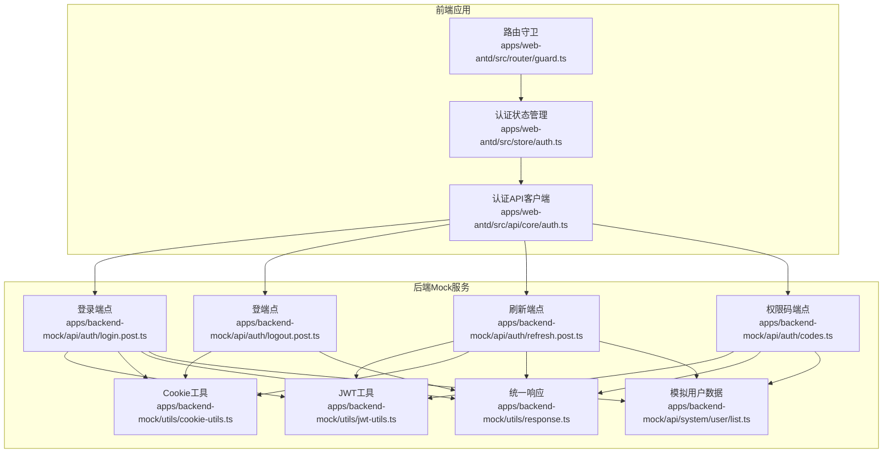
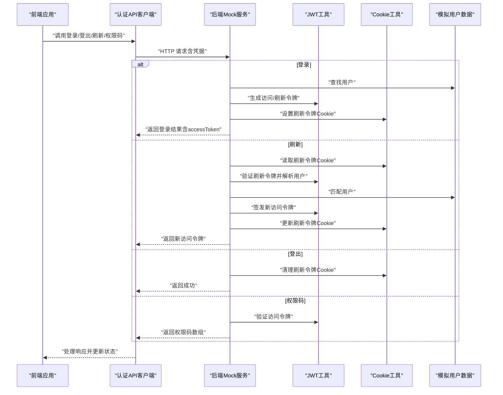
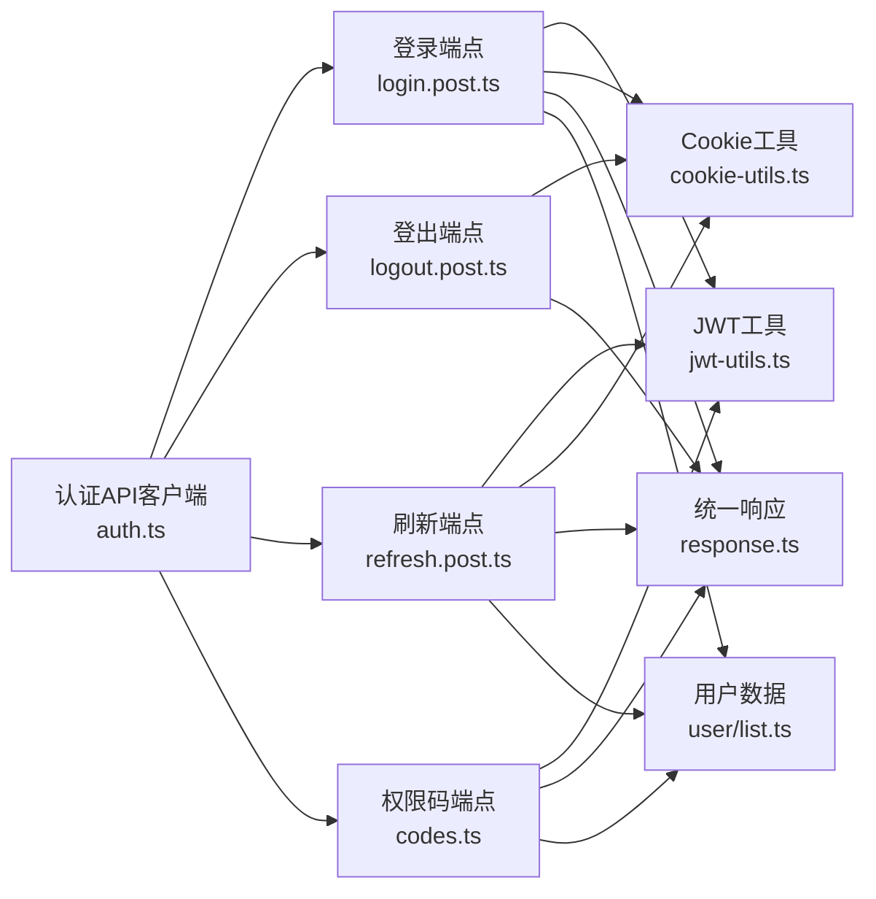

# 认证API

<cite>
**本文引用的文件**
- [apps/backend-mock/api/auth/login.post.ts](file://apps/backend-mock/api/auth/login.post.ts)
- [apps/backend-mock/api/auth/logout.post.ts](file://apps/backend-mock/api/auth/logout.post.ts)
- [apps/backend-mock/api/auth/refresh.post.ts](file://apps/backend-mock/api/auth/refresh.post.ts)
- [apps/backend-mock/api/auth/codes.ts](file://apps/backend-mock/api/auth/codes.ts)
- [apps/backend-mock/utils/jwt-utils.ts](file://apps/backend-mock/utils/jwt-utils.ts)
- [apps/backend-mock/utils/cookie-utils.ts](file://apps/backend-mock/utils/cookie-utils.ts)
- [apps/backend-mock/utils/response.ts](file://apps/backend-mock/utils/response.ts)
- [apps/backend-mock/api/system/user/list.ts](file://apps/backend-mock/api/system/user/list.ts)
- [apps/web-antd/src/api/core/auth.ts](file://apps/web-antd/src/api/core/auth.ts)
- [apps/web-antd/src/store/auth.ts](file://apps/web-antd/src/store/auth.ts)
- [apps/web-antd/src/router/guard.ts](file://apps/web-antd/src/router/guard.ts)
</cite>

## 目录

1. [简介](#简介)
2. [项目结构](#项目结构)
3. [核心组件](#核心组件)
4. [架构总览](#架构总览)
5. [详细组件分析](#详细组件分析)
6. [依赖关系分析](#依赖关系分析)
7. [性能考量](#性能考量)
8. [故障排查指南](#故障排查指南)
9. [结论](#结论)
10. [附录](#附录)

## 简介

本文件面向 Vben Admin 的认证子系统，提供后端认证 API 的完整文档与前端对接说明。内容覆盖登录、登出、刷新令牌、权限码获取等端点，明确请求/响应格式、状态码、JWT 使用方式、过期与刷新机制，并给出 TypeScript 接口定义与数据模型、实际调用示例与安全最佳实践。

## 项目结构

认证相关能力由“后端 Mock 服务”与“前端 Web 应用”两部分组成：

- 后端 Mock 服务：提供 /auth/\* 认证端点、JWT 工具、Cookie 工具、统一响应封装与模拟用户数据。
- 前端 Web 应用：提供认证 API 客户端、认证状态管理、路由守卫与权限控制。

图表来源

- [apps/web-antd/src/api/core/auth.ts:1-52](file://apps/web-antd/src/api/core/auth.ts#L1-L52)
- [apps/web-antd/src/store/auth.ts:1-118](file://apps/web-antd/src/store/auth.ts#L1-L118)
- [apps/web-antd/src/router/guard.ts:1-133](file://apps/web-antd/src/router/guard.ts#L1-L133)
- [apps/backend-mock/api/auth/login.post.ts:1-43](file://apps/backend-mock/api/auth/login.post.ts#L1-L43)
- [apps/backend-mock/api/auth/logout.post.ts:1-18](file://apps/backend-mock/api/auth/logout.post.ts#L1-L18)
- [apps/backend-mock/api/auth/refresh.post.ts:1-36](file://apps/backend-mock/api/auth/refresh.post.ts#L1-L36)
- [apps/backend-mock/api/auth/codes.ts:1-29](file://apps/backend-mock/api/auth/codes.ts#L1-L29)
- [apps/backend-mock/utils/jwt-utils.ts:1-115](file://apps/backend-mock/utils/jwt-utils.ts#L1-L115)
- [apps/backend-mock/utils/cookie-utils.ts:1-29](file://apps/backend-mock/utils/cookie-utils.ts#L1-L29)
- [apps/backend-mock/utils/response.ts:1-71](file://apps/backend-mock/utils/response.ts#L1-L71)
- [apps/backend-mock/api/system/user/list.ts:1-120](file://apps/backend-mock/api/system/user/list.ts#L1-L120)

章节来源

- [apps/backend-mock/api/auth/login.post.ts:1-43](file://apps/backend-mock/api/auth/login.post.ts#L1-L43)
- [apps/backend-mock/api/auth/logout.post.ts:1-18](file://apps/backend-mock/api/auth/logout.post.ts#L1-L18)
- [apps/backend-mock/api/auth/refresh.post.ts:1-36](file://apps/backend-mock/api/auth/refresh.post.ts#L1-L36)
- [apps/backend-mock/api/auth/codes.ts:1-29](file://apps/backend-mock/api/auth/codes.ts#L1-L29)
- [apps/backend-mock/utils/jwt-utils.ts:1-115](file://apps/backend-mock/utils/jwt-utils.ts#L1-L115)
- [apps/backend-mock/utils/cookie-utils.ts:1-29](file://apps/backend-mock/utils/cookie-utils.ts#L1-L29)
- [apps/backend-mock/utils/response.ts:1-71](file://apps/backend-mock/utils/response.ts#L1-L71)
- [apps/backend-mock/api/system/user/list.ts:1-120](file://apps/backend-mock/api/system/user/list.ts#L1-L120)
- [apps/web-antd/src/api/core/auth.ts:1-52](file://apps/web-antd/src/api/core/auth.ts#L1-L52)
- [apps/web-antd/src/store/auth.ts:1-118](file://apps/web-antd/src/store/auth.ts#L1-L118)
- [apps/web-antd/src/router/guard.ts:1-133](file://apps/web-antd/src/router/guard.ts#L1-L133)

## 核心组件

- 认证 API 客户端：封装登录、登出、刷新令牌、获取权限码四个端点，统一请求配置（含凭据传递）。
- 认证状态管理：负责登录流程、设置/清除 accessToken、拉取用户信息与权限码、登出清理。
- 路由守卫：在访问受保护路由前校验 accessToken 并按需生成动态路由。
- JWT 工具：生成/验证访问令牌与刷新令牌，解析用户信息。
- Cookie 工具：设置/读取/清理刷新令牌 Cookie。
- 统一响应：标准化成功/错误/未授权/禁止响应结构与状态码。
- 模拟用户数据：提供测试用用户集合与角色/部门等扩展属性。

章节来源

- [apps/web-antd/src/api/core/auth.ts:1-52](file://apps/web-antd/src/api/core/auth.ts#L1-L52)
- [apps/web-antd/src/store/auth.ts:1-118](file://apps/web-antd/src/store/auth.ts#L1-L118)
- [apps/web-antd/src/router/guard.ts:1-133](file://apps/web-antd/src/router/guard.ts#L1-L133)
- [apps/backend-mock/utils/jwt-utils.ts:1-115](file://apps/backend-mock/utils/jwt-utils.ts#L1-L115)
- [apps/backend-mock/utils/cookie-utils.ts:1-29](file://apps/backend-mock/utils/cookie-utils.ts#L1-L29)
- [apps/backend-mock/utils/response.ts:1-71](file://apps/backend-mock/utils/response.ts#L1-L71)
- [apps/backend-mock/api/system/user/list.ts:1-120](file://apps/backend-mock/api/system/user/list.ts#L1-L120)

## 架构总览

下图展示了从前端发起认证请求到后端处理与返回的关键交互：

图表来源

- [apps/web-antd/src/api/core/auth.ts:21-51](file://apps/web-antd/src/api/core/auth.ts#L21-L51)
- [apps/backend-mock/api/auth/login.post.ts:14-42](file://apps/backend-mock/api/auth/login.post.ts#L14-L42)
- [apps/backend-mock/api/auth/logout.post.ts:8-17](file://apps/backend-mock/api/auth/logout.post.ts#L8-L17)
- [apps/backend-mock/api/auth/refresh.post.ts:11-35](file://apps/backend-mock/api/auth/refresh.post.ts#L11-L35)
- [apps/backend-mock/api/auth/codes.ts:8-28](file://apps/backend-mock/api/auth/codes.ts#L8-L28)
- [apps/backend-mock/utils/jwt-utils.ts:17-75](file://apps/backend-mock/utils/jwt-utils.ts#L17-L75)
- [apps/backend-mock/utils/cookie-utils.ts:5-28](file://apps/backend-mock/utils/cookie-utils.ts#L5-L28)
- [apps/backend-mock/api/system/user/list.ts:19-83](file://apps/backend-mock/api/system/user/list.ts#L19-L83)

## 详细组件分析

### 登录 /auth/login

- 方法与路径
  - 方法：POST
  - 路径：/auth/login
- 请求体
  - 字段：username（字符串，必填）、password（字符串，必填）
- 成功响应
  - 结构：统一成功响应，data 包含用户信息与 accessToken
  - 示例字段：userId、username、realName、roles、roleIds、accessToken 等
- 失败响应
  - 400：缺少用户名或密码
  - 403：用户名或密码错误
- 行为说明
  - 校验用户名与密码
  - 生成访问令牌与刷新令牌
  - 设置 httpOnly、secure、sameSite=none 的刷新令牌 Cookie
  - 返回包含 accessToken 的用户信息

章节来源

- [apps/backend-mock/api/auth/login.post.ts:14-42](file://apps/backend-mock/api/auth/login.post.ts#L14-L42)
- [apps/backend-mock/utils/jwt-utils.ts:17-25](file://apps/backend-mock/utils/jwt-utils.ts#L17-L25)
- [apps/backend-mock/utils/cookie-utils.ts:13-23](file://apps/backend-mock/utils/cookie-utils.ts#L13-L23)
- [apps/backend-mock/utils/response.ts:5-12](file://apps/backend-mock/utils/response.ts#L5-L12)
- [apps/backend-mock/utils/response.ts:44-50](file://apps/backend-mock/utils/response.ts#L44-L50)

### 刷新令牌 /auth/refresh

- 方法与路径
  - 方法：POST
  - 路径：/auth/refresh
- 请求体
  - 无（通过 Cookie 传递刷新令牌）
- 成功响应
  - 结构：纯文本字符串，返回新的访问令牌
- 失败响应
  - 403：未提供刷新令牌或令牌无效
- 行为说明
  - 从 Cookie 读取刷新令牌
  - 验证并解析刷新令牌，匹配用户
  - 生成新的访问令牌
  - 更新刷新令牌 Cookie（保持有效期）

章节来源

- [apps/backend-mock/api/auth/refresh.post.ts:11-35](file://apps/backend-mock/api/auth/refresh.post.ts#L11-L35)
- [apps/backend-mock/utils/jwt-utils.ts:58-75](file://apps/backend-mock/utils/jwt-utils.ts#L58-L75)
- [apps/backend-mock/utils/cookie-utils.ts:25-28](file://apps/backend-mock/utils/cookie-utils.ts#L25-L28)
- [apps/backend-mock/utils/response.ts:44-50](file://apps/backend-mock/utils/response.ts#L44-L50)

### 登出 /auth/logout

- 方法与路径
  - 方法：POST
  - 路径：/auth/logout
- 请求体
  - 无（通过 Cookie 传递刷新令牌）
- 成功响应
  - 结构：统一成功响应（空字符串）
- 失败响应
  - 无（即使无刷新令牌也视为成功）
- 行为说明
  - 清理刷新令牌 Cookie
  - 返回成功

章节来源

- [apps/backend-mock/api/auth/logout.post.ts:8-17](file://apps/backend-mock/api/auth/logout.post.ts#L8-L17)
- [apps/backend-mock/utils/cookie-utils.ts:5-11](file://apps/backend-mock/utils/cookie-utils.ts#L5-L11)
- [apps/backend-mock/utils/response.ts:5-12](file://apps/backend-mock/utils/response.ts#L5-L12)

### 权限码 /auth/codes

- 方法与路径
  - 方法：GET
  - 路径：/auth/codes
- 请求头
  - Authorization: Bearer <accessToken>
- 成功响应
  - 结构：统一成功响应，data 为去重后的权限码数组
- 失败响应
  - 401：未提供有效访问令牌
- 行为说明
  - 验证访问令牌并解析用户
  - 根据用户的角色 ID 过滤菜单，提取权限码并去重

章节来源

- [apps/backend-mock/api/auth/codes.ts:8-28](file://apps/backend-mock/api/auth/codes.ts#L8-L28)
- [apps/backend-mock/utils/jwt-utils.ts:27-56](file://apps/backend-mock/utils/jwt-utils.ts#L27-L56)
- [apps/backend-mock/utils/response.ts:52-55](file://apps/backend-mock/utils/response.ts#L52-L55)

### 前端对接与使用

- 认证 API 客户端
  - 登录：loginApi(params)
  - 刷新：refreshTokenApi()
  - 登出：logoutApi()
  - 权限码：getAccessCodesApi()
- 认证状态管理
  - 登录流程：调用登录接口 -> 设置 accessToken -> 并行拉取用户信息与权限码 -> 存储到状态管理 -> 导航
  - 登出流程：调用登出接口 -> 清理所有状态 -> 跳转登录页
- 路由守卫
  - 若访问受保护路由且无 accessToken，重定向至登录页并携带 redirect 参数
  - 登录成功后根据用户角色生成可访问菜单与路由

章节来源

- [apps/web-antd/src/api/core/auth.ts:21-51](file://apps/web-antd/src/api/core/auth.ts#L21-L51)
- [apps/web-antd/src/store/auth.ts:28-78](file://apps/web-antd/src/store/auth.ts#L28-L78)
- [apps/web-antd/src/router/guard.ts:47-118](file://apps/web-antd/src/router/guard.ts#L47-L118)

### 数据模型与接口定义（TypeScript）

- 登录参数
  - 接口名：AuthApi.LoginParams
  - 字段：username（字符串，必填）、password（字符串，必填）
- 登录返回
  - 接口名：AuthApi.LoginResult
  - 字段：accessToken（字符串，必填）
- 刷新令牌返回
  - 接口名：AuthApi.RefreshTokenResult
  - 字段：data（字符串，必填，即新访问令牌）、status（数字，HTTP 状态码）
- 用户信息（来自后端模拟数据）
  - 接口名：UserInfo
  - 字段：userId、username、realName、roles、roleIds、email、deptIds、status 等（详见后端定义）

章节来源

- [apps/web-antd/src/api/core/auth.ts:3-19](file://apps/web-antd/src/api/core/auth.ts#L3-L19)
- [apps/backend-mock/api/system/user/list.ts:7-15](file://apps/backend-mock/api/system/user/list.ts#L7-L15)

### JWT 令牌使用、过期与刷新机制

- 访问令牌（Access Token）
  - 用途：携带在 Authorization: Bearer 头中用于受保护资源访问
  - 生成：登录成功时签发，有效期 7 天
  - 验证：后端通过 verifyAccessToken 解析并匹配用户
- 刷新令牌（Refresh Token）
  - 用途：通过 Cookie 保存，用于换取新的访问令牌
  - 生成：登录成功时签发，有效期 30 天
  - 存储：httpOnly、secure、sameSite=none 的 Cookie
  - 刷新：POST /auth/refresh 读取 Cookie 中的刷新令牌进行验证并签发新访问令牌
- 过期处理
  - 访问令牌过期：前端应捕获 401/403 并触发刷新流程或引导重新登录
  - 刷新令牌过期：需要重新登录获取新的访问/刷新令牌

章节来源

- [apps/backend-mock/utils/jwt-utils.ts:17-25](file://apps/backend-mock/utils/jwt-utils.ts#L17-L25)
- [apps/backend-mock/utils/jwt-utils.ts:27-56](file://apps/backend-mock/utils/jwt-utils.ts#L27-L56)
- [apps/backend-mock/utils/jwt-utils.ts:58-75](file://apps/backend-mock/utils/jwt-utils.ts#L58-L75)
- [apps/backend-mock/utils/cookie-utils.ts:13-23](file://apps/backend-mock/utils/cookie-utils.ts#L13-L23)

### 实际调用示例

- 用户名密码登录
  - 请求
    - 方法：POST
    - 路径：/auth/login
    - 请求体：{ username: "...", password: "..." }
  - 响应
    - data：包含 accessToken 与用户信息
- 刷新访问令牌
  - 请求
    - 方法：POST
    - 路径：/auth/refresh
    - 凭据：withCredentials: true（自动携带 Cookie 中的刷新令牌）
  - 响应
    - data：新的访问令牌字符串
- 获取权限码
  - 请求
    - 方法：GET
    - 路径：/auth/codes
    - 请求头：Authorization: Bearer <accessToken>
  - 响应
    - data：权限码数组

章节来源

- [apps/web-antd/src/api/core/auth.ts:24-51](file://apps/web-antd/src/api/core/auth.ts#L24-L51)
- [apps/backend-mock/api/auth/login.post.ts:14-42](file://apps/backend-mock/api/auth/login.post.ts#L14-L42)
- [apps/backend-mock/api/auth/refresh.post.ts:11-35](file://apps/backend-mock/api/auth/refresh.post.ts#L11-L35)
- [apps/backend-mock/api/auth/codes.ts:8-28](file://apps/backend-mock/api/auth/codes.ts#L8-L28)

### 安全考虑与最佳实践

- 使用 HTTPS 与 secure Cookie
  - 刷新令牌 Cookie 必须标记 secure，防止在非 HTTPS 下泄露
- httpOnly Cookie 阻止 XSS
  - 刷新令牌以 httpOnly Cookie 存储，避免被前端脚本读取
- sameSite 与跨域
  - Cookie 设置 sameSite=none，配合 secure 使用，满足跨域场景
- 访问令牌最小化
  - 将敏感信息留在服务端，仅在必要时返回精简用户信息
- 刷新令牌轮换
  - 每次刷新后更新 Cookie，降低令牌复用风险
- 错误处理
  - 对 401/403 做统一拦截，触发刷新或强制登录
- 前端路由守卫
  - 在访问受保护路由前检查 accessToken，避免无谓的后端请求

章节来源

- [apps/backend-mock/utils/cookie-utils.ts:13-23](file://apps/backend-mock/utils/cookie-utils.ts#L13-L23)
- [apps/web-antd/src/router/guard.ts:47-118](file://apps/web-antd/src/router/guard.ts#L47-L118)

## 依赖关系分析

图表来源

- [apps/web-antd/src/api/core/auth.ts:1-52](file://apps/web-antd/src/api/core/auth.ts#L1-L52)
- [apps/backend-mock/api/auth/login.post.ts:1-43](file://apps/backend-mock/api/auth/login.post.ts#L1-L43)
- [apps/backend-mock/api/auth/logout.post.ts:1-18](file://apps/backend-mock/api/auth/logout.post.ts#L1-L18)
- [apps/backend-mock/api/auth/refresh.post.ts:1-36](file://apps/backend-mock/api/auth/refresh.post.ts#L1-L36)
- [apps/backend-mock/api/auth/codes.ts:1-29](file://apps/backend-mock/api/auth/codes.ts#L1-L29)
- [apps/backend-mock/utils/jwt-utils.ts:1-115](file://apps/backend-mock/utils/jwt-utils.ts#L1-L115)
- [apps/backend-mock/utils/cookie-utils.ts:1-29](file://apps/backend-mock/utils/cookie-utils.ts#L1-L29)
- [apps/backend-mock/utils/response.ts:1-71](file://apps/backend-mock/utils/response.ts#L1-L71)
- [apps/backend-mock/api/system/user/list.ts:1-120](file://apps/backend-mock/api/system/user/list.ts#L1-L120)

章节来源

- [apps/web-antd/src/api/core/auth.ts:1-52](file://apps/web-antd/src/api/core/auth.ts#L1-L52)
- [apps/backend-mock/api/auth/login.post.ts:1-43](file://apps/backend-mock/api/auth/login.post.ts#L1-L43)
- [apps/backend-mock/api/auth/logout.post.ts:1-18](file://apps/backend-mock/api/auth/logout.post.ts#L1-L18)
- [apps/backend-mock/api/auth/refresh.post.ts:1-36](file://apps/backend-mock/api/auth/refresh.post.ts#L1-L36)
- [apps/backend-mock/api/auth/codes.ts:1-29](file://apps/backend-mock/api/auth/codes.ts#L1-L29)
- [apps/backend-mock/utils/jwt-utils.ts:1-115](file://apps/backend-mock/utils/jwt-utils.ts#L1-L115)
- [apps/backend-mock/utils/cookie-utils.ts:1-29](file://apps/backend-mock/utils/cookie-utils.ts#L1-L29)
- [apps/backend-mock/utils/response.ts:1-71](file://apps/backend-mock/utils/response.ts#L1-L71)
- [apps/backend-mock/api/system/user/list.ts:1-120](file://apps/backend-mock/api/system/user/list.ts#L1-L120)

## 性能考量

- 响应体大小
  - 登录返回包含用户信息与 accessToken，建议仅返回必要字段
- 并发优化
  - 登录成功后并发拉取用户信息与权限码，减少总等待时间
- Cookie 体积
  - 刷新令牌 Cookie 仅存放令牌，不包含用户信息，体积小、传输快
- 缓存策略
  - 前端可对权限码进行本地缓存，避免重复请求

[本节为通用指导，无需列出具体文件来源]

## 故障排查指南

- 400 错误（登录）
  - 检查请求体是否包含 username 与 password
- 403 错误（登录/刷新）
  - 检查用户名密码是否正确；确认刷新令牌 Cookie 是否存在且未过期
- 401 错误（权限码）
  - 检查 Authorization 头是否为 Bearer <accessToken>，且令牌有效
- Cookie 问题
  - 确认浏览器允许第三方 Cookie（sameSite=none），且处于 HTTPS 环境
- 登录后仍提示未登录
  - 检查前端是否正确设置 accessToken，路由守卫是否生效

章节来源

- [apps/backend-mock/utils/response.ts:35-55](file://apps/backend-mock/utils/response.ts#L35-L55)
- [apps/backend-mock/utils/cookie-utils.ts:5-28](file://apps/backend-mock/utils/cookie-utils.ts#L5-L28)
- [apps/web-antd/src/router/guard.ts:47-118](file://apps/web-antd/src/router/guard.ts#L47-L118)

## 结论

本文档梳理了 Vben Admin 认证子系统的后端 API 与前端对接方式，明确了各端点的请求/响应规范、JWT 使用与刷新机制、Cookie 安全策略以及前端路由守卫与状态管理的协作。遵循本文档与安全最佳实践，可在开发与生产环境中稳定地实现认证与权限控制。

[本节为总结性内容，无需列出具体文件来源]

## 附录

### 端点一览与状态码

- POST /auth/login
  - 请求体：username、password
  - 成功：200，data 包含 accessToken 与用户信息
  - 失败：400/403
- POST /auth/refresh
  - 请求体：无（依赖 Cookie）
  - 成功：200，text/plain 返回新访问令牌
  - 失败：403
- POST /auth/logout
  - 请求体：无（依赖 Cookie）
  - 成功：200，空字符串
- GET /auth/codes
  - 请求头：Authorization: Bearer <accessToken>
  - 成功：200，data 为权限码数组
  - 失败：401

章节来源

- [apps/backend-mock/api/auth/login.post.ts:14-42](file://apps/backend-mock/api/auth/login.post.ts#L14-L42)
- [apps/backend-mock/api/auth/logout.post.ts:8-17](file://apps/backend-mock/api/auth/logout.post.ts#L8-L17)
- [apps/backend-mock/api/auth/refresh.post.ts:11-35](file://apps/backend-mock/api/auth/refresh.post.ts#L11-L35)
- [apps/backend-mock/api/auth/codes.ts:8-28](file://apps/backend-mock/api/auth/codes.ts#L8-L28)
- [apps/backend-mock/utils/response.ts:44-55](file://apps/backend-mock/utils/response.ts#L44-L55)
