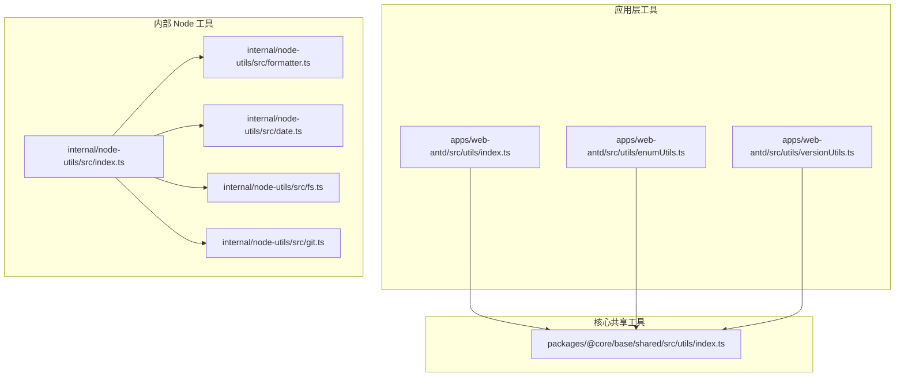
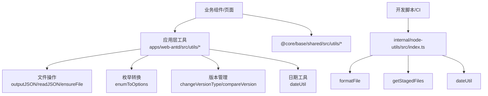

# 工具函数API

<cite>
**本文档引用的文件**
- [apps/web-antd/src/utils/index.ts](file://apps/web-antd/src/utils/index.ts)
- [apps/web-antd/src/utils/enumUtils.ts](file://apps/web-antd/src/utils/enumUtils.ts)
- [apps/web-antd/src/utils/versionUtils.ts](file://apps/web-antd/src/utils/versionUtils.ts)
- [internal/node-utils/src/index.ts](file://internal/node-utils/src/index.ts)
- [internal/node-utils/src/formatter.ts](file://internal/node-utils/src/formatter.ts)
- [internal/node-utils/src/date.ts](file://internal/node-utils/src/date.ts)
- [internal/node-utils/src/fs.ts](file://internal/node-utils/src/fs.ts)
- [internal/node-utils/src/git.ts](file://internal/node-utils/src/git.ts)
- [packages/@core/base/shared/src/utils/index.ts](file://packages/@core/base/shared/src/utils/index.ts)
- [packages/@core/base/shared/src/utils/__tests__/date.test.ts](file://packages/@core/base/shared/src/utils/__tests__/date.test.ts)
</cite>

## 目录

1. [简介](#简介)
2. [项目结构](#项目结构)
3. [核心组件](#核心组件)
4. [架构总览](#架构总览)
5. [详细组件分析](#详细组件分析)
6. [依赖分析](#依赖分析)
7. [性能考虑](#性能考虑)
8. [故障排除指南](#故障排除指南)
9. [结论](#结论)
10. [附录](#附录)

## 简介

本文件为 Vben Admin 项目的工具函数API文档，覆盖应用层与内部工具库中的实用函数，提供函数签名、参数、返回值、功能描述、适用场景、注意事项、TypeScript 类型定义与泛型使用、性能特征、组合使用模式、最佳实践、错误处理与边界情况、单元测试示例与验证方法，以及版本历史与迁移指南。内容以仓库中实际实现为准，并通过“章节来源”与“图表来源”标注具体文件位置。

## 项目结构

工具函数主要分布在以下位置：

- 应用层工具：apps/web-antd/src/utils
- 内部 Node 工具：internal/node-utils/src
- 核心共享工具：packages/@core/base/shared/src/utils

**图表来源**

- [apps/web-antd/src/utils/index.ts:1-65](file://apps/web-antd/src/utils/index.ts#L1-L65)
- [apps/web-antd/src/utils/enumUtils.ts:1-27](file://apps/web-antd/src/utils/enumUtils.ts#L1-L27)
- [apps/web-antd/src/utils/versionUtils.ts:1-130](file://apps/web-antd/src/utils/versionUtils.ts#L1-L130)
- [internal/node-utils/src/index.ts:1-20](file://internal/node-utils/src/index.ts#L1-L20)
- [internal/node-utils/src/formatter.ts:1-14](file://internal/node-utils/src/formatter.ts#L1-L14)
- [internal/node-utils/src/date.ts:1-13](file://internal/node-utils/src/date.ts#L1-L13)
- [internal/node-utils/src/fs.ts:1-40](file://internal/node-utils/src/fs.ts#L1-L40)
- [internal/node-utils/src/git.ts:1-35](file://internal/node-utils/src/git.ts#L1-L35)
- [packages/@core/base/shared/src/utils/index.ts:1-21](file://packages/@core/base/shared/src/utils/index.ts#L1-L21)

**章节来源**

- [apps/web-antd/src/utils/index.ts:1-65](file://apps/web-antd/src/utils/index.ts#L1-L65)
- [apps/web-antd/src/utils/enumUtils.ts:1-27](file://apps/web-antd/src/utils/enumUtils.ts#L1-L27)
- [apps/web-antd/src/utils/versionUtils.ts:1-130](file://apps/web-antd/src/utils/versionUtils.ts#L1-L130)
- [internal/node-utils/src/index.ts:1-20](file://internal/node-utils/src/index.ts#L1-L20)
- [internal/node-utils/src/formatter.ts:1-14](file://internal/node-utils/src/formatter.ts#L1-L14)
- [internal/node-utils/src/date.ts:1-13](file://internal/node-utils/src/date.ts#L1-L13)
- [internal/node-utils/src/fs.ts:1-40](file://internal/node-utils/src/fs.ts#L1-L40)
- [internal/node-utils/src/git.ts:1-35](file://internal/node-utils/src/git.ts#L1-L35)
- [packages/@core/base/shared/src/utils/index.ts:1-21](file://packages/@core/base/shared/src/utils/index.ts#L1-L21)

## 核心组件

本节对各工具模块的核心函数进行概览性说明，便于快速定位与查阅。

- 应用层工具（web-antd）
  - 通用工具：sleep、filesToUrlString、urlStringToFiles、getFileNameFromUrl、deepClone
  - 枚举工具：enumToOptions
  - 版本工具：changeVersionType、compareVersion
- 内部 Node 工具
  - 导出聚合：index.ts 统一导出常量、日期、格式化、文件系统、Git、路径、Spinner 等能力
  - 格式化：formatFile
  - 日期：dateUtil（基于 dayjs，设置默认时区）
  - 文件系统：outputJSON、ensureFile、readJSON
  - Git：getStagedFiles
- 核心共享工具（@core/base/shared）
  - 工具聚合：导出 cn、date、diff、dom、download、inference、letter、merge、nprogress、resources、stack、state-handler、to、tree、unique、update-css-variables、util、window 等

**章节来源**

- [apps/web-antd/src/utils/index.ts:1-65](file://apps/web-antd/src/utils/index.ts#L1-L65)
- [apps/web-antd/src/utils/enumUtils.ts:1-27](file://apps/web-antd/src/utils/enumUtils.ts#L1-L27)
- [apps/web-antd/src/utils/versionUtils.ts:1-130](file://apps/web-antd/src/utils/versionUtils.ts#L1-L130)
- [internal/node-utils/src/index.ts:1-20](file://internal/node-utils/src/index.ts#L1-L20)
- [internal/node-utils/src/formatter.ts:1-14](file://internal/node-utils/src/formatter.ts#L1-L14)
- [internal/node-utils/src/date.ts:1-13](file://internal/node-utils/src/date.ts#L1-L13)
- [internal/node-utils/src/fs.ts:1-40](file://internal/node-utils/src/fs.ts#L1-L40)
- [internal/node-utils/src/git.ts:1-35](file://internal/node-utils/src/git.ts#L1-L35)
- [packages/@core/base/shared/src/utils/index.ts:1-21](file://packages/@core/base/shared/src/utils/index.ts#L1-L21)

## 架构总览

工具函数在项目中的角色与交互如下：

**图表来源**

- [apps/web-antd/src/utils/index.ts:1-65](file://apps/web-antd/src/utils/index.ts#L1-L65)
- [apps/web-antd/src/utils/enumUtils.ts:1-27](file://apps/web-antd/src/utils/enumUtils.ts#L1-L27)
- [apps/web-antd/src/utils/versionUtils.ts:1-130](file://apps/web-antd/src/utils/versionUtils.ts#L1-L130)
- [internal/node-utils/src/index.ts:1-20](file://internal/node-utils/src/index.ts#L1-L20)
- [internal/node-utils/src/formatter.ts:1-14](file://internal/node-utils/src/formatter.ts#L1-L14)
- [internal/node-utils/src/git.ts:1-35](file://internal/node-utils/src/git.ts#L1-L35)
- [internal/node-utils/src/date.ts:1-13](file://internal/node-utils/src/date.ts#L1-L13)
- [packages/@core/base/shared/src/utils/index.ts:1-21](file://packages/@core/base/shared/src/utils/index.ts#L1-L21)

## 详细组件分析

### 应用层工具（apps/web-antd/src/utils）

#### 通用工具

- 函数：sleep(ms: number)
  - 功能：等待指定毫秒数
  - 参数：ms（等待时间，毫秒）
  - 返回：Promise<void>
  - 使用场景：异步流程控制、延迟触发
  - 注意事项：避免过长阻塞UI线程；建议配合超时机制
  - 性能特征：O(1)，轻量级
  - 错误处理：无显式错误；异常由底层定时器处理
  - 边界情况：传入负数或 NaN 可能导致不可预期行为
  - 组合使用：与 Promise.all 并行控制、与 fetch 超时结合
  - 最佳实践：优先使用微任务/宏任务解耦，必要时才使用 sleep
  - 单元测试：可模拟定时器验证时序
  - 版本历史与迁移：无重大变更记录

- 函数：filesToUrlString(fileList: any)
  - 功能：将文件数组转换为逗号分隔的 URL 字符串
  - 参数：fileList（文件数组，过滤 done 状态）
  - 返回：string（逗号分隔的 URL 列表）
  - 使用场景：表单提交、批量下载链接拼装
  - 注意事项：仅处理 status == 'done' 的条目；URL 来源优先 response.url
  - 性能特征：O(n)
  - 错误处理：空输入返回空字符串
  - 边界情况：空数组、null、undefined 处理
  - 组合使用：与 urlStringToFiles 双向转换
  - 最佳实践：统一状态管理，避免混用不同字段
  - 单元测试：覆盖空数组、部分 done、多 URL 场景
  - 版本历史与迁移：无重大变更记录

- 函数：urlStringToFiles(urlString: string): any[]
  - 功能：将逗号分隔的字符串转换为文件数组
  - 参数：urlString（字符串）
  - 返回：any[]（文件对象数组）
  - 使用场景：回填表单、预览列表
  - 注意事项：若输入为数组则直接返回；对每个 URL 生成标准字段
  - 性能特征：O(n)
  - 错误处理：空输入返回空数组
  - 边界情况：空字符串、重复 URL、无效 URL
  - 组合使用：与 filesToUrlString 对称使用
  - 最佳实践：保持文件对象字段一致性
  - 单元测试：覆盖空、数组、字符串、URL 参数与锚点
  - 版本历史与迁移：无重大变更记录

- 函数：getFileNameFromUrl(url: string): string
  - 功能：从 URL 中提取文件名（去除参数与锚点）
  - 参数：url（字符串）
  - 返回：string（文件名）
  - 使用场景：显示文件名、生成本地文件名
  - 注意事项：空或非字符串返回空；先去参再取最后一段
  - 性能特征：O(1)
  - 错误处理：空输入返回空字符串
  - 边界情况：无斜杠、只有协议、无扩展名
  - 组合使用：与上传组件、下载组件配合
  - 最佳实践：配合正则增强容错
  - 单元测试：覆盖含参数/锚点、无参、无扩展名
  - 版本历史与迁移：无重大变更记录

- 函数：deepClone<T>(obj: T): T
  - 功能：深拷贝对象
  - 参数：obj（泛型 T）
  - 返回：T（深拷贝结果）
  - 使用场景：避免引用污染、隔离数据
  - 注意事项：JSON 序列化限制（函数、undefined、Symbol、Date 等）
  - 性能特征：O(n)（受序列化影响）
  - 错误处理：异常向上抛出
  - 边界情况：循环引用、大对象内存占用
  - 组合使用：与表单、编辑器、状态管理配合
  - 最佳实践：复杂对象优先使用专用库（如 lodash.clonedeep）
  - 单元测试：覆盖普通对象、数组、嵌套结构
  - 版本历史与迁移：无重大变更记录

**章节来源**

- [apps/web-antd/src/utils/index.ts:1-65](file://apps/web-antd/src/utils/index.ts#L1-L65)

#### 枚举工具

- 函数：enumToOptions(enumObj: any, options?: { labelField?: string; valueField?: string }): Array<{ [key: string]: any }>
  - 功能：将数字枚举转换为选项数组
  - 参数：
    - enumObj：任意数字枚举
    - options.labelField：标签字段名，默认 'label'
    - options.valueField：值字段名，默认 'value'
  - 返回：选项数组（每项包含 labelField 与 valueField）
  - 使用场景：下拉框、单选/多选、表单渲染
  - 注意事项：仅过滤非数字键；确保枚举值唯一
  - 性能特征：O(n)
  - 错误处理：无显式错误；异常向上抛出
  - 边界情况：空枚举、键值冲突
  - 组合使用：与表单控件、字典组件配合
  - 最佳实践：统一 label/value 字段命名
  - 单元测试：覆盖空枚举、自定义字段
  - 版本历史与迁移：无重大变更记录

**章节来源**

- [apps/web-antd/src/utils/enumUtils.ts:1-27](file://apps/web-antd/src/utils/enumUtils.ts#L1-L27)

#### 版本工具

- 函数：changeVersionType(oldVersion: string, type: VersionUpdateType): string
  - 功能：根据更新类型递增版本号
  - 参数：
    - oldVersion：旧版本号（x.y.z）
    - type：更新类型（'0' | '10' | '20'，分别表示主版本/次版本/修订）
  - 返回：新的版本号（x.y.z）
  - 使用场景：发布流程、版本升级策略
  - 注意事项：非法版本号或不支持类型会抛出错误
  - 性能特征：O(1)
  - 错误处理：非法格式抛错；类型校验由 TS 保障
  - 边界情况：0.0.0、最大整数溢出（由 Number 限制）
  - 组合使用：与 compareVersion、发布脚本配合
  - 最佳实践：统一版本格式；在 CI 中校验
  - 单元测试：覆盖非法格式、三种类型、边界值
  - 版本历史与迁移：无重大变更记录

- 函数：compareVersion(v1: string, v2: string): number
  - 功能：比较两个版本号
  - 参数：v1、v2（版本号，支持 x.y.z...）
  - 返回：1（v1>v2）、-1（v1<v2）、0（相等）
  - 使用场景：版本判断、兼容性检查
  - 注意事项：自动补齐位数；严格按段比较
  - 性能特征：O(max(len1, len2))
  - 错误处理：无显式错误；异常向上抛出
  - 边界情况：长度不等、前导零、非数字段
  - 组合使用：与 changeVersionType、发布策略配合
  - 最佳实践：统一格式；避免混合语义版本
  - 单元测试：覆盖相等、大小、长度不等
  - 版本历史与迁移：无重大变更记录

**章节来源**

- [apps/web-antd/src/utils/versionUtils.ts:1-130](file://apps/web-antd/src/utils/versionUtils.ts#L1-L130)

### 内部 Node 工具（internal/node-utils/src）

#### 聚合导出（index.ts）

- 功能：统一导出常量、日期、格式化、文件系统、Git、路径、Spinner 等
- 使用场景：开发脚本、构建工具、CI/CD
- 注意事项：注意导出符号的可用性与版本差异
- 性能特征：按需导入，开销极低
- 错误处理：依赖被导出模块的错误处理
- 边界情况：缺失依赖时运行时报错
- 组合使用：与 execa、chalk、consola 等生态配合
- 最佳实践：集中管理依赖版本
- 单元测试：无直接单元测试文件
- 版本历史与迁移：无重大变更记录

**章节来源**

- [internal/node-utils/src/index.ts:1-20](file://internal/node-utils/src/index.ts#L1-L20)

#### 格式化工具（formatter.ts）

- 函数：formatFile(filepath: string): Promise<string>
  - 功能：调用外部格式化工具（oxfmt）格式化文件并读取结果
  - 参数：filepath（文件路径）
  - 返回：Promise<string>（格式化后的内容）
  - 使用场景：代码格式化、文档生成后处理
  - 注意事项：需要系统安装 oxfmt；stdio 继承可能影响日志
  - 性能特征：I/O 密集；耗时取决于文件大小
  - 错误处理：格式化失败或读取失败抛错
  - 边界情况：不存在文件、权限不足
  - 组合使用：与构建流程、CI 格式化钩子配合
  - 最佳实践：在本地与 CI 中统一格式化工具链
  - 单元测试：无直接单元测试文件
  - 版本历史与迁移：无重大变更记录

**章节来源**

- [internal/node-utils/src/formatter.ts:1-14](file://internal/node-utils/src/formatter.ts#L1-L14)

#### 日期工具（date.ts）

- 功能：基于 dayjs 扩展 UTC 与时区插件，默认时区设为 Asia/Shanghai
- 使用场景：统一日期处理、时区转换
- 注意事项：全局默认时区会影响依赖 dayjs 的模块
- 性能特征：初始化开销小；后续操作 O(1)
- 错误处理：依赖 dayjs 的错误处理
- 边界情况：夏令时、闰年、月末
- 组合使用：与 @core/base/shared 的 date 工具配合
- 最佳实践：在应用入口统一初始化
- 单元测试：无直接单元测试文件
- 版本历史与迁移：无重大变更记录

**章节来源**

- [internal/node-utils/src/date.ts:1-13](file://internal/node-utils/src/date.ts#L1-L13)

#### 文件系统工具（fs.ts）

- 函数：outputJSON(filePath: string, data: any, spaces?: number): Promise<void>
  - 功能：确保目录存在并写入 JSON 文件
  - 参数：filePath、data、spaces（缩进空格数，默认 2）
  - 返回：Promise<void>
  - 使用场景：缓存、配置、产物输出
  - 注意事项：异常向上抛出；spaces 影响文件体积
  - 性能特征：I/O 密集；大对象序列化耗时
  - 错误处理：捕获并记录错误后抛出
  - 边界情况：权限不足、磁盘空间不足
  - 组合使用：与构建脚本、数据持久化配合
  - 最佳实践：合理设置 spaces；避免频繁写入
  - 单元测试：无直接单元测试文件
  - 版本历史与迁移：无重大变更记录

- 函数：ensureFile(filePath: string): Promise<void>
  - 功能：确保文件存在（不存在则创建空文件）
  - 参数：filePath
  - 返回：Promise<void>
  - 使用场景：占位文件、锁文件、标记文件
  - 注意事项：异常向上抛出
  - 性能特征：I/O 密集
  - 错误处理：捕获并记录错误后抛出
  - 边界情况：父目录不可写
  - 组合使用：与构建流程、CI 钩子配合
  - 最佳实践：配合 outputJSON 使用
  - 单元测试：无直接单元测试文件
  - 版本历史与迁移：无重大变更记录

- 函数：readJSON(filePath: string): Promise<any>
  - 功能：读取并解析 JSON 文件
  - 参数：filePath
  - 返回：Promise<any>
  - 使用场景：配置读取、缓存加载
  - 注意事项：异常向上抛出
  - 性能特征：I/O 密集
  - 错误处理：捕获并记录错误后抛出
  - 边界情况：文件不存在、JSON 语法错误
  - 组合使用：与 outputJSON 对称使用
  - 最佳实践：统一编码与异常处理
  - 单元测试：无直接单元测试文件
  - 版本历史与迁移：无重大变更记录

**章节来源**

- [internal/node-utils/src/fs.ts:1-40](file://internal/node-utils/src/fs.ts#L1-L40)

#### Git 工具（git.ts）

- 函数：getStagedFiles(): Promise<string[]>
  - 功能：获取 Git 暂存区文件列表（绝对路径去重）
  - 参数：无
  - 返回：Promise<string[]>（文件路径数组）
  - 使用场景：变更检测、提交前校验
  - 注意事项：异常时返回空数组；依赖 git 命令可用性
  - 性能特征：I/O 密集；文件数量较多时耗时增加
  - 错误处理：捕获并记录错误后返回空数组
  - 边界情况：无暂存文件、子模块、工作树状态
  - 组合使用：与 CI、提交钩子配合
  - 最佳实践：在 CI 中启用子模块递归关闭
  - 单元测试：无直接单元测试文件
  - 版本历史与迁移：无重大变更记录

**章节来源**

- [internal/node-utils/src/git.ts:1-35](file://internal/node-utils/src/git.ts#L1-L35)

### 核心共享工具（@core/base/shared/src/utils）

- 功能：导出大量通用工具（cn、date、diff、dom、download、inference、letter、merge、nprogress、resources、stack、state-handler、to、tree、unique、update-css-variables、util、window），并重定向部分工具（如 get、isEqual、set、cloneDeep）
- 使用场景：跨框架/组件复用、通用逻辑封装
- 注意事项：关注导出符号的稳定性与版本差异
- 性能特征：按需导入，开销极低
- 错误处理：依赖被导出模块的错误处理
- 边界情况：第三方库版本差异
- 组合使用：与 UI 框架、状态管理、网络请求配合
- 最佳实践：集中管理依赖版本
- 单元测试：无直接单元测试文件
- 版本历史与迁移：无重大变更记录

**章节来源**

- [packages/@core/base/shared/src/utils/index.ts:1-21](file://packages/@core/base/shared/src/utils/index.ts#L1-L21)

## 依赖分析

**图表来源**

- [apps/web-antd/src/utils/index.ts:1-65](file://apps/web-antd/src/utils/index.ts#L1-L65)
- [apps/web-antd/src/utils/enumUtils.ts:1-27](file://apps/web-antd/src/utils/enumUtils.ts#L1-L27)
- [apps/web-antd/src/utils/versionUtils.ts:1-130](file://apps/web-antd/src/utils/versionUtils.ts#L1-L130)
- [internal/node-utils/src/index.ts:1-20](file://internal/node-utils/src/index.ts#L1-L20)
- [internal/node-utils/src/formatter.ts:1-14](file://internal/node-utils/src/formatter.ts#L1-L14)
- [internal/node-utils/src/date.ts:1-13](file://internal/node-utils/src/date.ts#L1-L13)
- [internal/node-utils/src/fs.ts:1-40](file://internal/node-utils/src/fs.ts#L1-L40)
- [internal/node-utils/src/git.ts:1-35](file://internal/node-utils/src/git.ts#L1-L35)
- [packages/@core/base/shared/src/utils/index.ts:1-21](file://packages/@core/base/shared/src/utils/index.ts#L1-L21)

**章节来源**

- [apps/web-antd/src/utils/index.ts:1-65](file://apps/web-antd/src/utils/index.ts#L1-L65)
- [apps/web-antd/src/utils/enumUtils.ts:1-27](file://apps/web-antd/src/utils/enumUtils.ts#L1-L27)
- [apps/web-antd/src/utils/versionUtils.ts:1-130](file://apps/web-antd/src/utils/versionUtils.ts#L1-L130)
- [internal/node-utils/src/index.ts:1-20](file://internal/node-utils/src/index.ts#L1-L20)
- [internal/node-utils/src/formatter.ts:1-14](file://internal/node-utils/src/formatter.ts#L1-L14)
- [internal/node-utils/src/date.ts:1-13](file://internal/node-utils/src/date.ts#L1-L13)
- [internal/node-utils/src/fs.ts:1-40](file://internal/node-utils/src/fs.ts#L1-L40)
- [internal/node-utils/src/git.ts:1-35](file://internal/node-utils/src/git.ts#L1-L35)
- [packages/@core/base/shared/src/utils/index.ts:1-21](file://packages/@core/base/shared/src/utils/index.ts#L1-L21)

## 性能考虑

- I/O 密集型函数（formatFile、outputJSON、ensureFile、readJSON、getStagedFiles）应避免在热路径频繁调用，建议：
  - 合理缓存中间结果
  - 批量处理而非逐个处理
  - 在后台线程或 Worker 中执行
- CPU 密集型函数（deepClone、compareVersion）应注意：
  - 大对象深拷贝成本高，优先使用结构化克隆或专用库
  - 版本比较可预处理为数组，减少重复计算
- 异步控制（sleep）：
  - 避免长时间阻塞主线程；使用微任务/宏任务解耦
- 依赖库：
  - dayjs、execa、chalk、consola 等库的版本升级可能影响行为，建议锁定版本并定期审计

## 故障排除指南

- 格式化失败（formatFile）
  - 现象：抛错或返回空内容
  - 排查：确认 oxfmt 安装与 PATH；检查文件权限
  - 修复：安装 oxfmt 或降级到其他格式化方案
- 文件系统错误（outputJSON/ensureFile/readJSON）
  - 现象：抛错并记录错误日志
  - 排查：磁盘空间、权限、路径有效性
  - 修复：修正权限或路径；清理磁盘空间
- Git 命令失败（getStagedFiles）
  - 现象：返回空数组
  - 排查：git 是否可用、子模块配置、工作树状态
  - 修复：安装 git；调整子模块递归设置
- 版本号非法（changeVersionType）
  - 现象：抛出错误
  - 排查：格式是否为 x.y.z；type 是否为 '0'|'10'|'20'
  - 修复：规范化输入；在调用前校验
- 深拷贝异常（deepClone）
  - 现象：抛错或结果异常
  - 排查：对象是否包含不可序列化成员
  - 修复：使用专用深拷贝库或移除不可序列化成员

**章节来源**

- [internal/node-utils/src/formatter.ts:1-14](file://internal/node-utils/src/formatter.ts#L1-L14)
- [internal/node-utils/src/fs.ts:1-40](file://internal/node-utils/src/fs.ts#L1-L40)
- [internal/node-utils/src/git.ts:1-35](file://internal/node-utils/src/git.ts#L1-L35)
- [apps/web-antd/src/utils/versionUtils.ts:1-130](file://apps/web-antd/src/utils/versionUtils.ts#L1-L130)
- [apps/web-antd/src/utils/index.ts:1-65](file://apps/web-antd/src/utils/index.ts#L1-L65)

## 结论

本工具函数API文档梳理了应用层、内部 Node 工具与核心共享工具中的关键函数，提供了类型定义、使用场景、注意事项、性能与错误处理建议，并给出了组合使用模式与最佳实践。建议在团队内统一规范调用方式与错误处理策略，确保在多框架与多环境下的一致性与可靠性。

## 附录

### 单元测试示例与验证方法

- 应用层工具
  - enumToOptions：验证空枚举、自定义 label/value 字段
  - changeVersionType：验证非法格式、三种类型、边界值
  - compareVersion：验证相等、大小、长度不等
  - urlStringToFiles/filesToUrlString：验证空、数组、字符串、URL 参数与锚点
  - getFileNameFromUrl：验证含参/锚点、无参、无扩展名
  - deepClone：验证普通对象、数组、嵌套结构
- 内部工具
  - formatFile：验证文件存在、权限、格式化工具可用性
  - outputJSON/ensureFile/readJSON：验证 I/O 成功与异常分支
  - getStagedFiles：验证暂存文件列表、异常返回空数组

**章节来源**

- [packages/@core/base/shared/src/utils/**tests**/date.test.ts:1-55](file://packages/@core/base/shared/src/utils/__tests__/date.test.ts#L1-L55)

### 版本历史与迁移指南

- 当前仓库未发现针对上述工具函数的版本变更记录或迁移指南文件。建议：
  - 在新增或修改函数时补充变更日志
  - 对破坏性变更提供迁移步骤
  - 在 CI 中加入 API 文档一致性检查
