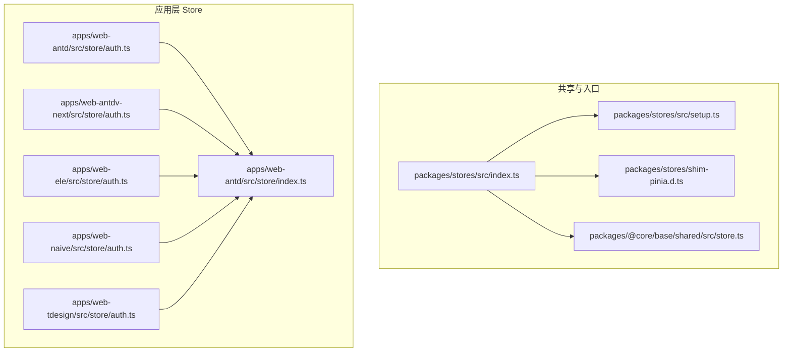
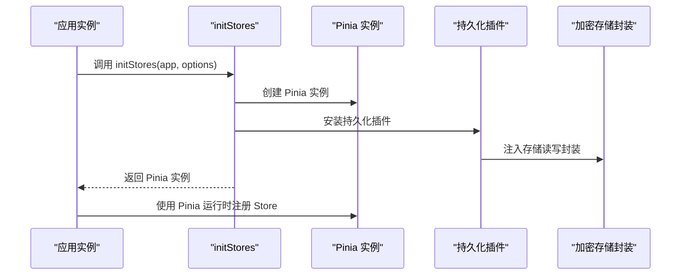
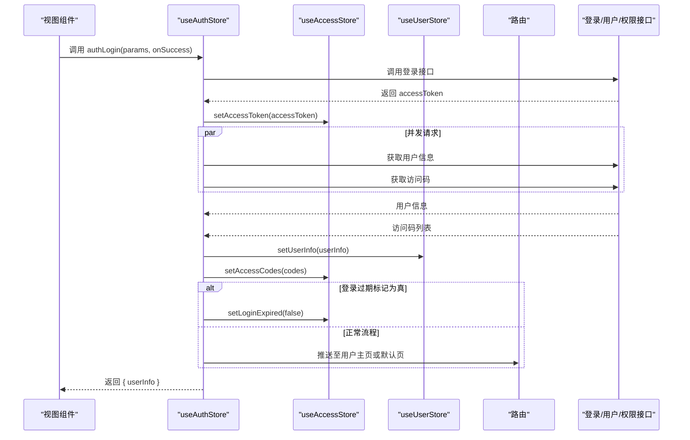
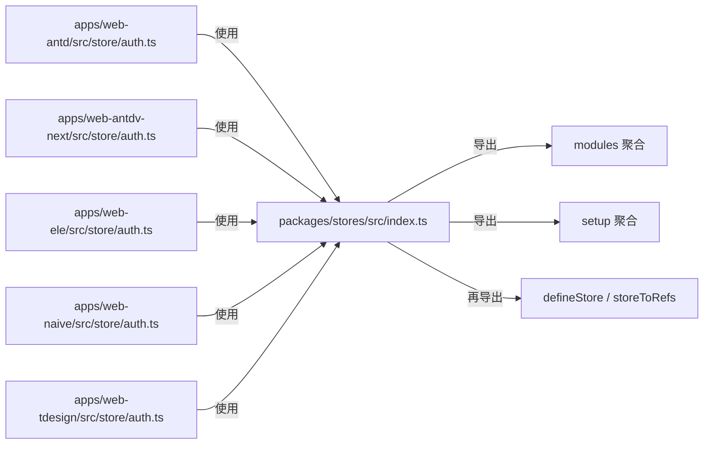
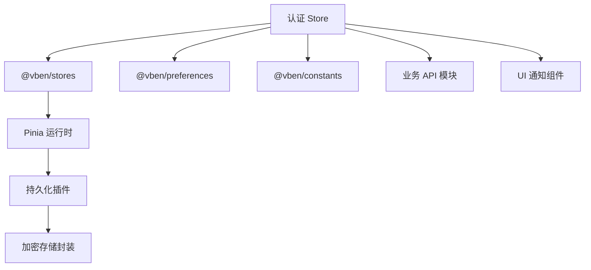

# Store类型定义

<cite>
**本文引用的文件**
- [packages/stores/src/index.ts](file://packages/stores/src/index.ts)
- [packages/stores/src/setup.ts](file://packages/stores/src/setup.ts)
- [packages/stores/shim-pinia.d.ts](file://packages/stores/shim-pinia.d.ts)
- [packages/@core/base/shared/src/store.ts](file://packages/@core/base/shared/src/store.ts)
- [apps/web-antd/src/store/auth.ts](file://apps/web-antd/src/store/auth.ts)
- [apps/web-antd/src/store/index.ts](file://apps/web-antd/src/store/index.ts)
- [apps/web-antdv-next/src/store/auth.ts](file://apps/web-antdv-next/src/store/auth.ts)
- [apps/web-ele/src/store/auth.ts](file://apps/web-ele/src/store/auth.ts)
- [apps/web-naive/src/store/auth.ts](file://apps/web-naive/src/store/auth.ts)
- [apps/web-tdesign/src/store/auth.ts](file://apps/web-tdesign/src/store/auth.ts)
</cite>

## 目录
1. [简介](#简介)
2. [项目结构](#项目结构)
3. [核心组件](#核心组件)
4. [架构总览](#架构总览)
5. [详细组件分析](#详细组件分析)
6. [依赖分析](#依赖分析)
7. [性能考虑](#性能考虑)
8. [故障排查指南](#故障排查指南)
9. [结论](#结论)
10. [附录](#附录)

## 简介
本文件聚焦于 Vben Admin 的 Store 类型定义与使用规范，系统性梳理基于 Pinia 的组合式 Store 模块化组织、类型安全的定义方式、与 Vue 3 Composition API 的集成模式，并给出类型推断与泛型使用的高级技巧、扩展与自定义指南。内容以仓库中实际存在的 Store 文件与入口为依据，避免臆测，确保可追溯。

## 项目结构
Vben Admin 在多套 UI 框架（Ant Design、Element Plus、Naive UI、TDesign）下提供了统一的 Store 入口与初始化逻辑，同时在各应用内提供独立的业务 Store 实现。关键位置如下：
- 统一 Store 入口与导出：packages/stores/src/index.ts
- Pinia 初始化与持久化插件注入：packages/stores/src/setup.ts
- Pinia HMR 类型增强：packages/stores/shim-pinia.d.ts
- 共享层对底层 Store 库的再导出：packages/@core/base/shared/src/store.ts
- 各应用的认证 Store 实现：apps/web-*/src/store/auth.ts
- 各应用 Store 导出聚合：apps/web-*/src/store/index.ts

图表来源
- [packages/stores/src/index.ts:1-4](file://packages/stores/src/index.ts#L1-L4)
- [packages/stores/src/setup.ts:39-81](file://packages/stores/src/setup.ts#L39-L81)
- [packages/stores/shim-pinia.d.ts:1-9](file://packages/stores/shim-pinia.d.ts#L1-L9)
- [packages/@core/base/shared/src/store.ts:1-1](file://packages/@core/base/shared/src/store.ts#L1-L1)
- [apps/web-antd/src/store/auth.ts:16-118](file://apps/web-antd/src/store/auth.ts#L16-L118)
- [apps/web-antd/src/store/index.ts:1-2](file://apps/web-antd/src/store/index.ts#L1-L2)
- [apps/web-antdv-next/src/store/auth.ts:16-118](file://apps/web-antdv-next/src/store/auth.ts#L16-L118)
- [apps/web-ele/src/store/auth.ts:16-119](file://apps/web-ele/src/store/auth.ts#L16-L119)
- [apps/web-naive/src/store/auth.ts:16-119](file://apps/web-naive/src/store/auth.ts#L16-L119)
- [apps/web-tdesign/src/store/auth.ts:16-117](file://apps/web-tdesign/src/store/auth.ts#L16-L117)

章节来源
- [packages/stores/src/index.ts:1-4](file://packages/stores/src/index.ts#L1-L4)
- [packages/stores/src/setup.ts:39-81](file://packages/stores/src/setup.ts#L39-L81)
- [packages/stores/shim-pinia.d.ts:1-9](file://packages/stores/shim-pinia.d.ts#L1-L9)
- [packages/@core/base/shared/src/store.ts:1-1](file://packages/@core/base/shared/src/store.ts#L1-L1)
- [apps/web-antd/src/store/auth.ts:16-118](file://apps/web-antd/src/store/auth.ts#L16-L118)
- [apps/web-antd/src/store/index.ts:1-2](file://apps/web-antd/src/store/index.ts#L1-L2)
- [apps/web-antdv-next/src/store/auth.ts:16-118](file://apps/web-antdv-next/src/store/auth.ts#L16-L118)
- [apps/web-ele/src/store/auth.ts:16-119](file://apps/web-ele/src/store/auth.ts#L16-L119)
- [apps/web-naive/src/store/auth.ts:16-119](file://apps/web-naive/src/store/auth.ts#L16-L119)
- [apps/web-tdesign/src/store/auth.ts:16-117](file://apps/web-tdesign/src/store/auth.ts#L16-L117)

## 核心组件
- Store 入口与导出
  - 统一导出模块与工具：packages/stores/src/index.ts 提供模块聚合导出与 Pinia 工具函数再导出。
  - 关键导出：export * from './modules'; export * from './setup'; export { defineStore, storeToRefs } from 'pinia';

- Pinia 初始化与持久化
  - 初始化函数：initStores(app, options) 创建 Pinia 实例并安装持久化插件；支持开发环境使用 localStorage，生产环境使用加密存储封装。
  - 重置能力：resetAllStores() 遍历已注册 Store 并调用 $reset()。

- Pinia HMR 类型增强
  - 通过声明合并为 Pinia 增加 acceptHMRUpdate 类型签名，提升热更新场景下的类型安全性。

- 共享层 Store 再导出
  - packages/@core/base/shared/src/store.ts 对底层 Store 库进行再导出，便于上层按需引入。

章节来源
- [packages/stores/src/index.ts:1-4](file://packages/stores/src/index.ts#L1-L4)
- [packages/stores/src/setup.ts:39-81](file://packages/stores/src/setup.ts#L39-L81)
- [packages/stores/shim-pinia.d.ts:1-9](file://packages/stores/shim-pinia.d.ts#L1-L9)
- [packages/@core/base/shared/src/store.ts:1-1](file://packages/@core/base/shared/src/store.ts#L1-L1)

## 架构总览
Vben Admin 的 Store 架构围绕“统一入口 + 多框架适配”的思路设计：
- 统一入口负责 Pinia 初始化、持久化策略与类型增强；
- 各应用层 Store 负责业务域 Store 的具体实现；
- 通过 defineStore 返回的 Store 实例，结合 Composition API 的响应式能力，完成状态管理与 UI 更新。

图表来源
- [packages/stores/src/setup.ts:39-81](file://packages/stores/src/setup.ts#L39-L81)

## 详细组件分析

### 认证 Store（useAuthStore）类型与行为
- Store 名称与返回值
  - Store 名称：'auth'
  - 返回对象包含：$reset、authLogin(params, onSuccess?)、fetchUserInfo()、loginLoading（ref）、logout(redirect?)
- 参数与返回类型要点
  - authLogin(params: Recordable<any>, onSuccess?: () => Promise<void> | void)
  - fetchUserInfo(): Promise<UserInfo>
  - logout(redirect?: boolean): Promise<void>
  - loginLoading: ref<boolean>
  - $reset(): 重置登录加载状态
- 与外部 Store 的协作
  - 依赖 useAccessStore 与 useUserStore，用于访问令牌与用户信息的同步。
  - 依赖 resetAllStores，在登出时重置所有 Store。
- 与路由、通知、国际化等的交互
  - 登录成功后根据用户主页或默认首页进行路由跳转。
  - 登录成功后触发通知提示。
  - 使用 $t 进行国际化文案展示。

图表来源
- [apps/web-antd/src/store/auth.ts:28-78](file://apps/web-antd/src/store/auth.ts#L28-L78)
- [apps/web-antd/src/store/auth.ts:100-104](file://apps/web-antd/src/store/auth.ts#L100-L104)
- [apps/web-antd/src/store/auth.ts:80-98](file://apps/web-antd/src/store/auth.ts#L80-L98)

章节来源
- [apps/web-antd/src/store/auth.ts:16-118](file://apps/web-antd/src/store/auth.ts#L16-L118)
- [apps/web-antdv-next/src/store/auth.ts:16-118](file://apps/web-antdv-next/src/store/auth.ts#L16-L118)
- [apps/web-ele/src/store/auth.ts:16-119](file://apps/web-ele/src/store/auth.ts#L16-L119)
- [apps/web-naive/src/store/auth.ts:16-119](file://apps/web-naive/src/store/auth.ts#L16-L119)
- [apps/web-tdesign/src/store/auth.ts:16-117](file://apps/web-tdesign/src/store/auth.ts#L16-L117)

### Store 模块化组织与导入导出机制
- 统一入口导出
  - packages/stores/src/index.ts 聚合导出 modules 与 setup，并再导出 defineStore 与 storeToRefs。
- 应用层导出
  - 各应用的 apps/web-*/src/store/index.ts 仅导出该应用内的业务 Store（如 useAuthStore），形成“按应用聚合”的模块边界。
- 共享依赖
  - 各应用 Store 通过 @vben/stores 引用统一入口，从而获得统一的 Pinia 实例与工具。

图表来源
- [packages/stores/src/index.ts:1-4](file://packages/stores/src/index.ts#L1-L4)
- [apps/web-antd/src/store/index.ts:1-2](file://apps/web-antd/src/store/index.ts#L1-L2)
- [apps/web-antdv-next/src/store/index.ts:1-2](file://apps/web-antdv-next/src/store/index.ts#L1-L2)
- [apps/web-ele/src/store/index.ts:1-2](file://apps/web-ele/src/store/index.ts#L1-L2)
- [apps/web-naive/src/store/index.ts:1-2](file://apps/web-naive/src/store/index.ts#L1-L2)
- [apps/web-tdesign/src/store/index.ts:1-2](file://apps/web-tdesign/src/store/index.ts#L1-L2)

章节来源
- [packages/stores/src/index.ts:1-4](file://packages/stores/src/index.ts#L1-L4)
- [apps/web-antd/src/store/index.ts:1-2](file://apps/web-antd/src/store/index.ts#L1-L2)
- [apps/web-antdv-next/src/store/index.ts:1-2](file://apps/web-antdv-next/src/store/index.ts#L1-L2)
- [apps/web-ele/src/store/index.ts:1-2](file://apps/web-ele/src/store/index.ts#L1-L2)
- [apps/web-naive/src/store/index.ts:1-2](file://apps/web-naive/src/store/index.ts#L1-L2)
- [apps/web-tdesign/src/store/index.ts:1-2](file://apps/web-tdesign/src/store/index.ts#L1-L2)

### 类型安全与 Composition API 集成
- defineStore 返回值的类型推断
  - 返回值为一个包含状态与方法的对象，其类型由返回值字面量推断；在 TypeScript 中可直接获得方法签名与状态类型。
- storeToRefs 的作用
  - 将 Store 返回对象中的响应式状态解构为独立的 ref，便于在模板中直接使用且保持响应性。
- 响应式状态与副作用
  - loginLoading 为 ref<boolean>，在登录流程中作为加载态标志；$reset 将其复位，保证组件卸载或重新进入时的状态一致性。

章节来源
- [packages/stores/src/index.ts:3-3](file://packages/stores/src/index.ts#L3-L3)
- [apps/web-antd/src/store/auth.ts:21-21](file://apps/web-antd/src/store/auth.ts#L21-L21)
- [apps/web-antd/src/store/auth.ts:106-108](file://apps/web-antd/src/store/auth.ts#L106-L108)

### 类型推断与泛型使用高级技巧
- 使用返回值字面量推断
  - defineStore 的回调返回对象即为 Store 实例的类型来源，可直接获得状态与方法的完整类型信息。
- 结合 storeToRefs 解构
  - 将返回对象中的 ref 状态解构为独立 ref，便于在模板与组合函数中直接消费。
- 泛型约束与 Recordable
  - 参数 params 使用 Recordable<any> 表达“可索引对象”，在不牺牲灵活性的同时保留基本的键值访问能力；若需更强约束，可在业务 Store 层进一步细化为具体接口。

章节来源
- [apps/web-antd/src/store/auth.ts:28-31](file://apps/web-antd/src/store/auth.ts#L28-L31)
- [apps/web-antd/src/store/auth.ts:110-116](file://apps/web-antd/src/store/auth.ts#L110-L116)

### 扩展方法与自定义类型创建指南
- 新增业务 Store
  - 在对应应用的 store 目录下新增文件，使用 defineStore 定义 Store，并在该应用的 store/index.ts 中导出。
  - 若需跨应用共享，建议在 @vben/stores 下新增模块并在 index.ts 中聚合导出。
- 自定义类型
  - 将通用类型定义放入 @vben/types 或共享类型包中，避免重复定义。
  - 在 Store 中优先使用已定义的接口，减少类型漂移。
- 持久化策略
  - 通过 initStores 的 options.namespace 区分不同应用的持久化键前缀，避免冲突。
  - 生产环境使用加密存储封装，开发环境使用 localStorage，确保本地调试与线上一致性的平衡。

章节来源
- [packages/stores/src/setup.ts:32-37](file://packages/stores/src/setup.ts#L32-L37)
- [packages/stores/src/setup.ts:52-67](file://packages/stores/src/setup.ts#L52-L67)

## 依赖分析
- 组件耦合与内聚
  - 认证 Store 内聚于登录、登出、用户信息获取等业务逻辑，与路由、通知、偏好设置等存在横向依赖，但通过 @vben/stores 与 @vben/preferences 等统一入口解耦。
- 直接与间接依赖
  - 认证 Store 直接依赖：@vben/stores（统一入口）、@vben/preferences（偏好设置）、@vben/constants（常量）、API 模块、UI 通知组件。
  - 间接依赖：Pinia 运行时、持久化插件、加密存储封装。
- 循环依赖风险
  - Store 之间通过统一入口与工具函数协作，避免直接相互引用导致循环依赖。
- 外部依赖与集成点
  - Pinia 作为状态容器；持久化插件提供跨刷新的状态恢复；加密存储封装保障生产环境数据安全。

图表来源
- [apps/web-antd/src/store/auth.ts:6-14](file://apps/web-antd/src/store/auth.ts#L6-L14)
- [packages/stores/src/setup.ts:42-67](file://packages/stores/src/setup.ts#L42-L67)

章节来源
- [apps/web-antd/src/store/auth.ts:6-14](file://apps/web-antd/src/store/auth.ts#L6-L14)
- [packages/stores/src/setup.ts:42-67](file://packages/stores/src/setup.ts#L42-L67)

## 性能考虑
- 并发请求优化
  - 登录成功后并发拉取用户信息与访问码，减少总耗时，提升用户体验。
- 状态粒度控制
  - 将登录加载态 loginLoading 放置于认证 Store，避免在多个 Store 间重复维护相同状态。
- 持久化策略
  - 开发环境使用 localStorage，生产环境使用加密存储封装，兼顾调试效率与数据安全。
- 组件渲染优化
  - 使用 storeToRefs 将状态解构为独立 ref，降低不必要的响应式追踪开销。

章节来源
- [apps/web-antd/src/store/auth.ts:43-46](file://apps/web-antd/src/store/auth.ts#L43-L46)
- [packages/stores/src/setup.ts:56-67](file://packages/stores/src/setup.ts#L56-L67)

## 故障排查指南
- Pinia 未安装
  - resetAllStores() 在未安装 Pinia 时会输出错误日志，需确认 initStores 是否正确执行。
- 持久化键冲突
  - 通过 options.namespace 区分不同应用的持久化键前缀，避免跨应用状态污染。
- HMR 类型问题
  - 使用 shim-pinia.d.ts 为 Pinia 增强 acceptHMRUpdate 的类型签名，确保热更新场景类型正确。

章节来源
- [packages/stores/src/setup.ts:72-81](file://packages/stores/src/setup.ts#L72-L81)
- [packages/stores/src/setup.ts:32-37](file://packages/stores/src/setup.ts#L32-L37)
- [packages/stores/shim-pinia.d.ts:1-9](file://packages/stores/shim-pinia.d.ts#L1-L9)

## 结论
Vben Admin 的 Store 类型定义遵循“统一入口 + 多框架适配 + 类型安全”的设计原则。通过 defineStore 的返回值字面量推断、storeToRefs 的响应式解构、以及 Pinia 初始化与持久化策略的统一管理，实现了高内聚、低耦合且易于扩展的状态管理体系。结合各应用层 Store 的业务实现，开发者可以在保证类型安全的前提下快速扩展新的业务 Store，并通过统一入口与共享类型库实现跨应用复用。

## 附录
- 最佳实践清单
  - 使用 defineStore 的返回值字面量定义状态与方法，确保类型推断准确。
  - 使用 storeToRefs 解构响应式状态，提升模板与组合函数的可读性。
  - 将通用类型定义集中管理，避免重复与漂移。
  - 通过 initStores 的 namespace 区分持久化键，避免跨应用冲突。
  - 在登出或异常场景调用 resetAllStores，确保全局状态一致性。
- 参考路径
  - 统一入口与导出：[packages/stores/src/index.ts:1-4](file://packages/stores/src/index.ts#L1-L4)
  - 初始化与持久化：[packages/stores/src/setup.ts:39-81](file://packages/stores/src/setup.ts#L39-L81)
  - HMR 类型增强：[packages/stores/shim-pinia.d.ts:1-9](file://packages/stores/shim-pinia.d.ts#L1-L9)
  - 认证 Store 实现（Ant Design）：[apps/web-antd/src/store/auth.ts:16-118](file://apps/web-antd/src/store/auth.ts#L16-L118)
  - 认证 Store 实现（Element Plus）：[apps/web-ele/src/store/auth.ts:16-119](file://apps/web-ele/src/store/auth.ts#L16-L119)
  - 认证 Store 实现（Naive UI）：[apps/web-naive/src/store/auth.ts:16-119](file://apps/web-naive/src/store/auth.ts#L16-L119)
  - 认证 Store 实现（TDesign）：[apps/web-tdesign/src/store/auth.ts:16-117](file://apps/web-tdesign/src/store/auth.ts#L16-L117)
  - 认证 Store 实现（Antdv Next）：[apps/web-antdv-next/src/store/auth.ts:16-118](file://apps/web-antdv-next/src/store/auth.ts#L16-L118)