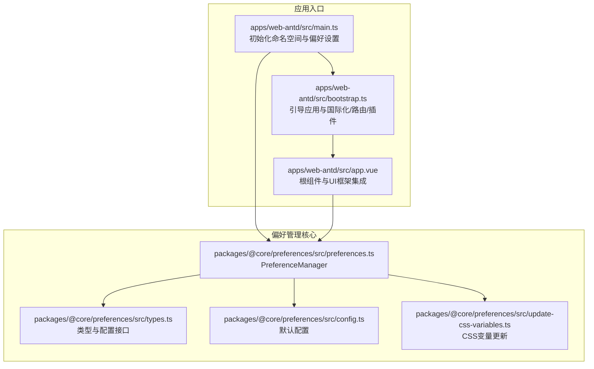
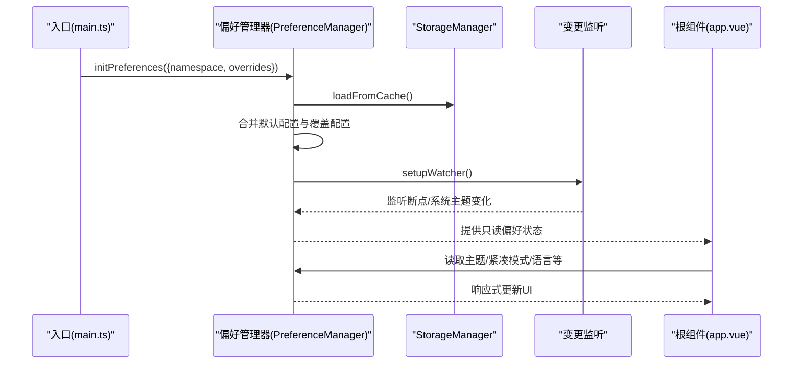
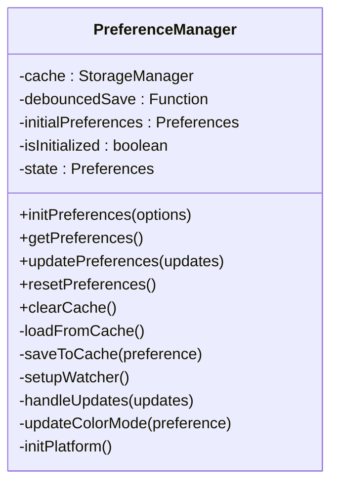
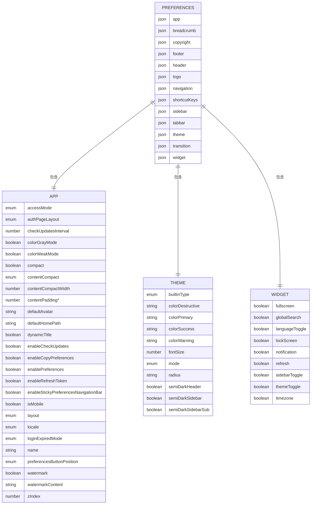
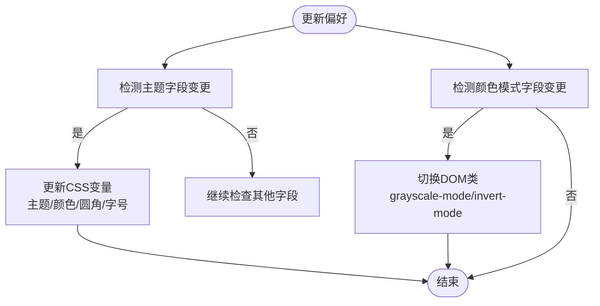
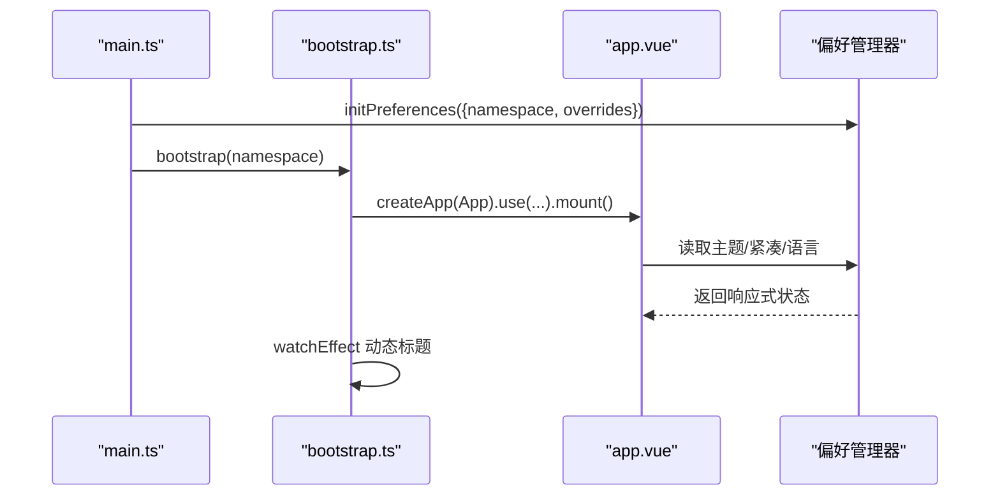
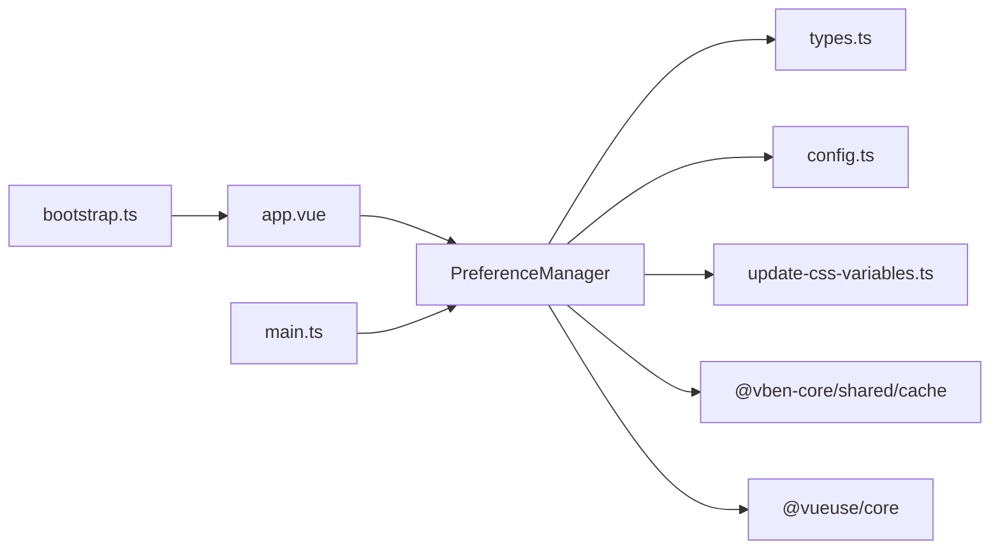

# 应用状态管理

<cite>
**本文档引用的文件**
- [packages/@core/preferences/src/preferences.ts](file://packages/@core/preferences/src/preferences.ts)
- [packages/@core/preferences/src/types.ts](file://packages/@core/preferences/src/types.ts)
- [packages/@core/preferences/src/config.ts](file://packages/@core/preferences/src/config.ts)
- [packages/@core/preferences/src/update-css-variables.ts](file://packages/@core/preferences/src/update-css-variables.ts)
- [apps/web-antd/src/main.ts](file://apps/web-antd/src/main.ts)
- [apps/web-antd/src/bootstrap.ts](file://apps/web-antd/src/bootstrap.ts)
- [apps/web-antd/src/app.vue](file://apps/web-antd/src/app.vue)
- [apps/web-antd/src/preferences.ts](file://apps/web-antd/src/preferences.ts)
- [apps/web-antd/src/store/auth.ts](file://apps/web-antd/src/store/auth.ts)
</cite>

## 目录
1. [简介](#简介)
2. [项目结构](#项目结构)
3. [核心组件](#核心组件)
4. [架构总览](#架构总览)
5. [详细组件分析](#详细组件分析)
6. [依赖关系分析](#依赖关系分析)
7. [性能考量](#性能考量)
8. [故障排查指南](#故障排查指南)
9. [结论](#结论)
10. [附录](#附录)

## 简介
本文件系统性阐述 Vben Admin 的“应用状态管理”模块，聚焦于应用级状态的统一管理与持久化，涵盖主题切换、布局配置、语言设置与全局状态控制。文档同时解释状态的数据结构与配置项定义、持久化与默认值管理机制、与 UI 框架的集成与响应式更新、热重载与开发环境配置、性能优化与内存管理策略，并提供扩展与自定义配置示例。

## 项目结构
应用状态管理由“核心偏好管理器”与“应用层初始化流程”共同构成：
- 核心偏好管理器：负责偏好设置的初始化、合并、持久化、变更监听与响应式更新。
- 应用层初始化：在入口处完成偏好设置的注入、命名空间隔离、UI 框架集成与动态标题等行为。
- UI 集成：在根组件中根据偏好设置驱动主题、紧凑模式、语言等 UI 行为。

**图表来源**
- [apps/web-antd/src/main.ts:1-32](file://apps/web-antd/src/main.ts#L1-L32)
- [apps/web-antd/src/bootstrap.ts:1-85](file://apps/web-antd/src/bootstrap.ts#L1-L85)
- [apps/web-antd/src/app.vue:1-48](file://apps/web-antd/src/app.vue#L1-L48)
- [packages/@core/preferences/src/preferences.ts:25-235](file://packages/@core/preferences/src/preferences.ts#L25-L235)
- [packages/@core/preferences/src/types.ts:296-349](file://packages/@core/preferences/src/types.ts#L296-L349)
- [packages/@core/preferences/src/config.ts:3-148](file://packages/@core/preferences/src/config.ts#L3-L148)
- [packages/@core/preferences/src/update-css-variables.ts:12-130](file://packages/@core/preferences/src/update-css-variables.ts#L12-L130)

**章节来源**
- [apps/web-antd/src/main.ts:1-32](file://apps/web-antd/src/main.ts#L1-L32)
- [apps/web-antd/src/bootstrap.ts:1-85](file://apps/web-antd/src/bootstrap.ts#L1-L85)
- [apps/web-antd/src/app.vue:1-48](file://apps/web-antd/src/app.vue#L1-L48)
- [packages/@core/preferences/src/preferences.ts:25-235](file://packages/@core/preferences/src/preferences.ts#L25-L235)
- [packages/@core/preferences/src/types.ts:296-349](file://packages/@core/preferences/src/types.ts#L296-L349)
- [packages/@core/preferences/src/config.ts:3-148](file://packages/@core/preferences/src/config.ts#L3-L148)
- [packages/@core/preferences/src/update-css-variables.ts:12-130](file://packages/@core/preferences/src/update-css-variables.ts#L12-L130)

## 核心组件
- PreferenceManager（偏好管理器）
  - 负责偏好设置的初始化、合并、持久化、变更监听与响应式更新。
  - 提供只读状态访问、重置、清除缓存等能力。
  - 通过 debounce 降低频繁写入开销。
- 偏好类型与默认配置
  - 定义完整的偏好数据结构（app、theme、layout、widget 等）。
  - 提供默认配置，确保首次使用具备合理缺省值。
- CSS 变量更新器
  - 根据主题与颜色配置动态更新 CSS 变量，实现主题与尺寸的即时生效。
- 应用入口与根组件
  - 在入口处注入命名空间与覆盖配置，随后引导应用并挂载。
  - 根组件依据偏好设置驱动 UI 框架主题与紧凑模式。

**章节来源**
- [packages/@core/preferences/src/preferences.ts:25-235](file://packages/@core/preferences/src/preferences.ts#L25-L235)
- [packages/@core/preferences/src/types.ts:296-349](file://packages/@core/preferences/src/types.ts#L296-L349)
- [packages/@core/preferences/src/config.ts:3-148](file://packages/@core/preferences/src/config.ts#L3-L148)
- [packages/@core/preferences/src/update-css-variables.ts:12-130](file://packages/@core/preferences/src/update-css-variables.ts#L12-L130)
- [apps/web-antd/src/main.ts:1-32](file://apps/web-antd/src/main.ts#L1-L32)
- [apps/web-antd/src/app.vue:1-48](file://apps/web-antd/src/app.vue#L1-L48)

## 架构总览
应用状态管理采用“核心偏好管理器 + 应用层初始化”的分层设计：
- 初始化阶段：入口生成命名空间，合并覆盖配置与默认配置，加载缓存并建立监听。
- 运行阶段：偏好变更触发 CSS 变量更新、颜色模式切换、移动端检测等响应式行为。
- 集成阶段：根组件读取偏好设置，驱动 UI 框架主题与紧凑模式；引导流程中动态标题与国际化等。

**图表来源**
- [apps/web-antd/src/main.ts:9-25](file://apps/web-antd/src/main.ts#L9-L25)
- [packages/@core/preferences/src/preferences.ts:70-100](file://packages/@core/preferences/src/preferences.ts#L70-L100)
- [packages/@core/preferences/src/preferences.ts:182-217](file://packages/@core/preferences/src/preferences.ts#L182-L217)
- [apps/web-antd/src/app.vue:13-30](file://apps/web-antd/src/app.vue#L13-L30)

## 详细组件分析

### 偏好管理器（PreferenceManager）
- 数据结构与职责
  - 维护 reactive 状态与只读快照，提供 getPreferences、updatePreferences、resetPreferences、clearCache 等方法。
  - 通过 StorageManager 实现本地持久化，拆分主配置、语言、主题三类键。
- 初始化与合并
  - 支持命名空间隔离，避免多项目配置冲突。
  - 合并顺序：缓存配置 → 覆盖配置 → 默认配置，保证用户覆盖优先。
- 响应式更新
  - handleUpdates 根据更新字段分别触发 CSS 变量更新与颜色模式切换。
  - setupWatcher 监听移动端断点与系统主题变化，自动同步偏好。
- 性能优化
  - 使用防抖保存（debounce），减少频繁写入。
  - 使用 markRaw 保护不可响应对象，避免无谓的响应式开销。

**图表来源**
- [packages/@core/preferences/src/preferences.ts:25-235](file://packages/@core/preferences/src/preferences.ts#L25-L235)

**章节来源**
- [packages/@core/preferences/src/preferences.ts:25-235](file://packages/@core/preferences/src/preferences.ts#L25-L235)

### 偏好类型与默认配置
- 类型定义
  - Preferences 包含 app、breadcrumb、copyright、footer、header、logo、navigation、shortcutKeys、sidebar、tabbar、theme、transition、widget 等模块。
  - 每个模块定义了对应的布尔开关、枚举值、数值与字符串字段。
- 默认配置
  - 提供合理的默认值，如布局、主题模式、紧凑模式、标签页、版权信息、过渡动画、小部件等。
  - 语言默认为中文，主题默认深色，移动端默认关闭等。

**图表来源**
- [packages/@core/preferences/src/types.ts:296-349](file://packages/@core/preferences/src/types.ts#L296-L349)
- [packages/@core/preferences/src/config.ts:3-148](file://packages/@core/preferences/src/config.ts#L3-L148)

**章节来源**
- [packages/@core/preferences/src/types.ts:296-349](file://packages/@core/preferences/src/types.ts#L296-L349)
- [packages/@core/preferences/src/config.ts:3-148](file://packages/@core/preferences/src/config.ts#L3-L148)

### CSS 变量更新与主题切换
- 主题模式与内置主题
  - 根据主题模式自动切换 dark 类，设置 data-theme 属性。
  - 根据内置主题类型与当前明暗状态选择主色，生成颜色变量并写入 CSS 变量。
- 尺寸与圆角
  - 根据字号与圆角配置更新 --font-size-base 与 --radius。
- 颜色模式
  - 根据偏好切换 grayscale-mode 与 invert-mode，实现灰色/色弱模式。

**图表来源**
- [packages/@core/preferences/src/preferences.ts:136-152](file://packages/@core/preferences/src/preferences.ts#L136-L152)
- [packages/@core/preferences/src/update-css-variables.ts:12-130](file://packages/@core/preferences/src/update-css-variables.ts#L12-L130)

**章节来源**
- [packages/@core/preferences/src/preferences.ts:136-152](file://packages/@core/preferences/src/preferences.ts#L136-L152)
- [packages/@core/preferences/src/update-css-variables.ts:12-130](file://packages/@core/preferences/src/update-css-variables.ts#L12-L130)

### 应用入口与根组件集成
- 入口初始化
  - 生成命名空间（结合版本与环境），调用 initPreferences 完成偏好初始化。
  - 覆盖配置来自项目级 preferences.ts，可覆盖主题模式、默认首页、小部件开关等。
- 根组件集成
  - 读取 isDark 与紧凑模式，动态计算 UI 框架主题配置。
  - 读取语言配置，提供 ConfigProvider 语言参数。
- 引导流程
  - 国际化、路由、权限指令、插件等在引导阶段完成安装。
  - 动态标题：当启用动态标题时，根据路由 meta.title 与应用名称组合标题。

**图表来源**
- [apps/web-antd/src/main.ts:9-25](file://apps/web-antd/src/main.ts#L9-L25)
- [apps/web-antd/src/bootstrap.ts:44-79](file://apps/web-antd/src/bootstrap.ts#L44-L79)
- [apps/web-antd/src/app.vue:13-30](file://apps/web-antd/src/app.vue#L13-L30)

**章节来源**
- [apps/web-antd/src/main.ts:1-32](file://apps/web-antd/src/main.ts#L1-L32)
- [apps/web-antd/src/bootstrap.ts:1-85](file://apps/web-antd/src/bootstrap.ts#L1-L85)
- [apps/web-antd/src/app.vue:1-48](file://apps/web-antd/src/app.vue#L1-L48)
- [apps/web-antd/src/preferences.ts:8-31](file://apps/web-antd/src/preferences.ts#L8-L31)

### 偏好持久化与默认值管理
- 持久化策略
  - 主配置：存储完整偏好对象。
  - 语言与主题：独立键存储，便于跨模块快速读取。
  - 防抖写入：降低频繁写入对存储与渲染的影响。
- 默认值管理
  - 默认配置集中定义，覆盖配置与缓存配置按优先级合并。
  - 平台标识（macOS/window）写入 DOM data-*，用于样式或交互差异化。

**章节来源**
- [packages/@core/preferences/src/preferences.ts:165-177](file://packages/@core/preferences/src/preferences.ts#L165-L177)
- [packages/@core/preferences/src/config.ts:3-148](file://packages/@core/preferences/src/config.ts#L3-L148)
- [packages/@core/preferences/src/preferences.ts:157-159](file://packages/@core/preferences/src/preferences.ts#L157-L159)

### 偏好与 UI 框架的集成与响应式更新
- Ant Design Vue 集成
  - 根组件使用 ConfigProvider 注入语言与主题配置。
  - 根据 isDark 切换算法，支持紧凑模式算法叠加。
- 响应式更新
  - 偏好变更通过 handleUpdates 触发 CSS 变量更新与颜色模式切换。
  - 监听断点与系统主题变化，自动调整移动端标记与主题模式。

**章节来源**
- [apps/web-antd/src/app.vue:13-30](file://apps/web-antd/src/app.vue#L13-L30)
- [packages/@core/preferences/src/preferences.ts:136-152](file://packages/@core/preferences/src/preferences.ts#L136-L152)
- [packages/@core/preferences/src/preferences.ts:182-217](file://packages/@core/preferences/src/preferences.ts#L182-L217)

### 热重载与开发环境配置
- 命名空间隔离
  - 命名空间包含版本与环境标识，避免开发与生产、不同版本间配置互相污染。
- 开发友好
  - 覆盖配置允许在开发时快速调整主题模式、默认首页、小部件开关等。
  - 偏好变更立即反映到 UI，便于开发调试。

**章节来源**
- [apps/web-antd/src/main.ts:12-14](file://apps/web-antd/src/main.ts#L12-L14)
- [apps/web-antd/src/preferences.ts:8-31](file://apps/web-antd/src/preferences.ts#L8-L31)

### 扩展与自定义配置示例
- 自定义覆盖配置
  - 在项目 preferences.ts 中覆盖主题模式、默认首页、小部件开关等。
- 新增偏好字段
  - 在类型定义与默认配置中新增字段，确保类型安全与默认值完备。
- 自定义持久化键
  - 如需扩展持久化策略，可在偏好管理器中扩展存储键与读取逻辑。

**章节来源**
- [apps/web-antd/src/preferences.ts:8-31](file://apps/web-antd/src/preferences.ts#L8-L31)
- [packages/@core/preferences/src/types.ts:296-349](file://packages/@core/preferences/src/types.ts#L296-L349)
- [packages/@core/preferences/src/config.ts:3-148](file://packages/@core/preferences/src/config.ts#L3-L148)

## 依赖关系分析
- 组件耦合
  - PreferenceManager 与 StorageManager、Vue 响应式系统耦合紧密，但对外暴露简洁 API。
  - 根组件仅依赖偏好读取，低耦合高内聚。
- 外部依赖
  - 使用 @vueuse/core 的断点与防抖工具，提升响应式与性能。
  - 使用 @vben-core/shared 的颜色变量生成与 CSS 变量更新工具。

**图表来源**
- [packages/@core/preferences/src/preferences.ts:25-235](file://packages/@core/preferences/src/preferences.ts#L25-L235)
- [packages/@core/preferences/src/types.ts:296-349](file://packages/@core/preferences/src/types.ts#L296-L349)
- [packages/@core/preferences/src/config.ts:3-148](file://packages/@core/preferences/src/config.ts#L3-L148)
- [packages/@core/preferences/src/update-css-variables.ts:12-130](file://packages/@core/preferences/src/update-css-variables.ts#L12-L130)
- [apps/web-antd/src/app.vue:13-30](file://apps/web-antd/src/app.vue#L13-L30)
- [apps/web-antd/src/main.ts:9-25](file://apps/web-antd/src/main.ts#L9-L25)
- [apps/web-antd/src/bootstrap.ts:44-79](file://apps/web-antd/src/bootstrap.ts#L44-L79)

**章节来源**
- [packages/@core/preferences/src/preferences.ts:25-235](file://packages/@core/preferences/src/preferences.ts#L25-L235)
- [apps/web-antd/src/app.vue:1-48](file://apps/web-antd/src/app.vue#L1-L48)
- [apps/web-antd/src/main.ts:1-32](file://apps/web-antd/src/main.ts#L1-L32)
- [apps/web-antd/src/bootstrap.ts:1-85](file://apps/web-antd/src/bootstrap.ts#L1-L85)

## 性能考量
- 响应式与渲染
  - 使用 reactive 与 readonly 管理状态，避免不必要的响应式追踪。
  - 对不可响应对象使用 markRaw，减少深度响应带来的性能损耗。
- 存储与网络
  - 防抖写入降低频繁存储与渲染抖动。
  - 分离语言与主题键，减少主配置读写体积。
- 计算与监听
  - 断点监听与系统主题监听仅在必要时触发更新，避免过度重绘。
- 内存管理
  - 偏好重置时使用 Object.assign 替代深拷贝，减少内存分配。
  - 清理缓存时统一移除相关键，防止残留数据占用内存。

[本节为通用性能建议，无需特定文件引用]

## 故障排查指南
- 偏好未生效
  - 检查命名空间是否正确，确认覆盖配置与默认配置合并顺序。
  - 清理缓存后重启应用，确保新配置生效。
- 主题切换异常
  - 检查 handleUpdates 是否正确触发 CSS 变量更新。
  - 确认系统主题监听事件是否在 auto 模式下正常工作。
- 移动端断点不准确
  - 检查断点监听初始化与 immediate 参数设置。
- 动态标题未更新
  - 确认动态标题开关已启用，watchEffect 是否正确读取路由 meta 与应用名称。

**章节来源**
- [packages/@core/preferences/src/preferences.ts:70-100](file://packages/@core/preferences/src/preferences.ts#L70-L100)
- [packages/@core/preferences/src/preferences.ts:136-152](file://packages/@core/preferences/src/preferences.ts#L136-L152)
- [packages/@core/preferences/src/preferences.ts:182-217](file://packages/@core/preferences/src/preferences.ts#L182-L217)
- [apps/web-antd/src/bootstrap.ts:72-79](file://apps/web-antd/src/bootstrap.ts#L72-L79)

## 结论
Vben Admin 的应用状态管理以 PreferenceManager 为核心，通过类型化配置、默认值与覆盖配置的有序合并、持久化与响应式更新机制，实现了主题、布局、语言与全局状态的统一管理。配合 UI 框架的集成与开发环境的命名空间隔离，既保证了良好的用户体验，也提供了强大的扩展性与可维护性。

## 附录
- 关键 API 速览
  - 初始化：initPreferences({ namespace, overrides })
  - 读取：getPreferences()
  - 更新：updatePreferences(updates)
  - 重置：resetPreferences()
  - 清理：clearCache()

**章节来源**
- [packages/@core/preferences/src/preferences.ts:70-152](file://packages/@core/preferences/src/preferences.ts#L70-L152)