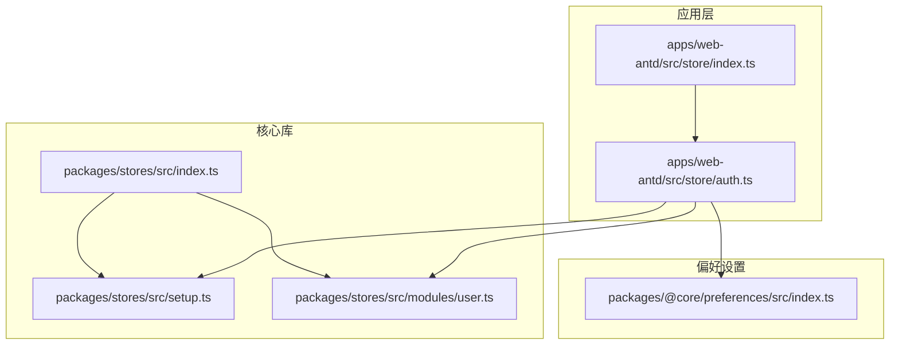
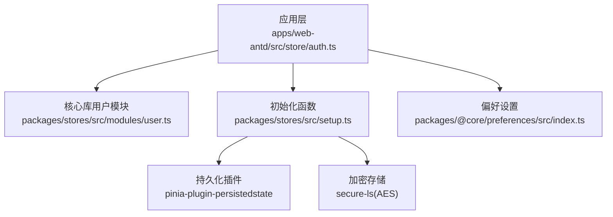
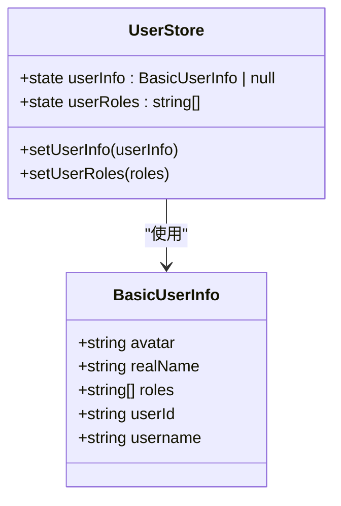
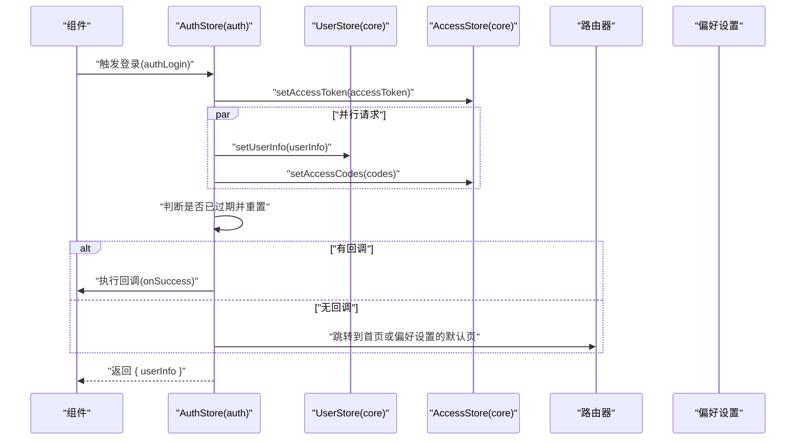
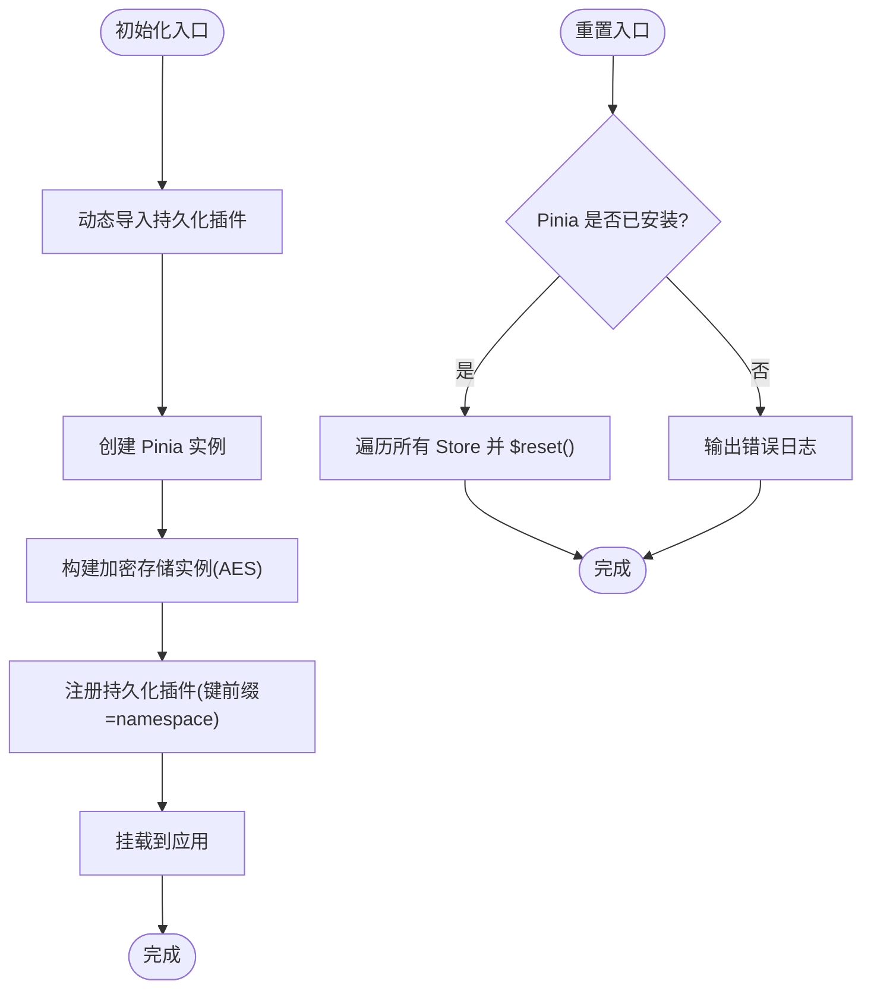
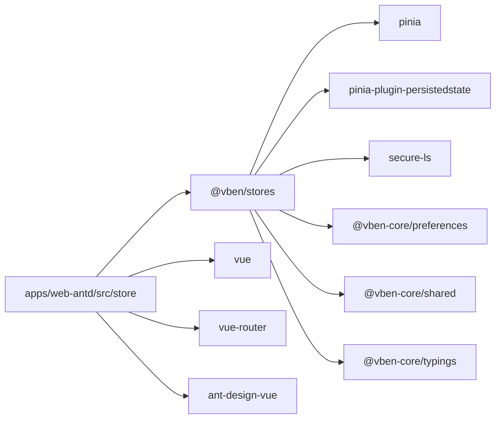

# 状态管理API

<cite>
**本文引用的文件**
- [packages/stores/src/index.ts](file://packages/stores/src/index.ts)
- [packages/stores/src/setup.ts](file://packages/stores/src/setup.ts)
- [packages/stores/src/modules/user.ts](file://packages/stores/src/modules/user.ts)
- [apps/web-antd/src/store/auth.ts](file://apps/web-antd/src/store/auth.ts)
- [apps/web-antd/src/store/index.ts](file://apps/web-antd/src/store/index.ts)
- [packages/@core/preferences/src/index.ts](file://packages/@core/preferences/src/index.ts)
- [packages/stores/package.json](file://packages/stores/package.json)
</cite>

## 目录
1. [简介](#简介)
2. [项目结构](#项目结构)
3. [核心组件](#核心组件)
4. [架构总览](#架构总览)
5. [详细组件分析](#详细组件分析)
6. [依赖分析](#依赖分析)
7. [性能考虑](#性能考虑)
8. [故障排查指南](#故障排查指南)
9. [结论](#结论)
10. [附录](#附录)

## 简介
本文件系统性梳理 Vben Admin 的状态管理API，聚焦于 Pinia Store 模块的定义、Action、Getter 与 State 结构，以及 TypeScript 类型定义；同时覆盖 Store 初始化配置、使用示例、模块间依赖与数据流、持久化机制与同步策略、调试方法与最佳实践，并提供版本升级与迁移指引。目标是帮助开发者快速理解并高效使用状态管理能力。

## 项目结构
状态管理相关代码主要分布在以下位置：
- 核心库：packages/stores 提供统一的 Store 模块与初始化逻辑
- 应用层：apps/web-antd/src/store 定义应用级业务 Store（如认证）
- 配置与偏好：packages/@core/preferences 提供偏好设置读取与管理
- 包导出：packages/stores/src/index.ts 统一导出模块与初始化函数

**图表来源**
- [packages/stores/src/index.ts:1-4](file://packages/stores/src/index.ts#L1-L4)
- [packages/stores/src/setup.ts:39-81](file://packages/stores/src/setup.ts#L39-L81)
- [packages/stores/src/modules/user.ts:1-64](file://packages/stores/src/modules/user.ts#L1-L64)
- [apps/web-antd/src/store/index.ts:1-2](file://apps/web-antd/src/store/index.ts#L1-L2)
- [apps/web-antd/src/store/auth.ts:1-118](file://apps/web-antd/src/store/auth.ts#L1-L118)
- [packages/@core/preferences/src/index.ts:1-20](file://packages/@core/preferences/src/index.ts#L1-L20)

**章节来源**
- [packages/stores/src/index.ts:1-4](file://packages/stores/src/index.ts#L1-L4)
- [packages/stores/src/setup.ts:39-81](file://packages/stores/src/setup.ts#L39-L81)
- [packages/stores/src/modules/user.ts:1-64](file://packages/stores/src/modules/user.ts#L1-L64)
- [apps/web-antd/src/store/index.ts:1-2](file://apps/web-antd/src/store/index.ts#L1-L2)
- [apps/web-antd/src/store/auth.ts:1-118](file://apps/web-antd/src/store/auth.ts#L1-L118)
- [packages/@core/preferences/src/index.ts:1-20](file://packages/@core/preferences/src/index.ts#L1-L20)

## 核心组件
- Store 模块导出入口：统一从核心库导出模块与初始化函数，便于应用按需引入
- 初始化配置：集中于初始化函数，负责注册持久化插件与加密密钥配置
- 认证 Store：应用层定义认证流程，协调用户信息与访问码获取、登录状态与路由跳转
- 用户 Store：核心库提供用户信息与角色状态管理

**章节来源**
- [packages/stores/src/index.ts:1-4](file://packages/stores/src/index.ts#L1-L4)
- [packages/stores/src/setup.ts:39-81](file://packages/stores/src/setup.ts#L39-L81)
- [apps/web-antd/src/store/auth.ts:1-118](file://apps/web-antd/src/store/auth.ts#L1-L118)
- [packages/stores/src/modules/user.ts:1-64](file://packages/stores/src/modules/user.ts#L1-L64)

## 架构总览
整体架构围绕 Pinia 进行模块化组织，核心库提供可复用的 Store 模块与初始化逻辑，应用层通过认证 Store 协调业务流程，持久化策略由初始化函数集中配置。

**图表来源**
- [apps/web-antd/src/store/auth.ts:1-118](file://apps/web-antd/src/store/auth.ts#L1-L118)
- [packages/stores/src/modules/user.ts:1-64](file://packages/stores/src/modules/user.ts#L1-L64)
- [packages/stores/src/setup.ts:39-81](file://packages/stores/src/setup.ts#L39-L81)
- [packages/@core/preferences/src/index.ts:1-20](file://packages/@core/preferences/src/index.ts#L1-L20)

## 详细组件分析

### 用户 Store（核心库）
- Store 名称：core-user
- State
  - userInfo: BasicUserInfo | null
  - userRoles: string[]
- Actions
  - setUserInfo(userInfo): 设置用户信息并同步角色列表
  - setUserRoles(roles): 设置角色列表
- 类型定义
  - BasicUserInfo：包含头像、真实姓名、角色数组、用户ID、用户名等字段
  - AccessState：包含 userInfo 与 userRoles
- HMR 支持：启用热更新以提升开发体验

**图表来源**
- [packages/stores/src/modules/user.ts:1-64](file://packages/stores/src/modules/user.ts#L1-L64)

**章节来源**
- [packages/stores/src/modules/user.ts:1-64](file://packages/stores/src/modules/user.ts#L1-L64)

### 认证 Store（应用层）
- Store 名称：auth
- 依赖
  - 访问 Store（来自核心库）：用于维护 accessToken、访问码与登录过期状态
  - 用户 Store（来自核心库）：用于维护用户信息
  - 路由器：用于登录成功后的页面跳转
  - 偏好设置：用于默认首页路径
- State
  - loginLoading: boolean
- Actions
  - authLogin(params, onSuccess?): 异步登录，获取 accessToken 后并行拉取用户信息与访问码，设置状态并执行回调或路由跳转
  - logout(redirect?): 登出接口调用后重置所有 Store 并跳转至登录页
  - fetchUserInfo(): 拉取并缓存用户信息
  - $reset(): 重置登录加载状态
- 数据流
  - 登录成功后，写入 accessToken 至访问 Store，同时写入用户信息与访问码至对应 Store
  - 登出后，调用重置函数清空所有 Store 状态

**图表来源**
- [apps/web-antd/src/store/auth.ts:28-78](file://apps/web-antd/src/store/auth.ts#L28-L78)
- [packages/stores/src/modules/user.ts:41-58](file://packages/stores/src/modules/user.ts#L41-L58)

**章节来源**
- [apps/web-antd/src/store/auth.ts:1-118](file://apps/web-antd/src/store/auth.ts#L1-L118)

### 初始化与持久化配置
- 初始化函数
  - 注册持久化插件，支持开发环境使用 localStorage，生产环境使用 secure-ls(AES) 加密存储
  - 存储键命名规则：namespace-storeId，避免多应用或多实例冲突
  - 加密密钥来源于环境变量，确保敏感数据安全
- 重置所有 Store
  - 在登出或切换用户场景下，统一重置所有已注册 Store 的状态

**图表来源**
- [packages/stores/src/setup.ts:39-81](file://packages/stores/src/setup.ts#L39-L81)

**章节来源**
- [packages/stores/src/setup.ts:39-81](file://packages/stores/src/setup.ts#L39-L81)

## 依赖分析
- 核心库依赖
  - pinia、pinia-plugin-persistedstate、secure-ls：提供状态容器、持久化与加密存储能力
  - @vben-core/preferences、@vben-core/shared、@vben-core/typings：提供偏好设置、共享工具与类型定义
- 应用层依赖
  - @vben/stores：统一引入核心 Store 模块与初始化函数
  - vue、vue-router：提供响应式与路由能力
  - ant-design-vue：提供通知等 UI 组件

**图表来源**
- [packages/stores/package.json:22-31](file://packages/stores/package.json#L22-L31)
- [apps/web-antd/src/store/auth.ts:1-15](file://apps/web-antd/src/store/auth.ts#L1-L15)

**章节来源**
- [packages/stores/package.json:1-33](file://packages/stores/package.json#L1-L33)
- [apps/web-antd/src/store/auth.ts:1-15](file://apps/web-antd/src/store/auth.ts#L1-L15)

## 性能考虑
- 并行请求：登录流程中对用户信息与访问码采用并行拉取，减少总等待时间
- 精准更新：仅在用户信息变更时更新角色列表，避免不必要的重渲染
- 持久化策略：开发环境使用本地存储，生产环境使用加密存储，兼顾易用性与安全性
- 热更新：启用 HMR 以提升开发效率，降低频繁重启带来的等待

[本节为通用指导，无需特定文件引用]

## 故障排查指南
- 登录后状态未更新
  - 检查登录 Action 是否正确调用访问 Store 与用户 Store 的写入方法
  - 确认初始化函数已注册持久化插件且键前缀一致
- 登出后状态未清空
  - 确认调用了重置所有 Store 的函数，并检查是否存在未注册的自定义 Store
- 加密存储异常
  - 检查环境变量中的加密密钥是否正确配置
  - 确认存储键命名规则与 namespace 一致
- 开发环境持久化不生效
  - 确认开发模式下使用的是本地存储而非加密存储

**章节来源**
- [apps/web-antd/src/store/auth.ts:28-98](file://apps/web-antd/src/store/auth.ts#L28-L98)
- [packages/stores/src/setup.ts:39-81](file://packages/stores/src/setup.ts#L39-L81)

## 结论
Vben Admin 的状态管理以 Pinia 为核心，通过核心库提供可复用的 Store 模块与初始化逻辑，应用层通过认证 Store 协调登录、登出与用户信息管理。持久化与加密策略在初始化阶段集中配置，既保证了开发体验，也兼顾了生产环境的安全性。遵循本文档的使用方式与最佳实践，可有效提升状态管理的稳定性与可维护性。

[本节为总结性内容，无需特定文件引用]

## 附录

### 使用示例（步骤说明）
- 初始化
  - 在应用启动时调用初始化函数，传入命名空间与加密密钥
  - 将 Pinia 实例挂载到应用
- 引入 Store
  - 从核心库统一导出入口引入所需模块
  - 在组件中通过组合式 API 使用 Store
- 认证流程
  - 登录：调用认证 Store 的登录 Action，传入表单参数与可选回调
  - 登出：调用登出 Action，自动重置所有 Store 并跳转登录页

**章节来源**
- [packages/stores/src/index.ts:1-4](file://packages/stores/src/index.ts#L1-L4)
- [packages/stores/src/setup.ts:39-81](file://packages/stores/src/setup.ts#L39-L81)
- [apps/web-antd/src/store/auth.ts:28-98](file://apps/web-antd/src/store/auth.ts#L28-L98)

### 类型与接口要点
- 用户信息接口：包含头像、真实姓名、角色数组、用户ID、用户名等字段
- 访问状态接口：包含用户信息与用户角色数组
- 建议在新增 Store 时遵循相同的数据结构设计，保持类型一致性

**章节来源**
- [packages/stores/src/modules/user.ts:3-36](file://packages/stores/src/modules/user.ts#L3-L36)

### 调试与开发工具
- 使用浏览器的 Pinia Devtools 观察 Store 状态变化与 Action 调用
- 在开发环境开启持久化插件，便于调试状态恢复
- 对关键流程添加日志，定位异步请求与状态更新时机

[本节为通用指导，无需特定文件引用]

### 版本升级与迁移指南
- 升级 Pinia 或持久化插件版本时，优先检查初始化函数的插件注册方式与参数
- 若更换加密存储方案，需同步更新密钥与存储键命名规则
- 迁移自定义 Store 时，确保遵循新的命名规范与类型定义
- 发布新版本前，进行端到端测试，验证登录、登出与状态持久化流程

[本节为通用指导，无需特定文件引用]