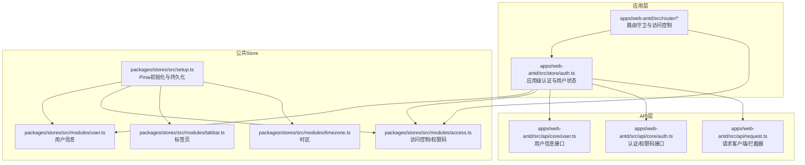
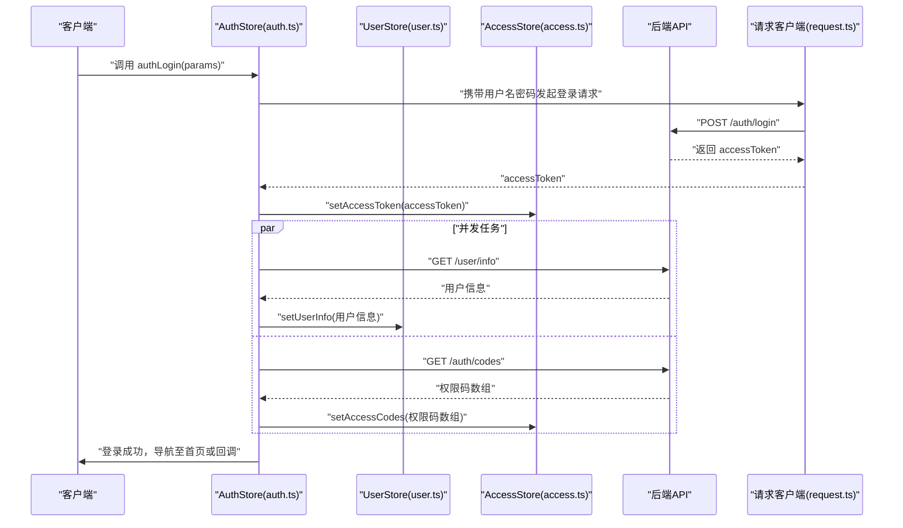
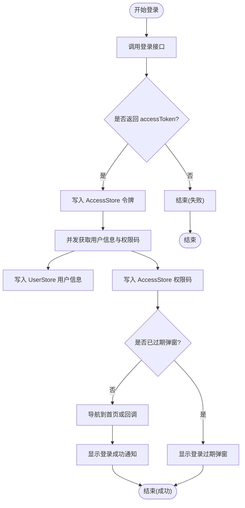
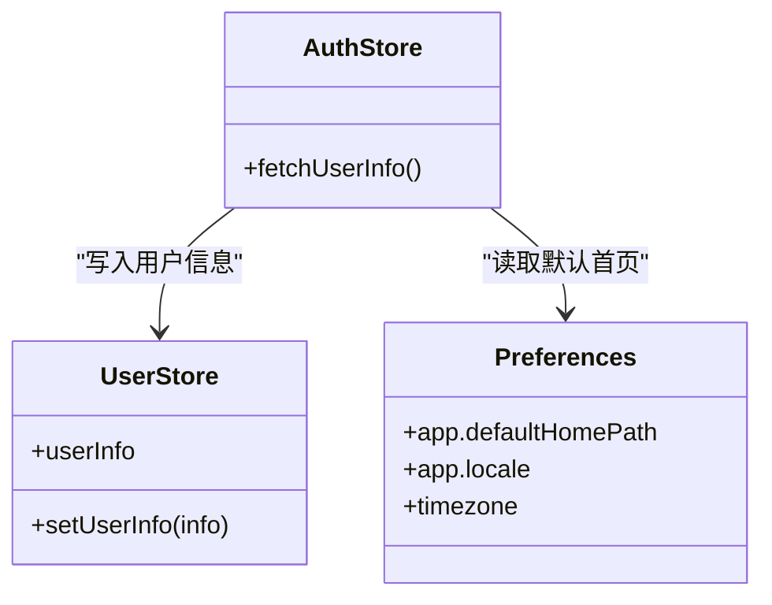
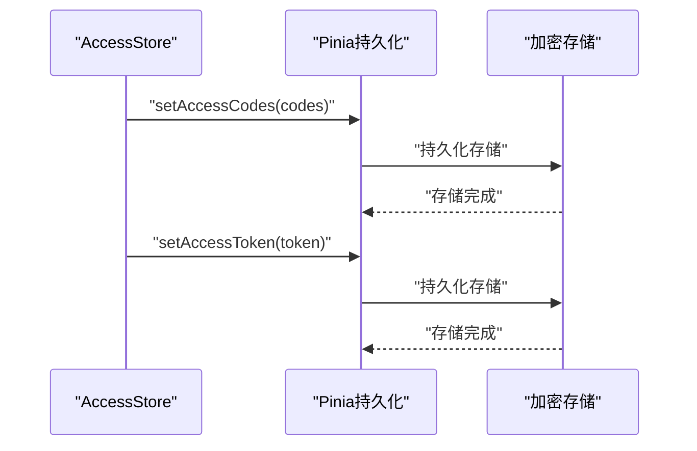
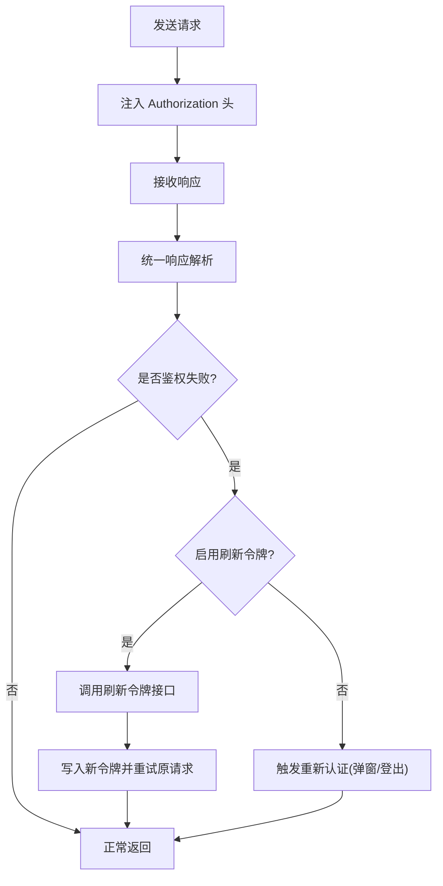
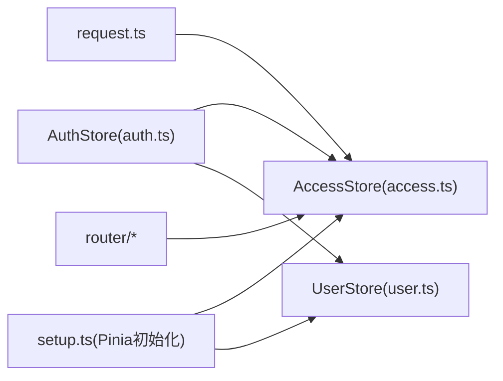

# 用户状态管理

<cite>
**本文引用的文件**
- [apps/web-antd/src/store/auth.ts](file://apps/web-antd/src/store/auth.ts)
- [apps/web-antd/src/store/index.ts](file://apps/web-antd/src/store/index.ts)
- [packages/stores/src/modules/index.ts](file://packages/stores/src/modules/index.ts)
- [packages/stores/src/setup.ts](file://packages/stores/src/setup.ts)
- [apps/web-antd/src/api/core/auth.ts](file://apps/web-antd/src/api/core/auth.ts)
- [apps/web-antd/src/api/core/user.ts](file://apps/web-antd/src/api/core/user.ts)
- [apps/web-antd/src/api/request.ts](file://apps/web-antd/src/api/request.ts)
- [apps/web-antd/src/locales/index.ts](file://apps/web-antd/src/locales/index.ts)
- [apps/web-antd/src/preferences.ts](file://apps/web-antd/src/preferences.ts)
- [apps/web-antd/src/router/access.ts](file://apps/web-antd/src/router/access.ts)
- [apps/web-antd/src/router/guard.ts](file://apps/web-antd/src/router/guard.ts)
- [apps/web-antd/src/router/index.ts](file://apps/web-antd/src/router/index.ts)
- [apps/web-antd/src/main.ts](file://apps/web-antd/src/main.ts)
</cite>

## 目录
1. [简介](#简介)
2. [项目结构](#项目结构)
3. [核心组件](#核心组件)
4. [架构总览](#架构总览)
5. [详细组件分析](#详细组件分析)
6. [依赖关系分析](#依赖关系分析)
7. [性能考虑](#性能考虑)
8. [故障排查指南](#故障排查指南)
9. [结论](#结论)
10. [附录](#附录)

## 简介
本文件系统性梳理 Vben Admin 的用户状态管理模块，覆盖以下关键主题：
- 用户资料获取与更新流程
- 个人设置（如默认首页、语言、时区）的读取与应用
- 权限码的缓存策略与动态加载机制
- 用户头像、个人设置等数据的状态管理示例
- 用户状态与其他 Store 模块（访问控制、标签页、时区）的依赖与数据同步
- 错误处理与重试机制
- 性能优化建议与调试方法

## 项目结构
围绕用户状态管理的关键文件分布如下：
- 应用层 Store：登录态与用户信息聚合在应用级 auth store
- 公共 Store：用户信息、访问控制、标签页、时区等在公共包中定义
- API 层：认证、用户信息、权限码等接口封装
- 请求层：统一请求客户端、拦截器与刷新令牌逻辑
- 路由层：鉴权守卫与访问控制

图表来源
- [apps/web-antd/src/store/auth.ts:1-118](file://apps/web-antd/src/store/auth.ts#L1-L118)
- [packages/stores/src/modules/index.ts:1-5](file://packages/stores/src/modules/index.ts#L1-L5)
- [packages/stores/src/setup.ts:1-82](file://packages/stores/src/setup.ts#L1-L82)
- [apps/web-antd/src/api/core/user.ts:1-11](file://apps/web-antd/src/api/core/user.ts#L1-L11)
- [apps/web-antd/src/api/core/auth.ts:1-52](file://apps/web-antd/src/api/core/auth.ts#L1-L52)
- [apps/web-antd/src/api/request.ts:1-124](file://apps/web-antd/src/api/request.ts#L1-L124)

章节来源
- [apps/web-antd/src/store/auth.ts:1-118](file://apps/web-antd/src/store/auth.ts#L1-L118)
- [packages/stores/src/modules/index.ts:1-5](file://packages/stores/src/modules/index.ts#L1-L5)
- [packages/stores/src/setup.ts:1-82](file://packages/stores/src/setup.ts#L1-L82)
- [apps/web-antd/src/api/core/user.ts:1-11](file://apps/web-antd/src/api/core/user.ts#L1-L11)
- [apps/web-antd/src/api/core/auth.ts:1-52](file://apps/web-antd/src/api/core/auth.ts#L1-L52)
- [apps/web-antd/src/api/request.ts:1-124](file://apps/web-antd/src/api/request.ts#L1-L124)

## 核心组件
- 应用级认证与用户状态（auth store）
  - 负责登录、登出、用户信息拉取、权限码获取与分发、登录态通知与路由跳转
  - 关键导出：authLogin、logout、fetchUserInfo、loginLoading
- 公共用户信息 Store（user store）
  - 存储用户基本信息（如用户名、头像、所属部门、角色等），支持持久化
- 访问控制 Store（access store）
  - 存储访问令牌、权限码集合、登录过期标记、访问检查标记等
- 请求客户端与拦截器
  - 统一注入 Authorization 头、处理响应格式、实现刷新令牌与重新认证
- 路由守卫与访问控制
  - 基于权限码与路由元信息进行访问控制

章节来源
- [apps/web-antd/src/store/auth.ts:16-118](file://apps/web-antd/src/store/auth.ts#L16-L118)
- [packages/stores/src/modules/index.ts:1-5](file://packages/stores/src/modules/index.ts#L1-L5)
- [apps/web-antd/src/api/request.ts:26-124](file://apps/web-antd/src/api/request.ts#L26-L124)
- [apps/web-antd/src/router/access.ts:1-200](file://apps/web-antd/src/router/access.ts#L1-L200)

## 架构总览
用户状态管理的端到端流程如下：

图表来源
- [apps/web-antd/src/store/auth.ts:28-78](file://apps/web-antd/src/store/auth.ts#L28-L78)
- [apps/web-antd/src/api/core/auth.ts:24-26](file://apps/web-antd/src/api/core/auth.ts#L24-L26)
- [apps/web-antd/src/api/core/user.ts:8-10](file://apps/web-antd/src/api/core/user.ts#L8-L10)
- [apps/web-antd/src/api/core/auth.ts:49-51](file://apps/web-antd/src/api/core/auth.ts#L49-L51)
- [apps/web-antd/src/api/request.ts:26-124](file://apps/web-antd/src/api/request.ts#L26-L124)

## 详细组件分析

### 应用级认证与用户状态（AuthStore）
- 登录流程
  - 发起登录请求，成功后写入访问令牌
  - 并行获取用户信息与权限码，并分别写入对应 Store
  - 根据用户主页或默认首页进行路由跳转
  - 成功登录后显示欢迎通知
- 登出流程
  - 调用后端登出接口（忽略异常）
  - 重置所有 Store，清除登录过期标记
  - 导航回登录页并携带当前路由地址
- 用户信息拉取
  - 单独提供获取用户信息的方法，便于在需要时主动刷新

图表来源
- [apps/web-antd/src/store/auth.ts:28-78](file://apps/web-antd/src/store/auth.ts#L28-L78)

章节来源
- [apps/web-antd/src/store/auth.ts:16-118](file://apps/web-antd/src/store/auth.ts#L16-L118)

### 用户信息与个人设置
- 用户信息数据结构
  - 包含用户标识、姓名、头像、所属部门、角色等字段
  - 通过用户信息接口获取并写入 UserStore
- 个人设置
  - 默认首页路径：从用户信息或全局偏好中读取
  - 语言设置：通过全局偏好与本地化模块生效
  - 时区设置：通过时区 Store 与全局偏好协同

图表来源
- [apps/web-antd/src/store/auth.ts:100-104](file://apps/web-antd/src/store/auth.ts#L100-L104)
- [apps/web-antd/src/preferences.ts:1-200](file://apps/web-antd/src/preferences.ts#L1-L200)

章节来源
- [apps/web-antd/src/store/auth.ts:100-104](file://apps/web-antd/src/store/auth.ts#L100-L104)
- [apps/web-antd/src/preferences.ts:1-200](file://apps/web-antd/src/preferences.ts#L1-L200)

### 权限信息的缓存与动态加载
- 缓存策略
  - 使用 Pinia 持久化插件，按 Store 分别持久化
  - 开发环境使用 localStorage；生产环境使用加密存储（secure-ls）
  - 通过命名空间避免多应用间缓存冲突
- 动态加载
  - 登录成功后立即拉取权限码并写入 AccessStore
  - 路由守卫基于权限码判断访问控制
  - Token 过期时自动触发刷新或重新认证

图表来源
- [packages/stores/src/setup.ts:42-70](file://packages/stores/src/setup.ts#L42-L70)
- [apps/web-antd/src/api/request.ts:94-102](file://apps/web-antd/src/api/request.ts#L94-L102)

章节来源
- [packages/stores/src/setup.ts:1-82](file://packages/stores/src/setup.ts#L1-L82)
- [apps/web-antd/src/api/request.ts:94-102](file://apps/web-antd/src/api/request.ts#L94-L102)

### 请求客户端与刷新令牌机制
- 请求头注入
  - 自动从 AccessStore 读取当前令牌并注入 Authorization 头
- 响应拦截
  - 统一响应格式转换
  - 通用错误提示拦截
- 刷新令牌与重新认证
  - 鉴权拦截器检测过期场景，按配置选择刷新或强制登出
  - 刷新成功后写回新令牌，继续原请求

图表来源
- [apps/web-antd/src/api/request.ts:74-114](file://apps/web-antd/src/api/request.ts#L74-L114)
- [apps/web-antd/src/api/core/auth.ts:31-35](file://apps/web-antd/src/api/core/auth.ts#L31-L35)

章节来源
- [apps/web-antd/src/api/request.ts:26-124](file://apps/web-antd/src/api/request.ts#L26-L124)
- [apps/web-antd/src/api/core/auth.ts:1-52](file://apps/web-antd/src/api/core/auth.ts#L1-L52)

### 与路由的集成与访问控制
- 路由守卫
  - 在导航前置钩子中读取路由元信息与用户权限码
  - 未授权时阻止导航并跳转至无权限页面或登录页
- 访问控制
  - 结合 AccessStore 的权限码与路由配置，动态生成菜单与可见性

章节来源
- [apps/web-antd/src/router/access.ts:1-200](file://apps/web-antd/src/router/access.ts#L1-L200)
- [apps/web-antd/src/router/guard.ts:1-200](file://apps/web-antd/src/router/guard.ts#L1-L200)

## 依赖关系分析
- 模块耦合
  - AuthStore 同时依赖 UserStore 与 AccessStore，形成“用户+权限”的聚合入口
  - 请求客户端依赖 AccessStore 读取令牌，形成“请求-令牌”闭环
- 外部依赖
  - Pinia 持久化插件与加密存储库
  - 本地化与偏好模块
- 可能的循环依赖
  - Store 之间通过函数式依赖（useXxxStore）避免直接 import 导致的循环

图表来源
- [apps/web-antd/src/store/auth.ts:16-18](file://apps/web-antd/src/store/auth.ts#L16-L18)
- [apps/web-antd/src/api/request.ts:14,20](file://apps/web-antd/src/api/request.ts#L14,L20)
- [packages/stores/src/setup.ts:42-70](file://packages/stores/src/setup.ts#L42-L70)

章节来源
- [apps/web-antd/src/store/auth.ts:16-18](file://apps/web-antd/src/store/auth.ts#L16-L18)
- [apps/web-antd/src/api/request.ts:14,20](file://apps/web-antd/src/api/request.ts#L14,L20)
- [packages/stores/src/setup.ts:42-70](file://packages/stores/src/setup.ts#L42-L70)

## 性能考虑
- 并发拉取
  - 登录成功后对用户信息与权限码采用并发请求，减少总等待时间
- 持久化策略
  - 生产环境使用加密存储，兼顾安全与性能；开发环境使用 localStorage 便于调试
- 请求拦截
  - 统一响应解析与错误提示，避免重复处理逻辑
- 路由守卫
  - 将权限判断前置，减少无效渲染与二次请求

## 故障排查指南
- 登录后无法跳转
  - 检查用户信息中的主页路径与全局默认首页配置
  - 确认回调函数是否正确传入
- 权限不足导致页面空白
  - 检查权限码是否正确写入 AccessStore
  - 核对路由元信息与权限码映射
- Token 过期频繁
  - 检查刷新令牌开关与后端配置
  - 查看重新认证模式（弹窗/强制登出）
- 登出后仍显示登录态
  - 确认所有 Store 已重置
  - 检查持久化存储是否清理

章节来源
- [apps/web-antd/src/store/auth.ts:53-61](file://apps/web-antd/src/store/auth.ts#L53-L61)
- [apps/web-antd/src/api/request.ts:43-56](file://apps/web-antd/src/api/request.ts#L43-L56)
- [packages/stores/src/setup.ts:72-82](file://packages/stores/src/setup.ts#L72-L82)

## 结论
Vben Admin 的用户状态管理以应用级 AuthStore 为核心，结合公共 UserStore 与 AccessStore 实现“用户+权限”的统一管理；通过 Pinia 持久化与请求拦截器实现安全、稳定的运行时体验。并发拉取、统一错误处理与路由守卫共同保障了良好的用户体验与可维护性。

## 附录
- 数据结构与 API 接口概览
  - 用户信息接口：GET /user/info
  - 登录接口：POST /auth/login
  - 刷新令牌接口：POST /auth/refresh
  - 退出登录接口：POST /auth/logout
  - 权限码接口：GET /auth/codes
- 关键偏好项
  - 默认首页路径
  - 语言设置
  - 时区设置
  - 是否启用刷新令牌
  - 登录过期模式（弹窗/强制登出）

章节来源
- [apps/web-antd/src/api/core/user.ts:8-10](file://apps/web-antd/src/api/core/user.ts#L8-L10)
- [apps/web-antd/src/api/core/auth.ts:24-26](file://apps/web-antd/src/api/core/auth.ts#L24-L26)
- [apps/web-antd/src/api/core/auth.ts:31-35](file://apps/web-antd/src/api/core/auth.ts#L31-L35)
- [apps/web-antd/src/api/core/auth.ts:40-44](file://apps/web-antd/src/api/core/auth.ts#L40-L44)
- [apps/web-antd/src/api/core/auth.ts:49-51](file://apps/web-antd/src/api/core/auth.ts#L49-L51)
- [apps/web-antd/src/preferences.ts:1-200](file://apps/web-antd/src/preferences.ts#L1-L200)