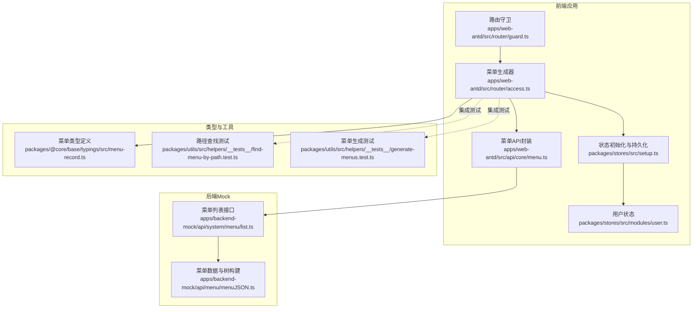
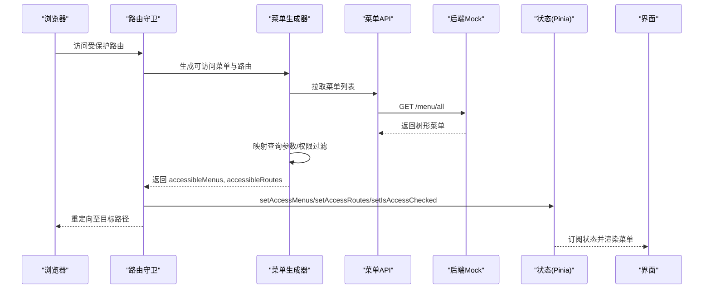
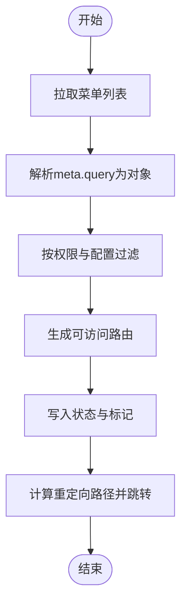
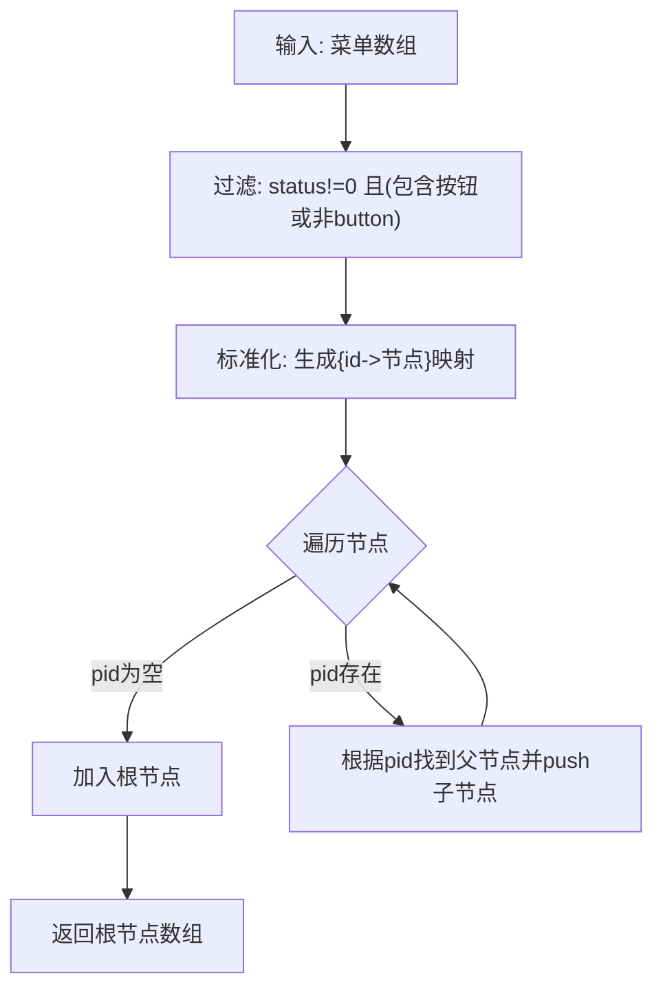
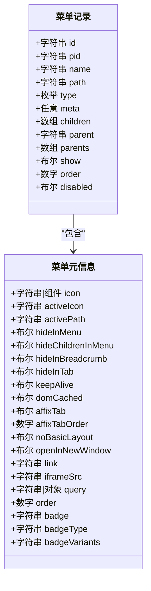
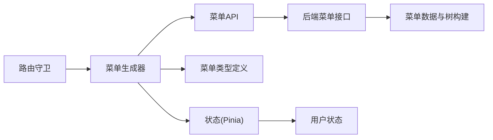

# 菜单状态管理

<cite>
**本文引用的文件**
- [apps/web-antd/src/router/access.ts](file://apps/web-antd/src/router/access.ts)
- [apps/web-antd/src/router/guard.ts](file://apps/web-antd/src/router/guard.ts)
- [apps/backend-mock/api/system/menu/list.ts](file://apps/backend-mock/api/system/menu/list.ts)
- [apps/backend-mock/api/menu/menuJSON.ts](file://apps/backend-mock/api/menu/menuJSON.ts)
- [apps/web-antd/src/api/core/menu.ts](file://apps/web-antd/src/api/core/menu.ts)
- [packages/@core/base/typings/src/menu-record.ts](file://packages/@core/base/typings/src/menu-record.ts)
- [packages/utils/src/helpers/__tests__/find-menu-by-path.test.ts](file://packages/utils/src/helpers/__tests__/find-menu-by-path.test.ts)
- [packages/utils/src/helpers/__tests__/generate-menus.test.ts](file://packages/utils/src/helpers/__tests__/generate-menus.test.ts)
- [packages/stores/src/setup.ts](file://packages/stores/src/setup.ts)
- [packages/stores/src/modules/user.ts](file://packages/stores/src/modules/user.ts)
- [apps/web-antd/src/views/system/menu/modules/form.vue](file://apps/web-antd/src/views/system/menu/modules/form.vue)
</cite>

## 目录
1. [引言](#引言)
2. [项目结构](#项目结构)
3. [核心组件](#核心组件)
4. [架构总览](#架构总览)
5. [详细组件分析](#详细组件分析)
6. [依赖关系分析](#依赖关系分析)
7. [性能考量](#性能考量)
8. [故障排查指南](#故障排查指南)
9. [结论](#结论)
10. [附录](#附录)

## 引言
本文件系统性梳理 Vben Admin 的“菜单状态管理”模块，围绕动态菜单的状态获取、缓存与权限过滤、菜单树构建算法、懒加载与异步处理、菜单与路由集成及导航生成、本地化与多语言支持、持久化与缓存策略、以及调试与性能监控等方面进行深入说明。目标是帮助开发者在理解现有实现的基础上，安全地扩展与优化菜单功能。

## 项目结构
菜单状态管理涉及前端路由守卫、菜单生成器、后端菜单接口与数据模型、Pinia 状态与持久化、以及本地化等模块。下图给出与菜单状态管理直接相关的模块关系与交互：

图表来源
- [apps/web-antd/src/router/guard.ts:98-118](file://apps/web-antd/src/router/guard.ts#L98-L118)
- [apps/web-antd/src/router/access.ts:18-51](file://apps/web-antd/src/router/access.ts#L18-L51)
- [apps/web-antd/src/api/core/menu.ts:8-10](file://apps/web-antd/src/api/core/menu.ts#L8-L10)
- [apps/backend-mock/api/system/menu/list.ts:1-12](file://apps/backend-mock/api/system/menu/list.ts#L1-L12)
- [apps/backend-mock/api/menu/menuJSON.ts:347-425](file://apps/backend-mock/api/menu/menuJSON.ts#L347-L425)
- [packages/stores/src/setup.ts:42-70](file://packages/stores/src/setup.ts#L42-L70)
- [packages/stores/src/modules/user.ts:41-58](file://packages/stores/src/modules/user.ts#L41-L58)
- [packages/@core/base/typings/src/menu-record.ts:33-80](file://packages/@core/base/typings/src/menu-record.ts#L33-L80)
- [packages/utils/src/helpers/__tests__/find-menu-by-path.test.ts:46-88](file://packages/utils/src/helpers/__tests__/find-menu-by-path.test.ts#L46-L88)
- [packages/utils/src/helpers/__tests__/generate-menus.test.ts:189-233](file://packages/utils/src/helpers/__tests__/generate-menus.test.ts#L189-L233)

章节来源
- [apps/web-antd/src/router/guard.ts:98-118](file://apps/web-antd/src/router/guard.ts#L98-L118)
- [apps/web-antd/src/router/access.ts:18-51](file://apps/web-antd/src/router/access.ts#L18-L51)
- [apps/web-antd/src/api/core/menu.ts:8-10](file://apps/web-antd/src/api/core/menu.ts#L8-L10)
- [apps/backend-mock/api/system/menu/list.ts:1-12](file://apps/backend-mock/api/system/menu/list.ts#L1-L12)
- [apps/backend-mock/api/menu/menuJSON.ts:347-425](file://apps/backend-mock/api/menu/menuJSON.ts#L347-L425)
- [packages/stores/src/setup.ts:42-70](file://packages/stores/src/setup.ts#L42-L70)
- [packages/stores/src/modules/user.ts:41-58](file://packages/stores/src/modules/user.ts#L41-L58)
- [packages/@core/base/typings/src/menu-record.ts:33-80](file://packages/@core/base/typings/src/menu-record.ts#L33-L80)
- [packages/utils/src/helpers/__tests__/find-menu-by-path.test.ts:46-88](file://packages/utils/src/helpers/__tests__/find-menu-by-path.test.ts#L46-L88)
- [packages/utils/src/helpers/__tests__/generate-menus.test.ts:189-233](file://packages/utils/src/helpers/__tests__/generate-menus.test.ts#L189-L233)

## 核心组件
- 路由守卫：负责在首次进入受保护路由时触发菜单与路由的生成，并将结果写入状态。
- 菜单生成器：封装异步获取菜单、映射查询参数、调用权限引擎生成可访问菜单与路由。
- 菜单 API：统一的菜单数据拉取入口，返回后端提供的树形菜单。
- 后端 Mock：提供菜单数组与树构建逻辑，模拟真实后端返回结构。
- 类型定义：明确菜单字段（含徽标、隐藏、缓存、标签页等）与扩展属性。
- 状态与持久化：通过 Pinia 初始化插件与加密存储，实现菜单状态的持久化。
- 本地化与多语言：菜单标题使用翻译键，运行时按语言环境解析；表单中也体现多语言文案。

章节来源
- [apps/web-antd/src/router/guard.ts:98-118](file://apps/web-antd/src/router/guard.ts#L98-L118)
- [apps/web-antd/src/router/access.ts:18-51](file://apps/web-antd/src/router/access.ts#L18-L51)
- [apps/web-antd/src/api/core/menu.ts:8-10](file://apps/web-antd/src/api/core/menu.ts#L8-L10)
- [apps/backend-mock/api/system/menu/list.ts:1-12](file://apps/backend-mock/api/system/menu/list.ts#L1-L12)
- [apps/backend-mock/api/menu/menuJSON.ts:347-425](file://apps/backend-mock/api/menu/menuJSON.ts#L347-L425)
- [packages/@core/base/typings/src/menu-record.ts:33-80](file://packages/@core/base/typings/src/menu-record.ts#L33-L80)
- [packages/stores/src/setup.ts:42-70](file://packages/stores/src/setup.ts#L42-L70)
- [apps/web-antd/src/views/system/menu/modules/form.vue:414-469](file://apps/web-antd/src/views/system/menu/modules/form.vue#L414-L469)

## 架构总览
动态菜单从“路由守卫触发 -> 调用菜单生成器 -> 拉取菜单数据 -> 权限过滤与路由生成 -> 写入状态 -> 导航跳转”的完整链路如下：

图表来源
- [apps/web-antd/src/router/guard.ts:98-118](file://apps/web-antd/src/router/guard.ts#L98-L118)
- [apps/web-antd/src/router/access.ts:26-50](file://apps/web-antd/src/router/access.ts#L26-L50)
- [apps/web-antd/src/api/core/menu.ts:8-10](file://apps/web-antd/src/api/core/menu.ts#L8-L10)
- [apps/backend-mock/api/system/menu/list.ts:1-12](file://apps/backend-mock/api/system/menu/list.ts#L1-L12)

## 详细组件分析

### 组件A：菜单生成与权限过滤
- 触发时机：路由守卫检测到未生成动态路由时触发。
- 数据来源：通过统一 API 拉取菜单树，随后对 meta.query 做 JSON 解析映射。
- 权限模式：基于偏好设置的访问模式，结合角色集合生成可访问菜单与路由。
- 结果落盘：将 accessibleMenus 与 accessibleRoutes 写入状态，并标记已检查。

图表来源
- [apps/web-antd/src/router/access.ts:26-50](file://apps/web-antd/src/router/access.ts#L26-L50)
- [apps/web-antd/src/router/guard.ts:98-118](file://apps/web-antd/src/router/guard.ts#L98-L118)

章节来源
- [apps/web-antd/src/router/access.ts:18-51](file://apps/web-antd/src/router/access.ts#L18-L51)
- [apps/web-antd/src/router/guard.ts:98-118](file://apps/web-antd/src/router/guard.ts#L98-L118)

### 组件B：菜单树构建算法
- 输入：一维菜单数组（含 id、pid、status、type 等字段）。
- 过滤：status=0 的项被剔除；当不包含按钮时，type='button' 的项也被剔除。
- 映射：标准化为树节点（含 meta 扩展字段），并建立 id->节点 的映射。
- 构建：遍历映射后的节点，依据 pid 将子节点挂载到父节点 children 中。
- 输出：根节点数组（树）。

图表来源
- [apps/backend-mock/api/menu/menuJSON.ts:347-425](file://apps/backend-mock/api/menu/menuJSON.ts#L347-L425)

章节来源
- [apps/backend-mock/api/menu/menuJSON.ts:347-425](file://apps/backend-mock/api/menu/menuJSON.ts#L347-L425)

### 组件C：菜单数据结构与元信息
- 菜单基础字段：id、pid、name、path、type、icon、order、disabled、show 等。
- 元信息 meta：包含徽标（badge/badgeType/badgeVariants）、隐藏控制（hideInMenu/hideChildrenInMenu/hideInBreadcrumb/hideInTab）、缓存控制（keepAlive/domCached）、标签页固定（affixTab/affixTabOrder）、布局与打开方式（noBasicLayout/openInNewWindow）、链接与iframe（link/iframeSrc）、活跃态图标与路径（activeIcon/activePath）、排序与查询（order/query）等。
- 扩展字段：parent、parents、children 等用于导航与层级关系。

图表来源
- [packages/@core/base/typings/src/menu-record.ts:33-80](file://packages/@core/base/typings/src/menu-record.ts#L33-L80)
- [apps/backend-mock/api/menu/menuJSON.ts:359-398](file://apps/backend-mock/api/menu/menuJSON.ts#L359-L398)

章节来源
- [packages/@core/base/typings/src/menu-record.ts:33-80](file://packages/@core/base/typings/src/menu-record.ts#L33-L80)
- [apps/backend-mock/api/menu/menuJSON.ts:359-398](file://apps/backend-mock/api/menu/menuJSON.ts#L359-L398)

### 组件D：懒加载与异步处理
- 懒加载策略：菜单生成器在路由守卫阶段仅在首次访问时执行，避免重复生成。
- 异步流程：通过 fetchMenuListAsync 异步拉取菜单，期间展示加载提示；随后对返回数据做轻量映射（如 query 字符串转对象）。
- 生成结果：返回 accessibleMenus 与 accessibleRoutes，供后续状态写入与导航使用。

章节来源
- [apps/web-antd/src/router/access.ts:26-50](file://apps/web-antd/src/router/access.ts#L26-L50)
- [apps/web-antd/src/router/guard.ts:98-118](file://apps/web-antd/src/router/guard.ts#L98-L118)

### 组件E：菜单与路由系统集成
- 路由守卫：在首次访问时生成菜单与路由，写入状态并计算重定向路径。
- 状态写入：setAccessMenus、setAccessRoutes、setIsAccessChecked 三件套确保导航与权限状态一致。
- 导航生成：生成的 accessibleRoutes 作为动态路由注入到路由器中，accessibleMenus 用于侧边栏/面包屑等 UI 渲染。

章节来源
- [apps/web-antd/src/router/guard.ts:98-118](file://apps/web-antd/src/router/guard.ts#L98-L118)

### 组件F：本地化与多语言支持
- 标题与文案：菜单标题采用翻译键（如 page.dashboard.title），运行时按当前语言解析。
- 表单文案：菜单编辑表单中的复选框与帮助文案同样使用 $t 进行多语言渲染。
- 切换机制：通过语言切换更新全局语言环境，菜单标题随之更新。

章节来源
- [apps/web-antd/src/views/system/menu/modules/form.vue:414-469](file://apps/web-antd/src/views/system/menu/modules/form.vue#L414-L469)
- [apps/backend-mock/api/menu/menuJSON.ts:31-32](file://apps/backend-mock/api/menu/menuJSON.ts#L31-L32)

### 组件G：持久化与缓存策略
- 状态持久化：通过 Pinia 插件与加密存储，将 store key 与命名空间组合，区分不同应用实例。
- 加密与压缩：使用 AES 加密密钥与压缩选项，提升安全性与存储效率。
- 缓存策略：开发环境使用 localStorage，生产环境使用自定义存储适配器；菜单状态随应用重启恢复。

章节来源
- [packages/stores/src/setup.ts:42-70](file://packages/stores/src/setup.ts#L42-L70)

### 组件H：权限控制机制
- 角色驱动：用户状态包含角色集合，菜单生成器基于角色生成可访问菜单与路由。
- 可见性与禁用：菜单项可通过 meta 控制可见性与禁用状态；对于“带禁止仍可见”的项，可配置 forbiddenComponent。
- 无权限跳转：未授权访问时可重定向至 403 页面。

章节来源
- [packages/stores/src/modules/user.ts:41-58](file://packages/stores/src/modules/user.ts#L41-L58)
- [apps/web-antd/src/router/access.ts:45-49](file://apps/web-antd/src/router/access.ts#L45-L49)

## 依赖关系分析
- 路由守卫依赖菜单生成器；菜单生成器依赖菜单 API；菜单 API 依赖后端接口；后端接口依赖菜单数据与树构建函数。
- 类型定义贯穿前端 UI、生成器与后端数据层，保证字段一致性。
- 状态持久化与用户状态共同决定菜单生成的上下文（角色、用户信息）。

图表来源
- [apps/web-antd/src/router/guard.ts:98-118](file://apps/web-antd/src/router/guard.ts#L98-L118)
- [apps/web-antd/src/router/access.ts:18-51](file://apps/web-antd/src/router/access.ts#L18-L51)
- [apps/web-antd/src/api/core/menu.ts:8-10](file://apps/web-antd/src/api/core/menu.ts#L8-L10)
- [apps/backend-mock/api/system/menu/list.ts:1-12](file://apps/backend-mock/api/system/menu/list.ts#L1-L12)
- [apps/backend-mock/api/menu/menuJSON.ts:347-425](file://apps/backend-mock/api/menu/menuJSON.ts#L347-L425)
- [packages/@core/base/typings/src/menu-record.ts:33-80](file://packages/@core/base/typings/src/menu-record.ts#L33-L80)
- [packages/stores/src/setup.ts:42-70](file://packages/stores/src/setup.ts#L42-L70)
- [packages/stores/src/modules/user.ts:41-58](file://packages/stores/src/modules/user.ts#L41-L58)

## 性能考量
- 菜单树构建：O(n) 映射 + O(n) 构建，适合中大型菜单规模；建议后端分页或按需加载。
- 查询参数映射：仅在首次生成时执行 JSON 解析，避免重复开销。
- 状态持久化：加密与压缩带来一定 CPU 开销，但显著降低存储体积；建议在生产环境启用。
- UI 渲染：菜单树结构扁平化与懒加载结合，减少首屏渲染压力。

## 故障排查指南
- 菜单不显示或为空
  - 检查后端返回是否包含有效树节点；确认 status 与 type 过滤条件。
  - 确认 fetchMenuListAsync 是否正确返回数据，以及 query 字段是否为合法 JSON。
- 权限导致菜单不可见
  - 核对用户角色集合与菜单 authCode；确认 forbiddenComponent 配置。
- 路由未注入或导航异常
  - 检查路由守卫是否已生成并写入 accessibleRoutes；确认 isAccessChecked 标记。
- 本地化文案未生效
  - 检查翻译键是否存在；确认语言切换逻辑是否正确更新全局语言环境。
- 性能问题
  - 关注菜单树规模与嵌套深度；必要时引入分页或延迟加载；评估持久化带来的解密成本。

章节来源
- [apps/web-antd/src/router/access.ts:26-50](file://apps/web-antd/src/router/access.ts#L26-L50)
- [apps/web-antd/src/router/guard.ts:98-118](file://apps/web-antd/src/router/guard.ts#L98-L118)
- [apps/backend-mock/api/menu/menuJSON.ts:347-425](file://apps/backend-mock/api/menu/menuJSON.ts#L347-L425)
- [apps/web-antd/src/views/system/menu/modules/form.vue:414-469](file://apps/web-antd/src/views/system/menu/modules/form.vue#L414-L469)

## 结论
Vben Admin 的菜单状态管理以“路由守卫触发 + 菜单生成器 + 权限过滤 + 状态持久化”为核心闭环，配合后端树构建与前端类型约束，实现了高可维护性的动态菜单体系。通过合理的懒加载、异步处理与本地化支持，既满足了复杂业务场景，又兼顾了性能与可扩展性。建议在实际项目中结合业务规模进一步完善分页与缓存策略，并持续完善测试覆盖。

## 附录
- 路径查找与根菜单判定的测试用例可参考以下文件，有助于验证菜单树构建与导航行为的正确性。
  
章节来源
- [packages/utils/src/helpers/__tests__/find-menu-by-path.test.ts:46-88](file://packages/utils/src/helpers/__tests__/find-menu-by-path.test.ts#L46-L88)
- [packages/utils/src/helpers/__tests__/generate-menus.test.ts:189-233](file://packages/utils/src/helpers/__tests__/generate-menus.test.ts#L189-L233)