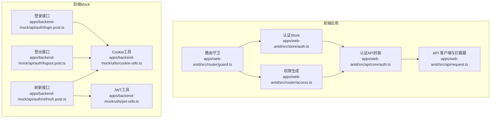
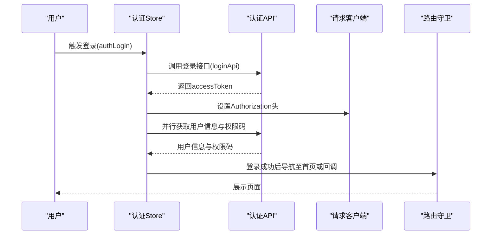
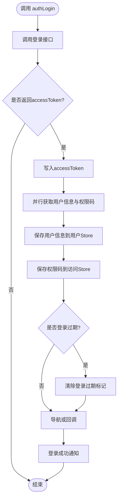
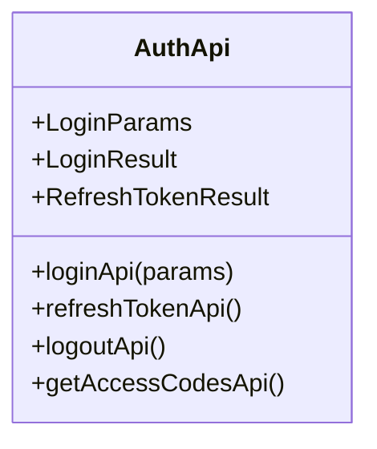
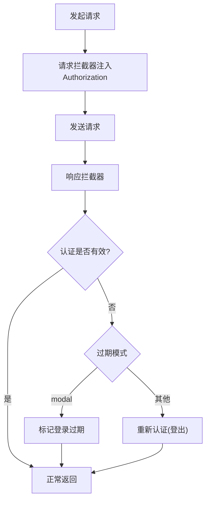
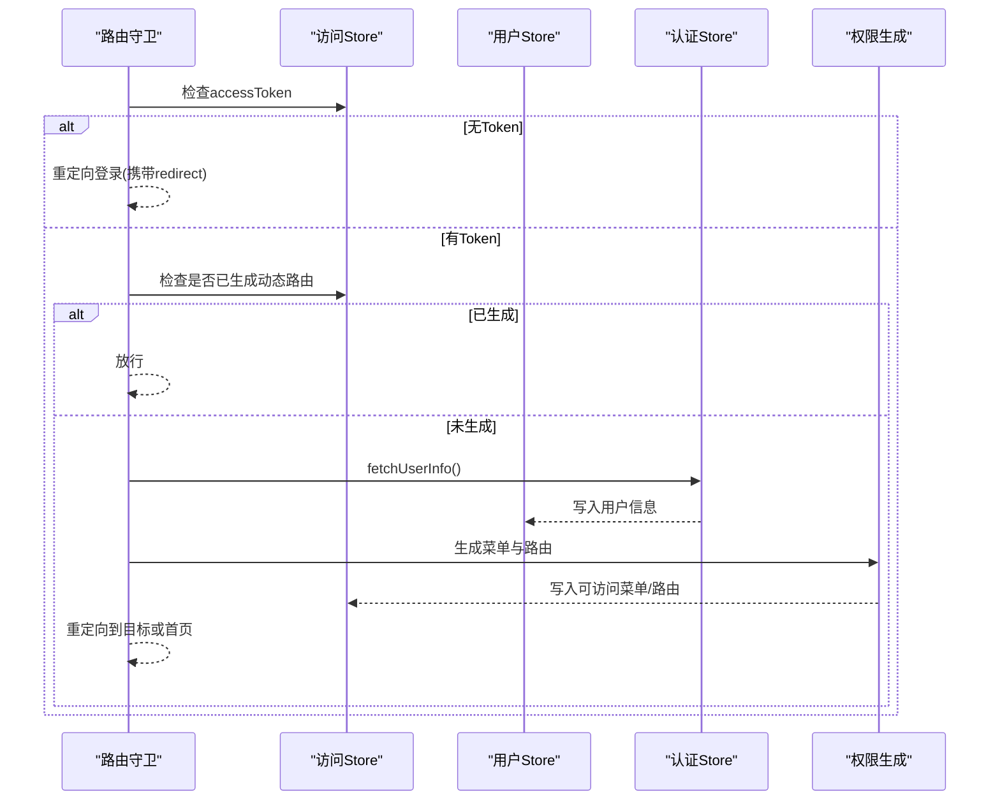
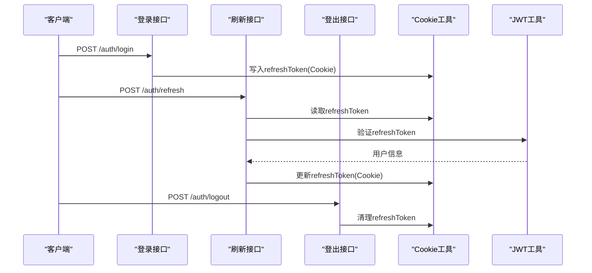
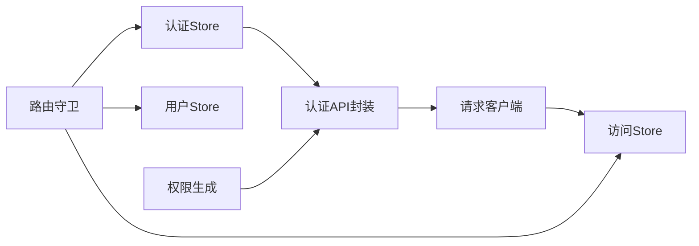

# 认证状态管理

<cite>
**本文引用的文件**
- [apps/web-antd/src/store/auth.ts](file://apps/web-antd/src/store/auth.ts)
- [apps/web-antd/src/api/core/auth.ts](file://apps/web-antd/src/api/core/auth.ts)
- [apps/web-antd/src/api/request.ts](file://apps/web-antd/src/api/request.ts)
- [apps/web-antd/src/router/guard.ts](file://apps/web-antd/src/router/guard.ts)
- [apps/web-antd/src/router/access.ts](file://apps/web-antd/src/router/access.ts)
- [apps/backend-mock/api/auth/login.post.ts](file://apps/backend-mock/api/auth/login.post.ts)
- [apps/backend-mock/api/auth/logout.post.ts](file://apps/backend-mock/api/auth/logout.post.ts)
- [apps/backend-mock/api/auth/refresh.post.ts](file://apps/backend-mock/api/auth/refresh.post.ts)
- [apps/backend-mock/utils/cookie-utils.ts](file://apps/backend-mock/utils/cookie-utils.ts)
- [apps/backend-mock/utils/jwt-utils.ts](file://apps/backend-mock/utils/jwt-utils.ts)
</cite>

## 目录

1. [简介](#简介)
2. [项目结构](#项目结构)
3. [核心组件](#核心组件)
4. [架构总览](#架构总览)
5. [详细组件分析](#详细组件分析)
6. [依赖关系分析](#依赖关系分析)
7. [性能考虑](#性能考虑)
8. [故障排查指南](#故障排查指南)
9. [结论](#结论)
10. [附录](#附录)

## 简介

本文件系统性阐述 Vben Admin 的认证状态管理模块，覆盖认证 Store 的完整实现（登录、登出、用户信息与权限码获取）、JWT 令牌的存储与刷新策略、过期处理机制、路由守卫与权限生成流程、以及跨标签页同步与持久化配置。文档同时提供 TypeScript 接口定义与类型安全使用建议，并给出常见认证场景的最佳实践。

## 项目结构

认证相关能力在前端应用层集中于以下模块：

- 认证状态管理：Pinia Store，负责登录、登出、用户信息与权限码获取、登录态标记等
- API 客户端与拦截器：统一请求客户端、响应拦截器、自动刷新与重新认证逻辑
- 路由守卫：全局前置守卫，控制访问权限、动态路由生成与重定向
- 后端 Mock：提供登录、登出、刷新接口及 Cookie 刷新令牌的存取工具

图表来源

- [apps/web-antd/src/store/auth.ts:1-118](file://apps/web-antd/src/store/auth.ts#L1-L118)
- [apps/web-antd/src/api/core/auth.ts:1-52](file://apps/web-antd/src/api/core/auth.ts#L1-L52)
- [apps/web-antd/src/api/request.ts:1-124](file://apps/web-antd/src/api/request.ts#L1-L124)
- [apps/web-antd/src/router/guard.ts:1-133](file://apps/web-antd/src/router/guard.ts#L1-L133)
- [apps/web-antd/src/router/access.ts:1-54](file://apps/web-antd/src/router/access.ts#L1-L54)
- [apps/backend-mock/api/auth/login.post.ts:1-50](file://apps/backend-mock/api/auth/login.post.ts#L1-L50)
- [apps/backend-mock/api/auth/logout.post.ts:1-20](file://apps/backend-mock/api/auth/logout.post.ts#L1-L20)
- [apps/backend-mock/api/auth/refresh.post.ts:1-40](file://apps/backend-mock/api/auth/refresh.post.ts#L1-L40)
- [apps/backend-mock/utils/cookie-utils.ts:1-40](file://apps/backend-mock/utils/cookie-utils.ts#L1-L40)
- [apps/backend-mock/utils/jwt-utils.ts:1-20](file://apps/backend-mock/utils/jwt-utils.ts#L1-L20)

章节来源

- [apps/web-antd/src/store/auth.ts:1-118](file://apps/web-antd/src/store/auth.ts#L1-L118)
- [apps/web-antd/src/api/core/auth.ts:1-52](file://apps/web-antd/src/api/core/auth.ts#L1-L52)
- [apps/web-antd/src/api/request.ts:1-124](file://apps/web-antd/src/api/request.ts#L1-L124)
- [apps/web-antd/src/router/guard.ts:1-133](file://apps/web-antd/src/router/guard.ts#L1-L133)
- [apps/web-antd/src/router/access.ts:1-54](file://apps/web-antd/src/router/access.ts#L1-L54)

## 核心组件

- 认证 Store（useAuthStore）
  - 负责登录、登出、获取用户信息、设置登录态与通知提示
  - 维护登录加载状态与返回的用户信息
- API 封装（AuthApi）
  - 登录、刷新 Token、登出、获取权限码
- 请求客户端与拦截器
  - 自动注入 Authorization 头
  - 响应拦截器处理认证失败与刷新 Token
- 路由守卫
  - 控制访问权限、动态路由生成、登录态校验与重定向

章节来源

- [apps/web-antd/src/store/auth.ts:16-117](file://apps/web-antd/src/store/auth.ts#L16-L117)
- [apps/web-antd/src/api/core/auth.ts:3-19](file://apps/web-antd/src/api/core/auth.ts#L3-L19)
- [apps/web-antd/src/api/core/auth.ts:21-51](file://apps/web-antd/src/api/core/auth.ts#L21-L51)
- [apps/web-antd/src/api/request.ts:26-117](file://apps/web-antd/src/api/request.ts#L26-L117)
- [apps/web-antd/src/router/guard.ts:47-118](file://apps/web-antd/src/router/guard.ts#L47-L118)

## 架构总览

认证状态管理采用“Store + API 客户端 + 路由守卫”的分层设计：

- Store 负责登录态与用户信息的本地状态
- API 客户端负责请求发送、鉴权头注入与自动刷新
- 路由守卫负责访问控制与动态路由生成

图表来源

- [apps/web-antd/src/store/auth.ts:28-78](file://apps/web-antd/src/store/auth.ts#L28-L78)
- [apps/web-antd/src/api/core/auth.ts:21-51](file://apps/web-antd/src/api/core/auth.ts#L21-L51)
- [apps/web-antd/src/api/request.ts:74-82](file://apps/web-antd/src/api/request.ts#L74-L82)
- [apps/web-antd/src/router/guard.ts:47-118](file://apps/web-antd/src/router/guard.ts#L47-L118)

## 详细组件分析

### 认证 Store（useAuthStore）

- 数据结构
  - loginLoading: 登录按钮加载状态
  - 全局访问状态：通过 useAccessStore 维护 accessToken、登录过期标记等
  - 用户信息：通过 useUserStore 维护
- Action 方法
  - authLogin(params, onSuccess?): 执行登录，写入 accessToken，获取用户信息与权限码，导航或回调，成功提示
  - logout(redirect?): 调用登出接口，重置所有 Store，清除登录过期标记，跳转登录页并携带重定向参数
  - fetchUserInfo(): 获取用户信息并写入用户 Store
  - $reset(): 重置登录加载状态
- Getter 计算属性
  - 无显式 Getter；登录态与用户信息通过访问 Store 与 Access/User Store 的状态读取

图表来源

- [apps/web-antd/src/store/auth.ts:28-78](file://apps/web-antd/src/store/auth.ts#L28-L78)

章节来源

- [apps/web-antd/src/store/auth.ts:16-117](file://apps/web-antd/src/store/auth.ts#L16-L117)

### 认证 API 封装（AuthApi）

- 接口定义
  - LoginParams/LoginResult：登录参数与返回
  - RefreshTokenResult：刷新 Token 返回结构
- 方法
  - loginApi：POST /auth/login
  - refreshTokenApi：POST /auth/refresh（withCredentials）
  - logoutApi：POST /auth/logout（withCredentials）
  - getAccessCodesApi：GET /auth/codes

图表来源

- [apps/web-antd/src/api/core/auth.ts:3-19](file://apps/web-antd/src/api/core/auth.ts#L3-L19)
- [apps/web-antd/src/api/core/auth.ts:21-51](file://apps/web-antd/src/api/core/auth.ts#L21-L51)

章节来源

- [apps/web-antd/src/api/core/auth.ts:1-52](file://apps/web-antd/src/api/core/auth.ts#L1-L52)

### 请求客户端与自动刷新（request.ts）

- 请求头注入
  - 在请求拦截器中将 Authorization 设置为 Bearer accessToken
- 响应拦截器
  - 默认响应拦截：按 code/data 字段映射
  - 认证拦截器：当出现无效或过期 Token 时触发重新认证或刷新 Token
- 刷新策略
  - doRefreshToken：调用 refreshTokenApi 获取新 Token 并写回 Store
  - doReAuthenticate：根据配置决定弹窗提示还是直接登出
- 配置项
  - enableRefreshToken：是否启用刷新 Token
  - loginExpiredMode：过期处理模式（modal 或跳转）

图表来源

- [apps/web-antd/src/api/request.ts:74-102](file://apps/web-antd/src/api/request.ts#L74-L102)
- [apps/web-antd/src/api/request.ts:43-56](file://apps/web-antd/src/api/request.ts#L43-L56)
- [apps/web-antd/src/api/request.ts:61-67](file://apps/web-antd/src/api/request.ts#L61-L67)

章节来源

- [apps/web-antd/src/api/request.ts:26-117](file://apps/web-antd/src/api/request.ts#L26-L117)

### 路由守卫与权限生成（guard.ts, access.ts）

- 守卫逻辑
  - 忽略访问：核心路由无需权限
  - 登录态检查：无 Token 且非忽略访问时重定向登录
  - 动态路由生成：首次访问时根据用户角色生成菜单与路由
  - 重定向：登录后回到原目标路径或默认首页
- 权限生成
  - 异步拉取菜单树，映射查询参数，生成可访问的菜单与路由
  - 支持 403 降级组件

图表来源

- [apps/web-antd/src/router/guard.ts:47-118](file://apps/web-antd/src/router/guard.ts#L47-L118)
- [apps/web-antd/src/router/access.ts:18-51](file://apps/web-antd/src/router/access.ts#L18-L51)

章节来源

- [apps/web-antd/src/router/guard.ts:1-133](file://apps/web-antd/src/router/guard.ts#L1-L133)
- [apps/web-antd/src/router/access.ts:1-54](file://apps/web-antd/src/router/access.ts#L1-L54)

### JWT 令牌存储与刷新（后端 Mock）

- 存储机制
  - 登录成功生成刷新 Token 并写入 Cookie
  - 刷新接口从 Cookie 读取刷新 Token，验证后签发新 Token 并更新 Cookie
  - 登出接口读取 Cookie 刷新 Token 并清理
- 过期处理
  - 前端通过响应拦截器检测过期并触发刷新或重新认证
  - 后端通过 JWT 工具验证刷新 Token 的有效性

图表来源

- [apps/backend-mock/api/auth/login.post.ts:1-50](file://apps/backend-mock/api/auth/login.post.ts#L1-L50)
- [apps/backend-mock/api/auth/logout.post.ts:1-20](file://apps/backend-mock/api/auth/logout.post.ts#L1-L20)
- [apps/backend-mock/api/auth/refresh.post.ts:1-40](file://apps/backend-mock/api/auth/refresh.post.ts#L1-L40)
- [apps/backend-mock/utils/cookie-utils.ts:1-40](file://apps/backend-mock/utils/cookie-utils.ts#L1-L40)
- [apps/backend-mock/utils/jwt-utils.ts:1-20](file://apps/backend-mock/utils/jwt-utils.ts#L1-L20)

章节来源

- [apps/backend-mock/api/auth/login.post.ts:1-50](file://apps/backend-mock/api/auth/login.post.ts#L1-L50)
- [apps/backend-mock/api/auth/logout.post.ts:1-20](file://apps/backend-mock/api/auth/logout.post.ts#L1-L20)
- [apps/backend-mock/api/auth/refresh.post.ts:1-40](file://apps/backend-mock/api/auth/refresh.post.ts#L1-L40)
- [apps/backend-mock/utils/cookie-utils.ts:1-40](file://apps/backend-mock/utils/cookie-utils.ts#L1-L40)
- [apps/backend-mock/utils/jwt-utils.ts:1-20](file://apps/backend-mock/utils/jwt-utils.ts#L1-L20)

## 依赖关系分析

- 认证 Store 依赖 API 封装与路由、通知等模块
- API 客户端依赖访问 Store 注入 Token
- 路由守卫依赖认证 Store 获取用户信息并生成动态路由
- 后端 Mock 提供登录、登出、刷新接口与 Cookie/JWT 工具

图表来源

- [apps/web-antd/src/store/auth.ts:13-14](file://apps/web-antd/src/store/auth.ts#L13-L14)
- [apps/web-antd/src/api/request.ts:20-22](file://apps/web-antd/src/api/request.ts#L20-L22)
- [apps/web-antd/src/router/guard.ts:8-11](file://apps/web-antd/src/router/guard.ts#L8-L11)

章节来源

- [apps/web-antd/src/store/auth.ts:1-15](file://apps/web-antd/src/store/auth.ts#L1-L15)
- [apps/web-antd/src/api/request.ts:1-25](file://apps/web-antd/src/api/request.ts#L1-L25)
- [apps/web-antd/src/router/guard.ts:1-12](file://apps/web-antd/src/router/guard.ts#L1-L12)

## 性能考虑

- 并行获取用户信息与权限码，减少首屏等待时间
- 路由守卫仅在首次访问时生成动态路由，避免重复计算
- 请求拦截器统一注入 Token，减少手动维护成本
- 建议：对频繁刷新的场景开启节流或去抖，避免短时间内多次刷新

## 故障排查指南

- 登录后无法进入受控页面
  - 检查路由守卫是否正确生成动态路由与重定向
  - 确认用户角色与菜单权限映射
- Token 过期但未自动刷新
  - 检查 enableRefreshToken 配置与响应拦截器逻辑
  - 确认后端刷新接口返回的新 Token 已写入访问 Store
- 登出后仍可访问受控页面
  - 检查登出接口是否调用成功与访问 Store 是否清空
  - 确认路由守卫的登录态检查逻辑

章节来源

- [apps/web-antd/src/router/guard.ts:47-118](file://apps/web-antd/src/router/guard.ts#L47-L118)
- [apps/web-antd/src/api/request.ts:43-67](file://apps/web-antd/src/api/request.ts#L43-L67)
- [apps/web-antd/src/store/auth.ts:80-98](file://apps/web-antd/src/store/auth.ts#L80-L98)

## 结论

本认证状态管理模块通过 Store、API 客户端与路由守卫的协同，实现了完整的登录、登出、用户信息与权限码获取、动态路由生成与权限控制。配合后端 Mock 的 Cookie/JWT 刷新机制，提供了可扩展、可维护的认证体系。建议在生产环境中结合具体后端接口完善 Token 存储与跨标签页同步策略。

## 附录

### TypeScript 接口定义与类型安全使用建议

- 登录参数与结果
  - 登录参数：包含用户名与密码等字段
  - 登录结果：包含 accessToken
- 刷新 Token 结果
  - 包含新 Token 与状态码
- 类型安全建议
  - 使用命名空间封装 API 类型，避免全局污染
  - 在 Store 中明确返回值类型，便于上层调用
  - 对权限码与用户信息进行严格的类型断言与默认值处理

章节来源

- [apps/web-antd/src/api/core/auth.ts:3-19](file://apps/web-antd/src/api/core/auth.ts#L3-L19)
- [apps/web-antd/src/api/core/auth.ts:21-51](file://apps/web-antd/src/api/core/auth.ts#L21-L51)

### 常见认证场景与最佳实践

- 登录成功后跳转
  - 使用 onSuccess 回调或默认导航至用户首页
- 登录态失效
  - 优先弹窗提示（modal 模式），否则自动登出并跳转登录
- 权限变更
  - 登录后重新拉取权限码并刷新动态路由
- 跨标签页同步
  - 建议通过浏览器事件监听或共享存储实现多标签页状态同步（需结合具体实现）

章节来源

- [apps/web-antd/src/store/auth.ts:28-78](file://apps/web-antd/src/store/auth.ts#L28-L78)
- [apps/web-antd/src/api/request.ts:43-56](file://apps/web-antd/src/api/request.ts#L43-L56)
- [apps/web-antd/src/router/guard.ts:47-118](file://apps/web-antd/src/router/guard.ts#L47-L118)
