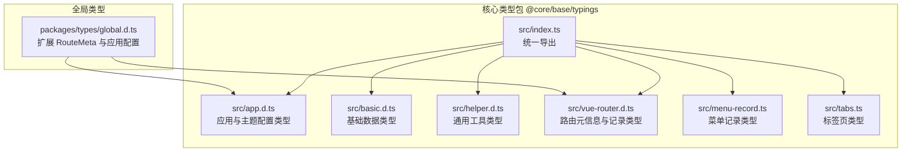
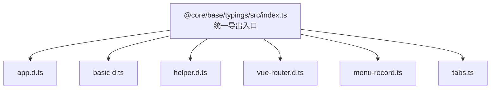
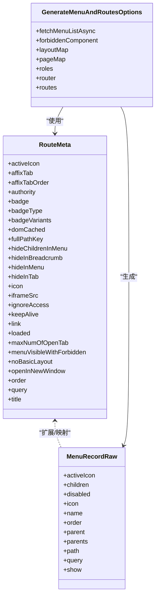
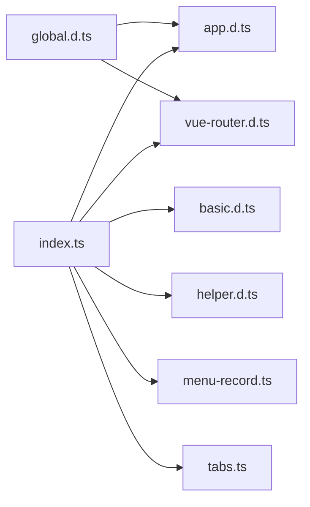

# 类型定义

<cite>
**本文引用的文件**
- [packages/@core/base/typings/src/index.ts](file://packages/@core/base/typings/src/index.ts)
- [packages/@core/base/typings/src/app.d.ts](file://packages/@core/base/typings/src/app.d.ts)
- [packages/@core/base/typings/src/basic.d.ts](file://packages/@core/base/typings/src/basic.d.ts)
- [packages/@core/base/typings/src/helper.d.ts](file://packages/@core/base/typings/src/helper.d.ts)
- [packages/@core/base/typings/src/vue-router.d.ts](file://packages/@core/base/typings/src/vue-router.d.ts)
- [packages/@core/base/typings/src/menu-record.ts](file://packages/@core/base/typings/src/menu-record.ts)
- [packages/@core/base/typings/src/tabs.ts](file://packages/@core/base/typings/src/tabs.ts)
- [packages/types/global.d.ts](file://packages/types/global.d.ts)
</cite>

## 目录
1. [简介](#简介)
2. [项目结构](#项目结构)
3. [核心组件](#核心组件)
4. [架构总览](#架构总览)
5. [详细组件分析](#详细组件分析)
6. [依赖分析](#依赖分析)
7. [性能考虑](#性能考虑)
8. [故障排查指南](#故障排查指南)
9. [结论](#结论)
10. [附录](#附录)

## 简介
本文件系统性梳理 Vben Admin 的 TypeScript 类型定义，覆盖公共接口、类型别名、枚举与泛型，解释其用途、使用场景、继承关系，并提供实际使用示例与最佳实践、版本兼容性与变更历史说明、扩展点与自定义方法、性能影响与使用建议、类型检查与编译时错误的解决方案，以及测试与验证工具。内容面向不同技术背景读者，力求循序渐进、易于上手。

## 项目结构
Vben Admin 的类型体系主要集中在核心包 @core/base/typings 中，统一导出应用配置、路由元信息、通用基础类型、菜单与标签页等类型；全局类型位于 packages/types/global.d.ts，用于扩展 Vue Router 的 RouteMeta 并声明应用全局配置接口。

**图表来源**
- [packages/@core/base/typings/src/index.ts:1-7](file://packages/@core/base/typings/src/index.ts#L1-L7)
- [packages/@core/base/typings/src/app.d.ts:1-122](file://packages/@core/base/typings/src/app.d.ts#L1-L122)
- [packages/@core/base/typings/src/basic.d.ts:1-46](file://packages/@core/base/typings/src/basic.d.ts#L1-L46)
- [packages/@core/base/typings/src/helper.d.ts:1-151](file://packages/@core/base/typings/src/helper.d.ts#L1-L151)
- [packages/@core/base/typings/src/vue-router.d.ts:1-158](file://packages/@core/base/typings/src/vue-router.d.ts#L1-L158)
- [packages/@core/base/typings/src/menu-record.ts:1-83](file://packages/@core/base/typings/src/menu-record.ts#L1-L83)
- [packages/@core/base/typings/src/tabs.ts:1-9](file://packages/@core/base/typings/src/tabs.ts#L1-L9)
- [packages/types/global.d.ts:1-33](file://packages/types/global.d.ts#L1-L33)

**章节来源**
- [packages/@core/base/typings/src/index.ts:1-7](file://packages/@core/base/typings/src/index.ts#L1-L7)
- [packages/types/global.d.ts:1-33](file://packages/types/global.d.ts#L1-L33)

## 核心组件
本节对关键类型进行分类与要点说明，便于快速定位与使用。

- 应用与主题配置类型
  - 布局类型：定义页面布局风格枚举，如全宽内容、侧边栏+导航等。
  - 主题模式：明暗/自动模式。
  - 内容紧凑度：紧凑/宽版。
  - 顶部导航模式与对齐方式：静态/固定/滚动等与对齐方式。
  - 登录过期处理模式：弹窗或页面跳转。
  - 面包屑样式：背景或默认样式。
  - 权限模式：后端/前端/混合。
  - 导航风格与标签页风格：朴素/圆润、轻快/卡片/谷歌/朴素等。
  - 页面切换动画：淡入淡出等。
  - 认证页布局：居中/居左/居右面板。
  - 时区选项：包含标签、偏移与时区标识。
  - 使用场景：用于偏好设置、主题切换、路由生成与菜单渲染、权限控制等。
  - 参考路径：[应用与主题配置类型:1-122](file://packages/@core/base/typings/src/app.d.ts#L1-L122)

- 基础数据类型
  - 基础选项：label/value 键值对，常用于下拉选择器。
  - 用户信息：头像、真实姓名、角色、部门、用户ID、用户名等。
  - 组件类名类型：支持字符串、布尔、数组、对象、null、undefined 的联合类型，用于动态类名绑定。
  - 使用场景：表单控件、用户信息展示、动态样式绑定。
  - 参考路径：[基础数据类型:1-46](file://packages/@core/base/typings/src/basic.d.ts#L1-L46)

- 通用工具类型（泛型与高级类型）
  - 深层可选/只读：DeepPartial/DeepReadonly，支持指定递归深度，避免过深导致类型膨胀。
  - 函数类型：AnyNormalFunction/AnyPromiseFunction/AnyFunction，统一函数签名。
  - 包装类型：Nullable/NonNullable、MaybePromise、EmitType。
  - 对象类型：Recordable/ReadonlyRecordable。
  - 时间句柄：TimeoutHandle/IntervalHandle。
  - 计算与 MaybeRef：MaybeReadonlyRef/MaybeComputedRef。
  - 合并与拆分：Merge/MergeAll。
  - 使用场景：跨模块复用、表单/表格/状态管理的数据结构建模、事件与回调抽象。
  - 参考路径：[通用工具类型:1-151](file://packages/@core/base/typings/src/helper.d.ts#L1-L151)

- 路由与菜单类型
  - 路由元信息 RouteMeta：包含徽标、权限、缓存、面包屑隐藏、菜单可见性、标签页固定与顺序、iframe、重定向、最大打开标签数、无基础布局、新窗口打开、排序、查询参数、标题等丰富字段。
  - 路由记录类型：RouteRecordRaw 与带字符串组件的递归类型 RouteRecordStringComponent。
  - 菜单记录类型：MenuRecordRaw/ExRouteRecordRaw，包含徽标、图标、名称、路径、父子关系、排序、参数、显示状态等。
  - 使用场景：路由配置、菜单生成、权限过滤、标签页管理、面包屑构建。
  - 参考路径：[路由与菜单类型:1-158](file://packages/@core/base/typings/src/vue-router.d.ts#L1-L158)、[菜单记录类型:1-83](file://packages/@core/base/typings/src/menu-record.ts#L1-L83)

- 标签页类型
  - TabDefinition：基于标准化路由位置，扩展标签页 key。
  - 使用场景：标签页持久化、多标签页管理。
  - 参考路径：[标签页类型:1-9](file://packages/@core/base/typings/src/tabs.ts#L1-L9)

- 全局类型
  - 扩展 Vue Router 的 RouteMeta，确保全局一致的元信息结构。
  - 应用配置接口：包含 API URL 与第三方认证配置等。
  - 使用场景：全局配置注入、运行时配置读取。
  - 参考路径：[全局类型:1-33](file://packages/types/global.d.ts#L1-L33)

**章节来源**
- [packages/@core/base/typings/src/app.d.ts:1-122](file://packages/@core/base/typings/src/app.d.ts#L1-L122)
- [packages/@core/base/typings/src/basic.d.ts:1-46](file://packages/@core/base/typings/src/basic.d.ts#L1-L46)
- [packages/@core/base/typings/src/helper.d.ts:1-151](file://packages/@core/base/typings/src/helper.d.ts#L1-L151)
- [packages/@core/base/typings/src/vue-router.d.ts:1-158](file://packages/@core/base/typings/src/vue-router.d.ts#L1-L158)
- [packages/@core/base/typings/src/menu-record.ts:1-83](file://packages/@core/base/typings/src/menu-record.ts#L1-L83)
- [packages/@core/base/typings/src/tabs.ts:1-9](file://packages/@core/base/typings/src/tabs.ts#L1-L9)
- [packages/types/global.d.ts:1-33](file://packages/types/global.d.ts#L1-L33)

## 架构总览
类型体系通过统一入口导出，形成“应用配置 + 路由元信息 + 基础类型 + 工具类型 + 菜单/标签页”的分层结构，既保证了类型的一致性，又提供了灵活的扩展点。

**图表来源**
- [packages/@core/base/typings/src/index.ts:1-7](file://packages/@core/base/typings/src/index.ts#L1-L7)

**章节来源**
- [packages/@core/base/typings/src/index.ts:1-7](file://packages/@core/base/typings/src/index.ts#L1-L7)

## 详细组件分析

### 应用与主题配置类型
- 类型族：布局、主题模式、内容紧凑度、头部模式/对齐、登录过期模式、面包屑样式、权限模式、导航风格、标签页风格、页面切换动画、认证页布局、时区选项。
- 用途：驱动界面布局与行为，支撑主题切换、权限控制、导航渲染与动画效果。
- 使用场景：偏好设置面板、主题切换、路由守卫中的权限判断、菜单生成与标签页策略。
- 最佳实践：优先使用字面量联合类型，避免字符串拼写错误；对深层配置使用 DeepPartial 进行可选合并。
- 版本兼容性与变更历史：新增/调整字段时，保持向后兼容或提供迁移提示；对枚举值变更需同步更新 UI 与逻辑分支。
- 扩展点与自定义：可在全局类型中扩展 RouteMeta 或应用配置接口，实现业务定制。
- 性能影响与建议：枚举与字面量类型在编译期即确定，无运行时开销；避免在热路径中频繁创建大型联合类型。

**章节来源**
- [packages/@core/base/typings/src/app.d.ts:1-122](file://packages/@core/base/typings/src/app.d.ts#L1-L122)
- [packages/types/global.d.ts:1-33](file://packages/types/global.d.ts#L1-L33)

### 基础数据类型
- 类型族：BasicOption/SelectOption/TabOption、BasicUserInfo、ClassType。
- 用途：表单选项、用户信息、动态类名绑定。
- 使用场景：下拉框数据源、用户资料展示、组件样式类名动态计算。
- 最佳实践：对用户信息字段使用可选属性，避免空值判断；对类名类型使用联合类型约束，减少运行时错误。
- 扩展点与自定义：可根据业务扩展 BasicUserInfo 字段，如工号、手机号等。
- 性能影响与建议：基础类型体积小，编译期优化良好；注意避免在高频渲染中重复构造大对象。

**章节来源**
- [packages/@core/base/typings/src/basic.d.ts:1-46](file://packages/@core/base/typings/src/basic.d.ts#L1-L46)

### 通用工具类型（泛型与高级类型）
- 类型族：DeepPartial/DeepReadonly、AnyFunction/AnyNormalFunction/AnyPromiseFunction、Nullable/NonNullable、MaybePromise、EmitType、Recordable/ReadonlyRecordable、TimeoutHandle/IntervalHandle、MaybeReadonlyRef/MaybeComputedRef、Merge/MergeAll。
- 用途：跨模块复用、函数签名抽象、对象与数组操作、时间句柄封装、MaybeRef/ComputedRef 支持。
- 使用场景：表单/表格/状态管理的数据结构建模、事件与回调抽象、异步流程封装。
- 最佳实践：合理设置 DeepPartial/DeepReadonly 的递归深度，避免类型膨胀；对函数类型使用 AnyFunction 统一处理同步/异步。
- 性能影响与建议：泛型在编译期展开，无运行时成本；但过深嵌套可能导致编译时间增长，应适度控制层级。
- 常见问题与解决方案：类型推断失败时，显式标注泛型参数；复杂合并类型时，使用 Merge/MergeAll 提升可读性。

**章节来源**
- [packages/@core/base/typings/src/helper.d.ts:1-151](file://packages/@core/base/typings/src/helper.d.ts#L1-L151)

### 路由与菜单类型
- 类型族：RouteMeta、RouteRecordRaw、RouteRecordStringComponent、GenerateMenuAndRoutesOptions、MenuRecordRaw/ExRouteRecordRaw。
- 用途：路由元信息扩展、菜单树构建、路由与菜单联动。
- 使用场景：权限过滤、菜单生成、标签页管理、面包屑构建、路由缓存控制。
- 最佳实践：在路由元信息中集中声明权限、缓存、可见性等策略；使用递归类型 RouteRecordStringComponent 简化菜单渲染。
- 扩展点与自定义：可在全局类型中扩展 RouteMeta，添加业务字段；在菜单记录中扩展徽标、图标等。
- 性能影响与建议：路由与菜单类型主要用于编译期校验，运行时无额外开销；但应避免在渲染路径中做重型类型计算。

**图表来源**
- [packages/@core/base/typings/src/vue-router.d.ts:1-158](file://packages/@core/base/typings/src/vue-router.d.ts#L1-L158)
- [packages/@core/base/typings/src/menu-record.ts:1-83](file://packages/@core/base/typings/src/menu-record.ts#L1-L83)

**章节来源**
- [packages/@core/base/typings/src/vue-router.d.ts:1-158](file://packages/@core/base/typings/src/vue-router.d.ts#L1-L158)
- [packages/@core/base/typings/src/menu-record.ts:1-83](file://packages/@core/base/typings/src/menu-record.ts#L1-L83)

### 标签页类型
- 类型族：TabDefinition。
- 用途：标准化标签页键值与路由位置。
- 使用场景：标签页持久化、多标签页管理、路由与标签页联动。
- 最佳实践：为每个标签页提供稳定 key，避免重复与冲突；结合路由元信息控制标签页行为。

**章节来源**
- [packages/@core/base/typings/src/tabs.ts:1-9](file://packages/@core/base/typings/src/tabs.ts#L1-L9)

### 全局类型
- 类型族：扩展 Vue Router 的 RouteMeta、应用配置接口 ApplicationConfig、全局窗口配置接口。
- 用途：统一全局配置与路由元信息结构，便于跨模块共享。
- 使用场景：运行时读取应用配置、扩展路由元信息字段。
- 最佳实践：在全局类型中声明最小必要字段，避免过度耦合；对外部模块暴露稳定的接口。

**章节来源**
- [packages/types/global.d.ts:1-33](file://packages/types/global.d.ts#L1-L33)

## 依赖分析
类型之间的依赖关系清晰，统一从 index.ts 导出，形成松耦合高内聚的模块化结构。

**图表来源**
- [packages/@core/base/typings/src/index.ts:1-7](file://packages/@core/base/typings/src/index.ts#L1-L7)
- [packages/types/global.d.ts:1-33](file://packages/types/global.d.ts#L1-L33)

**章节来源**
- [packages/@core/base/typings/src/index.ts:1-7](file://packages/@core/base/typings/src/index.ts#L1-L7)
- [packages/types/global.d.ts:1-33](file://packages/types/global.d.ts#L1-L33)

## 性能考虑
- 编译期优化：枚举与字面量类型在编译期确定，无运行时开销；泛型展开亦在编译期完成。
- 类型膨胀风险：DeepPartial/DeepReadonly 递归深度过大可能增加编译时间与内存占用，建议根据实际需求设置合理深度。
- 运行时影响：类型本身不影响运行时性能，但过多的条件类型与交叉类型可能延长编译时间。
- 建议：在高频模块中优先使用简单类型与明确的接口；对复杂类型采用分层设计与局部导入，避免一次性引入大量类型。

## 故障排查指南
- 类型检查与编译错误
  - 症状：编译报错或类型推断异常。
  - 解决方案：确认字段是否符合 RouteMeta/MenuRecordRaw 等接口；对可选字段使用可空类型包装；对函数类型使用 AnyFunction 统一处理。
  - 参考路径：[通用工具类型:1-151](file://packages/@core/base/typings/src/helper.d.ts#L1-L151)、[路由与菜单类型:1-158](file://packages/@core/base/typings/src/vue-router.d.ts#L1-L158)、[菜单记录类型:1-83](file://packages/@core/base/typings/src/menu-record.ts#L1-L83)

- 运行时配置读取
  - 症状：无法读取全局配置。
  - 解决方案：确认全局类型已正确声明并注入到 window；检查 ApplicationConfig 字段是否完整。
  - 参考路径：[全局类型:1-33](file://packages/types/global.d.ts#L1-L33)

- 菜单与路由不一致
  - 症状：菜单项与路由不匹配。
  - 解决方案：核对 MenuRecordRaw 与 RouteRecordRaw 的字段映射；确保路径与权限配置一致。
  - 参考路径：[菜单记录类型:1-83](file://packages/@core/base/typings/src/menu-record.ts#L1-L83)、[路由与菜单类型:1-158](file://packages/@core/base/typings/src/vue-router.d.ts#L1-L158)

**章节来源**
- [packages/@core/base/typings/src/helper.d.ts:1-151](file://packages/@core/base/typings/src/helper.d.ts#L1-L151)
- [packages/@core/base/typings/src/vue-router.d.ts:1-158](file://packages/@core/base/typings/src/vue-router.d.ts#L1-L158)
- [packages/@core/base/typings/src/menu-record.ts:1-83](file://packages/@core/base/typings/src/menu-record.ts#L1-L83)
- [packages/types/global.d.ts:1-33](file://packages/types/global.d.ts#L1-L33)

## 结论
Vben Admin 的类型体系以统一导出为核心，围绕应用配置、路由元信息、基础类型与工具类型构建，辅以菜单与标签页类型，形成完整的前端类型骨架。通过合理的枚举与泛型设计，既保证了类型安全，又兼顾了开发效率。建议在扩展时遵循最小可用原则，保持类型简洁与可维护性。

## 附录
- 实际使用示例与最佳实践
  - 应用配置：在偏好设置中使用布局、主题、权限模式等枚举，驱动界面切换。
  - 路由元信息：在路由中声明权限、缓存、可见性等字段，配合权限中间件使用。
  - 菜单与标签页：使用 MenuRecordRaw 与 TabDefinition 统一管理菜单树与标签页状态。
  - 全局配置：通过全局类型注入应用配置，确保跨模块一致性。
- 测试与验证工具
  - 使用 TypeScript 编译器进行类型检查，确保所有接口与实现一致。
  - 在复杂类型场景下，可通过局部导入与类型断言验证推断结果。
  - 对于枚举与字面量类型，建议编写单元测试覆盖边界值与组合情况。