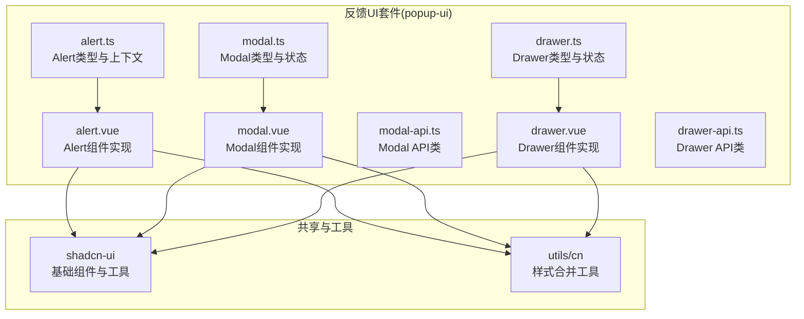
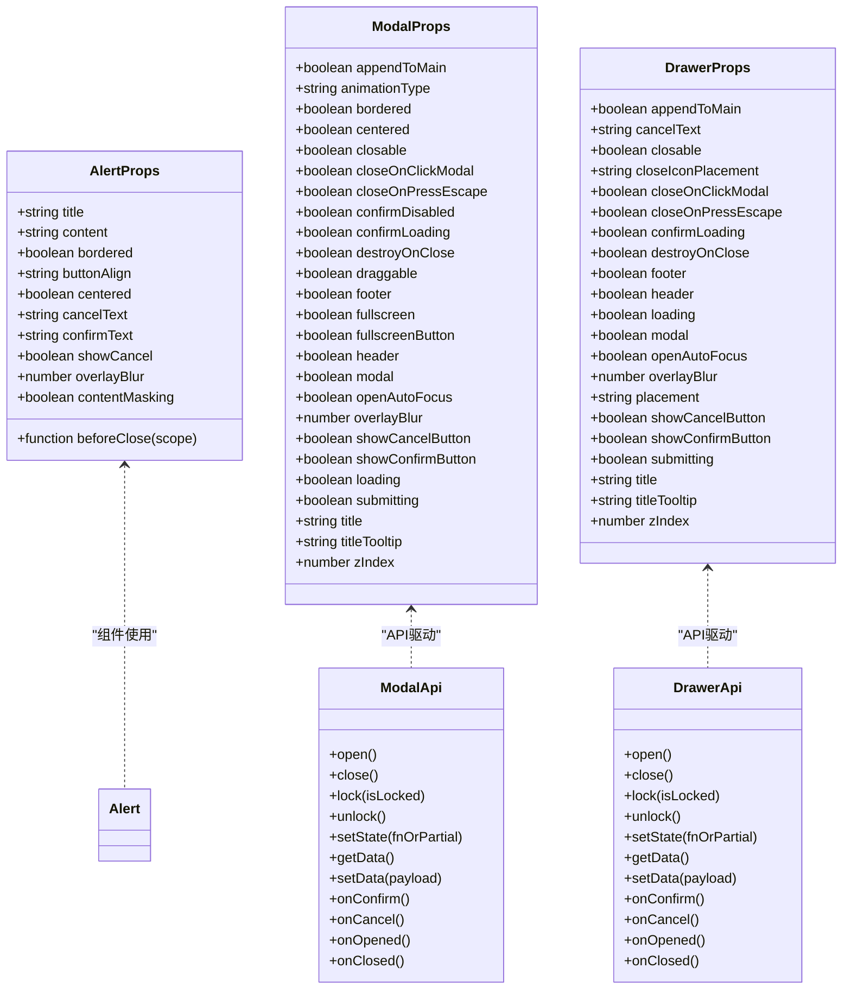
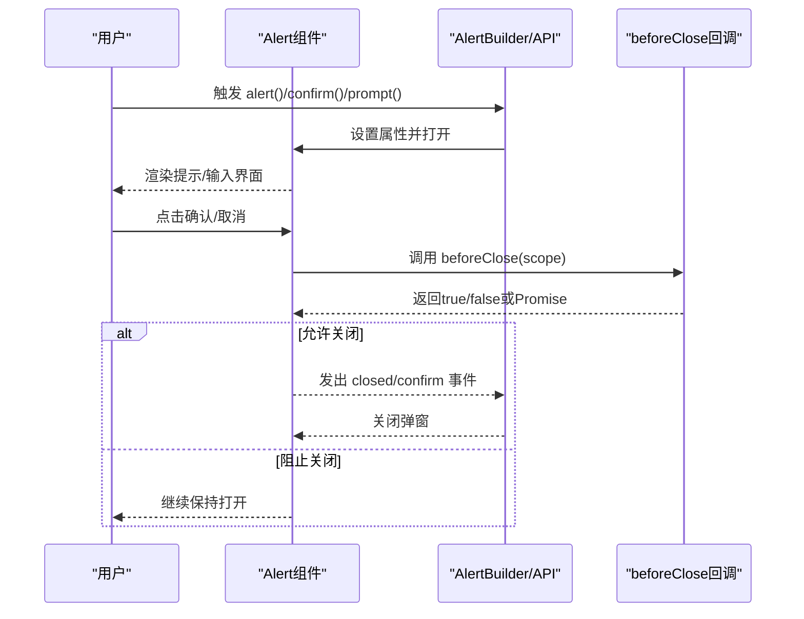
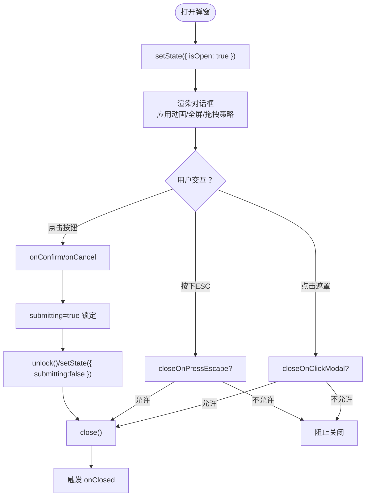
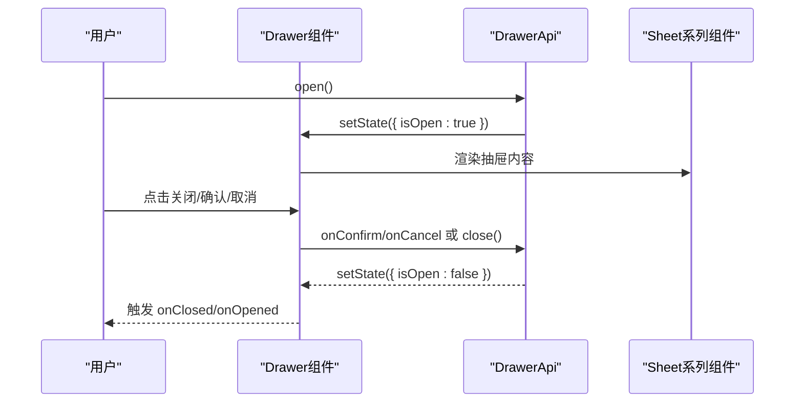
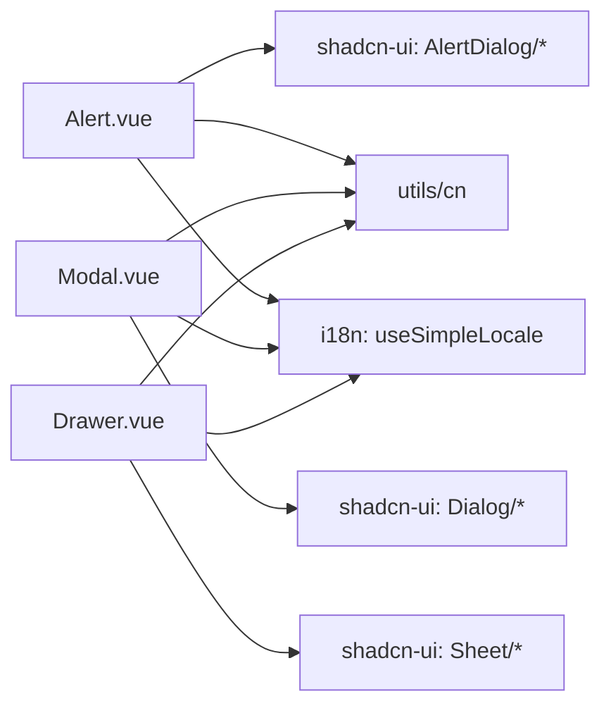

# 反馈组件

<cite>
**本文引用的文件**
- [packages/@core/ui-kit/popup-ui/src/alert/alert.ts](file://packages/@core/ui-kit/popup-ui/src/alert/alert.ts)
- [packages/@core/ui-kit/popup-ui/src/alert/alert.vue](file://packages/@core/ui-kit/popup-ui/src/alert/alert.vue)
- [packages/@core/ui-kit/popup-ui/src/alert/index.ts](file://packages/@core/ui-kit/popup-ui/src/alert/index.ts)
- [packages/@core/ui-kit/popup-ui/src/modal/modal.ts](file://packages/@core/ui-kit/popup-ui/src/modal/modal.ts)
- [packages/@core/ui-kit/popup-ui/src/modal/modal.vue](file://packages/@core/ui-kit/popup-ui/src/modal/modal.vue)
- [packages/@core/ui-kit/popup-ui/src/modal/modal-api.ts](file://packages/@core/ui-kit/popup-ui/src/modal/modal-api.ts)
- [packages/@core/ui-kit/popup-ui/src/modal/index.ts](file://packages/@core/ui-kit/popup-ui/src/modal/index.ts)
- [packages/@core/ui-kit/popup-ui/src/drawer/drawer.ts](file://packages/@core/ui-kit/popup-ui/src/drawer/drawer.ts)
- [packages/@core/ui-kit/popup-ui/src/drawer/drawer.vue](file://packages/@core/ui-kit/popup-ui/src/drawer/drawer.vue)
- [packages/@core/ui-kit/popup-ui/src/drawer/drawer-api.ts](file://packages/@core/ui-kit/popup-ui/src/drawer/drawer-api.ts)
- [packages/@core/ui-kit/popup-ui/src/drawer/index.ts](file://packages/@core/ui-kit/popup-ui/src/drawer/index.ts)
- [packages/@core/ui-kit/popup-ui/src/index.ts](file://packages/@core/ui-kit/popup-ui/src/index.ts)
- [docs/src/components/common-ui/vben-alert.md](file://docs/src/components/common-ui/vben-alert.md)
- [docs/src/components/common-ui/vben-modal.md](file://docs/src/components/common-ui/vben-modal.md)
- [docs/src/components/common-ui/vben-drawer.md](file://docs/src/components/common-ui/vben-drawer.md)
</cite>

## 目录

1. [简介](#简介)
2. [项目结构](#项目结构)
3. [核心组件](#核心组件)
4. [架构总览](#架构总览)
5. [详细组件分析](#详细组件分析)
6. [依赖关系分析](#依赖关系分析)
7. [性能考量](#性能考量)
8. [故障排查指南](#故障排查指南)
9. [结论](#结论)
10. [附录](#附录)

## 简介

本文件为反馈类组件的全面API文档，覆盖以下能力：

- 弹窗组件：Alert（提示）、Modal（确认对话框）、Drawer（抽屉面板）
- 结果页组件：Result（结果页面，位于其他UI套件中，本文给出集成与使用要点）
- 组件特性：打开/关闭、动画效果、交互逻辑、状态管理、事件回调、无障碍与键盘操作、自定义样式与主题适配、性能与最佳实践

反馈组件统一基于共享状态与API类进行状态驱动与事件编排，提供一致的编程式调用体验，并通过组合式API与模板指令实现灵活的声明式渲染。

## 项目结构

反馈组件位于统一的UI套件模块中，按功能域拆分：

- popup-ui：弹窗与反馈相关的核心实现
- shadcn-ui：底层UI原子组件与样式工具（如AlertDialog、Sheet、Dialog等）
- 文档：各组件的使用示例与说明

图表来源

- [packages/@core/ui-kit/popup-ui/src/alert/alert.ts:1-100](file://packages/@core/ui-kit/popup-ui/src/alert/alert.ts#L1-L100)
- [packages/@core/ui-kit/popup-ui/src/alert/alert.vue:1-211](file://packages/@core/ui-kit/popup-ui/src/alert/alert.vue#L1-L211)
- [packages/@core/ui-kit/popup-ui/src/modal/modal.ts:1-195](file://packages/@core/ui-kit/popup-ui/src/modal/modal.ts#L1-L195)
- [packages/@core/ui-kit/popup-ui/src/modal/modal.vue:1-373](file://packages/@core/ui-kit/popup-ui/src/modal/modal.vue#L1-L373)
- [packages/@core/ui-kit/popup-ui/src/modal/modal-api.ts:1-191](file://packages/@core/ui-kit/popup-ui/src/modal/modal-api.ts#L1-L191)
- [packages/@core/ui-kit/popup-ui/src/drawer/drawer.ts:1-180](file://packages/@core/ui-kit/popup-ui/src/drawer/drawer.ts#L1-L180)
- [packages/@core/ui-kit/popup-ui/src/drawer/drawer.vue:1-334](file://packages/@core/ui-kit/popup-ui/src/drawer/drawer.vue#L1-L334)
- [packages/@core/ui-kit/popup-ui/src/drawer/drawer-api.ts:1-179](file://packages/@core/ui-kit/popup-ui/src/drawer/drawer-api.ts#L1-L179)

章节来源

- [packages/@core/ui-kit/popup-ui/src/index.ts:1-3](file://packages/@core/ui-kit/popup-ui/src/index.ts#L1-L3)

## 核心组件

本节概述三大反馈组件的能力边界与共性：

- Alert：轻量提示、确认/取消、可带输入框的“Prompt”、可编程控制的“beforeClose”钩子
- Modal：确认对话框，支持动画类型、拖拽、全屏、遮罩模糊、加载/提交锁定、键盘与交互拦截
- Drawer：抽屉面板，支持多方位出现、关闭按钮位置、遮罩模糊、加载/提交锁定、键盘与交互拦截
- Result：结果页面（非弹窗），作为业务结果展示组件，常与反馈流程配合使用

章节来源

- [packages/@core/ui-kit/popup-ui/src/alert/alert.ts:13-100](file://packages/@core/ui-kit/popup-ui/src/alert/alert.ts#L13-L100)
- [packages/@core/ui-kit/popup-ui/src/modal/modal.ts:7-195](file://packages/@core/ui-kit/popup-ui/src/modal/modal.ts#L7-L195)
- [packages/@core/ui-kit/popup-ui/src/drawer/drawer.ts:11-180](file://packages/@core/ui-kit/popup-ui/src/drawer/drawer.ts#L11-L180)

## 架构总览

反馈组件采用“类型定义 + 组合式组件 + API类 + 共享状态”的分层设计：

- 类型层：定义属性、状态、上下文与API选项
- 组件层：基于共享状态与优先级策略渲染UI、绑定事件、处理动画与无障碍
- API层：提供open/close/setData/setState/lock/unlock等编程式接口
- 工具层：样式合并、国际化、优先级合并、拖拽逻辑等

图表来源

- [packages/@core/ui-kit/popup-ui/src/alert/alert.ts:13-100](file://packages/@core/ui-kit/popup-ui/src/alert/alert.ts#L13-L100)
- [packages/@core/ui-kit/popup-ui/src/modal/modal.ts:7-195](file://packages/@core/ui-kit/popup-ui/src/modal/modal.ts#L7-L195)
- [packages/@core/ui-kit/popup-ui/src/drawer/drawer.ts:11-180](file://packages/@core/ui-kit/popup-ui/src/drawer/drawer.ts#L11-L180)
- [packages/@core/ui-kit/popup-ui/src/modal/modal-api.ts:6-191](file://packages/@core/ui-kit/popup-ui/src/modal/modal-api.ts#L6-L191)
- [packages/@core/ui-kit/popup-ui/src/drawer/drawer-api.ts:6-179](file://packages/@core/ui-kit/popup-ui/src/drawer/drawer-api.ts#L6-L179)

## 详细组件分析

### Alert（提示/确认/输入）

- 组件职责
  - 轻量提示、成功/警告/错误/信息/疑问等状态图标
  - 支持确认/取消按钮、自定义底部内容、居中/边框样式
  - 支持“Prompt”模式：注入输入组件与默认值，通过beforeClose携带用户输入
  - 支持“关闭前遮罩loading”以阻塞用户交互
- 关键属性
  - 基础：title、content、icon（字符串枚举或自定义组件）
  - 行为：beforeClose、contentMasking、showCancel、buttonAlign、centered、bordered
  - 定制：containerClass、contentClass、cancelText、confirmText、overlayBlur
- 事件与上下文
  - 事件：opened、confirm、closed
  - 上下文：提供/注入Alert上下文，暴露doCancel/doConfirm供内部按钮使用
- 使用要点
  - 编程式：通过AlertBuilder导出的alert/confirm/prompt方法快速调用
  - 模板式：直接引入Alert组件，使用v-model:open控制显隐

图表来源

- [packages/@core/ui-kit/popup-ui/src/alert/alert.vue:121-136](file://packages/@core/ui-kit/popup-ui/src/alert/alert.vue#L121-L136)
- [packages/@core/ui-kit/popup-ui/src/alert/alert.ts:9-17](file://packages/@core/ui-kit/popup-ui/src/alert/alert.ts#L9-L17)

章节来源

- [packages/@core/ui-kit/popup-ui/src/alert/alert.ts:13-100](file://packages/@core/ui-kit/popup-ui/src/alert/alert.ts#L13-L100)
- [packages/@core/ui-kit/popup-ui/src/alert/alert.vue:33-136](file://packages/@core/ui-kit/popup-ui/src/alert/alert.vue#L33-L136)
- [packages/@core/ui-kit/popup-ui/src/alert/index.ts:1-15](file://packages/@core/ui-kit/popup-ui/src/alert/index.ts#L1-L15)

### Modal（确认对话框）

- 组件职责
  - 标准确认对话框，支持多种动画类型、拖拽、全屏、遮罩模糊
  - 加载/提交锁定：统一屏蔽交互，防止误操作
  - 键盘与交互拦截：ESC关闭、点击遮罩关闭、焦点外抛处理
- 关键属性
  - 显示与布局：animationType、centered、bordered、fullscreen、fullscreenButton
  - 交互控制：closable、closeOnClickModal、closeOnPressEscape、openAutoFocus
  - 内容与脚部：header/footer、title/titleTooltip、description、loading/submitting
  - 定制：class/contentClass/headerClass/footerClass、modal、overlayBlur、zIndex
  - 生命周期：destroyOnClose、appendToMain
- API能力
  - open/close：打开/关闭弹窗
  - lock/unlock：锁定/解锁（提交中）
  - setState/getState：动态修改状态
  - setData/getData：共享数据传递
  - 回调：onOpenChange/onOpened/onClosed/onConfirm/onCancel/onBeforeClose
- 无障碍与键盘
  - ESC键关闭受控
  - 焦点外抛与自动聚焦受控
  - 无标题/描述时插入VisuallyHidden占位，确保读屏友好

图表来源

- [packages/@core/ui-kit/popup-ui/src/modal/modal.vue:180-230](file://packages/@core/ui-kit/popup-ui/src/modal/modal.vue#L180-L230)
- [packages/@core/ui-kit/popup-ui/src/modal/modal-api.ts:96-106](file://packages/@core/ui-kit/popup-ui/src/modal/modal-api.ts#L96-L106)

章节来源

- [packages/@core/ui-kit/popup-ui/src/modal/modal.ts:7-195](file://packages/@core/ui-kit/popup-ui/src/modal/modal.ts#L7-L195)
- [packages/@core/ui-kit/popup-ui/src/modal/modal.vue:44-231](file://packages/@core/ui-kit/popup-ui/src/modal/modal.vue#L44-L231)
- [packages/@core/ui-kit/popup-ui/src/modal/modal-api.ts:6-191](file://packages/@core/ui-kit/popup-ui/src/modal/modal-api.ts#L6-L191)
- [packages/@core/ui-kit/popup-ui/src/modal/index.ts:1-4](file://packages/@core/ui-kit/popup-ui/src/modal/index.ts#L1-L4)

### Drawer（抽屉面板）

- 组件职责
  - 从侧边滑入的抽屉，支持多方位出现（上/下/左/右）
  - 关闭按钮位置可选（左侧/右侧），支持遮罩模糊与加载/提交锁定
  - 键盘与交互拦截：ESC关闭、点击遮罩关闭、焦点外抛处理
- 关键属性
  - 位置与外观：placement、closable、closeIconPlacement、bordered/header/footer
  - 交互控制：closeOnClickModal、closeOnPressEscape、openAutoFocus
  - 内容与脚部：title/titleTooltip、description、loading/submitting
  - 定制：class/contentClass/headerClass/footerClass、modal、overlayBlur、zIndex
  - 生命周期：destroyOnClose、appendToMain
- API能力
  - open/close：打开/关闭抽屉
  - lock/unlock：锁定/解锁（提交中）
  - setState/getState：动态修改状态
  - setData/getData：共享数据传递
  - 回调：onOpenChange/onOpened/onClosed/onConfirm/onCancel/onBeforeClose
- 无障碍与键盘
  - ESC键关闭受控
  - 焦点外抛与自动聚焦受控
  - 无标题/描述时插入VisuallyHidden占位，确保读屏友好

图表来源

- [packages/@core/ui-kit/popup-ui/src/drawer/drawer.vue:171-177](file://packages/@core/ui-kit/popup-ui/src/drawer/drawer.vue#L171-L177)
- [packages/@core/ui-kit/popup-ui/src/drawer/drawer-api.ts:149-151](file://packages/@core/ui-kit/popup-ui/src/drawer/drawer-api.ts#L149-L151)

章节来源

- [packages/@core/ui-kit/popup-ui/src/drawer/drawer.ts:11-180](file://packages/@core/ui-kit/popup-ui/src/drawer/drawer.ts#L11-L180)
- [packages/@core/ui-kit/popup-ui/src/drawer/drawer.vue:43-178](file://packages/@core/ui-kit/popup-ui/src/drawer/drawer.vue#L43-L178)
- [packages/@core/ui-kit/popup-ui/src/drawer/drawer-api.ts:6-179](file://packages/@core/ui-kit/popup-ui/src/drawer/drawer-api.ts#L6-L179)
- [packages/@core/ui-kit/popup-ui/src/drawer/index.ts:1-4](file://packages/@core/ui-kit/popup-ui/src/drawer/index.ts#L1-L4)

### Result（结果页面）

- 组件职责
  - 用于展示业务执行后的结果页面（成功/失败/信息等）
  - 通常与反馈流程结合：先弹窗确认，再跳转/展示结果页
- 使用建议
  - 通过路由或抽屉/模态承载结果页
  - 结合共享数据传递执行上下文
  - 与反馈组件的回调联动，实现“确认后进入结果页”的流程

章节来源

- [docs/src/components/common-ui/vben-drawer.md](file://docs/src/components/common-ui/vben-drawer.md)

## 依赖关系分析

- 组件与UI原子层
  - Alert基于AlertDialog/SheetContent等组合
  - Modal基于Dialog/DialogContent等组合
  - Drawer基于Sheet/SheetContent等组合
- 状态与优先级
  - 组件通过优先级策略合并props与store状态，保证外部传参与全局状态的一致性
- 工具与样式
  - 使用cn进行类名合并，提升主题适配灵活性
  - 国际化通过useSimpleLocale提供文本翻译

图表来源

- [packages/@core/ui-kit/popup-ui/src/alert/alert.vue:1-31](file://packages/@core/ui-kit/popup-ui/src/alert/alert.vue#L1-L31)
- [packages/@core/ui-kit/popup-ui/src/modal/modal.vue:15-36](file://packages/@core/ui-kit/popup-ui/src/modal/modal.vue#L15-L36)
- [packages/@core/ui-kit/popup-ui/src/drawer/drawer.vue:14-37](file://packages/@core/ui-kit/popup-ui/src/drawer/drawer.vue#L14-L37)

## 性能考量

- 渲染优化
  - destroyOnClose：关闭时销毁DOM，减少内存占用；配合force-mount在首次打开时挂载
  - appendToMain：可将弹窗挂载至主内容区，避免层级与滚动问题
- 交互与动画
  - animationType与拖拽仅在非全屏与有头部时生效，避免不必要的重排
  - overlayBlur与zIndex可控，降低视觉干扰与层级冲突
- 状态与事件
  - 通过store订阅与回调解耦，避免频繁重渲染
  - lock/unlock统一屏蔽交互，减少无效事件处理
- 最佳实践
  - 大内容建议懒加载或延迟渲染
  - 长耗时操作使用lock并提供明确的loading文案
  - 合理使用beforeClose进行二次校验，避免阻塞主线程

## 故障排查指南

- 无法关闭弹窗
  - 检查closeOnClickModal与closeOnPressEscape是否被设为false
  - 确认submitting状态是否为true导致交互被锁定
- ESC无效
  - 确认closeOnPressEscape未被禁用
- 点击遮罩无效
  - 检查closeOnClickModal是否为true
- 焦点异常
  - 检查openAutoFocus是否启用，必要时使用@open-auto-focus拦截
- 锁定状态无法解除
  - 确认unlock或setState({ submitting: false })是否调用
- 样式错乱
  - 检查containerClass/contentClass/headerClass/footerClass是否与主题变量冲突
  - 确认overlayBlur与zIndex层级设置合理

章节来源

- [packages/@core/ui-kit/popup-ui/src/modal/modal.vue:180-215](file://packages/@core/ui-kit/popup-ui/src/modal/modal.vue#L180-L215)
- [packages/@core/ui-kit/popup-ui/src/drawer/drawer.vue:116-148](file://packages/@core/ui-kit/popup-ui/src/drawer/drawer.vue#L116-L148)

## 结论

反馈组件通过统一的类型定义、组件实现与API类，提供了高内聚、低耦合的弹窗与抽屉解决方案。其编程式与声明式双通道、完善的事件与回调体系、以及无障碍与键盘支持，使得复杂交互场景也能保持一致的用户体验。结合主题与样式工具，可在多框架环境下快速落地。

## 附录

- 编程式入口
  - Alert：通过AlertBuilder导出的alert/confirm/prompt方法
  - Modal：通过useVbenModal/useVbenDrawer提供的API实例
- 文档参考
  - Alert组件文档：[vben-alert.md](file://docs/src/components/common-ui/vben-alert.md)
  - Modal组件文档：[vben-modal.md](file://docs/src/components/common-ui/vben-modal.md)
  - Drawer组件文档：[vben-drawer.md](file://docs/src/components/common-ui/vben-drawer.md)
