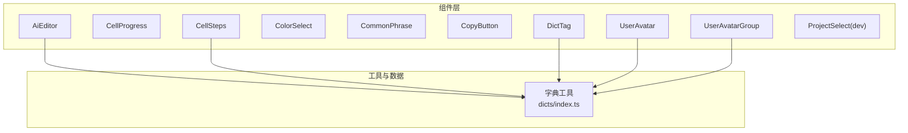
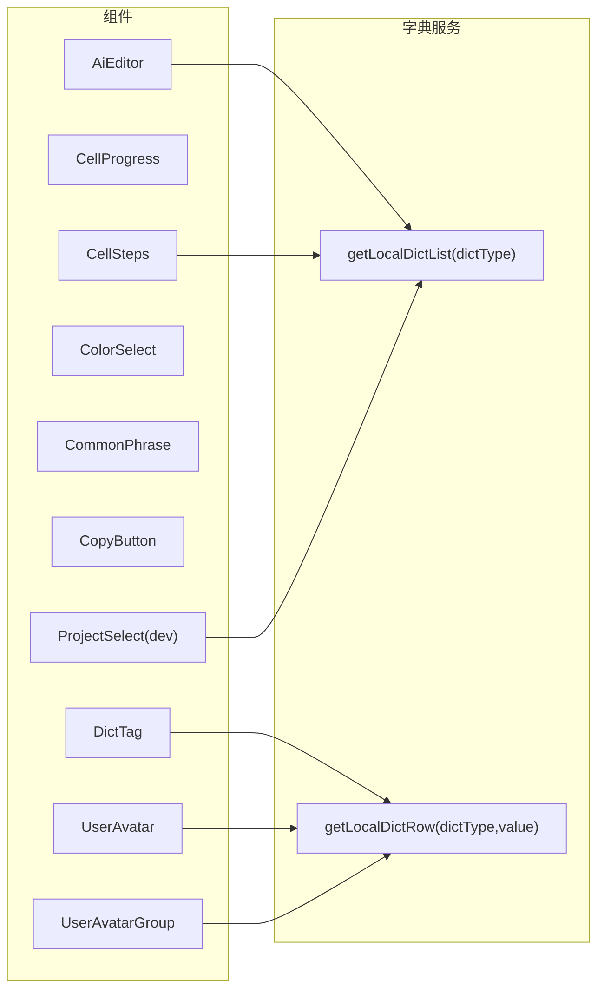
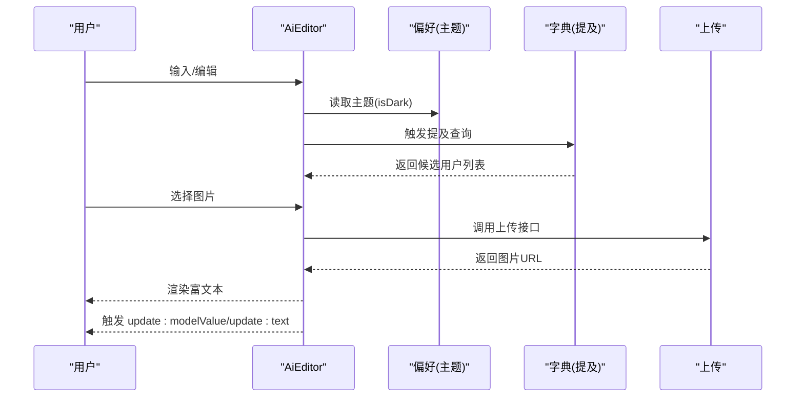
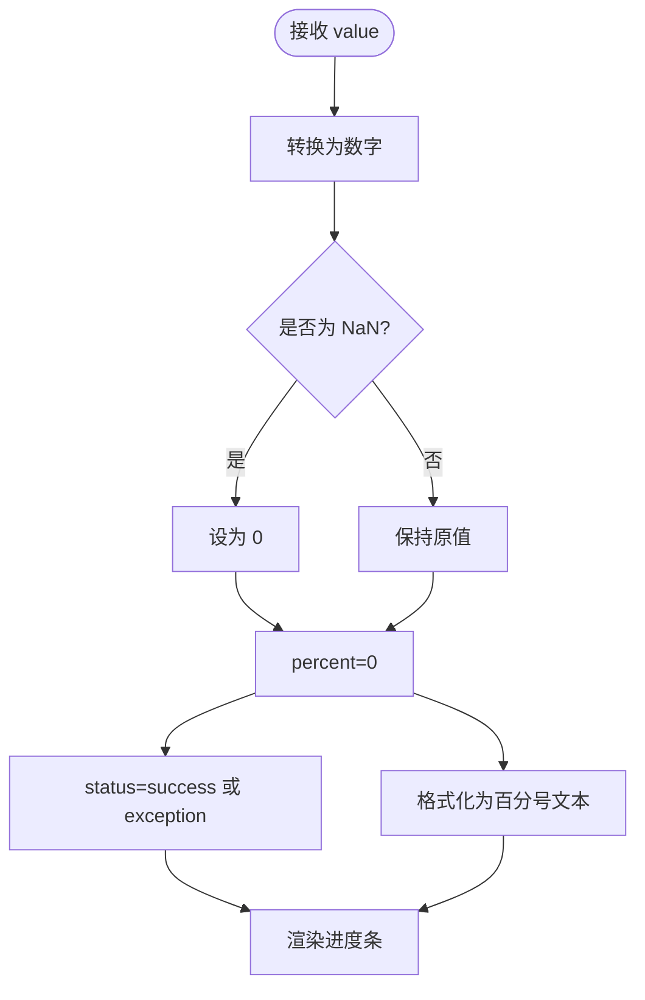
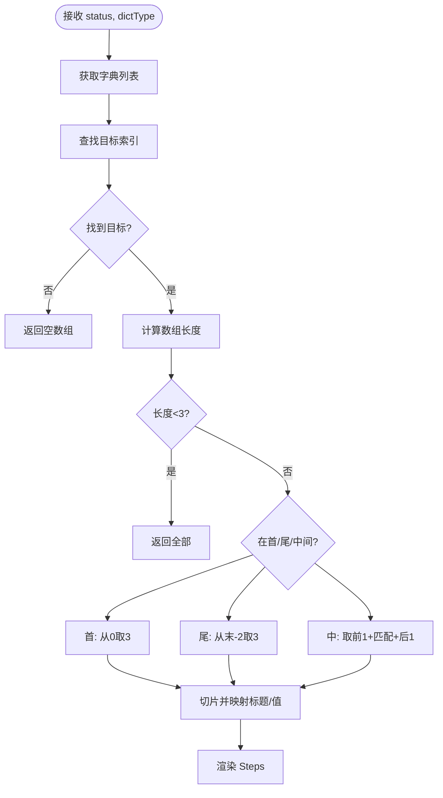
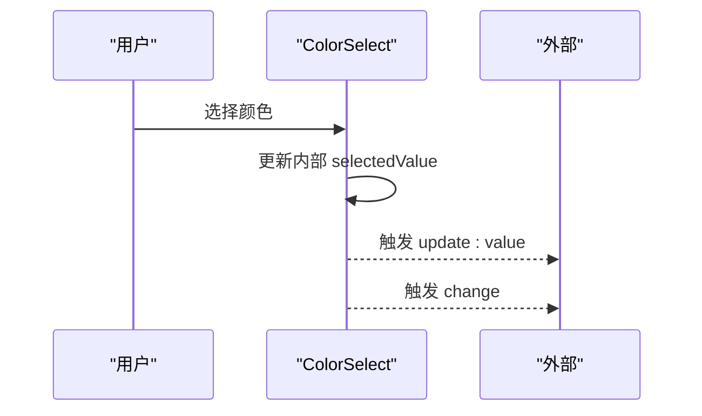
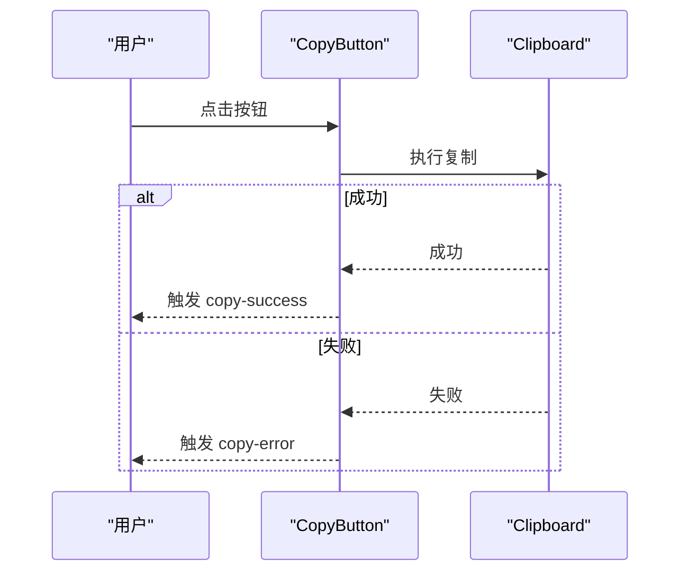
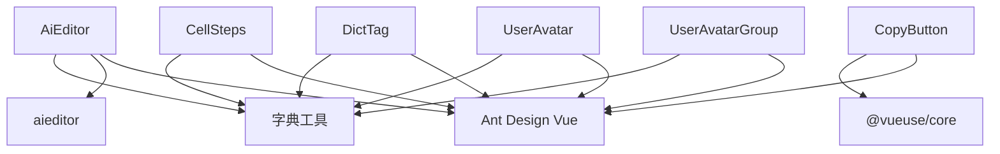

# 基础组件

<cite>
**本文引用的文件**
- [AiEditor/index.vue](file://apps/web-antd/src/components/AiEditor/index.vue)
- [CellProgress/index.vue](file://apps/web-antd/src/components/CellProgress/index.vue)
- [CellSteps/index.vue](file://apps/web-antd/src/components/CellSteps/index.vue)
- [ColorSelect/index.vue](file://apps/web-antd/src/components/ColorSelect/index.vue)
- [CommonPhrase/index.vue](file://apps/web-antd/src/components/CommonPhrase/index.vue)
- [CopyButton/index.vue](file://apps/web-antd/src/components/CopyButton/index.vue)
- [DictTag/index.vue](file://apps/web-antd/src/components/DictTag/index.vue)
- [UserAvatar/index.vue](file://apps/web-antd/src/components/UserAvatar/index.vue)
- [UserAvatarGroup/index.vue](file://apps/web-antd/src/components/UserAvatarGroup/index.vue)
- [ProjectSelect/index.vue](file://apps/web-antd/src/components/dev/ProjectSelect/index.vue)
- [dicts/index.ts](file://apps/web-antd/src/dicts/index.ts)
</cite>

## 目录
1. [简介](#简介)
2. [项目结构](#项目结构)
3. [核心组件](#核心组件)
4. [架构概览](#架构概览)
5. [详细组件分析](#详细组件分析)
6. [依赖分析](#依赖分析)
7. [性能考虑](#性能考虑)
8. [故障排查指南](#故障排查指南)
9. [结论](#结论)
10. [附录](#附录)

## 简介
本章节面向基础组件的API与使用说明，覆盖以下组件：AiEditor、CellProgress、CellSteps、ColorSelect、CommonPhrase、CopyButton、DictTag、UserAvatar、UserAvatarGroup、ProjectSelect。内容包括：
- 属性（props）、事件回调、插槽与方法接口
- TypeScript 类型与默认值
- 使用示例与参数配置
- 样式定制与主题适配
- 响应式行为与无障碍支持
- 最佳实践与性能优化建议

## 项目结构
基础组件集中于应用前端工程的组件目录，采用按功能分层组织：
- 组件文件位于 apps/web-antd/src/components 下，部分组件位于 dev 子目录用于演示或开发用途
- 字典能力通过 apps/web-antd/src/dicts/index.ts 提供本地字典查询与映射

**图表来源**
- [AiEditor/index.vue:1-153](file://apps/web-antd/src/components/AiEditor/index.vue#L1-L153)
- [CellSteps/index.vue:1-93](file://apps/web-antd/src/components/CellSteps/index.vue#L1-L93)
- [DictTag/index.vue:1-20](file://apps/web-antd/src/components/DictTag/index.vue#L1-L20)
- [dicts/index.ts:1-76](file://apps/web-antd/src/dicts/index.ts#L1-L76)

**章节来源**
- [AiEditor/index.vue:1-153](file://apps/web-antd/src/components/AiEditor/index.vue#L1-L153)
- [CellProgress/index.vue:1-56](file://apps/web-antd/src/components/CellProgress/index.vue#L1-L56)
- [CellSteps/index.vue:1-93](file://apps/web-antd/src/components/CellSteps/index.vue#L1-L93)
- [ColorSelect/index.vue:1-76](file://apps/web-antd/src/components/ColorSelect/index.vue#L1-L76)
- [CommonPhrase/index.vue:1-31](file://apps/web-antd/src/components/CommonPhrase/index.vue#L1-L31)
- [CopyButton/index.vue:1-75](file://apps/web-antd/src/components/CopyButton/index.vue#L1-L75)
- [DictTag/index.vue:1-20](file://apps/web-antd/src/components/DictTag/index.vue#L1-L20)
- [UserAvatar/index.vue:1-33](file://apps/web-antd/src/components/UserAvatar/index.vue#L1-L33)
- [UserAvatarGroup/index.vue:1-31](file://apps/web-antd/src/components/UserAvatarGroup/index.vue#L1-L31)
- [ProjectSelect/index.vue:1-136](file://apps/web-antd/src/components/dev/ProjectSelect/index.vue#L1-L136)
- [dicts/index.ts:1-76](file://apps/web-antd/src/dicts/index.ts#L1-L76)

## 核心组件
本节对各组件进行API总览与要点说明。

- AiEditor
  - 作用：基于 aieditor 的富文本编辑器封装，支持提及用户、图片上传、主题切换、工具栏控制等
  - 关键属性：modelValue、defaultHtml、width、height、placeholder、showToolbar
  - 事件：update:modelValue、update:text
  - 方法：defineExpose 暴露 aiEditor 实例
  - 默认值：width='100%'、height='600px'、placeholder=''、showToolbar=true
  - 典型用法：双向绑定 v-model，监听 update:modelValue 同步内容；根据 isDark 切换主题

- CellProgress
  - 作用：vxe 表格自定义进度条单元格，按百分比显示并带状态色
  - 关键属性：value（Number，必填）
  - 事件：无
  - 插槽：无
  - 默认值：value 默认 0
  - 典型用法：传入百分比值，自动格式化显示百分号

- CellSteps
  - 作用：vxe 表格自定义步骤条单元格，基于本地字典渲染固定窗口的步骤项
  - 关键属性：status（String，必填）、dictType（String，必填）
  - 事件：无
  - 插槽：无
  - 默认值：无
  - 典型用法：传入当前状态值与字典类型，自动定位当前步骤并展示前后窗口

- ColorSelect
  - 作用：颜色选择器，基于 Ant Design Vue Select 与 Tag 展示预设颜色
  - 关键属性：value（String）
  - 事件：update:value、change
  - 插槽：无
  - 默认值：value=''
  - 典型用法：双向绑定 value，监听 change 回调

- CommonPhrase
  - 作用：展示短语列表，双击触发事件
  - 关键属性：textList（Array，必填）
  - 事件：dblClick(text)
  - 插槽：无
  - 默认值：无
  - 典型用法：传入字符串数组，双击复制或插入

- CopyButton
  - 作用：一键复制文本到剪贴板
  - 关键属性：text（String，必填）、showIcon（Boolean，默认 true）、showText（Boolean，默认 true）
  - 事件：copy-success、copy-error
  - 方法：defineExpose 暴露 copy 与 copied
  - 默认值：showIcon=true、showText=true
  - 典型用法：传入待复制文本，点击触发复制流程

- DictTag
  - 作用：根据字典类型与值渲染带颜色的标签
  - 关键属性：dictType（String，必填）、value（任意，必填）
  - 事件：无
  - 插槽：无
  - 默认值：无
  - 典型用法：传入字典类型与值，自动映射标签颜色与文案

- UserAvatar
  - 作用：用户头像与名称展示，支持回退头像策略
  - 关键属性：avatar（String，可选）、name（String，可选）
  - 事件：无
  - 插槽：无
  - 默认值：无
  - 典型用法：传入头像与名称，自动回退至用户信息或应用默认头像

- UserAvatarGroup
  - 作用：用户头像组，支持最大数量与气泡提示
  - 关键属性：userList（Array，必填）、maxCount（Number，默认 3）
  - 事件：无
  - 插槽：无
  - 默认值：maxCount=3
  - 典型用法：传入用户列表，超出数量显示“+N”气泡

- ProjectSelect（dev）
  - 作用：级联选择项目与版本，支持动态添加项目/版本
  - 关键属性：modelValue（String，可选）、showAddVersion（Boolean）、showAddProject（Boolean）
  - 事件：update:projectId、update:versionId、change
  - 方法：无
  - 默认值：无
  - 典型用法：监听 update:projectId 与 update:versionId 获取选中值

**章节来源**
- [AiEditor/index.vue:21-35](file://apps/web-antd/src/components/AiEditor/index.vue#L21-L35)
- [CellProgress/index.vue:25-32](file://apps/web-antd/src/components/CellProgress/index.vue#L25-L32)
- [CellSteps/index.vue:18-30](file://apps/web-antd/src/components/CellSteps/index.vue#L18-L30)
- [ColorSelect/index.vue:17-32](file://apps/web-antd/src/components/ColorSelect/index.vue#L17-L32)
- [CommonPhrase/index.vue:4-11](file://apps/web-antd/src/components/CommonPhrase/index.vue#L4-L11)
- [CopyButton/index.vue:10-31](file://apps/web-antd/src/components/CopyButton/index.vue#L10-L31)
- [DictTag/index.vue:5-13](file://apps/web-antd/src/components/DictTag/index.vue#L5-L13)
- [UserAvatar/index.vue:5-14](file://apps/web-antd/src/components/UserAvatar/index.vue#L5-L14)
- [UserAvatarGroup/index.vue:4-13](file://apps/web-antd/src/components/UserAvatarGroup/index.vue#L4-L13)
- [ProjectSelect/index.vue:21-27](file://apps/web-antd/src/components/dev/ProjectSelect/index.vue#L21-L27)

## 架构概览
基础组件与字典系统的关系如下：

**图表来源**
- [AiEditor/index.vue:1-153](file://apps/web-antd/src/components/AiEditor/index.vue#L1-L153)
- [CellSteps/index.vue:1-93](file://apps/web-antd/src/components/CellSteps/index.vue#L1-L93)
- [DictTag/index.vue:1-20](file://apps/web-antd/src/components/DictTag/index.vue#L1-L20)
- [UserAvatar/index.vue:1-33](file://apps/web-antd/src/components/UserAvatar/index.vue#L1-L33)
- [UserAvatarGroup/index.vue:1-31](file://apps/web-antd/src/components/UserAvatarGroup/index.vue#L1-L31)
- [ProjectSelect/index.vue:1-136](file://apps/web-antd/src/components/dev/ProjectSelect/index.vue#L1-L136)
- [dicts/index.ts:1-76](file://apps/web-antd/src/dicts/index.ts#L1-L76)

## 详细组件分析

### AiEditor 组件
- 属性
  - modelValue: String（双向绑定值）
  - defaultHtml: String（默认 HTML 内容）
  - width: String（默认 '100%'）
  - height: String（默认 '600px'）
  - placeholder: String（默认 ''）
  - showToolbar: Boolean（默认 true）
- 事件
  - update:modelValue(html)
  - update:text(text)
- 方法
  - defineExpose 暴露 aiEditor 实例
- 类型与默认值
  - props 中已声明默认值
- 使用示例
  - 在表单中使用 v-model 绑定内容；根据 isDark 设置主题；通过 toolbarKeys 控制工具栏显隐
- 样式与主题
  - 通过 usePreferences 获取主题；工具栏尺寸 small；支持排除 video、attachment 按钮
- 响应式与无障碍
  - 基于 aieditor 的内置交互；占位符与提及查询提升可用性
- 性能与最佳实践
  - 避免频繁 setContent；合理使用 contentRetention 与 contentRetentionKey；图片上传使用统一接口

**图表来源**
- [AiEditor/index.vue:1-153](file://apps/web-antd/src/components/AiEditor/index.vue#L1-L153)

**章节来源**
- [AiEditor/index.vue:21-35](file://apps/web-antd/src/components/AiEditor/index.vue#L21-L35)
- [AiEditor/index.vue:107-112](file://apps/web-antd/src/components/AiEditor/index.vue#L107-L112)
- [AiEditor/index.vue:142-144](file://apps/web-antd/src/components/AiEditor/index.vue#L142-L144)

### CellProgress 组件
- 属性
  - value: Number（必填，默认 0）
- 事件与插槽
  - 无
- 计算逻辑
  - 百分比：Number(value)，NaN 视为 0
  - 状态：>100 显示异常，否则成功
  - 文本格式：显示百分号
- 使用示例
  - 传入 0~100 的数值，自动渲染进度条与文本

**图表来源**
- [CellProgress/index.vue:35-52](file://apps/web-antd/src/components/CellProgress/index.vue#L35-L52)

**章节来源**
- [CellProgress/index.vue:25-32](file://apps/web-antd/src/components/CellProgress/index.vue#L25-L32)
- [CellProgress/index.vue:35-43](file://apps/web-antd/src/components/CellProgress/index.vue#L35-L43)
- [CellProgress/index.vue:50-52](file://apps/web-antd/src/components/CellProgress/index.vue#L50-L52)

### CellSteps 组件
- 属性
  - status: String（必填）
  - dictType: String（必填）
- 计算逻辑
  - 通过 getLocalDictList(dictType) 获取字典列表
  - 查找目标索引，按规则取前后窗口（最多3项），映射为 Steps 项
- 使用示例
  - 传入当前状态值与字典类型，自动高亮当前步骤并展示窗口

**图表来源**
- [CellSteps/index.vue:46-83](file://apps/web-antd/src/components/CellSteps/index.vue#L46-L83)
- [dicts/index.ts:16-21](file://apps/web-antd/src/dicts/index.ts#L16-L21)

**章节来源**
- [CellSteps/index.vue:18-30](file://apps/web-antd/src/components/CellSteps/index.vue#L18-L30)
- [CellSteps/index.vue:32-38](file://apps/web-antd/src/components/CellSteps/index.vue#L32-L38)
- [CellSteps/index.vue:46-83](file://apps/web-antd/src/components/CellSteps/index.vue#L46-L83)
- [dicts/index.ts:16-21](file://apps/web-antd/src/dicts/index.ts#L16-L21)

### ColorSelect 组件
- 属性
  - value: String（双向绑定）
- 事件
  - update:value(newValue)
  - change(newValue)
- 默认值
  - value=''
- 使用示例
  - 双向绑定 value，监听 change 获取选中颜色

**图表来源**
- [ColorSelect/index.vue:68-72](file://apps/web-antd/src/components/ColorSelect/index.vue#L68-L72)

**章节来源**
- [ColorSelect/index.vue:17-32](file://apps/web-antd/src/components/ColorSelect/index.vue#L17-L32)
- [ColorSelect/index.vue:68-72](file://apps/web-antd/src/components/ColorSelect/index.vue#L68-L72)

### CommonPhrase 组件
- 属性
  - textList: Array（必填）
- 事件
  - dblClick(text)
- 使用示例
  - 传入字符串数组，双击触发 dblClick 回调

**章节来源**
- [CommonPhrase/index.vue:4-11](file://apps/web-antd/src/components/CommonPhrase/index.vue#L4-L11)
- [CommonPhrase/index.vue:13-15](file://apps/web-antd/src/components/CommonPhrase/index.vue#L13-L15)

### CopyButton 组件
- 属性
  - text: String（必填）
  - showIcon: Boolean（默认 true）
  - showText: Boolean（默认 true）
- 事件
  - copy-success
  - copy-error
- 方法
  - defineExpose 暴露 copy 与 copied
- 使用示例
  - 传入 text，点击触发复制；监听 copy-success/copy-error

**图表来源**
- [CopyButton/index.vue:51-58](file://apps/web-antd/src/components/CopyButton/index.vue#L51-L58)

**章节来源**
- [CopyButton/index.vue:10-31](file://apps/web-antd/src/components/CopyButton/index.vue#L10-L31)
- [CopyButton/index.vue:34-43](file://apps/web-antd/src/components/CopyButton/index.vue#L34-L43)
- [CopyButton/index.vue:61-64](file://apps/web-antd/src/components/CopyButton/index.vue#L61-L64)
- [CopyButton/index.vue:51-58](file://apps/web-antd/src/components/CopyButton/index.vue#L51-L58)

### DictTag 组件
- 属性
  - dictType: String（必填）
  - value: 任意（必填）
- 使用
  - 通过 getLocalDictRow(dictType, value) 获取颜色与标签名，渲染标签

**章节来源**
- [DictTag/index.vue:5-13](file://apps/web-antd/src/components/DictTag/index.vue#L5-L13)
- [dicts/index.ts:64-75](file://apps/web-antd/src/dicts/index.ts#L64-L75)

### UserAvatar 组件
- 属性
  - avatar: String（可选）
  - name: String（可选）
- 回退策略
  - 优先使用传入 avatar，其次用户信息中的头像，最后应用默认头像
- 使用示例
  - 传入头像与名称，自动裁剪与省略显示

**章节来源**
- [UserAvatar/index.vue:5-14](file://apps/web-antd/src/components/UserAvatar/index.vue#L5-L14)
- [UserAvatar/index.vue:17-31](file://apps/web-antd/src/components/UserAvatar/index.vue#L17-L31)

### UserAvatarGroup 组件
- 属性
  - userList: Array（必填）
  - maxCount: Number（默认 3）
- 使用示例
  - 传入用户列表，超出数量显示“+N”气泡

**章节来源**
- [UserAvatarGroup/index.vue:4-13](file://apps/web-antd/src/components/UserAvatarGroup/index.vue#L4-L13)
- [UserAvatarGroup/index.vue:18-29](file://apps/web-antd/src/components/UserAvatarGroup/index.vue#L18-L29)

### ProjectSelect（dev）组件
- 属性
  - modelValue: String（可选）
  - showAddVersion: Boolean
  - showAddProject: Boolean
- 事件
  - update:projectId
  - update:versionId
  - change
- 使用示例
  - 监听 update:projectId 与 update:versionId 获取选中值；支持动态添加项目/版本

**章节来源**
- [ProjectSelect/index.vue:21-27](file://apps/web-antd/src/components/dev/ProjectSelect/index.vue#L21-L27)
- [ProjectSelect/index.vue:120-134](file://apps/web-antd/src/components/dev/ProjectSelect/index.vue#L120-L134)

## 依赖分析
- 组件间耦合
  - CellSteps、DictTag、UserAvatar、UserAvatarGroup 依赖字典工具 getLocalDictList/getLocalDictRow
  - AiEditor 依赖字典工具进行提及查询
- 外部依赖
  - Ant Design Vue 组件库（Progress、Steps、Select、Tag、Avatar、AvatarGroup、Cascader、Button、Flex、Space、TypographyText 等）
  - aieditor 富文本编辑器
  - @vueuse/core 剪贴板钩子
  - 应用内偏好与用户存储

**图表来源**
- [AiEditor/index.vue:1-153](file://apps/web-antd/src/components/AiEditor/index.vue#L1-L153)
- [CellSteps/index.vue:1-93](file://apps/web-antd/src/components/CellSteps/index.vue#L1-L93)
- [DictTag/index.vue:1-20](file://apps/web-antd/src/components/DictTag/index.vue#L1-L20)
- [UserAvatar/index.vue:1-33](file://apps/web-antd/src/components/UserAvatar/index.vue#L1-L33)
- [UserAvatarGroup/index.vue:1-31](file://apps/web-antd/src/components/UserAvatarGroup/index.vue#L1-L31)
- [CopyButton/index.vue:1-75](file://apps/web-antd/src/components/CopyButton/index.vue#L1-L75)
- [dicts/index.ts:1-76](file://apps/web-antd/src/dicts/index.ts#L1-L76)

**章节来源**
- [AiEditor/index.vue:1-153](file://apps/web-antd/src/components/AiEditor/index.vue#L1-L153)
- [CellSteps/index.vue:1-93](file://apps/web-antd/src/components/CellSteps/index.vue#L1-L93)
- [DictTag/index.vue:1-20](file://apps/web-antd/src/components/DictTag/index.vue#L1-L20)
- [UserAvatar/index.vue:1-33](file://apps/web-antd/src/components/UserAvatar/index.vue#L1-L33)
- [UserAvatarGroup/index.vue:1-31](file://apps/web-antd/src/components/UserAvatarGroup/index.vue#L1-L31)
- [CopyButton/index.vue:1-75](file://apps/web-antd/src/components/CopyButton/index.vue#L1-L75)
- [dicts/index.ts:1-76](file://apps/web-antd/src/dicts/index.ts#L1-L76)

## 性能考虑
- 避免不必要的重渲染
  - 对于 AiEditor，仅在 modelValue 变化且与当前 HTML 不一致时 setContent
  - 对于 CellProgress，使用 computed 缓存百分比与状态
- 资源释放
  - 在卸载时销毁 AiEditor 实例
- 事件处理
  - CopyButton 使用异步复制，避免阻塞主线程
- 图片上传
  - 统一上传接口，减少重复请求与错误处理开销

**章节来源**
- [AiEditor/index.vue:116-128](file://apps/web-antd/src/components/AiEditor/index.vue#L116-L128)
- [CellProgress/index.vue:35-43](file://apps/web-antd/src/components/CellProgress/index.vue#L35-L43)
- [CopyButton/index.vue:51-58](file://apps/web-antd/src/components/CopyButton/index.vue#L51-L58)

## 故障排查指南
- AiEditor
  - 症状：无法加载富文本或工具栏不显示
  - 排查：确认 showToolbar 与 toolbarExcludeKeys；检查 isDark 主题；验证上传接口返回格式
- CellProgress
  - 症状：进度条不显示或状态异常
  - 排查：确认传入 value 为有效数字；检查百分比计算与状态判定
- CellSteps
  - 症状：步骤不显示或高亮不正确
  - 排查：确认 dictType 正确；检查字典列表是否存在；核对目标值与字典 value 匹配
- DictTag
  - 症状：标签颜色或文案为空
  - 排查：确认字典数据已加载；检查 dictType 与 value 是否存在
- CopyButton
  - 症状：复制失败
  - 排查：确认浏览器权限；检查 text 是否为空；监听 copy-error 获取错误原因
- UserAvatar/UserAvatarGroup
  - 症状：头像不显示或名称溢出
  - 排查：确认 avatar 地址有效；检查回退策略；调整 ellipsis 配置

**章节来源**
- [AiEditor/index.vue:36-53](file://apps/web-antd/src/components/AiEditor/index.vue#L36-L53)
- [CellProgress/index.vue:35-43](file://apps/web-antd/src/components/CellProgress/index.vue#L35-L43)
- [CellSteps/index.vue:32-38](file://apps/web-antd/src/components/CellSteps/index.vue#L32-L38)
- [DictTag/index.vue:15-18](file://apps/web-antd/src/components/DictTag/index.vue#L15-L18)
- [CopyButton/index.vue:51-58](file://apps/web-antd/src/components/CopyButton/index.vue#L51-L58)
- [UserAvatar/index.vue:18-30](file://apps/web-antd/src/components/UserAvatar/index.vue#L18-L30)
- [UserAvatarGroup/index.vue:18-29](file://apps/web-antd/src/components/UserAvatarGroup/index.vue#L18-L29)

## 结论
上述基础组件围绕数据驱动与外部依赖（字典、UI 组件库、第三方编辑器）构建，具备清晰的属性、事件与方法接口。通过合理的默认值、计算属性与资源释放机制，组件在易用性与性能方面表现良好。建议在实际业务中结合字典体系与主题偏好，实现一致的用户体验与可维护性。

## 附录
- 样式定制与主题适配
  - 通过 Ant Design Vue 组件的样式变量与类名覆盖实现主题适配
  - AiEditor 支持主题切换与工具栏尺寸配置
- 响应式与无障碍
  - 组件多采用 Ant Design Vue 原生交互，具备良好的可访问性
  - 对于文本溢出场景，使用 ellipsis 与 tooltip 提升可读性
- 最佳实践
  - 统一使用 v-model 与事件命名规范
  - 对外部依赖（如上传、字典）进行错误兜底与降级处理
  - 合理拆分组件职责，避免过度耦合