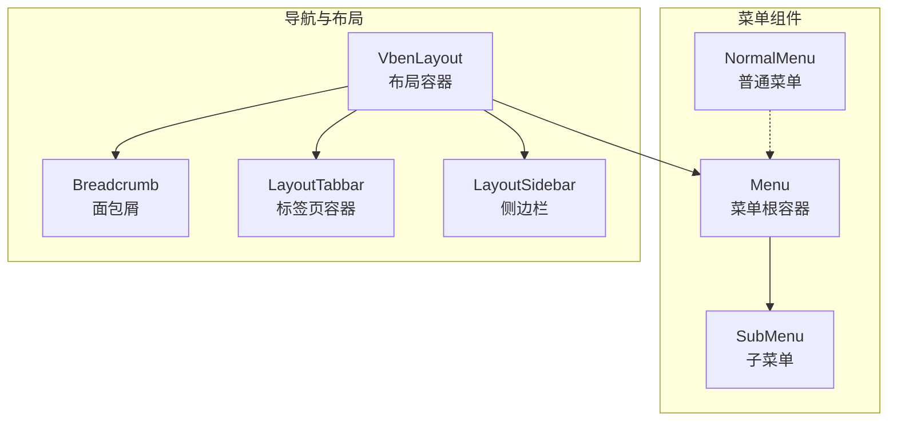
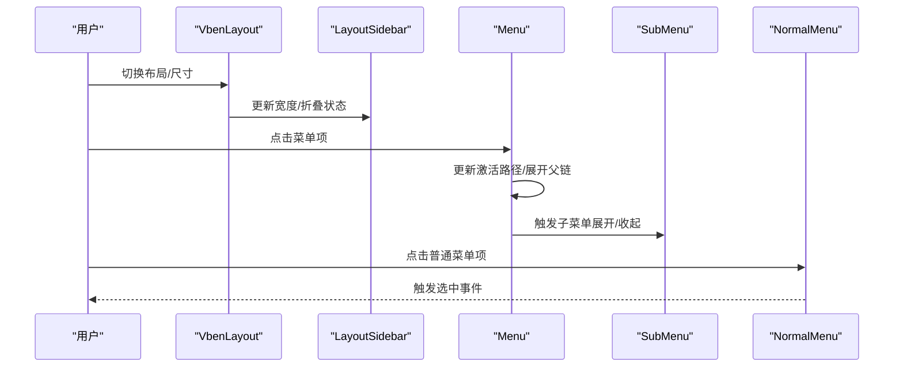
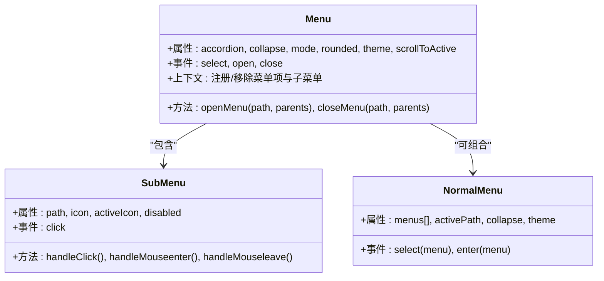
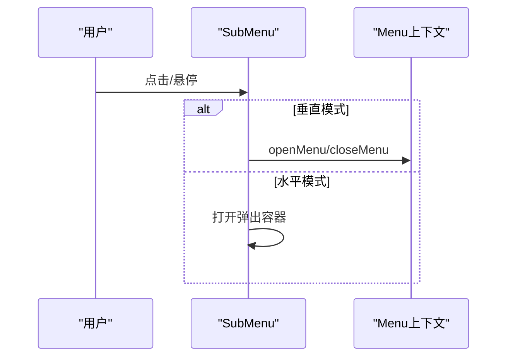
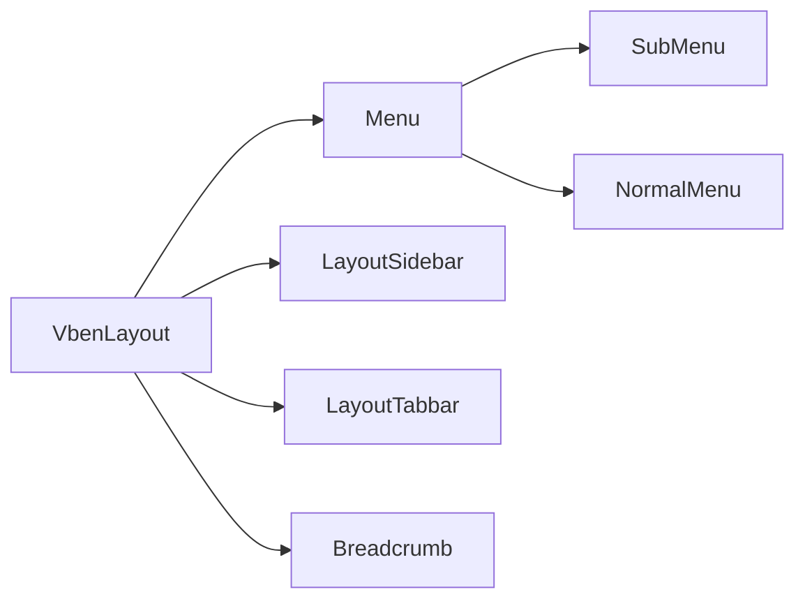

# 导航组件

<cite>
**本文引用的文件**
- [menu.vue](file://packages/@core/ui-kit/menu-ui/src/components/menu.vue)
- [sub-menu.vue](file://packages/@core/ui-kit/menu-ui/src/components/sub-menu.vue)
- [normal-menu.vue](file://packages/@core/ui-kit/menu-ui/src/components/normal-menu/normal-menu.vue)
- [types.ts](file://packages/@core/ui-kit/menu-ui/src/types.ts)
- [breadcrumb.vue](file://packages/@core/ui-kit/shadcn-ui/src/components/breadcrumb/breadcrumb.vue)
- [layout-sidebar.vue](file://packages/@core/ui-kit/layout-ui/src/components/layout-sidebar.vue)
- [layout-tabbar.vue](file://packages/@core/ui-kit/layout-ui/src/components/layout-tabbar.vue)
- [vben-layout.vue](file://packages/@core/ui-kit/layout-ui/src/vben-layout.vue)
- [sidebar.vue（偏好设置）](file://packages/effects/layouts/src/widgets/preferences/blocks/layout/sidebar.vue)
</cite>

## 目录

1. [简介](#简介)
2. [项目结构](#项目结构)
3. [核心组件](#核心组件)
4. [架构总览](#架构总览)
5. [详细组件分析](#详细组件分析)
6. [依赖关系分析](#依赖关系分析)
7. [性能考量](#性能考量)
8. [故障排查指南](#故障排查指南)
9. [结论](#结论)
10. [附录](#附录)

## 简介

本文件面向导航相关组件的使用者与维护者，系统化梳理菜单、面包屑、标签页与侧边栏的API、数据结构、渲染逻辑与交互流程，并覆盖权限控制、国际化、动态加载、样式定制与主题适配、性能优化与懒加载策略等主题。目标是帮助读者快速理解并高效使用这些组件。

## 项目结构

导航相关能力主要分布在以下模块：

- 菜单体系：垂直/水平菜单、子菜单、普通菜单（横向导航）
- 面包屑：带下拉的面包屑导航
- 标签页：页面标签容器
- 侧边栏：可拖拽、折叠、悬浮展开、混合模式等
- 布局容器：统一协调头部、侧边、标签页、内容区与遮罩

**图表来源**

- [menu.vue:1-885](file://packages/@core/ui-kit/menu-ui/src/components/menu.vue#L1-L885)
- [sub-menu.vue:1-277](file://packages/@core/ui-kit/menu-ui/src/components/sub-menu.vue#L1-L277)
- [normal-menu.vue:1-163](file://packages/@core/ui-kit/menu-ui/src/components/normal-menu/normal-menu.vue#L1-L163)
- [breadcrumb.vue:1-99](file://packages/@core/ui-kit/shadcn-ui/src/components/breadcrumb/breadcrumb.vue#L1-L99)
- [layout-tabbar.vue:1-31](file://packages/@core/ui-kit/layout-ui/src/components/layout-tabbar.vue#L1-L31)
- [layout-sidebar.vue:1-382](file://packages/@core/ui-kit/layout-ui/src/components/layout-sidebar.vue#L1-L382)
- [vben-layout.vue:1-635](file://packages/@core/ui-kit/layout-ui/src/vben-layout.vue#L1-L635)

**章节来源**

- [menu.vue:1-885](file://packages/@core/ui-kit/menu-ui/src/components/menu.vue#L1-L885)
- [sub-menu.vue:1-277](file://packages/@core/ui-kit/menu-ui/src/components/sub-menu.vue#L1-L277)
- [normal-menu.vue:1-163](file://packages/@core/ui-kit/menu-ui/src/components/normal-menu/normal-menu.vue#L1-L163)
- [breadcrumb.vue:1-99](file://packages/@core/ui-kit/shadcn-ui/src/components/breadcrumb/breadcrumb.vue#L1-L99)
- [layout-tabbar.vue:1-31](file://packages/@core/ui-kit/layout-ui/src/components/layout-tabbar.vue#L1-L31)
- [layout-sidebar.vue:1-382](file://packages/@core/ui-kit/layout-ui/src/components/layout-sidebar.vue#L1-L382)
- [vben-layout.vue:1-635](file://packages/@core/ui-kit/layout-ui/src/vben-layout.vue#L1-L635)

## 核心组件

- 菜单组件（Menu）：支持垂直/水平模式、手风琴、折叠、圆角、主题、滚动定位、更多菜单切分等
- 子菜单组件（SubMenu）：支持点击/悬停展开、嵌套层级、弹出式容器、激活态联动
- 普通菜单（NormalMenu）：横向图标菜单，适合顶部或侧边的紧凑导航
- 面包屑（Breadcrumb）：支持下拉菜单、图标、点击选择
- 标签页（LayoutTabbar）：页面标签容器，随布局宽度自适应
- 侧边栏（LayoutSidebar）：可拖拽宽度、折叠/展开、悬浮展开、混合模式、固定按钮、折叠标题显示
- 布局容器（VbenLayout）：协调头部、侧边、标签页、内容与遮罩，处理移动端与混合导航场景

**章节来源**

- [menu.vue:1-885](file://packages/@core/ui-kit/menu-ui/src/components/menu.vue#L1-L885)
- [sub-menu.vue:1-277](file://packages/@core/ui-kit/menu-ui/src/components/sub-menu.vue#L1-L277)
- [normal-menu.vue:1-163](file://packages/@core/ui-kit/menu-ui/src/components/normal-menu/normal-menu.vue#L1-L163)
- [breadcrumb.vue:1-99](file://packages/@core/ui-kit/shadcn-ui/src/components/breadcrumb/breadcrumb.vue#L1-L99)
- [layout-tabbar.vue:1-31](file://packages/@core/ui-kit/layout-ui/src/components/layout-tabbar.vue#L1-L31)
- [layout-sidebar.vue:1-382](file://packages/@core/ui-kit/layout-ui/src/components/layout-sidebar.vue#L1-L382)
- [vben-layout.vue:1-635](file://packages/@core/ui-kit/layout-ui/src/vben-layout.vue#L1-L635)

## 架构总览

导航组件围绕“菜单上下文”进行协作，菜单根组件负责注册/管理菜单项与子菜单，子菜单组件通过上下文感知父级状态并控制展开/收起；布局容器协调侧边栏、标签页与内容区，同时提供遮罩与移动端交互；面包屑基于路由信息生成，支持下拉选择。

**图表来源**

- [vben-layout.vue:1-635](file://packages/@core/ui-kit/layout-ui/src/vben-layout.vue#L1-L635)
- [layout-sidebar.vue:1-382](file://packages/@core/ui-kit/layout-ui/src/components/layout-sidebar.vue#L1-L382)
- [menu.vue:1-885](file://packages/@core/ui-kit/menu-ui/src/components/menu.vue#L1-L885)
- [sub-menu.vue:1-277](file://packages/@core/ui-kit/menu-ui/src/components/sub-menu.vue#L1-L277)
- [normal-menu.vue:1-163](file://packages/@core/ui-kit/menu-ui/src/components/normal-menu/normal-menu.vue#L1-L163)

## 详细组件分析

### 菜单组件（Menu）

- 功能要点
  - 支持垂直/水平模式、手风琴、折叠、圆角、主题
  - 自动滚动到激活项（可配置）
  - 水平模式下的“更多”菜单切分与响应式宽度计算
  - 上下文注册：菜单项、子菜单、激活路径、展开集合
  - 事件：select、open、close
- 关键API
  - 属性
    - accordion: 是否手风琴
    - collapse: 是否折叠
    - collapseShowTitle: 折叠时是否显示标题
    - defaultActive: 默认激活路径
    - defaultOpeneds: 默认展开集合
    - mode: horizontal | vertical
    - rounded: 圆角风格
    - scrollToActive: 是否自动滚动到激活项
    - theme: 主题模式
  - 事件
    - select(path, parentPaths)
    - open(path, parentPaths)
    - close(path, parentPaths)
  - 插槽
    - default: 子菜单/菜单项
- 数据结构
  - 菜单项注册对象：包含 path、parentPaths、active 等
  - 子菜单注册对象：同上
  - 激活路径 activePath
  - 展开集合 openedMenus
- 渲染逻辑
  - 垂直模式：常规列表渲染
  - 水平模式：根据可用宽度切分为默认与“更多”，“更多”以子菜单形式渲染
  - 折叠模式：图标居中，可选显示标题
- 权限控制
  - 菜单项/子菜单支持 disabled 字段，禁用后不展开
- 动态加载
  - 通过插槽动态注入菜单项，结合路由/权限系统按需渲染
- 国际化
  - 菜单项标题来自外部数据源，可配合国际化库进行翻译
- 自定义渲染与扩展
  - 通过插槽自定义菜单项内容
  - 使用主题变量与CSS变量定制样式
- 与路由系统集成
  - 通过 select 事件与路由守卫/跳转逻辑对接
- 性能优化
  - 水平模式仅在 resize 时计算切分，使用防抖
  - 折叠模式减少文本渲染
  - 圆角/主题变量减少重排

**图表来源**

- [menu.vue:1-885](file://packages/@core/ui-kit/menu-ui/src/components/menu.vue#L1-L885)
- [sub-menu.vue:1-277](file://packages/@core/ui-kit/menu-ui/src/components/sub-menu.vue#L1-L277)
- [normal-menu.vue:1-163](file://packages/@core/ui-kit/menu-ui/src/components/normal-menu/normal-menu.vue#L1-L163)
- [types.ts:1-155](file://packages/@core/ui-kit/menu-ui/src/types.ts#L1-L155)

**章节来源**

- [menu.vue:1-885](file://packages/@core/ui-kit/menu-ui/src/components/menu.vue#L1-L885)
- [types.ts:1-155](file://packages/@core/ui-kit/menu-ui/src/types.ts#L1-L155)

### 子菜单组件（SubMenu）

- 功能要点
  - 支持点击/悬停展开（垂直模式悬停，水平模式点击）
  - 嵌套层级计算与激活态联动
  - 弹出式容器（水平模式）与过渡动画
- 关键API
  - 属性
    - path: 必填
    - icon/activeIcon: 图标
    - disabled: 禁用
  - 事件
    - click
  - 插槽
    - title/content
- 渲染逻辑
  - 垂直模式：点击触发展开/收起，支持过渡动画
  - 水平模式：使用弹出卡片容器，鼠标移入/移出控制打开/关闭
- 权限控制
  - disabled 控制不可交互
- 动态加载
  - 通过插槽动态注入子项
- 自定义渲染
  - 通过插槽自定义标题与内容
- 与菜单上下文
  - 通过上下文注册/移除自身，联动激活态

**图表来源**

- [sub-menu.vue:1-277](file://packages/@core/ui-kit/menu-ui/src/components/sub-menu.vue#L1-L277)
- [menu.vue:1-885](file://packages/@core/ui-kit/menu-ui/src/components/menu.vue#L1-L885)

**章节来源**

- [sub-menu.vue:1-277](file://packages/@core/ui-kit/menu-ui/src/components/sub-menu.vue#L1-L277)

### 普通菜单（NormalMenu）

- 功能要点
  - 横向图标菜单，适合顶部或紧凑侧边
  - 支持激活态与悬停态样式
  - 折叠时隐藏文字，仅显示图标
- 关键API
  - 属性
    - menus: 菜单数组
    - activePath: 当前激活路径
    - collapse: 折叠
    - theme: 主题
  - 事件
    - select(menu)
    - enter(menu)
- 渲染逻辑
  - 遍历菜单数组，渲染图标与标题
  - 激活态高亮，悬停缩放图标
- 自定义渲染
  - 通过插槽扩展图标/标题

**章节来源**

- [normal-menu.vue:1-163](file://packages/@core/ui-kit/menu-ui/src/components/normal-menu/normal-menu.vue#L1-L163)

### 面包屑组件（Breadcrumb）

- 功能要点
  - 支持下拉菜单（多级项）
  - 可选图标显示
  - 点击选择事件
- 关键API
  - 属性
    - showIcon: 是否显示图标
  - 事件
    - select(path)
- 渲染逻辑
  - 遍历 breadcrumbs，区分链接/当前页/下拉
  - 下拉菜单项逐条渲染
- 自定义渲染
  - 通过插槽扩展图标与标题

**章节来源**

- [breadcrumb.vue:1-99](file://packages/@core/ui-kit/shadcn-ui/src/components/breadcrumb/breadcrumb.vue#L1-L99)

### 标签页组件（LayoutTabbar）

- 功能要点
  - 页面标签容器，随布局宽度变化
  - 高度可配置
- 关键API
  - 属性
    - height: 高度
- 渲染逻辑
  - 固定高度与边框，插槽承载标签项

**章节来源**

- [layout-tabbar.vue:1-31](file://packages/@core/ui-kit/layout-ui/src/components/layout-tabbar.vue#L1-L31)

### 侧边栏组件（LayoutSidebar）

- 功能要点
  - 可拖拽宽度、折叠/展开、悬浮展开
  - 混合模式（侧边+扩展区）、固定按钮、折叠标题显示
  - 鼠标进入/离开控制展开/折叠
- 关键API
  - 属性
    - collapseWidth/collapseHeight: 折叠尺寸
    - width/extraWidth: 宽度
    - showCollapseButton/showFixedButton: 按钮可见性
    - theme/themeSub: 主题
    - isSidebarMixed/mixedWidth: 混合模式
    - marginTop/paddingTop: 位置与内边距
    - zIndex/domVisible: 层级与可见性
  - 模型
    - draggable/collapse/extraCollapse/expandOnHover/expandOnHovering/extraVisible
  - 事件
    - update:width(value)
    - leave
- 渲染逻辑
  - 根据模式与折叠状态计算宽度与偏移
  - 悬浮展开时临时扩大宽度
  - 混合模式下额外渲染扩展区
- 自定义渲染
  - 通过插槽注入 logo、菜单、扩展区与标题

**章节来源**

- [layout-sidebar.vue:1-382](file://packages/@core/ui-kit/layout-ui/src/components/layout-sidebar.vue#L1-L382)

### 布局容器（VbenLayout）

- 功能要点
  - 统一协调头部、侧边、标签页、内容与遮罩
  - 移动端适配、混合导航模式、自动隐藏头部
- 关键API
  - 属性
    - layout/header*/sidebar*/tabbar*/footer* 等
  - 模型
    - sidebarEnable/sidebarCollapse/sidebarDraggable 等
  - 事件
    - toggleSidebar/update:sidebar-width/sideMouseLeave
- 渲染逻辑
  - 根据布局类型与折叠状态动态计算宽度与偏移
  - 自动隐藏头部（auto/auto-scroll）
  - 遮罩用于移动端点击关闭侧边

**章节来源**

- [vben-layout.vue:1-635](file://packages/@core/ui-kit/layout-ui/src/vben-layout.vue#L1-L635)

## 依赖关系分析

- 组件耦合
  - Menu 为核心上下文，SubMenu/NormalMenu 通过上下文协作
  - LayoutSidebar/VbenLayout 作为容器协调菜单与标签页
  - Breadcrumb 与路由/权限解耦，通过事件与数据驱动
- 外部依赖
  - VueUse 提供 ResizeObserver、滚动、节流等
  - Shadcn UI 提供 HoverCard、Scrollbar 等基础组件
- 循环依赖
  - 无直接循环依赖，上下文通过函数注入避免循环

**图表来源**

- [menu.vue:1-885](file://packages/@core/ui-kit/menu-ui/src/components/menu.vue#L1-L885)
- [sub-menu.vue:1-277](file://packages/@core/ui-kit/menu-ui/src/components/sub-menu.vue#L1-L277)
- [normal-menu.vue:1-163](file://packages/@core/ui-kit/menu-ui/src/components/normal-menu/normal-menu.vue#L1-L163)
- [layout-sidebar.vue:1-382](file://packages/@core/ui-kit/layout-ui/src/components/layout-sidebar.vue#L1-L382)
- [layout-tabbar.vue:1-31](file://packages/@core/ui-kit/layout-ui/src/components/layout-tabbar.vue#L1-L31)
- [vben-layout.vue:1-635](file://packages/@core/ui-kit/layout-ui/src/vben-layout.vue#L1-L635)

**章节来源**

- [menu.vue:1-885](file://packages/@core/ui-kit/menu-ui/src/components/menu.vue#L1-L885)
- [sub-menu.vue:1-277](file://packages/@core/ui-kit/menu-ui/src/components/sub-menu.vue#L1-L277)
- [normal-menu.vue:1-163](file://packages/@core/ui-kit/menu-ui/src/components/normal-menu/normal-menu.vue#L1-L163)
- [layout-sidebar.vue:1-382](file://packages/@core/ui-kit/layout-ui/src/components/layout-sidebar.vue#L1-L382)
- [layout-tabbar.vue:1-31](file://packages/@core/ui-kit/layout-ui/src/components/layout-tabbar.vue#L1-L31)
- [vben-layout.vue:1-635](file://packages/@core/ui-kit/layout-ui/src/vben-layout.vue#L1-L635)

## 性能考量

- 菜单
  - 水平模式“更多”菜单采用防抖与 nextTick 降低重排频率
  - 折叠模式减少文本渲染，提升移动端体验
- 侧边栏
  - 拖拽限制最小/最大宽度，避免过度计算
  - 悬浮展开时临时禁用过渡，提升交互流畅度
- 布局
  - 自动隐藏头部使用节流监听滚动方向，避免频繁 DOM 操作
  - 宽度计算结果缓存于 computed，减少重复计算

[本节为通用性能建议，无需特定文件引用]

## 故障排查指南

- 菜单无法展开/收起
  - 检查 mode 与 collapse 状态是否符合预期
  - 确认 disabled 未被错误设置
- 水平菜单“更多”不出现
  - 确认容器宽度与菜单项宽度之和超过可用宽度
  - 检查 ResizeObserver 是否正常工作
- 侧边栏拖拽无效
  - 确认 draggable 模型已启用
  - 检查最小/最大宽度限制是否合理
- 标签页宽度异常
  - 检查布局模式与侧边栏折叠状态
  - 确认 isMixedNav 与 sidebarEnable 状态
- 面包屑点击无响应
  - 确认 select 事件绑定与路径有效性

**章节来源**

- [menu.vue:1-885](file://packages/@core/ui-kit/menu-ui/src/components/menu.vue#L1-L885)
- [sub-menu.vue:1-277](file://packages/@core/ui-kit/menu-ui/src/components/sub-menu.vue#L1-L277)
- [layout-sidebar.vue:1-382](file://packages/@core/ui-kit/layout-ui/src/components/layout-sidebar.vue#L1-L382)
- [vben-layout.vue:1-635](file://packages/@core/ui-kit/layout-ui/src/vben-layout.vue#L1-L635)
- [breadcrumb.vue:1-99](file://packages/@core/ui-kit/shadcn-ui/src/components/breadcrumb/breadcrumb.vue#L1-L99)

## 结论

导航组件以“菜单上下文”为核心，围绕菜单、面包屑、标签页与侧边栏构建了完整的导航体系。通过灵活的属性与事件、完善的权限与国际化支持、以及良好的性能与可扩展性，能够满足从简单到复杂的多种导航场景需求。建议在实际项目中结合路由系统与权限体系，按需启用动态加载与懒加载策略，进一步提升用户体验与性能表现。

[本节为总结性内容，无需特定文件引用]

## 附录

### 国际化与多语言切换

- 菜单项标题与面包屑标题来源于外部数据源，可通过国际化库进行翻译
- 偏好设置中的侧边栏文案由本地化资源提供

**章节来源**

- [sidebar.vue（偏好设置）:1-105](file://packages/effects/layouts/src/widgets/preferences/blocks/layout/sidebar.vue#L1-L105)

### 权限控制与动态加载

- 菜单项/子菜单支持 disabled 字段，禁用后不展开
- 通过插槽动态注入菜单项，结合路由/权限系统按需渲染
- 布局容器根据 isSidebarMixedNav/isHeaderMixedNav 等状态切换菜单源

**章节来源**

- [menu.vue:1-885](file://packages/@core/ui-kit/menu-ui/src/components/menu.vue#L1-L885)
- [sub-menu.vue:1-277](file://packages/@core/ui-kit/menu-ui/src/components/sub-menu.vue#L1-L277)
- [vben-layout.vue:1-635](file://packages/@core/ui-kit/layout-ui/src/vben-layout.vue#L1-L635)

### 样式定制与主题适配

- 菜单组件通过 CSS 变量与主题类名实现主题适配
- 支持 dark/light 与 rounded 圆角风格
- 侧边栏与标签页容器提供主题与尺寸配置

**章节来源**

- [menu.vue:1-885](file://packages/@core/ui-kit/menu-ui/src/components/menu.vue#L1-L885)
- [layout-sidebar.vue:1-382](file://packages/@core/ui-kit/layout-ui/src/components/layout-sidebar.vue#L1-L382)
- [layout-tabbar.vue:1-31](file://packages/@core/ui-kit/layout-ui/src/components/layout-tabbar.vue#L1-L31)

### 与路由系统的集成

- 通过 Menu 的 select 事件与路由守卫/跳转逻辑对接
- 布局容器提供移动端切换与遮罩交互

**章节来源**

- [menu.vue:1-885](file://packages/@core/ui-kit/menu-ui/src/components/menu.vue#L1-L885)
- [vben-layout.vue:1-635](file://packages/@core/ui-kit/layout-ui/src/vben-layout.vue#L1-L635)
