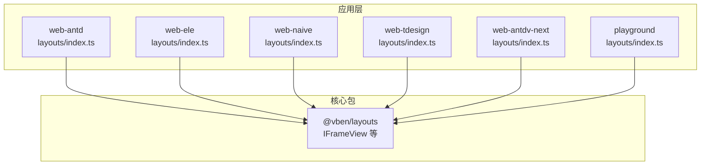
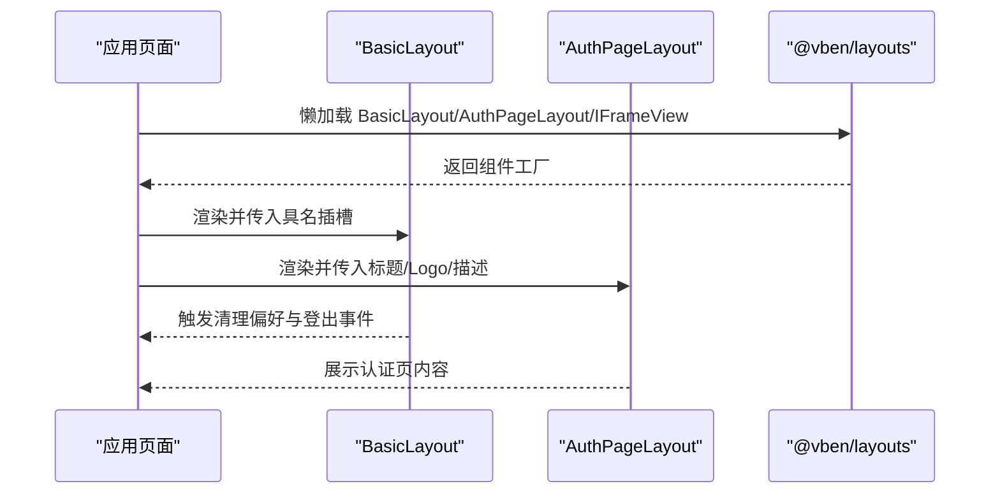
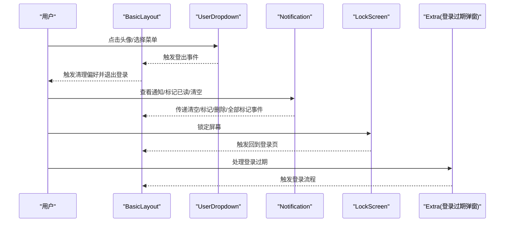
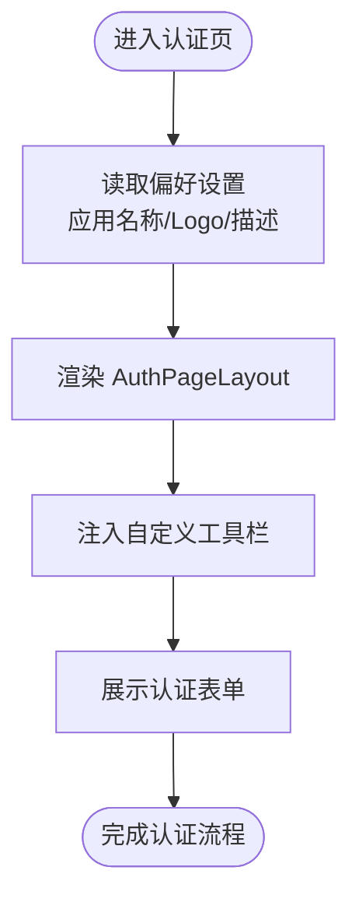
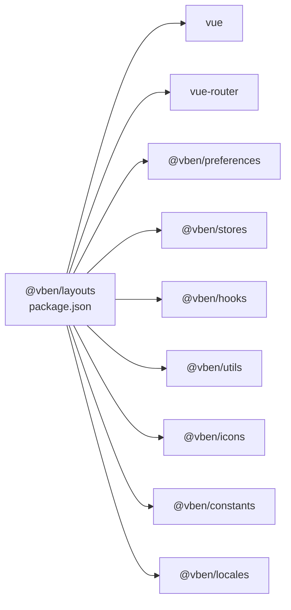

# 布局组件

<cite>
**本文引用的文件**
- [apps/web-antd/src/layouts/basic.vue](file://apps/web-antd/src/layouts/basic.vue)
- [apps/web-antd/src/layouts/auth.vue](file://apps/web-antd/src/layouts/auth.vue)
- [apps/web-antd/src/layouts/index.ts](file://apps/web-antd/src/layouts/index.ts)
- [apps/web-antdv-next/src/layouts/basic.vue](file://apps/web-antdv-next/src/layouts/basic.vue)
- [apps/web-antdv-next/src/layouts/auth.vue](file://apps/web-antdv-next/src/layouts/auth.vue)
- [apps/web-antdv-next/src/layouts/index.ts](file://apps/web-antdv-next/src/layouts/index.ts)
- [apps/web-ele/src/layouts/basic.vue](file://apps/web-ele/src/layouts/basic.vue)
- [apps/web-ele/src/layouts/auth.vue](file://apps/web-ele/src/layouts/auth.vue)
- [apps/web-ele/src/layouts/index.ts](file://apps/web-ele/src/layouts/index.ts)
- [apps/web-naive/src/layouts/basic.vue](file://apps/web-naive/src/layouts/basic.vue)
- [apps/web-naive/src/layouts/auth.vue](file://apps/web-naive/src/layouts/auth.vue)
- [apps/web-naive/src/layouts/index.ts](file://apps/web-naive/src/layouts/index.ts)
- [apps/web-tdesign/src/layouts/basic.vue](file://apps/web-tdesign/src/layouts/basic.vue)
- [apps/web-tdesign/src/layouts/auth.vue](file://apps/web-tdesign/src/layouts/auth.vue)
- [apps/web-tdesign/src/layouts/index.ts](file://apps/web-tdesign/src/layouts/index.ts)
- [playground/src/layouts/basic.vue](file://playground/src/layouts/basic.vue)
- [playground/src/layouts/auth.vue](file://playground/src/layouts/auth.vue)
- [playground/src/layouts/index.ts](file://playground/src/layouts/index.ts)
- [packages/effects/layouts/package.json](file://packages/effects/layouts/package.json)
</cite>

## 目录
1. [简介](#简介)
2. [项目结构](#项目结构)
3. [核心组件](#核心组件)
4. [架构总览](#架构总览)
5. [详细组件分析](#详细组件分析)
6. [依赖分析](#依赖分析)
7. [性能考虑](#性能考虑)
8. [故障排查指南](#故障排查指南)
9. [结论](#结论)
10. [附录](#附录)

## 简介
本文件为布局组件的全面API文档，覆盖以下方面：
- Layout组件的属性配置、插槽结构与布局模式
- BasicLayout、AuthLayout等不同布局组件的使用方法与配置项
- 侧边栏、头部、内容区域、底部等区域的组件API
- 响应式设计、折叠展开、主题切换能力
- 布局组件的嵌套使用与自定义布局方案
- 布局与路由系统的集成与权限控制
- 样式定制与移动端适配
- 性能特性与优化建议

## 项目结构
各UI框架（Antd、Element Plus、Naive、TDesign、Antdv Next）在各自应用中均提供统一的布局入口导出，通过懒加载方式引入@vben/layouts中的核心布局组件，并在页面模板中以具名插槽注入用户下拉菜单、通知面板、锁屏与登录过期弹窗等扩展内容。

图表来源
- [apps/web-antd/src/layouts/index.ts:1-6](file://apps/web-antd/src/layouts/index.ts#L1-L6)
- [apps/web-ele/src/layouts/index.ts:1-6](file://apps/web-ele/src/layouts/index.ts#L1-L6)
- [apps/web-naive/src/layouts/index.ts:1-6](file://apps/web-naive/src/layouts/index.ts#L1-L6)
- [apps/web-tdesign/src/layouts/index.ts:1-6](file://apps/web-tdesign/src/layouts/index.ts#L1-L6)
- [apps/web-antdv-next/src/layouts/index.ts:1-6](file://apps/web-antdv-next/src/layouts/index.ts#L1-L6)
- [playground/src/layouts/index.ts:1-6](file://playground/src/layouts/index.ts#L1-L6)

章节来源
- [apps/web-antd/src/layouts/index.ts:1-6](file://apps/web-antd/src/layouts/index.ts#L1-L6)
- [apps/web-ele/src/layouts/index.ts:1-6](file://apps/web-ele/src/layouts/index.ts#L1-L6)
- [apps/web-naive/src/layouts/index.ts:1-6](file://apps/web-naive/src/layouts/index.ts#L1-L6)
- [apps/web-tdesign/src/layouts/index.ts:1-6](file://apps/web-tdesign/src/layouts/index.ts#L1-L6)
- [apps/web-antdv-next/src/layouts/index.ts:1-6](file://apps/web-antdv-next/src/layouts/index.ts#L1-L6)
- [playground/src/layouts/index.ts:1-6](file://playground/src/layouts/index.ts#L1-L6)

## 核心组件
- BasicLayout：通用业务布局容器，负责头部、侧边栏、内容区、底部的整体排布与交互，支持通过具名插槽注入用户下拉菜单、通知面板、锁屏与登录过期弹窗等。
- AuthPageLayout：认证页专用布局，用于登录、注册等页面，支持设置应用名称、Logo（明/暗）、页面标题与描述等。
- IFrameView：内嵌iframe视图组件，用于在布局内渲染第三方或外部页面。

章节来源
- [apps/web-antd/src/layouts/basic.vue:172-206](file://apps/web-antd/src/layouts/basic.vue#L172-L206)
- [apps/web-antd/src/layouts/auth.vue:14-25](file://apps/web-antd/src/layouts/auth.vue#L14-L25)
- [apps/web-antd/src/layouts/index.ts:1-6](file://apps/web-antd/src/layouts/index.ts#L1-L6)

## 架构总览
BasicLayout与AuthPageLayout作为应用层布局入口，通过懒加载方式从@vben/layouts包中按需导入。应用侧通过具名插槽向布局注入业务组件，形成“布局容器 + 插槽扩展”的组合模式。

图表来源
- [apps/web-antd/src/layouts/index.ts:1-6](file://apps/web-antd/src/layouts/index.ts#L1-L6)
- [apps/web-antd/src/layouts/basic.vue:172-206](file://apps/web-antd/src/layouts/basic.vue#L172-L206)
- [apps/web-antd/src/layouts/auth.vue:14-25](file://apps/web-antd/src/layouts/auth.vue#L14-L25)

## 详细组件分析

### BasicLayout 组件
- 功能定位：承载头部、侧边栏、内容区、底部的整体布局，提供用户下拉菜单、通知面板、锁屏、登录过期弹窗等扩展插槽。
- 关键插槽
  - user-dropdown：用户下拉菜单，接收头像、昵称、描述、菜单列表等属性，触发登出事件。
  - notification：通知面板，接收通知列表、是否显示红点、清空、标记已读、删除、全部标记已读等事件。
  - lock-screen：锁屏组件，接收头像等属性，触发回到登录页事件。
  - extra：额外扩展区域，如登录过期弹窗与登录表单。
- 事件
  - clear-preferences-and-logout：清理偏好并退出登录。
- 典型用法
  - 在应用入口或路由守卫中根据权限决定是否渲染BasicLayout。
  - 通过插槽注入用户信息、通知数据与交互行为。
- 注意事项
  - 登录过期弹窗与登录表单需配合鉴权状态管理使用。
  - 通知面板的数据结构需满足通知项接口约定。

图表来源
- [apps/web-antd/src/layouts/basic.vue:172-206](file://apps/web-antd/src/layouts/basic.vue#L172-L206)

章节来源
- [apps/web-antd/src/layouts/basic.vue:172-206](file://apps/web-antd/src/layouts/basic.vue#L172-L206)
- [apps/web-antdv-next/src/layouts/basic.vue:1-207](file://apps/web-antdv-next/src/layouts/basic.vue#L1-L207)
- [apps/web-ele/src/layouts/basic.vue:1-207](file://apps/web-ele/src/layouts/basic.vue#L1-L207)
- [apps/web-naive/src/layouts/basic.vue:1-207](file://apps/web-naive/src/layouts/basic.vue#L1-L207)
- [apps/web-tdesign/src/layouts/basic.vue:1-207](file://apps/web-tdesign/src/layouts/basic.vue#L1-L207)
- [playground/src/layouts/basic.vue:1-207](file://playground/src/layouts/basic.vue#L1-L207)

### AuthPageLayout 组件
- 功能定位：认证页专用布局，适用于登录、注册、忘记密码等页面。
- 关键属性
  - app-name：应用名称
  - logo：Logo地址（明/暗主题可分别配置）
  - page-title：页面标题
  - page-description：页面描述
- 插槽
  - toolbar：自定义工具栏（例如语言切换、主题切换等）
- 使用建议
  - 将认证页路由直接渲染该布局，避免引入复杂侧边栏与菜单。
  - 通过偏好设置读取Logo与应用名，保持品牌一致性。

图表来源
- [apps/web-antd/src/layouts/auth.vue:14-25](file://apps/web-antd/src/layouts/auth.vue#L14-L25)

章节来源
- [apps/web-antd/src/layouts/auth.vue:14-25](file://apps/web-antd/src/layouts/auth.vue#L14-L25)
- [apps/web-antdv-next/src/layouts/auth.vue:1-26](file://apps/web-antdv-next/src/layouts/auth.vue#L1-L26)
- [apps/web-ele/src/layouts/auth.vue:1-26](file://apps/web-ele/src/layouts/auth.vue#L1-L26)
- [apps/web-naive/src/layouts/auth.vue:1-26](file://apps/web-naive/src/layouts/auth.vue#L1-L26)
- [apps/web-tdesign/src/layouts/auth.vue:1-26](file://apps/web-tdesign/src/layouts/auth.vue#L1-L26)
- [playground/src/layouts/auth.vue:1-26](file://playground/src/layouts/auth.vue#L1-L26)

### IFrameView 组件
- 功能定位：在布局内渲染iframe视图，常用于嵌入第三方系统或外部页面。
- 使用场景
  - 集成OA、财务、HR等外部系统
  - 快速接入文档站、帮助中心等静态页面
- 注意事项
  - 安全策略与跨域限制
  - 加载状态与错误处理
  - 移动端适配与滚动优化

章节来源
- [apps/web-antd/src/layouts/index.ts:4](file://apps/web-antd/src/layouts/index.ts#L4)
- [apps/web-antdv-next/src/layouts/index.ts:4](file://apps/web-antdv-next/src/layouts/index.ts#L4)
- [apps/web-ele/src/layouts/index.ts:4](file://apps/web-ele/src/layouts/index.ts#L4)
- [apps/web-naive/src/layouts/index.ts:4](file://apps/web-naive/src/layouts/index.ts#L4)
- [apps/web-tdesign/src/layouts/index.ts:4](file://apps/web-tdesign/src/layouts/index.ts#L4)
- [playground/src/layouts/index.ts:4](file://playground/src/layouts/index.ts#L4)

## 依赖分析
- @vben/layouts 包导出布局组件与相关类型，被各UI框架的应用层通过懒加载方式按需引入。
- 应用层通过具名插槽与事件通信，实现布局与业务逻辑解耦。
- 核心依赖包括Vue、Vue Router、@vben/preferences、@vben/stores、@vben/hooks等。

图表来源
- [packages/effects/layouts/package.json:16-43](file://packages/effects/layouts/package.json#L16-L43)

章节来源
- [packages/effects/layouts/package.json:16-43](file://packages/effects/layouts/package.json#L16-L43)

## 性能考虑
- 按需加载：通过懒加载导入布局组件，减少首屏体积与初次渲染时间。
- 插槽最小化：仅在需要时注入扩展插槽，避免不必要的DOM节点与事件绑定。
- 数据驱动：通知面板与用户信息通过响应式数据更新，避免频繁重渲染。
- 主题与水印：根据偏好设置动态启用/销毁水印，降低不必要计算。
- 路由守卫：在进入受保护页面前进行权限校验，避免无效渲染。

## 故障排查指南
- 登录过期弹窗无法关闭
  - 检查鉴权状态管理中登录过期标志位的更新与销毁。
  - 确认弹窗组件的v-model:open绑定与事件触发。
- 通知面板无数据
  - 校验通知数组的初始化与响应式更新。
  - 确认插槽属性与事件绑定正确。
- Logo或应用名不显示
  - 检查偏好设置中Logo与应用名的配置。
  - 确认明/暗主题下的Logo路径。
- 水印未生效
  - 确认偏好设置中水印开关与内容配置。
  - 检查水印钩子的初始化与销毁调用时机。

章节来源
- [apps/web-antd/src/layouts/basic.vue:150-169](file://apps/web-antd/src/layouts/basic.vue#L150-L169)
- [apps/web-antd/src/layouts/auth.vue:9-11](file://apps/web-antd/src/layouts/auth.vue#L9-L11)

## 结论
本布局体系通过统一的@vben/layouts包提供可复用的布局容器与认证页布局，结合应用层的具名插槽与事件机制，实现了高内聚、低耦合的布局扩展方案。配合路由守卫与权限状态管理，能够高效支撑多页面、多主题、多终端的复杂业务场景。

## 附录

### 布局与路由集成
- 在路由配置中为需要权限保护的页面指定BasicLayout作为父级布局。
- 认证页路由直接使用AuthPageLayout，避免加载侧边栏与菜单。
- 登录过期或权限不足时，通过路由守卫重定向至认证页或提示页面。

### 权限控制
- 在进入受保护页面前，检查登录状态与角色权限。
- 若权限不足，重定向至无权限页面或认证页。
- 结合鉴权状态管理，控制布局插槽的可见性与交互行为。

### 响应式设计与移动端适配
- 使用CSS媒体查询与flex/grid布局，确保在小屏设备上的可用性。
- 侧边栏在窄屏下可折叠，提供移动端友好的导航体验。
- 图标与文字大小按屏幕密度调整，保证清晰度。

### 主题切换
- 通过偏好设置切换明/暗主题，影响Logo、图标与组件配色。
- 建议在布局容器上统一应用主题类名，便于全局样式覆盖。

### 自定义布局与嵌套
- 可在应用层创建自定义布局组件，复用@vben/layouts的容器能力。
- 支持嵌套布局：外层布局负责整体骨架，内层布局聚焦特定模块。
- 通过插槽扩展实现模块化功能块的组合与替换。