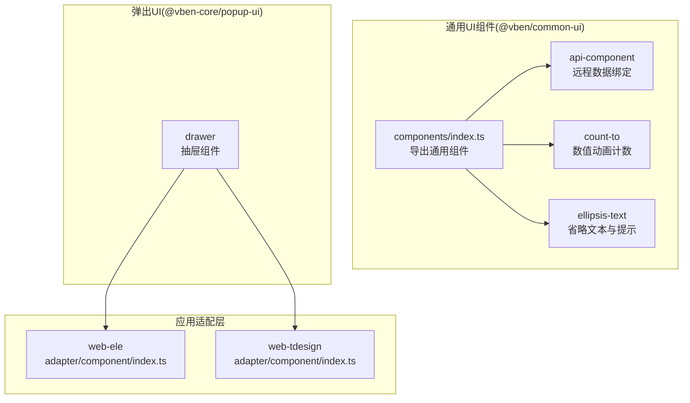
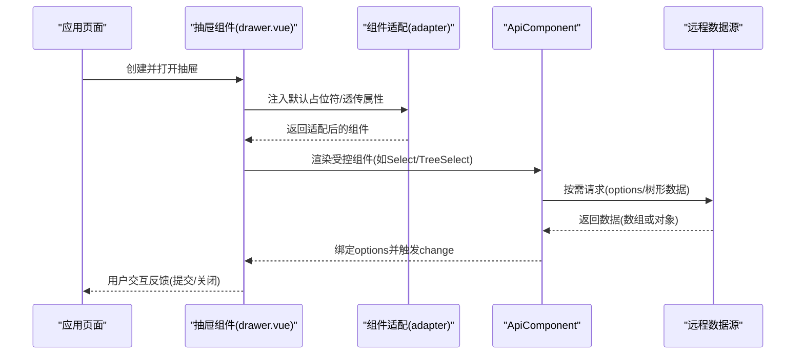
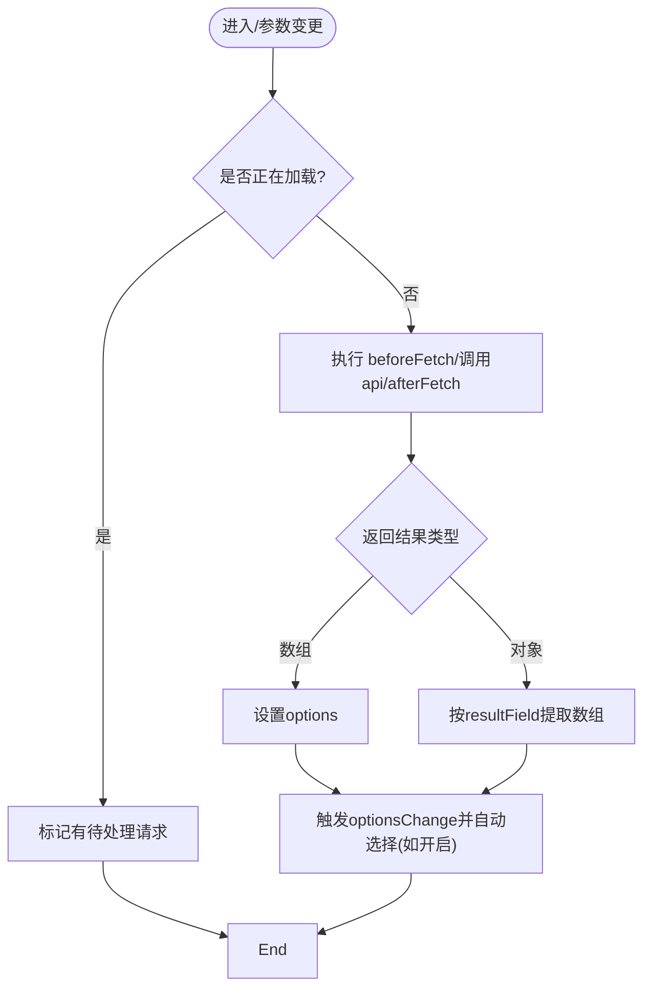
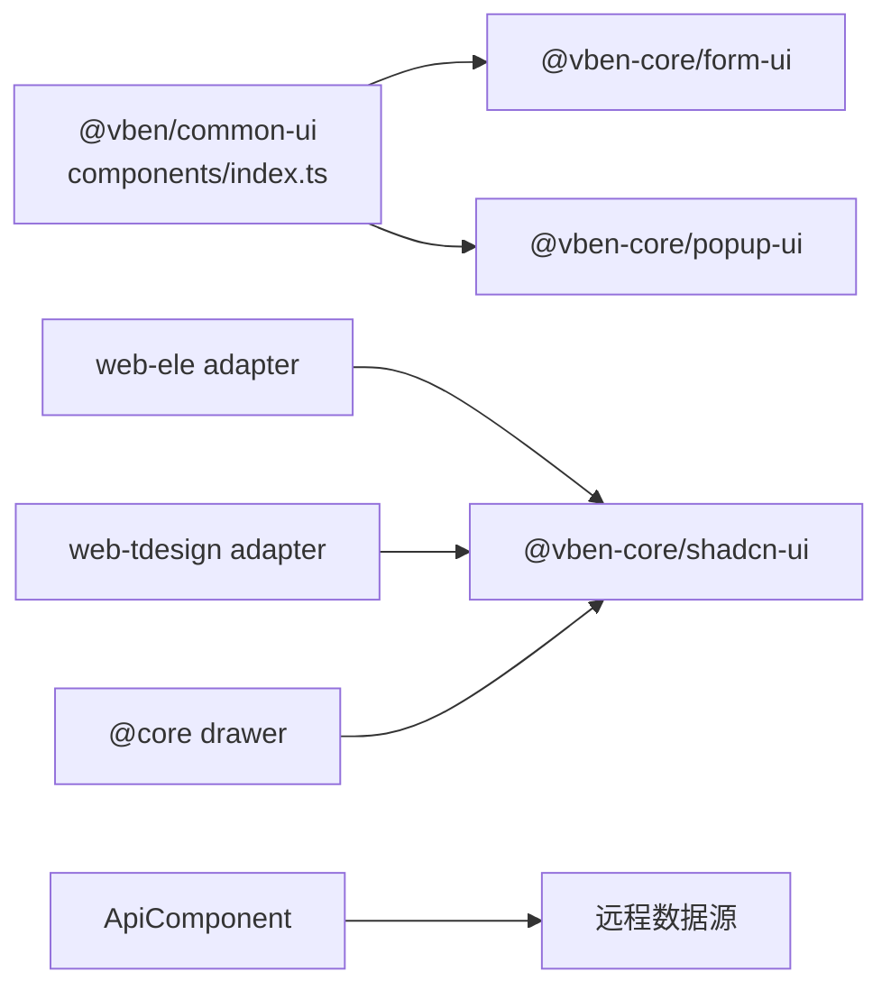

# 组件API

<cite>
**本文引用的文件**
- [packages/effects/common-ui/src/components/index.ts](file://packages/effects/common-ui/src/components/index.ts)
- [packages/effects/common-ui/src/components/api-component/api-component.vue](file://packages/effects/common-ui/src/components/api-component/api-component.vue)
- [packages/effects/common-ui/src/components/count-to/count-to.vue](file://packages/effects/common-ui/src/components/count-to/count-to.vue)
- [packages/effects/common-ui/src/components/ellipsis-text/ellipsis-text.vue](file://packages/effects/common-ui/src/components/ellipsis-text/ellipsis-text.vue)
- [packages/@core/ui-kit/popup-ui/src/drawer/drawer.vue](file://packages/@core/ui-kit/popup-ui/src/drawer/drawer.vue)
- [apps/web-antd/src/views/system/user/list.vue](file://apps/web-antd/src/views/system/user/list.vue)
- [apps/web-antd/src/views/dev/bug/list.vue](file://apps/web-antd/src/views/dev/bug/list.vue)
- [apps/web-ele/src/adapter/component/index.ts](file://apps/web-ele/src/adapter/component/index.ts)
- [apps/web-tdesign/src/adapter/component/index.ts](file://apps/web-tdesign/src/adapter/component/index.ts)
- [docs/src/en/components/common-ui/vben-api-component.md](file://docs/src/en/components/common-ui/vben-api-component.md)
</cite>

## 目录
1. [简介](#简介)
2. [项目结构](#项目结构)
3. [核心组件](#核心组件)
4. [架构总览](#架构总览)
5. [组件详细分析](#组件详细分析)
6. [依赖关系分析](#依赖关系分析)
7. [性能考量](#性能考量)
8. [故障排查指南](#故障排查指南)
9. [结论](#结论)
10. [附录](#附录)

## 简介
本文件为 Vben Admin 可复用 UI 组件的全面 API 文档，覆盖属性、事件、插槽、方法、TypeScript 接口、默认值、可选配置、使用示例与最佳实践、样式定制与主题支持、响应式行为与无障碍特性、组件间组合与集成模式、性能特性与优化建议、生命周期钩子与事件处理等。目标是帮助开发者快速理解并正确使用各组件，同时提供面向生产的集成与优化指导。

## 项目结构
- 通用 UI 组件集中于 effects/common-ui 包，导出入口统一在 components/index.ts。
- 弹出类组件（如抽屉）位于 @core/ui-kit/popup-ui，提供跨 UI 框架的统一能力。
- 各前端应用（web-antd、web-ele、web-tdesign 等）通过 adapter 层对底层组件库进行适配与占位符注入。
- 文档侧提供了部分组件的英文 API 表格与用法说明，便于对照参考。

图表来源
- [packages/effects/common-ui/src/components/index.ts:1-37](file://packages/effects/common-ui/src/components/index.ts#L1-L37)
- [packages/@core/ui-kit/popup-ui/src/drawer/drawer.vue:1-62](file://packages/@core/ui-kit/popup-ui/src/drawer/drawer.vue#L1-L62)
- [apps/web-ele/src/adapter/component/index.ts:121-173](file://apps/web-ele/src/adapter/component/index.ts#L121-L173)
- [apps/web-tdesign/src/adapter/component/index.ts:66-127](file://apps/web-tdesign/src/adapter/component/index.ts#L66-L127)

章节来源
- [packages/effects/common-ui/src/components/index.ts:1-37](file://packages/effects/common-ui/src/components/index.ts#L1-L37)

## 核心组件
- ApiComponent：将任意受控组件与远程数据源对接，自动拉取、转换、绑定选项，并支持懒加载、自动选择、参数合并与生命周期钩子。
- CountTo：数值过渡动画组件，支持起止值、小数位、分隔符、延迟与缓动曲线。
- EllipsisText：多行/单行文本省略与提示，支持点击展开、仅在截断时显示提示、提示样式定制。
- Drawer：跨 UI 框架的抽屉容器，支持销毁策略、提交态、移动端适配、无障碍标签等。

章节来源
- [packages/effects/common-ui/src/components/api-component/api-component.vue:1-300](file://packages/effects/common-ui/src/components/api-component/api-component.vue#L1-L300)
- [packages/effects/common-ui/src/components/count-to/count-to.vue:1-124](file://packages/effects/common-ui/src/components/count-to/count-to.vue#L1-L124)
- [packages/effects/common-ui/src/components/ellipsis-text/ellipsis-text.vue:1-233](file://packages/effects/common-ui/src/components/ellipsis-text/ellipsis-text.vue#L1-L233)
- [packages/@core/ui-kit/popup-ui/src/drawer/drawer.vue:1-62](file://packages/@core/ui-kit/popup-ui/src/drawer/drawer.vue#L1-L62)

## 架构总览
下图展示了通用组件与弹出组件的协作关系，以及应用层适配的作用。

图表来源
- [packages/@core/ui-kit/popup-ui/src/drawer/drawer.vue:1-62](file://packages/@core/ui-kit/popup-ui/src/drawer/drawer.vue#L1-L62)
- [apps/web-ele/src/adapter/component/index.ts:121-173](file://apps/web-ele/src/adapter/component/index.ts#L121-L173)
- [packages/effects/common-ui/src/components/api-component/api-component.vue:161-209](file://packages/effects/common-ui/src/components/api-component/api-component.vue#L161-L209)

## 组件详细分析

### ApiComponent 组件
- 功能概述
  - 将任意受控组件（如 Select/TreeSelect）与远程 API 对接，自动拉取并转换为组件所需的 options 结构。
  - 支持懒加载（基于可见事件）、立即加载、每次可见刷新、参数合并与防抖式并发控制。
  - 支持自动选择策略（首项/末项/单项/自定义函数），并提供暴露方法用于外部查询状态与更新参数。
- TypeScript 接口与属性
  - 关键属性（含默认值与说明）：见下方“属性定义”表格。
  - 事件：optionsChange。
  - 插槽：透传所有插槽；支持 loadingSlot 自定义加载态。
  - 方法：getOptions、getValue、getComponentRef、updateParam。
- 使用示例与最佳实践
  - 在表单中使用 ApiSelect/ApiTreeSelect 时，建议结合表单校验与防抖参数更新。
  - 对于大列表，优先使用懒加载与 alwaysLoad=false，避免不必要的请求。
  - 使用 beforeFetch/afterFetch 做参数预处理与结果后处理，保证数据一致性。
- 响应式与并发控制
  - 参数变更触发深度监听与请求重试；并发请求时标记 pending 并在完成后自动重试一次，避免丢失请求。
- 无障碍与可访问性
  - 通过 placeholder 占位符注入提升可读性；建议配合 label 或 aria-label 提升可访问性。
- 性能特性与优化
  - 使用 objectOmit 与 computed 绑定 props，减少不必要渲染。
  - 自动选择仅在首次或显式触发时生效，避免重复赋值。
  - 建议对高频参数变更使用节流/防抖策略。
- 生命周期与事件
  - mounted：初始化模型值与首次加载（取决于 immediate）。
  - watch：监听合并后的 params，深比较触发请求。
  - emit：optionsChange、update:modelValue。

图表来源
- [packages/effects/common-ui/src/components/api-component/api-component.vue:161-209](file://packages/effects/common-ui/src/components/api-component/api-component.vue#L161-L209)
- [packages/effects/common-ui/src/components/api-component/api-component.vue:239-270](file://packages/effects/common-ui/src/components/api-component/api-component.vue#L239-L270)

章节来源
- [packages/effects/common-ui/src/components/api-component/api-component.vue:1-300](file://packages/effects/common-ui/src/components/api-component/api-component.vue#L1-L300)
- [docs/src/en/components/common-ui/vben-api-component.md:48-70](file://docs/src/en/components/common-ui/vben-api-component.md#L48-L70)

属性定义（ApiComponent）
- component: 被包裹的目标组件（必填）
- api: 远程请求函数，返回数组或对象（可选）
- params: 传递给 api 的额外参数（默认：空对象）
- beforeFetch/afterFetch: 请求前后钩子（可选）
- visibleEvent: 触发懒加载的事件名（默认：空字符串）
- loadingSlot: 加载态插槽名（默认：空字符串）
- modelPropName: 绑定值的属性名（默认："modelValue"）
- autoSelect: 自动选择策略（默认：false）
- numberToString: 是否将数值转为字符串（默认：false）
- resultField/labelField/valueField/disabledField/childrenField/optionsPropName: 字段映射与选项属性名（默认：见源码）
- immediate/alwaysLoad/options: 控制加载时机与回退选项（默认：见源码）

事件与插槽
- 事件：optionsChange([...])
- 插槽：透传所有插槽；支持 loadingSlot

暴露方法
- getOptions(): 返回当前可用选项
- getValue(): 返回当前绑定值
- getComponentRef<T>(): 返回被包裹组件实例
- updateParam(newParams): 合并并更新请求参数

### CountTo 组件
- 功能概述
  - 数值过渡动画，支持起始值、结束值、小数位、分隔符、延迟、缓动曲线与开始/结束事件。
- 属性与默认值
  - startVal: 默认 0
  - endVal: 必填
  - duration: 默认 2000ms
  - decimals: 默认 0
  - separator: 默认 ","
  - decimal: 默认 "."
  - delay: 默认 0
  - transition: 默认缓动曲线（可传字符串或函数）
  - disabled: 是否禁用过渡（布尔）
- 事件与插槽
  - 事件：started、finished
  - 插槽：prefix/suffix
- 最佳实践
  - 大数格式化建议使用分隔符与合适的 decimals。
  - 缓动曲线可按场景选择，避免过长的过渡影响交互反馈。
- 性能与无障碍
  - 使用 useTransition 与计算属性，避免频繁重排。
  - 建议在不可见时禁用过渡以节省资源。

章节来源
- [packages/effects/common-ui/src/components/count-to/count-to.vue:1-124](file://packages/effects/common-ui/src/components/count-to/count-to.vue#L1-L124)

### EllipsisText 组件
- 功能概述
  - 单行或多行文本省略，支持 Tooltip 提示、点击展开、仅在截断时显示提示、提示样式定制。
- 属性与默认值
  - expand: 是否支持点击展开（默认 false）
  - line: 最大行数（默认 1）
  - maxWidth: 最大宽度（默认 "100%"）
  - placement: Tooltip 位置（默认 "top"）
  - tooltip: 是否启用 Tooltip（默认 true）
  - tooltipWhenEllipsis: 仅在截断时显示（默认 false）
  - ellipsisThreshold: 截断检测阈值（默认 3）
  - tooltipBackgroundColor/color/fontSize/maxWidth/overlayStyle: 提示样式定制（默认见源码）
- 事件与插槽
  - 事件：expandChange(boolean)
  - 插槽：默认插槽与 tooltip 插槽
- 响应式与性能
  - 使用 ResizeObserver 监听尺寸变化，仅在需要时更新提示宽度。
  - 通过 -webkit-line-clamp 实现多行省略，兼容性良好。
- 无障碍与可访问性
  - 点击展开时提供视觉反馈；建议在可展开场景提供明确的语义提示。

章节来源
- [packages/effects/common-ui/src/components/ellipsis-text/ellipsis-text.vue:1-233](file://packages/effects/common-ui/src/components/ellipsis-text/ellipsis-text.vue#L1-L233)

### Drawer 抽屉组件
- 功能概述
  - 跨 UI 框架的抽屉容器，支持销毁策略、提交态、移动端适配、无障碍标签与全局共享组件注册。
- 关键属性与默认值
  - appendToMain、closeIconPlacement、destroyOnClose、submitting、zIndex 等（默认见源码）
- 生命周期与交互
  - 提供 store 访问与生命周期钩子（如 onDeactivated）。
  - 通过 provide/inject 传递上下文 ID，支持可取消抽屉场景。
- 与 ApiComponent 的组合
  - 在抽屉内使用 ApiSelect/ApiTreeSelect 时，结合懒加载与参数合并，提升交互体验。

章节来源
- [packages/@core/ui-kit/popup-ui/src/drawer/drawer.vue:1-62](file://packages/@core/ui-kit/popup-ui/src/drawer/drawer.vue#L1-L62)

## 依赖关系分析
- 导出聚合
  - @vben/common-ui 统一导出通用组件与 @vben-core/form-ui、@vben-core/popup-ui。
- 应用适配
  - web-ele 与 web-tdesign 的 adapter/component/index.ts 通过 withDefaultPlaceholder 为输入/选择类组件注入默认占位符，并透传组件暴露的方法，保证跨 UI 框架的一致性。
- 组件间耦合
  - ApiComponent 与远程数据源解耦，通过 api 钩子扩展；与 Drawer 等弹出组件组合使用，形成“数据-视图-交互”的清晰边界。

图表来源
- [packages/effects/common-ui/src/components/index.ts:1-37](file://packages/effects/common-ui/src/components/index.ts#L1-L37)
- [apps/web-ele/src/adapter/component/index.ts:121-173](file://apps/web-ele/src/adapter/component/index.ts#L121-L173)
- [apps/web-tdesign/src/adapter/component/index.ts:66-127](file://apps/web-tdesign/src/adapter/component/index.ts#L66-L127)

章节来源
- [packages/effects/common-ui/src/components/index.ts:1-37](file://packages/effects/common-ui/src/components/index.ts#L1-L37)
- [apps/web-ele/src/adapter/component/index.ts:121-173](file://apps/web-ele/src/adapter/component/index.ts#L121-L173)
- [apps/web-tdesign/src/adapter/component/index.ts:66-127](file://apps/web-tdesign/src/adapter/component/index.ts#L66-L127)

## 性能考量
- 请求去抖与并发控制
  - ApiComponent 内部对并发请求进行标记与重试，避免丢失请求且减少重复网络开销。
- 渲染优化
  - 使用 computed 与 objectOmit 绑定属性，减少无效渲染；CountTo 使用 useTransition 与计算属性，避免频繁重排。
- 懒加载与按需加载
  - 通过 visibleEvent 与 alwaysLoad/immediate 控制加载时机，降低初始负载。
- 大数据场景
  - 建议对高频参数变更使用节流/防抖；对超长列表使用虚拟滚动或分页。
- 移动端与响应式
  - Drawer 与 EllipsisText 均具备移动端适配与尺寸监听，减少布局抖动。

## 故障排查指南
- ApiComponent 无数据或加载异常
  - 检查 api 返回结构是否符合预期；确认 resultField 是否正确；查看 beforeFetch/afterFetch 是否修改了参数或结果。
  - 若出现并发请求丢失，确认 hasPendingRequest 逻辑是否被触发。
- 自动选择未生效
  - 确认 autoSelect 策略与 options 长度；若为函数策略，检查返回值是否存在于 options 中。
- Drawer 打开后无焦点或无法关闭
  - 检查 appendToMain、zIndex、destroyOnClose 设置；确认无障碍标签与关闭图标放置是否正确。
- EllipsisText 提示不显示
  - 检查 tooltipWhenEllipsis 与 ellipsisThreshold；确认 ResizeObserver 可用且元素已挂载。

章节来源
- [packages/effects/common-ui/src/components/api-component/api-component.vue:161-209](file://packages/effects/common-ui/src/components/api-component/api-component.vue#L161-L209)
- [packages/@core/ui-kit/popup-ui/src/drawer/drawer.vue:1-62](file://packages/@core/ui-kit/popup-ui/src/drawer/drawer.vue#L1-L62)
- [packages/effects/common-ui/src/components/ellipsis-text/ellipsis-text.vue:134-161](file://packages/effects/common-ui/src/components/ellipsis-text/ellipsis-text.vue#L134-L161)

## 结论
Vben Admin 的通用 UI 组件围绕“数据-视图-交互”三段式设计，通过 ApiComponent 实现组件与数据源的解耦，配合 Drawer 等弹出组件构建完整的业务流程。借助 adapter 层与跨 UI 框架的共享组件，项目在多框架环境下实现了高度一致的开发体验与可维护性。遵循本文的属性与最佳实践，可在保证性能与可访问性的前提下，高效完成复杂业务界面的搭建。

## 附录

### 组件间组合与集成模式
- 表格与抽屉联动
  - 在用户列表页中，抽屉连接独立的编辑/详情组件，通过 setData/open 与 gridApi.query 完成数据同步与刷新。
- 模态与抽屉混用
  - 页面中同时存在模态与抽屉时，注意 destroyOnClose 与生命周期管理，避免状态残留。
- 适配层与占位符
  - 通过 adapter/component/index.ts 的 withDefaultPlaceholder 为输入/选择类组件注入默认占位符，统一用户体验。

章节来源
- [apps/web-antd/src/views/system/user/list.vue:38-103](file://apps/web-antd/src/views/system/user/list.vue#L38-L103)
- [apps/web-antd/src/views/dev/bug/list.vue:124-151](file://apps/web-antd/src/views/dev/bug/list.vue#L124-L151)
- [apps/web-ele/src/adapter/component/index.ts:121-173](file://apps/web-ele/src/adapter/component/index.ts#L121-L173)
- [apps/web-tdesign/src/adapter/component/index.ts:66-127](file://apps/web-tdesign/src/adapter/component/index.ts#L66-L127)