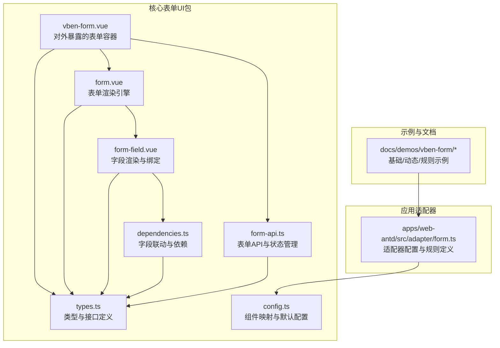
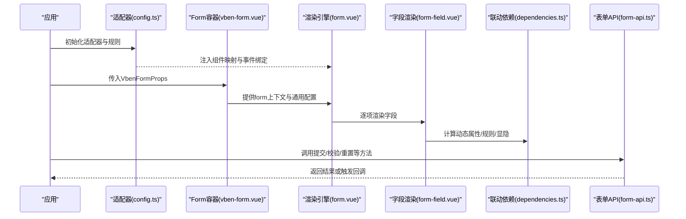
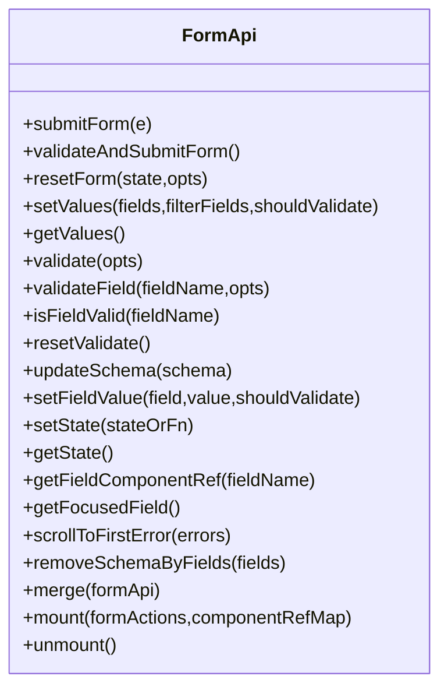
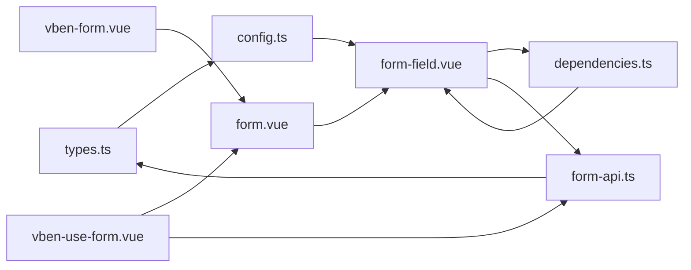

# 表单组件

<cite>
**本文档引用的文件**
- [vben-form.md](file://docs/src/components/common-ui/vben-form.md)
- [types.ts](file://packages/@core/ui-kit/form-ui/src/types.ts)
- [form-api.ts](file://packages/@core/ui-kit/form-ui/src/form-api.ts)
- [vben-form.vue](file://packages/@core/ui-kit/form-ui/src/vben-form.vue)
- [vben-use-form.vue](file://packages/@core/ui-kit/form-ui/src/vben-use-form.vue)
- [form.vue](file://packages/@core/ui-kit/form-ui/src/form-render/form.vue)
- [form-field.vue](file://packages/@core/ui-kit/form-ui/src/form-render/form-field.vue)
- [dependencies.ts](file://packages/@core/ui-kit/form-ui/src/form-render/dependencies.ts)
- [config.ts](file://packages/@core/ui-kit/form-ui/src/config.ts)
- [basic/index.vue](file://docs/src/demos/vben-form/basic/index.vue)
- [dynamic/index.vue](file://docs/src/demos/vben-form/dynamic/index.vue)
- [rules/index.vue](file://docs/src/demos/vben-form/rules/index.vue)
- [form.ts](file://apps/web-antd/src/adapter/form.ts)
</cite>

## 目录
1. [简介](#简介)
2. [项目结构](#项目结构)
3. [核心组件](#核心组件)
4. [架构总览](#架构总览)
5. [详细组件分析](#详细组件分析)
6. [依赖关系分析](#依赖关系分析)
7. [性能考量](#性能考量)
8. [故障排查指南](#故障排查指南)
9. [结论](#结论)
10. [附录](#附录)

## 简介
本文件为表单相关组件的全面API文档，涵盖Form组件的属性配置、验证规则、数据绑定与事件处理，以及输入组件如Input、Select、DatePicker等的属性与方法。文档还介绍表单的动态渲染、条件显示与联动逻辑，提供表单验证最佳实践与自定义验证器实现思路，说明数据序列化、反序列化与重置功能，并包含样式定制与主题支持建议。

## 项目结构
表单能力由核心UI包与各UI框架适配器共同构成：
- 核心表单UI包：提供Form渲染引擎、字段渲染、联动依赖、API封装与类型定义
- 适配器：为不同UI框架（如Ant Design Vue、Element Plus、Naive UI等）提供组件映射与事件绑定策略
- 示例与文档：展示基础用法、动态联动、规则校验与API操作

**图表来源**
- [vben-form.vue:1-80](file://packages/@core/ui-kit/form-ui/src/vben-form.vue#L1-L80)
- [form.vue:1-193](file://packages/@core/ui-kit/form-ui/src/form-render/form.vue#L1-L193)
- [form-field.vue:57-255](file://packages/@core/ui-kit/form-ui/src/form-render/form-field.vue#L57-L255)
- [dependencies.ts:109-142](file://packages/@core/ui-kit/form-ui/src/form-render/dependencies.ts#L109-L142)
- [form-api.ts:53-595](file://packages/@core/ui-kit/form-ui/src/form-api.ts#L53-L595)
- [types.ts:1-465](file://packages/@core/ui-kit/form-ui/src/types.ts#L1-L465)
- [config.ts:1-88](file://packages/@core/ui-kit/form-ui/src/config.ts#L1-L88)
- [form.ts:1-50](file://apps/web-antd/src/adapter/form.ts#L1-L50)

**章节来源**
- [vben-form.vue:1-80](file://packages/@core/ui-kit/form-ui/src/vben-form.vue#L1-L80)
- [form.vue:1-193](file://packages/@core/ui-kit/form-ui/src/form-render/form.vue#L1-L193)
- [types.ts:1-465](file://packages/@core/ui-kit/form-ui/src/types.ts#L1-L465)
- [config.ts:1-88](file://packages/@core/ui-kit/form-ui/src/config.ts#L1-L88)
- [form.ts:1-50](file://apps/web-antd/src/adapter/form.ts#L1-L50)

## 核心组件
- Form容器组件：负责接收属性、提供上下文、转发插槽与默认操作区
- 渲染引擎Form：根据schema生成字段，合并通用配置，处理布局与折叠
- 字段渲染FormField：解析组件映射、事件绑定、动态属性与规则、条件显隐
- 联动依赖dependencies：基于triggerFields监听变化，动态控制显示、禁用、必填、规则与组件参数
- API封装FormApi：统一的表单操作入口，提供提交、校验、重置、设置值、更新schema、滚动定位等能力
- 适配器config：建立组件映射与事件绑定策略，注入默认规则与模型属性名

**章节来源**
- [vben-form.vue:1-80](file://packages/@core/ui-kit/form-ui/src/vben-form.vue#L1-L80)
- [form.vue:1-193](file://packages/@core/ui-kit/form-ui/src/form-render/form.vue#L1-L193)
- [form-field.vue:57-255](file://packages/@core/ui-kit/form-ui/src/form-render/form-field.vue#L57-L255)
- [dependencies.ts:109-142](file://packages/@core/ui-kit/form-ui/src/form-render/dependencies.ts#L109-L142)
- [form-api.ts:53-595](file://packages/@core/ui-kit/form-ui/src/form-api.ts#L53-L595)
- [config.ts:1-88](file://packages/@core/ui-kit/form-ui/src/config.ts#L1-L88)

## 架构总览
表单从“适配器配置”开始，建立组件映射与默认行为；随后“Form容器”将属性与上下文传递给“渲染引擎”，“渲染引擎”遍历schema生成“字段组件”，字段组件通过“联动依赖”模块响应值变化，最终由“API封装”统一处理提交、校验与状态更新。

**图表来源**
- [config.ts:43-88](file://packages/@core/ui-kit/form-ui/src/config.ts#L43-L88)
- [vben-form.vue:1-80](file://packages/@core/ui-kit/form-ui/src/vben-form.vue#L1-L80)
- [form.vue:1-193](file://packages/@core/ui-kit/form-ui/src/form-render/form.vue#L1-L193)
- [form-field.vue:57-255](file://packages/@core/ui-kit/form-ui/src/form-render/form-field.vue#L57-L255)
- [dependencies.ts:109-142](file://packages/@core/ui-kit/form-ui/src/form-render/dependencies.ts#L109-L142)
- [form-api.ts:53-595](file://packages/@core/ui-kit/form-ui/src/form-api.ts#L53-L595)

## 详细组件分析

### Form容器组件（对外API）
- 主要职责：接收VbenFormProps，提供上下文，转发插槽，控制默认操作区
- 关键属性：布局、折叠、通用配置、操作按钮、回调钩子、schema等
- 关键事件：折叠状态变更、默认操作区事件透传
- 适用场景：作为顶层容器，承载表单渲染与交互

**章节来源**
- [vben-form.vue:1-80](file://packages/@core/ui-kit/form-ui/src/vben-form.vue#L1-L80)

### 渲染引擎Form（字段生成与布局）
- 主要职责：根据schema生成字段，合并通用配置，计算布局类名，处理折叠与隐藏
- 关键点：支持水平/垂直/内联布局；支持紧凑模式；支持网格列类名
- 输出：逐项渲染FormField，并支持自定义插槽

**章节来源**
- [form.vue:1-193](file://packages/@core/ui-kit/form-ui/src/form-render/form.vue#L1-L193)

### 字段渲染FormField（绑定与联动）
- 主要职责：解析组件映射、事件绑定、动态属性与规则、条件显隐
- 关键点：根据组件类型与事件映射，正确绑定v-model；支持自定义内容渲染；支持聚焦与失焦处理
- 性能：对autofocus、禁用监听器等进行条件处理，避免无效渲染

**章节来源**
- [form-field.vue:57-255](file://packages/@core/ui-kit/form-ui/src/form-render/form-field.vue#L57-L255)

### 联动依赖dependencies（动态渲染与条件控制）
- 主要职责：基于triggerFields监听变化，动态控制字段的显示/隐藏、禁用、必填、规则与组件参数
- 关键点：支持函数式与静态配置；支持异步计算；支持触发回调

**章节来源**
- [dependencies.ts:109-142](file://packages/@core/ui-kit/form-ui/src/form-render/dependencies.ts#L109-L142)

### API封装FormApi（提交/校验/重置/更新）
- 主要职责：统一表单操作入口，提供提交、校验、重置、设置值、更新schema、滚动定位等能力
- 关键点：支持批量提交链路、字段聚焦检测、值过滤与合并、滚动到首错等
- 数据处理：支持数组转字符串、时间范围映射、空值处理等

**图表来源**
- [form-api.ts:53-595](file://packages/@core/ui-kit/form-ui/src/form-api.ts#L53-L595)

**章节来源**
- [form-api.ts:53-595](file://packages/@core/ui-kit/form-ui/src/form-api.ts#L53-L595)

### 适配器config（组件映射与默认配置）
- 主要职责：建立组件映射、事件绑定策略、默认规则与模型属性名
- 关键点：支持不同UI框架的v-model命名差异；支持国际化规则定义

**章节来源**
- [config.ts:1-88](file://packages/@core/ui-kit/form-ui/src/config.ts#L1-L88)
- [form.ts:1-50](file://apps/web-antd/src/adapter/form.ts#L1-L50)

### 类型系统types（属性与接口）
- 主要职责：定义FormProps、Schema、CommonConfig、依赖条件、按钮选项等类型
- 关键点：支持栅格布局类名、字段映射时间、数组转字符串等高级配置

**章节来源**
- [types.ts:1-465](file://packages/@core/ui-kit/form-ui/src/types.ts#L1-L465)

## 依赖关系分析
- 低耦合：容器组件仅负责属性转发与上下文提供；渲染引擎与字段组件通过schema解耦
- 事件绑定：通过事件映射表将组件v-model统一为标准事件，屏蔽UI框架差异
- 状态管理：FormApi集中管理表单状态与操作，避免组件间直接通信
- 适配器：通过全局共享状态注入组件映射，实现跨框架复用

**图表来源**
- [types.ts:1-465](file://packages/@core/ui-kit/form-ui/src/types.ts#L1-L465)
- [config.ts:1-88](file://packages/@core/ui-kit/form-ui/src/config.ts#L1-L88)
- [form.vue:1-193](file://packages/@core/ui-kit/form-ui/src/form-render/form.vue#L1-L193)
- [form-field.vue:57-255](file://packages/@core/ui-kit/form-ui/src/form-render/form-field.vue#L57-L255)
- [dependencies.ts:109-142](file://packages/@core/ui-kit/form-ui/src/form-render/dependencies.ts#L109-L142)
- [vben-form.vue:1-80](file://packages/@core/ui-kit/form-ui/src/vben-form.vue#L1-L80)
- [vben-use-form.vue:1-152](file://packages/@core/ui-kit/form-ui/src/vben-use-form.vue#L1-L152)
- [form-api.ts:53-595](file://packages/@core/ui-kit/form-ui/src/form-api.ts#L53-L595)

**章节来源**
- [types.ts:1-465](file://packages/@core/ui-kit/form-ui/src/types.ts#L1-L465)
- [config.ts:1-88](file://packages/@core/ui-kit/form-ui/src/config.ts#L1-L88)
- [form.vue:1-193](file://packages/@core/ui-kit/form-ui/src/form-render/form.vue#L1-L193)
- [form-field.vue:57-255](file://packages/@core/ui-kit/form-ui/src/form-render/form-field.vue#L57-L255)
- [dependencies.ts:109-142](file://packages/@core/ui-kit/form-ui/src/form-render/dependencies.ts#L109-L142)
- [vben-form.vue:1-80](file://packages/@core/ui-kit/form-ui/src/vben-form.vue#L1-L80)
- [vben-use-form.vue:1-152](file://packages/@core/ui-kit/form-ui/src/vben-use-form.vue#L1-L152)
- [form-api.ts:53-595](file://packages/@core/ui-kit/form-ui/src/form-api.ts#L53-L595)

## 性能考量
- 渲染优化：字段组件按需渲染与隐藏，折叠时保留固定行数，减少DOM数量
- 事件绑定：默认禁用input/change监听器以降低事件风暴，必要时可开启
- 值过滤与合并：setValues支持过滤schema外字段与深度合并策略，避免不必要的重渲染
- 联动计算：依赖条件采用异步与缓存策略，避免频繁重算
- 提交链路：批量提交支持并发校验与合并结果，减少等待时间

[本节为通用指导，无需特定文件引用]

## 故障排查指南
- 表单未挂载：API方法在表单未挂载时会等待，若长时间无响应，检查容器是否正确提供form上下文
- 事件未触发：确认组件映射与事件绑定是否正确，尤其是不同UI框架的v-model命名差异
- 联动不生效：检查dependencies的triggerFields是否包含目标字段，函数式依赖是否返回期望值
- 校验不滚动：启用scrollToFirstError并在表单中设置handleSubmit回调，确保错误对象可定位
- 值过滤异常：setValues默认过滤schema外字段，如需全部设置，传入filterFields=false

**章节来源**
- [form-api.ts:446-455](file://packages/@core/ui-kit/form-ui/src/form-api.ts#L446-L455)
- [form-field.vue:214-252](file://packages/@core/ui-kit/form-ui/src/form-render/form-field.vue#L214-L252)
- [dependencies.ts:109-142](file://packages/@core/ui-kit/form-ui/src/form-render/dependencies.ts#L109-L142)

## 结论
该表单体系通过“适配器+渲染引擎+字段组件+API封装”的分层设计，实现了跨UI框架的统一表单体验。其强大的联动与动态渲染能力、完善的校验与序列化机制，以及灵活的样式与主题支持，使其既能满足快速开发，也能应对复杂业务场景。

[本节为总结性内容，无需特定文件引用]

## 附录

### Form组件API总览
- 属性（部分关键项）
  - 布局与显示：layout、wrapperClass、collapsed、collapsedRows、showCollapseButton、collapseTriggerResize
  - 通用配置：commonConfig、actionWrapperClass、actionLayout、actionPosition、actionButtonsReverse
  - 回调钩子：handleSubmit、handleReset、handleValuesChange、handleCollapsedChange
  - 行为控制：submitOnEnter、submitOnChange、compact、scrollToFirstError
  - 数据映射：fieldMappingTime、arrayToStringFields
  - Schema：schema（FormSchema[]）

- 事件
  - submit：表单提交事件

- 插槽
  - reset-before、submit-before、expand-before、expand-after
  - 以fieldName命名的字段插槽（优先于组件定义）

- 方法（FormApi）
  - 提交与校验：submitForm、validateAndSubmitForm、validate、validateField、isFieldValid
  - 重置与清理：resetForm、resetValidate
  - 值操作：setValues、getValues、setFieldValue
  - Schema与状态：updateSchema、setState、getState、removeSchemaByFields
  - 工具：getFieldComponentRef、getFocusedField、scrollToFirstError、merge、mount、unmount

**章节来源**
- [vben-form.md:259-569](file://docs/src/components/common-ui/vben-form.md#L259-L569)
- [types.ts:350-434](file://packages/@core/ui-kit/form-ui/src/types.ts#L350-L434)
- [form-api.ts:53-595](file://packages/@core/ui-kit/form-ui/src/form-api.ts#L53-L595)

### 输入组件与常用属性
- Input/InputPassword/PinInput/Select/RadioGroup/CheckboxGroup/Checkbox/Mentions/Rate/Switch/DatePicker/RangePicker/TimePicker/TreeSelect/Upload等
- 共同点：通过schema的component与componentProps配置；支持defaultValue、rules、dependencies、label、help、suffix等
- 适配差异：不同UI框架的v-model命名与空值策略不同，通过适配器统一

**章节来源**
- [vben-form.md:17-213](file://docs/src/components/common-ui/vben-form.md#L17-L213)
- [basic/index.vue:1-232](file://docs/src/demos/vben-form/basic/index.vue#L1-L232)
- [form.ts:1-50](file://apps/web-antd/src/adapter/form.ts#L1-L50)

### 动态渲染、条件显示与联动
- 条件显示：dependencies.if（销毁DOM）、dependencies.show（CSS隐藏）
- 禁用与必填：dependencies.disabled、dependencies.required
- 动态规则：dependencies.rules（可返回字符串规则或zod schema）
- 动态组件参数：dependencies.componentProps（动态返回props）
- 触发字段：dependencies.triggerFields（指定监听字段）

**章节来源**
- [vben-form.md:472-495](file://docs/src/components/common-ui/vben-form.md#L472-L495)
- [dynamic/index.vue:1-169](file://docs/src/demos/vben-form/dynamic/index.vue#L1-L169)
- [dependencies.ts:109-142](file://packages/@core/ui-kit/form-ui/src/form-render/dependencies.ts#L109-L142)

### 表单验证最佳实践
- 预定义规则：required、selectRequired（配合适配器国际化）
- zod规则：支持复杂校验、默认值、可选值等
- 滚动定位：scrollToFirstError自动滚动到首个错误字段
- 分组提交：FormApi.merge支持多个表单并发校验与合并

**章节来源**
- [vben-form.md:497-551](file://docs/src/components/common-ui/vben-form.md#L497-L551)
- [rules/index.vue:1-191](file://docs/src/demos/vben-form/rules/index.vue#L1-L191)
- [form-api.ts:405-444](file://packages/@core/ui-kit/form-ui/src/form-api.ts#L405-L444)

### 数据序列化、反序列化与重置
- 序列化：getValues返回标准化值对象；支持数组转字符串与时间范围映射
- 反序列化：setValues支持过滤schema外字段与深度合并
- 重置：resetForm重置为初始值；resetValidate清除错误状态
- 删除字段：removeSchemaByFields按字段名批量删除schema项

**章节来源**
- [form-api.ts:159-350](file://packages/@core/ui-kit/form-ui/src/form-api.ts#L159-L350)
- [form.vue:59-80](file://packages/@core/ui-kit/form-ui/src/form-render/form.vue#L59-L80)

### 样式定制与主题支持
- 布局类名：wrapperClass支持栅格列与断点前缀
- 通用样式：commonConfig.controlClass、labelClass、wrapperClass、formItemClass
- 按钮样式：actionWrapperClass、ActionButtonOptions
- 适配器：通过适配器注入组件与默认规则，统一主题风格

**章节来源**
- [types.ts:27-36](file://packages/@core/ui-kit/form-ui/src/types.ts#L27-L36)
- [types.ts:139-209](file://packages/@core/ui-kit/form-ui/src/types.ts#L139-L209)
- [types.ts:344-348](file://packages/@core/ui-kit/form-ui/src/types.ts#L344-L348)
- [vben-form.vue:19-32](file://packages/@core/ui-kit/form-ui/src/vben-form.vue#L19-L32)