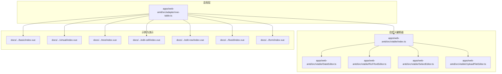
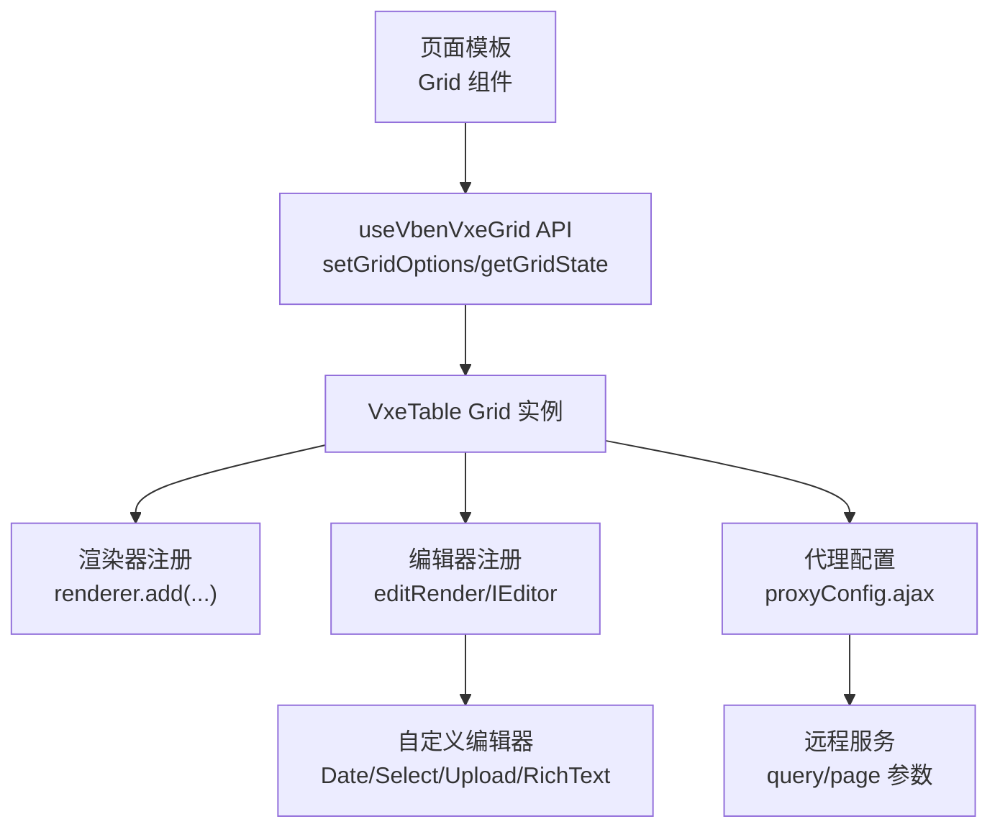
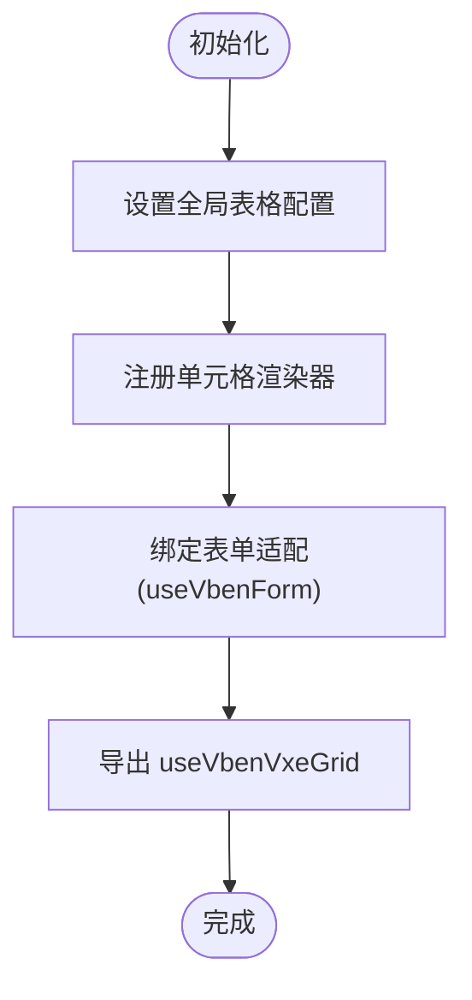
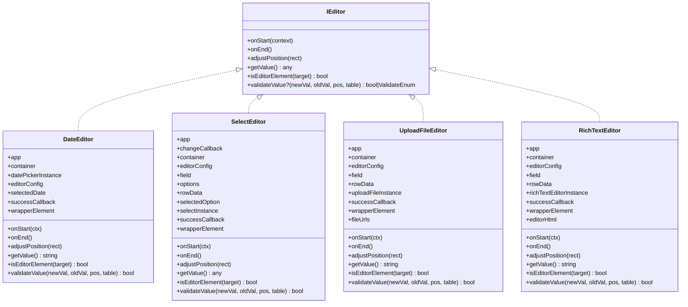
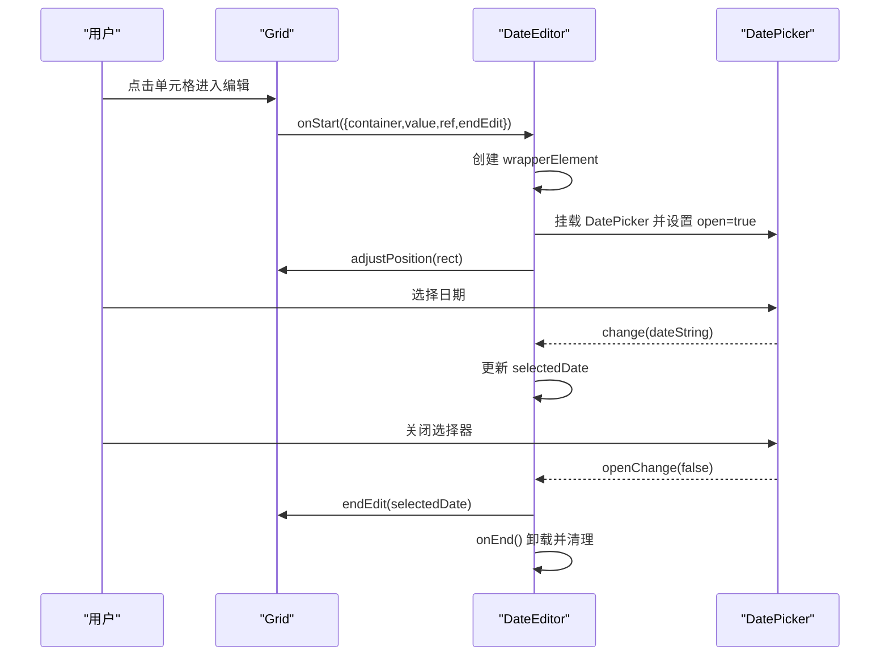
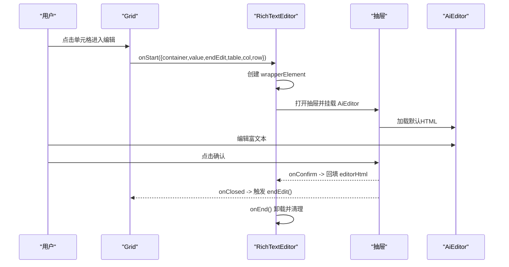
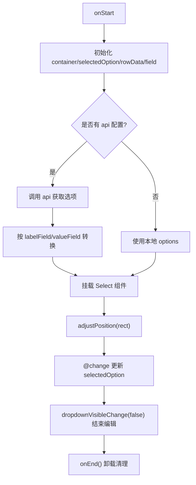
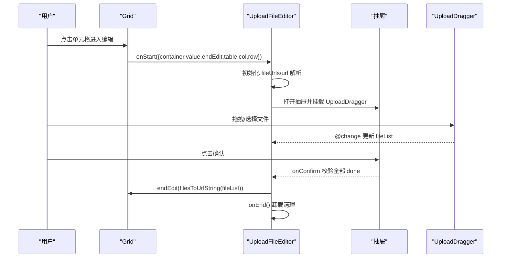
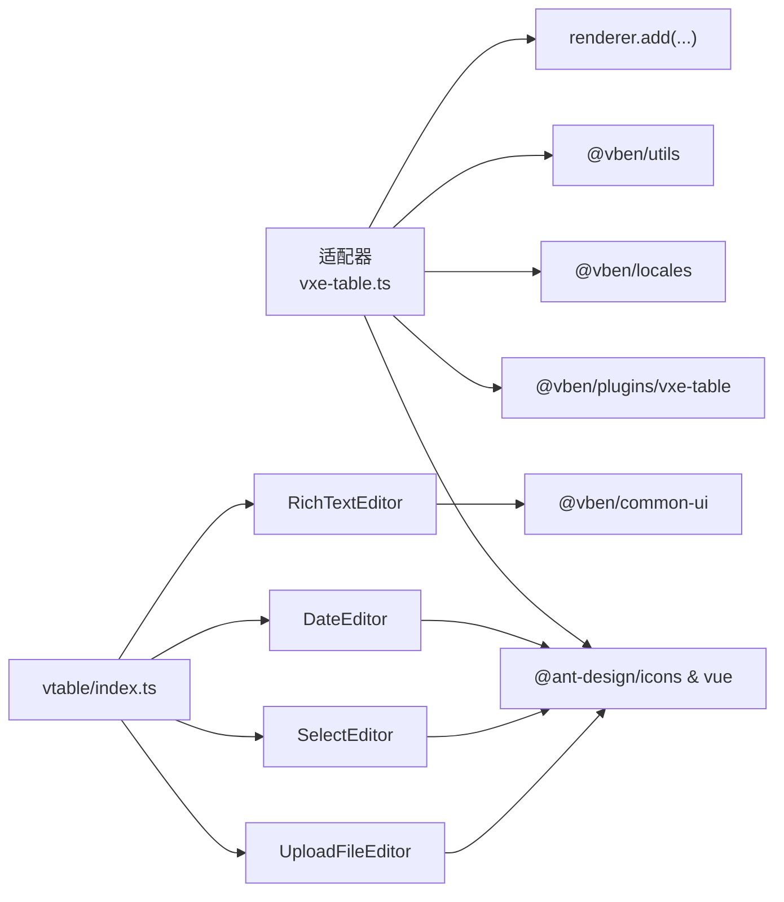

# 表格组件

<cite>
**本文引用的文件**
- [apps/web-antd/src/adapter/vxe-table.ts](file://apps/web-antd/src/adapter/vxe-table.ts)
- [apps/web-antd/src/vtable/index.ts](file://apps/web-antd/src/vtable/index.ts)
- [apps/web-antd/src/vtable/DateEditor.ts](file://apps/web-antd/src/vtable/DateEditor.ts)
- [apps/web-antd/src/vtable/RichTextEditor.ts](file://apps/web-antd/src/vtable/RichTextEditor.ts)
- [apps/web-antd/src/vtable/SelectEditor.ts](file://apps/web-antd/src/vtable/SelectEditor.ts)
- [apps/web-antd/src/vtable/UploadFileEditor.ts](file://apps/web-antd/src/vtable/UploadFileEditor.ts)
- [docs/src/demos/vben-vxe-table/basic/index.vue](file://docs/src/demos/vben-vxe-table/basic/index.vue)
- [docs/src/demos/vben-vxe-table/virtual/index.vue](file://docs/src/demos/vben-vxe-table/virtual/index.vue)
- [docs/src/demos/vben-vxe-table/tree/index.vue](file://docs/src/demos/vben-vxe-table/tree/index.vue)
- [docs/src/demos/vben-vxe-table/edit-cell/index.vue](file://docs/src/demos/vben-vxe-table/edit-cell/index.vue)
- [docs/src/demos/vben-vxe-table/edit-row/index.vue](file://docs/src/demos/vben-vxe-table/edit-row/index.vue)
- [docs/src/demos/vben-vxe-table/fixed/index.vue](file://docs/src/demos/vben-vxe-table/fixed/index.vue)
- [docs/src/demos/vben-vxe-table/form/index.vue](file://docs/src/demos/vben-vxe-table/form/index.vue)
</cite>

## 目录

1. [简介](#简介)
2. [项目结构](#项目结构)
3. [核心组件](#核心组件)
4. [架构总览](#架构总览)
5. [详细组件分析](#详细组件分析)
6. [依赖关系分析](#依赖关系分析)
7. [性能考量](#性能考量)
8. [故障排查指南](#故障排查指南)
9. [结论](#结论)
10. [附录](#附录)

## 简介

本文件为表格组件的详细API与使用说明，覆盖数据绑定、列配置、排序筛选、分页处理、编辑功能（含单元格编辑器）、虚拟滚动、树形结构、固定列与响应式布局，并提供性能优化策略、大数据量处理方案、导出/打印/自定义渲染能力以及样式定制与主题适配建议。内容基于仓库中 VxeTable 适配层与自定义编辑器实现，结合官方文档与示例进行系统化整理。

## 项目结构

表格相关的核心实现位于以下模块：

- 适配层：统一配置 VxeTable 行为、注册渲染器与工具函数
- 自定义编辑器：基于 VTable IEditor 接口封装的日期、富文本、下拉选择、文件上传等编辑器
- 示例与演示：基础表格、虚拟滚动、树形表格、单元格/行编辑、固定列、表单联动等

**图表来源**

- [apps/web-antd/src/adapter/vxe-table.ts:34-104](file://apps/web-antd/src/adapter/vxe-table.ts#L34-L104)
- [apps/web-antd/src/vtable/index.ts:1-9](file://apps/web-antd/src/vtable/index.ts#L1-L9)

**章节来源**

- [apps/web-antd/src/adapter/vxe-table.ts:34-104](file://apps/web-antd/src/adapter/vxe-table.ts#L34-L104)
- [apps/web-antd/src/vtable/index.ts:1-9](file://apps/web-antd/src/vtable/index.ts#L1-L9)

## 核心组件

- 适配器 useVbenVxeGrid：封装 VxeTable 使用方式，提供统一的 gridOptions、gridEvents、store 访问与 API 调用入口
- 渲染器注册：注册多种单元格渲染器（如图片、链接、标签、开关、用户头像、字典选择等）
- 自定义编辑器：实现 IEditor 接口的日期、富文本、下拉选择、文件上传编辑器，支持校验与回调

关键能力概览：

- 数据绑定：通过 gridOptions.data 与 proxyConfig.ajax 实现本地/远程数据加载
- 列配置：columns 支持排序、树节点、固定列、溢出省略、最小宽度等
- 排序筛选：sortConfig/multiple 与 filterConfig（示例中未启用）
- 分页处理：pagerConfig.enabled 控制分页，proxyConfig.ajax.query 提供分页参数
- 编辑功能：editConfig.mode=cell/row，结合自定义 editRender 或内置 input
- 虚拟滚动：scrollY.enabled + gt 配置，适合大数据量场景
- 树形结构：treeConfig.parentField/rowField/transform
- 固定列：column.fixed='left'/'right'
- 响应式布局：高度自适应、列宽自适应、溢出省略

**章节来源**

- [apps/web-antd/src/adapter/vxe-table.ts:34-104](file://apps/web-antd/src/adapter/vxe-table.ts#L34-L104)
- [docs/src/demos/vben-vxe-table/basic/index.vue:19-43](file://docs/src/demos/vben-vxe-table/basic/index.vue#L19-L43)
- [docs/src/demos/vben-vxe-table/virtual/index.vue:15-34](file://docs/src/demos/vben-vxe-table/virtual/index.vue#L15-L34)
- [docs/src/demos/vben-vxe-table/tree/index.vue:39-58](file://docs/src/demos/vben-vxe-table/tree/index.vue#L39-L58)
- [docs/src/demos/vben-vxe-table/fixed/index.vue:19-56](file://docs/src/demos/vben-vxe-table/fixed/index.vue#L19-L56)
- [docs/src/demos/vben-vxe-table/form/index.vue:85-121](file://docs/src/demos/vben-vxe-table/form/index.vue#L85-L121)

## 架构总览

下图展示表格组件的高层架构与交互流程：

**图表来源**

- [apps/web-antd/src/adapter/vxe-table.ts:34-104](file://apps/web-antd/src/adapter/vxe-table.ts#L34-L104)
- [apps/web-antd/src/vtable/index.ts:1-9](file://apps/web-antd/src/vtable/index.ts#L1-L9)

## 详细组件分析

### 适配器与全局配置

- 全局设置：grid.align/border/columnConfig.resizable/minHeight/round/showOverflow/size 等
- 表单集成：禁用 VxeTable 内置 formConfig，统一使用 useVbenForm
- 代理配置：proxyConfig.autoLoad/response.result/total/list/showActionMsg/showResponseMsg
- 渲染器注册：CellImage/CellLink/CellTag/CellSwitch/CellOperation/DictTag/UserAvatar/UserAvatarGroup/DictSelect/UserSelect/CellProgress
- 工具函数：setupVbenVxeTable/useVbenVxeGrid

**图表来源**

- [apps/web-antd/src/adapter/vxe-table.ts:34-104](file://apps/web-antd/src/adapter/vxe-table.ts#L34-L104)

**章节来源**

- [apps/web-antd/src/adapter/vxe-table.ts:34-104](file://apps/web-antd/src/adapter/vxe-table.ts#L34-L104)

### 自定义编辑器（IEditor 实现）

#### 通用接口与生命周期

- 必需方法：onStart/onEnd/adjustPosition/getValue/isEditorElement
- 可选方法：validateValue（部分编辑器实现）
- 生命周期：onStart 创建 Vue 应用并挂载到容器；onEnd 卸载并清理 DOM

**图表来源**

- [apps/web-antd/src/vtable/DateEditor.ts:19-214](file://apps/web-antd/src/vtable/DateEditor.ts#L19-L214)
- [apps/web-antd/src/vtable/SelectEditor.ts:34-381](file://apps/web-antd/src/vtable/SelectEditor.ts#L34-L381)
- [apps/web-antd/src/vtable/UploadFileEditor.ts:36-338](file://apps/web-antd/src/vtable/UploadFileEditor.ts#L36-L338)
- [apps/web-antd/src/vtable/RichTextEditor.ts:27-265](file://apps/web-antd/src/vtable/RichTextEditor.ts#L27-L265)

#### 日期编辑器（DateEditor）

- 功能：基于 Ant Design Vue DatePicker 的日期时间选择，自动打开、关闭即结束编辑
- 位置调整：根据参考矩形定位，绝对定位并设置尺寸
- 值获取：返回字符串格式日期时间
- 校验：对非法日期返回 false

**图表来源**

- [apps/web-antd/src/vtable/DateEditor.ts:116-197](file://apps/web-antd/src/vtable/DateEditor.ts#L116-L197)

**章节来源**

- [apps/web-antd/src/vtable/DateEditor.ts:19-214](file://apps/web-antd/src/vtable/DateEditor.ts#L19-L214)

#### 富文本编辑器（RichTextEditor）

- 功能：通过抽屉弹窗承载 AiEditor 富文本编辑器，支持确认后回填
- 交互：抽屉打开后自动聚焦；关闭时触发编辑结束回调
- 值获取：返回 HTML 字符串
- 注意：isEditorElement 返回恒真，避免误触关闭

**图表来源**

- [apps/web-antd/src/vtable/RichTextEditor.ts:123-144](file://apps/web-antd/src/vtable/RichTextEditor.ts#L123-L144)
- [apps/web-antd/src/vtable/RichTextEditor.ts:205-244](file://apps/web-antd/src/vtable/RichTextEditor.ts#L205-L244)

**章节来源**

- [apps/web-antd/src/vtable/RichTextEditor.ts:27-265](file://apps/web-antd/src/vtable/RichTextEditor.ts#L27-L265)

#### 下拉选择编辑器（SelectEditor）

- 功能：Ant Design Vue Select 下拉选择，支持本地 options 或通过 api 动态获取
- 选项转换：可配置 labelField/valueField/resultField，自动转换为标准格式
- 校验：validateValue 根据 label 匹配选项，触发 change 回调更新选中项
- 交互：下拉可见性变化时处理结束编辑

**图表来源**

- [apps/web-antd/src/vtable/SelectEditor.ts:141-170](file://apps/web-antd/src/vtable/SelectEditor.ts#L141-L170)
- [apps/web-antd/src/vtable/SelectEditor.ts:176-216](file://apps/web-antd/src/vtable/SelectEditor.ts#L176-L216)
- [apps/web-antd/src/vtable/SelectEditor.ts:308-354](file://apps/web-antd/src/vtable/SelectEditor.ts#L308-L354)

**章节来源**

- [apps/web-antd/src/vtable/SelectEditor.ts:34-381](file://apps/web-antd/src/vtable/SelectEditor.ts#L34-L381)

#### 文件上传编辑器（UploadFileEditor）

- 功能：基于 UploadDragger 的文件拖拽上传，支持多文件、最大数量限制、大小限制
- 交互：抽屉打开后自动聚焦；确认时校验所有文件是否上传成功
- 值获取：将文件列表转换为 URL 字符串存储
- 校验：validateValue 校验是否为合法 URL 字符串

**图表来源**

- [apps/web-antd/src/vtable/UploadFileEditor.ts:132-155](file://apps/web-antd/src/vtable/UploadFileEditor.ts#L132-L155)
- [apps/web-antd/src/vtable/UploadFileEditor.ts:218-311](file://apps/web-antd/src/vtable/UploadFileEditor.ts#L218-L311)

**章节来源**

- [apps/web-antd/src/vtable/UploadFileEditor.ts:36-338](file://apps/web-antd/src/vtable/UploadFileEditor.ts#L36-L338)

### API 一览（属性/事件/插槽/方法）

- 属性（gridOptions）
  - columns：列定义，支持 field/title/type/sortable/treeNode/fixed/minWidth/showOverflow 等
  - data：本地数据
  - pagerConfig：分页配置，enabled=false 关闭分页
  - sortConfig：排序配置，multiple=true 支持多列排序
  - treeConfig：树形配置，parentField/rowField/transform
  - scrollY：虚拟滚动，enabled=true + gt>0
  - editConfig：编辑配置，mode='cell'/'row'，trigger='click'
  - proxyConfig：代理配置，ajax.query 提供分页参数 page.currentPage/page.pageSize
  - toolbarConfig：工具栏配置，search=true 显示搜索按钮
  - rowConfig：行配置，isHover=true 等
  - 其他：align/border/round/minHeight/size/showOverflow 等

- 事件（gridEvents）
  - cellClick：单元格点击
  - 其他：VxeTable 原生事件均可使用（如 checkbox-change、radio-change、page-change 等）

- 插槽（slots）
  - toolbar-tools：工具栏右侧扩展
  - action：操作列插槽（示例中使用）

- 方法（gridApi）
  - setGridOptions(options)：动态更新表格配置
  - setLoading(flag)：显示/隐藏加载状态
  - grid.setAllTreeExpand(flag)：展开/折叠树形
  - grid.isEditByRow(row)/setEditRow(row)/clearEdit()：行编辑状态管理
  - grid.useStore(selector)：读取内部状态

**章节来源**

- [docs/src/demos/vben-vxe-table/basic/index.vue:19-43](file://docs/src/demos/vben-vxe-table/basic/index.vue#L19-L43)
- [docs/src/demos/vben-vxe-table/virtual/index.vue:15-34](file://docs/src/demos/vben-vxe-table/virtual/index.vue#L15-L34)
- [docs/src/demos/vben-vxe-table/tree/index.vue:39-58](file://docs/src/demos/vben-vxe-table/tree/index.vue#L39-L58)
- [docs/src/demos/vben-vxe-table/edit-cell/index.vue:17-48](file://docs/src/demos/vben-vxe-table/edit-cell/index.vue#L17-L48)
- [docs/src/demos/vben-vxe-table/edit-row/index.vue:19-76](file://docs/src/demos/vben-vxe-table/edit-row/index.vue#L19-L76)
- [docs/src/demos/vben-vxe-table/fixed/index.vue:19-56](file://docs/src/demos/vben-vxe-table/fixed/index.vue#L19-L56)
- [docs/src/demos/vben-vxe-table/form/index.vue:85-121](file://docs/src/demos/vben-vxe-table/form/index.vue#L85-L121)

## 依赖关系分析

- 适配器依赖 VxeTable 插件与 Ant Design Vue 组件生态
- 自定义编辑器依赖 Ant Design Vue 组件（DatePicker/Select/Upload）与内部抽屉/消息提示
- 渲染器注册依赖 renderer.add，统一由适配器集中配置
- 代理配置依赖远程服务接口，示例中通过 getExampleTableApi 提供分页查询

**图表来源**

- [apps/web-antd/src/adapter/vxe-table.ts:10-33](file://apps/web-antd/src/adapter/vxe-table.ts#L10-L33)
- [apps/web-antd/src/vtable/index.ts:1-9](file://apps/web-antd/src/vtable/index.ts#L1-L9)

**章节来源**

- [apps/web-antd/src/adapter/vxe-table.ts:10-33](file://apps/web-antd/src/adapter/vxe-table.ts#L10-L33)
- [apps/web-antd/src/vtable/index.ts:1-9](file://apps/web-antd/src/vtable/index.ts#L1-L9)

## 性能考量

- 虚拟滚动
  - 启用条件：scrollY.enabled=true，gt>0；适用于大数据量（示例中一次性加载 1000 条）
  - 优势：仅渲染可视区域，显著降低 DOM 数量与重排成本
- 代理与分页
  - 使用 proxyConfig.ajax.query 传递 page.currentPage/page.pageSize，避免一次性加载全量数据
- 渲染器与编辑器
  - 通过 renderer.add 注册轻量渲染器，减少重复创建
  - 编辑器在 onEnd 中统一卸载，防止内存泄漏
- 列宽与溢出
  - 合理设置 minWidth 与 showOverflow，避免频繁计算导致的性能损耗
- 事件节流
  - 对高频事件（如滚动、窗口 resize）建议在业务侧增加节流/防抖

**章节来源**

- [docs/src/demos/vben-vxe-table/virtual/index.vue:27-57](file://docs/src/demos/vben-vxe-table/virtual/index.vue#L27-L57)
- [apps/web-antd/src/adapter/vxe-table.ts:49-62](file://apps/web-antd/src/adapter/vxe-table.ts#L49-L62)

## 故障排查指南

- 编辑器无法关闭/误关闭
  - 检查 isEditorElement 实现，确保返回值符合预期（富文本编辑器当前返回恒真）
- 日期编辑器值无效
  - validateValue 会拒绝非法日期，确认传入值格式与 dayjs 兼容
- 下拉选择器选项不生效
  - 若配置了 api，需确保返回数据包含 labelField/valueField 字段，或提供 resultField 指向列表
- 文件上传校验失败
  - 确认所有文件状态均为 done，且 URL 格式合法
- 树形展开异常
  - 确认 treeConfig.parentField/rowField/transform 配置正确，数据结构满足父子关系
- 表单联动查询参数缺失
  - proxyConfig.ajax.query 第二个参数为 formValues，确保表单字段名与后端一致

**章节来源**

- [apps/web-antd/src/vtable/RichTextEditor.ts:92-98](file://apps/web-antd/src/vtable/RichTextEditor.ts#L92-L98)
- [apps/web-antd/src/vtable/DateEditor.ts:202-213](file://apps/web-antd/src/vtable/DateEditor.ts#L202-L213)
- [apps/web-antd/src/vtable/SelectEditor.ts:176-216](file://apps/web-antd/src/vtable/SelectEditor.ts#L176-L216)
- [apps/web-antd/src/vtable/UploadFileEditor.ts:161-181](file://apps/web-antd/src/vtable/UploadFileEditor.ts#L161-L181)
- [docs/src/demos/vben-vxe-table/tree/index.vue:51-56](file://docs/src/demos/vben-vxe-table/tree/index.vue#L51-L56)
- [docs/src/demos/vben-vxe-table/form/index.vue:103-111](file://docs/src/demos/vben-vxe-table/form/index.vue#L103-L111)

## 结论

本表格组件通过适配器统一封装 VxeTable 的行为与渲染器，结合自定义编辑器实现丰富的编辑体验。配合虚拟滚动、树形结构、固定列与表单联动，能够满足复杂业务场景下的数据展示与编辑需求。建议在大数据量场景优先采用虚拟滚动与代理分页，在需要复杂编辑时选用对应自定义编辑器，并注意生命周期清理与校验逻辑。

## 附录

### 常用示例路径

- 基础表格：[docs/src/demos/vben-vxe-table/basic/index.vue](file://docs/src/demos/vben-vxe-table/basic/index.vue)
- 虚拟滚动：[docs/src/demos/vben-vxe-table/virtual/index.vue](file://docs/src/demos/vben-vxe-table/virtual/index.vue)
- 树形表格：[docs/src/demos/vben-vxe-table/tree/index.vue](file://docs/src/demos/vben-vxe-table/tree/index.vue)
- 单元格编辑：[docs/src/demos/vben-vxe-table/edit-cell/index.vue](file://docs/src/demos/vben-vxe-table/edit-cell/index.vue)
- 行编辑：[docs/src/demos/vben-vxe-table/edit-row/index.vue](file://docs/src/demos/vben-vxe-table/edit-row/index.vue)
- 固定列：[docs/src/demos/vben-vxe-table/fixed/index.vue](file://docs/src/demos/vben-vxe-table/fixed/index.vue)
- 表单联动：[docs/src/demos/vben-vxe-table/form/index.vue](file://docs/src/demos/vben-vxe-table/form/index.vue)
