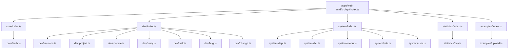
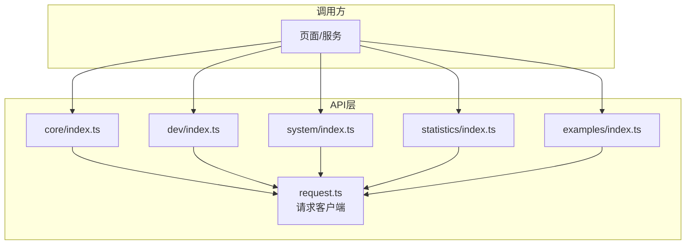
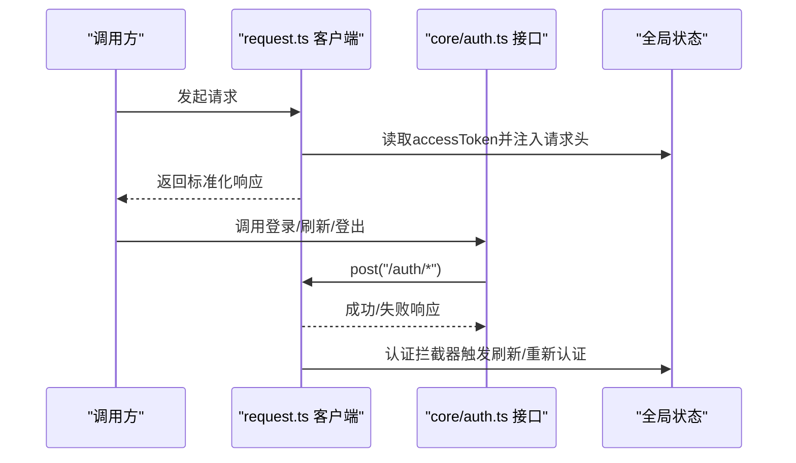
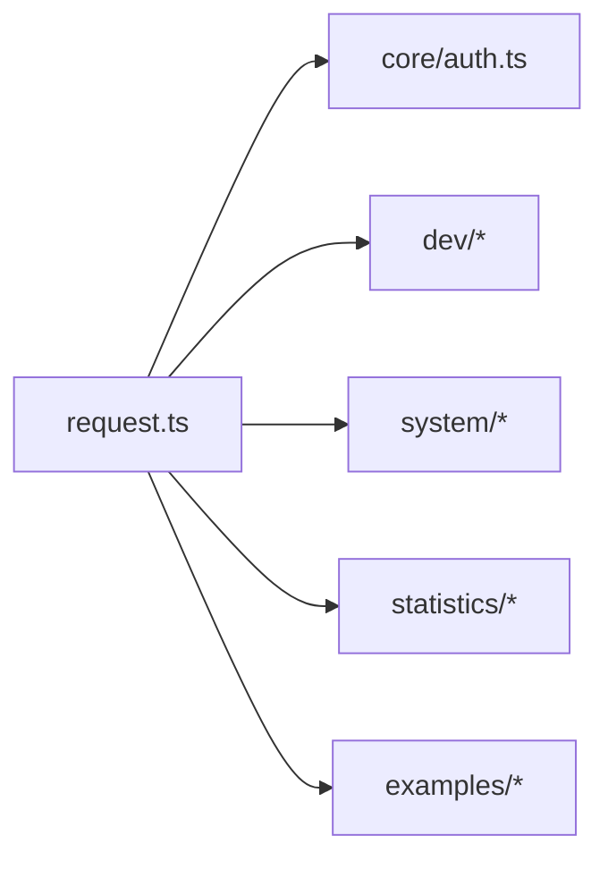

# API模块组织

<cite>
**本文引用的文件**
- [apps/web-antd/src/api/index.ts](file://apps/web-antd/src/api/index.ts)
- [apps/web-antd/src/api/request.ts](file://apps/web-antd/src/api/request.ts)
- [apps/web-antd/src/api/core/index.ts](file://apps/web-antd/src/api/core/index.ts)
- [apps/web-antd/src/api/dev/index.ts](file://apps/web-antd/src/api/dev/index.ts)
- [apps/web-antd/src/api/system/index.ts](file://apps/web-antd/src/api/system/index.ts)
- [apps/web-antd/src/api/statistics/index.ts](file://apps/web-antd/src/api/statistics/index.ts)
- [apps/web-antd/src/api/examples/index.ts](file://apps/web-antd/src/api/examples/index.ts)
- [apps/web-antd/src/api/core/auth.ts](file://apps/web-antd/src/api/core/auth.ts)
- [playground/src/api/index.ts](file://playground/src/api/index.ts)
- [playground/src/api/request.ts](file://playground/src/api/request.ts)
</cite>

## 目录
1. [简介](#简介)
2. [项目结构](#项目结构)
3. [核心组件](#核心组件)
4. [架构总览](#架构总览)
5. [详细组件分析](#详细组件分析)
6. [依赖分析](#依赖分析)
7. [性能考虑](#性能考虑)
8. [故障排查指南](#故障排查指南)
9. [结论](#结论)
10. [附录](#附录)

## 简介
本指南系统阐述本仓库中API模块的组织与设计原则，覆盖模块划分（core、dev、system等）、命名规范、文件组织结构、参数传递规范、以及创建与维护最佳实践。通过并行分析前端应用中的API目录与请求客户端配置，总结出可复用的模块化模式，帮助团队在多端（web-antd、playground等）保持一致的API组织风格。

## 项目结构
API模块采用“按领域分组”的目录组织方式：每个功能域一个子目录，子目录内再按资源实体拆分具体接口文件；通过各域的index.ts统一导出，形成清晰的模块边界与访问入口。

- 根导出入口：apps/web-antd/src/api/index.ts 汇总导出 core、dev、examples、system、statistics 等域
- 领域子目录：
  - core：核心能力域（认证、菜单、用户）
  - dev：开发协作域（版本、项目、模块、故事、任务、缺陷、变更）
  - system：系统管理域（部门、字典、菜单、角色、用户）
  - statistics：统计域（开发统计）
  - examples：示例域（上传等演示接口）

图表来源
- [apps/web-antd/src/api/index.ts:1-6](file://apps/web-antd/src/api/index.ts#L1-L6)
- [apps/web-antd/src/api/core/index.ts:1-4](file://apps/web-antd/src/api/core/index.ts#L1-L4)
- [apps/web-antd/src/api/dev/index.ts:1-8](file://apps/web-antd/src/api/dev/index.ts#L1-L8)
- [apps/web-antd/src/api/system/index.ts:1-6](file://apps/web-antd/src/api/system/index.ts#L1-L6)
- [apps/web-antd/src/api/statistics/index.ts:1-2](file://apps/web-antd/src/api/statistics/index.ts#L1-L2)
- [apps/web-antd/src/api/examples/index.ts:1-2](file://apps/web-antd/src/api/examples/index.ts#L1-L2)

章节来源
- [apps/web-antd/src/api/index.ts:1-6](file://apps/web-antd/src/api/index.ts#L1-L6)
- [apps/web-antd/src/api/core/index.ts:1-4](file://apps/web-antd/src/api/core/index.ts#L1-L4)
- [apps/web-antd/src/api/dev/index.ts:1-8](file://apps/web-antd/src/api/dev/index.ts#L1-L8)
- [apps/web-antd/src/api/system/index.ts:1-6](file://apps/web-antd/src/api/system/index.ts#L1-L6)
- [apps/web-antd/src/api/statistics/index.ts:1-2](file://apps/web-antd/src/api/statistics/index.ts#L1-L2)
- [apps/web-antd/src/api/examples/index.ts:1-2](file://apps/web-antd/src/api/examples/index.ts#L1-L2)

## 核心组件
- 请求客户端封装：apps/web-antd/src/api/request.ts
  - 统一封装了请求拦截器、响应拦截器、错误处理、Token刷新与重新认证流程
  - 支持JSON BigInt解析、语言头设置、统一响应结构映射
  - 提供 requestClient（带默认拦截器）与 baseRequestClient（基础客户端）两类实例
- 领域API导出：apps/web-antd/src/api/{core,dev,system,statistics,examples}/index.ts
  - 各域内部再按资源实体拆分文件，统一由域级index导出，便于按域聚合调用

章节来源
- [apps/web-antd/src/api/request.ts:1-124](file://apps/web-antd/src/api/request.ts#L1-L124)
- [apps/web-antd/src/api/core/index.ts:1-4](file://apps/web-antd/src/api/core/index.ts#L1-L4)
- [apps/web-antd/src/api/dev/index.ts:1-8](file://apps/web-antd/src/api/dev/index.ts#L1-L8)
- [apps/web-antd/src/api/system/index.ts:1-6](file://apps/web-antd/src/api/system/index.ts#L1-L6)
- [apps/web-antd/src/api/statistics/index.ts:1-2](file://apps/web-antd/src/api/statistics/index.ts#L1-L2)
- [apps/web-antd/src/api/examples/index.ts:1-2](file://apps/web-antd/src/api/examples/index.ts#L1-L2)

## 架构总览
API模块整体采用“请求客户端 + 领域模块”的分层架构：
- 请求客户端层：集中处理HTTP请求/响应、鉴权、错误、国际化等横切关注点
- 领域模块层：按业务域划分，每个域内按资源实体进一步细分，统一导出
- 调用方：页面或服务层通过域级导出直接消费API

图表来源
- [apps/web-antd/src/api/request.ts:1-124](file://apps/web-antd/src/api/request.ts#L1-L124)
- [apps/web-antd/src/api/index.ts:1-6](file://apps/web-antd/src/api/index.ts#L1-L6)

## 详细组件分析

### 请求客户端（request.ts）
- 职责
  - 统一请求头注入（Authorization、Accept-Language）
  - 统一响应体转换（JSON BigInt解析）
  - 统一响应拦截（成功码映射、错误消息展示）
  - Token刷新与重新认证策略
- 关键流程
  - 请求拦截：从全局状态读取Token并注入到请求头
  - 响应拦截：默认拦截器将后端约定的code/data结构标准化；认证拦截器处理过期场景；错误拦截器兜底提示
  - 刷新Token：当启用刷新时，自动调用刷新接口并更新内存Token
- 参数与返回
  - requestClient：默认开启响应体只返回data字段
  - baseRequestClient：基础客户端，用于无需默认拦截器的场景（如刷新Token）

图表来源
- [apps/web-antd/src/api/request.ts:74-114](file://apps/web-antd/src/api/request.ts#L74-L114)
- [apps/web-antd/src/api/core/auth.ts:24-51](file://apps/web-antd/src/api/core/auth.ts#L24-L51)

章节来源
- [apps/web-antd/src/api/request.ts:1-124](file://apps/web-antd/src/api/request.ts#L1-L124)
- [apps/web-antd/src/api/core/auth.ts:1-52](file://apps/web-antd/src/api/core/auth.ts#L1-L52)

### 核心域（core）
- 职责：提供认证、菜单、用户等基础能力
- 文件组织：core/index.ts统一导出auth、menu、user等
- 典型接口：登录、刷新Token、登出、获取权限码等
- 命名规范：接口以Api后缀标识，参数对象以Params结尾，结果对象以Result结尾

章节来源
- [apps/web-antd/src/api/core/index.ts:1-4](file://apps/web-antd/src/api/core/index.ts#L1-L4)
- [apps/web-antd/src/api/core/auth.ts:1-52](file://apps/web-antd/src/api/core/auth.ts#L1-L52)

### 开发域（dev）
- 职责：支撑开发协作的版本、项目、模块、故事、任务、缺陷、变更等
- 文件组织：dev/index.ts统一导出各资源实体
- 命名规范：遵循core域的命名风格，接口函数以动词+资源形式命名，参数/结果对象语义明确

章节来源
- [apps/web-antd/src/api/dev/index.ts:1-8](file://apps/web-antd/src/api/dev/index.ts#L1-L8)

### 系统域（system）
- 职责：系统管理相关的部门、字典、菜单、角色、用户等
- 文件组织：system/index.ts统一导出各资源实体
- 命名规范：与core域一致，确保跨域一致性

章节来源
- [apps/web-antd/src/api/system/index.ts:1-6](file://apps/web-antd/src/api/system/index.ts#L1-L6)

### 统计域（statistics）
- 职责：提供统计类接口（如开发统计）
- 文件组织：statistics/index.ts导出对应资源

章节来源
- [apps/web-antd/src/api/statistics/index.ts:1-2](file://apps/web-antd/src/api/statistics/index.ts#L1-L2)

### 示例域（examples）
- 职责：演示用途的接口（如上传）
- 文件组织：examples/index.ts导出示例接口

章节来源
- [apps/web-antd/src/api/examples/index.ts:1-2](file://apps/web-antd/src/api/examples/index.ts#L1-L2)

### Playground中的API组织
- playground/src/api/index.ts：导出core、examples、system
- playground/src/api/request.ts：与web-antd保持一致的请求客户端封装与拦截器策略

章节来源
- [playground/src/api/index.ts:1-4](file://playground/src/api/index.ts#L1-L4)
- [playground/src/api/request.ts:1-134](file://playground/src/api/request.ts#L1-L134)

## 依赖分析
- 模块耦合
  - 所有API接口均依赖apps/web-antd/src/api/request.ts提供的请求客户端
  - 各域之间低耦合，通过统一导出暴露给调用方
- 导入关系
  - 域级index.ts仅负责聚合导出，不直接依赖具体实现细节
  - 具体接口文件通过相对路径导入请求客户端

图表来源
- [apps/web-antd/src/api/request.ts:1-124](file://apps/web-antd/src/api/request.ts#L1-L124)
- [apps/web-antd/src/api/core/auth.ts:1-52](file://apps/web-antd/src/api/core/auth.ts#L1-L52)
- [apps/web-antd/src/api/dev/index.ts:1-8](file://apps/web-antd/src/api/dev/index.ts#L1-L8)
- [apps/web-antd/src/api/system/index.ts:1-6](file://apps/web-antd/src/api/system/index.ts#L1-L6)
- [apps/web-antd/src/api/statistics/index.ts:1-2](file://apps/web-antd/src/api/statistics/index.ts#L1-L2)
- [apps/web-antd/src/api/examples/index.ts:1-2](file://apps/web-antd/src/api/examples/index.ts#L1-L2)

## 性能考虑
- 请求拦截器与响应拦截器的链式处理可能带来额外开销，建议：
  - 对高频接口可考虑使用baseRequestClient绕过默认拦截器
  - 合理缓存Token与错误提示，避免重复弹窗
- JSON BigInt解析仅在JSON内容类型且字符串数据时生效，减少不必要的解析成本

## 故障排查指南
- Token过期/失效
  - 触发认证拦截器，自动尝试刷新Token或重新登录
  - 若启用模态框登录模式，将弹出登录浮层；否则直接执行登出清理
- 错误消息兜底
  - 默认拦截器将后端约定的code/data结构标准化
  - 错误拦截器优先读取后端返回的error/message字段，无则按状态码提示
- 调试建议
  - 在浏览器网络面板观察请求头是否包含Authorization与Accept-Language
  - 检查响应体是否被正确转换为期望的数据结构

章节来源
- [apps/web-antd/src/api/request.ts:94-114](file://apps/web-antd/src/api/request.ts#L94-L114)

## 结论
本仓库的API模块组织遵循“按领域分组 + 统一导出 + 请求客户端封装”的设计，既保证了模块内聚、降低耦合，又提供了统一的横切能力（鉴权、错误、国际化）。通过core、dev、system等域的清晰划分与一致的命名规范，能够有效提升团队协作效率与代码可维护性。

## 附录

### API模块创建与维护最佳实践
- 创建新域
  - 新建目录并在index.ts中聚合导出
  - 在根导出apps/web-antd/src/api/index.ts中追加导出
- 创建新资源实体
  - 在对应域下新增文件，按“动作+资源”命名（如get、list、save等）
  - 参数对象以Params结尾，结果对象以Result结尾
- 参数传递规范
  - 分页参数建议统一使用PageFetchParams（含pageNo、pageSize等）
  - 通用头：Authorization（由请求客户端注入）、Accept-Language（由请求客户端注入）
- 错误处理
  - 使用默认拦截器标准化响应结构
  - 使用错误拦截器兜底提示，必要时在上层做差异化处理
- Token管理
  - 登录/刷新/登出接口使用baseRequestClient避免默认拦截器影响
  - 重新认证策略按配置选择模态框或直接登出

### 命名约定与文件组织示例
- 域级导出：apps/web-antd/src/api/{core,dev,system,statistics,examples}/index.ts
- 接口文件：apps/web-antd/src/api/core/auth.ts
- 请求客户端：apps/web-antd/src/api/request.ts

章节来源
- [apps/web-antd/src/api/index.ts:1-6](file://apps/web-antd/src/api/index.ts#L1-L6)
- [apps/web-antd/src/api/request.ts:1-124](file://apps/web-antd/src/api/request.ts#L1-L124)
- [apps/web-antd/src/api/core/auth.ts:1-52](file://apps/web-antd/src/api/core/auth.ts#L1-L52)