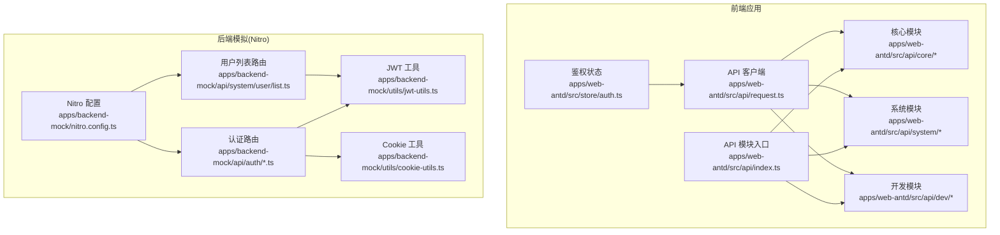
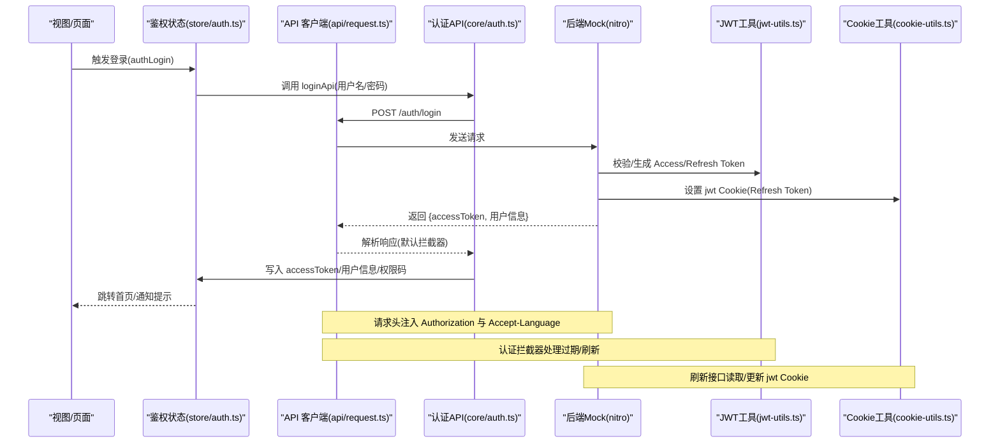
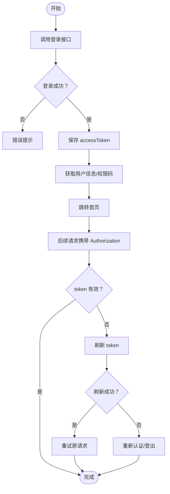
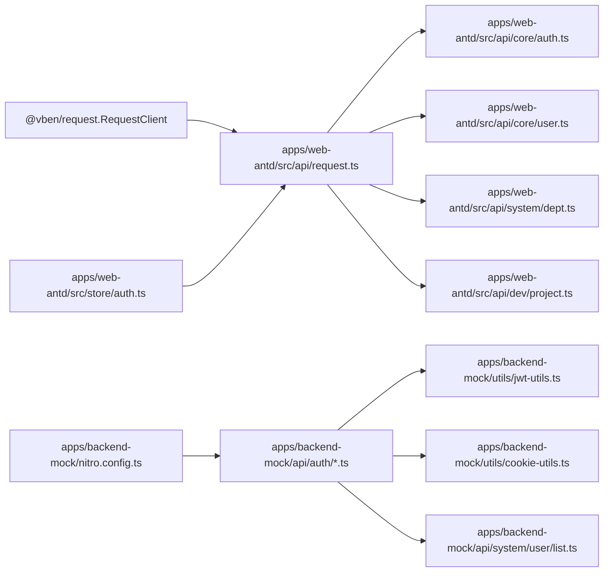

# API集成

<cite>
**本文引用的文件**
- [apps/web-antd/src/api/request.ts](file://apps/web-antd/src/api/request.ts)
- [apps/web-antd/src/api/index.ts](file://apps/web-antd/src/api/index.ts)
- [apps/web-antd/src/api/core/auth.ts](file://apps/web-antd/src/api/core/auth.ts)
- [apps/web-antd/src/api/core/user.ts](file://apps/web-antd/src/api/core/user.ts)
- [apps/web-antd/src/api/system/dept.ts](file://apps/web-antd/src/api/system/dept.ts)
- [apps/web-antd/src/api/dev/project.ts](file://apps/web-antd/src/api/dev/project.ts)
- [apps/web-antd/src/store/auth.ts](file://apps/web-antd/src/store/auth.ts)
- [apps/backend-mock/nitro.config.ts](file://apps/backend-mock/nitro.config.ts)
- [apps/backend-mock/api/auth/login.post.ts](file://apps/backend-mock/api/auth/login.post.ts)
- [apps/backend-mock/api/auth/logout.post.ts](file://apps/backend-mock/api/auth/logout.post.ts)
- [apps/backend-mock/api/auth/refresh.post.ts](file://apps/backend-mock/api/auth/refresh.post.ts)
- [apps/backend-mock/api/system/user/list.ts](file://apps/backend-mock/api/system/user/list.ts)
- [apps/backend-mock/utils/jwt-utils.ts](file://apps/backend-mock/utils/jwt-utils.ts)
- [apps/backend-mock/utils/cookie-utils.ts](file://apps/backend-mock/utils/cookie-utils.ts)
</cite>

## 目录
1. [简介](#简介)
2. [项目结构](#项目结构)
3. [核心组件](#核心组件)
4. [架构总览](#架构总览)
5. [详细组件分析](#详细组件分析)
6. [依赖关系分析](#依赖关系分析)
7. [性能考量](#性能考量)
8. [故障排查指南](#故障排查指南)
9. [结论](#结论)
10. [附录](#附录)

## 简介
本指南面向在 Vben Admin 中集成与使用后端 API 的开发者，系统讲解以下内容：
- HTTP 客户端的创建与配置（Axios 实例封装、请求/响应拦截器、认证令牌处理、错误处理与数据转换）。
- API 接口的模块化组织与命名规范。
- Mock 数据系统（Nitro 后端模拟）的使用与维护。
- 常见请求类型的调用示例（GET、POST、PUT、DELETE）。
- 错误处理与重试策略建议。
- API 版本管理与向后兼容性考虑。
- 实际集成示例与最佳实践。

## 项目结构
前端 API 层位于应用层目录中，采用“按功能域模块化”的组织方式；后端 Mock 服务基于 Nitro，通过路由规则暴露统一的 /api/** 接口，并提供 CORS 与 Cookie 支持。

图表来源
- [apps/web-antd/src/api/request.ts:1-124](file://apps/web-antd/src/api/request.ts#L1-L124)
- [apps/web-antd/src/api/index.ts:1-6](file://apps/web-antd/src/api/index.ts#L1-L6)
- [apps/web-antd/src/store/auth.ts:1-118](file://apps/web-antd/src/store/auth.ts#L1-L118)
- [apps/backend-mock/nitro.config.ts:1-21](file://apps/backend-mock/nitro.config.ts#L1-L21)
- [apps/backend-mock/api/auth/login.post.ts:1-43](file://apps/backend-mock/api/auth/login.post.ts#L1-L43)
- [apps/backend-mock/api/system/user/list.ts:1-120](file://apps/backend-mock/api/system/user/list.ts#L1-L120)
- [apps/backend-mock/utils/jwt-utils.ts:1-115](file://apps/backend-mock/utils/jwt-utils.ts#L1-L115)
- [apps/backend-mock/utils/cookie-utils.ts:1-29](file://apps/backend-mock/utils/cookie-utils.ts#L1-L29)

章节来源
- [apps/web-antd/src/api/request.ts:1-124](file://apps/web-antd/src/api/request.ts#L1-L124)
- [apps/web-antd/src/api/index.ts:1-6](file://apps/web-antd/src/api/index.ts#L1-L6)
- [apps/backend-mock/nitro.config.ts:1-21](file://apps/backend-mock/nitro.config.ts#L1-L21)

## 核心组件
- HTTP 客户端与拦截器
  - 基于 RequestClient 封装，统一设置 baseURL、响应体转换（支持 JSONBigInt）、请求头注入（Authorization、Accept-Language）。
  - 默认响应拦截器：约定 code/data 字段与成功码，自动提取 data。
  - 认证拦截器：处理 token 过期与刷新，支持弹窗或强制登出两种模式。
  - 错误拦截器：兜底错误提示，优先使用后端返回的 error/message 字段。
- API 模块化
  - 按领域划分：core（认证/用户）、system（系统管理）、dev（开发相关）、statistics（统计）等。
  - 每个模块以函数形式导出 API 方法，统一使用 requestClient/baseRequestClient 调用。
- Mock 后端
  - Nitro 配置开启 CORS 与 /api/** 路由规则，认证接口使用 Cookie 存储 refresh token 并签发 JWT。
  - 用户列表接口支持分页与过滤，鉴权中间件校验 Access Token。

章节来源
- [apps/web-antd/src/api/request.ts:26-124](file://apps/web-antd/src/api/request.ts#L26-L124)
- [apps/web-antd/src/api/core/auth.ts:1-52](file://apps/web-antd/src/api/core/auth.ts#L1-L52)
- [apps/web-antd/src/api/core/user.ts:1-11](file://apps/web-antd/src/api/core/user.ts#L1-L11)
- [apps/web-antd/src/api/system/dept.ts:1-53](file://apps/web-antd/src/api/system/dept.ts#L1-L53)
- [apps/web-antd/src/api/dev/project.ts:1-49](file://apps/web-antd/src/api/dev/project.ts#L1-L49)
- [apps/backend-mock/nitro.config.ts:7-20](file://apps/backend-mock/nitro.config.ts#L7-L20)
- [apps/backend-mock/api/auth/login.post.ts:1-43](file://apps/backend-mock/api/auth/login.post.ts#L1-L43)
- [apps/backend-mock/api/auth/logout.post.ts:1-18](file://apps/backend-mock/api/auth/logout.post.ts#L1-L18)
- [apps/backend-mock/api/auth/refresh.post.ts:1-36](file://apps/backend-mock/api/auth/refresh.post.ts#L1-L36)
- [apps/backend-mock/api/system/user/list.ts:85-120](file://apps/backend-mock/api/system/user/list.ts#L85-L120)
- [apps/backend-mock/utils/jwt-utils.ts:17-75](file://apps/backend-mock/utils/jwt-utils.ts#L17-L75)
- [apps/backend-mock/utils/cookie-utils.ts:13-28](file://apps/backend-mock/utils/cookie-utils.ts#L13-L28)

## 架构总览
下图展示从前端 API 调用到后端 Mock 的完整链路，以及鉴权流程中的 token 刷新与错误处理。

图表来源
- [apps/web-antd/src/store/auth.ts:28-78](file://apps/web-antd/src/store/auth.ts#L28-L78)
- [apps/web-antd/src/api/core/auth.ts:24-44](file://apps/web-antd/src/api/core/auth.ts#L24-L44)
- [apps/web-antd/src/api/request.ts:74-114](file://apps/web-antd/src/api/request.ts#L74-L114)
- [apps/backend-mock/api/auth/login.post.ts:33-41](file://apps/backend-mock/api/auth/login.post.ts#L33-L41)
- [apps/backend-mock/api/auth/refresh.post.ts:30-34](file://apps/backend-mock/api/auth/refresh.post.ts#L30-L34)
- [apps/backend-mock/utils/jwt-utils.ts:17-25](file://apps/backend-mock/utils/jwt-utils.ts#L17-L25)
- [apps/backend-mock/utils/cookie-utils.ts:13-23](file://apps/backend-mock/utils/cookie-utils.ts#L13-L23)

## 详细组件分析

### HTTP 客户端与拦截器
- 客户端创建
  - 通过 baseURL 与 transformResponse 统一处理 JSONBigInt，避免大整数精度丢失。
  - 使用 addRequestInterceptor 注入 Authorization 与 Accept-Language。
  - 使用 addResponseInterceptor 注入默认响应拦截器、认证拦截器与错误拦截器。
- 认证与刷新
  - 认证拦截器根据 enableRefreshToken 配置决定是否启用刷新；当检测到 token 失效时，触发 doRefreshToken 或 doReAuthenticate。
  - 刷新成功后写回 access token，失败则弹窗或强制登出。
- 错误处理
  - 优先从后端返回的 error/message 字段提示；若无则依据状态码兜底提示。

章节来源
- [apps/web-antd/src/api/request.ts:26-124](file://apps/web-antd/src/api/request.ts#L26-L124)

### API 模块化与命名规范
- 模块划分
  - core：认证、用户信息等基础能力。
  - system：系统管理类接口（如部门、菜单、字典、角色、用户）。
  - dev：开发相关接口（如项目、任务、故事、变更等）。
  - statistics：统计相关接口。
- 命名规范
  - API 方法统一使用动词+名词形式，如 getXXX、createXXX、updateXXX、deleteXXX。
  - 参数对象使用 XxxParams，返回值对象使用 XxxResult 或 XxxFace。
  - 所有模块通过 api/index.ts 汇总导出，便于集中引入。

章节来源
- [apps/web-antd/src/api/index.ts:1-6](file://apps/web-antd/src/api/index.ts#L1-L6)
- [apps/web-antd/src/api/core/auth.ts:1-52](file://apps/web-antd/src/api/core/auth.ts#L1-L52)
- [apps/web-antd/src/api/system/dept.ts:1-53](file://apps/web-antd/src/api/system/dept.ts#L1-L53)
- [apps/web-antd/src/api/dev/project.ts:1-49](file://apps/web-antd/src/api/dev/project.ts#L1-L49)

### 认证与鉴权流程
- 登录
  - 调用 loginApi，后端签发 accessToken 并设置 jwt Cookie（refresh token）。
  - 前端保存 accessToken，拉取用户信息与权限码，跳转首页。
- 刷新
  - 当认证拦截器检测到 token 失效，调用 refreshTokenApi，后端验证 jwt Cookie 并返回新 accessToken。
- 退出
  - 调用 logoutApi 清除 jwt Cookie，重置状态并跳转登录页。

图表来源
- [apps/web-antd/src/api/core/auth.ts:24-44](file://apps/web-antd/src/api/core/auth.ts#L24-L44)
- [apps/web-antd/src/store/auth.ts:28-78](file://apps/web-antd/src/store/auth.ts#L28-L78)
- [apps/web-antd/src/api/request.ts:94-102](file://apps/web-antd/src/api/request.ts#L94-L102)
- [apps/backend-mock/api/auth/login.post.ts:33-41](file://apps/backend-mock/api/auth/login.post.ts#L33-L41)
- [apps/backend-mock/api/auth/refresh.post.ts:30-34](file://apps/backend-mock/api/auth/refresh.post.ts#L30-L34)

章节来源
- [apps/web-antd/src/api/core/auth.ts:1-52](file://apps/web-antd/src/api/core/auth.ts#L1-L52)
- [apps/web-antd/src/store/auth.ts:1-118](file://apps/web-antd/src/store/auth.ts#L1-L118)
- [apps/web-antd/src/api/request.ts:43-67](file://apps/web-antd/src/api/request.ts#L43-L67)

### Mock 数据系统
- Nitro 配置
  - 开启 /api/** CORS，允许跨域与凭证传输。
  - 配置常用请求头与方法白名单，便于本地联调。
- 认证与用户
  - 登录：校验用户名/密码，签发 Access/Refresh Token，设置 httpOnly Cookie。
  - 刷新：读取 jwt Cookie，验证后签发新 Access Token 并更新 Cookie。
  - 用户列表：鉴权中间件校验 Access Token，支持分页与多条件过滤。
- 工具函数
  - JWT 工具：生成/校验 Access/Refresh Token，版本比较工具。
  - Cookie 工具：设置/读取/清理 jwt Cookie。

章节来源
- [apps/backend-mock/nitro.config.ts:7-20](file://apps/backend-mock/nitro.config.ts#L7-L20)
- [apps/backend-mock/api/auth/login.post.ts:1-43](file://apps/backend-mock/api/auth/login.post.ts#L1-L43)
- [apps/backend-mock/api/auth/logout.post.ts:1-18](file://apps/backend-mock/api/auth/logout.post.ts#L1-L18)
- [apps/backend-mock/api/auth/refresh.post.ts:1-36](file://apps/backend-mock/api/auth/refresh.post.ts#L1-L36)
- [apps/backend-mock/api/system/user/list.ts:85-120](file://apps/backend-mock/api/system/user/list.ts#L85-L120)
- [apps/backend-mock/utils/jwt-utils.ts:17-75](file://apps/backend-mock/utils/jwt-utils.ts#L17-L75)
- [apps/backend-mock/utils/cookie-utils.ts:13-28](file://apps/backend-mock/utils/cookie-utils.ts#L13-L28)

### API 调用示例（GET/POST/PUT/DELETE）
- GET：获取用户信息
  - 调用路径：getUserInfoApi -> /user/info
  - 参考：[apps/web-antd/src/api/core/user.ts:8-10](file://apps/web-antd/src/api/core/user.ts#L8-L10)
- POST：创建部门
  - 调用路径：createDept -> /system/dept
  - 参考：[apps/web-antd/src/api/system/dept.ts:27-31](file://apps/web-antd/src/api/system/dept.ts#L27-L31)
- PUT：更新部门
  - 调用路径：updateDept -> /system/dept/{id}
  - 参考：[apps/web-antd/src/api/system/dept.ts:39-44](file://apps/web-antd/src/api/system/dept.ts#L39-L44)
- DELETE：删除部门
  - 调用路径：deleteDept -> /system/dept/{id}
  - 参考：[apps/web-antd/src/api/system/dept.ts:50-52](file://apps/web-antd/src/api/system/dept.ts#L50-L52)
- POST：创建项目（开发模块）
  - 调用路径：createProject -> /dev/project
  - 参考：[apps/web-antd/src/api/dev/project.ts:29-34](file://apps/web-antd/src/api/dev/project.ts#L29-L34)

章节来源
- [apps/web-antd/src/api/core/user.ts:1-11](file://apps/web-antd/src/api/core/user.ts#L1-L11)
- [apps/web-antd/src/api/system/dept.ts:1-53](file://apps/web-antd/src/api/system/dept.ts#L1-L53)
- [apps/web-antd/src/api/dev/project.ts:1-49](file://apps/web-antd/src/api/dev/project.ts#L1-L49)

## 依赖关系分析
- 前端
  - API 客户端依赖 @vben/request 提供的 RequestClient 与拦截器工厂。
  - 鉴权状态依赖 Pinia store 与路由守卫，配合 API 客户端完成认证闭环。
- 后端
  - Nitro 路由规则统一暴露 /api/**，认证接口依赖 jwt-utils 与 cookie-utils。
  - 用户列表接口依赖 jwt-utils 的访问令牌校验。

图表来源
- [apps/web-antd/src/api/request.ts:1-18](file://apps/web-antd/src/api/request.ts#L1-L18)
- [apps/web-antd/src/api/core/auth.ts:1-52](file://apps/web-antd/src/api/core/auth.ts#L1-L52)
- [apps/web-antd/src/api/core/user.ts:1-11](file://apps/web-antd/src/api/core/user.ts#L1-L11)
- [apps/web-antd/src/api/system/dept.ts:1-53](file://apps/web-antd/src/api/system/dept.ts#L1-L53)
- [apps/web-antd/src/api/dev/project.ts:1-49](file://apps/web-antd/src/api/dev/project.ts#L1-L49)
- [apps/web-antd/src/store/auth.ts:1-118](file://apps/web-antd/src/store/auth.ts#L1-L118)
- [apps/backend-mock/nitro.config.ts:1-21](file://apps/backend-mock/nitro.config.ts#L1-L21)
- [apps/backend-mock/api/auth/login.post.ts:1-43](file://apps/backend-mock/api/auth/login.post.ts#L1-L43)
- [apps/backend-mock/utils/jwt-utils.ts:1-115](file://apps/backend-mock/utils/jwt-utils.ts#L1-L115)
- [apps/backend-mock/utils/cookie-utils.ts:1-29](file://apps/backend-mock/utils/cookie-utils.ts#L1-L29)
- [apps/backend-mock/api/system/user/list.ts:1-120](file://apps/backend-mock/api/system/user/list.ts#L1-L120)

章节来源
- [apps/web-antd/src/api/request.ts:1-18](file://apps/web-antd/src/api/request.ts#L1-L18)
- [apps/backend-mock/nitro.config.ts:1-21](file://apps/backend-mock/nitro.config.ts#L1-L21)

## 性能考量
- 大整数处理：客户端已启用 JSONBigInt，避免后端返回的大整数在前端丢失精度。
- 请求头最小化：仅注入必要头（Authorization、Accept-Language），减少不必要的头部开销。
- 并发优化：登录流程并发获取用户信息与权限码，缩短首屏等待时间。
- Mock 性能：用户列表接口支持分页与过滤，避免一次性返回全量数据。

章节来源
- [apps/web-antd/src/api/request.ts:30-37](file://apps/web-antd/src/api/request.ts#L30-L37)
- [apps/web-antd/src/store/auth.ts:43-46](file://apps/web-antd/src/store/auth.ts#L43-L46)

## 故障排查指南
- 登录失败
  - 检查用户名/密码是否为空，确认后端返回的错误字段是否包含 error/message。
  - 查看浏览器 Cookie 是否正确设置 jwt。
  - 参考：[apps/backend-mock/api/auth/login.post.ts:14-22](file://apps/backend-mock/api/auth/login.post.ts#L14-L22)
- token 过期
  - 若出现 401，检查认证拦截器是否触发刷新；确认 enableRefreshToken 配置与 doRefreshToken 流程。
  - 参考：[apps/web-antd/src/api/request.ts:94-102](file://apps/web-antd/src/api/request.ts#L94-L102)
- 刷新失败
  - 检查 jwt Cookie 是否存在且未过期；核对 verifyRefreshToken 与 mockUserData 匹配。
  - 参考：[apps/backend-mock/api/auth/refresh.post.ts:11-22](file://apps/backend-mock/api/auth/refresh.post.ts#L11-L22)
- CORS 问题
  - 确认 nitro.config.ts 中 /api/** 的 CORS 与请求头配置是否正确。
  - 参考：[apps/backend-mock/nitro.config.ts:7-20](file://apps/backend-mock/nitro.config.ts#L7-L20)
- 错误提示不准确
  - 确认后端返回的 error/message 字段是否存在；若无则依据状态码兜底。
  - 参考：[apps/web-antd/src/api/request.ts:105-114](file://apps/web-antd/src/api/request.ts#L105-L114)

章节来源
- [apps/backend-mock/api/auth/login.post.ts:14-22](file://apps/backend-mock/api/auth/login.post.ts#L14-L22)
- [apps/web-antd/src/api/request.ts:94-114](file://apps/web-antd/src/api/request.ts#L94-L114)
- [apps/backend-mock/api/auth/refresh.post.ts:11-22](file://apps/backend-mock/api/auth/refresh.post.ts#L11-L22)
- [apps/backend-mock/nitro.config.ts:7-20](file://apps/backend-mock/nitro.config.ts#L7-L20)

## 结论
本指南提供了 Vben Admin 中 API 集成的完整路径：从前端 HTTP 客户端配置、拦截器策略，到 API 模块化组织、Mock 后端使用，再到常见请求类型与错误处理的最佳实践。遵循本文档，可快速搭建稳定可靠的前后端交互体系，并为后续扩展与演进打下坚实基础。

## 附录
- API 版本管理与向后兼容
  - 建议在 baseURL 上体现版本号（如 /api/v1），并在 nitro.config.ts 中统一路由前缀。
  - 对于破坏性变更，保留旧接口一段时间并标注废弃，同时提供迁移指引。
  - 参考：[apps/backend-mock/nitro.config.ts:7-19](file://apps/backend-mock/nitro.config.ts#L7-L19)
- 重试机制建议
  - 对幂等请求（GET/PUT/DELETE）可在认证拦截器中增加有限次数的自动重试。
  - 对非幂等请求（POST）谨慎重试，建议通过业务层确认是否需要重试。
  - 参考：[apps/web-antd/src/api/request.ts:94-102](file://apps/web-antd/src/api/request.ts#L94-L102)