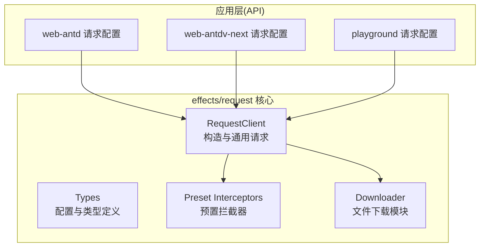
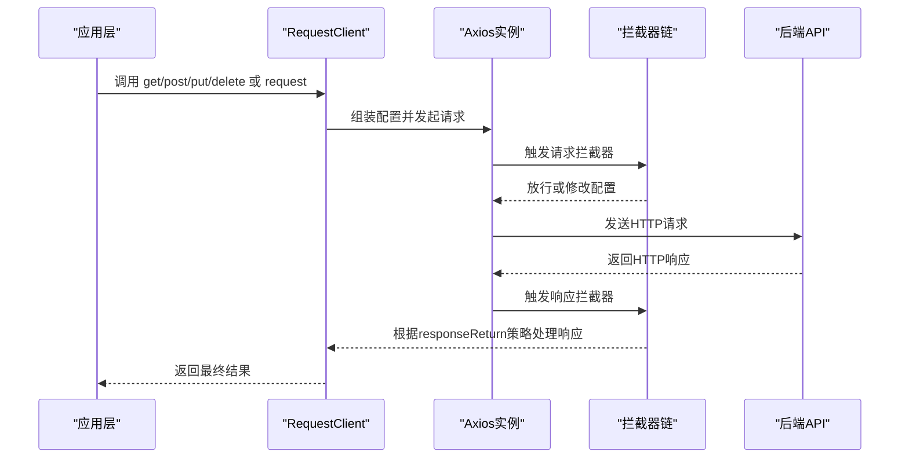
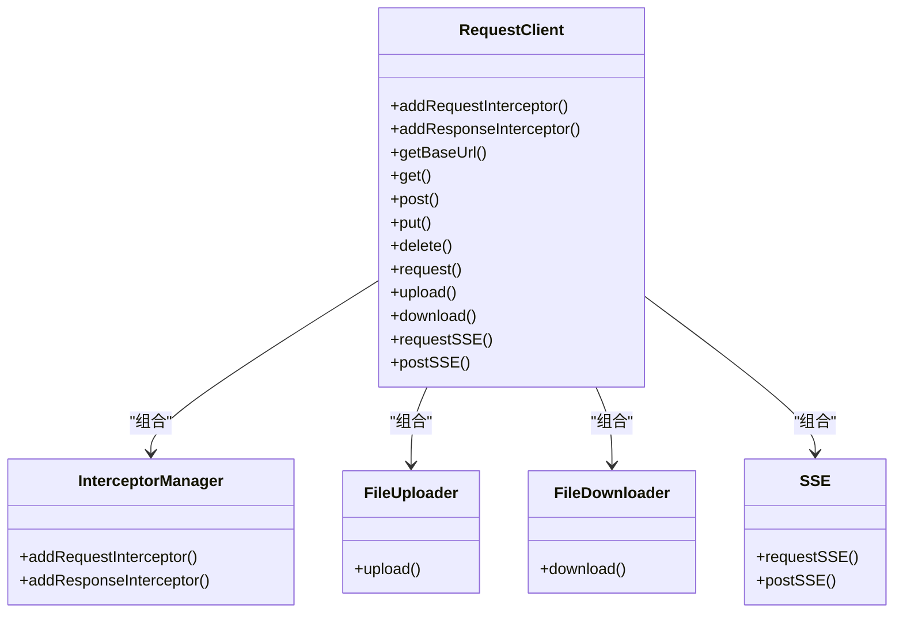
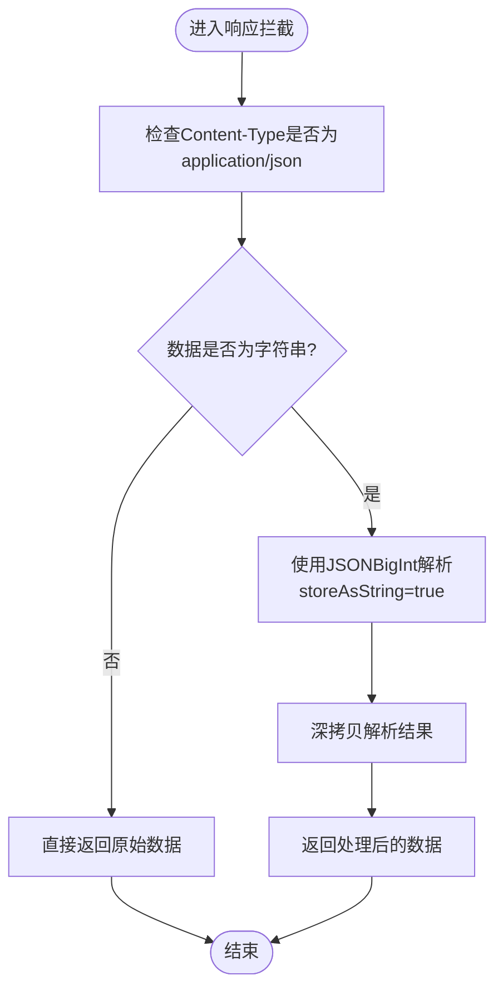
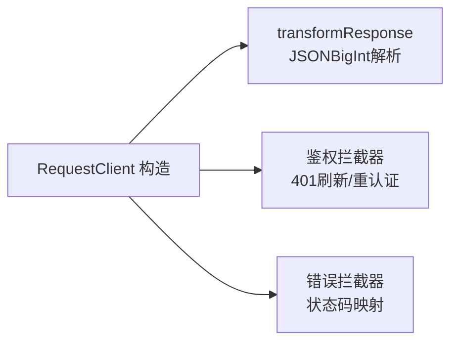
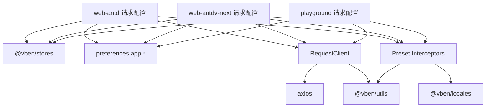

# HTTP客户端配置

<cite>
**本文引用的文件**
- [request-client.ts](file://packages/effects/request/src/request-client/request-client.ts)
- [types.ts](file://packages/effects/request/src/request-client/types.ts)
- [preset-interceptors.ts](file://packages/effects/request/src/request-client/preset-interceptors.ts)
- [index.ts](file://packages/effects/request/src/index.ts)
- [web-antd 请求配置](file://apps/web-antd/src/api/request.ts)
- [web-antdv-next 请求配置](file://apps/web-antdv-next/src/api/request.ts)
- [playground 请求配置](file://playground/src/api/request.ts)
- [playground JSON BigInt 示例](file://playground/src/api/examples/json-bigint.ts)
- [playground JSON BigInt 视图](file://playground/src/views/demos/features/json-bigint/index.vue)
- [下载器模块](file://packages/effects/request/src/request-client/modules/downloader.ts)
- [后端Mock响应工具](file://apps/backend-mock/utils/response.ts)
</cite>

## 目录

1. [简介](#简介)
2. [项目结构](#项目结构)
3. [核心组件](#核心组件)
4. [架构总览](#架构总览)
5. [详细组件分析](#详细组件分析)
6. [依赖关系分析](#依赖关系分析)
7. [性能考量](#性能考量)
8. [故障排查指南](#故障排查指南)
9. [结论](#结论)
10. [附录](#附录)

## 简介

本文件系统性阐述HTTP客户端配置，重点围绕RequestClient类的创建与配置流程，涵盖baseURL设置、超时配置、请求头设置、transformResponse函数的职责与实现细节（尤其是JSONBigInt对大整数的处理）、客户端实例的创建方式（requestClient与baseRequestClient的区别与适用场景）、以及responseReturn配置项的作用与影响。文末提供实际配置示例与最佳实践建议。

## 项目结构

本仓库在多个应用框架（Ant Design、Element Plus、Naive UI、TDesign等）下提供了统一的HTTP客户端封装，核心位于effects包的request模块；各前端应用通过各自API层的请求配置文件创建具体客户端实例，并注入拦截器与业务逻辑。

图表来源

- [request-client.ts:39-94](file://packages/effects/request/src/request-client/request-client.ts#L39-L94)
- [types.ts:1-91](file://packages/effects/request/src/request-client/types.ts#L1-L91)
- [preset-interceptors.ts:1-166](file://packages/effects/request/src/request-client/preset-interceptors.ts#L1-L166)
- [downloader.ts:1-60](file://packages/effects/request/src/request-client/modules/downloader.ts#L1-L60)
- [web-antd 请求配置:26-124](file://apps/web-antd/src/api/request.ts#L26-L124)
- [web-antdv-next 请求配置:24-114](file://apps/web-antdv-next/src/api/request.ts#L24-L114)
- [playground 请求配置:26-134](file://playground/src/api/request.ts#L26-L134)

章节来源

- [request-client.ts:39-94](file://packages/effects/request/src/request-client/request-client.ts#L39-L94)
- [types.ts:1-91](file://packages/effects/request/src/request-client/types.ts#L1-L91)
- [preset-interceptors.ts:1-166](file://packages/effects/request/src/request-client/preset-interceptors.ts#L1-L166)
- [downloader.ts:1-60](file://packages/effects/request/src/request-client/modules/downloader.ts#L1-L60)
- [web-antd 请求配置:26-124](file://apps/web-antd/src/api/request.ts#L26-L124)
- [web-antdv-next 请求配置:24-114](file://apps/web-antdv-next/src/api/request.ts#L24-L114)
- [playground 请求配置:26-134](file://playground/src/api/request.ts#L26-L134)

## 核心组件

- RequestClient类：基于Axios封装的HTTP客户端，负责创建Axios实例、注册拦截器、提供通用请求方法（get/post/put/delete）、以及扩展能力（上传、下载、SSE）。
- 类型系统：RequestClientOptions、RequestClientConfig、HttpResponse等，定义配置项与响应结构。
- 预置拦截器：defaultResponseInterceptor、authenticateResponseInterceptor、errorMessageResponseInterceptor，分别处理响应解构、鉴权刷新、错误消息映射。
- 下载器模块：FileDownloader，提供文件下载能力，默认返回Blob并支持自定义responseReturn策略。

章节来源

- [request-client.ts:39-165](file://packages/effects/request/src/request-client/request-client.ts#L39-L165)
- [types.ts:1-91](file://packages/effects/request/src/request-client/types.ts#L1-L91)
- [preset-interceptors.ts:9-166](file://packages/effects/request/src/request-client/preset-interceptors.ts#L9-L166)
- [downloader.ts:1-60](file://packages/effects/request/src/request-client/modules/downloader.ts#L1-L60)

## 架构总览

RequestClient在构造时合并默认配置与用户配置，创建Axios实例，并绑定拦截器管理器、上传/下载/SSE模块。请求通过instance发送，响应经由拦截器链处理，最终按responseReturn策略返回给调用方。

图表来源

- [request-client.ts:58-94](file://packages/effects/request/src/request-client/request-client.ts#L58-L94)
- [request-client.ts:145-161](file://packages/effects/request/src/request-client/request-client.ts#L145-L161)
- [preset-interceptors.ts:20-45](file://packages/effects/request/src/request-client/preset-interceptors.ts#L20-L45)

## 详细组件分析

### RequestClient类与配置流程

- 构造参数与默认配置
  - 默认Content-Type为application/json;charset=utf-8
  - 默认responseReturn为'raw'
  - 默认超时时间为10秒
  - paramsSerializer支持多种数组序列化策略
- baseURL设置
  - 通过RequestClientOptions传入baseURL，作为所有相对路径请求的基础
  - 可通过getBaseUrl()获取当前实例的baseURL
- 超时配置
  - 通过timeout控制请求超时时间
- 请求头设置
  - 在请求拦截器中动态注入Authorization与语言等头部
- 通用请求方法
  - request方法统一处理URL、方法、参数序列化等
  - delete/get/post/put方法是对request的便捷封装

图表来源

- [request-client.ts:39-94](file://packages/effects/request/src/request-client/request-client.ts#L39-L94)

章节来源

- [request-client.ts:58-94](file://packages/effects/request/src/request-client/request-client.ts#L58-L94)
- [request-client.ts:115-161](file://packages/effects/request/src/request-client/request-client.ts#L115-L161)
- [types.ts:15-30](file://packages/effects/request/src/request-client/types.ts#L15-L30)

### transformResponse函数：JSONBigInt大整数处理

- 作用
  - 在响应拦截阶段对JSON字符串进行解析，将可能超出安全整数范围的大整数转换为字符串，避免精度丢失
  - 仅对Content-Type为application/json且数据为字符串时生效
- 实现要点
  - 使用JSONBigInt解析响应体，storeAsString选项确保大整数以字符串形式保留
  - 对响应数据进行深拷贝，避免副作用
- 应用位置
  - playground与多套UI框架的请求配置中均实现了transformResponse，确保跨框架一致性

图表来源

- [playground 请求配置:30-42](file://playground/src/api/request.ts#L30-L42)
- [web-antd 请求配置:30-38](file://apps/web-antd/src/api/request.ts#L30-L38)
- [web-antdv-next 请求配置:24-29](file://apps/web-antdv-next/src/api/request.ts#L24-L29)

章节来源

- [playground 请求配置:30-42](file://playground/src/api/request.ts#L30-L42)
- [web-antd 请求配置:30-38](file://apps/web-antd/src/api/request.ts#L30-L38)
- [web-antdv-next 请求配置:24-29](file://apps/web-antdv-next/src/api/request.ts#L24-L29)

### 客户端实例：requestClient与baseRequestClient

- requestClient
  - 通过createRequestClient工厂函数创建，内置transformResponse、鉴权拦截器、错误处理拦截器
  - 默认responseReturn为'data'，适合大多数业务场景，直接返回业务数据
- baseRequestClient
  - 直接new RequestClient({ baseURL })，不包含预置拦截器
  - 适用于需要最小化封装、完全自定义拦截器与响应处理的场景
- 使用建议
  - 大多数页面/模块使用requestClient，减少重复配置
  - 特殊场景（如自定义协议、特殊鉴权流程）使用baseRequestClient

图表来源

- [playground 请求配置:119-134](file://playground/src/api/request.ts#L119-L134)
- [web-antd 请求配置:119-124](file://apps/web-antd/src/api/request.ts#L119-L124)
- [web-antdv-next 请求配置:109-114](file://apps/web-antdv-next/src/api/request.ts#L109-L114)

章节来源

- [playground 请求配置:119-134](file://playground/src/api/request.ts#L119-L134)
- [web-antd 请求配置:119-124](file://apps/web-antd/src/api/request.ts#L119-L124)
- [web-antdv-next 请求配置:109-114](file://apps/web-antdv-next/src/api/request.ts#L109-L114)

### responseReturn配置项：行为与影响

- 取值与含义
  - 'raw'：返回完整的AxiosResponse对象（包含headers、status等），不做业务成功校验
  - 'body'：返回响应数据的body部分（通常为对象），仅校验HTTP状态码
  - 'data'：解构响应对象，返回data字段（会校验业务code与HTTP状态码）
- 影响
  - 'raw'：便于上层自行处理响应与错误
  - 'body'：简化调用侧逻辑，但需自行判断业务成功
  - 'data'：最贴近业务的默认选择，统一错误处理与成功数据提取

章节来源

- [types.ts:23-29](file://packages/effects/request/src/request-client/types.ts#L23-L29)
- [preset-interceptors.ts:20-45](file://packages/effects/request/src/request-client/preset-interceptors.ts#L20-L45)

### 预置拦截器详解

- defaultResponseInterceptor
  - 根据responseReturn与业务code/data字段规则，自动解构响应
  - 支持传入codeField/dataField/successCode自定义业务约定
- authenticateResponseInterceptor
  - 处理401未授权：支持刷新令牌、队列等待、重试请求
  - 支持禁用刷新、格式化Token、重认证回调
- errorMessageResponseInterceptor
  - 将网络错误、超时、HTTP状态码映射为本地化错误消息
  - 支持自定义错误消息生成函数

章节来源

- [preset-interceptors.ts:9-166](file://packages/effects/request/src/request-client/preset-interceptors.ts#L9-L166)

### 下载器模块：文件下载

- 默认responseReturn为'body'，返回Blob
- 自动设置responseType为'blob'
- 支持通过finalConfig覆盖默认策略

章节来源

- [downloader.ts:25-43](file://packages/effects/request/src/request-client/modules/downloader.ts#L25-L43)

## 依赖关系分析

- RequestClient依赖Axios与内部模块（拦截器、上传、下载、SSE）
- 应用层通过各自的API配置文件创建客户端实例，注入拦截器与业务逻辑
- 预置拦截器依赖国际化与工具库，保证错误消息与工具函数可用

图表来源

- [request-client.ts:1-14](file://packages/effects/request/src/request-client/request-client.ts#L1-L14)
- [preset-interceptors.ts:1-8](file://packages/effects/request/src/request-client/preset-interceptors.ts#L1-L8)
- [web-antd 请求配置:1-22](file://apps/web-antd/src/api/request.ts#L1-L22)
- [web-antdv-next 请求配置:1-20](file://apps/web-antdv-next/src/api/request.ts#L1-L20)
- [playground 请求配置:1-22](file://playground/src/api/request.ts#L1-L22)

章节来源

- [index.ts:1-3](file://packages/effects/request/src/index.ts#L1-L3)
- [request-client.ts:1-14](file://packages/effects/request/src/request-client/request-client.ts#L1-L14)
- [preset-interceptors.ts:1-8](file://packages/effects/request/src/request-client/preset-interceptors.ts#L1-L8)
- [web-antd 请求配置:1-22](file://apps/web-antd/src/api/request.ts#L1-L22)
- [web-antdv-next 请求配置:1-20](file://apps/web-antdv-next/src/api/request.ts#L1-L20)
- [playground 请求配置:1-22](file://playground/src/api/request.ts#L1-L22)

## 性能考量

- 请求超时：合理设置timeout，避免长时间阻塞
- 参数序列化：根据后端要求选择合适的paramsSerializer，减少不必要的数据传输
- 响应处理：优先使用'data'模式，减少上层重复处理
- 大整数解析：transformResponse仅在JSON字符串场景生效，避免对非JSON内容造成额外开销

## 故障排查指南

- 网络错误与超时
  - 检查errorMessageResponseInterceptor映射，确认本地化文案与网络环境
  - 调整timeout与重试策略
- 401未授权
  - 检查authenticateResponseInterceptor是否正确配置刷新逻辑与重认证回调
  - 确认Token格式化与队列处理
- 响应数据结构不一致
  - 使用defaultResponseInterceptor的自定义参数（codeField/dataField/successCode）
  - 必要时切换responseReturn至'raw'或'body'进行调试
- JSON大整数精度问题
  - 确认transformResponse已启用且storeAsString为true
  - 检查Content-Type是否为application/json

章节来源

- [preset-interceptors.ts:112-166](file://packages/effects/request/src/request-client/preset-interceptors.ts#L112-L166)
- [request-client.ts:145-161](file://packages/effects/request/src/request-client/request-client.ts#L145-L161)
- [playground 请求配置:30-42](file://playground/src/api/request.ts#L30-L42)

## 结论

RequestClient提供了标准化、可扩展的HTTP客户端能力。通过合理的baseURL、超时、请求头配置与预置拦截器组合，能够满足大多数业务需求。transformResponse的JSONBigInt处理确保了大整数的安全解析；responseReturn的选择直接影响调用侧的复杂度与一致性。推荐优先使用requestClient，必要时以baseRequestClient进行深度定制。

## 附录

### 实际配置示例与最佳实践

- 基础配置（含baseURL、超时、请求头）
  - 参考路径：[playground 请求配置:26-86](file://playground/src/api/request.ts#L26-L86)
  - 参考路径：[web-antd 请求配置:26-82](file://apps/web-antd/src/api/request.ts#L26-L82)
  - 参考路径：[web-antdv-next 请求配置:24-72](file://apps/web-antdv-next/src/api/request.ts#L24-L72)
- transformResponse（JSONBigInt）
  - 参考路径：[playground 请求配置:30-42](file://playground/src/api/request.ts#L30-L42)
  - 参考路径：[web-antd 请求配置:30-38](file://apps/web-antd/src/api/request.ts#L30-L38)
  - 参考路径：[web-antdv-next 请求配置:24-29](file://apps/web-antdv-next/src/api/request.ts#L24-L29)
- 客户端实例创建
  - 参考路径：[playground 请求配置:119-134](file://playground/src/api/request.ts#L119-L134)
  - 参考路径：[web-antd 请求配置:119-124](file://apps/web-antd/src/api/request.ts#L119-L124)
  - 参考路径：[web-antdv-next 请求配置:109-114](file://apps/web-antdv-next/src/api/request.ts#L109-L114)
- 响应处理与错误映射
  - 参考路径：[preset-interceptors.ts:9-166](file://packages/effects/request/src/request-client/preset-interceptors.ts#L9-L166)
- JSON BigInt演示页面
  - 参考路径：[playground JSON BigInt 视图:1-40](file://playground/src/views/demos/features/json-bigint/index.vue#L1-L40)
  - 参考路径：[playground JSON BigInt 示例:1-11](file://playground/src/api/examples/json-bigint.ts#L1-L11)
- 后端Mock响应约定
  - 参考路径：[后端Mock响应工具:1-70](file://apps/backend-mock/utils/response.ts#L1-L70)
