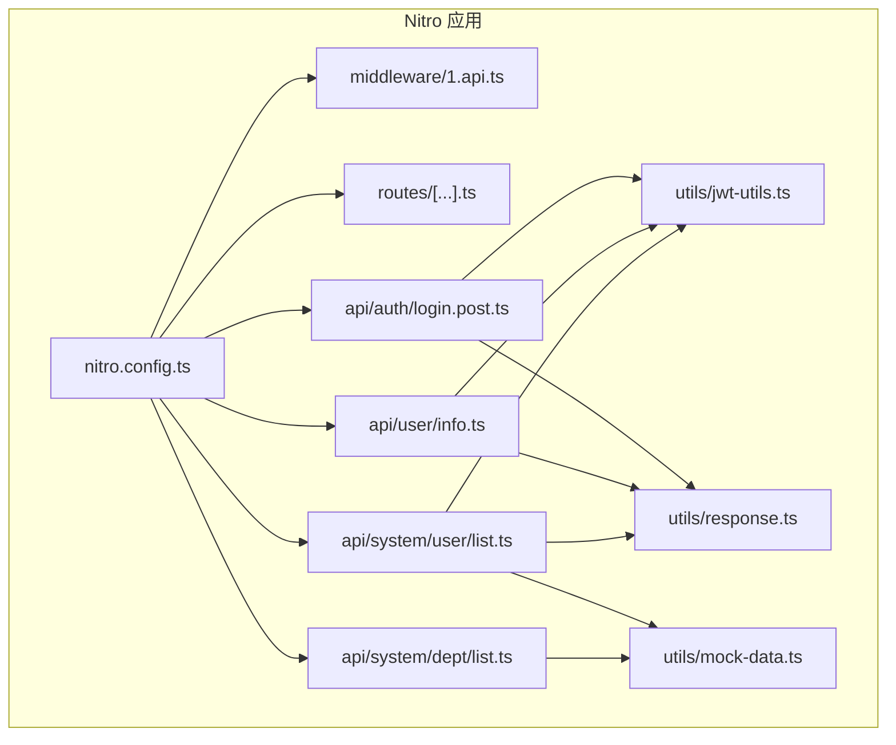
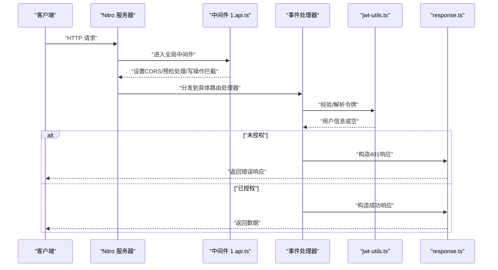
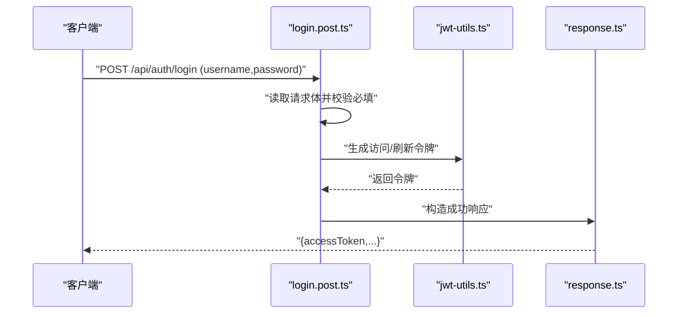
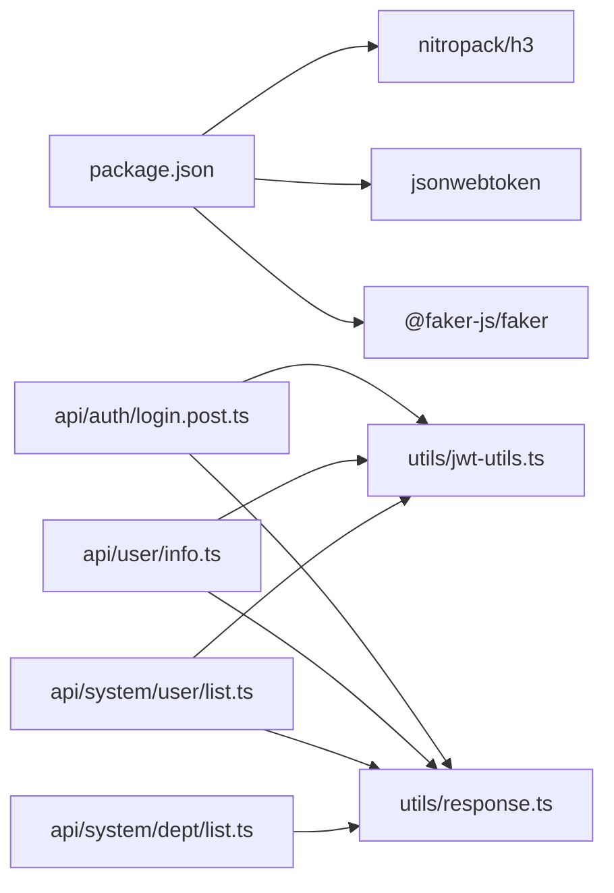

# Mock数据系统

<cite>
**本文引用的文件**
- [nitro.config.ts](file://apps/backend-mock/nitro.config.ts)
- [package.json](file://apps/backend-mock/package.json)
- [1.api.ts](file://apps/backend-mock/middleware/1.api.ts)
- [[...].ts](file://apps/backend-mock/routes/[...].ts)
- [error.ts](file://apps/backend-mock/error.ts)
- [response.ts](file://apps/backend-mock/utils/response.ts)
- [jwt-utils.ts](file://apps/backend-mock/utils/jwt-utils.ts)
- [mock-data.ts](file://apps/backend-mock/utils/mock-data.ts)
- [login.post.ts](file://apps/backend-mock/api/auth/login.post.ts)
- [info.ts](file://apps/backend-mock/api/user/info.ts)
- [status.ts](file://apps/backend-mock/api/status.ts)
- [list.ts（用户）](file://apps/backend-mock/api/system/user/list.ts)
- [list.ts（部门）](file://apps/backend-mock/api/system/dept/list.ts)
- [test.get.ts](file://apps/backend-mock/api/test.get.ts)
- [test.post.ts](file://apps/backend-mock/api/test.post.ts)
</cite>

## 目录
1. [简介](#简介)
2. [项目结构](#项目结构)
3. [核心组件](#核心组件)
4. [架构总览](#架构总览)
5. [详细组件分析](#详细组件分析)
6. [依赖关系分析](#依赖关系分析)
7. [性能考量](#性能考量)
8. [故障排查指南](#故障排查指南)
9. [结论](#结论)
10. [附录](#附录)

## 简介
本文件系统性阐述基于 Nitro 的后端 Mock 数据服务，涵盖配置与启动、静态与动态数据策略、API 端点模拟（GET/POST/PUT/DELETE）、测试与验证方法、配置示例与调试技巧，以及与真实 API 的切换机制。该系统通过 h3 事件处理器组织路由，结合 JSON Web Token 进行鉴权校验，使用 @faker-js/faker 生成动态数据，并通过统一响应包装与分页工具提升一致性。

## 项目结构
Mock 服务位于 apps/backend-mock，采用 Nitro Pack 打包运行，核心目录与职责如下：
- nitro.config.ts：Nitro 构建与开发服务器配置，含 CORS、错误处理与路由规则。
- middleware/：全局中间件，如跨域与演示环境写操作拦截。
- routes/：通配路由，用于首页引导与健康检查。
- api/：业务路由模块，按功能域划分（auth、system、dev、statistics 等），以文件命名映射 HTTP 方法与路径。
- utils/：通用工具，包括响应封装、JWT 工具、时区数据、分页与睡眠等。
- package.json：脚本与依赖，包含 nitro、h3、jsonwebtoken、@faker-js/faker。

图表来源
- [nitro.config.ts:1-21](file://apps/backend-mock/nitro.config.ts#L1-L21)
- [1.api.ts:1-31](file://apps/backend-mock/middleware/1.api.ts#L1-L31)
- [[...].ts:1-16](file://apps/backend-mock/routes/[...].ts#L1-L16)
- [login.post.ts:1-43](file://apps/backend-mock/api/auth/login.post.ts#L1-L43)
- [info.ts:1-12](file://apps/backend-mock/api/user/info.ts#L1-L12)
- [list.ts（用户）:1-120](file://apps/backend-mock/api/system/user/list.ts#L1-L120)
- [list.ts（部门）:1-62](file://apps/backend-mock/api/system/dept/list.ts#L1-L62)
- [response.ts:1-71](file://apps/backend-mock/utils/response.ts#L1-L71)
- [jwt-utils.ts:1-115](file://apps/backend-mock/utils/jwt-utils.ts#L1-L115)
- [mock-data.ts:1-31](file://apps/backend-mock/utils/mock-data.ts#L1-L31)

章节来源
- [nitro.config.ts:1-21](file://apps/backend-mock/nitro.config.ts#L1-L21)
- [package.json:1-22](file://apps/backend-mock/package.json#L1-L22)

## 核心组件
- Nitro 配置与路由规则：启用 CORS、设置允许的方法与头，开发/生产错误处理。
- 中间件：统一设置 Access-Control-Allow-Origin；对 OPTIONS 预检直接返回；拦截演示环境特定前缀的写操作并注入延迟。
- 统一响应工具：成功/失败/分页/鉴权异常/无权限/睡眠/分页算法。
- JWT 工具：生成访问/刷新令牌、校验访问/刷新令牌、从请求头解析 Bearer Token 并匹配本地用户。
- Mock 数据：用户、部门等静态/动态数据集合，配合分页与查询条件过滤。
- API 路由：登录认证、用户信息、状态码测试、系统用户列表、系统部门列表等。

章节来源
- [1.api.ts:1-31](file://apps/backend-mock/middleware/1.api.ts#L1-L31)
- [response.ts:1-71](file://apps/backend-mock/utils/response.ts#L1-L71)
- [jwt-utils.ts:1-115](file://apps/backend-mock/utils/jwt-utils.ts#L1-L115)
- [mock-data.ts:1-31](file://apps/backend-mock/utils/mock-data.ts#L1-L31)
- [login.post.ts:1-43](file://apps/backend-mock/api/auth/login.post.ts#L1-L43)
- [info.ts:1-12](file://apps/backend-mock/api/user/info.ts#L1-L12)
- [list.ts（用户）:1-120](file://apps/backend-mock/api/system/user/list.ts#L1-L120)
- [list.ts（部门）:1-62](file://apps/backend-mock/api/system/dept/list.ts#L1-L62)

## 架构总览
下图展示从客户端到 Nitro 事件处理器的整体调用链，包括中间件、鉴权与响应封装。

图表来源
- [1.api.ts:14-30](file://apps/backend-mock/middleware/1.api.ts#L14-L30)
- [info.ts:5-11](file://apps/backend-mock/api/user/info.ts#L5-L11)
- [jwt-utils.ts:27-56](file://apps/backend-mock/utils/jwt-utils.ts#L27-L56)
- [response.ts:5-55](file://apps/backend-mock/utils/response.ts#L5-L55)

## 详细组件分析

### 配置与启动（nitro.config.ts）
- 开发错误处理器与生产错误页面指向应用内错误处理模块。
- 路由规则对 /api/** 开启 CORS，允许常用头与方法，便于前端跨域访问。
- 设置兼容性时间戳环境变量，供运行期使用。

章节来源
- [nitro.config.ts:1-21](file://apps/backend-mock/nitro.config.ts#L1-L21)

### 中间件（middleware/1.api.ts）
- 设置 Access-Control-Allow-Origin，支持动态 Origin 或默认通配。
- OPTIONS 预检请求直接返回 204。
- 对演示环境特定前缀的写操作（DELETE/PATCH/POST/PUT）进行拦截，注入随机延迟后返回“演示环境，禁止修改”的 403 错误。

章节来源
- [1.api.ts:14-30](file://apps/backend-mock/middleware/1.api.ts#L14-L30)

### 统一响应与分页（utils/response.ts）
- 成功响应：固定 code=0，message='ok'，data 为业务数据。
- 分页响应：计算偏移与切片，返回 items 与 total。
- 失败响应：code=-1，message 与 error。
- 鉴权异常：401 与 403 辅助函数。
- 工具：sleep 用于模拟网络延迟；pagination 实现分页逻辑。

章节来源
- [response.ts:5-71](file://apps/backend-mock/utils/response.ts#L5-L71)

### JWT 工具（utils/jwt-utils.ts）
- 使用固定密钥生成与校验访问/刷新令牌。
- 从 Authorization 头解析 Bearer Token，校验并解码，匹配本地 mock 用户，剔除敏感字段后返回。
- 提供版本号比较工具，便于后续功能扩展。

章节来源
- [jwt-utils.ts:17-75](file://apps/backend-mock/utils/jwt-utils.ts#L17-L75)

### Mock 数据（utils/mock-data.ts 与 api/system）
- 时区选项：提供多时区偏移与名称，用于前端展示与格式化。
- 用户数据：内置用户集合，包含角色、部门 ID、登录信息等，配合查询参数过滤与分页。
- 部门数据：使用 @faker-js/faker 动态生成树形结构数据，包含层级、状态、备注与日期。

章节来源
- [mock-data.ts:9-30](file://apps/backend-mock/utils/mock-data.ts#L9-L30)
- [list.ts（用户）:19-83](file://apps/backend-mock/api/system/user/list.ts#L19-L83)
- [list.ts（部门）:16-49](file://apps/backend-mock/api/system/dept/list.ts#L16-L49)

### 认证与用户信息（api/auth/login.post.ts、api/user/info.ts）
- 登录：读取请求体用户名与密码，校验必填；在 mock 用户中查找匹配项；签发访问/刷新令牌并写入 Cookie；返回成功响应。
- 用户信息：校验访问令牌，解析用户信息，返回成功响应；未授权则返回 401。

图表来源
- [login.post.ts:14-42](file://apps/backend-mock/api/auth/login.post.ts#L14-L42)
- [jwt-utils.ts:17-25](file://apps/backend-mock/utils/jwt-utils.ts#L17-L25)
- [response.ts:5-12](file://apps/backend-mock/utils/response.ts#L5-L12)

章节来源
- [login.post.ts:14-42](file://apps/backend-mock/api/auth/login.post.ts#L14-L42)
- [info.ts:5-11](file://apps/backend-mock/api/user/info.ts#L5-L11)

### 系统用户列表（api/system/user/list.ts）
- 鉴权校验：未授权返回 401。
- 查询参数：page、pageSize、username、realName、status。
- 过滤：按用户名/真实姓名包含匹配、按状态过滤。
- 响应：使用分页工具返回 items 与 total。

章节来源
- [list.ts（用户）:85-119](file://apps/backend-mock/api/system/user/list.ts#L85-L119)

### 系统部门列表（api/system/dept/list.ts）
- 鉴权校验：未授权返回 401。
- 动态生成：使用 @faker-js/faker 生成树形结构数据，包含子节点与状态。
- 响应：返回完整列表。

章节来源
- [list.ts（部门）:53-61](file://apps/backend-mock/api/system/dept/list.ts#L53-L61)

### 测试与状态端点（api/test.*、api/status.ts）
- 测试 GET/POST：返回简单字符串，便于快速验证路由是否生效。
- 状态端点：根据查询参数 status 返回对应 HTTP 状态码与错误响应，便于测试错误处理。

章节来源
- [test.get.ts:1-4](file://apps/backend-mock/api/test.get.ts#L1-L4)
- [test.post.ts:1-4](file://apps/backend-mock/api/test.post.ts#L1-L4)
- [status.ts:4-8](file://apps/backend-mock/api/status.ts#L4-L8)

### 通配路由（routes/[...].ts）
- 作为兜底路由，返回欢迎页面与常用 API 链接，便于本地联调。

章节来源
- [[...].ts:3-15](file://apps/backend-mock/routes/[...].ts#L3-L15)

## 依赖关系分析
- 组件耦合：路由层仅依赖工具层（jwt-utils、response），避免循环依赖；mock 数据在需要时被路由层引用。
- 外部依赖：nitropack、h3、jsonwebtoken、@faker-js/faker。
- 可能的改进：将固定密钥替换为环境变量；将演示环境拦截策略抽象为可配置开关。

图表来源
- [package.json:12-20](file://apps/backend-mock/package.json#L12-L20)
- [login.post.ts:1-12](file://apps/backend-mock/api/auth/login.post.ts#L1-L12)
- [info.ts:1-3](file://apps/backend-mock/api/user/info.ts#L1-L3)
- [list.ts（用户）:1-4](file://apps/backend-mock/api/system/user/list.ts#L1-L4)
- [list.ts（部门）:1-4](file://apps/backend-mock/api/system/dept/list.ts#L1-L4)

章节来源
- [package.json:12-20](file://apps/backend-mock/package.json#L12-L20)

## 性能考量
- 动态数据生成：@faker-js/faker 在每次请求生成新数据，建议在高频场景下引入缓存或限制生成规模。
- 分页与过滤：当前实现为内存过滤与切片，大数据量时需考虑数据库或外部存储替代方案。
- 睡眠与延迟：演示环境写操作注入随机延迟，有助于模拟真实网络，但应避免在生产或高负载场景使用。
- CORS 与预检：OPTIONS 直接返回减少开销，但需确保前端请求头与方法符合配置。

## 故障排查指南
- 401 未授权
  - 检查请求头 Authorization 是否为 Bearer Token。
  - 确认令牌签名密钥与生成方一致。
- 403 禁止修改
  - 检查是否命中演示环境拦截前缀与写操作方法。
  - 确认中间件顺序与规则。
- CORS 问题
  - 确认 nitro.config.ts 中 /api/** 的 CORS 头配置与前端实际请求头一致。
- 状态码测试
  - 使用 /api/status?status=XXX 触发对应状态码响应，辅助前端错误分支测试。
- 错误处理
  - 开发/生产错误处理器会输出堆栈信息，便于定位异常。

章节来源
- [1.api.ts:19-29](file://apps/backend-mock/middleware/1.api.ts#L19-L29)
- [jwt-utils.ts:30-56](file://apps/backend-mock/utils/jwt-utils.ts#L30-L56)
- [nitro.config.ts:7-19](file://apps/backend-mock/nitro.config.ts#L7-L19)
- [status.ts:5-8](file://apps/backend-mock/api/status.ts#L5-L8)
- [error.ts:3-5](file://apps/backend-mock/error.ts#L3-L5)

## 结论
该 Mock 数据系统以 Nitro 为核心，结合 h3 事件模型与统一响应工具，实现了认证、鉴权、分页与动态数据生成的完整闭环。通过中间件与路由规则，兼顾了开发效率与安全性。建议在生产联调阶段逐步替换为真实 API，并将敏感配置（如密钥）迁移至环境变量。

## 附录

### 配置示例与调试技巧
- 启动与构建
  - 开发：执行应用脚本启动 dev 服务器。
  - 构建：执行应用脚本打包为 Nitro 产物。
- CORS 与路由
  - 修改 nitro.config.ts 中 routeRules 以调整允许的 Origin、Headers 与 Methods。
- 演示环境拦截
  - 调整中间件中的 apiPrefixes 与拦截方法，或在部署时关闭该中间件。
- 动态数据
  - 在 api/system/dept/list.ts 与 api/system/user/list.ts 中调整 @faker-js/faker 的参数以控制数据规模与结构。
- 鉴权密钥
  - 将 jwt-utils.ts 中的固定密钥替换为环境变量，避免硬编码。

章节来源
- [package.json:8-11](file://apps/backend-mock/package.json#L8-L11)
- [nitro.config.ts:7-19](file://apps/backend-mock/nitro.config.ts#L7-L19)
- [1.api.ts:12-12](file://apps/backend-mock/middleware/1.api.ts#L12-L12)
- [jwt-utils.ts:8-10](file://apps/backend-mock/utils/jwt-utils.ts#L8-L10)

### 与真实 API 的切换机制
- 环境变量驱动：通过环境变量决定请求目标（Mock 或真实 API），在前端请求层统一切换。
- 路由映射保持一致：Mock 与真实 API 的端点与响应结构保持一致，降低切换成本。
- 代理与反向代理：在开发环境使用代理将 /api/** 重定向到真实后端，生产环境由 CDN/Nginx 转发。
- 配置中心：将 API 地址与令牌校验方式集中管理，便于灰度与回滚。