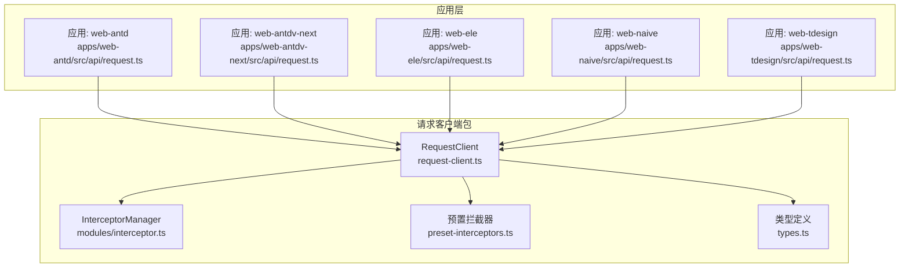
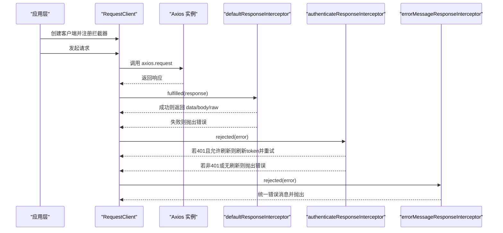
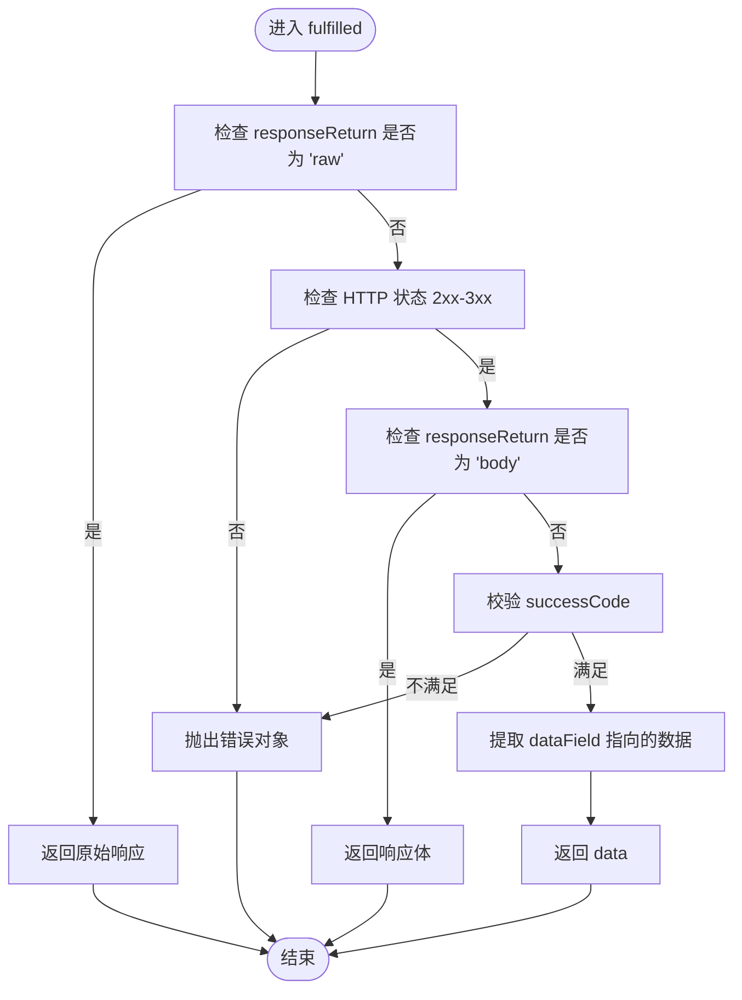
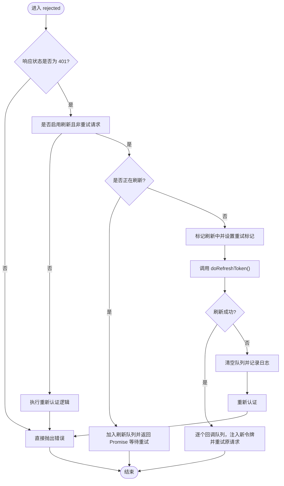
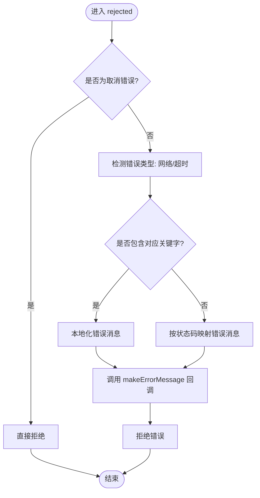
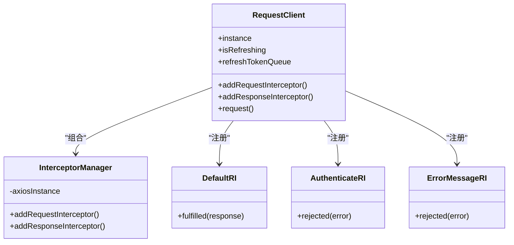

# 响应拦截器

<cite>
**本文引用的文件**
- [preset-interceptors.ts](file://packages/effects/request/src/request-client/preset-interceptors.ts)
- [interceptor.ts](file://packages/effects/request/src/request-client/modules/interceptor.ts)
- [request-client.ts](file://packages/effects/request/src/request-client/request-client.ts)
- [types.ts](file://packages/effects/request/src/request-client/types.ts)
- [request.ts（web-antd）](file://apps/web-antd/src/api/request.ts)
- [request.ts（web-antdv-next）](file://apps/web-antdv-next/src/api/request.ts)
- [request.ts（web-ele）](file://apps/web-ele/src/api/request.ts)
- [request.ts（web-naive）](file://apps/web-naive/src/api/request.ts)
- [request.ts（web-tdesign）](file://apps/web-tdesign/src/api/request.ts)
</cite>

## 目录
1. [简介](#简介)
2. [项目结构](#项目结构)
3. [核心组件](#核心组件)
4. [架构总览](#架构总览)
5. [详细组件分析](#详细组件分析)
6. [依赖关系分析](#依赖关系分析)
7. [性能考量](#性能考量)
8. [故障排除指南](#故障排除指南)
9. [结论](#结论)
10. [附录](#附录)

## 简介
本文件系统性阐述响应拦截器的设计与实现，重点覆盖三类预置响应拦截器：defaultResponseInterceptor、authenticateResponseInterceptor、errorMessageResponseInterceptor。内容涵盖它们的职责、处理逻辑（数据格式转换、token 刷新、错误处理）、执行顺序与优先级、如何自定义拦截器以适配特定业务场景，以及配置示例与常见问题排查。

## 项目结构
响应拦截器位于请求客户端包中，并在各前端应用层统一接入。核心文件如下：
- 预置拦截器定义：packages/effects/request/src/request-client/preset-interceptors.ts
- 拦截器注册与管理：packages/effects/request/src/request-client/modules/interceptor.ts
- 请求客户端封装：packages/effects/request/src/request-client/request-client.ts
- 类型定义：packages/effects/request/src/request-client/types.ts
- 应用侧接入示例：apps/web-*/src/api/request.ts（多套 UI 框架）

图表来源
- [request-client.ts:39-94](file://packages/effects/request/src/request-client/request-client.ts#L39-L94)
- [interceptor.ts:18-38](file://packages/effects/request/src/request-client/modules/interceptor.ts#L18-L38)
- [preset-interceptors.ts:9-166](file://packages/effects/request/src/request-client/preset-interceptors.ts#L9-L166)
- [types.ts:44-91](file://packages/effects/request/src/request-client/types.ts#L44-L91)
- [request.ts（web-antd）:26-124](file://apps/web-antd/src/api/request.ts#L26-L124)
- [request.ts（web-antdv-next）:24-114](file://apps/web-antdv-next/src/api/request.ts#L24-L114)
- [request.ts（web-ele）:24-114](file://apps/web-ele/src/api/request.ts#L24-L114)
- [request.ts（web-naive）:23-113](file://apps/web-naive/src/api/request.ts#L23-L113)
- [request.ts（web-tdesign）:23-113](file://apps/web-tdesign/src/api/request.ts#L23-L113)

章节来源
- [request-client.ts:39-94](file://packages/effects/request/src/request-client/request-client.ts#L39-L94)
- [interceptor.ts:18-38](file://packages/effects/request/src/request-client/modules/interceptor.ts#L18-L38)
- [preset-interceptors.ts:9-166](file://packages/effects/request/src/request-client/preset-interceptors.ts#L9-L166)
- [types.ts:44-91](file://packages/effects/request/src/request-client/types.ts#L44-L91)
- [request.ts（web-antd）:26-124](file://apps/web-antd/src/api/request.ts#L26-L124)

## 核心组件
- defaultResponseInterceptor：负责将后端约定式响应（含 code/data/message）解构为业务期望的数据；支持按状态码或自定义函数判定成功；支持返回原始响应、响应体或仅 data 字段。
- authenticateResponseInterceptor：处理 401 未授权错误，支持令牌刷新与重试；具备并发刷新队列，避免重复刷新与死循环；支持禁用刷新、已重试标记等策略。
- errorMessageResponseInterceptor：统一错误消息映射与提示，区分网络错误、超时、HTTP 状态码等；支持自定义消息生成器。

章节来源
- [preset-interceptors.ts:9-166](file://packages/effects/request/src/request-client/preset-interceptors.ts#L9-L166)
- [types.ts:61-68](file://packages/effects/request/src/request-client/types.ts#L61-L68)

## 架构总览
下图展示请求生命周期中三个响应拦截器的执行顺序与职责边界。应用层在创建 RequestClient 后，依次注册三类拦截器，形成“数据解包 -> 认证刷新 -> 统一错误”的处理链。

图表来源
- [request-client.ts:145-161](file://packages/effects/request/src/request-client/request-client.ts#L145-L161)
- [preset-interceptors.ts:9-166](file://packages/effects/request/src/request-client/preset-interceptors.ts#L9-L166)
- [request.ts（web-antd）:85-114](file://apps/web-antd/src/api/request.ts#L85-L114)

## 详细组件分析

### defaultResponseInterceptor 数据解包与返回策略
- 关键能力
  - 支持通过配置决定返回模式：raw（原始响应）、body（响应体）、data（仅 data 字段）。
  - 通过 codeField、successCode、dataField 三要素实现“约定式”响应解包。
  - 对 status 在 2xx 且满足 successCode 的响应提取 dataField 指向的数据；否则抛出错误对象。
- 执行流程

图表来源
- [preset-interceptors.ts:22-44](file://packages/effects/request/src/request-client/preset-interceptors.ts#L22-L44)

章节来源
- [preset-interceptors.ts:9-45](file://packages/effects/request/src/request-client/preset-interceptors.ts#L9-L45)
- [types.ts:28-28](file://packages/effects/request/src/request-client/types.ts#L28-L28)

### authenticateResponseInterceptor 认证与令牌刷新
- 关键能力
  - 识别 401 未授权错误，区分是否启用刷新、是否已在重试中。
  - 并发刷新队列：当刷新进行中，将后续请求挂起并排队，刷新完成后统一重试。
  - 刷新失败时清理队列并触发重新认证（登出或弹窗）。
- 执行流程

图表来源
- [preset-interceptors.ts:61-108](file://packages/effects/request/src/request-client/preset-interceptors.ts#L61-L108)
- [request-client.ts:46-50](file://packages/effects/request/src/request-client/request-client.ts#L46-L50)

章节来源
- [preset-interceptors.ts:47-110](file://packages/effects/request/src/request-client/preset-interceptors.ts#L47-L110)
- [request-client.ts:46-50](file://packages/effects/request/src/request-client/request-client.ts#L46-L50)

### errorMessageResponseInterceptor 统一错误提示
- 关键能力
  - 区分网络错误、超时、HTTP 状态码映射到本地化文案。
  - 支持取消请求（axios.isCancel）直接透传。
  - 可通过自定义 makeErrorMessage 回调二次加工错误消息。
- 执行流程

图表来源
- [preset-interceptors.ts:116-164](file://packages/effects/request/src/request-client/preset-interceptors.ts#L116-L164)

章节来源
- [preset-interceptors.ts:112-166](file://packages/effects/request/src/request-client/preset-interceptors.ts#L112-L166)

### 应用层接入与执行顺序
- 接入方式
  - 各应用在创建 RequestClient 后，按顺序注册三类响应拦截器：
    1) defaultResponseInterceptor
    2) authenticateResponseInterceptor
    3) errorMessageResponseInterceptor
- 顺序与优先级
  - Axios 响应拦截器遵循“先注册先执行”的链式调用规则。因此：
    - defaultResponseInterceptor 先行解包，确保后续拦截器拿到“纯业务数据”。
    - authenticateResponseInterceptor 在解包之后处理 401，必要时刷新 token 并重试。
    - errorMessageResponseInterceptor 最后兜底，统一错误提示。
- 应用示例
  - 多套 UI 框架（Ant Design、Element Plus、Naive、TDesign 等）均采用相同顺序注册，保证行为一致。

章节来源
- [request.ts（web-antd）:85-114](file://apps/web-antd/src/api/request.ts#L85-L114)
- [request.ts（web-antdv-next）:75-104](file://apps/web-antdv-next/src/api/request.ts#L75-L104)
- [request.ts（web-ele）:75-104](file://apps/web-ele/src/api/request.ts#L75-L104)
- [request.ts（web-naive）:74-103](file://apps/web-naive/src/api/request.ts#L74-L103)
- [request.ts（web-tdesign）:74-103](file://apps/web-tdesign/src/api/request.ts#L74-L103)

## 依赖关系分析
- RequestClient 作为核心容器，负责：
  - 创建 Axios 实例并合并默认配置。
  - 注入 InterceptorManager，暴露 addRequestInterceptor/addResponseInterceptor。
  - 维护 isRefreshing 与 refreshTokenQueue，支撑并发刷新。
- InterceptorManager 封装 Axios 原生拦截器注册，提供类型安全的接口。
- 预置拦截器基于 RequestClient 的上下文（如 client.request/url/config）实现重试与队列控制。
- 应用层通过偏好设置（preferences.app.*）控制刷新开关、语言头等。

图表来源
- [request-client.ts:39-94](file://packages/effects/request/src/request-client/request-client.ts#L39-L94)
- [interceptor.ts:18-38](file://packages/effects/request/src/request-client/modules/interceptor.ts#L18-L38)
- [preset-interceptors.ts:9-166](file://packages/effects/request/src/request-client/preset-interceptors.ts#L9-L166)

章节来源
- [request-client.ts:39-94](file://packages/effects/request/src/request-client/request-client.ts#L39-L94)
- [interceptor.ts:18-38](file://packages/effects/request/src/request-client/modules/interceptor.ts#L18-L38)
- [preset-interceptors.ts:9-166](file://packages/effects/request/src/request-client/preset-interceptors.ts#L9-L166)

## 性能考量
- 并发刷新队列避免重复请求与抖动，减少网络压力。
- 仅在 401 时触发刷新逻辑，降低无效开销。
- 建议：
  - 合理设置超时与重试次数，避免长时间阻塞。
  - 使用 responseReturn='data' 时确保后端约定稳定，减少额外判空。
  - 自定义 makeErrorMessage 时避免昂贵的 UI 操作，必要时节流/去抖。

## 故障排除指南
- 症状：401 后无限循环或频繁刷新
  - 可能原因：未正确设置重试标记或刷新队列未清空。
  - 处理建议：确认 authenticateResponseInterceptor 的 enableRefreshToken、__isRetryRequest、isRefreshing 与 refreshTokenQueue 的使用是否符合预期。
  - 参考路径
    - [preset-interceptors.ts:69-107](file://packages/effects/request/src/request-client/preset-interceptors.ts#L69-L107)
    - [request-client.ts:46-50](file://packages/effects/request/src/request-client/request-client.ts#L46-L50)
- 症状：统一错误提示未生效
  - 可能原因：makeErrorMessage 未正确接收或未触发 UI 提示。
  - 处理建议：检查 errorMessageResponseInterceptor 的回调是否被调用，以及 UI 框架的消息组件是否正确集成。
  - 参考路径
    - [preset-interceptors.ts:116-164](file://packages/effects/request/src/request-client/preset-interceptors.ts#L116-L164)
    - [request.ts（web-antd）:106-114](file://apps/web-antd/src/api/request.ts#L106-L114)
- 症状：数据解包不符合预期
  - 可能原因：codeField/successCode/dataField 配置与后端不一致。
  - 处理建议：核对后端返回结构，调整 defaultResponseInterceptor 的配置项。
  - 参考路径
    - [preset-interceptors.ts:13-44](file://packages/effects/request/src/request-client/preset-interceptors.ts#L13-L44)
    - [types.ts:70-78](file://packages/effects/request/src/request-client/types.ts#L70-L78)

## 结论
三类预置响应拦截器构成了“解包-认证-错误”的标准处理链。通过统一的注册顺序与 RequestClient 的上下文能力，既能满足常规业务需求，又便于扩展与定制。建议在团队内保持配置一致性，并结合实际后端协议与 UI 框架进行微调。

## 附录

### 配置示例与最佳实践
- 基础配置（来自应用层）
  - defaultResponseInterceptor：约定 codeField/dataField/successCode，确保与后端一致。
  - authenticateResponseInterceptor：提供 doRefreshToken/doReAuthenticate/formatToken，开启/关闭刷新。
  - errorMessageResponseInterceptor：提供 makeErrorMessage 回调，统一错误提示。
  - 参考路径
    - [request.ts（web-antd）:85-114](file://apps/web-antd/src/api/request.ts#L85-L114)
    - [request.ts（web-ele）:75-104](file://apps/web-ele/src/api/request.ts#L75-L104)
    - [request.ts（web-naive）:74-103](file://apps/web-naive/src/api/request.ts#L74-L103)
    - [request.ts（web-tdesign）:74-103](file://apps/web-tdesign/src/api/request.ts#L74-L103)
- 自定义拦截器
  - 可参考 InterceptorManager 的注册方式，在应用层创建自定义响应拦截器并插入链路。
  - 参考路径
    - [interceptor.ts:25-37](file://packages/effects/request/src/request-client/modules/interceptor.ts#L25-L37)
    - [request-client.ts:77-83](file://packages/effects/request/src/request-client/request-client.ts#L77-L83)