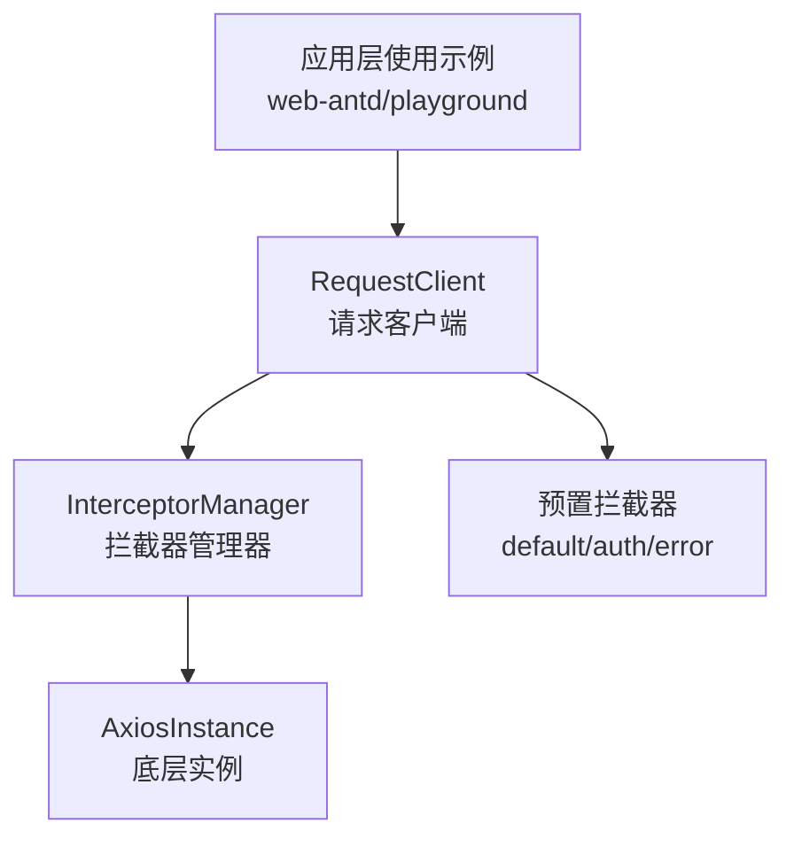
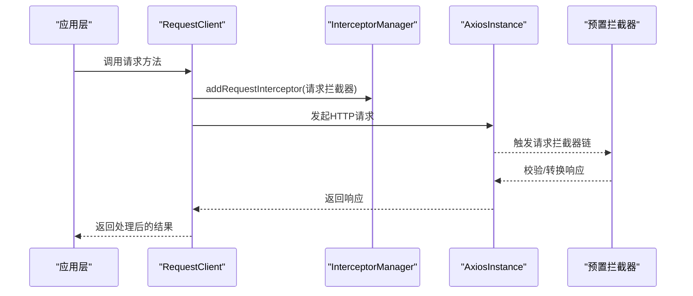
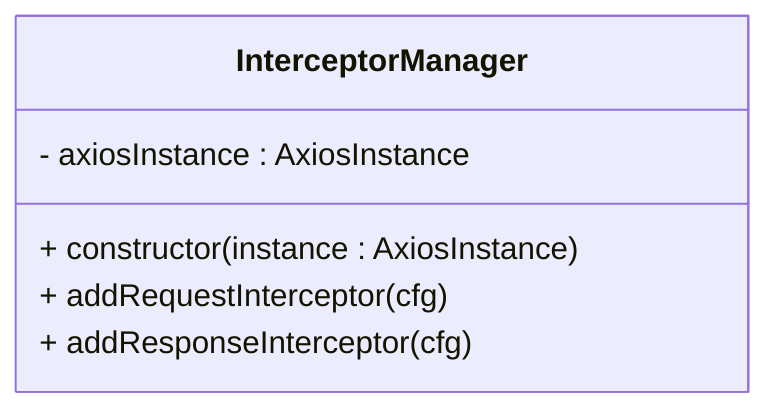
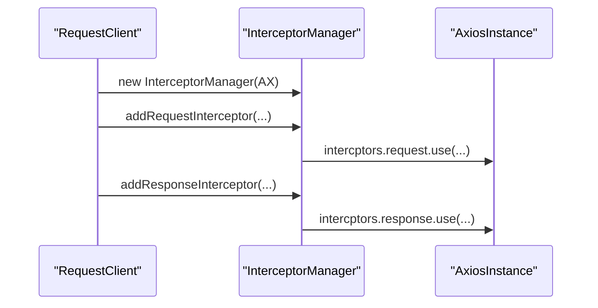
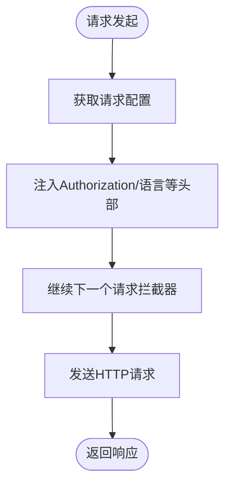
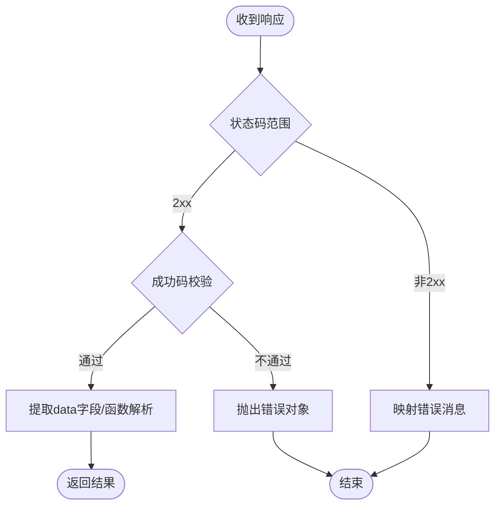
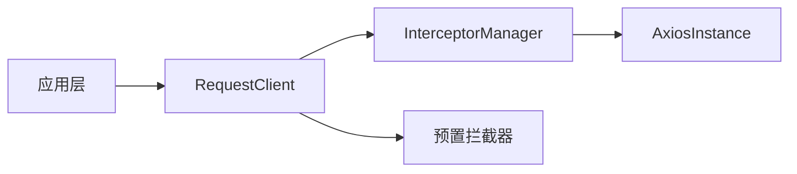

# 请求拦截器

<cite>
**本文引用的文件**
- [packages/effects/request/src/request-client/modules/interceptor.ts](file://packages/effects/request/src/request-client/modules/interceptor.ts)
- [packages/effects/request/src/request-client/request-client.ts](file://packages/effects/request/src/request-client/request-client.ts)
- [packages/effects/request/src/request-client/types.ts](file://packages/effects/request/src/request-client/types.ts)
- [packages/effects/request/src/request-client/preset-interceptors.ts](file://packages/effects/request/src/request-client/preset-interceptors.ts)
- [apps/web-antd/src/api/request.ts](file://apps/web-antd/src/api/request.ts)
- [playground/src/api/request.ts](file://playground/src/api/request.ts)
- [packages/effects/request/src/request-client/modules/sse.test.ts](file://packages/effects/request/src/request-client/modules/sse.test.ts)
</cite>

## 目录

1. [简介](#简介)
2. [项目结构](#项目结构)
3. [核心组件](#核心组件)
4. [架构总览](#架构总览)
5. [详细组件分析](#详细组件分析)
6. [依赖关系分析](#依赖关系分析)
7. [性能考量](#性能考量)
8. [故障排查指南](#故障排查指南)
9. [结论](#结论)
10. [附录](#附录)

## 简介

本篇文档系统性阐述请求拦截器的设计与实现，重点覆盖以下内容：

- 请求拦截器的实现原理与生命周期
- addRequestInterceptor 的使用方法与典型场景（请求头添加、认证 token 处理、语言设置等）
- 拦截器执行顺序与链式调用机制
- 如何基于现有能力自定义拦截器以满足特定业务需求
- 实际使用示例与常见应用场景

## 项目结构

请求拦截器位于统一的请求客户端包中，围绕 RequestClient 与 InterceptorManager 展开，配合预置拦截器模块提供开箱即用的能力。

图表来源

- [packages/effects/request/src/request-client/request-client.ts:39-94](file://packages/effects/request/src/request-client/request-client.ts#L39-L94)
- [packages/effects/request/src/request-client/modules/interceptor.ts:18-38](file://packages/effects/request/src/request-client/modules/interceptor.ts#L18-L38)
- [packages/effects/request/src/request-client/preset-interceptors.ts:9-166](file://packages/effects/request/src/request-client/preset-interceptors.ts#L9-L166)

章节来源

- [packages/effects/request/src/request-client/request-client.ts:39-94](file://packages/effects/request/src/request-client/request-client.ts#L39-L94)
- [packages/effects/request/src/request-client/modules/interceptor.ts:18-38](file://packages/effects/request/src/request-client/modules/interceptor.ts#L18-L38)
- [packages/effects/request/src/request-client/preset-interceptors.ts:9-166](file://packages/effects/request/src/request-client/preset-interceptors.ts#L9-L166)

## 核心组件

- InterceptorManager：封装 Axios 原生拦截器注册，提供 addRequestInterceptor 与 addResponseInterceptor 方法。
- RequestClient：对外暴露统一的请求 API，并在内部绑定拦截器管理器的方法，便于在应用层直接调用。
- 预置拦截器：提供默认响应处理、认证刷新、错误消息映射等常用能力，可按需组合使用。

章节来源

- [packages/effects/request/src/request-client/modules/interceptor.ts:18-38](file://packages/effects/request/src/request-client/modules/interceptor.ts#L18-L38)
- [packages/effects/request/src/request-client/request-client.ts:39-94](file://packages/effects/request/src/request-client/request-client.ts#L39-L94)
- [packages/effects/request/src/request-client/types.ts:52-66](file://packages/effects/request/src/request-client/types.ts#L52-L66)
- [packages/effects/request/src/request-client/preset-interceptors.ts:9-166](file://packages/effects/request/src/request-client/preset-interceptors.ts#L9-L166)

## 架构总览

下图展示请求从应用层发起到最终返回的拦截链路，以及预置拦截器的职责边界。

图表来源

- [packages/effects/request/src/request-client/request-client.ts:78-82](file://packages/effects/request/src/request-client/request-client.ts#L78-L82)
- [packages/effects/request/src/request-client/modules/interceptor.ts:25-37](file://packages/effects/request/src/request-client/modules/interceptor.ts#L25-L37)
- [packages/effects/request/src/request-client/preset-interceptors.ts:9-166](file://packages/effects/request/src/request-client/preset-interceptors.ts#L9-L166)

## 详细组件分析

### InterceptorManager 类

- 职责：持有 AxiosInstance 引用，向其注册请求/响应拦截器。
- 关键点：
  - addRequestInterceptor：将 fulfilled/rejected 回调注册到 axios.interceptors.request。
  - addResponseInterceptor：将 fulfilled/rejected 回调注册到 axios.interceptors.response。
- 设计要点：通过委托的方式将拦截器注册行为暴露给 RequestClient，保持职责清晰。

图表来源

- [packages/effects/request/src/request-client/modules/interceptor.ts:18-38](file://packages/effects/request/src/request-client/modules/interceptor.ts#L18-L38)

章节来源

- [packages/effects/request/src/request-client/modules/interceptor.ts:18-38](file://packages/effects/request/src/request-client/modules/interceptor.ts#L18-L38)

### RequestClient 与拦截器绑定

- RequestClient 在构造时创建 AxiosInstance，并实例化 InterceptorManager。
- 将 addRequestInterceptor/addResponseInterceptor 绑定到 RequestClient 实例上，供应用层直接使用。
- 生命周期：在 RequestClient 初始化阶段完成拦截器注册；请求阶段按注册顺序依次执行。

图表来源

- [packages/effects/request/src/request-client/request-client.ts:78-82](file://packages/effects/request/src/request-client/request-client.ts#L78-L82)
- [packages/effects/request/src/request-client/modules/interceptor.ts:25-37](file://packages/effects/request/src/request-client/modules/interceptor.ts#L25-L37)

章节来源

- [packages/effects/request/src/request-client/request-client.ts:78-82](file://packages/effects/request/src/request-client/request-client.ts#L78-L82)

### addRequestInterceptor 使用详解

- 入口：RequestClient.prototype.addRequestInterceptor。
- 作用域：在每次 HTTP 请求发送前，对请求配置进行统一处理。
- 常见用途：
  - 添加 Authorization 头（携带访问令牌）
  - 设置 Accept-Language 等通用请求头
  - 注入业务上下文参数（如 traceId、tenantId 等）
- 执行顺序：遵循 Axios 原生拦截器链的注册顺序，先注册的先执行。

图表来源

- [apps/web-antd/src/api/request.ts:74-82](file://apps/web-antd/src/api/request.ts#L74-L82)
- [playground/src/api/request.ts:77-86](file://playground/src/api/request.ts#L77-L86)

章节来源

- [apps/web-antd/src/api/request.ts:74-82](file://apps/web-antd/src/api/request.ts#L74-L82)
- [playground/src/api/request.ts:77-86](file://playground/src/api/request.ts#L77-L86)

### 预置拦截器与响应处理

- defaultResponseInterceptor：根据配置的 code/data 字段与成功码，自动解构响应体，支持 raw/body/data 三种返回策略。
- authenticateResponseInterceptor：处理 401 场景，支持令牌刷新与重试队列，避免重复登录与死循环。
- errorMessageResponseInterceptor：将网络错误、超时、HTTP 状态码映射为本地化提示文案，统一错误呈现。

图表来源

- [packages/effects/request/src/request-client/preset-interceptors.ts:9-45](file://packages/effects/request/src/request-client/preset-interceptors.ts#L9-L45)
- [packages/effects/request/src/request-client/preset-interceptors.ts:47-110](file://packages/effects/request/src/request-client/preset-interceptors.ts#L47-L110)
- [packages/effects/request/src/request-client/preset-interceptors.ts:112-166](file://packages/effects/request/src/request-client/preset-interceptors.ts#L112-L166)

章节来源

- [packages/effects/request/src/request-client/preset-interceptors.ts:9-166](file://packages/effects/request/src/request-client/preset-interceptors.ts#L9-L166)

### 自定义请求拦截器最佳实践

- 何时使用：当业务需要在请求前统一注入参数、头信息或进行条件化处理时。
- 推荐做法：
  - 保持无副作用：仅修改 config，避免外部状态变更。
  - 支持异步：若需要从状态管理或外部服务获取数据，确保返回 Promise。
  - 明确优先级：多个拦截器时，通过注册顺序控制先后关系。
  - 错误兜底：在 rejected 中返回或抛出明确错误，便于上层统一处理。
- 参考路径：
  - 应用层注册示例：[apps/web-antd/src/api/request.ts:74-82](file://apps/web-antd/src/api/request.ts#L74-L82)
  - 测试验证拦截器链生效：[packages/effects/request/src/request-client/modules/sse.test.ts:96-129](file://packages/effects/request/src/request-client/modules/sse.test.ts#L96-L129)

章节来源

- [apps/web-antd/src/api/request.ts:74-82](file://apps/web-antd/src/api/request.ts#L74-L82)
- [packages/effects/request/src/request-client/modules/sse.test.ts:96-129](file://packages/effects/request/src/request-client/modules/sse.test.ts#L96-L129)

### 执行顺序与生命周期

- 注册阶段：应用启动时调用 addRequestInterceptor/addResponseInterceptor 完成注册。
- 请求阶段：请求拦截器按注册顺序执行，随后进入响应拦截器链。
- 生命周期：
  - 请求拦截器：一次请求仅执行一次，通常用于注入头、参数等。
  - 响应拦截器：对响应进行统一处理，如解构、鉴权刷新、错误映射等。

章节来源

- [packages/effects/request/src/request-client/modules/interceptor.ts:25-37](file://packages/effects/request/src/request-client/modules/interceptor.ts#L25-L37)
- [packages/effects/request/src/request-client/preset-interceptors.ts:47-110](file://packages/effects/request/src/request-client/preset-interceptors.ts#L47-L110)

## 依赖关系分析

- RequestClient 依赖 InterceptorManager 与 AxiosInstance，负责创建实例与绑定方法。
- InterceptorManager 依赖 AxiosInstance，负责注册拦截器。
- 预置拦截器作为独立模块，被 RequestClient 以组合方式接入。
- 应用层通过引入 RequestClient 与预置拦截器，在初始化阶段完成拦截器装配。

图表来源

- [packages/effects/request/src/request-client/request-client.ts:78-82](file://packages/effects/request/src/request-client/request-client.ts#L78-L82)
- [packages/effects/request/src/request-client/modules/interceptor.ts:18-38](file://packages/effects/request/src/request-client/modules/interceptor.ts#L18-L38)
- [packages/effects/request/src/request-client/preset-interceptors.ts:9-166](file://packages/effects/request/src/request-client/preset-interceptors.ts#L9-L166)

章节来源

- [packages/effects/request/src/request-client/request-client.ts:78-82](file://packages/effects/request/src/request-client/request-client.ts#L78-L82)
- [packages/effects/request/src/request-client/modules/interceptor.ts:18-38](file://packages/effects/request/src/request-client/modules/interceptor.ts#L18-L38)
- [packages/effects/request/src/request-client/preset-interceptors.ts:9-166](file://packages/effects/request/src/request-client/preset-interceptors.ts#L9-L166)

## 性能考量

- 拦截器数量与复杂度：拦截器越多，请求前处理耗时越长，建议合并同类逻辑，避免重复计算。
- 异步操作：在请求拦截器中尽量减少异步 IO，必要时缓存结果，避免阻塞主流程。
- 响应拦截器：默认响应处理与错误映射属于 CPU 密集型，注意不要在其中做重型计算。
- 并发与刷新：认证刷新涉及队列与重试，需避免并发风暴，合理设置重试次数与退避策略。

## 故障排查指南

- 401 未授权
  - 现象：接口返回 401，触发认证刷新或重新登录。
  - 排查：确认 enableRefreshToken 配置、doRefreshToken 实现、formatToken 格式是否正确。
  - 参考：[packages/effects/request/src/request-client/preset-interceptors.ts:47-110](file://packages/effects/request/src/request-client/preset-interceptors.ts#L47-L110)
- 令牌无效或过期
  - 现象：刷新失败后进入重新认证流程。
  - 排查：检查 doReAuthenticate 的实现与用户状态清理逻辑。
  - 参考：[apps/web-antd/src/api/request.ts:43-56](file://apps/web-antd/src/api/request.ts#L43-L56)
- 错误消息未显示
  - 现象：接口报错但未出现本地化提示。
  - 排查：确认 errorMessageResponseInterceptor 已注册且回调逻辑正确。
  - 参考：[packages/effects/request/src/request-client/preset-interceptors.ts:112-166](file://packages/effects/request/src/request-client/preset-interceptors.ts#L112-L166)
- 请求头未生效
  - 现象：Authorization 或 Accept-Language 未到达服务端。
  - 排查：确认 addRequestInterceptor 已在 RequestClient 初始化时注册；检查状态管理中 token 是否为空。
  - 参考：[apps/web-antd/src/api/request.ts:74-82](file://apps/web-antd/src/api/request.ts#L74-L82)

章节来源

- [packages/effects/request/src/request-client/preset-interceptors.ts:47-110](file://packages/effects/request/src/request-client/preset-interceptors.ts#L47-L110)
- [apps/web-antd/src/api/request.ts:43-56](file://apps/web-antd/src/api/request.ts#L43-L56)
- [packages/effects/request/src/request-client/preset-interceptors.ts:112-166](file://packages/effects/request/src/request-client/preset-interceptors.ts#L112-L166)
- [apps/web-antd/src/api/request.ts:74-82](file://apps/web-antd/src/api/request.ts#L74-L82)

## 结论

请求拦截器通过 InterceptorManager 与 Axios 原生机制无缝集成，RequestClient 提供简洁易用的入口。结合预置拦截器，可在不侵入业务代码的情况下实现统一的认证、响应解构与错误处理。建议在应用初始化阶段集中注册拦截器，明确职责边界与执行顺序，以获得稳定、可维护的请求链路。

## 附录

### 常见应用场景速览

- 请求头注入：统一添加 Authorization 与 Accept-Language。
- 认证刷新：401 时自动刷新令牌并重试。
- 响应解构：按约定字段提取 data，屏蔽 HTTP 细节。
- 错误映射：将网络错误、超时、HTTP 状态码映射为本地化提示。

### 关键类型与配置参考

- RequestInterceptorConfig：请求拦截器配置，包含 fulfilled/rejected 回调。
- ResponseInterceptorConfig：响应拦截器配置，包含 fulfilled/rejected 回调。
- 预置拦截器：defaultResponseInterceptor、authenticateResponseInterceptor、errorMessageResponseInterceptor。

章节来源

- [packages/effects/request/src/request-client/types.ts:52-66](file://packages/effects/request/src/request-client/types.ts#L52-L66)
- [packages/effects/request/src/request-client/preset-interceptors.ts:9-166](file://packages/effects/request/src/request-client/preset-interceptors.ts#L9-L166)
