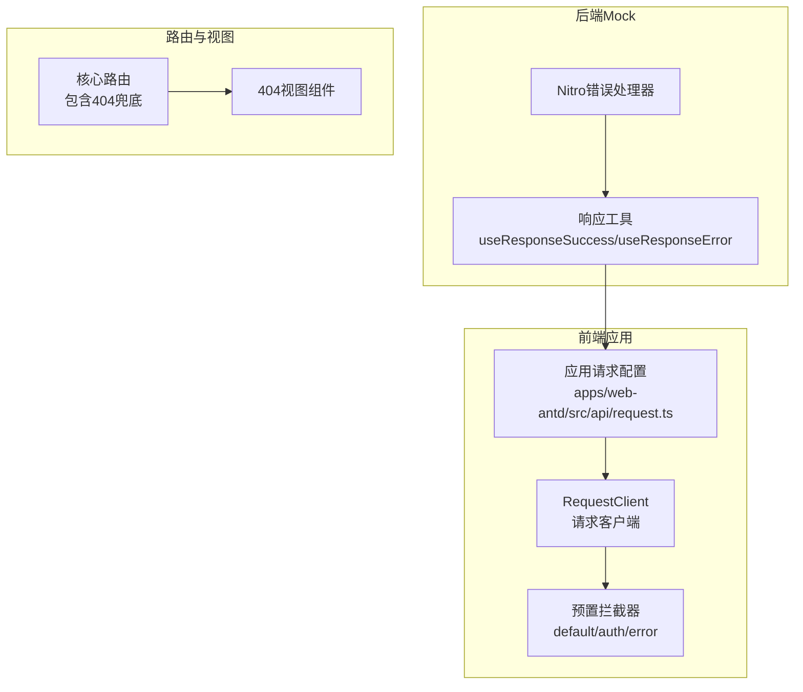
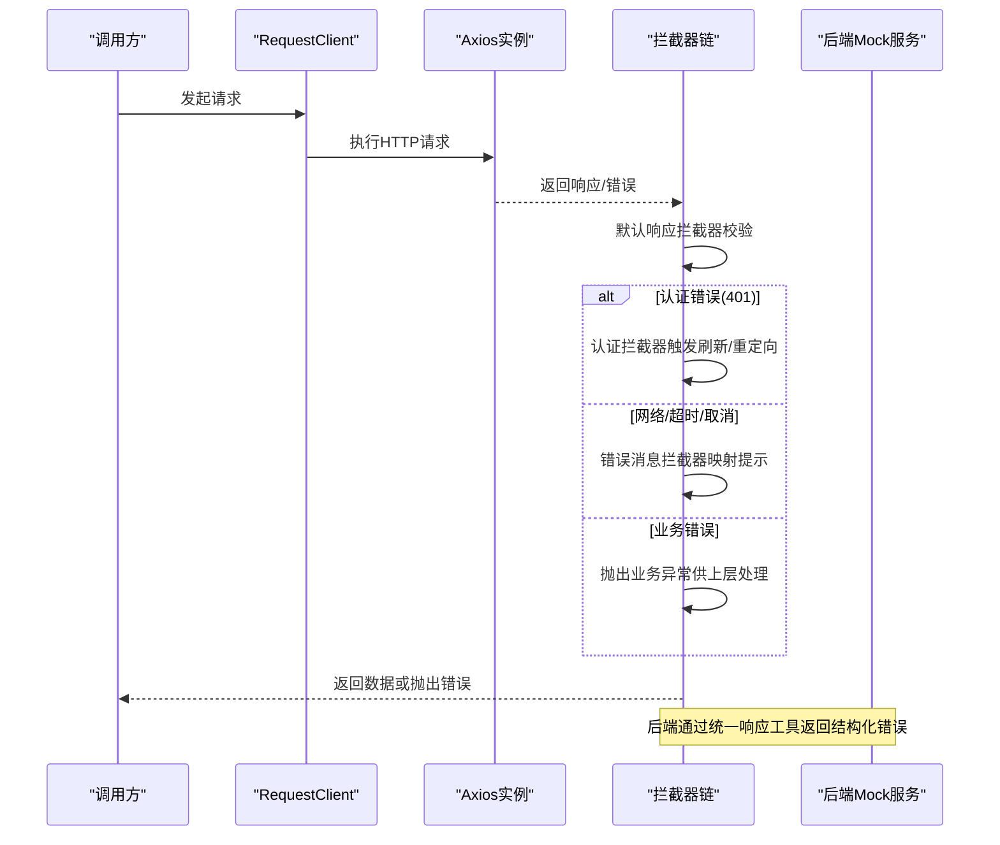
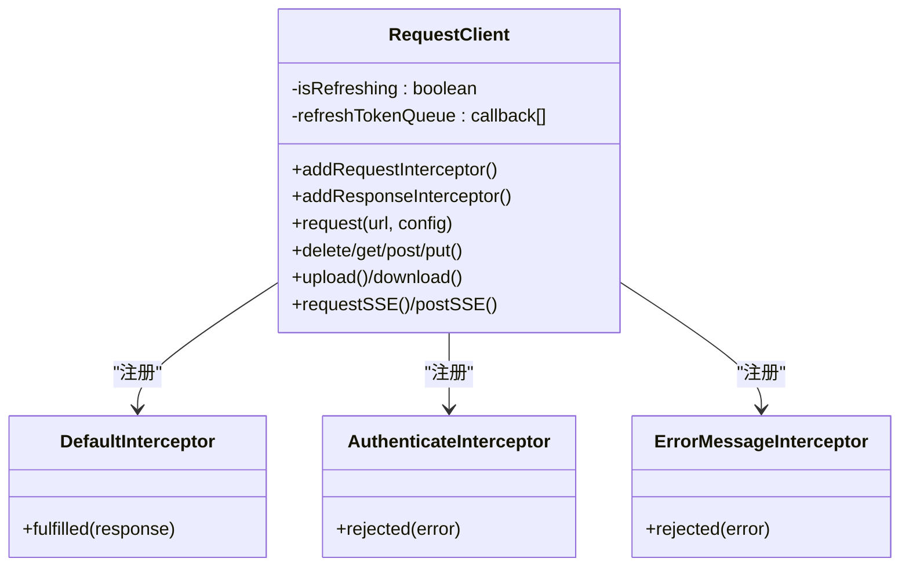
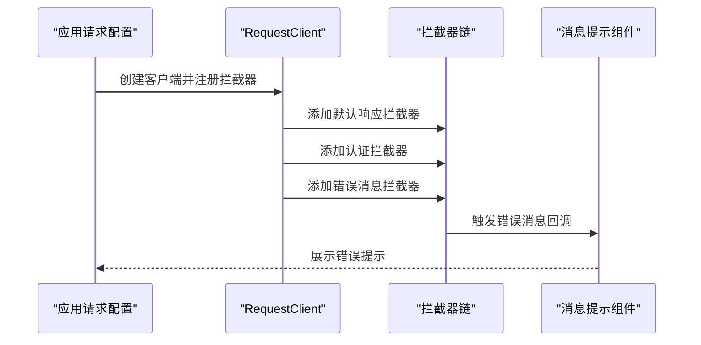
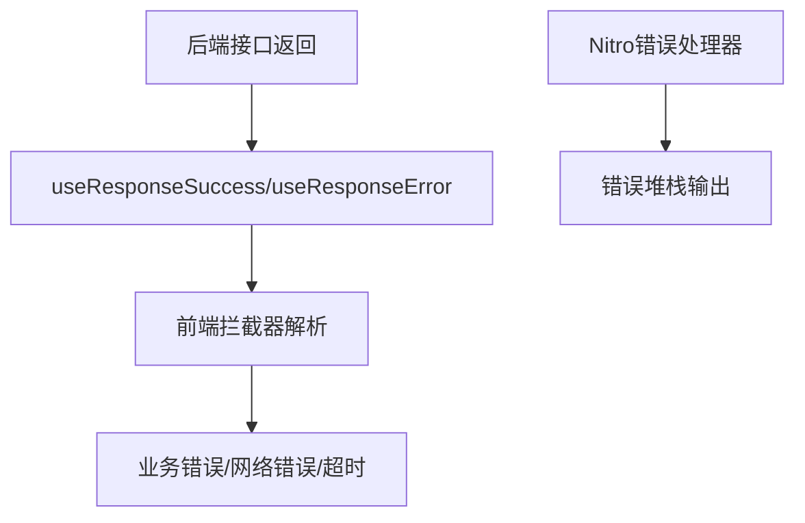
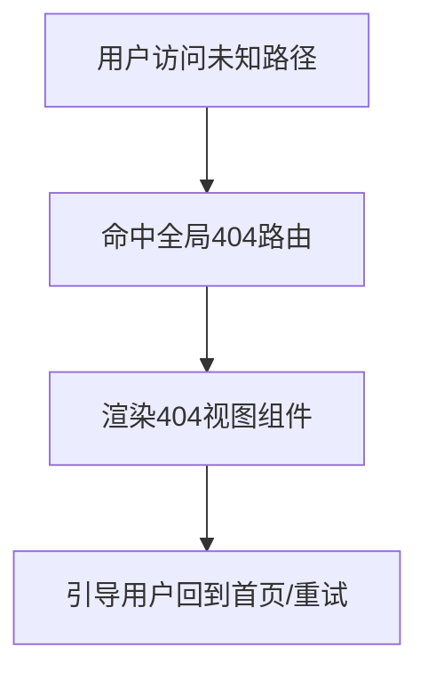
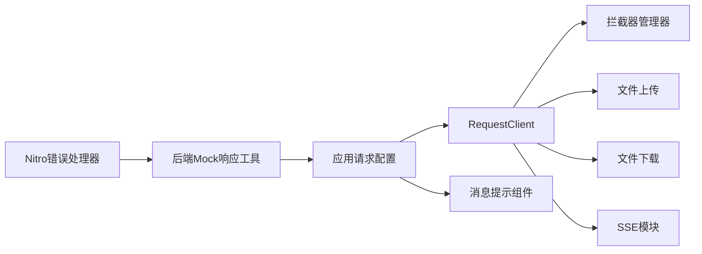

# 错误处理机制

<cite>
**本文引用的文件**
- [packages/effects/request/src/request-client/preset-interceptors.ts](file://packages/effects/request/src/request-client/preset-interceptors.ts)
- [packages/effects/request/src/request-client/request-client.ts](file://packages/effects/request/src/request-client/request-client.ts)
- [apps/web-antd/src/api/request.ts](file://apps/web-antd/src/api/request.ts)
- [apps/backend-mock/utils/response.ts](file://apps/backend-mock/utils/response.ts)
- [apps/backend-mock/error.ts](file://apps/backend-mock/error.ts)
- [apps/web-antd/src/router/routes/core.ts](file://apps/web-antd/src/router/routes/core.ts)
- [apps/web-antd/src/views/_core/fallback/not-found.vue](file://apps/web-antd/src/views/_core/fallback/not-found.vue)
- [docs/src/en/guide/essentials/server.md](file://docs/src/en/guide/essentials/server.md)
</cite>

## 目录

1. [简介](#简介)
2. [项目结构](#项目结构)
3. [核心组件](#核心组件)
4. [架构总览](#架构总览)
5. [详细组件分析](#详细组件分析)
6. [依赖关系分析](#依赖关系分析)
7. [性能考量](#性能考量)
8. [故障排查指南](#故障排查指南)
9. [结论](#结论)
10. [附录](#附录)

## 简介

本指南系统性阐述本仓库的API错误处理机制，覆盖多层级错误处理架构：网络错误、业务错误、认证错误、路由级容错与用户反馈。重点解析错误拦截器的实现原理与配置方法，说明错误消息的展示与反馈流程，介绍错误重试与令牌刷新的降级策略，并提供最佳实践与常见问题解决方案及调试技巧。

## 项目结构

围绕错误处理的关键位置如下：

- 前端请求层：统一的请求客户端与预置拦截器，负责网络错误、认证错误与业务错误的分层处理。
- 后端Mock层：统一的成功/失败响应封装与Nitro错误处理器，便于前端测试与演示。
- 路由与视图：全局404兜底与认证相关路由，保障错误态下的用户体验。
- 文档：提供请求客户端的配置示例与扩展思路。

**图表来源**

- [packages/effects/request/src/request-client/request-client.ts:39-94](file://packages/effects/request/src/request-client/request-client.ts#L39-L94)
- [packages/effects/request/src/request-client/preset-interceptors.ts:9-45](file://packages/effects/request/src/request-client/preset-interceptors.ts#L9-L45)
- [apps/web-antd/src/api/request.ts:26-117](file://apps/web-antd/src/api/request.ts#L26-L117)
- [apps/backend-mock/utils/response.ts:5-42](file://apps/backend-mock/utils/response.ts#L5-L42)
- [apps/backend-mock/error.ts:1-8](file://apps/backend-mock/error.ts#L1-L8)
- [apps/web-antd/src/router/routes/core.ts:10-21](file://apps/web-antd/src/router/routes/core.ts#L10-L21)
- [apps/web-antd/src/views/\_core/fallback/not-found.vue:1-10](file://apps/web-antd/src/views/_core/fallback/not-found.vue#L1-L10)

**章节来源**

- [packages/effects/request/src/request-client/request-client.ts:39-94](file://packages/effects/request/src/request-client/request-client.ts#L39-L94)
- [apps/web-antd/src/api/request.ts:26-117](file://apps/web-antd/src/api/request.ts#L26-L117)
- [apps/backend-mock/utils/response.ts:5-42](file://apps/backend-mock/utils/response.ts#L5-L42)
- [apps/backend-mock/error.ts:1-8](file://apps/backend-mock/error.ts#L1-L8)
- [apps/web-antd/src/router/routes/core.ts:10-21](file://apps/web-antd/src/router/routes/core.ts#L10-L21)
- [apps/web-antd/src/views/\_core/fallback/not-found.vue:1-10](file://apps/web-antd/src/views/_core/fallback/not-found.vue#L1-L10)

## 核心组件

- 请求客户端与拦截器
  - RequestClient：封装Axios实例，提供请求/响应拦截器注册、上传/下载/SSE等能力。
  - 预置拦截器：默认响应拦截器、认证拦截器、错误消息拦截器。
- 应用层请求配置
  - 在各UI框架的应用入口中，组合拦截器、设置令牌头、统一封装业务成功/失败语义。
- 后端Mock响应工具
  - 统一的成功/失败响应结构，配合Nitro错误处理器输出一致的错误形态。
- 路由与视图兜底
  - 全局404路由与视图组件，保证导航错误或资源缺失时的友好体验。

**章节来源**

- [packages/effects/request/src/request-client/request-client.ts:39-94](file://packages/effects/request/src/request-client/request-client.ts#L39-L94)
- [packages/effects/request/src/request-client/preset-interceptors.ts:9-45](file://packages/effects/request/src/request-client/preset-interceptors.ts#L9-L45)
- [apps/web-antd/src/api/request.ts:26-117](file://apps/web-antd/src/api/request.ts#L26-L117)
- [apps/backend-mock/utils/response.ts:5-42](file://apps/backend-mock/utils/response.ts#L5-L42)
- [apps/backend-mock/error.ts:1-8](file://apps/backend-mock/error.ts#L1-L8)
- [apps/web-antd/src/router/routes/core.ts:10-21](file://apps/web-antd/src/router/routes/core.ts#L10-L21)
- [apps/web-antd/src/views/\_core/fallback/not-found.vue:1-10](file://apps/web-antd/src/views/_core/fallback/not-found.vue#L1-L10)

## 架构总览

下图展示了从前端请求到后端响应、再到错误拦截与用户反馈的全链路：

**图表来源**

- [packages/effects/request/src/request-client/request-client.ts:145-161](file://packages/effects/request/src/request-client/request-client.ts#L145-L161)
- [packages/effects/request/src/request-client/preset-interceptors.ts:9-45](file://packages/effects/request/src/request-client/preset-interceptors.ts#L9-L45)
- [packages/effects/request/src/request-client/preset-interceptors.ts:47-110](file://packages/effects/request/src/request-client/preset-interceptors.ts#L47-L110)
- [packages/effects/request/src/request-client/preset-interceptors.ts:112-165](file://packages/effects/request/src/request-client/preset-interceptors.ts#L112-L165)
- [apps/backend-mock/utils/response.ts:35-42](file://apps/backend-mock/utils/response.ts#L35-L42)

## 详细组件分析

### 组件A：请求客户端与拦截器

- RequestClient职责
  - 创建Axios实例，合并默认配置（超时、序列化、Content-Type等）。
  - 暴露请求/响应拦截器注册方法，以及上传/下载/SSE能力。
  - 维护令牌刷新状态与队列，确保并发刷新安全。
- 预置拦截器
  - 默认响应拦截器：按业务约定的code/data字段判断成功，否则抛出响应包装的错误。
  - 认证拦截器：处理401错误，支持刷新令牌、队列等待、重试与重新认证。
  - 错误消息拦截器：识别网络错误、超时、取消等，按状态码映射本地化提示。

**图表来源**

- [packages/effects/request/src/request-client/request-client.ts:39-94](file://packages/effects/request/src/request-client/request-client.ts#L39-L94)
- [packages/effects/request/src/request-client/preset-interceptors.ts:9-45](file://packages/effects/request/src/request-client/preset-interceptors.ts#L9-L45)
- [packages/effects/request/src/request-client/preset-interceptors.ts:47-110](file://packages/effects/request/src/request-client/preset-interceptors.ts#L47-L110)
- [packages/effects/request/src/request-client/preset-interceptors.ts:112-165](file://packages/effects/request/src/request-client/preset-interceptors.ts#L112-L165)

**章节来源**

- [packages/effects/request/src/request-client/request-client.ts:39-94](file://packages/effects/request/src/request-client/request-client.ts#L39-L94)
- [packages/effects/request/src/request-client/preset-interceptors.ts:9-45](file://packages/effects/request/src/request-client/preset-interceptors.ts#L9-L45)
- [packages/effects/request/src/request-client/preset-interceptors.ts:47-110](file://packages/effects/request/src/request-client/preset-interceptors.ts#L47-L110)
- [packages/effects/request/src/request-client/preset-interceptors.ts:112-165](file://packages/effects/request/src/request-client/preset-interceptors.ts#L112-L165)

### 组件B：应用层请求配置（以Ant Design Vue为例）

- 作用
  - 注入请求头（Authorization、语言），统一业务响应结构（code/data/message）。
  - 注册认证拦截器与错误消息拦截器，并在拦截器回调中进行用户提示。
- 关键点
  - 令牌格式化与刷新逻辑由应用层提供。
  - 可根据业务定制错误消息映射与提示方式。

**图表来源**

- [apps/web-antd/src/api/request.ts:26-117](file://apps/web-antd/src/api/request.ts#L26-L117)
- [packages/effects/request/src/request-client/preset-interceptors.ts:9-45](file://packages/effects/request/src/request-client/preset-interceptors.ts#L9-L45)
- [packages/effects/request/src/request-client/preset-interceptors.ts:47-110](file://packages/effects/request/src/request-client/preset-interceptors.ts#L47-L110)
- [packages/effects/request/src/request-client/preset-interceptors.ts:112-165](file://packages/effects/request/src/request-client/preset-interceptors.ts#L112-L165)

**章节来源**

- [apps/web-antd/src/api/request.ts:26-117](file://apps/web-antd/src/api/request.ts#L26-L117)

### 组件C：后端Mock响应与错误处理

- 响应工具
  - 成功/分页/错误统一结构，便于前端一致处理。
- Nitro错误处理器
  - 开发环境/生产环境统一错误输出，便于定位问题。

**图表来源**

- [apps/backend-mock/utils/response.ts:5-42](file://apps/backend-mock/utils/response.ts#L5-L42)
- [apps/backend-mock/error.ts:1-8](file://apps/backend-mock/error.ts#L1-L8)

**章节来源**

- [apps/backend-mock/utils/response.ts:5-42](file://apps/backend-mock/utils/response.ts#L5-L42)
- [apps/backend-mock/error.ts:1-8](file://apps/backend-mock/error.ts#L1-L8)

### 组件D：路由级容错与用户反馈

- 全局404兜底路由与视图，确保路径错误时有明确反馈。
- 认证相关路由（登录/验证码/二维码/忘记密码/注册）完善用户旅程。

**图表来源**

- [apps/web-antd/src/router/routes/core.ts:10-21](file://apps/web-antd/src/router/routes/core.ts#L10-L21)
- [apps/web-antd/src/views/\_core/fallback/not-found.vue:1-10](file://apps/web-antd/src/views/_core/fallback/not-found.vue#L1-L10)

**章节来源**

- [apps/web-antd/src/router/routes/core.ts:10-21](file://apps/web-antd/src/router/routes/core.ts#L10-L21)
- [apps/web-antd/src/views/\_core/fallback/not-found.vue:1-10](file://apps/web-antd/src/views/_core/fallback/not-found.vue#L1-L10)

## 依赖关系分析

- RequestClient依赖拦截器管理器与上传/下载/SSE模块，形成高内聚低耦合的请求基础设施。
- 应用层请求配置依赖RequestClient与预置拦截器，同时依赖应用状态（令牌、偏好设置）与UI消息组件。
- 后端Mock通过统一响应工具与Nitro错误处理器，向上游提供稳定的错误形态。

**图表来源**

- [packages/effects/request/src/request-client/request-client.ts:39-94](file://packages/effects/request/src/request-client/request-client.ts#L39-L94)
- [apps/web-antd/src/api/request.ts:26-117](file://apps/web-antd/src/api/request.ts#L26-L117)
- [apps/backend-mock/utils/response.ts:5-42](file://apps/backend-mock/utils/response.ts#L5-L42)
- [apps/backend-mock/error.ts:1-8](file://apps/backend-mock/error.ts#L1-L8)

**章节来源**

- [packages/effects/request/src/request-client/request-client.ts:39-94](file://packages/effects/request/src/request-client/request-client.ts#L39-L94)
- [apps/web-antd/src/api/request.ts:26-117](file://apps/web-antd/src/api/request.ts#L26-L117)
- [apps/backend-mock/utils/response.ts:5-42](file://apps/backend-mock/utils/response.ts#L5-L42)
- [apps/backend-mock/error.ts:1-8](file://apps/backend-mock/error.ts#L1-L8)

## 性能考量

- 超时与序列化
  - 合理设置超时时间，避免长时间阻塞；对数组参数采用合适序列化策略，减少无效传输。
- 并发刷新令牌
  - 通过刷新队列避免重复请求与竞态，提升稳定性与吞吐。
- 响应体转换
  - 对大数据量或特殊类型（如BigInt）进行按需转换，平衡内存与精度。

[本节为通用建议，无需特定文件引用]

## 故障排查指南

- 网络错误与超时
  - 检查拦截器中对“Network Error”“timeout”的识别与提示是否生效。
  - 核对超时配置与后端实际响应时间。
- 401未授权
  - 确认认证拦截器已注册，刷新令牌开关与格式化逻辑正确。
  - 查看刷新队列是否被正确清空与重试。
- 业务错误
  - 确认默认响应拦截器的code/data字段与后端一致。
  - 检查错误消息拦截器是否覆盖了业务自定义提示。
- 路由级404
  - 确认全局兜底路由已注册，视图组件可正常渲染。
- 后端错误输出
  - 检查Nitro错误处理器是否正确输出堆栈信息，便于定位。

**章节来源**

- [packages/effects/request/src/request-client/preset-interceptors.ts:112-165](file://packages/effects/request/src/request-client/preset-interceptors.ts#L112-L165)
- [packages/effects/request/src/request-client/preset-interceptors.ts:47-110](file://packages/effects/request/src/request-client/preset-interceptors.ts#L47-L110)
- [apps/web-antd/src/api/request.ts:26-117](file://apps/web-antd/src/api/request.ts#L26-L117)
- [apps/web-antd/src/router/routes/core.ts:10-21](file://apps/web-antd/src/router/routes/core.ts#L10-L21)
- [apps/backend-mock/error.ts:1-8](file://apps/backend-mock/error.ts#L1-L8)

## 结论

本项目的错误处理机制通过“请求客户端+预置拦截器+应用层配置+后端统一响应”的分层设计，实现了对网络错误、业务错误与认证错误的清晰区分与有序处理。结合令牌刷新队列、路由兜底与本地化提示，既提升了系统的健壮性，也改善了用户体验。建议在实际项目中按业务定制拦截器回调与错误映射，持续优化超时与序列化策略，并完善日志与监控以便快速定位问题。

[本节为总结性内容，无需特定文件引用]

## 附录

- 配置参考与扩展
  - 参考文档中的请求客户端配置示例，了解如何注册拦截器、设置令牌与业务响应结构。
- 示例路径
  - 认证拦截器实现路径：[packages/effects/request/src/request-client/preset-interceptors.ts:47-110](file://packages/effects/request/src/request-client/preset-interceptors.ts#L47-L110)
  - 错误消息拦截器实现路径：[packages/effects/request/src/request-client/preset-interceptors.ts:112-165](file://packages/effects/request/src/request-client/preset-interceptors.ts#L112-L165)
  - 默认响应拦截器实现路径：[packages/effects/request/src/request-client/preset-interceptors.ts:9-45](file://packages/effects/request/src/request-client/preset-interceptors.ts#L9-L45)
  - 应用层请求配置示例路径：[apps/web-antd/src/api/request.ts:26-117](file://apps/web-antd/src/api/request.ts#L26-L117)
  - 后端统一响应工具路径：[apps/backend-mock/utils/response.ts:5-42](file://apps/backend-mock/utils/response.ts#L5-L42)
  - Nitro错误处理器路径：[apps/backend-mock/error.ts:1-8](file://apps/backend-mock/error.ts#L1-L8)
  - 路由与404视图路径：
    - [apps/web-antd/src/router/routes/core.ts:10-21](file://apps/web-antd/src/router/routes/core.ts#L10-L21)
    - [apps/web-antd/src/views/\_core/fallback/not-found.vue:1-10](file://apps/web-antd/src/views/_core/fallback/not-found.vue#L1-L10)

**章节来源**

- [docs/src/en/guide/essentials/server.md:158-274](file://docs/src/en/guide/essentials/server.md#L158-L274)
