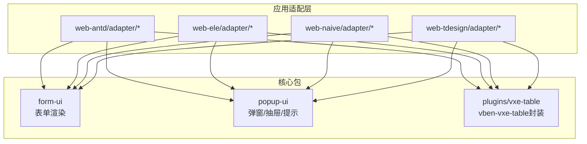
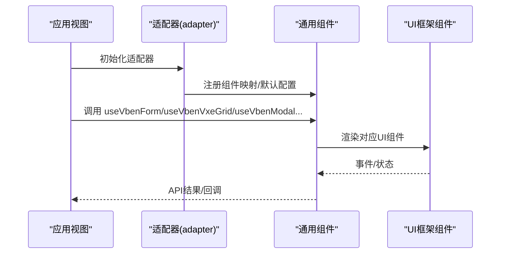
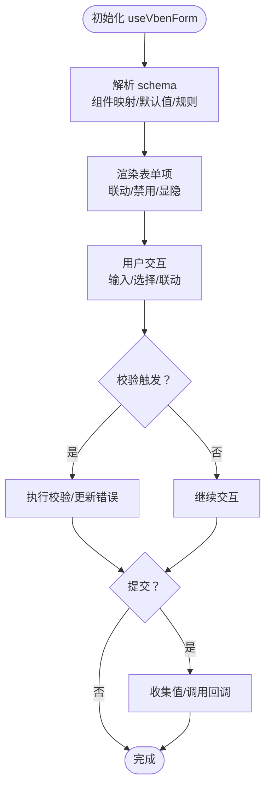
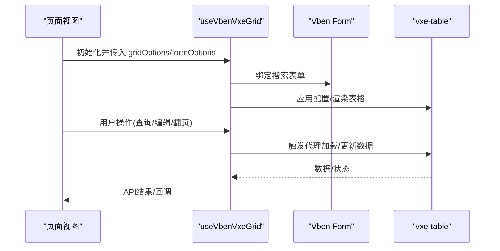
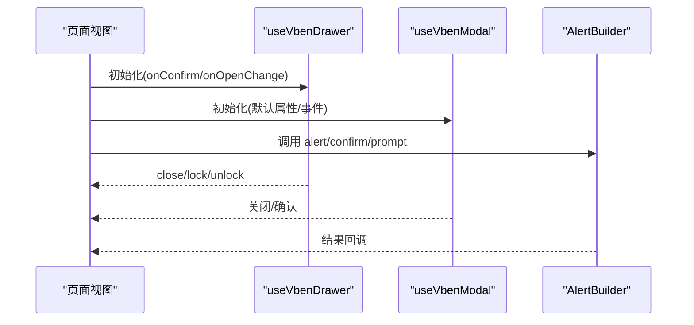
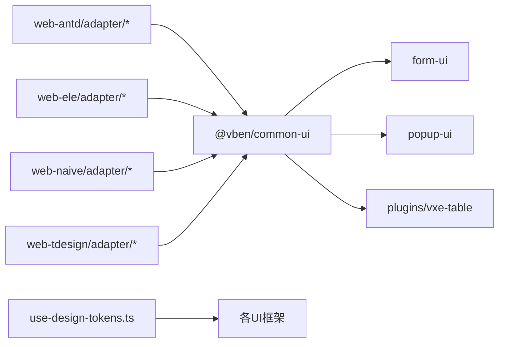

# UI组件

<cite>
**本文引用的文件**
- [vben-form.md](file://docs/src/components/common-ui/vben-form.md)
- [vben-vxe-table.md](file://docs/src/components/common-ui/vben-vxe-table.md)
- [vben-count-to-animator.md](file://docs/src/components/common-ui/vben-count-to-animator.md)
- [vben-ellipsis-text.md](file://docs/src/components/common-ui/vben-ellipsis-text.md)
- [theme.md](file://docs/src/guide/in-depth/theme.md)
- [index.ts](file://packages/@core/ui-kit/popup-ui/src/index.ts)
- [index.ts](file://packages/@core/ui-kit/popup-ui/src/modal/index.ts)
- [index.ts](file://packages/@core/ui-kit/popup-ui/src/drawer/index.ts)
- [index.ts](file://packages/@core/ui-kit/popup-ui/src/alert/index.ts)
- [form-field.vue](file://packages/@core/ui-kit/form-ui/src/form-render/form-field.vue)
- [drawer.vue](file://apps/web-antd/src/views/system/user/drawer.vue)
- [adapter-component-index.ts](file://apps/web-antd/src/adapter/component/index.ts)
- [adapter-component-index.ts](file://apps/web-ele/src/adapter/component/index.ts)
- [adapter-component-index.ts](file://apps/web-tdesign/src/adapter/component/index.ts)
- [adapter-form-antd.ts](file://apps/web-antd/src/adapter/form.ts)
- [adapter-form-ele.ts](file://apps/web-ele/src/adapter/form.ts)
- [adapter-form-tdesign.ts](file://apps/web-tdesign/src/adapter/form.ts)
- [adapter-vxe-table-antd.ts](file://apps/web-antd/src/adapter/vxe-table.ts)
- [adapter-vxe-table-ele.ts](file://apps/web-ele/src/adapter/vxe-table.ts)
- [adapter-vxe-table-tdesign.ts](file://apps/web-tdesign/src/adapter/vxe-table.ts)
- [adapter-naive.ts](file://apps/web-naive/src/adapter/naive.ts)
- [adapter-tdesign.ts](file://apps/web-tdesign/src/adapter/tdesign.ts)
- [use-design-tokens.ts](file://packages/effects/hooks/src/use-design-tokens.ts)
</cite>

## 目录
1. [简介](#简介)
2. [项目结构](#项目结构)
3. [核心组件](#核心组件)
4. [架构总览](#架构总览)
5. [组件详解](#组件详解)
6. [依赖关系分析](#依赖关系分析)
7. [性能考量](#性能考量)
8. [故障排查指南](#故障排查指南)
9. [结论](#结论)
10. [附录](#附录)

## 简介
本文件系统性梳理 Vben Admin 内置通用 UI 组件，覆盖表单、表格、弹窗与抽屉、提示与确认、省略文本、数字动画等常用组件。文档从架构、API、属性与事件、样式与主题、可访问性与无障碍、扩展与自定义、性能与兼容性等方面进行说明，并提供示例与最佳实践指引。

## 项目结构
- 通用 UI 组件与适配层分布于多套前端框架（Ant Design Vue、Element Plus、Naive UI、TDesign）的应用适配目录中，统一通过各自的 adapter 层桥接底层 UI 库与通用组件。
- 通用组件能力由核心包提供，如表单渲染、弹窗/抽屉/提示等 popup-ui，以及基于 vxe-table 的 vben-vxe-table 封装。
- 主题体系基于 CSS 变量与 Tailwind 实用类，支持多主题切换与深浅模式。

图表来源
- [adapter-form-antd.ts](file://apps/web-antd/src/adapter/form.ts)
- [adapter-vxe-table-antd.ts](file://apps/web-antd/src/adapter/vxe-table.ts)
- [adapter-component-index.ts](file://apps/web-antd/src/adapter/component/index.ts)
- [index.ts](file://packages/@core/ui-kit/popup-ui/src/index.ts)
- [form-field.vue](file://packages/@core/ui-kit/form-ui/src/form-render/form-field.vue)

章节来源
- [adapter-form-antd.ts](file://apps/web-antd/src/adapter/form.ts)
- [adapter-vxe-table-antd.ts](file://apps/web-antd/src/adapter/vxe-table.ts)
- [adapter-component-index.ts](file://apps/web-antd/src/adapter/component/index.ts)
- [index.ts](file://packages/@core/ui-kit/popup-ui/src/index.ts)
- [form-field.vue](file://packages/@core/ui-kit/form-ui/src/form-render/form-field.vue)

## 核心组件
- 表单组件：基于 vee-validate 的通用表单，支持多 UI 框架适配，提供 schema 驱动的表单项、联动、校验、动态渲染与默认动作。
- 表格组件：基于 vxe-table 的二次封装，提供搜索表单联动、远程加载、树形、固定列、自定义渲染器、单元格/行编辑、虚拟滚动等。
- 弹窗与抽屉：统一的弹窗/抽屉 API 与默认属性管理，支持确认/取消流程与数据透传。
- 提示与确认：统一的 alert/confirm/prompt 构建器，支持上下文与默认配置。
- 省略文本：超长文本省略、Tooltip 提示、点击展开/收起。
- 数字动画：数字滚动动画，支持前缀/后缀/千分位/小数位/过渡预设等。

章节来源
- [vben-form.md](file://docs/src/components/common-ui/vben-form.md)
- [vben-vxe-table.md](file://docs/src/components/common-ui/vben-vxe-table.md)
- [vben-ellipsis-text.md](file://docs/src/components/common-ui/vben-ellipsis-text.md)
- [vben-count-to-animator.md](file://docs/src/components/common-ui/vben-count-to-animator.md)
- [index.ts](file://packages/@core/ui-kit/popup-ui/src/index.ts)

## 架构总览
- 适配器模式：各应用在 adapter 中完成 UI 框架组件映射、默认属性与消息提示的桥接，通用组件通过共享状态与全局注册使用。
- 组件导出：通用组件通过 index 导出统一 API，如 useVbenForm、useVbenVxeGrid、useVbenModal、useVbenDrawer、Alert 等。
- 主题与设计令牌：通过 CSS 变量与 hooks 将主题色、边框、圆角等注入到不同 UI 框架的组件系统。

图表来源
- [adapter-component-index.ts](file://apps/web-antd/src/adapter/component/index.ts)
- [adapter-form-antd.ts](file://apps/web-antd/src/adapter/form.ts)
- [index.ts](file://packages/@core/ui-kit/popup-ui/src/index.ts)

章节来源
- [adapter-component-index.ts](file://apps/web-antd/src/adapter/component/index.ts)
- [adapter-form-antd.ts](file://apps/web-antd/src/adapter/form.ts)
- [index.ts](file://packages/@core/ui-kit/popup-ui/src/index.ts)

## 组件详解

### 表单组件（Vben Form）
- 适配器：每套 UI 框架提供 form 与 component 适配器，定义模型属性名、空值、占位符、默认按钮、消息提示等。
- Schema 驱动：通过 schema 描述字段类型、默认值、联动、规则、渲染内容等。
- API：表单 API 提供提交、重置、校验、动态更新 schema、获取/设置值、状态读取等。
- 事件与回调：handleSubmit、handleReset、handleValuesChange、handleCollapsedChange 等。
- 最佳实践：合理使用 dependencies 触发联动；通过 commonConfig 统一组件属性；使用 zod 进行复杂规则校验；在查询表单中避免不必要的实时校验。

图表来源
- [vben-form.md](file://docs/src/components/common-ui/vben-form.md)
- [adapter-form-antd.ts](file://apps/web-antd/src/adapter/form.ts)
- [adapter-form-ele.ts](file://apps/web-ele/src/adapter/form.ts)
- [adapter-form-tdesign.ts](file://apps/web-tdesign/src/adapter/form.ts)

章节来源
- [vben-form.md](file://docs/src/components/common-ui/vben-form.md)
- [adapter-form-antd.ts](file://apps/web-antd/src/adapter/form.ts)
- [adapter-form-ele.ts](file://apps/web-ele/src/adapter/form.ts)
- [adapter-form-tdesign.ts](file://apps/web-tdesign/src/adapter/form.ts)

### 表格组件（Vben Vxe Table）
- 适配器：在 adapter 中配置 vxe-table 默认行为、代理加载、渲染器等。
- 搜索表单：与 Vben Form 集成，支持 formOptions 与工具栏搜索面板。
- 编辑：支持单元格与行编辑模式，结合表单联动实现复杂编辑场景。
- 性能：通过虚拟滚动与代理加载优化大数据集体验。
- 最佳实践：合理设置 proxyConfig.response 字段映射；为图片/链接等自定义渲染器；在树形数据中使用 treeConfig；在固定列场景下注意横向滚动与布局。

图表来源
- [vben-vxe-table.md](file://docs/src/components/common-ui/vben-vxe-table.md)
- [adapter-vxe-table-antd.ts](file://apps/web-antd/src/adapter/vxe-table.ts)
- [adapter-vxe-table-ele.ts](file://apps/web-ele/src/adapter/vxe-table.ts)
- [adapter-vxe-table-tdesign.ts](file://apps/web-tdesign/src/adapter/vxe-table.ts)

章节来源
- [vben-vxe-table.md](file://docs/src/components/common-ui/vben-vxe-table.md)
- [adapter-vxe-table-antd.ts](file://apps/web-antd/src/adapter/vxe-table.ts)
- [adapter-vxe-table-ele.ts](file://apps/web-ele/src/adapter/vxe-table.ts)
- [adapter-vxe-table-tdesign.ts](file://apps/web-tdesign/src/adapter/vxe-table.ts)

### 弹窗与抽屉（Popup UI）
- 统一导出：modal、drawer、alert 的类型与 API 通过 index 导出，便于跨框架复用。
- 默认属性：setDefaultModalProps/setDefaultDrawerProps 提供全局默认配置。
- 使用示例：在视图中通过 useVbenDrawer/useVbenModal 获取组件与 API，结合表单进行增删改查操作。

图表来源
- [index.ts](file://packages/@core/ui-kit/popup-ui/src/index.ts)
- [index.ts](file://packages/@core/ui-kit/popup-ui/src/modal/index.ts)
- [index.ts](file://packages/@core/ui-kit/popup-ui/src/drawer/index.ts)
- [index.ts](file://packages/@core/ui-kit/popup-ui/src/alert/index.ts)
- [drawer.vue](file://apps/web-antd/src/views/system/user/drawer.vue)

章节来源
- [index.ts](file://packages/@core/ui-kit/popup-ui/src/index.ts)
- [index.ts](file://packages/@core/ui-kit/popup-ui/src/modal/index.ts)
- [index.ts](file://packages/@core/ui-kit/popup-ui/src/drawer/index.ts)
- [index.ts](file://packages/@core/ui-kit/popup-ui/src/alert/index.ts)
- [drawer.vue](file://apps/web-antd/src/views/system/user/drawer.vue)

### 提示与确认（Alert/Confirm/Prompt）
- 构建器：vbenAlert/vbenConfirm/vbenPrompt 提供链式调用与默认配置。
- 上下文：useAlertContext 提供上下文注入，便于统一风格与行为。
- 最佳实践：区分 alert/confirm/prompt 的使用场景；在 confirm 中提供明确的二次确认文案；统一消息提示风格。

章节来源
- [index.ts](file://packages/@core/ui-kit/popup-ui/src/alert/index.ts)

### 省略文本（EllipsisText）
- 功能：超长文本省略、Tooltip 提示、点击展开/收起。
- 参数：line、maxWidth、placement、tooltip、tooltipWhenEllipsis 等。
- 最佳实践：在列表/卡片中合理设置 maxWidth 与 line；仅在必要时启用 tooltip；通过 expand 支持用户查看更多。

章节来源
- [vben-ellipsis-text.md](file://docs/src/components/common-ui/vben-ellipsis-text.md)

### 数字动画（CountToAnimator）
- 功能：数字滚动动画，支持前缀/后缀/千分位/小数位/过渡预设。
- 参数：startVal、endVal、duration、autoplay、prefix/suffix/separator/decimal/color/useEasing/transition/decimals。
- 最佳实践：在统计/仪表盘场景中使用；合理设置 duration 与过渡预设；通过事件监听动画开始/结束。

章节来源
- [vben-count-to-animator.md](file://docs/src/components/common-ui/vben-count-to-animator.md)

## 依赖关系分析
- 适配器依赖：各应用适配器依赖对应 UI 框架组件库，并向通用组件注册组件映射与默认行为。
- 通用组件依赖：通用表单渲染依赖组件映射与依赖计算；弹窗/抽屉依赖统一 API；表格依赖 vxe-table 与表单适配器。
- 主题依赖：主题变量通过 CSS 变量注入，hooks 将其转换为各 UI 框架的 token。

图表来源
- [adapter-component-index.ts](file://apps/web-antd/src/adapter/component/index.ts)
- [adapter-form-antd.ts](file://apps/web-antd/src/adapter/form.ts)
- [adapter-vxe-table-antd.ts](file://apps/web-antd/src/adapter/vxe-table.ts)
- [use-design-tokens.ts](file://packages/effects/hooks/src/use-design-tokens.ts)

章节来源
- [adapter-component-index.ts](file://apps/web-antd/src/adapter/component/index.ts)
- [adapter-form-antd.ts](file://apps/web-antd/src/adapter/form.ts)
- [adapter-vxe-table-antd.ts](file://apps/web-antd/src/adapter/vxe-table.ts)
- [use-design-tokens.ts](file://packages/effects/hooks/src/use-design-tokens.ts)

## 性能考量
- 表格性能：通过 vxe-table 的代理加载与虚拟滚动优化大数据渲染；合理设置 proxyConfig.response 字段映射，减少前端数据转换成本。
- 表单性能：在查询表单中避免频繁校验；使用 submitOnChange 时注意防抖；在联动场景中仅对必要字段进行依赖计算。
- 动画性能：数字动画 duration 与过渡预设需平衡视觉与性能；在移动端谨慎使用复杂过渡。
- 主题性能：CSS 变量与 hooks 的主题注入应避免频繁重绘；尽量批量更新主题变量。

## 故障排查指南
- 表单联动无效：检查 dependencies 的 triggerFields 是否正确；确认联动函数返回值与条件逻辑。
- 校验不生效：确认 schema.rules 的类型与 zod 规则；检查适配器中 required/selectRequired 的国际化消息是否正确。
- 表格数据不更新：检查 proxyConfig.ajax.query 的请求参数与响应映射；确认 gridOptions 的变更是否触发重载。
- 弹窗/抽屉无法关闭：检查 onConfirm 中的异步流程与 lock/unlock 的配对使用；确保在异常分支正确解锁。
- 主题不生效：确认 CSS 变量覆盖顺序与深浅模式选择；检查 hooks 中主题变量的读取与转换。

章节来源
- [vben-form.md](file://docs/src/components/common-ui/vben-form.md)
- [vben-vxe-table.md](file://docs/src/components/common-ui/vben-vxe-table.md)
- [drawer.vue](file://apps/web-antd/src/views/system/user/drawer.vue)

## 结论
Vben Admin 的通用 UI 组件通过适配器模式实现了多 UI 框架的一致体验，配合主题系统与完善的 API，既保证了易用性，又提供了足够的扩展空间。建议在实际项目中遵循 schema 驱动、按需联动、统一主题与消息提示的最佳实践，以获得稳定、可维护且高性能的界面体验。

## 附录

### 主题与样式定制
- CSS 变量：通过覆盖默认主题变量实现品牌色、背景、前景、边框、圆角等定制。
- 内置主题：支持 default、violet、pink、rose、sky-blue、deep-blue、green、deep-green、orange、yellow、zinc、neutral、slate、gray 等主题类型。
- 设计令牌：hooks 将 CSS 变量转换为各 UI 框架的 token，确保组件风格一致。

章节来源
- [theme.md](file://docs/src/guide/in-depth/theme.md)
- [use-design-tokens.ts](file://packages/effects/hooks/src/use-design-tokens.ts)

### 组件 API 参考（摘要）
- 表单 API：submitForm、validateAndSubmitForm、resetForm、setValues/getValues、validate/validateField/isFieldValid、resetValidate、updateSchema、setFieldValue、setState/getState、form、getFieldComponentRef、getFocusedField。
- 表格 API：setLoading、setGridOptions、reload/query、grid、formApi、toggleSearchForm。
- 弹窗/抽屉 API：通过 useVbenModal/useVbenDrawer 获取组件与默认属性设置。
- 提示 API：通过 alert/confirm/prompt 构建器与 useAlertContext。

章节来源
- [vben-form.md](file://docs/src/components/common-ui/vben-form.md)
- [vben-vxe-table.md](file://docs/src/components/common-ui/vben-vxe-table.md)
- [index.ts](file://packages/@core/ui-kit/popup-ui/src/modal/index.ts)
- [index.ts](file://packages/@core/ui-kit/popup-ui/src/drawer/index.ts)
- [index.ts](file://packages/@core/ui-kit/popup-ui/src/alert/index.ts)