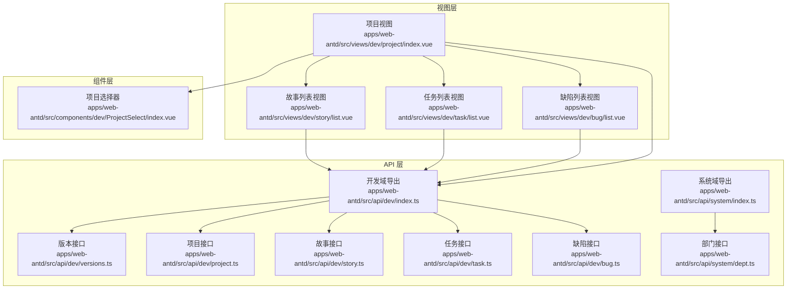
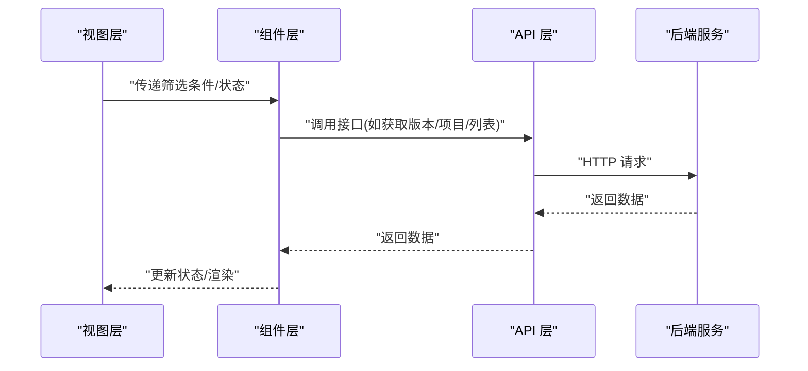
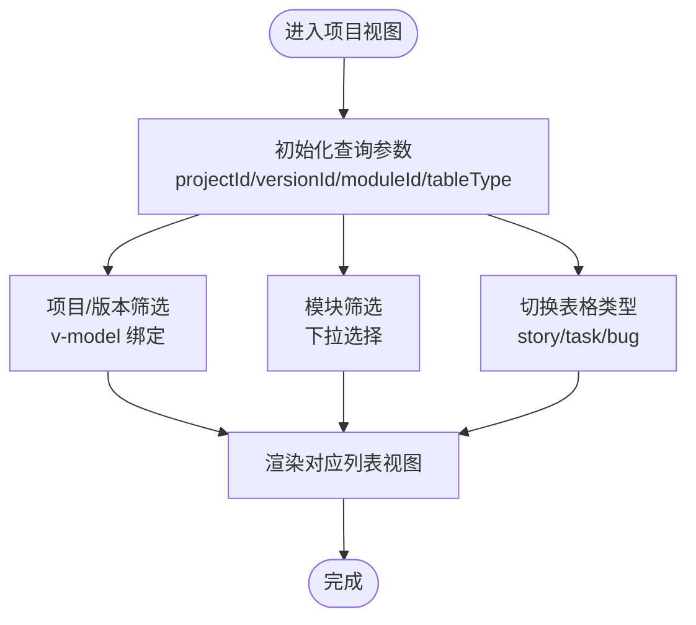
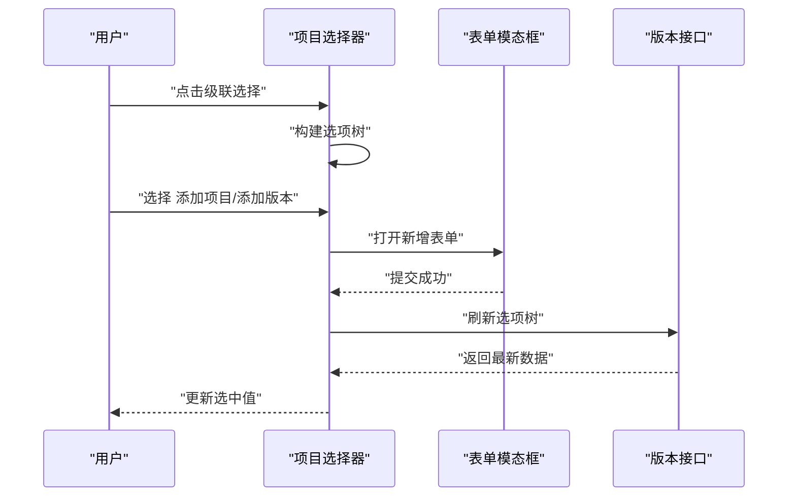
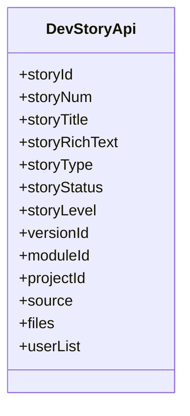
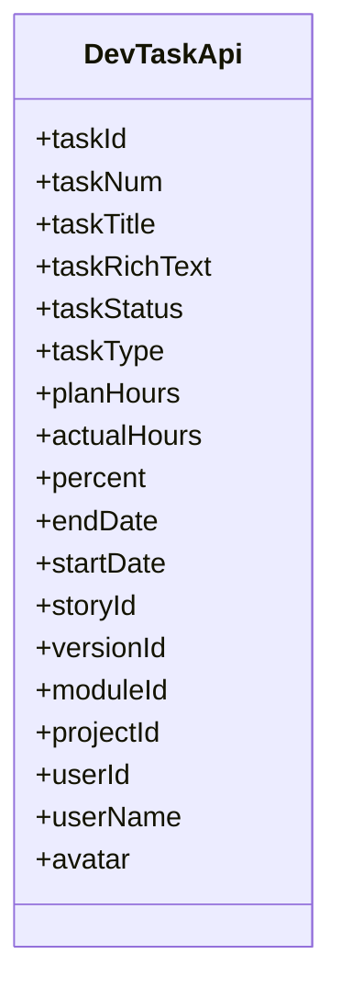
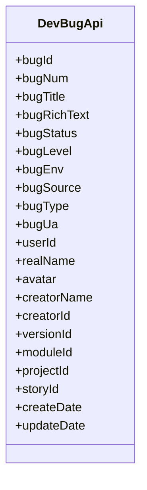
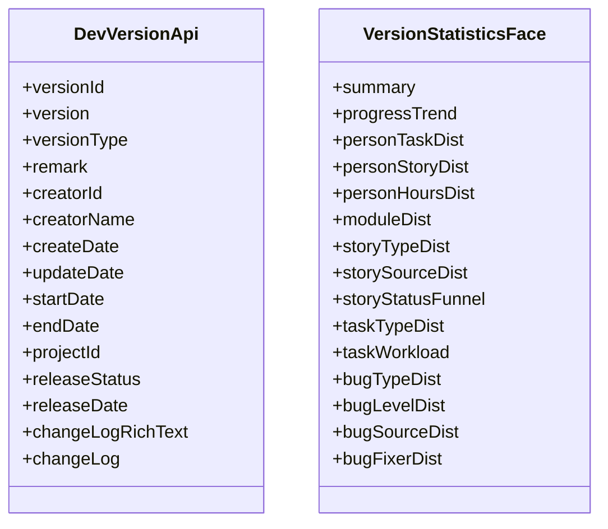
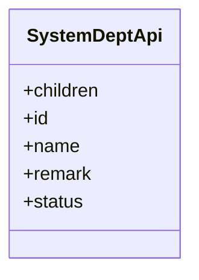
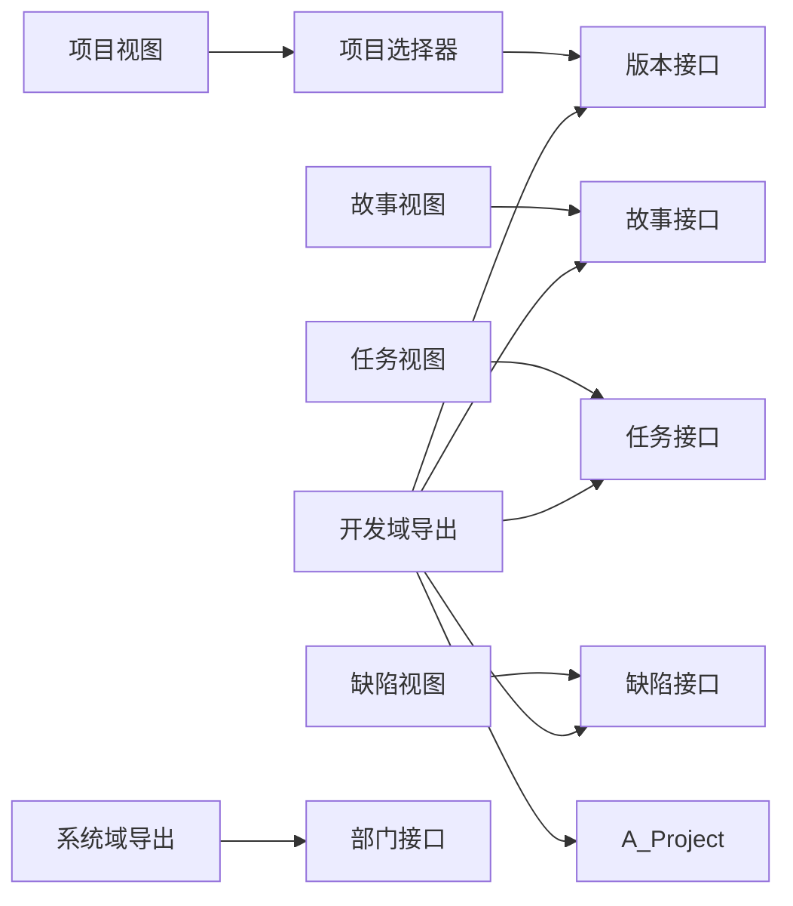

# 业务组件

<cite>
**本文引用的文件**
- [apps/web-antd/src/views/dev/project/index.vue](file://apps/web-antd/src/views/dev/project/index.vue)
- [apps/web-antd/src/components/dev/ProjectSelect/index.vue](file://apps/web-antd/src/components/dev/ProjectSelect/index.vue)
- [apps/web-antd/src/views/dev/story/list.vue](file://apps/web-antd/src/views/dev/story/list.vue)
- [apps/web-antd/src/views/dev/task/list.vue](file://apps/web-antd/src/views/dev/task/list.vue)
- [apps/web-antd/src/views/dev/bug/list.vue](file://apps/web-antd/src/views/dev/bug/list.vue)
- [apps/web-antd/src/api/dev/index.ts](file://apps/web-antd/src/api/dev/index.ts)
- [apps/web-antd/src/api/dev/versions.ts](file://apps/web-antd/src/api/dev/versions.ts)
- [apps/web-antd/src/api/dev/project.ts](file://apps/web-antd/src/api/dev/project.ts)
- [apps/web-antd/src/api/dev/story.ts](file://apps/web-antd/src/api/dev/story.ts)
- [apps/web-antd/src/api/dev/task.ts](file://apps/web-antd/src/api/dev/task.ts)
- [apps/web-antd/src/api/dev/bug.ts](file://apps/web-antd/src/api/dev/bug.ts)
- [apps/web-antd/src/api/system/index.ts](file://apps/web-antd/src/api/system/index.ts)
- [apps/web-antd/src/api/system/dept.ts](file://apps/web-antd/src/api/system/dept.ts)
</cite>

## 目录

1. [引言](#引言)
2. [项目结构](#项目结构)
3. [核心组件](#核心组件)
4. [架构总览](#架构总览)
5. [详细组件分析](#详细组件分析)
6. [依赖分析](#依赖分析)
7. [性能考虑](#性能考虑)
8. [故障排查指南](#故障排查指南)
9. [结论](#结论)
10. [附录](#附录)

## 引言

本文件面向业务组件的综合文档，聚焦于缺陷管理、项目管理、故事管理、任务管理、版本管理、系统管理与仪表板等业务模块。内容涵盖数据模型、状态管理、业务逻辑、配置项、API 接口、事件处理机制、组件间数据流转与交互关系，并提供扩展与自定义开发指南及最佳实践。

## 项目结构

围绕业务组件的前端组织采用“视图层 + 组件层 + API 层”的分层设计：

- 视图层：负责页面级编排与状态聚合，如项目看板视图。
- 组件层：可复用的业务 UI 组件，如项目选择器。
- API 层：按业务域划分的接口封装，统一通过请求客户端调用后端服务。

图表来源

- [apps/web-antd/src/views/dev/project/index.vue:1-154](file://apps/web-antd/src/views/dev/project/index.vue#L1-L154)
- [apps/web-antd/src/components/dev/ProjectSelect/index.vue:1-136](file://apps/web-antd/src/components/dev/ProjectSelect/index.vue#L1-L136)
- [apps/web-antd/src/views/dev/story/list.vue](file://apps/web-antd/src/views/dev/story/list.vue)
- [apps/web-antd/src/views/dev/task/list.vue](file://apps/web-antd/src/views/dev/task/list.vue)
- [apps/web-antd/src/views/dev/bug/list.vue](file://apps/web-antd/src/views/dev/bug/list.vue)
- [apps/web-antd/src/api/dev/index.ts:1-8](file://apps/web-antd/src/api/dev/index.ts#L1-L8)
- [apps/web-antd/src/api/system/index.ts:1-6](file://apps/web-antd/src/api/system/index.ts#L1-L6)
- [apps/web-antd/src/api/dev/versions.ts:1-145](file://apps/web-antd/src/api/dev/versions.ts#L1-L145)
- [apps/web-antd/src/api/dev/project.ts:1-49](file://apps/web-antd/src/api/dev/project.ts#L1-L49)
- [apps/web-antd/src/api/dev/story.ts:1-91](file://apps/web-antd/src/api/dev/story.ts#L1-L91)
- [apps/web-antd/src/api/dev/task.ts:1-103](file://apps/web-antd/src/api/dev/task.ts#L1-L103)
- [apps/web-antd/src/api/dev/bug.ts:1-104](file://apps/web-antd/src/api/dev/bug.ts#L1-L104)
- [apps/web-antd/src/api/system/dept.ts:1-53](file://apps/web-antd/src/api/system/dept.ts#L1-L53)

章节来源

- [apps/web-antd/src/views/dev/project/index.vue:1-154](file://apps/web-antd/src/views/dev/project/index.vue#L1-L154)
- [apps/web-antd/src/components/dev/ProjectSelect/index.vue:1-136](file://apps/web-antd/src/components/dev/ProjectSelect/index.vue#L1-L136)
- [apps/web-antd/src/api/dev/index.ts:1-8](file://apps/web-antd/src/api/dev/index.ts#L1-L8)
- [apps/web-antd/src/api/system/index.ts:1-6](file://apps/web-antd/src/api/system/index.ts#L1-L6)

## 核心组件

- 项目视图（项目看板）：聚合项目筛选、模块筛选、故事/任务/缺陷三类表格视图切换，作为业务主入口。
- 项目选择器：级联选择项目与版本，支持“添加项目/版本”快捷入口。
- 故事/任务/缺陷列表视图：承载对应实体的增删改查与统计能力。
- 开发域 API 导出：集中导出版本、项目、模块、故事、任务、缺陷、变更等接口。
- 系统域 API 导出：集中导出部门、菜单、角色、用户、字典等接口。

章节来源

- [apps/web-antd/src/views/dev/project/index.vue:1-154](file://apps/web-antd/src/views/dev/project/index.vue#L1-L154)
- [apps/web-antd/src/components/dev/ProjectSelect/index.vue:1-136](file://apps/web-antd/src/components/dev/ProjectSelect/index.vue#L1-L136)
- [apps/web-antd/src/api/dev/index.ts:1-8](file://apps/web-antd/src/api/dev/index.ts#L1-L8)
- [apps/web-antd/src/api/system/index.ts:1-6](file://apps/web-antd/src/api/system/index.ts#L1-L6)

## 架构总览

业务组件遵循“视图-组件-API-后端”的调用链路，视图层通过 props/v-model 与事件与组件交互；组件层通过 API 层发起网络请求；API 层以命名空间定义数据模型与接口契约，便于维护与扩展。

图表来源

- [apps/web-antd/src/views/dev/project/index.vue:1-154](file://apps/web-antd/src/views/dev/project/index.vue#L1-L154)
- [apps/web-antd/src/components/dev/ProjectSelect/index.vue:1-136](file://apps/web-antd/src/components/dev/ProjectSelect/index.vue#L1-L136)
- [apps/web-antd/src/api/dev/versions.ts:78-144](file://apps/web-antd/src/api/dev/versions.ts#L78-L144)
- [apps/web-antd/src/api/dev/project.ts:18-48](file://apps/web-antd/src/api/dev/project.ts#L18-L48)
- [apps/web-antd/src/api/dev/story.ts:49-90](file://apps/web-antd/src/api/dev/story.ts#L49-L90)
- [apps/web-antd/src/api/dev/task.ts:42-102](file://apps/web-antd/src/api/dev/task.ts#L42-L102)
- [apps/web-antd/src/api/dev/bug.ts:60-103](file://apps/web-antd/src/api/dev/bug.ts#L60-L103)

## 详细组件分析

### 项目视图（项目看板）

- 功能定位：聚合项目筛选、模块筛选、故事/任务/缺陷三类表格视图切换。
- 关键状态：
  - 项目与版本：通过 v-model 双向绑定到项目选择器。
  - 模块：下拉选择模块标识。
  - 表格类型：通过分段控制器在 story/task/bug 之间切换。
- 交互流程：
  - 用户选择项目/版本或模块，视图层更新查询参数。
  - 根据当前表格类型动态渲染对应列表视图。
- 扩展建议：
  - 将查询参数持久化至本地存储或路由查询参数，提升用户体验。
  - 增加“重置筛选”按钮与默认值策略。

图表来源

- [apps/web-antd/src/views/dev/project/index.vue:15-58](file://apps/web-antd/src/views/dev/project/index.vue#L15-L58)

章节来源

- [apps/web-antd/src/views/dev/project/index.vue:1-154](file://apps/web-antd/src/views/dev/project/index.vue#L1-L154)

### 项目选择器（级联）

- 功能定位：级联选择项目与版本，支持“添加项目/版本”快捷入口。
- 关键属性：
  - showAddProject：是否在顶层显示“添加项目”选项。
  - showAddVersion：是否在每个项目节点前插入“添加版本”选项。
- 关键事件：
  - update:projectId / update:versionId：向外抛出选中值。
  - change：整体变更回调。
- 交互流程：
  - 初始化时构建级联选项树。
  - 用户选择“添加项目/版本”时，打开表单模态框。
  - 模态框关闭并销毁后重新初始化选项树。

图表来源

- [apps/web-antd/src/components/dev/ProjectSelect/index.vue:14-136](file://apps/web-antd/src/components/dev/ProjectSelect/index.vue#L14-L136)
- [apps/web-antd/src/api/dev/versions.ts:78-144](file://apps/web-antd/src/api/dev/versions.ts#L78-L144)

章节来源

- [apps/web-antd/src/components/dev/ProjectSelect/index.vue:1-136](file://apps/web-antd/src/components/dev/ProjectSelect/index.vue#L1-L136)

### 故事管理（Story）

- 数据模型要点：
  - 关联字段：版本、模块、项目、父级需求。
  - 状态与类型：故事状态、类型、来源等枚举字段。
  - 文件与富文本：支持富文本描述与附件。
- 关键接口：
  - 列表查询、详情查询、创建、更新。
- 业务逻辑：
  - 支持按版本/模块/项目/状态等多维筛选。
  - 支持关联任务/缺陷的联动查询（通过 storyId）。

图表来源

- [apps/web-antd/src/api/dev/story.ts:11-42](file://apps/web-antd/src/api/dev/story.ts#L11-L42)

章节来源

- [apps/web-antd/src/api/dev/story.ts:1-91](file://apps/web-antd/src/api/dev/story.ts#L1-L91)

### 任务管理（Task）

- 数据模型要点：
  - 关联字段：需求、版本、模块、项目。
  - 工时与进度：计划工时、实际工时、进度百分比。
  - 执行人：负责人、姓名、头像。
- 关键接口：
  - 列表查询（含分页）、详情查询、创建、更新。
  - 按需求查询任务列表。
- 业务逻辑：
  - 进度与工时统计可用于看板与报表。
  - 与故事的父子关系明确，便于追踪执行路径。

图表来源

- [apps/web-antd/src/api/dev/task.ts:4-35](file://apps/web-antd/src/api/dev/task.ts#L4-L35)

章节来源

- [apps/web-antd/src/api/dev/task.ts:1-103](file://apps/web-antd/src/api/dev/task.ts#L1-L103)

### 缺陷管理（Bug）

- 数据模型要点：
  - 关联字段：版本、模块、项目、需求。
  - 状态与等级：缺陷状态、等级、来源、类型。
  - 修复人：修复人 ID、姓名、头像。
- 关键接口：
  - 列表查询、详情查询、创建、更新。
  - 按需求查询缺陷列表。
- 业务逻辑：
  - 与任务/故事形成闭环，便于质量追踪。
  - 可结合版本发布状态进行修复率统计。

图表来源

- [apps/web-antd/src/api/dev/bug.ts:4-58](file://apps/web-antd/src/api/dev/bug.ts#L4-L58)

章节来源

- [apps/web-antd/src/api/dev/bug.ts:1-104](file://apps/web-antd/src/api/dev/bug.ts#L1-L104)

### 版本管理（Version）

- 数据模型要点：
  - 基础信息：版本号、开始/结束日期、发布状态、变更日志。
  - 统计指标：故事/任务/缺陷总量与完成数、进度趋势、人员分布、模块分布等。
- 关键接口：
  - 列表查询、详情查询、创建、更新、获取最新版本、获取统计。
- 业务逻辑：
  - 统计面板用于版本健康度评估与汇报。
  - 变更日志支持富文本编辑与归档。

图表来源

- [apps/web-antd/src/api/dev/versions.ts:4-71](file://apps/web-antd/src/api/dev/versions.ts#L4-L71)

章节来源

- [apps/web-antd/src/api/dev/versions.ts:1-145](file://apps/web-antd/src/api/dev/versions.ts#L1-L145)

### 系统管理（部门）

- 数据模型要点：
  - 树形结构：支持 children 字段表达层级关系。
  - 状态：启用/停用。
- 关键接口：
  - 列表查询、创建、更新、删除。
- 业务逻辑：
  - 与用户/角色权限体系配合，支撑组织架构管理。

图表来源

- [apps/web-antd/src/api/system/dept.ts:3-12](file://apps/web-antd/src/api/system/dept.ts#L3-L12)

章节来源

- [apps/web-antd/src/api/system/dept.ts:1-53](file://apps/web-antd/src/api/system/dept.ts#L1-L53)

## 依赖分析

- 视图层对组件层的依赖：项目视图依赖项目选择器进行筛选。
- 组件层对 API 层的依赖：项目选择器依赖版本接口进行数据刷新。
- 视图层对 API 层的依赖：故事/任务/缺陷视图分别依赖对应接口。
- API 层内部依赖：开发域与系统域各自导出文件统一聚合。

图表来源

- [apps/web-antd/src/views/dev/project/index.vue:1-154](file://apps/web-antd/src/views/dev/project/index.vue#L1-L154)
- [apps/web-antd/src/components/dev/ProjectSelect/index.vue:1-136](file://apps/web-antd/src/components/dev/ProjectSelect/index.vue#L1-L136)
- [apps/web-antd/src/api/dev/index.ts:1-8](file://apps/web-antd/src/api/dev/index.ts#L1-L8)
- [apps/web-antd/src/api/system/index.ts:1-6](file://apps/web-antd/src/api/system/index.ts#L1-L6)
- [apps/web-antd/src/api/dev/versions.ts:1-145](file://apps/web-antd/src/api/dev/versions.ts#L1-L145)
- [apps/web-antd/src/api/dev/story.ts:1-91](file://apps/web-antd/src/api/dev/story.ts#L1-L91)
- [apps/web-antd/src/api/dev/task.ts:1-103](file://apps/web-antd/src/api/dev/task.ts#L1-L103)
- [apps/web-antd/src/api/dev/bug.ts:1-104](file://apps/web-antd/src/api/dev/bug.ts#L1-L104)
- [apps/web-antd/src/api/system/dept.ts:1-53](file://apps/web-antd/src/api/system/dept.ts#L1-L53)

章节来源

- [apps/web-antd/src/api/dev/index.ts:1-8](file://apps/web-antd/src/api/dev/index.ts#L1-L8)
- [apps/web-antd/src/api/system/index.ts:1-6](file://apps/web-antd/src/api/system/index.ts#L1-L6)

## 性能考虑

- 列表查询分页与筛选：优先使用分页接口，避免一次性加载大量数据。
- 级联选择缓存：项目/版本级联选项可在切换时缓存，减少重复初始化开销。
- 图表与统计：版本统计接口返回的聚合数据应按需请求，避免重复计算。
- 事件节流：在高频筛选场景（如输入框实时搜索）建议加入防抖/节流。
- 懒加载：列表视图可采用虚拟滚动或懒加载策略，降低 DOM 压力。

## 故障排查指南

- 接口 401/403：检查登录态与权限校验，确认拦截器与守卫配置。
- 网络超时：增加重试与降级提示，记录失败请求与参数以便复现。
- 级联选择异常：确认选项树构建逻辑与“添加项目/版本”分支处理。
- 统计数据为空：确认版本 ID 传参正确，后端统计接口是否已生成数据。
- 表单提交失败：检查必填字段与后端校验规则，提供明确错误提示。

## 结论

本文梳理了 Vben Admin 中缺陷管理、项目管理、故事管理、任务管理、版本管理、系统管理与仪表板相关的业务组件与 API，明确了数据模型、状态管理与业务逻辑，并给出了依赖关系、性能优化与故障排查建议。基于此，团队可快速扩展新功能、定制化界面与集成更多业务场景。

## 附录

### API 接口一览（开发域）

- 版本
  - 列表：GET /dev/versions/list
  - 详情：GET /dev/versions/get
  - 新增：POST /dev/versions
  - 更新：PUT /dev/versions/{id}
  - 最新版本：GET /dev/versions/getLastVersion
  - 统计：GET /dev/versions/statistics
- 项目
  - 列表：GET /dev/project/list
  - 新增：POST /dev/project
  - 更新：PUT /dev/project/{id}
- 故事
  - 列表：GET /dev/story/list
  - 新增：POST /dev/story
  - 更新：PUT /dev/story/{id}
  - 详情：GET /dev/story/get
- 任务
  - 列表：GET /dev/task/list
  - 新增：POST /dev/task
  - 更新：PUT /dev/task/{id}
  - 详情：GET /dev/task/get
  - 按需求查询：GET /dev/task/taskListByStoryId
- 缺陷
  - 列表：GET /dev/bug/list
  - 新增：POST /dev/bug
  - 更新：PUT /dev/bug/{id}
  - 详情：GET /dev/bug/get
  - 按需求查询：GET /dev/bug/bugListByStoryId

章节来源

- [apps/web-antd/src/api/dev/versions.ts:78-144](file://apps/web-antd/src/api/dev/versions.ts#L78-L144)
- [apps/web-antd/src/api/dev/project.ts:18-48](file://apps/web-antd/src/api/dev/project.ts#L18-L48)
- [apps/web-antd/src/api/dev/story.ts:49-90](file://apps/web-antd/src/api/dev/story.ts#L49-L90)
- [apps/web-antd/src/api/dev/task.ts:42-102](file://apps/web-antd/src/api/dev/task.ts#L42-L102)
- [apps/web-antd/src/api/dev/bug.ts:60-103](file://apps/web-antd/src/api/dev/bug.ts#L60-L103)

### API 接口一览（系统域）

- 部门
  - 列表：GET /system/dept/list
  - 新增：POST /system/dept
  - 更新：PUT /system/dept/{id}
  - 删除：DELETE /system/dept/{id}

章节来源

- [apps/web-antd/src/api/system/dept.ts:17-52](file://apps/web-antd/src/api/system/dept.ts#L17-L52)
