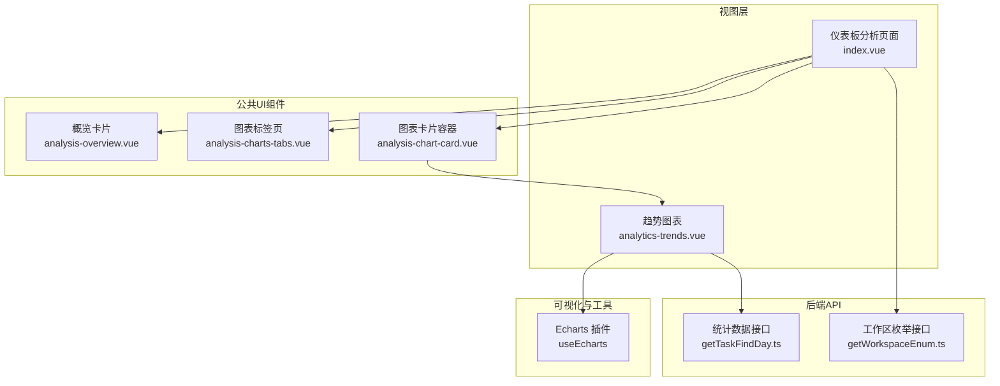
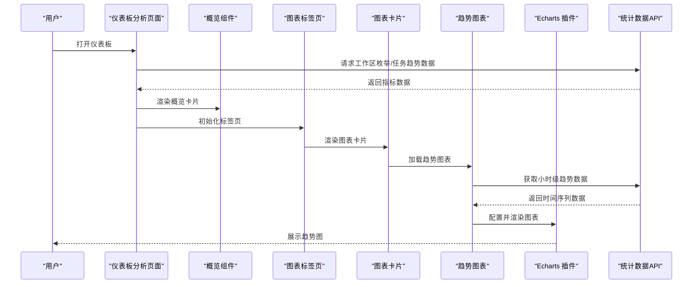
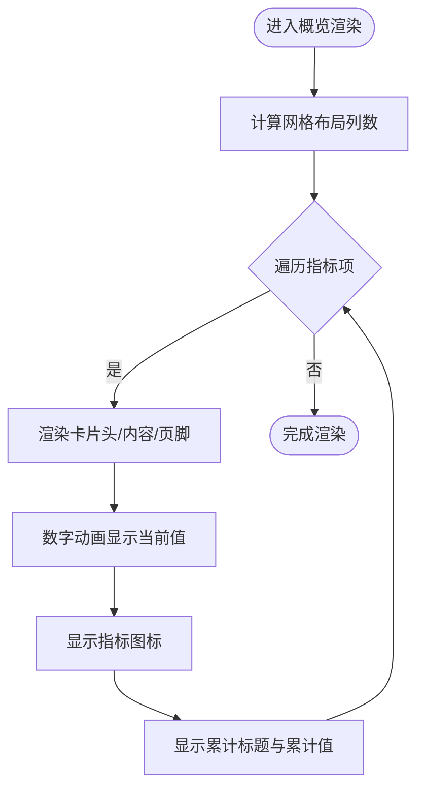
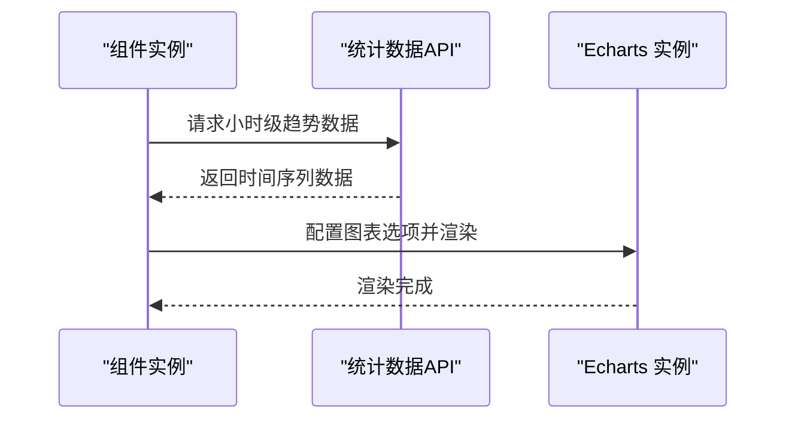
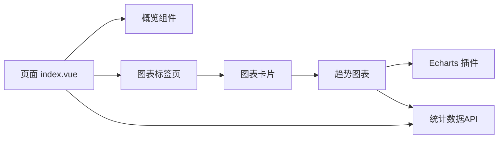

# 仪表板分析组件

<cite>
**本文引用的文件**
- [apps/web-antd/src/views/dashboard/analytics/index.vue](file://apps/web-antd/src/views/dashboard/analytics/index.vue)
- [apps/web-antd/src/views/dashboard/analytics/analytics-trends.vue](file://apps/web-antd/src/views/dashboard/analytics/analytics-trends.vue)
- [packages/effects/common-ui/src/ui/dashboard/analysis/index.ts](file://packages/effects/common-ui/src/ui/dashboard/analysis/index.ts)
- [packages/effects/common-ui/src/ui/dashboard/analysis/analysis-overview.vue](file://packages/effects/common-ui/src/ui/dashboard/analysis/analysis-overview.vue)
- [packages/effects/common-ui/src/ui/dashboard/analysis/analysis-charts-tabs.vue](file://packages/effects/common-ui/src/ui/dashboard/analysis/analysis-charts-tabs.vue)
- [packages/effects/common-ui/src/ui/dashboard/analysis/analysis-chart-card.vue](file://packages/effects/common-ui/src/ui/dashboard/analysis/analysis-chart-card.vue)
- [apps/backend-mock/api/statistics/dev/getTaskFindDay.ts](file://apps/backend-mock/api/statistics/dev/getTaskFindDay.ts)
- [apps/backend-mock/api/statistics/dev/getWorkspaceEnum.ts](file://apps/backend-mock/api/statistics/dev/getWorkspaceEnum.ts)
</cite>

## 目录
1. [简介](#简介)
2. [项目结构](#项目结构)
3. [核心组件](#核心组件)
4. [架构总览](#架构总览)
5. [详细组件分析](#详细组件分析)
6. [依赖分析](#依赖分析)
7. [性能考虑](#性能考虑)
8. [故障排查指南](#故障排查指南)
9. [结论](#结论)
10. [附录](#附录)

## 简介
本文件系统性梳理仪表板分析组件的设计与实现，覆盖工作台展示、访问统计、销售分析、来源分析、趋势图表等模块。重点阐述数据模型、统计计算逻辑、可视化渲染机制、配置项与API接口、图表配置参数以及实时数据更新策略，并给出扩展与自定义图表开发的最佳实践。

## 项目结构
仪表板分析页面位于多套UI框架适配中（Ant Design、Element Plus、Naive、TD Design、Antd Vue Next），统一通过公共UI包提供的分析组件进行组合。核心页面负责组织卡片、概览、图表标签页与子图表组件；各图表组件通过插件化方式接入可视化引擎，按需调用后端统计数据API。

**图表来源**
- [apps/web-antd/src/views/dashboard/analytics/index.vue:1-109](file://apps/web-antd/src/views/dashboard/analytics/index.vue#L1-L109)
- [apps/web-antd/src/views/dashboard/analytics/analytics-trends.vue:1-87](file://apps/web-antd/src/views/dashboard/analytics/analytics-trends.vue#L1-L87)
- [packages/effects/common-ui/src/ui/dashboard/analysis/analysis-overview.vue:1-56](file://packages/effects/common-ui/src/ui/dashboard/analysis/analysis-overview.vue#L1-L56)
- [packages/effects/common-ui/src/ui/dashboard/analysis/analysis-charts-tabs.vue:1-41](file://packages/effects/common-ui/src/ui/dashboard/analysis/analysis-charts-tabs.vue#L1-L41)
- [packages/effects/common-ui/src/ui/dashboard/analysis/analysis-chart-card.vue:1-25](file://packages/effects/common-ui/src/ui/dashboard/analysis/analysis-chart-card.vue#L1-L25)
- [apps/backend-mock/api/statistics/dev/getTaskFindDay.ts](file://apps/backend-mock/api/statistics/dev/getTaskFindDay.ts)
- [apps/backend-mock/api/statistics/dev/getWorkspaceEnum.ts](file://apps/backend-mock/api/statistics/dev/getWorkspaceEnum.ts)

**章节来源**
- [apps/web-antd/src/views/dashboard/analytics/index.vue:1-109](file://apps/web-antd/src/views/dashboard/analytics/index.vue#L1-L109)
- [packages/effects/common-ui/src/ui/dashboard/analysis/index.ts:1-3](file://packages/effects/common-ui/src/ui/dashboard/analysis/index.ts#L1-L3)

## 核心组件
- 概览卡片（AnalysisOverview）：用于展示关键指标的当前值与累计值，支持图标与数字动画。
- 图表卡片容器（AnalysisChartCard）：为具体图表提供统一的卡片布局与标题。
- 图表标签页（AnalysisChartsTabs）：提供可切换的图表区域，承载不同维度的图表视图。
- 趋势图表（AnalyticsTrends）：基于Echarts渲染小时级趋势对比，从后端接口获取数据并动态配置图表。

上述组件均来自公共UI包，便于在不同UI框架间复用。

**章节来源**
- [packages/effects/common-ui/src/ui/dashboard/analysis/analysis-overview.vue:1-56](file://packages/effects/common-ui/src/ui/dashboard/analysis/analysis-overview.vue#L1-L56)
- [packages/effects/common-ui/src/ui/dashboard/analysis/analysis-charts-tabs.vue:1-41](file://packages/effects/common-ui/src/ui/dashboard/analysis/analysis-charts-tabs.vue#L1-L41)
- [packages/effects/common-ui/src/ui/dashboard/analysis/analysis-chart-card.vue:1-25](file://packages/effects/common-ui/src/ui/dashboard/analysis/analysis-chart-card.vue#L1-L25)

## 架构总览
仪表板分析页面采用“页面编排 + 组件复用 + 可视化插件 + 后端API”的分层架构。页面负责组织布局与数据初始化，公共UI组件负责通用展示，图表组件负责数据绑定与渲染，Echarts插件负责底层可视化，后端API提供统计数据。

**图表来源**
- [apps/web-antd/src/views/dashboard/analytics/index.vue:75-82](file://apps/web-antd/src/views/dashboard/analytics/index.vue#L75-L82)
- [apps/web-antd/src/views/dashboard/analytics/analytics-trends.vue:12-81](file://apps/web-antd/src/views/dashboard/analytics/analytics-trends.vue#L12-L81)
- [apps/backend-mock/api/statistics/dev/getTaskFindDay.ts](file://apps/backend-mock/api/statistics/dev/getTaskFindDay.ts)
- [apps/backend-mock/api/statistics/dev/getWorkspaceEnum.ts](file://apps/backend-mock/api/statistics/dev/getWorkspaceEnum.ts)

## 详细组件分析

### 页面编排与数据初始化
- 页面通过API加载初始指标数据，填充概览卡片的当前值与累计值字段。
- 支持根据业务场景切换不同的指标键位映射，实现灵活的指标展示。
- 提供图表标签页，承载趋势图与其他分析视图。

**章节来源**
- [apps/web-antd/src/views/dashboard/analytics/index.vue:24-82](file://apps/web-antd/src/views/dashboard/analytics/index.vue#L24-L82)

### 概览卡片（AnalysisOverview）
- 数据模型：每个指标项包含图标、标题、当前值、累计值、累计标题等字段。
- 展示逻辑：网格布局下按列渲染，每个指标使用数字动画组件展示数值变化。
- 动画与图标：结合计数动画与图标组件，提升信息密度与可读性。

**图表来源**
- [packages/effects/common-ui/src/ui/dashboard/analysis/analysis-overview.vue:28-54](file://packages/effects/common-ui/src/ui/dashboard/analysis/analysis-overview.vue#L28-L54)

**章节来源**
- [packages/effects/common-ui/src/ui/dashboard/analysis/analysis-overview.vue:14-56](file://packages/effects/common-ui/src/ui/dashboard/analysis/analysis-overview.vue#L14-L56)

### 图表标签页（AnalysisChartsTabs）
- 数据模型：TabOption数组，包含标签文本与值。
- 行为逻辑：默认选中第一个标签，支持通过具名插槽挂载对应视图。
- 复用性：作为图表容器的导航骨架，便于扩展更多分析视图。

**章节来源**
- [packages/effects/common-ui/src/ui/dashboard/analysis/analysis-charts-tabs.vue:8-41](file://packages/effects/common-ui/src/ui/dashboard/analysis/analysis-charts-tabs.vue#L8-L41)

### 图表卡片容器（AnalysisChartCard）
- 数据模型：接收标题字符串。
- 行为逻辑：提供统一的卡片头部与内容插槽，便于嵌入任意图表组件。
- 响应式：支持在不同屏幕尺寸下调整布局与间距。

**章节来源**
- [packages/effects/common-ui/src/ui/dashboard/analysis/analysis-chart-card.vue:4-25](file://packages/effects/common-ui/src/ui/dashboard/analysis/analysis-chart-card.vue#L4-L25)

### 趋势图表（AnalyticsTrends）
- 数据来源：通过API获取小时级时间序列数据，支持跨日对比。
- 渲染逻辑：使用Echarts插件，按小时构建X轴，两条系列分别代表昨日与今日的趋势曲线。
- 图表配置：网格、图例、提示框、坐标轴、面积样式、平滑曲线等参数集中配置。
- 生命周期：组件挂载时触发数据请求与图表渲染。

**图表来源**
- [apps/web-antd/src/views/dashboard/analytics/analytics-trends.vue:12-81](file://apps/web-antd/src/views/dashboard/analytics/analytics-trends.vue#L12-L81)

**章节来源**
- [apps/web-antd/src/views/dashboard/analytics/analytics-trends.vue:1-87](file://apps/web-antd/src/views/dashboard/analytics/analytics-trends.vue#L1-L87)

### 访问统计/销售分析/来源分析（占位说明）
- 在其他UI框架的同路径页面中，存在对应的访问统计、销售分析、来源分析等子组件文件，其职责与趋势图表类似：通过API获取数据并渲染相应图表。
- 由于本仓库未提供这些组件的具体实现文件，本文以概念性说明为主，不直接分析具体源码。

[本节不涉及具体文件分析，故无“章节来源”]

## 依赖分析
- 组件依赖：页面依赖公共UI组件；图表组件依赖可视化插件；页面与图表组件共同依赖后端API。
- 数据流：页面初始化 -> API拉取指标 -> 概览渲染；图表标签页 -> 子图表 -> API拉取序列数据 -> Echarts渲染。
- 可扩展点：新增分析视图只需新增子组件并通过标签页注册即可。

**图表来源**
- [apps/web-antd/src/views/dashboard/analytics/index.vue:1-109](file://apps/web-antd/src/views/dashboard/analytics/index.vue#L1-L109)
- [apps/web-antd/src/views/dashboard/analytics/analytics-trends.vue:1-87](file://apps/web-antd/src/views/dashboard/analytics/analytics-trends.vue#L1-L87)
- [packages/effects/common-ui/src/ui/dashboard/analysis/index.ts:1-3](file://packages/effects/common-ui/src/ui/dashboard/analysis/index.ts#L1-L3)

**章节来源**
- [packages/effects/common-ui/src/ui/dashboard/analysis/index.ts:1-3](file://packages/effects/common-ui/src/ui/dashboard/analysis/index.ts#L1-L3)

## 性能考虑
- 图表渲染优化：合理设置图表容器尺寸与网格参数，避免过度绘制；对时间序列数据进行必要的采样或聚合。
- 数据请求优化：合并相近时间段的请求，使用缓存策略减少重复调用；对长列表数据采用虚拟滚动或分页。
- 组件懒加载：将非首屏图表组件延迟加载，缩短首屏渲染时间。
- 动画与交互：控制数字动画与过渡效果的复杂度，避免在低端设备上造成卡顿。

[本节为通用建议，不涉及具体文件分析]

## 故障排查指南
- 图表不显示
  - 检查图表容器尺寸是否正确设置，确保Echarts实例能够获取到有效宽高。
  - 确认API返回数据格式与图表配置一致，特别是X轴数据与系列数据长度匹配。
- 数据为空或异常
  - 核对API请求参数与时间范围，确认后端接口可用且返回正常数据。
  - 在组件挂载钩子中增加错误捕获与重试逻辑，必要时降级显示空状态。
- 性能问题
  - 对大量时间序列数据进行抽样或聚合；减少不必要的响应式依赖与深度监听。
  - 使用防抖/节流处理频繁变更的筛选条件。

[本节为通用建议，不涉及具体文件分析]

## 结论
该仪表板分析组件通过公共UI组件与可视化插件实现了高度复用与可扩展的分析能力。页面负责数据初始化与布局编排，图表组件专注数据绑定与渲染，API提供稳定的数据支撑。遵循本文的配置与扩展建议，可在不同业务场景下快速落地指标监控、数据可视化与决策支持。

[本节为总结性内容，不涉及具体文件分析]

## 附录

### 配置选项与API接口清单
- 页面配置
  - 概览项数组：包含图标、标题、当前值、累计值、累计标题等字段。
  - 图表标签页：包含标签文本与值的数组。
- 图表配置
  - Echarts选项：网格、图例、提示框、坐标轴、系列样式等。
- API接口
  - 工作区枚举接口：用于初始化概览指标。
  - 任务趋势接口：用于小时级趋势数据。

**章节来源**
- [apps/web-antd/src/views/dashboard/analytics/index.vue:24-82](file://apps/web-antd/src/views/dashboard/analytics/index.vue#L24-L82)
- [apps/web-antd/src/views/dashboard/analytics/analytics-trends.vue:12-81](file://apps/web-antd/src/views/dashboard/analytics/analytics-trends.vue#L12-L81)
- [apps/backend-mock/api/statistics/dev/getWorkspaceEnum.ts](file://apps/backend-mock/api/statistics/dev/getWorkspaceEnum.ts)
- [apps/backend-mock/api/statistics/dev/getTaskFindDay.ts](file://apps/backend-mock/api/statistics/dev/getTaskFindDay.ts)

### 实时数据更新机制
- 定时刷新：通过定时器周期性触发API请求，更新概览与图表数据。
- 事件驱动：监听筛选条件变化或路由状态变化，自动重新拉取数据并刷新图表。
- WebSocket：在需要强实时性的场景下，可通过WebSocket推送增量数据，局部更新图表。

[本节为通用建议，不涉及具体文件分析]

### 扩展与自定义图表开发指南
- 新增分析视图
  - 创建新的子组件，封装数据请求与图表渲染逻辑。
  - 在页面标签页中注册新视图，通过具名插槽挂载。
- 自定义图表类型
  - 在Echarts配置中添加新的系列类型与样式，确保数据结构与之匹配。
  - 如需更复杂的交互，可引入额外的交互插件或自定义组件。
- 数据模型扩展
  - 在概览项中新增字段，如同比/环比、目标达成率等，丰富指标维度。
  - 对于多维数据，建议采用分组聚合与层级展示相结合的方式。

[本节为通用建议，不涉及具体文件分析]