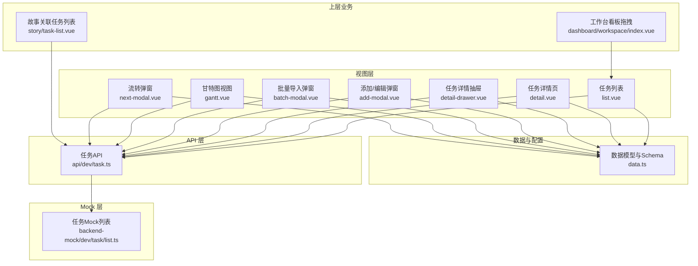
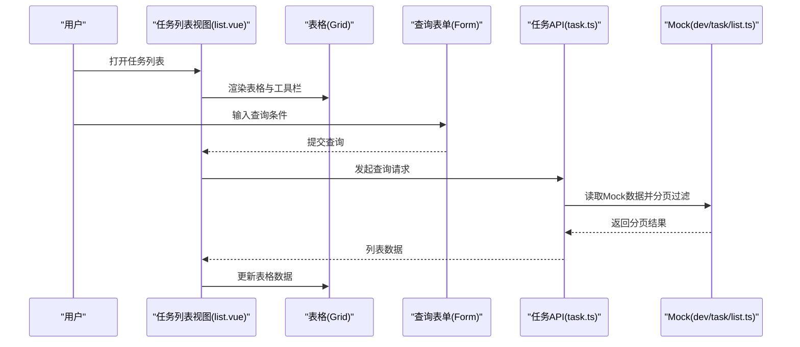
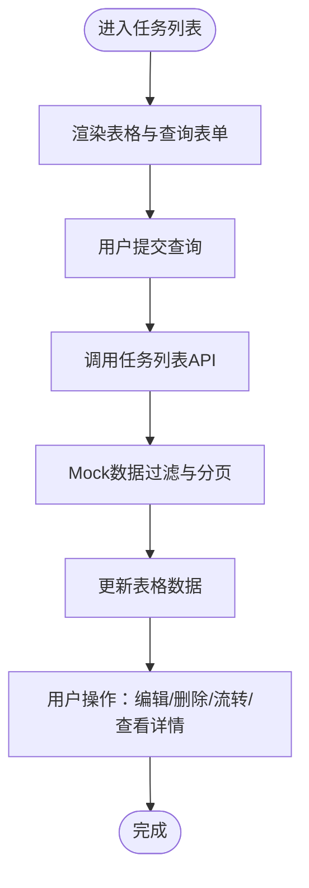
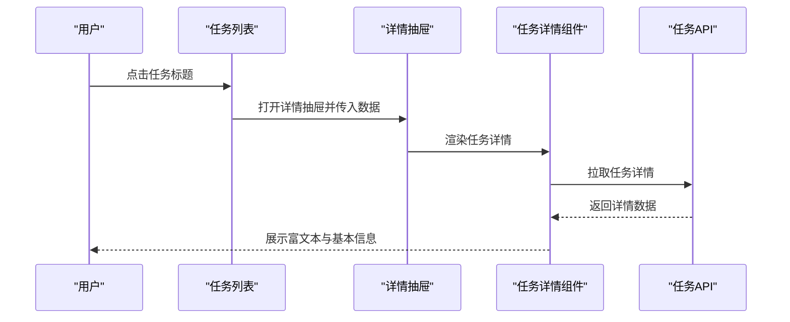
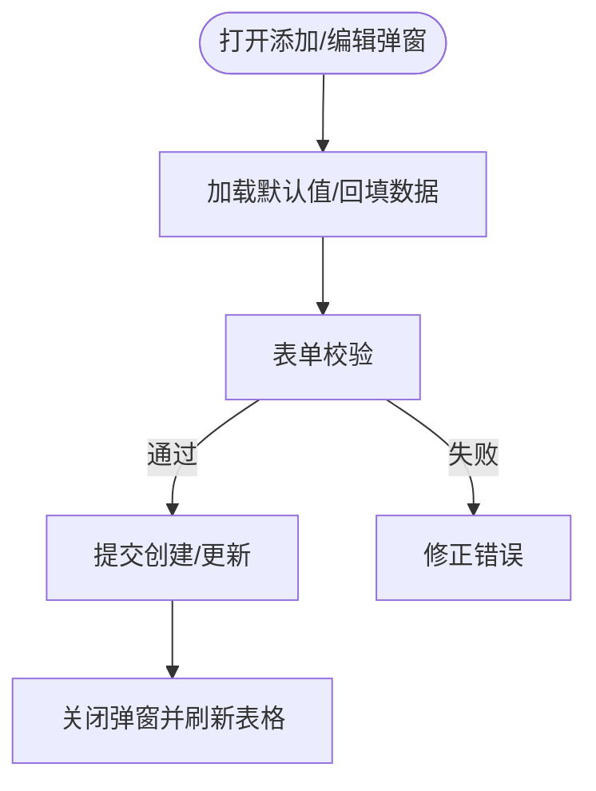
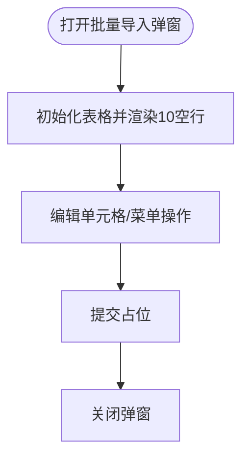
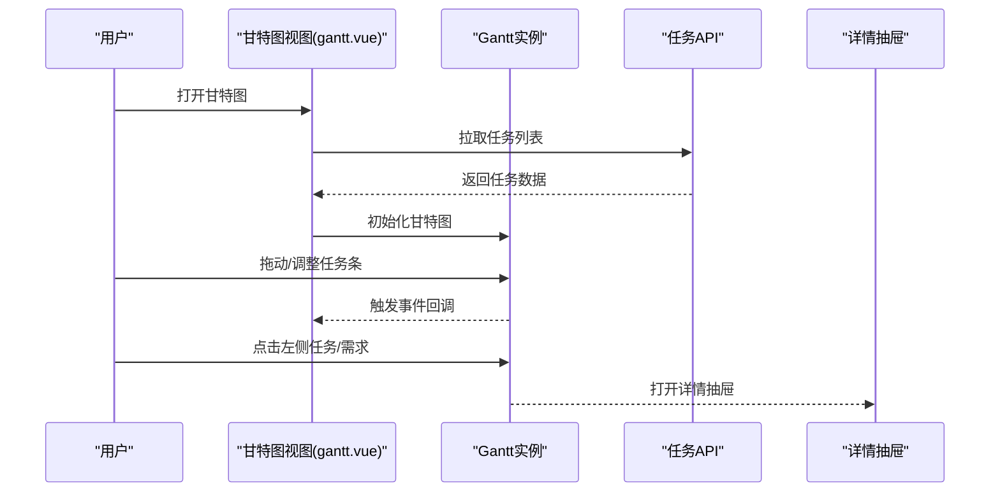
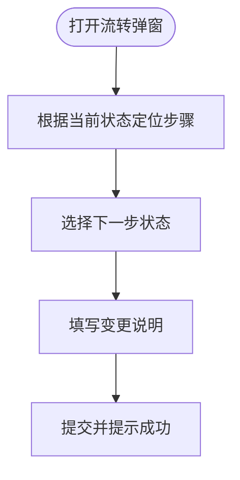
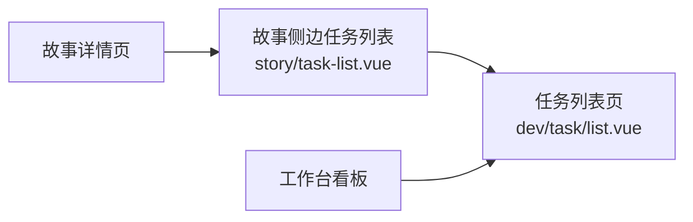
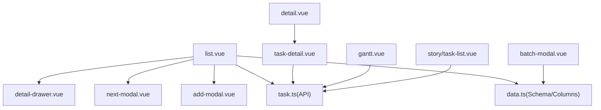

# 任务管理组件

<cite>
**本文档引用的文件**
- [apps/web-antd/src/views/dev/task/list.vue](file://apps/web-antd/src/views/dev/task/list.vue)
- [apps/web-antd/src/views/dev/task/gantt.vue](file://apps/web-antd/src/views/dev/task/gantt.vue)
- [apps/web-antd/src/views/dev/task/detail.vue](file://apps/web-antd/src/views/dev/task/detail.vue)
- [apps/web-antd/src/views/dev/task/components/task-detail.vue](file://apps/web-antd/src/views/dev/task/components/task-detail.vue)
- [apps/web-antd/src/views/dev/task/components/base-info.vue](file://apps/web-antd/src/views/dev/task/components/base-info.vue)
- [apps/web-antd/src/views/dev/task/detail-drawer.vue](file://apps/web-antd/src/views/dev/task/detail-drawer.vue)
- [apps/web-antd/src/views/dev/task/add-modal.vue](file://apps/web-antd/src/views/dev/task/add-modal.vue)
- [apps/web-antd/src/views/dev/task/batch-modal.vue](file://apps/web-antd/src/views/dev/task/batch-modal.vue)
- [apps/web-antd/src/views/dev/task/data.ts](file://apps/web-antd/src/views/dev/task/data.ts)
- [apps/web-antd/src/views/dev/task/next-modal.vue](file://apps/web-antd/src/views/dev/task/next-modal.vue)
- [apps/web-antd/src/api/dev/task.ts](file://apps/web-antd/src/api/dev/task.ts)
- [apps/backend-mock/api/dev/task/list.ts](file://apps/backend-mock/api/dev/task/list.ts)
- [apps/web-antd/src/views/dev/story/components/task-list.vue](file://apps/web-antd/src/views/dev/story/components/task-list.vue)
- [apps/web-antd/src/views/dashboard/workspace/index.vue](file://apps/web-antd/src/views/dashboard/workspace/index.vue)
</cite>

## 目录
1. [简介](#简介)
2. [项目结构](#项目结构)
3. [核心组件](#核心组件)
4. [架构总览](#架构总览)
5. [详细组件分析](#详细组件分析)
6. [依赖分析](#依赖分析)
7. [性能考虑](#性能考虑)
8. [故障排查指南](#故障排查指南)
9. [结论](#结论)
10. [附录](#附录)

## 简介
本文件系统性梳理任务管理组件的实现与使用方式，覆盖任务列表展示、任务详情查看、任务添加编辑、甘特图展示、批量操作、状态流转与时间管理等能力。文档同时给出数据模型、API 接口、甘特图配置、事件处理机制以及与故事（Story）等上层业务组件的依赖关系，并提供扩展与定制建议及项目管理最佳实践。

## 项目结构
任务管理相关前端页面集中在 web-antd 应用的 dev 业务域下，采用按功能分层组织：
- 视图层：任务列表、详情、抽屉、添加/编辑弹窗、批量导入弹窗、甘特图视图
- 数据与配置：统一的数据模型、表格列与表单 Schema、状态字典
- API 层：任务 CRUD、详情查询、按需求查询任务列表
- Mock 层：任务数据模拟与分页过滤

图表来源
- [apps/web-antd/src/views/dev/task/list.vue:1-169](file://apps/web-antd/src/views/dev/task/list.vue#L1-L169)
- [apps/web-antd/src/views/dev/task/gantt.vue:1-261](file://apps/web-antd/src/views/dev/task/gantt.vue#L1-L261)
- [apps/web-antd/src/views/dev/task/detail.vue:1-29](file://apps/web-antd/src/views/dev/task/detail.vue#L1-L29)
- [apps/web-antd/src/views/dev/task/components/task-detail.vue:1-230](file://apps/web-antd/src/views/dev/task/components/task-detail.vue#L1-L230)
- [apps/web-antd/src/views/dev/task/components/base-info.vue:1-50](file://apps/web-antd/src/views/dev/task/components/base-info.vue#L1-L50)
- [apps/web-antd/src/views/dev/task/detail-drawer.vue:1-81](file://apps/web-antd/src/views/dev/task/detail-drawer.vue#L1-L81)
- [apps/web-antd/src/views/dev/task/add-modal.vue:1-85](file://apps/web-antd/src/views/dev/task/add-modal.vue#L1-L85)
- [apps/web-antd/src/views/dev/task/batch-modal.vue:1-217](file://apps/web-antd/src/views/dev/task/batch-modal.vue#L1-L217)
- [apps/web-antd/src/views/dev/task/data.ts:1-534](file://apps/web-antd/src/views/dev/task/data.ts#L1-L534)
- [apps/web-antd/src/views/dev/task/next-modal.vue:1-99](file://apps/web-antd/src/views/dev/task/next-modal.vue#L1-L99)
- [apps/web-antd/src/api/dev/task.ts:1-103](file://apps/web-antd/src/api/dev/task.ts#L1-L103)
- [apps/backend-mock/api/dev/task/list.ts:1-156](file://apps/backend-mock/api/dev/task/list.ts#L1-L156)
- [apps/web-antd/src/views/dev/story/components/task-list.vue:1-59](file://apps/web-antd/src/views/dev/story/components/task-list.vue#L1-L59)
- [apps/web-antd/src/views/dashboard/workspace/index.vue:1-260](file://apps/web-antd/src/views/dashboard/workspace/index.vue#L1-L260)

章节来源
- [apps/web-antd/src/views/dev/task/list.vue:1-169](file://apps/web-antd/src/views/dev/task/list.vue#L1-L169)
- [apps/web-antd/src/views/dev/task/gantt.vue:1-261](file://apps/web-antd/src/views/dev/task/gantt.vue#L1-L261)
- [apps/web-antd/src/views/dev/task/detail.vue:1-29](file://apps/web-antd/src/views/dev/task/detail.vue#L1-L29)
- [apps/web-antd/src/views/dev/task/components/task-detail.vue:1-230](file://apps/web-antd/src/views/dev/task/components/task-detail.vue#L1-L230)
- [apps/web-antd/src/views/dev/task/components/base-info.vue:1-50](file://apps/web-antd/src/views/dev/task/components/base-info.vue#L1-L50)
- [apps/web-antd/src/views/dev/task/detail-drawer.vue:1-81](file://apps/web-antd/src/views/dev/task/detail-drawer.vue#L1-L81)
- [apps/web-antd/src/views/dev/task/add-modal.vue:1-85](file://apps/web-antd/src/views/dev/task/add-modal.vue#L1-L85)
- [apps/web-antd/src/views/dev/task/batch-modal.vue:1-217](file://apps/web-antd/src/views/dev/task/batch-modal.vue#L1-L217)
- [apps/web-antd/src/views/dev/task/data.ts:1-534](file://apps/web-antd/src/views/dev/task/data.ts#L1-L534)
- [apps/web-antd/src/views/dev/task/next-modal.vue:1-99](file://apps/web-antd/src/views/dev/task/next-modal.vue#L1-L99)
- [apps/web-antd/src/api/dev/task.ts:1-103](file://apps/web-antd/src/api/dev/task.ts#L1-L103)
- [apps/backend-mock/api/dev/task/list.ts:1-156](file://apps/backend-mock/api/dev/task/list.ts#L1-L156)
- [apps/web-antd/src/views/dev/story/components/task-list.vue:1-59](file://apps/web-antd/src/views/dev/story/components/task-list.vue#L1-L59)
- [apps/web-antd/src/views/dashboard/workspace/index.vue:1-260](file://apps/web-antd/src/views/dashboard/workspace/index.vue#L1-L260)

## 核心组件
- 任务列表页：集成查询表单、表格、工具栏、批量导入、详情抽屉、添加/编辑弹窗、流转弹窗
- 任务详情页：富文本内容区、标签页切换（变更日志、基本信息）、顶部按钮组
- 任务详情抽屉：右侧抽屉承载详情，支持评论输入与提交
- 添加/编辑弹窗：统一表单 Schema，支持时间字段映射、级联选择、默认值与禁用逻辑
- 批量导入弹窗：基于可视化表格进行批量任务录入，支持复制/粘贴、新增/删除行
- 甘特图视图：基于 VTable Gantt 实现任务时间轴展示与交互
- 流转弹窗：基于步骤条选择目标状态，支持常用语快速填充

章节来源
- [apps/web-antd/src/views/dev/task/list.vue:1-169](file://apps/web-antd/src/views/dev/task/list.vue#L1-L169)
- [apps/web-antd/src/views/dev/task/detail.vue:1-29](file://apps/web-antd/src/views/dev/task/detail.vue#L1-L29)
- [apps/web-antd/src/views/dev/task/components/task-detail.vue:1-230](file://apps/web-antd/src/views/dev/task/components/task-detail.vue#L1-L230)
- [apps/web-antd/src/views/dev/task/detail-drawer.vue:1-81](file://apps/web-antd/src/views/dev/task/detail-drawer.vue#L1-L81)
- [apps/web-antd/src/views/dev/task/add-modal.vue:1-85](file://apps/web-antd/src/views/dev/task/add-modal.vue#L1-L85)
- [apps/web-antd/src/views/dev/task/batch-modal.vue:1-217](file://apps/web-antd/src/views/dev/task/batch-modal.vue#L1-L217)
- [apps/web-antd/src/views/dev/task/gantt.vue:1-261](file://apps/web-antd/src/views/dev/task/gantt.vue#L1-L261)
- [apps/web-antd/src/views/dev/task/next-modal.vue:1-99](file://apps/web-antd/src/views/dev/task/next-modal.vue#L1-L99)

## 架构总览
任务管理组件围绕“视图-配置-API-Mock”四层展开，数据流自下而上：Mock 提供示例数据，API 封装请求，视图通过 Adapter 组合表格、表单、抽屉与弹窗，形成完整的任务生命周期管理。

图表来源
- [apps/web-antd/src/views/dev/task/list.vue:22-55](file://apps/web-antd/src/views/dev/task/list.vue#L22-L55)
- [apps/web-antd/src/api/dev/task.ts:42-49](file://apps/web-antd/src/api/dev/task.ts#L42-L49)
- [apps/backend-mock/api/dev/task/list.ts:120-155](file://apps/backend-mock/api/dev/task/list.ts#L120-L155)

## 详细组件分析

### 数据模型与字典
- 数据模型 DevTaskFace 定义任务实体字段，包含任务标识、关联需求/模块/版本/项目、标题、富文本、状态、类型、工时、进度、时间范围、创建者与执行人等
- 字典来源：本地字典 TASK_STATUS、TASK_TYPE；通过 ApiSelect 绑定远程或本地枚举
- 时间字段：支持时间区间映射为开始/结束时间

章节来源
- [apps/web-antd/src/api/dev/task.ts:4-35](file://apps/web-antd/src/api/dev/task.ts#L4-L35)
- [apps/web-antd/src/views/dev/task/data.ts:22-293](file://apps/web-antd/src/views/dev/task/data.ts#L22-L293)

### 任务列表展示
- 查询表单：项目/版本/任务标题/任务状态
- 表格列：编号、项目、版本、模块、任务标题、执行人、状态、进度、类型、起止时间、操作
- 操作按钮：流转、编辑、删除；标题点击打开详情抽屉
- 工具栏：新建任务、批量添加任务

图表来源
- [apps/web-antd/src/views/dev/task/list.vue:22-108](file://apps/web-antd/src/views/dev/task/list.vue#L22-L108)
- [apps/web-antd/src/views/dev/task/data.ts:296-360](file://apps/web-antd/src/views/dev/task/data.ts#L296-L360)
- [apps/web-antd/src/views/dev/task/data.ts:366-504](file://apps/web-antd/src/views/dev/task/data.ts#L366-L504)

章节来源
- [apps/web-antd/src/views/dev/task/list.vue:1-169](file://apps/web-antd/src/views/dev/task/list.vue#L1-L169)
- [apps/web-antd/src/views/dev/task/data.ts:296-504](file://apps/web-antd/src/views/dev/task/data.ts#L296-L504)

### 任务详情查看
- 详情页：根据路由参数加载任务详情，支持关闭当前标签页
- 详情抽屉：右侧抽屉承载详情内容，支持复制链接、新窗口打开、评论输入与提交
- 基本信息组件：描述任务基础字段，便于在抽屉与详情页复用

图表来源
- [apps/web-antd/src/views/dev/task/list.vue:76-78](file://apps/web-antd/src/views/dev/task/list.vue#L76-L78)
- [apps/web-antd/src/views/dev/task/detail-drawer.vue:13-47](file://apps/web-antd/src/views/dev/task/detail-drawer.vue#L13-L47)
- [apps/web-antd/src/views/dev/task/components/task-detail.vue:71-89](file://apps/web-antd/src/views/dev/task/components/task-detail.vue#L71-L89)
- [apps/web-antd/src/api/dev/task.ts:82-88](file://apps/web-antd/src/api/dev/task.ts#L82-L88)

章节来源
- [apps/web-antd/src/views/dev/task/detail.vue:1-29](file://apps/web-antd/src/views/dev/task/detail.vue#L1-L29)
- [apps/web-antd/src/views/dev/task/components/task-detail.vue:1-230](file://apps/web-antd/src/views/dev/task/components/task-detail.vue#L1-L230)
- [apps/web-antd/src/views/dev/task/detail-drawer.vue:1-81](file://apps/web-antd/src/views/dev/task/detail-drawer.vue#L1-L81)
- [apps/web-antd/src/views/dev/task/components/base-info.vue:1-50](file://apps/web-antd/src/views/dev/task/components/base-info.vue#L1-L50)

### 任务添加与编辑
- 表单 Schema：任务标题、时间区间、计划工时、项目/版本/模块/需求、执行人、任务状态/类型等
- 字段联动：项目变更时重置版本/模块/需求；需求选择后回填模块
- 时间映射：将时间区间映射为开始/结束时间
- 提交逻辑：区分新增与编辑，统一走创建/更新 API

图表来源
- [apps/web-antd/src/views/dev/task/add-modal.vue:17-78](file://apps/web-antd/src/views/dev/task/add-modal.vue#L17-L78)
- [apps/web-antd/src/views/dev/task/data.ts:22-293](file://apps/web-antd/src/views/dev/task/data.ts#L22-L293)
- [apps/web-antd/src/api/dev/task.ts:56-75](file://apps/web-antd/src/api/dev/task.ts#L56-L75)

章节来源
- [apps/web-antd/src/views/dev/task/add-modal.vue:1-85](file://apps/web-antd/src/views/dev/task/add-modal.vue#L1-L85)
- [apps/web-antd/src/views/dev/task/data.ts:22-293](file://apps/web-antd/src/views/dev/task/data.ts#L22-L293)
- [apps/web-antd/src/api/dev/task.ts:56-75](file://apps/web-antd/src/api/dev/task.ts#L56-L75)

### 批量操作（批量导入）
- 基于 VTable ListTable 的可视化表格，支持新增/删除行、清空单元格、键盘快捷键
- 列定义：关联需求、任务标题、执行人、计划工时、起止时间、任务类型、任务状态
- 交互：右键菜单、下拉选择、日期/输入编辑器

图表来源
- [apps/web-antd/src/views/dev/task/batch-modal.vue:26-195](file://apps/web-antd/src/views/dev/task/batch-modal.vue#L26-L195)

章节来源
- [apps/web-antd/src/views/dev/task/batch-modal.vue:1-217](file://apps/web-antd/src/views/dev/task/batch-modal.vue#L1-L217)

### 甘特图展示
- 基于 @visactor/vtable-gantt，任务列表与时间轴并排展示
- 配置要点：records、taskKeyField、min/maxDate、taskListTable 列与主题、frame/grid、taskBar、timelineHeader
- 交互事件：滚动、点击任务条、移动结束、日期范围变更；左侧表格点击/双击跳转详情/需求详情

图表来源
- [apps/web-antd/src/views/dev/task/gantt.vue:75-246](file://apps/web-antd/src/views/dev/task/gantt.vue#L75-L246)

章节来源
- [apps/web-antd/src/views/dev/task/gantt.vue:1-261](file://apps/web-antd/src/views/dev/task/gantt.vue#L1-L261)

### 任务状态流转
- 流转弹窗：基于步骤条展示可选状态，当前状态之前的状态禁用
- 表单：包含任务ID、当前状态、变更说明（富文本）
- 常用语：双击快速填充说明内容

图表来源
- [apps/web-antd/src/views/dev/task/next-modal.vue:28-70](file://apps/web-antd/src/views/dev/task/next-modal.vue#L28-L70)
- [apps/web-antd/src/views/dev/task/data.ts:506-533](file://apps/web-antd/src/views/dev/task/data.ts#L506-L533)

章节来源
- [apps/web-antd/src/views/dev/task/next-modal.vue:1-99](file://apps/web-antd/src/views/dev/task/next-modal.vue#L1-L99)
- [apps/web-antd/src/views/dev/task/data.ts:506-533](file://apps/web-antd/src/views/dev/task/data.ts#L506-L533)

### 与上层业务组件的关系
- 故事（Story）侧边栏任务列表：根据 storyId 查询任务列表，用于故事维度的任务聚合
- 工作台看板：支持任务卡片拖拽，按状态分组展示，体现任务在不同看板列之间的流转

图表来源
- [apps/web-antd/src/views/dev/story/components/task-list.vue:19-23](file://apps/web-antd/src/views/dev/story/components/task-list.vue#L19-L23)
- [apps/web-antd/src/views/dashboard/workspace/index.vue:70-161](file://apps/web-antd/src/views/dashboard/workspace/index.vue#L70-L161)

章节来源
- [apps/web-antd/src/views/dev/story/components/task-list.vue:1-59](file://apps/web-antd/src/views/dev/story/components/task-list.vue#L1-L59)
- [apps/web-antd/src/views/dashboard/workspace/index.vue:1-260](file://apps/web-antd/src/views/dashboard/workspace/index.vue#L1-L260)

## 依赖分析
- 组件耦合：视图层通过 Adapter（表格、表单、抽屉、弹窗）组合，低耦合高内聚
- 外部依赖：Ant Design Vue、@vben/*、@visactor/vtable(-gantt)、@faker-js/faker、本地字典
- 数据依赖：API 层封装请求，Mock 层提供示例数据与分页过滤

图表来源
- [apps/web-antd/src/views/dev/task/list.vue:1-169](file://apps/web-antd/src/views/dev/task/list.vue#L1-L169)
- [apps/web-antd/src/views/dev/task/data.ts:1-534](file://apps/web-antd/src/views/dev/task/data.ts#L1-L534)
- [apps/web-antd/src/api/dev/task.ts:1-103](file://apps/web-antd/src/api/dev/task.ts#L1-L103)
- [apps/web-antd/src/views/dev/task/gantt.vue:1-261](file://apps/web-antd/src/views/dev/task/gantt.vue#L1-L261)
- [apps/web-antd/src/views/dev/task/batch-modal.vue:1-217](file://apps/web-antd/src/views/dev/task/batch-modal.vue#L1-L217)
- [apps/web-antd/src/views/dev/story/components/task-list.vue:1-59](file://apps/web-antd/src/views/dev/story/components/task-list.vue#L1-L59)

章节来源
- [apps/web-antd/src/views/dev/task/list.vue:1-169](file://apps/web-antd/src/views/dev/task/list.vue#L1-L169)
- [apps/web-antd/src/views/dev/task/data.ts:1-534](file://apps/web-antd/src/views/dev/task/data.ts#L1-L534)
- [apps/web-antd/src/api/dev/task.ts:1-103](file://apps/web-antd/src/api/dev/task.ts#L1-L103)
- [apps/web-antd/src/views/dev/task/gantt.vue:1-261](file://apps/web-antd/src/views/dev/task/gantt.vue#L1-L261)
- [apps/web-antd/src/views/dev/task/batch-modal.vue:1-217](file://apps/web-antd/src/views/dev/task/batch-modal.vue#L1-L217)
- [apps/web-antd/src/views/dev/story/components/task-list.vue:1-59](file://apps/web-antd/src/views/dev/story/components/task-list.vue#L1-L59)

## 性能考虑
- 列表分页与筛选：后端分页与过滤，避免一次性加载全部数据
- 表单联动与防抖：需求搜索使用防抖，减少频繁请求
- 表格编辑：按需开启单元格编辑，避免全量渲染
- 甘特图：合理设置 min/maxDate 与 timelineHeader，减少渲染压力
- 抽屉与弹窗：destroyOnClose 降低内存占用

## 故障排查指南
- 列表无数据：检查 Mock 是否返回数据、查询参数是否正确、分页参数是否越界
- 表单无法提交：检查必填字段、字段映射（时间区间）、权限校验
- 详情加载失败：确认路由参数 taskNum 是否存在、API 返回是否为空
- 甘特图不显示：确认容器节点是否存在、records 是否正确、事件绑定是否生效
- 批量导入异常：检查表格初始化、编辑器配置、菜单事件绑定

章节来源
- [apps/backend-mock/api/dev/task/list.ts:120-155](file://apps/backend-mock/api/dev/task/list.ts#L120-L155)
- [apps/web-antd/src/views/dev/task/add-modal.vue:68-78](file://apps/web-antd/src/views/dev/task/add-modal.vue#L68-L78)
- [apps/web-antd/src/views/dev/task/components/task-detail.vue:71-89](file://apps/web-antd/src/views/dev/task/components/task-detail.vue#L71-L89)
- [apps/web-antd/src/views/dev/task/gantt.vue:75-246](file://apps/web-antd/src/views/dev/task/gantt.vue#L75-L246)
- [apps/web-antd/src/views/dev/task/batch-modal.vue:110-195](file://apps/web-antd/src/views/dev/task/batch-modal.vue#L110-L195)

## 结论
任务管理组件通过清晰的分层设计与丰富的交互能力，实现了从任务创建、编辑、查看、流转到甘特图可视化的完整闭环。依托统一的数据模型与 Schema，结合 Mock 与真实 API，既满足演示场景也具备工程落地能力。建议在生产环境中进一步完善权限控制、批量导入持久化与状态机校验。

## 附录

### API 接口清单
- 获取任务列表：GET /dev/task/list（分页、项目、版本、标题、状态过滤）
- 创建任务：POST /dev/task
- 更新任务：PUT /dev/task/{id}
- 获取任务详情：GET /dev/task/get（按 taskNum）
- 根据需求查询任务：GET /dev/task/taskListByStoryId（按 storyId）

章节来源
- [apps/web-antd/src/api/dev/task.ts:42-102](file://apps/web-antd/src/api/dev/task.ts#L42-L102)

### 甘特图配置要点
- records：任务数据数组
- taskKeyField：任务唯一标识字段
- minDate/maxDate：时间轴范围
- taskListTable.columns：左侧任务列表列
- frame/grid：外框与网格样式
- taskBar：任务条样式、可移动/可调整、进度字段
- timelineHeader：时间刻度与格式化

章节来源
- [apps/web-antd/src/views/dev/task/gantt.vue:77-213](file://apps/web-antd/src/views/dev/task/gantt.vue#L77-L213)

### 事件处理机制
- 任务列表：点击任务标题打开详情抽屉；操作按钮触发编辑/删除/流转
- 甘特图：SCROLL/CLICK_TASK_BAR/MOVE_END_TASK_BAR/CHANGE_DATE_RANGE
- 左侧表格：CLICK_CELL/DBLCLICK_CELL（跳转详情/需求详情）

章节来源
- [apps/web-antd/src/views/dev/task/list.vue:59-81](file://apps/web-antd/src/views/dev/task/list.vue#L59-L81)
- [apps/web-antd/src/views/dev/task/gantt.vue:215-245](file://apps/web-antd/src/views/dev/task/gantt.vue#L215-L245)

### 扩展与定制建议
- 自定义列与表单：在 data.ts 中扩展 columns/schema，保持与 DevTaskFace 对齐
- 状态机：引入状态机校验流转合法性，避免非法状态推进
- 批量导入：完善粘贴/复制逻辑与后端保存接口
- 甘特图：按需启用拖拽与缩放，优化大数据量下的渲染性能
- 与故事联动：在故事详情页增加任务统计与看板视图