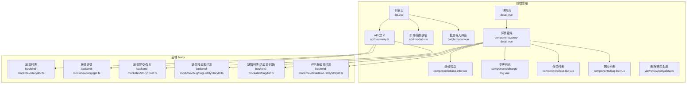
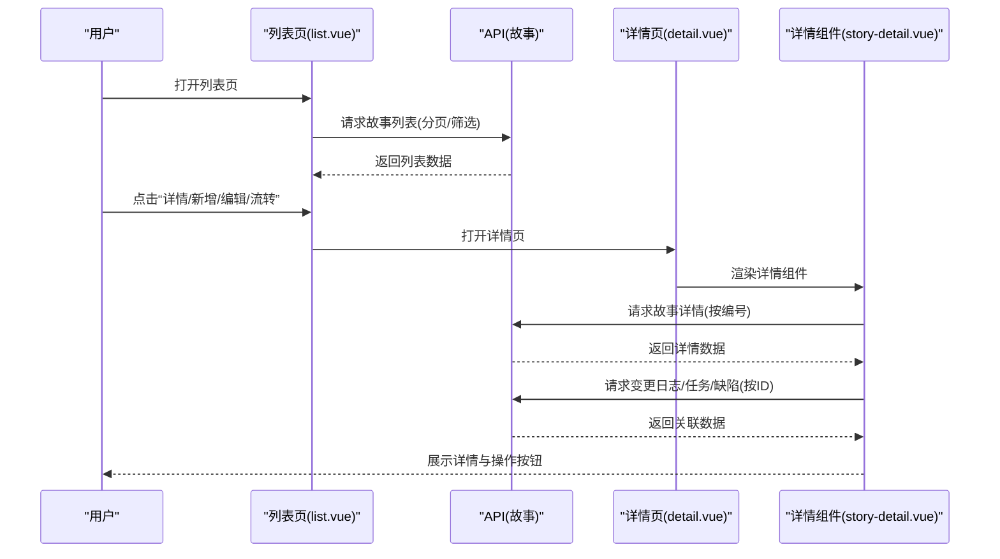
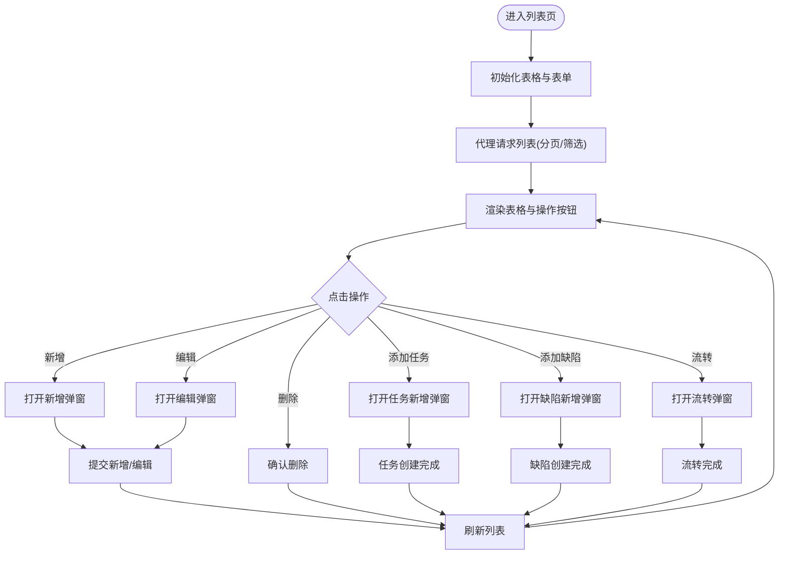
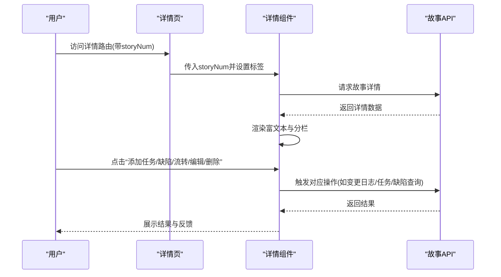
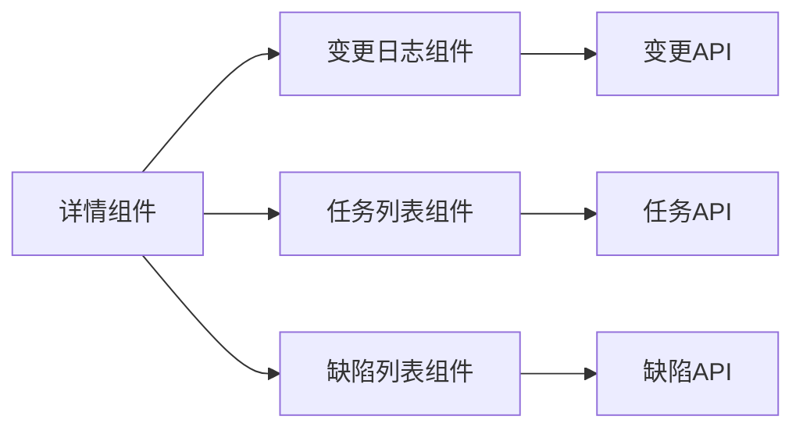
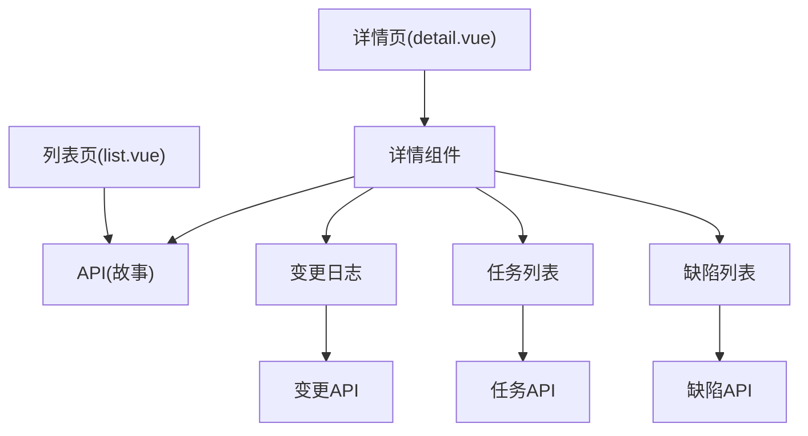

# 故事管理组件

<cite>
**本文档引用的文件**
- [apps/web-antd/src/api/dev/story.ts](file://apps/web-antd/src/api/dev/story.ts)
- [apps/web-antd/src/views/dev/story/list.vue](file://apps/web-antd/src/views/dev/story/list.vue)
- [apps/web-antd/src/views/dev/story/detail.vue](file://apps/web-antd/src/views/dev/story/detail.vue)
- [apps/web-antd/src/views/dev/story/data.ts](file://apps/web-antd/src/views/dev/story/data.ts)
- [apps/web-antd/src/views/dev/story/components/story-detail.vue](file://apps/web-antd/src/views/dev/story/components/story-detail.vue)
- [apps/web-antd/src/views/dev/story/components/base-info.vue](file://apps/web-antd/src/views/dev/story/components/base-info.vue)
- [apps/web-antd/src/views/dev/story/components/change-log.vue](file://apps/web-antd/src/views/dev/story/components/change-log.vue)
- [apps/web-antd/src/views/dev/story/components/task-list.vue](file://apps/web-antd/src/views/dev/story/components/task-list.vue)
- [apps/web-antd/src/views/dev/story/components/bug-list.vue](file://apps/web-antd/src/views/dev/story/components/bug-list.vue)
- [apps/web-antd/src/views/dev/story/add-modal.vue](file://apps/web-antd/src/views/dev/story/add-modal.vue)
- [apps/web-antd/src/views/dev/story/batch-modal.vue](file://apps/web-antd/src/views/dev/story/batch-modal.vue)
- [apps/backend-mock/api/dev/story/list.ts](file://apps/backend-mock/api/dev/story/list.ts)
- [apps/backend-mock/api/dev/story/get.ts](file://apps/backend-mock/api/dev/story/get.ts)
- [apps/backend-mock/api/dev/story/.post.ts](file://apps/backend-mock/api/dev/story/.post.ts)
- [apps/backend-mock/api/dev/bug/bugListByStoryId.ts](file://apps/backend-mock/api/dev/bug/bugListByStoryId.ts)
- [apps/backend-mock/api/dev/bug/list.ts](file://apps/backend-mock/api/dev/bug/list.ts)
- [apps/backend-mock/api/dev/task/taskListByStoryId.ts](file://apps/backend-mock/api/dev/task/taskListByStoryId.ts)
</cite>

## 目录
1. [简介](#简介)
2. [项目结构](#项目结构)
3. [核心组件](#核心组件)
4. [架构总览](#架构总览)
5. [详细组件分析](#详细组件分析)
6. [依赖分析](#依赖分析)
7. [性能考虑](#性能考虑)
8. [故障排查指南](#故障排查指南)
9. [结论](#结论)
10. [附录](#附录)

## 简介
本文件系统性梳理“故事管理组件”的实现与使用，覆盖故事列表展示、故事详情查看、故事新增/编辑、批量导入、状态流转、关联任务与缺陷等能力，并结合后端 Mock 接口说明数据模型、状态与优先级机制、配置项与 API 调用方式、以及在实际项目中的应用场景与扩展建议。

## 项目结构
故事管理位于前端 Web 应用的“开发视图”模块下，采用按功能域划分的目录组织方式：
- API 层：封装与后端交互的请求方法（含 Mock）
- 视图层：列表页、详情页及各子组件（基础信息、变更日志、任务列表、缺陷列表）
- 表单与表格：统一的表单 Schema、表格列配置与批量编辑表格

图表来源
- [apps/web-antd/src/views/dev/story/list.vue:1-229](file://apps/web-antd/src/views/dev/story/list.vue#L1-L229)
- [apps/web-antd/src/views/dev/story/detail.vue:1-29](file://apps/web-antd/src/views/dev/story/detail.vue#L1-L29)
- [apps/web-antd/src/views/dev/story/components/story-detail.vue:1-285](file://apps/web-antd/src/views/dev/story/components/story-detail.vue#L1-L285)
- [apps/web-antd/src/api/dev/story.ts:1-91](file://apps/web-antd/src/api/dev/story.ts#L1-L91)
- [apps/backend-mock/api/dev/story/list.ts:1-148](file://apps/backend-mock/api/dev/story/list.ts#L1-L148)
- [apps/backend-mock/api/dev/story/get.ts:1-17](file://apps/backend-mock/api/dev/story/get.ts#L1-L17)
- [apps/backend-mock/api/dev/story/.post.ts:1-17](file://apps/backend-mock/api/dev/story/.post.ts#L1-L17)
- [apps/backend-mock/api/dev/bug/bugListByStoryId.ts:1-20](file://apps/backend-mock/api/dev/bug/bugListByStoryId.ts#L1-L20)
- [apps/backend-mock/api/dev/bug/list.ts:1-120](file://apps/backend-mock/api/dev/bug/list.ts#L1-L120)
- [apps/backend-mock/api/dev/task/taskListByStoryId.ts:1-20](file://apps/backend-mock/api/dev/task/taskListByStoryId.ts#L1-L20)

章节来源
- [apps/web-antd/src/views/dev/story/list.vue:1-229](file://apps/web-antd/src/views/dev/story/list.vue#L1-L229)
- [apps/web-antd/src/views/dev/story/detail.vue:1-29](file://apps/web-antd/src/views/dev/story/detail.vue#L1-L29)
- [apps/web-antd/src/views/dev/story/components/story-detail.vue:1-285](file://apps/web-antd/src/views/dev/story/components/story-detail.vue#L1-L285)
- [apps/web-antd/src/api/dev/story.ts:1-91](file://apps/web-antd/src/api/dev/story.ts#L1-L91)
- [apps/web-antd/src/views/dev/story/data.ts:1-540](file://apps/web-antd/src/views/dev/story/data.ts#L1-L540)

## 核心组件
- 列表页：提供查询表单、表格、工具栏、批量导入、新增/编辑弹窗、流转弹窗、详情抽屉等。
- 详情页：承载详情组件，右侧分栏展示基础信息、变更日志、关联任务、关联缺陷。
- 详情组件：加载故事详情、渲染富文本、提供按钮组操作（评论、添加任务、添加缺陷、流转、编辑、删除）。
- 基础信息：展示项目、版本、模块、状态、类型、优先级、来源等字段。
- 变更日志：按业务 ID 查询变更记录，展示时间线。
- 关联任务/缺陷：按故事 ID 查询任务/缺陷列表，支持跳转到详情。
- 新增/编辑弹窗：统一表单 Schema，支持上传、AI 富文本编辑、字典联动。
- 批量导入弹窗：基于可视化表格进行批量录入，支持复制/粘贴、新增/删除行等。

章节来源
- [apps/web-antd/src/views/dev/story/list.vue:1-229](file://apps/web-antd/src/views/dev/story/list.vue#L1-L229)
- [apps/web-antd/src/views/dev/story/detail.vue:1-29](file://apps/web-antd/src/views/dev/story/detail.vue#L1-L29)
- [apps/web-antd/src/views/dev/story/components/story-detail.vue:1-285](file://apps/web-antd/src/views/dev/story/components/story-detail.vue#L1-L285)
- [apps/web-antd/src/views/dev/story/components/base-info.vue](file://apps/web-antd/src/views/dev/story/components/base-info.vue)
- [apps/web-antd/src/views/dev/story/components/change-log.vue:1-49](file://apps/web-antd/src/views/dev/story/components/change-log.vue#L1-L49)
- [apps/web-antd/src/views/dev/story/components/task-list.vue:1-59](file://apps/web-antd/src/views/dev/story/components/task-list.vue#L1-L59)
- [apps/web-antd/src/views/dev/story/components/bug-list.vue:1-58](file://apps/web-antd/src/views/dev/story/components/bug-list.vue#L1-L58)
- [apps/web-antd/src/views/dev/story/add-modal.vue:1-72](file://apps/web-antd/src/views/dev/story/add-modal.vue#L1-L72)
- [apps/web-antd/src/views/dev/story/batch-modal.vue:1-283](file://apps/web-antd/src/views/dev/story/batch-modal.vue#L1-L283)

## 架构总览
从前端到后端的数据流如下：
- 列表页通过表格代理请求故事列表，支持分页与多维筛选。
- 详情页通过故事编号查询详情，右侧分栏异步加载变更日志、任务、缺陷。
- 新增/编辑弹窗提交表单，调用创建或更新接口。
- 批量导入弹窗通过可视化表格生成批量数据，提交后触发后续处理。
- 后端 Mock 提供故事列表、详情、提交等接口，便于本地开发与演示。

图表来源
- [apps/web-antd/src/views/dev/story/list.vue:50-63](file://apps/web-antd/src/views/dev/story/list.vue#L50-L63)
- [apps/web-antd/src/api/dev/story.ts:49-90](file://apps/web-antd/src/api/dev/story.ts#L49-L90)
- [apps/web-antd/src/views/dev/story/detail.vue:17-20](file://apps/web-antd/src/views/dev/story/detail.vue#L17-L20)
- [apps/web-antd/src/views/dev/story/components/story-detail.vue:70-88](file://apps/web-antd/src/views/dev/story/components/story-detail.vue#L70-L88)

## 详细组件分析

### 数据模型与字段说明
- 故事实体包含：标识、编号、标题、富文本描述、类型、状态、优先级、来源、关联项目/版本/模块、创建者、参与人、附件、创建/更新时间等。
- 字段来源与用途：
  - 关联维度：projectId/versionId/moduleId 用于筛选与联动。
  - 状态与优先级：通过本地字典映射渲染与编辑。
  - 附件：支持上传与序列化存储。
  - 参与人：支持多选，便于协作追踪。

章节来源
- [apps/web-antd/src/api/dev/story.ts:11-42](file://apps/web-antd/src/api/dev/story.ts#L11-L42)
- [apps/web-antd/src/views/dev/story/data.ts:18-198](file://apps/web-antd/src/views/dev/story/data.ts#L18-L198)

### 列表页与表格配置
- 查询表单：支持项目、版本、模块、关键词、状态等筛选。
- 表格列：编号、项目、版本、状态、标题、参与人、模块、类型、优先级、来源、操作列。
- 操作列：添加任务、添加缺陷、流转、编辑、删除；部分按钮根据状态与版本禁用。
- 工具栏：新建需求、批量新建。

图表来源
- [apps/web-antd/src/views/dev/story/list.vue:30-64](file://apps/web-antd/src/views/dev/story/list.vue#L30-L64)
- [apps/web-antd/src/views/dev/story/data.ts:200-293](file://apps/web-antd/src/views/dev/story/data.ts#L200-L293)
- [apps/web-antd/src/views/dev/story/data.ts:299-509](file://apps/web-antd/src/views/dev/story/data.ts#L299-L509)

章节来源
- [apps/web-antd/src/views/dev/story/list.vue:1-229](file://apps/web-antd/src/views/dev/story/list.vue#L1-L229)
- [apps/web-antd/src/views/dev/story/data.ts:200-509](file://apps/web-antd/src/views/dev/story/data.ts#L200-L509)

### 详情页与详情组件
- 详情页负责路由参数解析与标签设置，容器卡片内嵌详情组件。
- 详情组件：
  - 加载详情：根据故事编号请求详情，失败时跳转兜底页面。
  - 按钮组：评论、添加任务、添加缺陷、流转、编辑、删除。
  - 右侧分栏：变更日志、基本信息、关联任务、关联缺陷。
  - 禁用规则：根据状态与版本动态启用/禁用按钮。

图表来源
- [apps/web-antd/src/views/dev/story/detail.vue:17-20](file://apps/web-antd/src/views/dev/story/detail.vue#L17-L20)
- [apps/web-antd/src/views/dev/story/components/story-detail.vue:70-88](file://apps/web-antd/src/views/dev/story/components/story-detail.vue#L70-L88)
- [apps/web-antd/src/api/dev/story.ts:86-90](file://apps/web-antd/src/api/dev/story.ts#L86-L90)

章节来源
- [apps/web-antd/src/views/dev/story/detail.vue:1-29](file://apps/web-antd/src/views/dev/story/detail.vue#L1-L29)
- [apps/web-antd/src/views/dev/story/components/story-detail.vue:1-285](file://apps/web-antd/src/views/dev/story/components/story-detail.vue#L1-L285)

### 新增/编辑弹窗
- 表单 Schema：标题必填、项目必填、版本/模块联动、状态默认值、类型/优先级/来源字典选择、富文本编辑、附件上传。
- 行为逻辑：打开时根据是否有 storyId 决定标题与回填数据；提交时序列化附件并调用创建/更新接口；成功后触发父级刷新。

章节来源
- [apps/web-antd/src/views/dev/story/add-modal.vue:1-72](file://apps/web-antd/src/views/dev/story/add-modal.vue#L1-L72)
- [apps/web-antd/src/views/dev/story/data.ts:18-198](file://apps/web-antd/src/views/dev/story/data.ts#L18-L198)

### 批量导入弹窗
- 可视化表格：内置多种编辑器（输入、富文本、下拉、上传），支持新增/删除行、菜单操作。
- 联动逻辑：项目变化时重置版本/模块；版本变化时联动模块。
- 数据导出：支持获取当前表格数据，便于后续批量提交。

章节来源
- [apps/web-antd/src/views/dev/story/batch-modal.vue:1-283](file://apps/web-antd/src/views/dev/story/batch-modal.vue#L1-L283)
- [apps/web-antd/src/views/dev/story/data.ts:51-156](file://apps/web-antd/src/views/dev/story/data.ts#L51-L156)

### 关联组件与数据流
- 变更日志：按 businessId 查询变更记录，渲染时间线。
- 关联任务：按 storyId 查询任务列表，支持跳转到任务详情。
- 关联缺陷：按 storyId 查询缺陷列表，支持跳转到缺陷详情。

图表来源
- [apps/web-antd/src/views/dev/story/components/change-log.vue:1-49](file://apps/web-antd/src/views/dev/story/components/change-log.vue#L1-L49)
- [apps/web-antd/src/views/dev/story/components/task-list.vue:1-59](file://apps/web-antd/src/views/dev/story/components/task-list.vue#L1-L59)
- [apps/web-antd/src/views/dev/story/components/bug-list.vue:1-58](file://apps/web-antd/src/views/dev/story/components/bug-list.vue#L1-L58)

## 依赖分析
- 组件耦合：
  - 列表页与详情页均依赖故事 API；详情组件进一步依赖变更、任务、缺陷 API。
  - 表单与表格配置集中于 data.ts，复用度高，利于国际化与主题切换。
- 外部依赖：
  - vxe-table 适配器、Ant Design Vue UI、字典服务、上传服务、路由与标签管理。
- 潜在循环依赖：
  - 当前结构清晰，组件间通过 API 与事件解耦，未发现循环依赖迹象。

图表来源
- [apps/web-antd/src/views/dev/story/list.vue:20-22](file://apps/web-antd/src/views/dev/story/list.vue#L20-L22)
- [apps/web-antd/src/views/dev/story/detail.vue](file://apps/web-antd/src/views/dev/story/detail.vue#L6)
- [apps/web-antd/src/views/dev/story/components/story-detail.vue:1-285](file://apps/web-antd/src/views/dev/story/components/story-detail.vue#L1-L285)

章节来源
- [apps/web-antd/src/views/dev/story/list.vue:1-229](file://apps/web-antd/src/views/dev/story/list.vue#L1-L229)
- [apps/web-antd/src/views/dev/story/detail.vue:1-29](file://apps/web-antd/src/views/dev/story/detail.vue#L1-L29)
- [apps/web-antd/src/views/dev/story/components/story-detail.vue:1-285](file://apps/web-antd/src/views/dev/story/components/story-detail.vue#L1-L285)

## 性能考虑
- 列表分页与筛选：后端分页减少一次性传输量；前端缓存版本/模块下拉数据可降低重复请求。
- 表格编辑：单元格编辑事件仅在必要时触发请求，避免频繁写入。
- 详情懒加载：变更日志、任务、缺陷按需加载，减少首屏压力。
- 上传优化：批量上传限制数量与大小，支持断点续传策略（如接入具体上传组件能力）。
- 国际化与主题：列配置与表单 Schema 在语言切换时重新计算，避免重复渲染。

## 故障排查指南
- 无权限访问：
  - 后端接口统一校验 Token，若失败返回未授权响应。检查前端是否携带有效 Token 或登录态。
- 列表为空或筛选无效：
  - 确认筛选条件与后端过滤逻辑一致；检查 includeId 是否正确拼接至列表顶部。
- 详情加载失败：
  - 检查 storyNum 参数是否正确；后端未匹配时会返回兜底页面。
- 操作按钮不可用：
  - 按钮禁用规则与状态/版本有关，确认当前故事状态与版本是否满足前置条件。
- 上传异常：
  - 检查上传组件配置与服务端策略；确保文件类型与数量限制满足要求。

章节来源
- [apps/backend-mock/api/dev/story/list.ts:94-148](file://apps/backend-mock/api/dev/story/list.ts#L94-L148)
- [apps/backend-mock/api/dev/story/get.ts:6-16](file://apps/backend-mock/api/dev/story/get.ts#L6-L16)
- [apps/web-antd/src/views/dev/story/data.ts:456-505](file://apps/web-antd/src/views/dev/story/data.ts#L456-L505)

## 结论
故事管理组件以清晰的分层设计实现了从列表到详情、从新增编辑到批量导入的全链路能力，并通过字典与联动配置提升了易用性。配合变更日志、任务与缺陷的关联展示，满足需求收集、拆分、迭代规划与验收流程的典型场景。建议在生产环境中替换为真实后端接口，并完善权限与审计日志。

## 附录

### 数据模型与字段速览
- 必填字段：storyTitle、projectId
- 关联字段：versionId、moduleId、projectId
- 状态与优先级：storyStatus、storyLevel
- 来源与类型：source、storyType
- 附件与富文本：files、storyRichText
- 参与人：userList
- 时间戳：createDate、updateDate

章节来源
- [apps/web-antd/src/api/dev/story.ts:11-42](file://apps/web-antd/src/api/dev/story.ts#L11-L42)

### API 接口调用方式
- 获取列表：GET /dev/story/list（支持分页与多维筛选）
- 获取详情：GET /dev/story/get（按 storyNum 查询）
- 新增：POST /dev/story
- 更新：PUT /dev/story/{id}
- Mock 提交：POST /dev/story（模拟耗时）

章节来源
- [apps/web-antd/src/api/dev/story.ts:49-90](file://apps/web-antd/src/api/dev/story.ts#L49-L90)
- [apps/backend-mock/api/dev/story/.post.ts:9-16](file://apps/backend-mock/api/dev/story/.post.ts#L9-L16)

### 批量操作处理机制
- 批量导入弹窗基于可视化表格，提供新增/删除行、菜单操作与单元格编辑。
- 项目变化联动版本/模块，版本变化联动模块。
- 支持获取当前表格数据，便于后续批量提交。

章节来源
- [apps/web-antd/src/views/dev/story/batch-modal.vue:158-250](file://apps/web-antd/src/views/dev/story/batch-modal.vue#L158-L250)
- [apps/web-antd/src/views/dev/story/data.ts:51-156](file://apps/web-antd/src/views/dev/story/data.ts#L51-L156)

### 实际应用场景
- 需求收集：通过新增/编辑弹窗快速录入需求，设置状态、类型、优先级与来源。
- 故事拆分：在详情页查看变更日志与关联任务，辅助拆分为多个任务。
- 迭代规划：按版本筛选故事，结合状态与优先级进行排期。
- 验收流程：通过变更日志与关联缺陷追踪问题闭环。

### 组件扩展与自定义
- 新增字段：在表单 Schema 与表格列配置中增加字段定义与渲染。
- 自定义字典：通过本地字典服务扩展 STORY_STATUS/TYPE/LEVEL 等枚举。
- 自定义联动：利用表单依赖与联动配置实现更复杂的业务规则。
- 与缺陷/任务集成：通过按 ID 查询接口与路由跳转，实现跨组件导航。