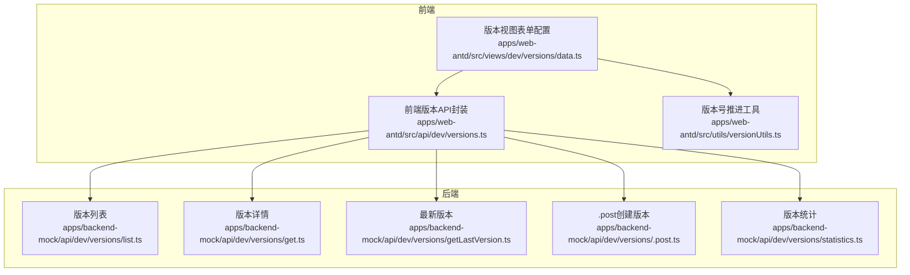
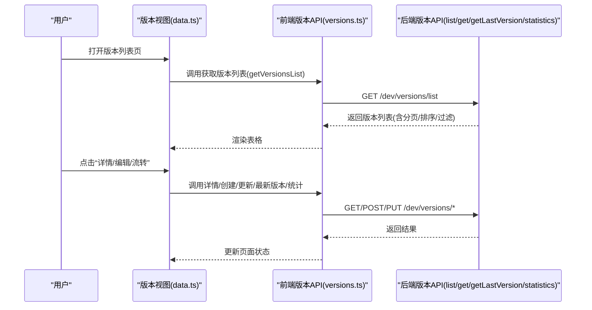
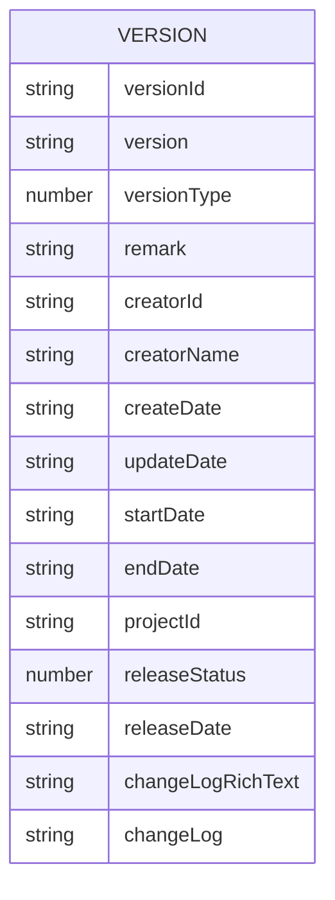
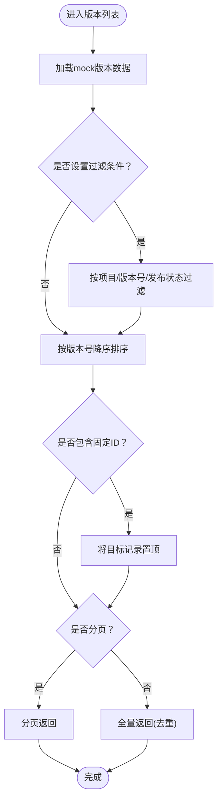
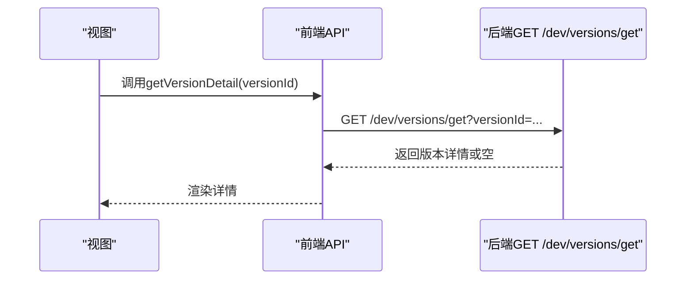
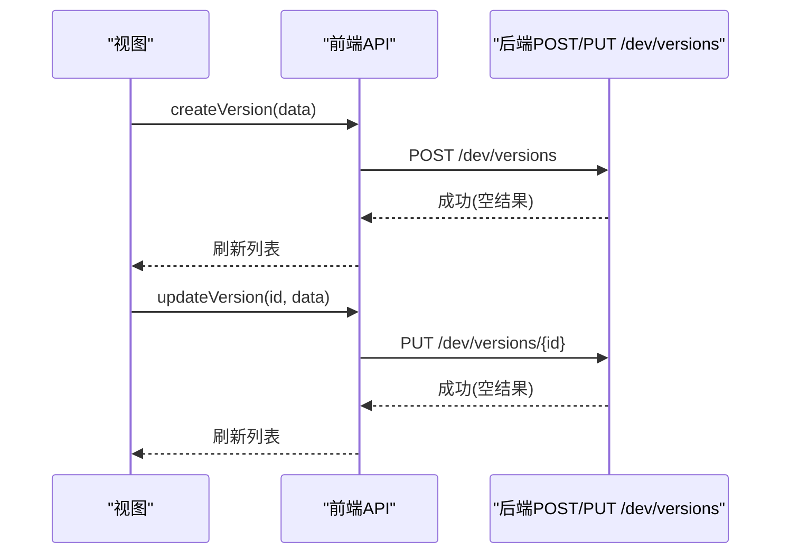
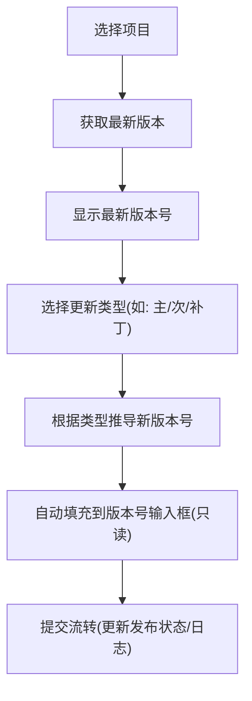
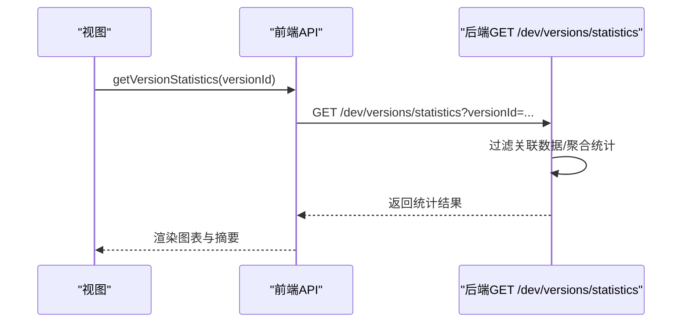
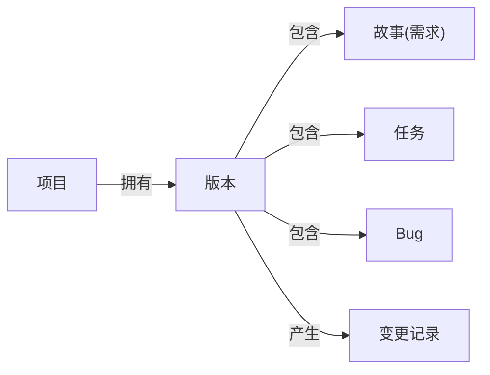
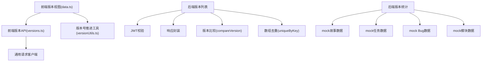

# 版本管理组件

<cite>
**本文引用的文件**
- [apps/backend-mock/api/dev/versions/list.ts](file://apps/backend-mock/api/dev/versions/list.ts)
- [apps/backend-mock/api/dev/versions/get.ts](file://apps/backend-mock/api/dev/versions/get.ts)
- [apps/backend-mock/api/dev/versions/getLastVersion.ts](file://apps/backend-mock/api/dev/versions/getLastVersion.ts)
- [apps/backend-mock/api/dev/versions/.post.ts](file://apps/backend-mock/api/dev/versions/.post.ts)
- [apps/backend-mock/api/dev/versions/statistics.ts](file://apps/backend-mock/api/dev/versions/statistics.ts)
- [apps/web-antd/src/api/dev/versions.ts](file://apps/web-antd/src/api/dev/versions.ts)
- [apps/web-antd/src/views/dev/versions/data.ts](file://apps/web-antd/src/views/dev/versions/data.ts)
- [apps/backend-mock/api/dev/story/list.ts](file://apps/backend-mock/api/dev/story/list.ts)
- [apps/backend-mock/api/dev/bug/list.ts](file://apps/backend-mock/api/dev/bug/list.ts)
- [apps/backend-mock/api/dev/change/list.ts](file://apps/backend-mock/api/dev/change/list.ts)
- [apps/web-antd/src/utils/versionUtils.ts](file://apps/web-antd/src/utils/versionUtils.ts)
</cite>

## 目录
1. [简介](#简介)
2. [项目结构](#项目结构)
3. [核心组件](#核心组件)
4. [架构总览](#架构总览)
5. [详细组件分析](#详细组件分析)
6. [依赖关系分析](#依赖关系分析)
7. [性能考量](#性能考量)
8. [故障排查指南](#故障排查指南)
9. [结论](#结论)
10. [附录](#附录)

## 简介
本文件系统化梳理版本管理组件的设计与实现，覆盖版本列表展示、版本详情查看、版本新增与编辑、版本推进（流转）以及版本统计数据等关键能力。文档从数据模型、发布流程、版本控制机制出发，结合前后端接口与前端表单/表格配置，给出可操作的配置项、API 调用方式与版本推进处理机制，并提供版本组件与项目、故事、任务等业务组件的关系说明及扩展建议。

## 项目结构
版本管理组件由“后端 Mock API + 前端 API 封装 + 前端视图与表单配置”构成，核心文件分布如下：
- 后端 API（Nitro h3）：版本列表、版本详情、最新版本、版本创建、版本统计
- 前端 API 封装：统一的版本管理请求客户端封装与类型定义
- 前端视图与表单：版本列表页、新增/编辑表单、流转表单、字典渲染、版本号推进工具

**图表来源**
- [apps/web-antd/src/api/dev/versions.ts:1-145](file://apps/web-antd/src/api/dev/versions.ts#L1-L145)
- [apps/web-antd/src/views/dev/versions/data.ts:1-308](file://apps/web-antd/src/views/dev/versions/data.ts#L1-L308)
- [apps/web-antd/src/utils/versionUtils.ts](file://apps/web-antd/src/utils/versionUtils.ts)
- [apps/backend-mock/api/dev/versions/list.ts:1-109](file://apps/backend-mock/api/dev/versions/list.ts#L1-L109)
- [apps/backend-mock/api/dev/versions/get.ts:1-17](file://apps/backend-mock/api/dev/versions/get.ts#L1-L17)
- [apps/backend-mock/api/dev/versions/getLastVersion.ts:1-26](file://apps/backend-mock/api/dev/versions/getLastVersion.ts#L1-L26)
- [apps/backend-mock/api/dev/versions/.post.ts:1-17](file://apps/backend-mock/api/dev/versions/.post.ts#L1-L17)
- [apps/backend-mock/api/dev/versions/statistics.ts:1-316](file://apps/backend-mock/api/dev/versions/statistics.ts#L1-L316)

**章节来源**
- [apps/web-antd/src/api/dev/versions.ts:1-145](file://apps/web-antd/src/api/dev/versions.ts#L1-L145)
- [apps/web-antd/src/views/dev/versions/data.ts:1-308](file://apps/web-antd/src/views/dev/versions/data.ts#L1-L308)
- [apps/backend-mock/api/dev/versions/list.ts:1-109](file://apps/backend-mock/api/dev/versions/list.ts#L1-L109)
- [apps/backend-mock/api/dev/versions/get.ts:1-17](file://apps/backend-mock/api/dev/versions/get.ts#L1-L17)
- [apps/backend-mock/api/dev/versions/getLastVersion.ts:1-26](file://apps/backend-mock/api/dev/versions/getLastVersion.ts#L1-L26)
- [apps/backend-mock/api/dev/versions/.post.ts:1-17](file://apps/backend-mock/api/dev/versions/.post.ts#L1-L17)
- [apps/backend-mock/api/dev/versions/statistics.ts:1-316](file://apps/backend-mock/api/dev/versions/statistics.ts#L1-L316)

## 核心组件
- 版本数据模型
  - 关键字段：版本标识、版本号、版本类型、备注、创建者信息、计划/发布起止时间、所属项目、发布状态、变更日志等
  - 字段约束：版本号采用 x.y.z 格式；版本类型与发布状态来自本地字典
- 版本列表展示
  - 支持按项目、版本号、发布状态筛选；默认按版本号降序排序；支持分页与全量返回
- 版本详情查看
  - 根据版本 ID 返回完整版本信息
- 版本新增与编辑
  - 新增：提交不含版本标识的版本对象
  - 编辑：按版本 ID 提交更新对象（自动剔除版本标识）
- 版本推进（流转）
  - 通过“流转表单”更新发布状态与变更日志富文本
- 版本统计数据
  - 统计需求/任务/Bug 总量与完成量、开发进度趋势、人员维度分布、模块分布、需求/任务/Bug 类型分布等

**章节来源**
- [apps/web-antd/src/api/dev/versions.ts:53-71](file://apps/web-antd/src/api/dev/versions.ts#L53-L71)
- [apps/web-antd/src/views/dev/versions/data.ts:10-141](file://apps/web-antd/src/views/dev/versions/data.ts#L10-L141)
- [apps/backend-mock/api/dev/versions/list.ts:22-55](file://apps/backend-mock/api/dev/versions/list.ts#L22-L55)
- [apps/backend-mock/api/dev/versions/statistics.ts:110-315](file://apps/backend-mock/api/dev/versions/statistics.ts#L110-L315)

## 架构总览
版本管理组件采用“前端 API 封装 + 后端 Mock API”的分层设计，前端负责表单校验、版本号推进与交互逻辑，后端提供版本数据与统计聚合。

**图表来源**
- [apps/web-antd/src/views/dev/versions/data.ts:1-308](file://apps/web-antd/src/views/dev/versions/data.ts#L1-L308)
- [apps/web-antd/src/api/dev/versions.ts:73-144](file://apps/web-antd/src/api/dev/versions.ts#L73-L144)
- [apps/backend-mock/api/dev/versions/list.ts:57-108](file://apps/backend-mock/api/dev/versions/list.ts#L57-L108)
- [apps/backend-mock/api/dev/versions/get.ts:6-16](file://apps/backend-mock/api/dev/versions/get.ts#L6-L16)
- [apps/backend-mock/api/dev/versions/getLastVersion.ts:7-25](file://apps/backend-mock/api/dev/versions/getLastVersion.ts#L7-L25)
- [apps/backend-mock/api/dev/versions/statistics.ts:110-315](file://apps/backend-mock/api/dev/versions/statistics.ts#L110-L315)

## 详细组件分析

### 版本数据模型与字典
- 字段说明
  - 版本标识、版本号、版本类型、备注、创建者信息、计划/发布起止时间、所属项目、发布状态、变更日志等
- 字典与渲染
  - 版本类型与发布状态通过本地字典渲染为标签
  - 表格列包含版本号、备注、版本类型、发布状态、计划/发布时间、创建人等

**图表来源**
- [apps/web-antd/src/api/dev/versions.ts:53-71](file://apps/web-antd/src/api/dev/versions.ts#L53-L71)
- [apps/web-antd/src/views/dev/versions/data.ts:181-277](file://apps/web-antd/src/views/dev/versions/data.ts#L181-L277)

**章节来源**
- [apps/web-antd/src/api/dev/versions.ts:53-71](file://apps/web-antd/src/api/dev/versions.ts#L53-L71)
- [apps/web-antd/src/views/dev/versions/data.ts:181-277](file://apps/web-antd/src/views/dev/versions/data.ts#L181-L277)

### 版本列表展示与查询
- 功能点
  - 支持项目筛选、版本号精确匹配、发布状态筛选
  - 默认按版本号降序排序；支持 includeId 固定某条记录至首条
  - 分页与全量返回两种模式
- 性能提示
  - 排序基于语义化版本比较函数；全量去重保证唯一性

**图表来源**
- [apps/backend-mock/api/dev/versions/list.ts:57-108](file://apps/backend-mock/api/dev/versions/list.ts#L57-L108)

**章节来源**
- [apps/backend-mock/api/dev/versions/list.ts:57-108](file://apps/backend-mock/api/dev/versions/list.ts#L57-L108)

### 版本详情查看
- 功能点
  - 通过版本 ID 查询对应版本详情
- 安全性
  - 请求前进行访问令牌校验

**图表来源**
- [apps/web-antd/src/api/dev/versions.ts:85-94](file://apps/web-antd/src/api/dev/versions.ts#L85-L94)
- [apps/backend-mock/api/dev/versions/get.ts:6-16](file://apps/backend-mock/api/dev/versions/get.ts#L6-L16)

**章节来源**
- [apps/web-antd/src/api/dev/versions.ts:85-94](file://apps/web-antd/src/api/dev/versions.ts#L85-L94)
- [apps/backend-mock/api/dev/versions/get.ts:6-16](file://apps/backend-mock/api/dev/versions/get.ts#L6-L16)

### 版本新增与编辑
- 新增
  - 前端提交不含版本标识的对象，后端创建接口返回空结果（模拟）
- 编辑
  - 前端按版本 ID 提交更新对象，内部剔除版本标识字段后再发送

**图表来源**
- [apps/web-antd/src/api/dev/versions.ts:101-120](file://apps/web-antd/src/api/dev/versions.ts#L101-L120)
- [apps/backend-mock/api/dev/versions/.post.ts:9-16](file://apps/backend-mock/api/dev/versions/.post.ts#L9-L16)

**章节来源**
- [apps/web-antd/src/api/dev/versions.ts:101-120](file://apps/web-antd/src/api/dev/versions.ts#L101-L120)
- [apps/backend-mock/api/dev/versions/.post.ts:9-16](file://apps/backend-mock/api/dev/versions/.post.ts#L9-L16)

### 版本推进（流转）与版本号推进
- 流转
  - 通过“流转表单”更新发布状态与变更日志富文本
- 版本号推进
  - 基于“最新版本号”与“更新类型”，自动计算新版本号
  - 支持触发字段联动，输入框只读显示推导值

**图表来源**
- [apps/web-antd/src/views/dev/versions/data.ts:52-112](file://apps/web-antd/src/views/dev/versions/data.ts#L52-L112)
- [apps/web-antd/src/utils/versionUtils.ts](file://apps/web-antd/src/utils/versionUtils.ts)

**章节来源**
- [apps/web-antd/src/views/dev/versions/data.ts:52-112](file://apps/web-antd/src/views/dev/versions/data.ts#L52-L112)
- [apps/web-antd/src/utils/versionUtils.ts](file://apps/web-antd/src/utils/versionUtils.ts)

### 版本统计数据与报表
- 统计范围
  - 仅统计与当前版本关联的需求、任务、Bug（其中 Bug 仅统计已确认）
- 指标维度
  - 摘要：需求总数/完成数、任务总数/完成数、Bug总数/修复数
  - 进度趋势：近30天任务完成与Bug修复按日统计
  - 人员维度：任务/需求数量占比、工时占比、模块分布
  - 面板：需求类型/来源/状态漏斗、任务类型/工作量、Bug类型/级别/来源、修复人排行
- 数据来源
  - 前端通过版本 ID 查询统计接口，后端聚合 mock 数据

**图表来源**
- [apps/web-antd/src/api/dev/versions.ts:134-144](file://apps/web-antd/src/api/dev/versions.ts#L134-L144)
- [apps/backend-mock/api/dev/versions/statistics.ts:110-315](file://apps/backend-mock/api/dev/versions/statistics.ts#L110-L315)

**章节来源**
- [apps/web-antd/src/api/dev/versions.ts:134-144](file://apps/web-antd/src/api/dev/versions.ts#L134-L144)
- [apps/backend-mock/api/dev/versions/statistics.ts:110-315](file://apps/backend-mock/api/dev/versions/statistics.ts#L110-L315)

### 版本与业务组件的关系与约束
- 与项目
  - 版本属于项目维度，列表与最新版本查询支持按项目过滤
- 与故事（需求）
  - 故事可绑定版本；统计时按版本过滤故事集合
- 与任务
  - 任务可绑定版本；统计时按版本过滤任务集合
- 与Bug
  - Bug可绑定版本；统计时仅统计“已确认”的Bug
- 与变更记录
  - 变更记录可关联版本，用于追踪版本推进与变更历史

**图表来源**
- [apps/backend-mock/api/dev/story/list.ts:26-60](file://apps/backend-mock/api/dev/story/list.ts#L26-L60)
- [apps/backend-mock/api/dev/bug/list.ts:30-53](file://apps/backend-mock/api/dev/bug/list.ts#L30-L53)
- [apps/backend-mock/api/dev/change/list.ts:38-38](file://apps/backend-mock/api/dev/change/list.ts#L38-L38)
- [apps/backend-mock/api/dev/versions/statistics.ts:122-125](file://apps/backend-mock/api/dev/versions/statistics.ts#L122-L125)

**章节来源**
- [apps/backend-mock/api/dev/story/list.ts:26-60](file://apps/backend-mock/api/dev/story/list.ts#L26-L60)
- [apps/backend-mock/api/dev/bug/list.ts:30-53](file://apps/backend-mock/api/dev/bug/list.ts#L30-L53)
- [apps/backend-mock/api/dev/change/list.ts:38-38](file://apps/backend-mock/api/dev/change/list.ts#L38-L38)
- [apps/backend-mock/api/dev/versions/statistics.ts:122-125](file://apps/backend-mock/api/dev/versions/statistics.ts#L122-L125)

## 依赖关系分析
- 前端依赖
  - 版本 API 封装依赖通用请求客户端
  - 视图依赖字典、表单适配器、Vxe 表格、版本号推进工具
- 后端依赖
  - 版本 API 依赖 JWT 校验、响应封装、版本比较工具、数组去重工具
  - 统计接口依赖 mock 的故事/任务/Bug/模块数据

**图表来源**
- [apps/web-antd/src/views/dev/versions/data.ts:1-308](file://apps/web-antd/src/views/dev/versions/data.ts#L1-L308)
- [apps/web-antd/src/api/dev/versions.ts:1-145](file://apps/web-antd/src/api/dev/versions.ts#L1-L145)
- [apps/backend-mock/api/dev/versions/list.ts:1-109](file://apps/backend-mock/api/dev/versions/list.ts#L1-L109)
- [apps/backend-mock/api/dev/versions/statistics.ts:1-316](file://apps/backend-mock/api/dev/versions/statistics.ts#L1-L316)

**章节来源**
- [apps/web-antd/src/views/dev/versions/data.ts:1-308](file://apps/web-antd/src/views/dev/versions/data.ts#L1-L308)
- [apps/web-antd/src/api/dev/versions.ts:1-145](file://apps/web-antd/src/api/dev/versions.ts#L1-L145)
- [apps/backend-mock/api/dev/versions/list.ts:1-109](file://apps/backend-mock/api/dev/versions/list.ts#L1-L109)
- [apps/backend-mock/api/dev/versions/statistics.ts:1-316](file://apps/backend-mock/api/dev/versions/statistics.ts#L1-L316)

## 性能考量
- 排序与过滤
  - 版本列表默认按版本号降序排序，建议在大数据量场景下增加服务端分页与索引
- 去重与分页
  - 全量返回前执行去重，避免重复记录影响渲染；分页接口减少一次性传输数据量
- 统计聚合
  - 统计接口对多类实体进行过滤与聚合，建议缓存热点版本统计结果，降低重复计算成本

[本节为通用指导，无需列出具体文件来源]

## 故障排查指南
- 认证失败
  - 现象：返回未授权
  - 排查：确认请求头携带有效访问令牌
  - 参考
    - [apps/backend-mock/api/dev/versions/list.ts:58-61](file://apps/backend-mock/api/dev/versions/list.ts#L58-L61)
    - [apps/backend-mock/api/dev/versions/get.ts:7-10](file://apps/backend-mock/api/dev/versions/get.ts#L7-L10)
    - [apps/backend-mock/api/dev/versions/getLastVersion.ts:8-11](file://apps/backend-mock/api/dev/versions/getLastVersion.ts#L8-L11)
    - [apps/backend-mock/api/dev/versions/statistics.ts:111-114](file://apps/backend-mock/api/dev/versions/statistics.ts#L111-L114)
- 版本号格式错误
  - 现象：表单校验失败
  - 排查：确保版本号符合 x.y.z 格式
  - 参考
    - [apps/web-antd/src/views/dev/versions/data.ts:96-98](file://apps/web-antd/src/views/dev/versions/data.ts#L96-L98)
- 版本推进不可用
  - 现象：流转按钮被禁用
  - 排查：当发布状态为“已关闭”时禁用流转
  - 参考
    - [apps/web-antd/src/views/dev/versions/data.ts:254-256](file://apps/web-antd/src/views/dev/versions/data.ts#L254-L256)
- 最新版本为空
  - 现象：最新版本查询返回空
  - 排查：确认项目 ID 正确且存在版本数据
  - 参考
    - [apps/backend-mock/api/dev/versions/getLastVersion.ts:15-24](file://apps/backend-mock/api/dev/versions/getLastVersion.ts#L15-L24)

**章节来源**
- [apps/backend-mock/api/dev/versions/list.ts:58-61](file://apps/backend-mock/api/dev/versions/list.ts#L58-L61)
- [apps/backend-mock/api/dev/versions/get.ts:7-10](file://apps/backend-mock/api/dev/versions/get.ts#L7-L10)
- [apps/backend-mock/api/dev/versions/getLastVersion.ts:8-11](file://apps/backend-mock/api/dev/versions/getLastVersion.ts#L8-L11)
- [apps/backend-mock/api/dev/versions/statistics.ts:111-114](file://apps/backend-mock/api/dev/versions/statistics.ts#L111-L114)
- [apps/web-antd/src/views/dev/versions/data.ts:96-98](file://apps/web-antd/src/views/dev/versions/data.ts#L96-L98)
- [apps/web-antd/src/views/dev/versions/data.ts:254-256](file://apps/web-antd/src/views/dev/versions/data.ts#L254-L256)
- [apps/backend-mock/api/dev/versions/getLastVersion.ts:15-24](file://apps/backend-mock/api/dev/versions/getLastVersion.ts#L15-L24)

## 结论
版本管理组件通过清晰的数据模型、完善的前后端接口与灵活的前端表单/表格配置，实现了版本列表、详情、新增/编辑、推进与统计等核心能力。组件与项目、故事、任务、Bug 等业务实体形成明确的关联关系，便于在实际项目中进行版本规划、发布准备、版本切换与回滚。建议在生产环境中引入服务端分页、索引与缓存策略，进一步提升性能与稳定性。

[本节为总结性内容，无需列出具体文件来源]

## 附录

### API 接口一览
- 获取版本列表
  - 方法：GET
  - 路径：/dev/versions/list
  - 参数：page、pageSize、version、releaseStatus、projectId、includeId
  - 返回：分页或全量版本列表
  - 参考
    - [apps/web-antd/src/api/dev/versions.ts:78-83](file://apps/web-antd/src/api/dev/versions.ts#L78-L83)
    - [apps/backend-mock/api/dev/versions/list.ts:57-108](file://apps/backend-mock/api/dev/versions/list.ts#L57-L108)
- 获取版本详情
  - 方法：GET
  - 路径：/dev/versions/get
  - 参数：versionId
  - 返回：版本详情
  - 参考
    - [apps/web-antd/src/api/dev/versions.ts:90-94](file://apps/web-antd/src/api/dev/versions.ts#L90-L94)
    - [apps/backend-mock/api/dev/versions/get.ts:6-16](file://apps/backend-mock/api/dev/versions/get.ts#L6-L16)
- 获取最新版本
  - 方法：GET
  - 路径：/dev/versions/getLastVersion
  - 参数：page、pageSize、projectId
  - 返回：最新版本
  - 参考
    - [apps/web-antd/src/api/dev/versions.ts:127-132](file://apps/web-antd/src/api/dev/versions.ts#L127-L132)
    - [apps/backend-mock/api/dev/versions/getLastVersion.ts:7-25](file://apps/backend-mock/api/dev/versions/getLastVersion.ts#L7-L25)
- 创建版本
  - 方法：POST
  - 路径：/dev/versions
  - 参数：版本对象（不含版本标识）
  - 返回：空结果
  - 参考
    - [apps/web-antd/src/api/dev/versions.ts:101-106](file://apps/web-antd/src/api/dev/versions.ts#L101-L106)
    - [apps/backend-mock/api/dev/versions/.post.ts:9-16](file://apps/backend-mock/api/dev/versions/.post.ts#L9-L16)
- 更新版本
  - 方法：PUT
  - 路径：/dev/versions/{id}
  - 参数：版本对象（不含版本标识）
  - 返回：空结果
  - 参考
    - [apps/web-antd/src/api/dev/versions.ts:114-120](file://apps/web-antd/src/api/dev/versions.ts#L114-L120)
- 获取版本统计
  - 方法：GET
  - 路径：/dev/versions/statistics
  - 参数：versionId
  - 返回：统计聚合结果
  - 参考
    - [apps/web-antd/src/api/dev/versions.ts:139-144](file://apps/web-antd/src/api/dev/versions.ts#L139-L144)
    - [apps/backend-mock/api/dev/versions/statistics.ts:110-315](file://apps/backend-mock/api/dev/versions/statistics.ts#L110-L315)

**章节来源**
- [apps/web-antd/src/api/dev/versions.ts:78-144](file://apps/web-antd/src/api/dev/versions.ts#L78-L144)
- [apps/backend-mock/api/dev/versions/list.ts:57-108](file://apps/backend-mock/api/dev/versions/list.ts#L57-L108)
- [apps/backend-mock/api/dev/versions/get.ts:6-16](file://apps/backend-mock/api/dev/versions/get.ts#L6-L16)
- [apps/backend-mock/api/dev/versions/getLastVersion.ts:7-25](file://apps/backend-mock/api/dev/versions/getLastVersion.ts#L7-L25)
- [apps/backend-mock/api/dev/versions/.post.ts:9-16](file://apps/backend-mock/api/dev/versions/.post.ts#L9-L16)
- [apps/backend-mock/api/dev/versions/statistics.ts:110-315](file://apps/backend-mock/api/dev/versions/statistics.ts#L110-L315)

### 配置选项与使用要点
- 表单配置
  - 项目选择、最新版本号联动、更新类型联动推导版本号、发布状态选择、备注、起止时间
  - 参考
    - [apps/web-antd/src/views/dev/versions/data.ts:11-141](file://apps/web-antd/src/views/dev/versions/data.ts#L11-L141)
- 表格列配置
  - 版本号、备注、版本类型、发布状态、计划/发布日期、创建人、操作列（详情/流转/编辑/删除）
  - 参考
    - [apps/web-antd/src/views/dev/versions/data.ts:181-277](file://apps/web-antd/src/views/dev/versions/data.ts#L181-L277)
- 版本号推进
  - 通过工具函数根据“最新版本号”与“更新类型”生成新版本号
  - 参考
    - [apps/web-antd/src/utils/versionUtils.ts](file://apps/web-antd/src/utils/versionUtils.ts)
    - [apps/web-antd/src/views/dev/versions/data.ts:75-112](file://apps/web-antd/src/views/dev/versions/data.ts#L75-L112)

**章节来源**
- [apps/web-antd/src/views/dev/versions/data.ts:11-141](file://apps/web-antd/src/views/dev/versions/data.ts#L11-L141)
- [apps/web-antd/src/views/dev/versions/data.ts:181-277](file://apps/web-antd/src/views/dev/versions/data.ts#L181-L277)
- [apps/web-antd/src/utils/versionUtils.ts](file://apps/web-antd/src/utils/versionUtils.ts)

### 版本推进处理机制
- 流转步骤
  - 选择版本 → 修改发布状态 → 填写变更日志 → 提交
- 状态约束
  - 已关闭版本禁止再次流转
- 参考
  - [apps/web-antd/src/views/dev/versions/data.ts:254-256](file://apps/web-antd/src/views/dev/versions/data.ts#L254-L256)
  - [apps/web-antd/src/views/dev/versions/data.ts:280-307](file://apps/web-antd/src/views/dev/versions/data.ts#L280-L307)

**章节来源**
- [apps/web-antd/src/views/dev/versions/data.ts:254-256](file://apps/web-antd/src/views/dev/versions/data.ts#L254-L256)
- [apps/web-antd/src/views/dev/versions/data.ts:280-307](file://apps/web-antd/src/views/dev/versions/data.ts#L280-L307)

### 扩展与最佳实践
- 自定义版本策略
  - 在前端工具函数中扩展版本号推进规则；在后端接口中增加版本号校验与冲突处理
- 发布管理最佳实践
  - 引入发布状态机与审批流程；为版本推进增加审计日志；对统计接口增加缓存与异步计算
- 与项目/故事/任务/Bug 的集成
  - 在创建/编辑版本时同步校验关联实体状态；在统计接口中细化维度与指标

[本节为概念性建议，无需列出具体文件来源]