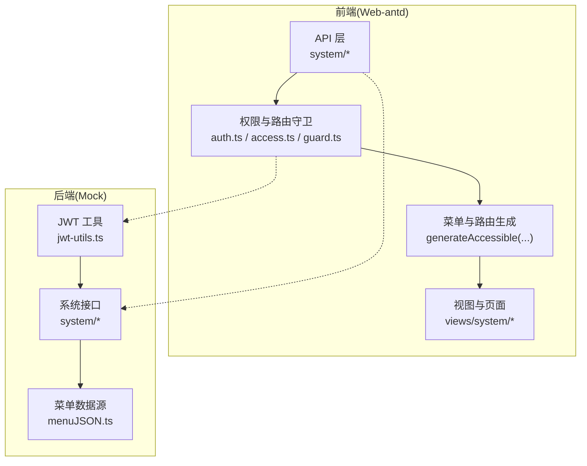
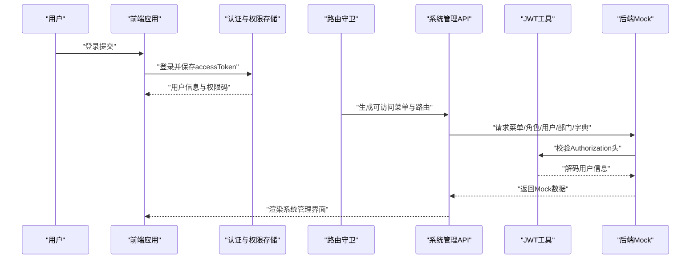
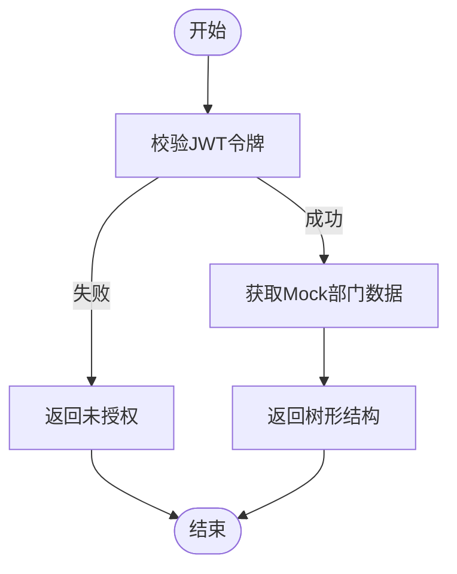
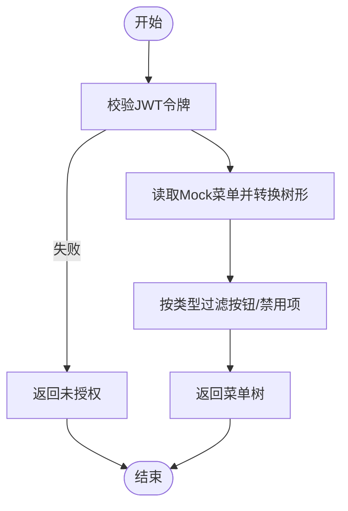
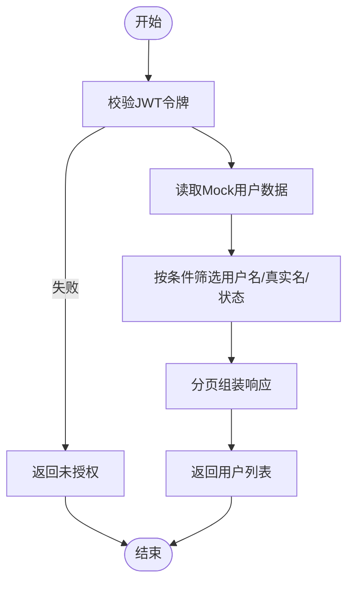
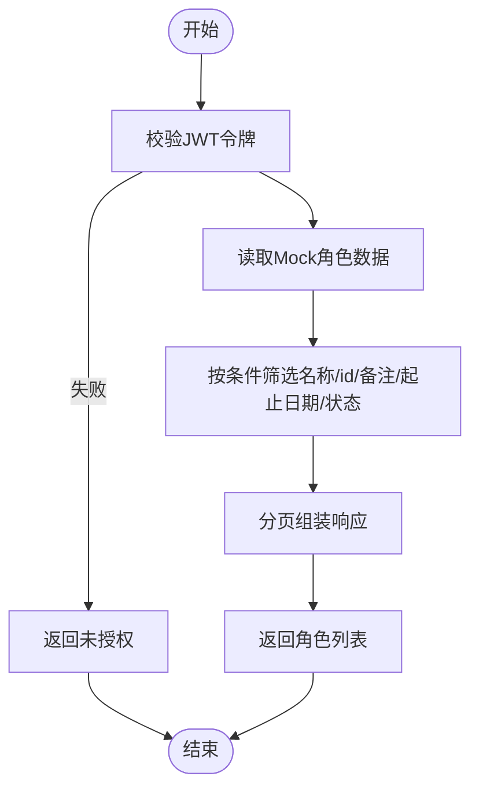
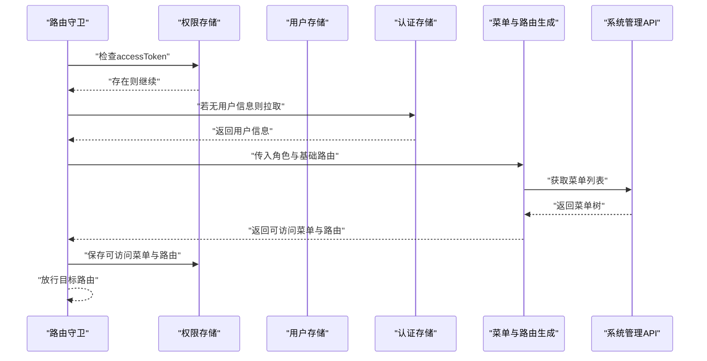
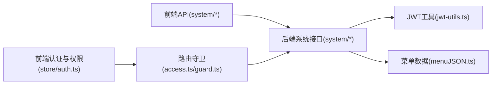

# 系统管理组件

<cite>
**本文引用的文件**
- [apps/backend-mock/api/system/dept/list.ts](file://apps/backend-mock/api/system/dept/list.ts)
- [apps/backend-mock/api/system/menu/list.ts](file://apps/backend-mock/api/system/menu/list.ts)
- [apps/backend-mock/api/system/role/list.ts](file://apps/backend-mock/api/system/role/list.ts)
- [apps/backend-mock/api/system/user/list.ts](file://apps/backend-mock/api/system/user/list.ts)
- [apps/backend-mock/api/menu/menuJSON.ts](file://apps/backend-mock/api/menu/menuJSON.ts)
- [apps/backend-mock/utils/jwt-utils.ts](file://apps/backend-mock/utils/jwt-utils.ts)
- [apps/web-antd/src/api/system/index.ts](file://apps/web-antd/src/api/system/index.ts)
- [apps/web-antd/src/api/system/dept.ts](file://apps/web-antd/src/api/system/dept.ts)
- [apps/web-antd/src/api/system/menu.ts](file://apps/web-antd/src/api/system/menu.ts)
- [apps/web-antd/src/api/system/role.ts](file://apps/web-antd/src/api/system/role.ts)
- [apps/web-antd/src/api/system/user.ts](file://apps/web-antd/src/api/system/user.ts)
- [apps/web-antd/src/api/system/dict.ts](file://apps/web-antd/src/api/system/dict.ts)
- [apps/web-antd/src/store/auth.ts](file://apps/web-antd/src/store/auth.ts)
- [apps/web-antd/src/router/access.ts](file://apps/web-antd/src/router/access.ts)
- [apps/web-antd/src/router/guard.ts](file://apps/web-antd/src/router/guard.ts)
</cite>

## 目录
1. [引言](#引言)
2. [项目结构](#项目结构)
3. [核心组件](#核心组件)
4. [架构总览](#架构总览)
5. [详细组件分析](#详细组件分析)
6. [依赖分析](#依赖分析)
7. [性能考虑](#性能考虑)
8. [故障排查指南](#故障排查指南)
9. [结论](#结论)
10. [附录](#附录)

## 引言
本文件系统性梳理“系统管理组件”的实现与使用方式，覆盖部门管理、菜单管理、用户管理、角色管理、字典管理等子模块；阐明权限控制机制、组织架构管理、API 接口与配置要点，并给出与业务组件的权限关联与访问控制关系说明。文档同时提供扩展方法、权限体系定制开发指南与企业级安全管理最佳实践建议，帮助读者在实际项目中高效落地与演进。

## 项目结构
系统管理组件由前端 API 层、权限与路由守卫层、以及后端 Mock 数据与鉴权工具组成。前端通过统一请求客户端调用后端接口，后端接口基于 JWT 校验与菜单/角色/用户/部门/字典等 Mock 数据进行演示。

**图表来源**
- [apps/web-antd/src/api/system/index.ts:1-6](file://apps/web-antd/src/api/system/index.ts#L1-L6)
- [apps/web-antd/src/store/auth.ts:1-118](file://apps/web-antd/src/store/auth.ts#L1-L118)
- [apps/web-antd/src/router/access.ts:1-54](file://apps/web-antd/src/router/access.ts#L1-L54)
- [apps/web-antd/src/router/guard.ts:1-133](file://apps/web-antd/src/router/guard.ts#L1-L133)
- [apps/backend-mock/utils/jwt-utils.ts:1-115](file://apps/backend-mock/utils/jwt-utils.ts#L1-L115)
- [apps/backend-mock/api/menu/menuJSON.ts:1-426](file://apps/backend-mock/api/menu/menuJSON.ts#L1-L426)

**章节来源**
- [apps/web-antd/src/api/system/index.ts:1-6](file://apps/web-antd/src/api/system/index.ts#L1-L6)
- [apps/web-antd/src/store/auth.ts:1-118](file://apps/web-antd/src/store/auth.ts#L1-L118)
- [apps/web-antd/src/router/access.ts:1-54](file://apps/web-antd/src/router/access.ts#L1-L54)
- [apps/web-antd/src/router/guard.ts:1-133](file://apps/web-antd/src/router/guard.ts#L1-L133)
- [apps/backend-mock/utils/jwt-utils.ts:1-115](file://apps/backend-mock/utils/jwt-utils.ts#L1-L115)
- [apps/backend-mock/api/menu/menuJSON.ts:1-426](file://apps/backend-mock/api/menu/menuJSON.ts#L1-L426)

## 核心组件
- 部门管理：提供部门列表、新增、更新、删除能力，支持树形结构与状态管理。
- 菜单管理：提供菜单列表、名称/路径唯一性校验、新增、更新、删除能力，支持树形菜单与元信息配置。
- 用户管理：提供用户列表、全量查询、新增、更新能力，支持多部门关联与状态管理。
- 角色管理：提供角色列表、权限标识集合、新增、更新、删除能力，支持按条件筛选分页。
- 字典管理：提供字典列表、全量查询、新增、更新能力，支持父子层级与类型标记。

上述能力均由前端 API 模块导出统一入口，并通过后端 Mock 接口与 JWT 鉴权保障访问控制。

**章节来源**
- [apps/web-antd/src/api/system/dept.ts:1-53](file://apps/web-antd/src/api/system/dept.ts#L1-L53)
- [apps/web-antd/src/api/system/menu.ts:1-160](file://apps/web-antd/src/api/system/menu.ts#L1-L160)
- [apps/web-antd/src/api/system/user.ts:1-54](file://apps/web-antd/src/api/system/user.ts#L1-L54)
- [apps/web-antd/src/api/system/role.ts:1-56](file://apps/web-antd/src/api/system/role.ts#L1-L56)
- [apps/web-antd/src/api/system/dict.ts:1-73](file://apps/web-antd/src/api/system/dict.ts#L1-L73)
- [apps/web-antd/src/api/system/index.ts:1-6](file://apps/web-antd/src/api/system/index.ts#L1-L6)

## 架构总览
系统管理组件的运行流程如下：
- 前端登录成功后，保存访问令牌并拉取用户信息与权限码。
- 路由守卫根据用户角色与权限码生成可访问菜单与路由。
- 前端通过统一请求客户端调用后端接口，后端接口基于 JWT 校验请求头中的令牌有效性。
- 后端返回 Mock 数据（菜单树、角色权限、用户与部门数据），前端渲染对应管理界面。

**图表来源**
- [apps/web-antd/src/store/auth.ts:1-118](file://apps/web-antd/src/store/auth.ts#L1-L118)
- [apps/web-antd/src/router/guard.ts:1-133](file://apps/web-antd/src/router/guard.ts#L1-L133)
- [apps/web-antd/src/router/access.ts:1-54](file://apps/web-antd/src/router/access.ts#L1-L54)
- [apps/backend-mock/utils/jwt-utils.ts:1-115](file://apps/backend-mock/utils/jwt-utils.ts#L1-L115)
- [apps/backend-mock/api/system/menu/list.ts:1-13](file://apps/backend-mock/api/system/menu/list.ts#L1-L13)
- [apps/backend-mock/api/system/role/list.ts:1-118](file://apps/backend-mock/api/system/role/list.ts#L1-L118)
- [apps/backend-mock/api/system/user/list.ts:1-120](file://apps/backend-mock/api/system/user/list.ts#L1-L120)
- [apps/backend-mock/api/system/dept/list.ts:1-62](file://apps/backend-mock/api/system/dept/list.ts#L1-L62)

## 详细组件分析

### 部门管理
- 数据模型
  - 字段：id、pid（父级）、name、status、remark、children（树形子节点）。
  - 状态：0/1 表示禁用/启用。
- 主要接口
  - 获取部门列表：GET /system/dept/list
  - 新增部门：POST /system/dept
  - 更新部门：PUT /system/dept/{id}
  - 删除部门：DELETE /system/dept/{id}
- 实现要点
  - 后端接口对 Authorization 头进行校验，校验失败返回未授权响应。
  - 前端通过统一请求客户端封装 CRUD 方法，返回树形结构数据。

**图表来源**
- [apps/backend-mock/api/system/dept/list.ts:1-62](file://apps/backend-mock/api/system/dept/list.ts#L1-L62)
- [apps/backend-mock/utils/jwt-utils.ts:1-115](file://apps/backend-mock/utils/jwt-utils.ts#L1-L115)

**章节来源**
- [apps/web-antd/src/api/system/dept.ts:1-53](file://apps/web-antd/src/api/system/dept.ts#L1-L53)
- [apps/backend-mock/api/system/dept/list.ts:1-62](file://apps/backend-mock/api/system/dept/list.ts#L1-L62)
- [apps/backend-mock/utils/jwt-utils.ts:1-115](file://apps/backend-mock/utils/jwt-utils.ts#L1-L115)

### 菜单管理
- 数据模型
  - 字段：id、pid、name、path、type、component、authCode、meta（图标、徽标、隐藏策略、缓存、外链等）。
  - 类型：catalog、menu、embedded、link、button。
- 主要接口
  - 获取菜单列表：GET /system/menu/list
  - 名称存在性校验：GET /system/menu/name-exists
  - 路径存在性校验：GET /system/menu/path-exists
  - 新增/更新/删除菜单：POST/PUT/DELETE /system/menu
- 实现要点
  - 后端提供 Mock 菜单数据与树形转换函数，支持过滤禁用项与按钮类型开关。
  - 前端定义菜单类型枚举与元信息结构，用于表单与渲染。

**图表来源**
- [apps/backend-mock/api/system/menu/list.ts:1-13](file://apps/backend-mock/api/system/menu/list.ts#L1-L13)
- [apps/backend-mock/api/menu/menuJSON.ts:1-426](file://apps/backend-mock/api/menu/menuJSON.ts#L1-L426)
- [apps/backend-mock/utils/jwt-utils.ts:1-115](file://apps/backend-mock/utils/jwt-utils.ts#L1-L115)

**章节来源**
- [apps/web-antd/src/api/system/menu.ts:1-160](file://apps/web-antd/src/api/system/menu.ts#L1-L160)
- [apps/backend-mock/api/system/menu/list.ts:1-13](file://apps/backend-mock/api/system/menu/list.ts#L1-L13)
- [apps/backend-mock/api/menu/menuJSON.ts:1-426](file://apps/backend-mock/api/menu/menuJSON.ts#L1-L426)

### 用户管理
- 数据模型
  - 字段：userId、username、realName、desc、roles、roleIds、deptIds、status、lastLoginIp、lastLoginDate、createDate、updateDate。
- 主要接口
  - 获取用户列表：GET /system/user/list（支持分页与筛选）
  - 获取全量用户：GET /system/user/listAll
  - 新增/更新用户：POST/PUT /system/user
- 实现要点
  - 后端接口对 Authorization 头进行校验，校验失败返回未授权响应。
  - 前端提供分页与多字段筛选，支持全量与分页两种响应模式。

**图表来源**
- [apps/backend-mock/api/system/user/list.ts:1-120](file://apps/backend-mock/api/system/user/list.ts#L1-L120)
- [apps/backend-mock/utils/jwt-utils.ts:1-115](file://apps/backend-mock/utils/jwt-utils.ts#L1-L115)

**章节来源**
- [apps/web-antd/src/api/system/user.ts:1-54](file://apps/web-antd/src/api/system/user.ts#L1-L54)
- [apps/backend-mock/api/system/user/list.ts:1-120](file://apps/backend-mock/api/system/user/list.ts#L1-L120)

### 角色管理
- 数据模型
  - 字段：id、name、permissions（权限标识数组）、remark、status。
- 主要接口
  - 获取角色列表：GET /system/role/list（支持分页与筛选）
  - 新增/更新/删除角色：POST/PUT/DELETE /system/role
- 实现要点
  - 后端提供预置角色与权限标识集合，支持按名称、备注、状态等条件筛选。
  - 前端提供分页参数传递与列表渲染。

**图表来源**
- [apps/backend-mock/api/system/role/list.ts:1-118](file://apps/backend-mock/api/system/role/list.ts#L1-L118)
- [apps/backend-mock/utils/jwt-utils.ts:1-115](file://apps/backend-mock/utils/jwt-utils.ts#L1-L115)

**章节来源**
- [apps/web-antd/src/api/system/role.ts:1-56](file://apps/web-antd/src/api/system/role.ts#L1-L56)
- [apps/backend-mock/api/system/role/list.ts:1-118](file://apps/backend-mock/api/system/role/list.ts#L1-L118)

### 字典管理
- 数据模型
  - 字段：id、pid、label、value、type、disabled、remark、color、children、createDate。
- 主要接口
  - 获取字典列表：GET /system/dict/list
  - 获取字典全量：GET /system/dict/listAll
  - 新增/更新字典：POST/PUT /system/dict
- 实现要点
  - 支持父子层级与类型标记，常用于下拉/标签等场景。

**章节来源**
- [apps/web-antd/src/api/system/dict.ts:1-73](file://apps/web-antd/src/api/system/dict.ts#L1-L73)

### 权限控制与路由守卫
- 登录与用户信息
  - 登录成功后保存 accessToken，并并发获取用户信息与权限码。
  - 用户信息与权限码写入 Pinia Store，供路由守卫与菜单生成使用。
- 路由生成
  - 基于权限模式与用户角色，异步拉取菜单树并映射为路由。
  - 支持菜单元信息解析（如 query 字段 JSON 化）。
- 访问控制
  - 未登录或无访问令牌时，命中基本路由外重定向至登录页。
  - 动态路由仅生成一次，避免重复开销。
  - 对于未授权访问，可配置 403 容错页面。

**图表来源**
- [apps/web-antd/src/store/auth.ts:1-118](file://apps/web-antd/src/store/auth.ts#L1-L118)
- [apps/web-antd/src/router/guard.ts:1-133](file://apps/web-antd/src/router/guard.ts#L1-L133)
- [apps/web-antd/src/router/access.ts:1-54](file://apps/web-antd/src/router/access.ts#L1-L54)

**章节来源**
- [apps/web-antd/src/store/auth.ts:1-118](file://apps/web-antd/src/store/auth.ts#L1-L118)
- [apps/web-antd/src/router/guard.ts:1-133](file://apps/web-antd/src/router/guard.ts#L1-L133)
- [apps/web-antd/src/router/access.ts:1-54](file://apps/web-antd/src/router/access.ts#L1-L54)

## 依赖分析
- 前端依赖
  - API 层统一导出 system/* 模块，便于上层按需引入。
  - 权限与路由守卫依赖菜单树与用户角色，生成可访问路由与菜单。
- 后端依赖
  - JWT 工具负责令牌生成与校验，校验失败统一返回未授权响应。
  - 菜单数据源集中维护，提供树形转换与过滤逻辑。

**图表来源**
- [apps/web-antd/src/api/system/index.ts:1-6](file://apps/web-antd/src/api/system/index.ts#L1-L6)
- [apps/web-antd/src/store/auth.ts:1-118](file://apps/web-antd/src/store/auth.ts#L1-L118)
- [apps/web-antd/src/router/access.ts:1-54](file://apps/web-antd/src/router/access.ts#L1-L54)
- [apps/web-antd/src/router/guard.ts:1-133](file://apps/web-antd/src/router/guard.ts#L1-L133)
- [apps/backend-mock/utils/jwt-utils.ts:1-115](file://apps/backend-mock/utils/jwt-utils.ts#L1-L115)
- [apps/backend-mock/api/menu/menuJSON.ts:1-426](file://apps/backend-mock/api/menu/menuJSON.ts#L1-L426)

**章节来源**
- [apps/web-antd/src/api/system/index.ts:1-6](file://apps/web-antd/src/api/system/index.ts#L1-L6)
- [apps/backend-mock/utils/jwt-utils.ts:1-115](file://apps/backend-mock/utils/jwt-utils.ts#L1-L115)
- [apps/backend-mock/api/menu/menuJSON.ts:1-426](file://apps/backend-mock/api/menu/menuJSON.ts#L1-L426)

## 性能考虑
- 路由与菜单生成仅在首次登录后执行，避免重复计算。
- 菜单树构建采用映射与一次遍历，复杂度 O(n)。
- 前端分页接口减少一次性传输数据量，提升交互流畅度。
- 建议在生产环境替换 Mock 数据为数据库持久化与缓存策略，结合 RBAC 权限模型与细粒度权限位。

## 故障排查指南
- 未授权访问
  - 现象：接口返回未授权。
  - 排查：确认 Authorization 头是否携带 Bearer 令牌；检查令牌签名密钥与有效期。
- 登录后无法进入系统
  - 现象：停留在登录页或 401。
  - 排查：确认登录成功后是否正确保存 accessToken；检查用户信息与权限码是否拉取成功；确认路由守卫是否生成可访问路由。
- 菜单不显示或按钮不可见
  - 现象：菜单缺失或按钮不显示。
  - 排查：确认菜单状态与类型过滤；检查权限码与用户角色匹配情况；确认菜单元信息（如 hideInMenu）配置。
- 用户/角色/部门数据异常
  - 现象：列表为空或筛选无效。
  - 排查：确认后端接口是否正确校验令牌；检查筛选参数与分页参数传递；核对 Mock 数据范围。

**章节来源**
- [apps/backend-mock/utils/jwt-utils.ts:1-115](file://apps/backend-mock/utils/jwt-utils.ts#L1-L115)
- [apps/web-antd/src/store/auth.ts:1-118](file://apps/web-antd/src/store/auth.ts#L1-L118)
- [apps/web-antd/src/router/guard.ts:1-133](file://apps/web-antd/src/router/guard.ts#L1-L133)
- [apps/web-antd/src/router/access.ts:1-54](file://apps/web-antd/src/router/access.ts#L1-L54)

## 结论
系统管理组件通过清晰的前后端职责划分与统一的权限与路由守卫机制，实现了部门、菜单、用户、角色、字典等管理功能的可配置与可扩展。结合 RBAC 权限模型与企业级安全实践，可在生产环境中快速落地并持续演进。

## 附录

### API 接口一览（系统管理）
- 部门管理
  - GET /system/dept/list
  - POST /system/dept
  - PUT /system/dept/{id}
  - DELETE /system/dept/{id}
- 菜单管理
  - GET /system/menu/list
  - GET /system/menu/name-exists
  - GET /system/menu/path-exists
  - POST /system/menu
  - PUT /system/menu/{id}
  - DELETE /system/menu/{id}
- 用户管理
  - GET /system/user/list
  - GET /system/user/listAll
  - POST /system/user
  - PUT /system/user/{id}
- 角色管理
  - GET /system/role/list
  - POST /system/role
  - PUT /system/role/{id}
  - DELETE /system/role/{id}
- 字典管理
  - GET /system/dict/list
  - GET /system/dict/listAll
  - POST /system/dict
  - PUT /system/dict/{id}

**章节来源**
- [apps/web-antd/src/api/system/dept.ts:1-53](file://apps/web-antd/src/api/system/dept.ts#L1-L53)
- [apps/web-antd/src/api/system/menu.ts:1-160](file://apps/web-antd/src/api/system/menu.ts#L1-L160)
- [apps/web-antd/src/api/system/user.ts:1-54](file://apps/web-antd/src/api/system/user.ts#L1-L54)
- [apps/web-antd/src/api/system/role.ts:1-56](file://apps/web-antd/src/api/system/role.ts#L1-L56)
- [apps/web-antd/src/api/system/dict.ts:1-73](file://apps/web-antd/src/api/system/dict.ts#L1-L73)

### 权限体系定制开发指南
- 权限标识设计
  - 建议采用“模块:功能:动作”层级命名规范，与菜单 authCode 保持一致。
- 角色与权限映射
  - 角色表维护 permissions 数组，后端按角色聚合权限并下发前端。
- 前端访问控制
  - 使用路由守卫与菜单生成逻辑，结合用户角色与权限码生成可访问菜单与路由。
- 安全加固
  - 生产环境替换 Mock 数据为数据库持久化；令牌密钥与过期策略应符合企业安全基线；对敏感接口增加二次校验与审计日志。

### 企业级安全管理最佳实践
- 令牌管理
  - 使用强密钥与合理过期时间；刷新令牌与访问令牌分离；支持黑名单与在线会话管理。
- 接口安全
  - 所有受保护接口必须校验 Authorization 头；对高频接口增加限流与熔断。
- 数据安全
  - 用户密码加密存储；脱敏输出敏感字段；最小化权限原则。
- 日志与审计
  - 记录登录、权限变更、菜单访问等关键事件；支持回溯与告警。